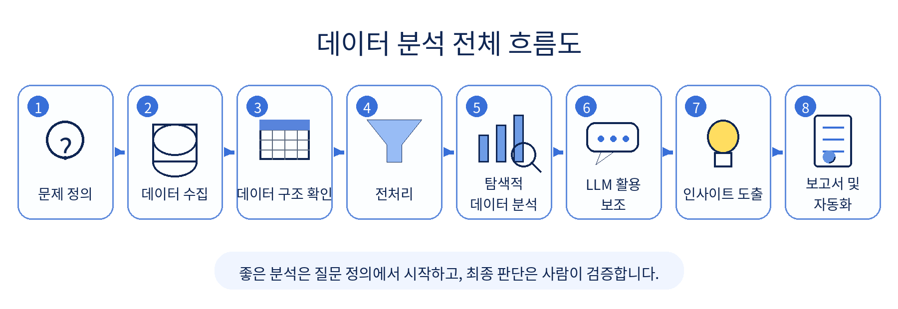
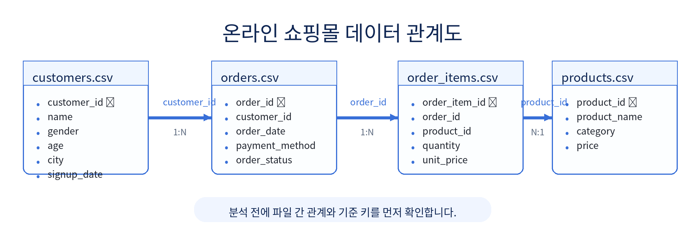

# 1장. AI와 함께하는 데이터 분석의 시작

데이터 분석은 숫자를 계산하는 일로만 보이기 쉽습니다. 하지만 실제 분석은 숫자보다 질문에서 시작됩니다. 무엇이 궁금한지, 어떤 의사결정에 도움이 되어야 하는지, 지금 가진 데이터로 그 질문에 답할 수 있는지를 차례대로 확인하는 과정이 데이터 분석입니다.

예를 들어 “매출이 줄었다”는 말은 분석의 출발점일 뿐입니다. 분석을 하려면 먼저 매출을 어떤 기준으로 볼지 정해야 합니다. 전체 매출인지, 결제 완료 주문의 매출인지, 취소·환불을 제외한 순매출인지 구분해야 합니다. 기간도 정해야 합니다. 최근 1주일인지, 최근 1개월인지, 전월 대비인지, 전년 동월 대비인지에 따라 분석 결과는 달라집니다.

LLM의 등장은 이 과정을 크게 바꾸고 있습니다. ChatGPT, Gemini 같은 도구는 분석 질문을 정리하고, pandas 코드를 초안으로 작성하고, 오류 메시지를 설명하고, 그래프 해석이나 보고서 문장을 다듬는 데 도움을 줄 수 있습니다. 그러나 분석의 결론을 책임지는 주체는 여전히 사람입니다. AI는 분석가를 대신한다기보다, 분석가가 더 빠르게 생각하고 더 넓게 검토하도록 돕는 도구에 가깝습니다.

이 책은 Python 데이터 분석의 기본 흐름을 익힌 뒤, 간단한 머신러닝과 LLM 활용, 외부 데이터 수집, 보고서 작성, 자동화 개념까지 자연스럽게 확장하는 흐름으로 구성되어 있습니다. 하나의 온라인 쇼핑몰 데이터를 바탕으로 EDA, 시각화, 회귀·분류 모델, LLM 프롬프트, 보고서, 자동화 아이디어까지 연결해 봅니다.

이 장은 본격적인 코딩에 들어가기 전의 안내판입니다. 데이터 분석을 어떤 관점으로 바라봐야 하는지, LLM을 어디까지 믿고 어디서부터 검증해야 하는지, 그리고 이 책의 GitHub 저장소를 어떻게 사용하면 되는지 먼저 정리합니다.

## 이 장에서 생각해 볼 질문

이 장은 본격적인 코딩에 들어가기 전에, AI 시대의 데이터 분석을 어떤 관점으로 바라볼지 정리하는 도입부입니다. 다음 질문을 염두에 두고 읽어 보겠습니다.

- 데이터 분석은 단순히 코드를 실행하는 일일까?
- 업무 질문은 어떻게 분석 가능한 질문으로 바뀔까?
- LLM은 데이터 분석에서 어디까지 도와줄 수 있을까?
- AI가 만든 코드와 해석을 그대로 믿어도 될까?
- 좋은 데이터 분석가는 어떤 역할을 해야 할까?
- GitHub 저장소의 파일과 폴더는 어떤 순서로 사용해야 할까?
- `book` 폴더를 제외하면 실제 실습자는 어떤 파일을 중심으로 작업하게 될까?

## 1. 데이터 분석은 질문에서 시작된다

온라인 쇼핑몰 운영자가 다음과 같이 말한다고 가정해 보겠습니다.

```text
요즘 매출이 줄어든 것 같은데 왜 그런가요?
```

이 문장은 자연스러운 업무 질문입니다. 하지만 이 상태로는 바로 코드를 작성하기 어렵습니다. “요즘”이 어느 기간인지, “매출”이 주문 금액인지 결제 완료 금액인지, “줄어든 것”을 전월 대비로 볼지 전년 동월 대비로 볼지 정해야 합니다.

데이터 분석가는 이런 질문을 더 구체적인 분석 질문으로 바꿉니다.

```text
최근 6개월 동안 월별 총매출은 어떻게 변했는가?
매출 감소가 특정 상품 카테고리에서 두드러지게 나타나는가?
주문 수가 줄었는가, 객단가가 줄었는가?
신규 고객 수나 재구매 고객 수의 변화와 관련이 있는가?
결제수단이나 주문 상태별로 차이가 있는가?
```

이렇게 질문을 바꾸면 어떤 데이터가 필요한지, 어떤 컬럼을 확인해야 하는지, 어떤 그래프를 그려야 하는지 판단할 수 있습니다. 데이터 분석은 막연한 궁금증을 측정 가능한 질문으로 바꾸는 일에서 시작됩니다.

질문을 구체화할 때는 다음 네 가지를 함께 생각하면 좋습니다.

| 구분 | 확인할 내용 | 예시 |
| --- | --- | --- |
| 대상 | 무엇을 분석할 것인가? | 전체 매출, 카테고리별 매출, 고객별 구매 금액 |
| 기준 | 어떤 단위로 볼 것인가? | 월별, 지역별, 카테고리별, 고객별 |
| 비교 | 무엇과 비교할 것인가? | 전월 대비, 카테고리 간 비교, 상위 고객과 일반 고객 비교 |
| 목적 | 결과를 어디에 쓸 것인가? | 매출 원인 파악, 캠페인 기획, 재고 관리, 고객 관리 |

분석 질문이 모호하면 코드도 모호해집니다. 반대로 질문이 명확하면 필요한 데이터와 코드가 자연스럽게 정리됩니다.

예를 들어 다음 두 질문은 비슷해 보이지만 분석 방식이 다릅니다.

```text
어떤 상품이 잘 팔리나요?
```

이 질문은 판매 수량 기준으로 볼 수도 있고, 매출 기준으로 볼 수도 있습니다. 판매 수량이 많은 상품과 매출이 높은 상품은 다를 수 있습니다. 단가가 낮은 상품은 많이 팔려도 매출 기여도가 낮을 수 있고, 단가가 높은 상품은 적게 팔려도 매출 기여도가 높을 수 있습니다.

따라서 더 좋은 질문은 다음과 같습니다.

```text
상품별 총 판매 수량과 총매출을 각각 계산했을 때, 상위 상품은 어떻게 달라지는가?
```

이렇게 질문을 바꾸면 `quantity`, `unit_price`, `line_total`, `product_id`, `product_name` 같은 컬럼이 필요하다는 점이 분명해집니다.

## 2. 데이터 분석의 기본 흐름

전통적인 데이터 분석은 대체로 다음 흐름으로 진행됩니다.

1. 문제 정의
2. 데이터 수집
3. 데이터 구조 이해
4. 데이터 전처리
5. 탐색적 데이터 분석(EDA)
6. 데이터 시각화
7. 인사이트 도출
8. 보고서 작성
9. 의사결정 또는 후속 실험 제안

AI와 LLM을 활용하는 분석에서도 이 기본 흐름은 크게 달라지지 않습니다. 달라지는 것은 각 단계에서 도움을 받을 수 있는 방식입니다. 예를 들어 LLM은 분석 질문 후보를 제안하거나, pandas 코드 초안을 작성하거나, 그래프 해석 문장을 정리하는 데 도움을 줄 수 있습니다.

이 책에서는 여기에 두 가지 흐름을 더합니다. 하나는 머신러닝입니다. EDA와 시각화가 “무슨 일이 있었는가”를 이해하는 데 가깝다면, 머신러닝은 “앞으로 어떤 일이 일어날 가능성이 있는가”를 예측하는 방향으로 확장됩니다. 다른 하나는 자동화입니다. 반복되는 분석 과정을 보고서 생성이나 파이프라인 형태로 연결하면 분석 결과를 더 안정적으로 재사용할 수 있습니다.

```text
문제 정의
→ 데이터 수집
→ 데이터 구조 이해
→ 전처리
→ EDA
→ 시각화
→ 머신러닝 기초 모델링
→ LLM을 활용한 코드·해석 보조
→ 보고서 작성
→ 외부 데이터 확장
→ 자동화와 파이프라인
```

아래 그림은 이 책에서 다룰 전체 데이터 분석 흐름을 요약한 것입니다.

<figure class="figure">
  
  <figcaption>그림 1-1. 데이터 분석 전체 흐름도</figcaption>
</figure>

각 단계의 의미를 조금 더 자세히 보면 다음과 같습니다.

| 단계 | 핵심 질문 | 이 책에서 다루는 내용 |
| --- | --- | --- |
| 문제 정의 | 무엇을 알고 싶은가? | 업무 질문을 분석 질문으로 바꾸기 |
| 데이터 수집 | 어떤 데이터가 필요한가? | 샘플 CSV, 외부 API, 크롤링 개념 |
| 데이터 구조 이해 | 행과 열은 무엇을 의미하는가? | CSV 읽기, 컬럼 확인, 데이터 타입 확인 |
| 전처리 | 분석 가능한 상태인가? | 결측치, 중복, 날짜, 문자열, 이상값 처리 |
| EDA | 어떤 패턴이 보이는가? | 그룹별 집계, 비교, 가설 만들기 |
| 시각화 | 결과를 어떻게 보여줄 것인가? | 막대그래프, 선그래프, 히스토그램, 산점도 |
| 머신러닝 | 예측할 수 있는가? | 회귀, 분류, train/test split, 평가 지표 |
| LLM 활용 | 더 빠르게 시작할 수 있는가? | 프롬프트 작성, 코드 초안, 해석 문장 검토 |
| 보고서 | 어떻게 전달할 것인가? | 결과 요약, 한계, 다음 단계 제안 |
| 자동화 | 반복할 수 있는가? | 스크립트, 파이프라인, Make/n8n/Airflow 개념 |

중요한 점은 LLM이 흐름의 일부를 빠르게 도와줄 수는 있지만, 분석 질문을 정의하고 최종 결과를 검증하는 책임은 사람에게 있다는 것입니다.

## 3. LLM은 데이터 분석을 어떻게 바꾸는가

LLM을 잘 활용하면 분석 과정의 출발 속도를 높일 수 있습니다. 특히 처음 데이터를 받았을 때 “무엇부터 봐야 할지” 막막한 상황에서 유용합니다.

예를 들어 온라인 쇼핑몰 데이터가 있다고 할 때, 다음과 같은 요청을 할 수 있습니다.

```text
온라인 쇼핑몰의 고객, 상품, 주문, 주문상세 데이터가 있습니다.
매출 현황과 고객 구매 패턴을 분석하려고 합니다.
초보 데이터 분석자가 먼저 확인해야 할 분석 질문 10개를 제안해 주세요.
각 질문마다 필요한 데이터 파일과 분석 방법을 함께 설명해 주세요.
```

LLM은 이 요청에 대해 월별 매출 추이, 카테고리별 매출, 고객군별 구매 패턴, 주문 취소율, 재구매 여부 같은 분석 관점을 제안할 수 있습니다. 이런 답변은 분석을 시작할 때 생각을 정리하는 데 도움이 됩니다.

LLM이 특히 잘 도와주는 일은 다음과 같습니다.

- 막연한 업무 질문을 분석 질문으로 바꾸기
- 데이터 컬럼의 의미를 추정하고 확인할 항목 제안하기
- pandas, matplotlib, scikit-learn 코드 초안 만들기
- 오류 메시지를 쉬운 말로 설명하기
- 그래프와 표를 해석하는 초안 작성하기
- 보고서 문장을 더 명확하게 다듬기
- 빠뜨린 검토 항목을 체크리스트로 만들기

하지만 LLM의 답변은 분석의 결론이 아니라 출발점입니다. LLM은 실제 데이터를 직접 이해하는 사람이 아닙니다. 사용자가 제공한 설명, 일부 샘플, 일반적인 패턴을 바탕으로 그럴듯한 답을 생성합니다. 따라서 답변이 자연스럽게 보인다고 해서 곧바로 맞는 분석이라고 판단해서는 안 됩니다.

LLM을 사용할 때는 다음처럼 역할을 나누어 생각하는 것이 좋습니다.

| 작업 | LLM에게 맡길 수 있는 부분 | 사람이 해야 하는 부분 |
| --- | --- | --- |
| 질문 만들기 | 분석 질문 후보 제안 | 현재 데이터로 답할 수 있는지 판단 |
| 코드 작성 | pandas/시각화/ML 코드 초안 | 컬럼명, 데이터 타입, 실행 결과 검증 |
| 오류 해결 | 오류 메시지 원인 설명 | 실제 환경과 파일 경로 확인 |
| 해석 작성 | 보고서 문장 초안 | 데이터에 없는 원인 단정 제거 |
| 발표 준비 | 발표 흐름과 문장 정리 | 핵심 수치와 근거 확인 |

좋은 활용 방식은 “LLM이 답을 내고 사람이 복사한다”가 아니라, “LLM이 초안을 만들고 사람이 검토한다”에 가깝습니다.

## 4. LLM이 대신할 수 없는 것

LLM은 분석을 도와줄 수 있지만, 다음을 자동으로 보장하지는 못합니다.

- 실제 데이터가 정확한지 확인하기
- 컬럼명이 현재 코드와 일치하는지 검증하기
- 결측치나 이상치가 분석에 미치는 영향 판단하기
- 회사나 프로젝트의 내부 맥락 이해하기
- 머신러닝 모델의 성능이 충분한지 판단하기
- 그래프와 보고서 해석이 데이터보다 과장되지 않았는지 확인하기
- 개인정보와 민감정보를 안전하게 처리하기

예를 들어 LLM이 “고객 연령대별 매출을 분석하세요”라고 제안했다고 해도, 실제 `customers.csv`에 `age` 컬럼이 없다면 그 분석은 바로 수행할 수 없습니다. 이 경우 연령대 분석을 포기하거나, 다른 데이터에서 나이를 가져올 수 있는지 확인해야 합니다.

LLM이 작성한 코드는 실행해 봐야 합니다. LLM이 작성한 해석은 실제 집계 결과와 비교해야 합니다. LLM이 작성한 보고서는 데이터가 말하는 범위를 넘어 과장하고 있지 않은지 사람이 확인해야 합니다.

AI 시대의 데이터 분석가는 단순히 코드를 많이 작성하는 사람이 아닙니다. 더 중요한 역할은 질문을 정의하고, 분석 과정을 설계하고, 결과를 검증하는 것입니다. 좋은 분석가는 계속해서 다음과 같은 질문을 던집니다.

- 이 분석은 어떤 의사결정에 도움이 되는가?
- 이 질문에 답하려면 어떤 데이터가 필요한가?
- 현재 데이터로 정말 답할 수 있는가?
- LLM이 제안한 분석이 우리 상황에 맞는가?
- 같은 결과를 다르게 해석할 가능성은 없는가?
- 보고서 문장이 데이터보다 앞서가고 있지는 않은가?

## 5. 이 책에서 다룰 온라인 쇼핑몰 데이터

이 책에서는 하나의 가상 온라인 쇼핑몰 데이터를 중심으로 분석을 진행합니다. 실제 개인정보가 아니라 Faker로 생성한 실습용 데이터이므로 안전하게 사용할 수 있습니다.

온라인 쇼핑몰 운영자가 궁금해할 만한 질문은 다음과 같습니다.

- 이번 달 매출은 증가했는가?
- 어떤 상품 카테고리가 잘 팔리는가?
- 어떤 고객군이 많이 구매하는가?
- 매출 감소가 발생했다면 원인은 무엇인가?
- 주문이 취소될 가능성이 높은 조건은 무엇인가?
- 다음 주문 금액이나 매출을 예측할 수 있는가?
- 어떤 마케팅 액션을 제안할 수 있는가?

처음에는 단순한 집계와 시각화로 시작하지만, 뒤로 갈수록 머신러닝과 LLM 활용으로 확장합니다. 예를 들어 회귀 모델로 주문 금액이나 매출을 예측하고, 분류 모델로 주문 취소 여부나 구매 가능성을 예측해 볼 수 있습니다. 이후 LLM을 활용해 분석 질문을 정리하고, 코드 초안을 생성하고, 결과 해석과 보고서 문장을 다듬는 방식으로 연결합니다.

이 책에서 사용할 주요 데이터 파일은 다음 4개입니다.

| 파일 | 역할 | 주요 컬럼 예시 |
| --- | --- | --- |
| `data/raw/customers.csv` | 고객 정보 | `customer_id`, `name`, `gender`, `age`, `city`, `signup_date` |
| `data/raw/products.csv` | 상품 정보 | `product_id`, `product_name`, `category`, `price` |
| `data/raw/orders.csv` | 주문 정보 | `order_id`, `customer_id`, `order_date`, `payment_method`, `order_status` |
| `data/raw/order_items.csv` | 주문 상세 정보 | `order_item_id`, `order_id`, `product_id`, `quantity`, `unit_price` |

이 4개 파일은 서로 연결되어 있습니다. `orders.csv`의 `customer_id`는 `customers.csv`의 `customer_id`와 연결됩니다. `order_items.csv`의 `order_id`는 `orders.csv`의 `order_id`와 연결됩니다. `order_items.csv`의 `product_id`는 `products.csv`의 `product_id`와 연결됩니다.

```text
customers.customer_id  ── orders.customer_id
orders.order_id        ── order_items.order_id
products.product_id    ── order_items.product_id
```

파일을 연결한다는 것은 두 표에서 같은 의미를 가진 기준 컬럼을 사용해 하나의 분석용 표로 합친다는 뜻입니다. 예를 들어 고객별 구매금액을 분석하려면 `customers.csv`, `orders.csv`, `order_items.csv`를 연결해야 합니다. 상품 카테고리별 매출을 분석하려면 `products.csv`와 `order_items.csv`를 연결해야 합니다.

<figure class="figure">
  
  <figcaption>그림 1-2. 온라인 쇼핑몰 데이터 관계도</figcaption>
</figure>

이 장에서는 아직 모든 파일을 코드로 분석하지 않습니다. 먼저 데이터가 어떤 업무 질문과 연결되는지 이해하는 데 집중합니다. 실제 CSV 읽기, 데이터 구조 확인, 전처리, 시각화는 다음 장부터 차례대로 다룹니다.

## 6. EDA에서 머신러닝까지

초기 데이터 분석에서는 주로 “무슨 일이 있었는가”를 확인합니다. 월별 매출이 늘었는지 줄었는지, 어떤 카테고리가 많이 팔렸는지, 어떤 고객군의 구매금액이 높은지 살펴봅니다. 이런 과정을 탐색적 데이터 분석, 즉 EDA라고 부릅니다.

머신러닝은 여기에서 한 걸음 더 나아갑니다. 이미 발생한 데이터를 바탕으로 새로운 데이터의 값을 예측하거나, 특정 상태에 속할 가능성을 판단합니다.

이 책에서 다룰 머신러닝 실습은 복잡한 이론보다 흐름을 이해하는 데 초점을 둡니다.

| 구분 | 예시 질문 | 대표 모델 |
| --- | --- | --- |
| 회귀 | 주문 금액이나 매출을 예측할 수 있을까? | Linear Regression, RandomForestRegressor |
| 분류 | 주문이 취소될 가능성이 높은가? | Logistic Regression, RandomForestClassifier |

회귀는 숫자를 예측하는 문제입니다. 예를 들어 고객 정보, 상품 카테고리, 수량, 가격 정보를 바탕으로 주문 금액을 예측할 수 있습니다. 분류는 정해진 범주를 예측하는 문제입니다. 예를 들어 주문 상태가 `completed`인지 `cancelled`인지 예측하는 문제를 생각해 볼 수 있습니다.

머신러닝을 배울 때 중요한 것은 모델 이름을 많이 외우는 것이 아닙니다. 어떤 컬럼을 입력값으로 사용할지, 무엇을 예측할지, 학습 데이터와 테스트 데이터를 어떻게 나눌지, 결과를 어떤 지표로 평가할지 이해하는 것이 더 중요합니다.

머신러닝 실습에서 특히 조심해야 할 개념은 데이터 누수입니다. 예를 들어 주문 취소 여부를 예측하면서 `order_status`를 입력값으로 사용하면, 모델은 정답을 미리 보고 학습하는 셈입니다. 겉으로는 성능이 높아 보이지만 실제 예측 모델로는 사용할 수 없습니다. 이 책에서는 이런 실수를 피하기 위해 입력값과 예측 대상을 분리하는 연습을 반복합니다.

## 7. LLM과 함께 분석할 때의 기록 습관

LLM을 분석에 사용했다면 어떤 질문을 입력했고 어떤 답변을 참고했는지 기록해 두는 것이 좋습니다. 이를 프롬프트 로그라고 부를 수 있습니다.

프롬프트 로그가 필요한 이유는 다음과 같습니다.

- 분석 과정의 재현성을 높일 수 있습니다.
- LLM이 어떤 가정을 했는지 확인할 수 있습니다.
- 잘못된 답변이 분석에 반영되었는지 추적할 수 있습니다.
- 팀 프로젝트에서 다른 사람이 분석 과정을 이해할 수 있습니다.
- 본인의 판단과 AI의 도움을 구분할 수 있습니다.

프롬프트 로그에는 모든 대화를 길게 복사할 필요는 없습니다. 분석에 영향을 준 주요 질문, LLM의 핵심 답변, 실제 반영 여부를 간단히 적어 두면 충분합니다.

| 항목 | 기록 예시 |
| --- | --- |
| 사용 목적 | 카테고리별 매출 분석 질문 생성 |
| 입력 프롬프트 | “온라인 쇼핑몰 주문 데이터로 확인할 분석 질문을 제안해 주세요.” |
| LLM 답변 요약 | 월별 매출, 카테고리별 매출, 고객군별 구매 패턴 제안 |
| 실제 반영 여부 | 월별 매출과 카테고리별 매출만 반영 |
| 검증 내용 | 실제 컬럼 존재 여부와 집계 결과 확인 |

기록 습관은 단순한 형식이 아닙니다. AI를 활용한 분석에서 신뢰를 확보하기 위한 최소한의 장치입니다. 특히 팀 프로젝트나 과제에서는 “LLM을 사용했다”는 사실보다 “어떻게 검증했는가”가 더 중요합니다.

## 8. 개인정보와 보안 원칙

실제 고객 이름, 전화번호, 이메일, 주소, 결제 정보 같은 개인정보를 LLM에 그대로 입력하면 안 됩니다. 회사 내부 매출 자료, 계약 정보, 비공개 전략 자료도 외부 LLM에 입력해서는 안 됩니다.

실무에서는 다음 원칙을 지켜야 합니다.

- 개인정보는 제거하거나 익명화합니다.
- 내부 기밀 데이터는 외부 LLM에 입력하지 않습니다.
- 필요한 경우 전체 데이터가 아니라 일부 샘플 구조만 제공합니다.
- API Key, 비밀번호, 토큰은 절대 프롬프트에 넣지 않습니다.
- 조직의 보안 정책을 먼저 확인합니다.

이 책의 실습 데이터는 가상으로 생성한 데이터입니다. 하지만 수업이나 실무 프로젝트에서 실제 데이터를 사용할 때는 항상 보안과 개인정보 보호를 먼저 생각해야 합니다.

LLM에게 데이터를 설명할 때는 원본 행 전체를 넣기보다 다음과 같은 요약 정보를 사용하는 것이 좋습니다.

```text
데이터셋: orders.csv
행 수: 300
컬럼: order_id, customer_id, order_date, payment_method, order_status
분석 목적: 월별 주문 수와 주문 상태별 비중 확인
주의: 실제 고객명이나 결제 정보는 제공하지 않음
```

이 정도 정보만으로도 LLM은 분석 방향이나 코드 초안을 제안할 수 있습니다. 원본 데이터를 그대로 입력하지 않는 습관은 AI 시대의 기본 데이터 보안 습관입니다.

## 9. GitHub 저장소는 어떻게 사용할까

이 책의 실습은 GitHub 저장소를 기준으로 진행합니다. 저장소는 단순히 파일을 내려받는 공간이 아니라, 코드와 데이터, Notebook, 보고서, 환경 설정을 하나의 프로젝트 단위로 관리하는 작업 공간입니다.

수업이나 개인 실습에서는 원본 저장소를 그대로 수정하기보다, 본인 계정에 개인 실습 저장소를 만든 뒤 사용하는 방식을 권장합니다. 예를 들어 저장소 이름을 `my-llm-data-analysis-course`로 만들고, 그 저장소를 내 PC에 clone해서 실습합니다.

실습자가 실제로 자주 사용하게 될 폴더와 파일은 다음과 같습니다. 여기서는 강의안 원고가 들어 있는 `book` 폴더는 제외하고 설명합니다.

```text
my-llm-data-analysis-course/
├─ data/
│  ├─ raw/
│  ├─ processed/
│  └─ external/
├─ notebooks/
├─ scripts/
├─ reports/
│  └─ figures/
├─ prompts/
├─ src/
├─ .env.example
├─ .gitignore
├─ README.md
└─ requirements.txt
```

각 위치의 역할은 다음과 같습니다.

| 위치 | 역할 | 실습자가 하는 일 |
| --- | --- | --- |
| `data/raw/` | 원본 또는 샘플 CSV 저장 | `generate_sample_data.py`로 만든 CSV 확인 |
| `data/processed/` | 전처리된 CSV 저장 | 결측치·타입 정리 후 clean 파일 저장 |
| `data/external/` | 외부 데이터 저장 | 공공데이터, API, 크롤링 결과 저장 |
| `notebooks/` | 주차별 실습 Notebook | 코드를 실행하고 결과와 해석 기록 |
| `scripts/` | 반복 실행용 Python 스크립트 | 샘플 데이터 생성, 자동화 코드 실행 |
| `reports/` | 분석 결과와 보고서 저장 | CSV 요약표, Markdown 보고서 저장 |
| `reports/figures/` | 그래프 이미지 저장 | 시각화 결과 PNG 저장 |
| `prompts/` | LLM 프롬프트 예시 저장 | 분석 질문, 코드 생성, 검증 프롬프트 참고 |
| `src/` | 재사용 가능한 Python 코드 | 함수나 모듈 형태 코드 관리 |
| `.env.example` | 환경변수 예시 | API Key 이름 확인 후 `.env` 작성 |
| `.gitignore` | Git에서 제외할 파일 목록 | `.env`, `.venv`, 캐시 파일 제외 확인 |
| `requirements.txt` | 필요한 패키지 목록 | 가상환경에 패키지 설치 |
| `README.md` | 저장소 안내 | 설치, 실행, 제출 흐름 확인 |

분석을 진행하다 보면 파일이 계속 늘어납니다. 이때 폴더 역할을 지키면 나중에 결과를 찾기 쉽고, 다른 사람에게 프로젝트를 설명하기도 쉬워집니다.

## 10. `my-llm-data-analysis-course`를 clone해서 시작하기

개인 실습 저장소가 준비되었다면 내 PC로 clone합니다. 아래 예시에서 `본인아이디`는 자신의 GitHub 계정명으로 바꿉니다.

```bash
git clone https://github.com/본인아이디/my-llm-data-analysis-course.git
cd my-llm-data-analysis-course
```

VS Code가 설치되어 있다면 프로젝트 폴더를 바로 열 수 있습니다.

```bash
code .
```

Windows PowerShell 기준으로 가상환경을 만들고 활성화합니다.

```powershell
python -m venv .venv
.\.venv\Scripts\Activate.ps1
python -m pip install --upgrade pip
pip install -r requirements.txt
```

PowerShell에서 실행 정책 오류가 발생하면 현재 창에서만 임시로 허용할 수 있습니다.

```powershell
Set-ExecutionPolicy -Scope Process -ExecutionPolicy Bypass
.\.venv\Scripts\Activate.ps1
```

macOS나 Linux에서는 다음 명령을 사용합니다.

```bash
python3 -m venv .venv
source .venv/bin/activate
python -m pip install --upgrade pip
pip install -r requirements.txt
```

설치가 끝났다면 샘플 데이터를 생성합니다.

```bash
python scripts/generate_sample_data.py
```

정상적으로 실행되면 `data/raw/` 폴더에 다음 파일이 만들어집니다.

```text
customers.csv
products.csv
orders.csv
order_items.csv
```

이제 Notebook을 열어 데이터를 확인할 수 있습니다. VS Code에서 `notebooks/` 폴더를 열고 주차별 Notebook을 실행합니다. Notebook을 실행할 때는 오른쪽 위 커널이 방금 만든 `.venv` 환경으로 선택되어 있는지 확인합니다.

처음 확인할 수 있는 간단한 코드는 다음과 같습니다.

```python
from pathlib import Path
import pandas as pd

print(Path.cwd())

customers = pd.read_csv("data/raw/customers.csv")
customers.head()
```

만약 Notebook이 `notebooks` 폴더 기준으로 실행되어 파일을 찾지 못한다면 경로를 다음처럼 바꿔야 할 수 있습니다.

```python
customers = pd.read_csv("../data/raw/customers.csv")
customers.head()
```

경로 오류가 발생했을 때는 파일이 없는지부터 의심하기보다, 현재 코드가 어느 폴더 기준으로 실행되고 있는지 먼저 확인하는 것이 좋습니다.

## 11. 실습자는 `book` 폴더를 어떻게 봐야 할까

`book` 폴더는 강의안 원고와 ebook 출력을 위한 자료가 들어 있는 곳입니다. 실습자가 매주 직접 수정해야 하는 핵심 작업 공간은 보통 `notebooks`, `data`, `reports`, `scripts`입니다.

따라서 처음 실습할 때는 다음처럼 역할을 구분하면 좋습니다.

| 구분 | 주로 보는 위치 | 설명 |
| --- | --- | --- |
| 강의 내용 읽기 | `book/chapters/` | 각 장의 설명 원고 |
| 코드 실행 | `notebooks/` | 주차별 실습 Notebook |
| 데이터 확인 | `data/raw/`, `data/processed/` | 원본과 전처리 결과 |
| 결과 저장 | `reports/`, `reports/figures/` | 분석 표, 보고서, 그래프 |
| 반복 실행 | `scripts/` | 데이터 생성이나 자동화 스크립트 |
| 환경 설정 | `requirements.txt`, `.env.example` | 패키지와 API Key 설정 |

이 책을 읽는 동안 `book/chapters/`는 설명서처럼 활용하고, 실제 실습 결과는 `notebooks/`와 `reports/`에 남기는 방식이 가장 자연스럽습니다.

예를 들어 4장에서 pandas 기본 분석을 학습한다면 다음 흐름으로 진행할 수 있습니다.

```text
book/chapters/ch04_pandas_data_questions.md 읽기
→ notebooks/ch04_pandas_basic.ipynb 열기
→ data/raw/*.csv 불러오기
→ pandas 코드 실행
→ reports/ch04_*.csv 저장
→ 필요한 경우 git commit
```

GitHub에 실습 기록을 남길 때는 다음 순서를 사용합니다.

```bash
git status
git add notebooks reports data/processed
git commit -m "Add chapter 4 pandas practice results"
git push origin main
```

다만 `data/raw/`나 `data/processed/` 파일을 GitHub에 올릴지는 수업 운영 방식에 따라 달라질 수 있습니다. 실제 개인정보나 민감 데이터가 포함되어 있다면 절대 업로드하면 안 됩니다. 이 책의 샘플 데이터는 가상 데이터이지만, 실무 데이터로 바꾸는 순간 보안 기준을 다시 확인해야 합니다.

## 12. 이 저장소로 공부하는 추천 흐름

처음부터 모든 파일을 이해하려고 하면 복잡하게 느껴질 수 있습니다. 다음 순서로 접근하면 부담이 줄어듭니다.

1. `README.md`를 읽고 전체 목적과 설치 방법을 확인합니다.
2. 저장소를 clone하고 VS Code에서 엽니다.
3. 가상환경을 만들고 `requirements.txt`로 패키지를 설치합니다.
4. `scripts/generate_sample_data.py`를 실행해 샘플 데이터를 만듭니다.
5. `data/raw/`에 CSV 4개가 생성되었는지 확인합니다.
6. `notebooks/`에서 2장 또는 3장 Notebook부터 실행합니다.
7. 각 장의 강의안은 `book/chapters/`에서 읽습니다.
8. 분석 결과는 `reports/`와 `reports/figures/`에 저장합니다.
9. LLM을 사용했다면 프롬프트와 검증 내용을 간단히 기록합니다.
10. 중간·기말 프로젝트에서는 Notebook, 보고서, 그래프, LLM 활용 기록을 함께 정리합니다.

이 흐름을 따르면 저장소는 단순한 파일 모음이 아니라 하나의 분석 프로젝트 작업 공간이 됩니다. 같은 구조를 다른 데이터 프로젝트에도 그대로 적용할 수 있습니다.

## 13. LLM과 함께 실습할 때의 좋은 질문 예시

저장소를 clone하고 실습하다 보면 파일 경로 오류, 패키지 오류, 컬럼명 오류, 그래프 한글 깨짐 같은 문제가 자주 발생합니다. 이때 LLM에게 질문할 수 있지만, 질문에는 상황을 구체적으로 담아야 합니다.

파일 경로 오류가 발생했다면 다음처럼 질문할 수 있습니다.

```text
VS Code에서 Jupyter Notebook을 실행하고 있습니다.
프로젝트 폴더 이름은 my-llm-data-analysis-course입니다.
데이터 파일은 data/raw/customers.csv에 있습니다.
현재 실행한 코드는 pd.read_csv("data/raw/customers.csv")입니다.
FileNotFoundError가 발생했습니다.
현재 작업 폴더를 확인하고 상대 경로를 고치는 방법을 설명해 주세요.
```

pandas 컬럼명 오류가 발생했다면 다음처럼 질문할 수 있습니다.

```text
customers DataFrame의 실제 컬럼은 다음과 같습니다.
customer_id, name, gender, age, city, signup_date

LLM이 작성한 코드에서는 customer_age라는 컬럼을 사용해 KeyError가 발생했습니다.
실제 컬럼명에 맞게 코드를 수정하고, 왜 오류가 발생했는지 설명해 주세요.
```

그래프 한글 깨짐이 발생했다면 다음처럼 질문할 수 있습니다.

```text
Windows 환경에서 matplotlib 그래프 제목의 한글이 깨집니다.
VS Code Notebook에서 실행 중입니다.
한글 폰트를 설정하는 코드를 알려 주세요.
음수 기호가 깨지지 않게 하는 설정도 포함해 주세요.
```

좋은 질문은 오류 해결 시간을 줄여 줍니다. 반대로 “안 돼요”, “오류가 나요”처럼 상황이 부족한 질문은 LLM도 정확히 답하기 어렵습니다.

## 14. 개인정보와 API Key는 저장소에 올리지 않는다

11장 이후에는 LLM API나 외부 API를 활용하는 흐름이 등장합니다. 이때 `.env.example` 파일을 복사해 `.env` 파일을 만들고, 실제 키는 `.env`에만 저장합니다.

Windows PowerShell에서는 다음처럼 복사할 수 있습니다.

```powershell
Copy-Item .env.example .env
```

macOS나 Linux에서는 다음 명령을 사용할 수 있습니다.

```bash
cp .env.example .env
```

`.env` 파일에는 다음처럼 개인 키를 입력합니다.

```text
GEMINI_API_KEY=여기에_개인_API_KEY_입력
NAVER_CLIENT_ID=여기에_네이버_CLIENT_ID_입력
NAVER_CLIENT_SECRET=여기에_네이버_CLIENT_SECRET_입력
```

하지만 `.env` 파일은 절대 GitHub에 올리면 안 됩니다. `.gitignore`에 `.env`가 포함되어 있는지 확인해야 합니다.

```text
.env
.venv/
__pycache__/
.ipynb_checkpoints/
```

GitHub에 올리기 전에는 다음 명령으로 어떤 파일이 commit 대상인지 확인합니다.

```bash
git status
```

만약 `.env`가 보인다면 commit하기 전에 반드시 제외해야 합니다. API Key가 공개 저장소에 올라가면 악용될 수 있고, 비용이 발생할 수 있습니다.

## 15. 앞으로의 여정

이 책은 다음 흐름으로 진행됩니다.

| 구간 | 내용 |
| --- | --- |
| 1장 | AI 기반 데이터 분석의 관점과 전체 흐름 이해 |
| 2장 | Python, VS Code, Jupyter, GitHub 기반 개발 환경 준비 |
| 3~6장 | 데이터 구조 이해, pandas, 전처리, EDA, 시각화 |
| 7~10장 | 머신러닝 기초, 회귀 실습, 분류 실습 |
| 11~12장 | LLM 프롬프트, 코드 생성, 결과 검증, 보고서 작성 |
| 13장 | 공공데이터, 네이버 API, 크롤링을 활용한 외부 데이터 수집 |
| 14장 | Make, n8n, Airflow를 활용한 자동화와 파이프라인 개념 |
| 15장 | 최종 프로젝트 발표와 정리 |

처음부터 모든 도구를 완벽히 이해할 필요는 없습니다. 중요한 것은 하나의 데이터 분석 프로젝트가 어떤 순서로 확장되는지 경험하는 것입니다. 작은 질문에서 시작해, 데이터를 정리하고, 그래프로 확인하고, 간단한 예측 모델을 만들고, LLM의 도움으로 결과를 설명하고, 마지막에는 보고서와 자동화 아이디어로 연결해 봅니다.

이 책의 저장소를 clone해서 직접 실행해 보면, 데이터 분석이 단순한 코드 조각의 모음이 아니라 하나의 프로젝트 흐름이라는 점을 자연스럽게 이해할 수 있습니다. 다음 장에서는 실제 분석 환경을 준비합니다. Python, VS Code, Jupyter Notebook, GitHub를 이용해 데이터를 다룰 수 있는 기본 작업 공간을 구성합니다.
