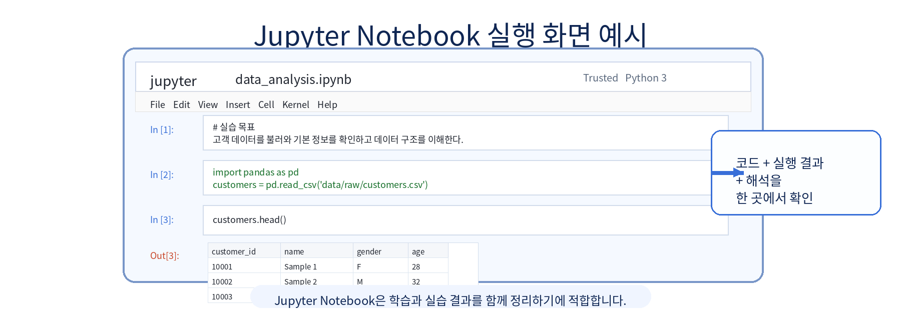
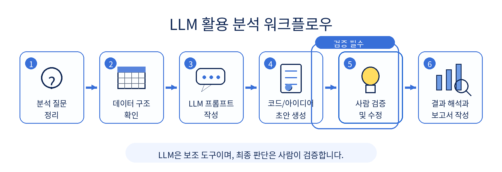

# 1장 AI/LLM 기반 데이터 분석 개요

이 장에서는 앞으로 15주 동안 진행할 "온라인 쇼핑몰 고객·매출 데이터 분석 프로젝트"의 전체 흐름을 이해합니다. 아직 복잡한 통계나 머신러닝을 다루지는 않습니다. 대신 데이터 분석이 어떤 순서로 진행되는지, LLM을 어디에 활용할 수 있는지, 그리고 사람이 반드시 확인해야 하는 부분이 무엇인지 익히는 데 집중합니다.

이번 장의 핵심은 "AI가 분석을 대신해 준다"가 아니라 "AI를 활용해 분석 과정을 더 빠르고 명확하게 만들 수 있다"는 관점을 갖는 것입니다. 좋은 데이터 분석가는 코드를 많이 아는 사람만이 아니라, 좋은 질문을 만들고 결과를 검증할 수 있는 사람입니다.

## 수업 시간 구성

| 구성 | 권장 시간 | 해당 섹션 |
| --- | ---: | --- |
| 핵심 개념 이해 | 40분 | 섹션 3 |
| 실습 시나리오 이해 | 20분 | 섹션 4 |
| 데이터 구조 확인 실습 | 60분 | 섹션 5 |
| LLM 프롬프트 실습 | 40분 | 섹션 6 |
| 결과 해석 및 정리 | 20분 | 섹션 7, 8 |
| **소계** | **3시간** | |
| 연습 문제 | 60~90분 | 섹션 9 |

기본 수업은 약 3시간을 기준으로 구성되어 있습니다. 추가 실습과 연습 문제까지 포함하면 최대 5시간 분량으로 확장할 수 있습니다.

## 1. 학습 목표

이 장을 마치면 학습자는 다음을 할 수 있습니다.

- 데이터 분석의 기본 흐름을 설명할 수 있습니다.
- LLM이 데이터 분석에서 도와줄 수 있는 영역과 도와줄 수 없는 영역을 구분할 수 있습니다.
- 온라인 쇼핑몰 운영자의 질문을 데이터 분석 문제로 바꾸는 방법을 이해할 수 있습니다.
- pandas로 CSV 파일의 기본 구조를 확인할 수 있습니다.
- LLM에게 분석 계획을 요청하는 프롬프트를 작성할 수 있습니다.
- LLM이 제안한 결과를 그대로 믿지 않고 검증해야 하는 이유를 설명할 수 있습니다.
- 분석 과정에서 LLM 사용 기록(프롬프트 로그)과 데이터 보안이 중요한 이유를 이해할 수 있습니다.

프롬프트 로그는 LLM에게 입력한 질문과 받은 답변을 기록해 두는 것을 의미합니다. 자세한 내용은 3.8절에서 다룹니다.

## 2. 이번 장에서 만들 결과물

이번 장에서는 완성된 분석 보고서를 만들기보다, 앞으로 분석을 시작하기 위한 준비물을 만듭니다. 분석을 잘하려면 처음부터 그래프를 그리거나 결론을 쓰기보다, 데이터와 질문을 먼저 정리해야 합니다.

이번 장의 결과물은 다음과 같습니다.

- 데이터 분석 업무 흐름도
- 온라인 쇼핑몰 분석 질문 목록
- 간단한 데이터 구조 확인 코드
- LLM 분석 프롬프트 예시
- LLM 활용 자기 점검표 작성 (섹션 8의 체크리스트 활용)

이 장에서 필요한 그림과 화면 예시는 각 개념이 등장하는 위치에 함께 배치합니다. 그림은 내용을 암기하기 위한 것이 아니라, 분석 흐름과 데이터 관계를 빠르게 이해하기 위한 보조 자료입니다.

## 3. 핵심 개념

### 3.1 데이터 분석이란 무엇인가

데이터 분석은 데이터를 읽고, 정리하고, 질문에 답할 수 있는 근거를 찾는 과정입니다. 여기서 중요한 단어는 "근거"입니다. 단순히 숫자를 보는 것만으로는 분석이라고 하기 어렵습니다. 숫자를 통해 어떤 질문에 답하고, 그 답이 실제 의사결정에 도움이 되어야 분석이라고 할 수 있습니다.

예를 들어 온라인 쇼핑몰 운영자가 다음과 같이 묻는다고 가정해 봅니다.

```text
요즘 매출이 줄어든 것 같은데 왜 그런가요?
```

이 질문은 일상적인 표현입니다. 데이터 분석가는 이 질문을 바로 코드로 작성하지 않습니다. 먼저 분석 가능한 질문으로 바꿔야 합니다.

```text
최근 6개월의 월별 매출 추이는 어떻게 변했는가?
매출 감소가 특정 상품 카테고리에서 주로 발생했는가?
매출 감소가 신규 고객 감소와 관련이 있는가?
주문 수가 줄었는가, 객단가가 줄었는가?
```

이처럼 데이터 분석은 막연한 궁금증을 측정 가능한 질문으로 바꾸는 일에서 시작합니다.

### 3.2 기존 데이터 분석 업무 흐름

전통적인 데이터 분석 업무는 보통 다음 순서로 진행됩니다.

1. 문제 정의
2. 데이터 수집
3. 데이터 구조 확인
4. 데이터 전처리
5. 탐색적 데이터 분석
6. 시각화
7. 인사이트 도출
8. 보고서 작성
9. 의사결정 또는 후속 실험 제안

탐색적 데이터 분석(EDA, Exploratory Data Analysis)은 데이터를 다양한 각도에서 살펴보며 패턴과 이상을 발견하는 과정입니다.

데이터 분석은 보통 문제 정의에서 시작해 데이터 수집, 구조 확인, 전처리, 탐색적 분석, 시각화, 인사이트 도출, 보고서 작성으로 이어집니다. 탐색적 분석과 보고서 작성 과정에서는 LLM을 보조적으로 활용할 수 있습니다. 아래 그림은 이 장에서 이해해야 할 전체 흐름을 요약한 것입니다.

<figure class="figure">
  
  <figcaption>그림 1-1. 데이터 분석 전체 흐름도</figcaption>
</figure>

중요한 점은 LLM이 중간 과정에서 도움을 줄 수는 있지만, 분석 질문을 정의하고 최종 결과를 검증하는 책임은 사람에게 있다는 것입니다.

초보자는 종종 5번이나 6번부터 시작하려고 합니다. 즉, 데이터를 열자마자 그래프를 그리거나 평균을 구하려고 합니다. 하지만 문제 정의가 불명확하면 분석 결과가 나와도 해석하기 어렵습니다.

예를 들어 "매출을 분석하라"는 지시는 너무 넓습니다. 반면 "최근 12개월 동안 카테고리별 매출 변화와 고객군별 구매 패턴을 비교하라"는 지시는 더 분석하기 쉽습니다. 어떤 파일이 필요한지, 어떤 컬럼을 봐야 하는지, 어떤 그래프를 만들지 판단할 수 있기 때문입니다.

### 3.3 AI와 LLM 등장 이후 달라진 분석 방식

ChatGPT, Gemini 같은 LLM은 데이터 분석 업무의 일부를 빠르게 도와줄 수 있습니다. 예를 들어 다음과 같은 작업에 유용합니다.

- 분석 질문 후보 만들기
- 데이터 컬럼 의미 추정하기
- pandas 코드 초안 작성하기
- 오류 메시지 해석하기
- 그래프 해석 초안 작성하기
- 보고서 문장 다듬기
- 누락된 분석 관점 제안하기

하지만 LLM은 실제 데이터를 직접 이해하는 사람이 아닙니다. 사용자가 제공한 설명이나 일부 샘플을 바탕으로 그럴듯한 답을 생성합니다. 따라서 LLM의 답변은 분석의 출발점으로 사용할 수 있지만, 최종 결론으로 사용해서는 안 됩니다.

예를 들어 LLM에게 "매출 감소 원인을 알려줘"라고만 입력하면, LLM은 계절성, 가격 상승, 경쟁사, 고객 이탈 같은 일반적인 원인을 제시할 수 있습니다. 그러나 실제 데이터에서 어떤 원인이 맞는지는 별도로 확인해야 합니다.

### 3.4 LLM이 잘하는 일

LLM은 다음과 같은 일에 특히 유용합니다.

- 막연한 질문을 구체적인 분석 질문으로 바꾸기
- 분석 순서를 단계별로 정리하기
- 초보자가 이해하기 쉬운 코드 예시 만들기
- 오류 메시지를 쉬운 말로 설명하기
- 분석 결과를 보고서 문장으로 바꾸기
- 빠뜨린 검토 항목을 체크리스트로 만들기

온라인 쇼핑몰 데이터 분석에서는 LLM에게 다음과 같이 요청할 수 있습니다.

```text
온라인 쇼핑몰의 고객, 상품, 주문, 주문상세 데이터가 있습니다.
이 데이터로 매출 현황과 고객 구매 패턴을 분석하려고 합니다.
초보 데이터 분석자가 확인해야 할 분석 질문 10개를 제안해 주세요.
각 질문마다 필요한 데이터 파일과 분석 방법을 함께 설명해 주세요.
```

이런 프롬프트는 분석을 시작할 때 생각을 정리하는 데 도움이 됩니다.

### 3.5 LLM이 못하는 일

LLM은 다음을 자동으로 보장하지 못합니다.

- 실제 데이터가 정확한지 확인하기
- 결측치나 이상치가 분석에 미치는 영향 판단하기
- 회사 내부 맥락을 완전히 이해하기
- 생성한 코드가 현재 데이터 구조에 맞는지 보장하기
- 분석 결과가 통계적으로 충분한지 검증하기
- 개인정보나 민감정보를 안전하게 처리하기

LLM이 만든 코드는 실행해 봐야 합니다. LLM이 만든 해석은 데이터와 비교해야 합니다. LLM이 만든 보고서는 과장된 표현이 없는지 사람이 확인해야 합니다.

### 3.6 사람이 반드시 검증해야 하는 영역

사람이 반드시 확인해야 하는 영역은 다음과 같습니다.

- 데이터 파일이 실제로 존재하는지
- 컬럼명이 코드와 일치하는지
- 행과 열의 개수가 예상 범위인지
- 날짜, 숫자, 문자열 타입이 적절한지
- 결측치가 많은 컬럼이 있는지
- 여러 CSV 파일이 어떤 기준으로 연결되는지
- 분석 질문이 실제 데이터로 답할 수 있는 질문인지
- 그래프와 보고서 해석이 데이터보다 과장되지 않았는지

예를 들어 LLM이 "고객 연령대별 매출을 분석하세요"라고 제안했다고 해도, 실제 `customers.csv`에 `age` 컬럼이 없으면 그 분석은 바로 수행할 수 없습니다. 이 경우 연령대 분석을 포기하거나, 다른 데이터에서 나이를 가져올 수 있는지 확인해야 합니다.

### 3.7 AI/LLM 시대 데이터 분석가의 역할

AI/LLM 시대의 데이터 분석가는 단순히 코드를 작성하는 사람에 머물지 않습니다. 더 중요한 역할은 질문을 정의하고, 분석 과정을 설계하고, 결과를 검증하는 것입니다.

좋은 데이터 분석가는 다음과 같은 질문을 계속 던집니다.

- 이 분석은 어떤 의사결정에 도움이 되는가?
- 이 질문에 답하려면 어떤 데이터가 필요한가?
- 현재 데이터로 정말 답할 수 있는가?
- LLM이 제안한 분석이 우리 상황에 맞는가?
- 결과를 다르게 해석할 가능성은 없는가?
- 보고서 문장이 데이터보다 앞서가고 있지는 않은가?

이 수업에서는 Python과 LLM을 함께 사용하지만, 최종 목표는 도구 사용법만 익히는 것이 아닙니다. 데이터를 보고 좋은 질문을 만들고, 결과를 신중하게 해석하는 습관을 기르는 것이 목표입니다.

### 3.8 프롬프트 로그를 남겨야 하는 이유

LLM을 분석에 사용했다면 어떤 질문을 입력했고 어떤 답변을 참고했는지 기록해야 합니다. 이를 프롬프트 로그라고 부릅니다.

프롬프트 로그가 필요한 이유는 다음과 같습니다.

- 분석 과정의 재현성을 높일 수 있습니다.
- LLM이 어떤 가정을 했는지 확인할 수 있습니다.
- 잘못된 답변이 분석에 반영되었는지 추적할 수 있습니다.
- 과제나 프로젝트에서 본인의 판단과 LLM 도움을 구분할 수 있습니다.
- 팀 프로젝트에서 다른 사람이 분석 과정을 이해할 수 있습니다.

프롬프트 로그에는 모든 대화를 길게 복사할 필요는 없습니다. 분석에 영향을 준 주요 프롬프트와 그 답변을 요약해 두면 됩니다.

### 3.9 개인정보와 민감 데이터 입력 주의

실제 고객 이름, 전화번호, 이메일, 주소, 결제 정보 같은 개인정보를 LLM에 그대로 입력하면 안 됩니다. 회사 내부 매출 자료, 계약 정보, 비공개 전략 자료도 외부 LLM에 입력해서는 안 됩니다.

이 수업에서는 Faker로 생성한 가상의 온라인 쇼핑몰 데이터를 사용합니다. 실제 고객 데이터가 아니므로 실습에 안전합니다. 그러나 실무에서는 항상 다음 원칙을 지켜야 합니다.

- 개인정보는 제거하거나 익명화합니다.
- 내부 기밀 데이터는 외부 LLM에 입력하지 않습니다.
- 필요한 경우 일부 샘플 구조만 제공합니다.
- API Key, 비밀번호, 토큰은 절대 프롬프트에 넣지 않습니다.
- 조직의 보안 정책을 먼저 확인합니다.

## 4. 실습 시나리오

이번 수업의 전체 프로젝트는 "온라인 쇼핑몰 고객·매출 데이터 분석 프로젝트"입니다. 우리는 온라인 쇼핑몰 운영자가 여러 질문을 가지고 있다고 가정합니다.

운영자의 질문은 다음과 같습니다.

- 이번 달 매출은 증가했는가?
- 어떤 상품 카테고리가 잘 팔리는가?
- 어떤 고객군이 많이 구매하는가?
- 매출 감소가 발생했다면 원인은 무엇인가?
- 다음 달에 어떤 마케팅 액션을 할 수 있는가?

이 질문들은 처음에는 자연어로 된 업무 질문입니다. 데이터 분석을 하려면 이를 데이터로 확인 가능한 질문으로 바꿔야 합니다.

| 운영자의 질문 | 분석 질문으로 바꾼 예 |
| --- | --- |
| 이번 달 매출은 증가했는가? | 월별 총매출을 계산하고 전월 대비 증감률을 확인한다. |
| 어떤 상품 카테고리가 잘 팔리는가? | 카테고리별 총매출과 판매수량을 집계한다. |
| 어떤 고객군이 많이 구매하는가? | 성별, 연령대, 도시(city)별 구매금액을 비교한다. |
| 매출 감소 원인은 무엇인가? | 주문 수, 객단가, 카테고리별 매출 변화를 함께 확인한다. |
| 어떤 마케팅 액션을 할 수 있는가? | 구매 빈도가 높은 고객군과 성장 카테고리를 기준으로 제안한다. |

이번 교재에서 사용할 주요 데이터 파일은 다음 4개입니다.

| 파일 | 역할 | 주요 컬럼 예시 |
| --- | --- | --- |
| `data/raw/customers.csv` | 고객 정보 | `customer_id`, `name`, `gender`, `age`, `city`, `signup_date` |
| `data/raw/products.csv` | 상품 정보 | `product_id`, `product_name`, `category`, `price` |
| `data/raw/orders.csv` | 주문 정보 | `order_id`, `customer_id`, `order_date`, `payment_method`, `order_status` |
| `data/raw/order_items.csv` | 주문 상세 정보 | `order_item_id`, `order_id`, `product_id`, `quantity`, `unit_price` |

이 4개 파일은 서로 연결되어 있습니다. `orders.csv`의 `customer_id`는 `customers.csv`의 `customer_id`와 연결됩니다. `order_items.csv`의 `order_id`는 `orders.csv`의 `order_id`와 연결됩니다. `order_items.csv`의 `product_id`는 `products.csv`의 `product_id`와 연결됩니다.

텍스트로 표현하면 파일 간 관계는 다음과 같습니다.

```text
customers.customer_id  ── orders.customer_id
orders.order_id        ── order_items.order_id
products.product_id    ── order_items.product_id
```

- 고객별 구매 분석을 하려면 `customers`와 `orders`, `order_items`를 연결해야 합니다.
- 상품 카테고리별 매출 분석을 하려면 `products`와 `order_items`를 연결해야 합니다.
- 여러 파일을 연결할 때는 기준 컬럼의 의미와 중복 여부를 먼저 확인해야 합니다.

파일을 연결한다는 것은 두 표에서 같은 의미를 가진 기준 컬럼을 사용해 하나의 분석용 표로 합친다는 뜻입니다. 예를 들어 `customers.csv`와 `orders.csv`는 `customer_id`를 기준으로 연결할 수 있습니다. pandas에서는 `merge()` 함수를 사용하지만, 이 장에서는 어떤 파일이 어떤 기준으로 연결되는지만 이해하면 됩니다. `merge()`는 이후 장에서 자세히 다룹니다.

온라인 쇼핑몰 데이터는 하나의 CSV 파일만으로 분석하기 어렵습니다. 고객, 주문, 주문 상세, 상품 데이터가 서로 연결되어 있기 때문에 기준 키를 먼저 이해해야 합니다.

<figure class="figure">
  
  <figcaption>그림 1-2. 온라인 쇼핑몰 데이터 관계도</figcaption>
</figure>

예를 들어 고객별 구매금액을 분석하려면 `customers.csv`, `orders.csv`, `order_items.csv`를 연결해야 합니다. 상품 카테고리별 매출을 분석하려면 `products.csv`와 `order_items.csv`를 연결해야 합니다.

Chapter 1에서는 이 관계를 완전히 코드로 분석하지는 않습니다. 먼저 각 파일이 어떤 모양인지 확인하고, 앞으로 어떤 분석을 할 수 있을지 생각해 봅니다.

## 5. 실습 코드

앞에서 데이터 분석의 전체 흐름과 이번 프로젝트의 데이터 파일 관계를 살펴보았습니다. 이제 직접 코드로 CSV 파일을 불러와 데이터의 모양을 확인해 봅니다.

이번 장의 전체 실습은 `notebooks/ch01_ai_data_analysis_intro.ipynb`에서 실행합니다. 본문에는 핵심 코드만 제공합니다. 아래 코드는 CSV 파일이 이미 생성되어 있다는 가정하에 실행합니다. 아직 데이터가 없다면 먼저 다음 명령으로 샘플 데이터를 생성합니다.

```text
python scripts/generate_sample_data.py
```

CSV(Comma-Separated Values)는 데이터를 쉼표로 구분해 저장한 텍스트 파일입니다. 메모장으로 열면 쉼표로 나뉜 텍스트가 보이고, 엑셀로 열면 표 형태로 보입니다. pandas의 `read_csv()` 함수로 불러올 수 있습니다.

Jupyter Notebook 실행 방법은 2장에서 자세히 다룹니다. 이미 설치가 완료된 경우, 터미널에서 다음 명령어로 실행합니다.

```text
jupyter notebook
```

브라우저가 열리면 `notebooks/ch01_ai_data_analysis_intro.ipynb` 파일을 엽니다.

`FileNotFoundError`가 발생하면 샘플 데이터 파일이 아직 생성되지 않았거나, 현재 작업 폴더가 프로젝트 루트가 아닐 수 있습니다. 터미널에서 먼저 `python scripts/generate_sample_data.py`를 실행한 뒤, `data/raw` 폴더에 `customers.csv`, `products.csv`, `orders.csv`, `order_items.csv` 4개 파일이 생성되었는지 확인하고 다시 실행합니다.

이번 장의 실습은 Jupyter Notebook에서 진행합니다. Jupyter Notebook은 코드, 실행 결과, 해석을 한 화면에서 함께 정리할 수 있어 데이터 분석 입문 수업에 적합합니다.

<figure class="figure">
  
  <figcaption>그림 1-3. Jupyter Notebook 실행 화면 예시</figcaption>
</figure>

실습을 진행할 때는 코드를 실행하는 것에서 끝내지 말고, 출력 결과가 무엇을 의미하는지 간단한 문장으로 함께 기록하는 습관을 들이는 것이 좋습니다.

### 5.1 pandas 불러오기

pandas는 파이썬에서 표 형태의 데이터를 다루는 라이브러리입니다. 엑셀의 시트처럼 행(row)과 열(column)로 구성된 데이터를 쉽게 읽고, 정리하고, 계산할 수 있습니다. pandas로 읽어온 표 데이터를 DataFrame이라고 부릅니다.

`pd`는 pandas를 짧게 쓰기 위한 별칭(alias)입니다. `import pandas as pd`는 "pandas를 불러오되 앞으로 `pd`라는 이름으로 쓰겠다"는 의미입니다. 데이터 분석 커뮤니티에서 관례적으로 사용하는 표준 표기입니다.

```python
import pandas as pd
```

### 5.2 CSV 파일 4개 불러오기

다음 코드는 `data/raw` 폴더에 있는 4개의 CSV 파일을 읽어옵니다. 각 파일은 pandas DataFrame이라는 표 형태의 객체로 저장됩니다.

```python
customers = pd.read_csv("data/raw/customers.csv")
products = pd.read_csv("data/raw/products.csv")
orders = pd.read_csv("data/raw/orders.csv")
order_items = pd.read_csv("data/raw/order_items.csv")
```

### 5.3 데이터 크기 확인하기

`shape`는 데이터의 행과 열 개수를 알려줍니다. 결과는 `(행 개수, 열 개수)` 형태로 표시됩니다.

```python
print("customers:", customers.shape)
print("products:", products.shape)
print("orders:", orders.shape)
print("order_items:", order_items.shape)
```

예상 출력 예시는 다음과 같습니다.

```text
customers: (150, 6)
products: (50, 4)
orders: (300, 5)
order_items: (650, 5)
```

위 결과는 고객 데이터가 150행 6열, 상품 데이터가 50행 4열이라는 뜻입니다. 실제 숫자는 샘플 데이터 생성 방식에 따라 달라질 수 있습니다.

행 개수는 데이터가 얼마나 많은지 알려줍니다. 열 개수는 어떤 정보가 들어 있는지 대략적으로 알려줍니다. 예를 들어 `customers`가 `(150, 6)`으로 나온다면 고객 150명에 대해 6개의 정보가 있다는 뜻입니다.

### 5.4 데이터 앞부분 확인하기

`head()`는 데이터의 앞부분 몇 줄을 보여줍니다. 컬럼명과 값의 형태를 빠르게 확인할 때 사용합니다.

`head()`는 기본적으로 앞에서 5줄을 보여줍니다. 괄호 안에 숫자를 넣으면 원하는 줄 수만 볼 수 있습니다.

```python
customers.head(3)   # 앞 3줄만 보기
customers.head(10)  # 앞 10줄만 보기
```

```python
customers.head()
```

예를 들어 `customers.head()`를 실행하면 다음과 같은 형태의 결과를 볼 수 있습니다.

| customer_id | name | gender | age | city | signup_date |
|---:|---|---|---:|---|---|
| C0001 | Sample User 1 | F | 34 | Seoul | 2024-01-15 |
| C0002 | Sample User 2 | M | 41 | Busan | 2024-02-03 |

다른 파일도 같은 방식으로 확인할 수 있습니다.

```python
products.head()
# 확인 포인트: product_id 형식과 category 값의 종류를 확인합니다.
```

```python
orders.head()
# 확인 포인트: order_date 형식과 order_status 상태 값을 확인합니다.
```

```python
order_items.head()
# 확인 포인트: quantity와 unit_price가 숫자로 저장되어 있는지 확인합니다.
```

### 5.5 데이터 타입 확인하기

`info()`는 컬럼별 데이터 타입과 결측치 여부를 빠르게 확인할 수 있는 함수입니다.

```python
customers.info()
```

예상 출력 예시는 다음과 같습니다.

```text
<class 'pandas.core.frame.DataFrame'>
RangeIndex: 150 entries, 0 to 149
Data columns (total 6 columns):
 #   Column       Non-Null Count  Dtype
---  ------       --------------  -----
 0   customer_id  150 non-null    object
 1   name         150 non-null    object
 2   gender       150 non-null    object
 3   age          148 non-null    float64
 4   city         150 non-null    object
 5   signup_date  150 non-null    object
dtypes: float64(1), object(5)
memory usage: 7.2+ KB
```

위 예시에서 `Non-Null Count`가 전체 행 수보다 작으면 결측치가 있다는 뜻입니다. `Dtype`이 `object`이면 보통 문자열, `float64`나 `int64`이면 숫자형입니다. 날짜 컬럼이 `object`로 표시되면 날짜 분석 전에 `datetime` 타입으로 변환해야 합니다.

```python
products.info()
```

```python
orders.info()
```

```python
order_items.info()
```

`info()` 결과에서는 다음을 중점적으로 확인합니다.

- 컬럼 개수
- 각 컬럼의 데이터 타입
- 비어 있지 않은 값의 개수
- 숫자형, 문자형, 날짜형으로 처리해야 할 컬럼

데이터 타입은 분석에서 매우 중요합니다. 날짜가 문자열로 저장되어 있으면 월별 분석을 하기 전에 날짜 타입으로 변환해야 할 수 있습니다. 가격이나 수량이 숫자가 아니라 문자열로 저장되어 있으면 합계를 계산할 수 없습니다.

## 6. LLM 활용 프롬프트

LLM은 분석을 시작할 때 생각을 정리하는 데 도움이 됩니다. 하지만 LLM이 제안한 내용을 그대로 믿으면 안 됩니다. 프롬프트를 작성할 때는 데이터 파일, 분석 목적, 원하는 결과 형식을 구체적으로 알려주는 것이 좋습니다.

LLM은 분석 질문 정리, 데이터 구조 이해, 프롬프트 작성, 코드 초안 생성, 결과 해석 보조에 활용할 수 있습니다. 그러나 LLM이 만든 결과는 반드시 사람이 검증하고 수정해야 합니다.

프롬프트를 작성할 때는 역할을 먼저 알려주면 더 전문적이고 일관된 답변을 얻을 수 있습니다. 예를 들어 "당신은 데이터 분석가입니다"라고 지정하면, LLM이 데이터 분석 맥락에 맞춰 답변하는 경향이 있습니다. 이를 역할 설정(Role Prompting)이라고 합니다.

<figure class="figure">
  
  <figcaption>그림 1-4. LLM 활용 분석 워크플로우</figcaption>
</figure>

이 장의 프롬프트 예시는 LLM에게 분석을 대신 맡기기 위한 것이 아니라, 분석 계획을 더 체계적으로 세우고 검증 항목을 빠뜨리지 않기 위한 보조 도구로 사용합니다.

### 6.1 데이터 분석 계획 수립 요청

```text
당신은 데이터 분석가입니다.
온라인 쇼핑몰의 고객, 상품, 주문, 주문상세 데이터를 분석하려고 합니다.

사용할 데이터 파일은 다음과 같습니다.
- customers.csv: 고객 정보
- products.csv: 상품 정보
- orders.csv: 주문 정보
- order_items.csv: 주문 상세 정보

분석 목적은 매출 현황과 고객 구매 패턴을 이해하는 것입니다.
초보자가 따라 할 수 있도록 데이터 분석 계획을 7단계로 작성해 주세요.
각 단계마다 확인할 데이터, 사용할 수 있는 pandas 기능, 주의할 점을 함께 설명해 주세요.
```

### 6.2 분석 질문 생성 요청

```text
당신은 데이터 분석가입니다.
온라인 쇼핑몰의 고객, 상품, 주문, 주문상세 데이터를 분석하려고 합니다.

다음 데이터 파일을 사용할 예정입니다.
- customers.csv
- products.csv
- orders.csv
- order_items.csv

이 데이터로 매출 현황과 고객 구매 패턴을 분석하려고 합니다.
분석 질문을 10개 제안해 주세요.
각 질문마다 필요한 데이터 파일과 분석 방법을 함께 설명해 주세요.
질문은 실제 데이터로 확인 가능한 형태로 작성해 주세요.
```

### 6.3 데이터 컬럼 의미 해석 요청

```text
다음은 온라인 쇼핑몰 데이터의 컬럼 목록입니다.

customers.csv:
- customer_id
- name
- gender
- age
- city
- signup_date

products.csv:
- product_id
- product_name
- category
- price

orders.csv:
- order_id
- customer_id
- order_date
- payment_method
- order_status

order_items.csv:
- order_item_id
- order_id
- product_id
- quantity
- unit_price

각 컬럼이 어떤 의미인지 초보자가 이해할 수 있게 설명해 주세요.
또한 각 컬럼이 분석에서 어떻게 사용될 수 있는지도 함께 정리해 주세요.
```

### 6.4 분석 결과 검증 요청

```text
다음 분석 결과를 검토해 주세요.

분석 결과:
- 전체 매출은 전월 대비 15% 증가했습니다.
- 전자기기 카테고리의 매출 비중이 가장 높았습니다.
- 30대 고객의 구매금액이 가장 높았습니다.

이 결과를 보고서에 쓰기 전에 확인해야 할 검증 항목을 알려 주세요.
특히 데이터 기간, 결측치, 이상치, 카테고리별 표본 수, 과장된 해석 가능성을 중심으로 점검해 주세요.
```

### 6.5 과장된 해석 평가 요청

```text
아래 문장이 데이터에 비해 과장되었는지 평가해 주세요.

"전자기기 카테고리 매출이 가장 높으므로 앞으로 모든 마케팅 예산을 전자기기에 집중해야 한다."

이 문장에서 데이터로 확인된 사실과 추가 검증이 필요한 주장을 구분해 주세요.
더 안전하고 분석 보고서에 적합한 문장으로 수정해 주세요.
```

LLM 프롬프트를 사용할 때는 항상 사람이 검증해야 할 부분을 함께 요청하는 습관을 들이는 것이 좋습니다. "분석해줘"라고만 요청하기보다 "어떤 점을 검증해야 하는지도 알려줘"라고 요청하면 더 안전한 분석 흐름을 만들 수 있습니다.

### 6.6 프롬프트 로그 작성 방법

LLM을 분석에 활용했다면 어떤 질문을 했고 어떤 답변을 참고했는지 기록해야 합니다. 프롬프트 로그는 LLM 사용 여부를 드러내기 위한 것이 아니라, 분석 과정의 재현성과 검증 가능성을 높이기 위한 것입니다.

모든 대화를 복사할 필요는 없습니다. 분석 방향, 코드 작성, 결과 해석에 영향을 준 주요 프롬프트만 기록하면 충분합니다. 나중에 보고서를 검토할 때 "왜 이런 분석을 했는가", "LLM 답변 중 무엇을 사람이 수정했는가"를 확인할 수 있어야 합니다.

| 번호 | 사용 목적 | 입력한 프롬프트 요약 | LLM 답변 요약 | 사람이 수정/검증한 내용 |
|---:|---|---|---|---|
| 1 | 분석 질문 생성 | 쇼핑몰 데이터 분석 질문 요청 | 매출, 고객, 상품 분석 질문 제안 | 실제 데이터 컬럼으로 가능한 질문만 선별 |
| 2 | 코드 생성 | CSV 파일 구조 확인 코드 요청 | pandas 기반 코드 제안 | 파일 경로와 컬럼명을 실제 데이터에 맞게 수정 |
| 3 | 결과 해석 | shape 결과 해석 요청 | 행/열 개수 의미 설명 | 실제 분석 결론이 아니라 구조 확인 단계로 제한 |

## 7. 결과 해석

Chapter 1에서 확인하는 결과는 주로 데이터 구조입니다. 아직 매출 증가나 고객 행동에 대한 결론을 내리는 단계가 아닙니다. 이 장에서는 다음 질문에 답할 수 있으면 충분합니다.

### 7.1 행과 열의 개수는 무엇을 의미하는가

`shape`로 확인한 행 개수는 데이터의 규모를 알려줍니다. 예를 들어 `orders.csv`의 행이 300개라면 주문이 300건 있다는 뜻입니다. `order_items.csv`의 행이 주문 수보다 많을 수 있는데, 이는 한 주문에 여러 상품이 포함될 수 있기 때문입니다.

열 개수는 데이터가 가진 정보의 종류를 알려줍니다. 고객 데이터에 `age`, `gender`, `city`가 있다면 연령, 성별, 도시(city)별 분석이 가능할 수 있습니다. 하지만 이 컬럼들이 없다면 해당 분석은 바로 할 수 없습니다.

### 7.2 데이터 타입을 확인해야 하는 이유

데이터 타입은 분석 방법을 결정합니다. `price`와 `quantity`가 숫자 타입이면 곱셈으로 매출을 계산할 수 있습니다. `order_date`가 날짜 타입이면 월별, 분기별 분석이 가능합니다.

반대로 날짜가 문자열로 들어 있거나 가격에 쉼표가 포함된 문자열로 들어 있다면 전처리가 필요합니다. 데이터 분석에서 오류가 나는 많은 이유는 데이터 타입을 확인하지 않고 바로 계산하기 때문입니다.

### 7.3 결측치를 확인해야 하는 이유

결측치는 값이 비어 있는 상태를 의미합니다. 고객의 나이가 비어 있다면 연령대별 분석에서 제외될 수 있습니다. 상품 카테고리가 비어 있다면 카테고리별 매출 집계가 부정확해질 수 있습니다.

결측치가 있다고 해서 항상 잘못된 데이터는 아닙니다. 중요한 것은 결측치가 어디에 얼마나 있는지 확인하고, 분석에 어떤 영향을 주는지 판단하는 것입니다.

### 7.4 여러 CSV 파일은 어떻게 연결되는가

온라인 쇼핑몰 데이터는 보통 하나의 파일에 모든 정보가 들어 있지 않습니다. 고객 정보, 상품 정보, 주문 정보, 주문 상세 정보가 나뉘어 있습니다. 이 파일들을 연결해야 더 깊은 분석이 가능합니다.

예를 들어 고객별 구매금액을 알고 싶다면 `customers.csv`, `orders.csv`, `order_items.csv`를 연결해야 합니다. 카테고리별 매출을 알고 싶다면 `products.csv`와 `order_items.csv`를 연결해야 합니다.

파일을 연결할 때는 기준이 되는 컬럼이 필요합니다. 이 수업에서는 `customer_id`, `order_id`, `product_id`가 그 역할을 합니다.

### 7.5 LLM에게 데이터 구조를 설명할 때 주의할 점

LLM에게 데이터 구조를 설명할 때 실제 데이터 전체를 붙여넣을 필요는 없습니다. 보통은 파일명, 컬럼명, 샘플 몇 줄, 분석 목적만 제공해도 충분합니다.

다만 개인정보가 포함된 샘플을 그대로 입력하면 안 됩니다. 실무에서는 이름, 이메일, 전화번호, 주소 같은 정보는 제거하거나 가명 처리해야 합니다. 이 교재의 샘플 데이터는 가상 데이터이지만, 보안 습관은 처음부터 지키는 것이 좋습니다.

### 7.6 실제 분석 전에 문제 정의가 필요한 이유

데이터 구조를 확인한 뒤에는 "무엇을 알고 싶은가"를 다시 정리해야 합니다. 문제 정의 없이 분석을 시작하면 결과는 많지만 결론이 없는 보고서가 되기 쉽습니다.

좋은 문제 정의는 다음 요소를 포함합니다.

- 분석 대상
- 분석 기간
- 확인할 지표
- 비교 기준
- 의사결정 목적

예를 들어 "매출 분석"보다 "최근 12개월 동안 월별 매출과 카테고리별 매출 비중을 확인해 다음 달 프로모션 우선순위를 제안한다"가 더 좋은 문제 정의입니다.

## 8. 실무 적용 포인트

실무에서는 분석을 시작하기 전에 문제 정의가 가장 중요합니다. 데이터가 많고 도구가 좋아도 질문이 불명확하면 좋은 분석 결과를 만들기 어렵습니다.

LLM은 분석 보조 도구이지 최종 판단자가 아닙니다. LLM은 빠르게 아이디어를 주고 코드 초안을 만들 수 있지만, 그 결과가 현재 데이터와 업무 상황에 맞는지는 사람이 판단해야 합니다.

개인정보와 내부 데이터는 외부 LLM에 그대로 입력하면 안 됩니다. 실무 데이터에는 고객명, 연락처, 주소, 결제 정보, 내부 매출 전략 같은 민감한 정보가 포함될 수 있습니다. 분석에 꼭 필요한 구조만 제공하고, 민감한 값은 제거해야 합니다.

분석 결과는 반드시 사람이 검토해야 합니다. 특히 매출 증가, 고객 이탈, 마케팅 효과처럼 의사결정에 영향을 주는 결론은 데이터 기간, 표본 수, 결측치, 이상치, 비교 기준을 함께 확인해야 합니다.

프롬프트 로그를 남기면 분석 과정 검증에 도움이 됩니다. 어떤 프롬프트로 어떤 답변을 받았는지 기록하면, 나중에 보고서의 근거를 설명하거나 오류를 추적하기 쉽습니다.

좋은 데이터 분석가는 코드를 잘 쓰는 사람만이 아닙니다. 좋은 질문을 정의하고, 데이터를 신중하게 확인하고, 결과를 업무 맥락에 맞게 해석하는 사람입니다.

### LLM 활용 자기 점검표

| 점검 항목 | 확인 |
|---|---|
| 개인정보나 실제 고객 정보를 입력하지 않았는가? | □ |
| API Key, 비밀번호, 토큰을 프롬프트에 포함하지 않았는가? | □ |
| LLM이 제안한 분석 질문이 실제 데이터로 확인 가능한가? | □ |
| LLM이 만든 코드의 파일명과 컬럼명이 실제 데이터와 일치하는가? | □ |
| LLM의 해석이 데이터보다 과장되어 있지 않은가? | □ |
| 결측치, 이상치, 데이터 기간, 표본 수를 확인했는가? | □ |
| 사용한 주요 프롬프트와 답변을 기록했는가? | □ |
| 최종 결론은 사람이 직접 검토했는가? | □ |

이 체크리스트는 중간 프로젝트와 기말 프로젝트에서도 반복해서 사용합니다. LLM을 많이 사용하는 것보다 중요한 것은, LLM의 도움을 받은 내용을 사람이 검증하고 책임 있게 정리하는 것입니다.

이 점검표를 작성해 Jupyter Notebook 마지막 셀에 붙여 넣거나, 별도 Markdown 파일로 저장해 과제와 함께 제출합니다.

## 9. 연습 문제

### 기본 연습 문제

1. 온라인 쇼핑몰 운영자가 궁금해할 만한 분석 질문 5개를 작성하세요.
   - 제출 형식: Markdown 목록
   - 예: "최근 3개월 동안 월별 매출은 증가했는가?"

2. `customers.csv` 파일의 컬럼 의미를 추정하고 표로 정리하세요.
   - 제출 형식: Markdown 표
   - 포함 항목: 컬럼명, 의미, 분석 활용 예

3. LLM에게 분석 계획을 요청하는 프롬프트를 작성하세요.
   - 제출 형식: `text` 코드 블록
   - 조건: 데이터 파일 4개와 분석 목적을 반드시 포함

4. LLM이 제안한 분석 질문 중 실제 데이터로 확인 가능한 질문과 어려운 질문을 구분하세요.
   - 제출 형식: Markdown 표
   - 포함 항목: 질문, 가능 여부, 이유

5. 데이터 분석 전체 흐름을 5단계로 정리하세요.
   - 제출 형식: 번호 목록
   - 조건: 각 단계마다 한 문장 설명 포함

기본 연습 문제의 평가 기준은 다음과 같습니다.

- 분석 질문이 데이터로 측정 가능한 형태인가?
- 필요한 데이터 파일이 명시되어 있는가?
- 분석 방법 또는 사용할 pandas 함수가 언급되어 있는가?

### 심화 과제

1. 온라인 쇼핑몰 매출 분석 계획서를 1쪽 분량으로 작성하세요.
   - 제출 형식: Markdown 문서
   - 포함 항목: 분석 목적, 사용할 데이터, 주요 분석 질문, 예상 결과물, 주의사항

2. LLM 사용 시 주의사항 체크리스트를 작성하세요.
   - 제출 형식: Markdown 체크리스트
   - 포함 항목: 개인정보, API Key, 데이터 검증, 과장된 해석, 프롬프트 로그

심화 과제의 평가 기준은 다음과 같습니다.

- 분석 목적과 사용할 데이터가 서로 연결되어 있는가?
- LLM 사용 시 검증해야 할 항목이 포함되어 있는가?
- 과장된 결론을 피하고 데이터로 확인 가능한 범위 안에서 작성했는가?

## 10. 정리

이번 장에서는 AI/LLM 기반 데이터 분석의 전체 흐름을 살펴보았습니다. 데이터 분석은 단순히 코드를 실행하는 일이 아니라, 업무 질문을 데이터로 확인 가능한 질문으로 바꾸는 과정에서 시작합니다.

LLM은 분석 질문을 만들고, 코드 초안을 작성하고, 보고서 문장을 다듬는 데 도움을 줄 수 있습니다. 하지만 LLM은 실제 데이터의 품질과 업무 맥락을 자동으로 보장하지 못합니다.

온라인 쇼핑몰 데이터 분석에서는 고객, 상품, 주문, 주문상세 데이터가 서로 연결됩니다. 각 파일의 행과 열, 컬럼 의미, 데이터 타입을 확인하는 일은 본격적인 분석 전에 반드시 필요한 준비 단계입니다.

분석 결과를 신뢰하려면 결측치, 이상치, 데이터 기간, 표본 수, 비교 기준을 확인해야 합니다. LLM이 만든 해석도 데이터 근거와 비교해 검증해야 합니다.

실무에서 중요한 것은 도구를 빠르게 쓰는 것만이 아닙니다. 좋은 질문을 만들고, 분석 과정을 기록하고, 결과를 신중하게 해석하는 태도가 더 중요합니다.

### 이 장에서 사용한 주요 용어

| 용어 | 설명 |
| --- | --- |
| DataFrame | pandas에서 표 형태의 데이터를 저장하는 구조. 행과 열로 구성됨 |
| 결측치 | 데이터에서 값이 비어 있는 상태. 보통 `NaN`으로 표시됨 |
| EDA | Exploratory Data Analysis. 탐색적 데이터 분석 |
| 프롬프트 | LLM에게 입력하는 질문 또는 지시문 |
| 프롬프트 로그 | 분석에 사용한 프롬프트와 LLM 답변 기록 |
| `shape` | DataFrame의 `(행 수, 열 수)`를 반환하는 속성 |
| `head()` | DataFrame의 앞 n줄을 보여주는 함수. 기본 5줄 |
| `info()` | DataFrame의 컬럼 타입과 결측치 수를 요약해 보여주는 함수 |
| `merge()` | 두 DataFrame을 기준 컬럼으로 연결하는 함수 |

다음 장을 시작하기 전 다음 항목을 확인해 봅니다.

- Python 또는 Anaconda 설치가 가능한 환경인가?
- Jupyter Notebook을 실행할 수 있는가?
- GitHub 저장소에서 실습 파일을 내려받을 수 있는가?
- `data/raw` 폴더에 샘플 CSV 파일이 준비되어 있는가?
- ChatGPT, Gemini, Claude 중 하나의 LLM 도구를 사용할 수 있는가?

다음 장에서는 Python과 Jupyter Notebook 실습 환경을 준비하고, 샘플 데이터를 직접 불러와 분석 준비를 시작합니다.
