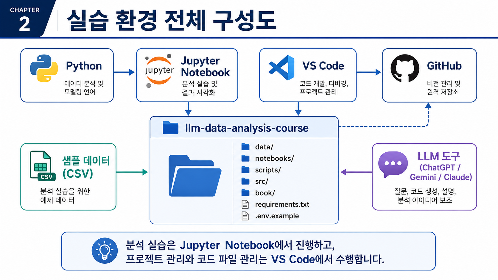
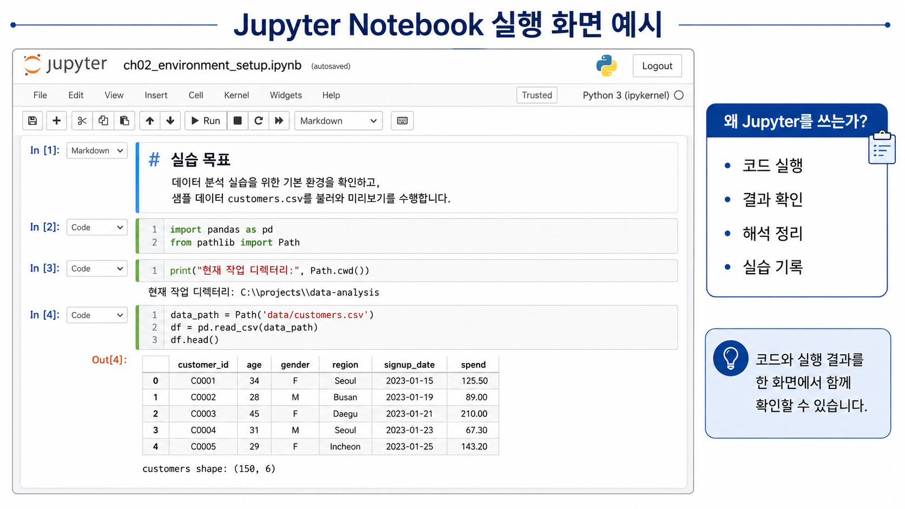
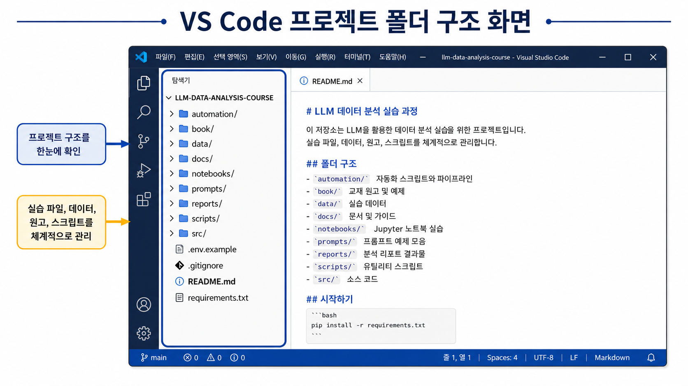
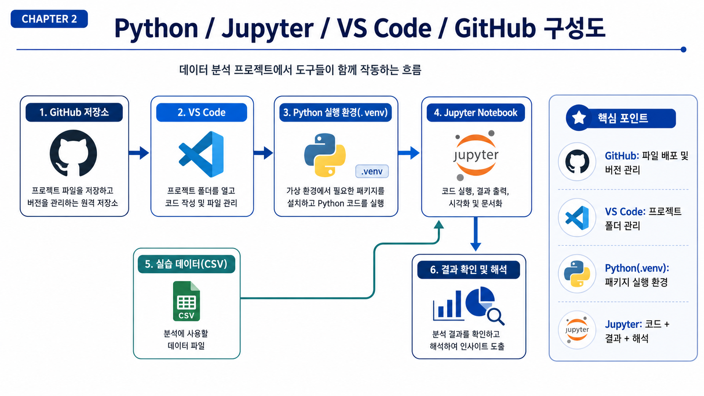

# 2장 Python/Jupyter/LLM 분석 환경 준비

이 장에서는 앞으로의 데이터 분석 실습을 안정적으로 진행하기 위한 기본 환경을 준비합니다. 데이터 분석 수업에서는 분석 개념만큼이나 실습 환경을 제대로 갖추는 일이 중요합니다. 같은 코드를 실행하더라도 Python 버전, 패키지 설치 상태, 작업 폴더 위치가 다르면 오류가 발생할 수 있기 때문입니다.

이번 장의 목표는 단순히 프로그램을 설치하는 것이 아닙니다. 15주 동안 반복해서 사용할 수 있는 프로젝트 폴더, 가상환경, 패키지 설치 방식, Jupyter Notebook 실행 방식, LLM 보조 도구 사용 원칙을 함께 정리하는 것입니다.

## 수업 시간 구성

| 구성 | 권장 시간 |
| --- | ---: |
| 실습 환경 개요 이해 | 30분 |
| Python, Jupyter, VS Code 역할 이해 | 30분 |
| GitHub 원본 자료 확인과 개인 저장소 준비 | 30분 |
| 가상환경 생성과 패키지 설치 | 50분 |
| 샘플 데이터 생성과 Notebook 실행 | 50분 |
| LLM을 활용한 오류 해결 실습 | 30분 |
| 연습 문제와 오류 해결 과제 | 60~90분 |

핵심 실습은 약 3시간 내외로 진행할 수 있습니다. 개인 PC 환경 차이로 설치 오류를 해결하거나 심화 과제까지 수행하면 4~5시간 정도가 필요할 수 있습니다.

## 1. 학습 목표

이 장을 마치면 학습자는 다음을 할 수 있습니다.

- Python이 데이터 분석에서 어떤 역할을 하는지 설명할 수 있습니다.
- Jupyter Notebook과 VS Code의 차이를 구분할 수 있습니다.
- 강사 GitHub 저장소와 본인 개인 실습 저장소의 역할을 구분할 수 있습니다.
- 본인 GitHub 계정에 개인 실습 저장소를 만들고 프로젝트 폴더 구조를 확인할 수 있습니다.
- `.venv` 가상환경을 생성하고 활성화할 수 있습니다.
- `requirements.txt`를 사용해 필요한 패키지를 설치할 수 있습니다.
- 샘플 데이터를 생성하고 `data/raw` 폴더의 CSV 파일을 확인할 수 있습니다.
- Jupyter Notebook에서 CSV 파일을 불러와 기본 구조를 확인할 수 있습니다.
- `.env` 파일과 API Key를 안전하게 관리해야 하는 이유를 설명할 수 있습니다.
- LLM을 활용해 설치 오류와 파일 경로 오류를 안전하게 질문할 수 있습니다.

## 2. 이번 장에서 만들 결과물

이번 장의 결과물은 분석 보고서가 아니라 앞으로 실습을 진행할 수 있는 분석 환경입니다. 환경 설정은 처음에는 번거롭게 느껴질 수 있지만, 한 번 안정적으로 준비해 두면 이후 주차의 실습을 훨씬 수월하게 진행할 수 있습니다.

이번 장에서 만들 결과물은 다음과 같습니다.

- 로컬 PC에 준비된 Python 실행 환경
- 강사 GitHub 저장소에서 내려받은 실습 원본 자료
- 본인 GitHub 계정에 생성한 개인 실습 저장소
- 개인 저장소와 연결된 로컬 프로젝트 폴더
- VS Code에서 열린 `my-llm-data-analysis-course` 개인 저장소 폴더
- 프로젝트 내부의 `.venv` 가상환경
- `requirements.txt`로 설치한 데이터 분석 패키지
- `data/raw` 폴더에 생성된 샘플 CSV 파일
- Jupyter Notebook 실행 환경
- CSV 파일을 정상적으로 불러오는 환경 점검 코드
- 실습 결과를 commit/push할 수 있는 GitHub 작업 흐름
- LLM에게 오류 해결을 요청할 때 사용할 프롬프트 예시

이번 장에서 준비하는 실습 환경은 Python, Jupyter Notebook, VS Code, GitHub, 샘플 데이터, LLM 도구가 함께 연결된 구조입니다. 아래 그림은 각 도구가 어떤 역할을 하는지 한눈에 보여줍니다.

<figure class="figure">
  
  <figcaption>그림 2-1. 실습 환경 전체 구성도</figcaption>
</figure>

핵심은 Jupyter Notebook에서 실습을 진행하고, VS Code에서 프로젝트 파일과 스크립트를 관리하며, GitHub를 통해 저장소와 결과물을 관리하는 것입니다.

## 3. 핵심 개념

### 3.1 Python 설치와 역할

Python은 이번 교재에서 데이터 분석 코드를 실행하는 기본 언어입니다. CSV 파일을 읽고, 데이터를 정리하고, 그래프를 그리고, 보고서를 만드는 대부분의 실습은 Python 코드로 진행합니다.

Python을 설치했다는 것은 단순히 프로그램 하나를 설치했다는 뜻이 아닙니다. 앞으로 `pandas`, `numpy`, `matplotlib`, `seaborn`, `jupyter` 같은 패키지를 설치하고 실행할 수 있는 기반을 준비했다는 뜻입니다.

Windows에서는 보통 다음 중 하나의 방식으로 Python을 준비합니다.

- Python 공식 설치 파일 사용
- Anaconda 또는 Miniconda 사용
- 이미 설치된 Python 사용

수업에서는 어떤 방식으로 설치했는지보다, 터미널에서 다음 명령이 실행되는지가 더 중요합니다.

```powershell
python --version
```

버전이 출력되면 Python 명령을 사용할 수 있는 상태입니다. 단, 여러 버전의 Python이 함께 설치된 PC에서는 어떤 Python을 사용하고 있는지 확인해야 합니다.

### 3.2 Jupyter Notebook의 역할

Jupyter Notebook은 코드, 실행 결과, 설명 문장을 한 화면에 함께 기록할 수 있는 실습 환경입니다. 데이터 분석 입문 수업에 특히 적합합니다. 코드를 작은 단위로 실행하고 바로 결과를 확인할 수 있기 때문입니다.

Jupyter Notebook에서는 다음을 한 파일 안에 정리할 수 있습니다.

- 분석 코드
- 실행 결과
- 그래프
- 해석 문장
- LLM 프롬프트 기록
- 연습 문제 풀이

이번 교재의 주차별 실습 파일은 `notebooks/` 폴더에 있습니다. Chapter 2에서는 Jupyter Notebook이 정상적으로 실행되는지 확인하고, 샘플 CSV 파일을 불러오는 것까지 연습합니다.

Jupyter Notebook은 코드와 실행 결과, 그리고 해석 문장을 한 화면에서 함께 관리할 수 있습니다. 데이터 분석 입문자는 코드를 실행하는 것에서 끝내지 말고, 출력 결과가 무엇을 의미하는지 함께 기록하는 습관을 들이는 것이 중요합니다.

<figure class="figure">
  
  <figcaption>그림 2-2. Jupyter Notebook 실행 화면 예시</figcaption>
</figure>

앞으로의 실습에서는 Notebook 안에 코드, 결과, 해석, LLM 프롬프트 기록을 함께 남기는 방식으로 진행합니다.

### 3.3 VS Code의 역할

VS Code는 프로젝트 폴더 전체를 관리하고 여러 파일을 편집하기 위한 도구입니다. Jupyter Notebook이 실습과 결과 확인에 적합하다면, VS Code는 전체 프로젝트를 관리하는 데 적합합니다.

VS Code에서는 다음 작업을 할 수 있습니다.

- 프로젝트 폴더 구조 확인
- Python 스크립트 작성
- Markdown 문서 작성
- 터미널 실행
- Git 변경사항 확인
- `.env`, `.gitignore`, `requirements.txt` 같은 설정 파일 관리

이번 교재에서는 Jupyter Notebook과 VS Code를 함께 사용합니다. Notebook에서는 실습을 실행하고, VS Code에서는 프로젝트 전체 구조를 확인하며 파일을 관리합니다.

VS Code는 프로젝트 전체 폴더 구조를 확인하고, 실습 데이터, Notebook, 원고, 스크립트, 보고서 파일을 체계적으로 관리하기 위해 사용합니다.

<figure class="figure">
  
  <figcaption>그림 2-3. VS Code 프로젝트 폴더 구조 화면</figcaption>
</figure>

특히 `data`, `notebooks`, `scripts`, `book`, `reports` 폴더의 역할을 이해하면 이후 실습과 프로젝트 제출을 더 안정적으로 진행할 수 있습니다.

VS Code에서 Python 실습을 원활하게 진행하려면 확장 기능도 확인해야 합니다. 왼쪽 Extensions 메뉴에서 Microsoft가 제공하는 `Python` 확장과 `Jupyter` 확장을 설치합니다. 이 확장이 있어야 VS Code가 Python 인터프리터와 Notebook 커널을 더 쉽게 인식합니다.

### 3.4 강사 저장소와 개인 저장소의 차이

수업에서 제공하는 강사 GitHub 저장소는 실습 원본 자료를 제공하는 저장소입니다. 강사 저장소에는 샘플 데이터 생성 코드, 기본 Notebook, 교재 원고, 공통 스크립트가 포함될 수 있습니다.

하지만 학습자는 강사 저장소를 직접 수정하거나 push하지 않습니다. 실습 과정에서 작성하는 코드, 수정한 Notebook, 분석 결과, 보고서는 본인 GitHub 계정의 개인 실습 저장소에 저장합니다.

이렇게 저장소를 분리하면 다음 장점이 있습니다.

- 강사 원본 자료가 실수로 변경되지 않습니다.
- 학습자별 실습 이력과 과제 결과가 분리됩니다.
- 본인 GitHub에 commit 기록이 남아 포트폴리오로 사용할 수 있습니다.
- 과제 제출 시 개인 저장소 URL을 제출할 수 있습니다.
- 같은 원본 자료를 사용하되 학습자별로 독립적인 실습이 가능합니다.

| 구분 | 강사 GitHub 저장소 | 학습자 개인 GitHub 저장소 |
|---|---|---|
| 역할 | 실습 원본 자료 제공 | 본인 실습 코드와 결과 저장 |
| 수정 권한 | 보통 읽기 전용 | 본인이 자유롭게 수정 |
| 포함 내용 | 기본 코드, 샘플 데이터 생성 스크립트, 교재 자료 | 수정한 Notebook, 과제, 보고서, 실험 코드 |
| 제출 용도 | 직접 제출 대상 아님 | 과제 제출 및 포트폴리오용 |
| 관리 주체 | 강사 | 학습자 |

GitHub를 처음 사용하는 학습자는 다음 용어를 먼저 구분해 둡니다.

| 용어 | 의미 |
| --- | --- |
| Repository | 코드와 문서를 저장하는 GitHub 저장소 |
| Clone | GitHub 저장소를 내 PC로 내려받는 작업 |
| Commit | 변경 내용을 하나의 기록으로 저장하는 작업 |
| Push | 로컬 commit을 GitHub 원격 저장소에 업로드하는 작업 |

### 3.5 주요 도구 역할 비교

| 도구 | 역할 | 이번 교재에서 사용하는 위치 |
| --- | --- | --- |
| Python | 데이터 분석 코드를 실행하는 언어 | 전체 실습 |
| Jupyter Notebook | 코드, 결과, 해석을 함께 기록하는 실습 환경 | 주차별 실습 |
| VS Code | 프로젝트 폴더와 코드 파일을 관리하는 편집기 | 전체 프로젝트 관리 |
| GitHub | 강사 원본 자료를 확인하고, 본인 실습 저장소를 관리하는 플랫폼 | 원본 자료 확인, 개인 저장소 생성, 과제 제출 |
| `.venv` | 프로젝트별 Python 가상환경 | 패키지 충돌 방지 |
| `requirements.txt` | 필요한 패키지 목록 | 실습 환경 재현 |
| `.env` | API Key 같은 환경변수 저장 | LLM API 실습 |

### 3.6 Jupyter Notebook과 VS Code 비교

| 구분 | Jupyter Notebook | VS Code |
| --- | --- | --- |
| 주요 목적 | 실습 코드 실행과 결과 확인 | 프로젝트 파일 관리와 코드 작성 |
| 장점 | 코드와 결과를 한 화면에서 확인 가능 | 여러 폴더와 파일을 한 번에 관리 가능 |
| 적합한 작업 | 데이터 확인, EDA, 그래프 실습 | Python 스크립트, 문서, Git 관리 |
| 초보자 난이도 | 낮음 | 중간 |
| 이번 교재 사용 방식 | 주차별 노트북 실행 | 저장소 전체 관리 |

두 도구는 경쟁 관계가 아닙니다. 실습 과정에서는 Jupyter Notebook을 많이 사용하고, 프로젝트 구조 관리와 스크립트 작성에는 VS Code를 사용합니다.

### 3.7 가상환경이 필요한 이유

가상환경은 프로젝트마다 독립적인 Python 실행 환경을 만드는 기능입니다. 같은 PC 안에서도 프로젝트마다 필요한 패키지 버전이 다를 수 있습니다. 모든 패키지를 PC 전체에 설치하면 프로젝트 간 충돌이 생길 수 있습니다.

이번 교재에서는 프로젝트 폴더 안에 `.venv`라는 가상환경을 만듭니다.

```text
llm-data-analysis-course/
├─ .venv/
├─ data/
├─ notebooks/
├─ scripts/
├─ src/
├─ book/
├─ requirements.txt
└─ README.md
```

`.venv` 폴더는 개인 PC에서만 필요한 실행 환경입니다. GitHub에 올리지 않습니다. 이미 `.gitignore`에 포함되어 있어야 합니다.

`.gitignore`는 GitHub에 올리지 않을 파일과 폴더를 지정하는 설정 파일입니다. 예를 들어 `.venv`, `.env`, `__pycache__`, `.ipynb_checkpoints`처럼 개인 PC 환경이나 민감정보가 포함될 수 있는 파일은 `.gitignore`에 등록해 관리합니다.

### 3.8 주요 패키지 역할

| 패키지 | 역할 |
| --- | --- |
| pandas | CSV 파일 읽기와 표 형태 데이터 분석 |
| numpy | 숫자 계산 |
| matplotlib | 기본 그래프 작성 |
| seaborn | 통계 그래프 작성 |
| jupyter | Jupyter Notebook 실행 |
| notebook | Notebook 웹 인터페이스 실행 |
| openpyxl | Excel 파일 처리 |
| python-dotenv | `.env` 파일에서 환경변수 읽기 |
| google-generativeai | Gemini API 실습 |
| python-docx | Word 보고서 생성 |
| faker | 가상 샘플 데이터 생성 |

처음부터 모든 패키지의 사용법을 외울 필요는 없습니다. 이번 장에서는 설치와 실행 확인에 집중합니다.

### 3.9 `.env` 파일과 API Key 보안

LLM API를 사용할 때는 API Key가 필요할 수 있습니다. API Key는 비밀번호와 비슷하게 다루어야 합니다. 코드에 직접 쓰거나 GitHub에 올리면 안 됩니다.

이번 저장소에는 `.env.example` 파일이 있습니다. 이 파일은 예시 파일입니다. 실제 API Key는 `.env` 파일을 따로 만들어 저장합니다.

```text
GEMINI_API_KEY=your_gemini_api_key_here
GEMINI_MODEL_NAME=gemini-2.0-flash-lite
```

실습에서는 `.env.example` 파일을 복사해 `.env` 파일을 만듭니다. `.env.example`은 어떤 항목이 필요한지 보여주는 예시이고, `.env`는 실제 수업용 환경값을 입력하는 개인 파일입니다. `.env` 파일은 절대 GitHub에 올리지 않습니다.

Windows PowerShell에서는 다음처럼 복사할 수 있습니다.

```powershell
Copy-Item .env.example .env
```

macOS/Linux에서는 다음 명령을 사용할 수 있습니다.

```bash
cp .env.example .env
```

보안 원칙은 다음과 같습니다.

- `.env` 파일은 GitHub에 올리지 않습니다.
- API Key를 코드에 직접 쓰지 않습니다.
- API Key를 LLM 프롬프트에 붙여넣지 않습니다.
- 오류 메시지를 LLM에 넣기 전에 개인정보와 토큰을 제거합니다.
- `.venv`, `.env`, `__pycache__`, `.ipynb_checkpoints`는 GitHub에 올리지 않습니다.

## 4. 실습 시나리오

이번 장의 실습 시나리오는 다음과 같습니다.

> 데이터 분석 수업을 시작하기 위해 먼저 강사가 제공한 GitHub 저장소에서 실습 원본 자료를 확인합니다. 이후 본인 GitHub 계정에 개인 실습 저장소를 만들고, 그 저장소를 로컬 PC에 내려받아 VS Code에서 엽니다. 개인 저장소 안에서 `.venv` 가상환경을 만들고 필요한 패키지를 설치한 뒤, 샘플 데이터를 생성하고 Jupyter Notebook에서 CSV 파일을 불러와 실습 환경이 정상인지 확인합니다.

전체 흐름은 다음과 같습니다.

1. Python 설치 상태 확인
2. 강사 GitHub 저장소에서 실습 원본 자료 확인
3. `Use this template` 또는 `Download ZIP` 방식 선택
4. 본인 GitHub 계정에 개인 실습 저장소 생성
5. 개인 저장소를 로컬 PC에 내려받기
6. VS Code에서 개인 프로젝트 폴더 열기
7. `.venv` 가상환경 생성
8. 가상환경 활성화
9. `requirements.txt` 패키지 설치
10. 샘플 데이터 생성
11. Jupyter Notebook 실행
12. CSV 파일 불러오기 확인
13. 실습 결과를 본인 저장소에 commit/push
14. 오류가 발생하면 LLM을 활용해 원인 정리

실습 환경은 하나의 도구만으로 구성되지 않습니다. 강사 저장소에서 원본 자료를 확인하고, 본인 개인 저장소를 만든 뒤, VS Code에서 프로젝트를 열고, Python 가상환경에서 패키지를 실행하며, Jupyter Notebook에서 실습 결과를 확인하는 흐름으로 진행합니다.

오류가 발생하면 먼저 어느 단계에서 문제가 생겼는지 구분합니다. 설치 오류인지, 가상환경 활성화 오류인지, 파일 경로 오류인지, GitHub 인증 오류인지 나누어 보면 해결이 쉬워집니다. LLM에게 질문할 때도 오류 메시지와 함께 현재 단계, 실행한 명령어, 작업 폴더를 함께 알려주면 더 정확한 도움을 받을 수 있습니다.

<figure class="figure">
  
  <figcaption>그림 2-4. Python/Jupyter/VS Code/GitHub 실습 환경 구성도</figcaption>
</figure>

이 흐름을 이해하면 설치 오류나 파일 경로 오류가 발생했을 때 어느 단계에서 문제가 생겼는지 더 쉽게 찾을 수 있습니다. 또한 과제 제출 시 강사 저장소가 아니라 본인 개인 저장소 URL을 제출해야 한다는 점도 분명해집니다.

## 5. 실습 코드

이번 장의 실습 명령어는 Windows PowerShell을 기준으로 설명합니다. macOS 또는 Linux를 사용하는 경우에는 뒤에 제시한 대체 명령어를 사용하면 됩니다.

### 5.1 Windows PowerShell 기준 실습 명령어

프로젝트 폴더에서 아래 명령어를 순서대로 실행합니다.

```powershell
python -m venv .venv
.\.venv\Scripts\Activate.ps1
python -m pip install --upgrade pip
pip install -r requirements.txt
python scripts/generate_sample_data.py
jupyter notebook
```

`requirements.txt`를 설치하기 전에 어떤 패키지가 들어 있는지 한 번 열어 보는 습관을 들이면 좋습니다. 이 파일은 수업 실습에 필요한 패키지 목록이며, 다른 사람이 같은 환경을 재현할 때도 사용합니다.

각 명령어의 의미는 다음과 같습니다.

| 명령어 | 의미 |
| --- | --- |
| `python -m venv .venv` | `.venv` 가상환경 생성 |
| `.\.venv\Scripts\Activate.ps1` | Windows PowerShell에서 가상환경 활성화 |
| `python -m pip install --upgrade pip` | pip 최신화 |
| `pip install -r requirements.txt` | 필요한 패키지 설치 |
| `python scripts/generate_sample_data.py` | 샘플 CSV 데이터 생성 |
| `jupyter notebook` | Jupyter Notebook 실행 |

PowerShell에서 실행 정책 오류가 발생할 수 있습니다. 이때는 오류 메시지를 그대로 LLM에 넣기 전에 사용자명, 개인 경로, 토큰이 포함되어 있지 않은지 먼저 확인합니다.

#### PowerShell 실행 정책 오류가 발생하는 경우

Windows PowerShell에서 가상환경을 활성화할 때 다음과 같은 실행 정책 오류가 발생할 수 있습니다.

```text
running scripts is disabled on this system
```

이 경우 현재 PowerShell 세션에서만 임시로 실행 정책을 완화한 뒤 다시 가상환경을 활성화할 수 있습니다.

```powershell
Set-ExecutionPolicy -Scope Process -ExecutionPolicy Bypass
.\.venv\Scripts\Activate.ps1
```

`-Scope Process` 옵션은 현재 PowerShell 창에만 적용됩니다. 시스템 전체 설정을 바꾸는 것이 아니므로 수업 실습에서는 비교적 안전하게 사용할 수 있습니다. 그래도 명령어의 의미를 이해한 뒤 실행해야 합니다.

PowerShell에서 계속 문제가 발생하면 명령 프롬프트(cmd)나 VS Code 터미널의 다른 셸을 사용할 수 있습니다. 터미널을 바꾼 뒤에는 가상환경 활성화 명령도 해당 셸에 맞게 다시 확인합니다.

### 5.2 macOS/Linux 기준 실습 명령어

macOS 또는 Linux에서는 가상환경 활성화 명령어가 다릅니다.

```bash
python3 -m venv .venv
source .venv/bin/activate
pip install -r requirements.txt
python scripts/generate_sample_data.py
jupyter notebook
```

Python 명령어가 `python`이 아니라 `python3`일 수 있습니다. 터미널에서 `python3 --version`으로 확인합니다.

### 5.3 GitHub 저장소 준비하기

수업에서 제공하는 강사 GitHub 저장소는 실습 원본 자료를 내려받기 위한 저장소입니다. 학습자는 강사 저장소를 직접 수정하는 것이 아니라, 본인 GitHub 계정에 별도의 개인 저장소를 만들어 실습을 진행합니다.

먼저 Git과 GitHub 계정을 확인합니다. 터미널에서 다음 명령이 실행되면 Git이 설치된 상태입니다.

```bash
git --version
```

명령을 찾을 수 없다는 메시지가 나오면 Git을 설치한 뒤 VS Code나 터미널을 다시 시작합니다. GitHub 계정이 없다면 무료 계정을 만들고 이메일 인증을 완료해야 저장소를 만들 수 있습니다. 강사 GitHub 저장소 주소는 수업 오리엔테이션 자료 또는 LMS 공지에서 확인합니다.

권장 방식은 두 가지입니다.

#### 방법 1: Template Repository 사용

강사 저장소가 Template Repository로 제공되는 경우 가장 권장하는 방식입니다.

1. 강사 GitHub 저장소에 접속합니다.
2. `Use this template` 버튼을 클릭합니다.
3. `Create a new repository`를 선택합니다.
4. 본인 GitHub 계정에 개인 실습 저장소를 생성합니다.
5. 저장소 이름은 예를 들어 `my-llm-data-analysis-course`처럼 정합니다.
6. 생성된 본인 저장소 주소를 복사합니다.
7. 로컬 PC에서 본인 저장소를 clone합니다.

예시:

```bash
git clone https://github.com/본인아이디/my-llm-data-analysis-course.git
cd my-llm-data-analysis-course
```

위 주소에서 `본인아이디`는 자신의 GitHub 계정 이름으로 바꾸어 입력합니다.

이 방식의 장점은 강사 원본 자료의 폴더 구조를 유지하면서도, 학습자가 본인 저장소에서 자유롭게 수정하고 commit/push할 수 있다는 점입니다.

#### 방법 2: Download ZIP 사용

GitHub 사용이 익숙하지 않은 초보자는 ZIP 파일로 실습 원본 자료를 내려받아 시작할 수 있습니다.

1. 강사 GitHub 저장소에 접속합니다.
2. `Code` 버튼을 클릭합니다.
3. `Download ZIP`을 선택합니다.
4. 압축을 해제합니다.
5. 본인 GitHub 계정에서 새 저장소를 생성합니다.
6. 압축 해제한 파일을 개인 저장소 폴더로 옮깁니다.
7. VS Code에서 해당 폴더를 열고 실습을 진행합니다.

ZIP 방식은 간단하지만 Git commit/push 흐름을 별도로 설정해야 합니다. 가능하면 Template Repository 방식을 권장합니다.

중요한 점은 학생이 실제로 작업하는 저장소가 강사 저장소가 아니라 본인 개인 저장소라는 것입니다. 과제 제출 시에도 강사 저장소 URL이 아니라 본인 개인 저장소 URL을 제출합니다.

### 5.4 VS Code에서 프로젝트 열기

개인 저장소를 로컬 PC에 내려받은 뒤, 해당 폴더에서 다음 명령을 실행하면 VS Code가 열립니다.

```bash
code .
```

명령이 실행되지 않는 경우에는 VS Code 메뉴에서 직접 본인 개인 저장소 폴더를 열어도 됩니다.

```text
File → Open Folder → my-llm-data-analysis-course 선택
```

### 5.5 GitHub에 변경 내용 commit/push하기

실습 중 수정한 Notebook, README, 보고서 파일은 본인 개인 저장소에 commit/push합니다. 기본 흐름은 다음과 같습니다.

```bash
git status
git add .
git commit -m "Add chapter 2 environment setup notes"
git push
```

각 명령어의 의미는 다음과 같습니다.

| 명령어 | 의미 |
| --- | --- |
| `git status` | 변경된 파일 목록 확인 |
| `git add .` | 변경 파일을 commit 대상으로 추가 |
| `git commit -m "메시지"` | 변경 내용을 하나의 기록으로 저장 |
| `git push` | 로컬 commit을 GitHub 개인 저장소에 업로드 |

push 후에는 GitHub 웹 화면에서 파일이 반영되었는지 확인합니다. 처음 push할 때 로그인이나 인증 화면이 나올 수 있습니다.

### 5.6 샘플 데이터 생성 확인

아래 명령을 실행하면 `data/raw` 폴더에 4개의 CSV 파일이 생성됩니다.

```powershell
python scripts/generate_sample_data.py
```

생성되는 파일은 다음과 같습니다.

- `customers.csv`
- `products.csv`
- `orders.csv`
- `order_items.csv`

### 5.7 Jupyter Notebook 환경 점검 코드

Jupyter Notebook에서 아래 코드를 실행합니다. 이 코드는 Python 버전, 현재 작업 폴더, CSV 파일 존재 여부, `customers.csv` 로드 결과를 확인합니다.

```python
from pathlib import Path
import pandas as pd
import sys

print("Python 버전:", sys.version)
print("현재 작업 폴더:", Path.cwd())

data_dir = Path("data/raw")

files = [
    "customers.csv",
    "products.csv",
    "orders.csv",
    "order_items.csv"
]

for file in files:
    path = data_dir / file
    print(file, "존재 여부:", path.exists())

customers = pd.read_csv(data_dir / "customers.csv")
display(customers.head())
print("customers shape:", customers.shape)
```

`display()`는 Jupyter Notebook에서 표를 보기 좋게 출력하는 함수입니다. 일반 Python 파일이나 터미널에서는 `print(customers.head())`로 대체할 수 있습니다.

Notebook 오른쪽 상단의 커널 이름도 확인합니다. 커널이 현재 프로젝트의 `.venv`를 사용하고 있어야 `requirements.txt`로 설치한 패키지를 인식할 수 있습니다. `.venv` 커널이 보이지 않으면 Python/Jupyter 확장이 설치되어 있는지 확인하고, VS Code나 Jupyter Notebook을 다시 시작합니다.

만약 `FileNotFoundError`가 발생한다면 현재 Notebook의 작업 폴더가 예상과 다를 수 있습니다. 아래 코드를 실행해 어느 경로가 맞는지 확인합니다.

```python
from pathlib import Path

print(Path.cwd())
print(Path("data/raw/customers.csv").exists())
print(Path("../data/raw/customers.csv").exists())
```

`True`가 출력되는 경로를 사용하면 됩니다. 예를 들어 `../data/raw/customers.csv`만 `True`라면 Notebook이 `notebooks` 폴더 안에서 실행되고 있을 가능성이 큽니다.

## 6. LLM 활용 프롬프트

환경 설정 중 오류가 발생하면 LLM에게 도움을 받을 수 있습니다. 단, 오류 메시지를 그대로 붙여넣기 전에 API Key, 토큰, 비밀번호, 실제 개인정보가 포함되어 있지 않은지 반드시 확인합니다.

### 6.1 설치 오류 설명 요청

```text
당신은 Python 데이터 분석 수업의 실습 조교입니다.

아래 오류 메시지를 초보자가 이해할 수 있게 설명해 주세요.
가능한 원인과 해결 절차를 단계별로 알려 주세요.

오류 메시지:
[여기에 오류 메시지를 붙여넣기]

조건:
- Windows PowerShell 기준으로 설명
- 위험한 명령어는 제안하지 않기
- API Key, 비밀번호, 토큰을 공유하지 말라고 안내하기
```

### 6.2 파일 경로 오류 해결 요청

```text
Jupyter Notebook에서 CSV 파일을 불러오려고 하는데 FileNotFoundError가 발생했습니다.

현재 상황:
- 프로젝트 폴더 이름: my-llm-data-analysis-course
- 데이터 파일 위치: data/raw/customers.csv
- Notebook 위치: notebooks/ch02_environment_setup.ipynb
- 사용한 코드:
customers = pd.read_csv("data/raw/customers.csv")

초보자가 이해할 수 있게 원인과 해결 방법을 설명해 주세요.
현재 작업 폴더를 확인하는 코드와 올바른 상대 경로 예시를 함께 알려 주세요.
```

### 6.3 가상환경 개념 설명 요청

```text
Python 가상환경(.venv)이 무엇인지 초보자에게 설명해 주세요.

다음 내용을 포함해 주세요.
- 가상환경이 필요한 이유
- .venv 폴더의 역할
- requirements.txt와의 관계
- 가상환경을 활성화하지 않으면 생길 수 있는 문제
- Windows PowerShell에서 활성화하는 명령어
```

### 6.4 실습 환경 점검 체크리스트 생성 요청

```text
LLM 기반 데이터 분석 수업을 시작하기 전에 확인해야 할 실습 환경 체크리스트를 만들어 주세요.

포함할 항목:
- Python 설치
- VS Code 설치
- Jupyter Notebook 실행
- 강사 GitHub 저장소 원본 자료 확인
- 본인 개인 GitHub 저장소 생성
- 개인 저장소 로컬 PC 내려받기
- 가상환경 생성
- requirements.txt 설치
- 샘플 데이터 생성
- CSV 파일 불러오기
- .env 파일 관리
- API Key 보안

표 형식으로 작성해 주세요.
```

### 6.5 오류 메시지를 LLM에 입력할 때 주의할 점

```text
아래 오류 메시지를 LLM에게 질문하려고 합니다.
질문하기 전에 제거해야 할 민감정보가 있는지 확인해 주세요.

오류 메시지:
[여기에 오류 메시지 붙여넣기]

다음 항목이 포함되어 있는지 점검해 주세요.
- API Key
- 비밀번호
- 토큰
- 실제 고객 정보
- 개인 이메일
- 회사 내부 서버 주소
- 공개하면 안 되는 파일 경로
```

LLM은 오류 해결을 도와줄 수 있지만, 명령어를 실행하기 전에는 항상 의미를 확인해야 합니다. 특히 파일 삭제, 환경 초기화, 권한 변경과 관련된 명령어는 신중하게 다룹니다.

### 6.6 GitHub 개인 저장소 준비 방법 질문

```text
당신은 데이터 분석 수업의 GitHub 실습 조교입니다.

강사 GitHub 저장소에서 실습 원본 자료를 확인하고,
제 개인 GitHub 계정에 별도의 실습 저장소를 만들어 작업하려고 합니다.

초보자가 따라할 수 있도록 다음 두 가지 방법을 비교해 주세요.

1. Use this template 방식
2. Download ZIP 후 개인 저장소 생성 방식

각 방식의 절차, 장점, 주의사항을 표로 정리해 주세요.
그리고 과제 제출 시 왜 강사 저장소 URL이 아니라 본인 저장소 URL을 제출해야 하는지도 설명해 주세요.
```

## 7. 결과 해석

이번 장에서 확인해야 할 결과는 모델 성능이나 분석 인사이트가 아닙니다. 목표는 실습 환경이 정상적으로 작동하는지 확인하는 것입니다.

### 7.1 가상환경 활성화 확인

PowerShell 프롬프트 앞에 `(.venv)`가 보이면 가상환경이 활성화된 상태입니다.

```text
(.venv) PS D:\DEV\llm-data-analysis-course>
```

이 표시가 없다면 패키지를 설치해도 다른 Python 환경에 설치될 수 있습니다. 실습 전에는 항상 가상환경 활성화 여부를 확인합니다.

### 7.2 패키지 설치 확인

Jupyter Notebook 또는 Python에서 다음 코드가 오류 없이 실행되면 기본 패키지 설치가 된 것입니다.

```python
import pandas as pd
import numpy as np
import matplotlib
import seaborn as sns
```

`ModuleNotFoundError`가 발생하면 현재 가상환경에 패키지가 설치되지 않았을 가능성이 큽니다. 가상환경을 다시 활성화한 뒤 `pip install -r requirements.txt`를 실행합니다.

### 7.3 샘플 데이터 생성 확인

`data/raw` 폴더에 다음 파일이 있어야 합니다.

```text
customers.csv
products.csv
orders.csv
order_items.csv
```

파일이 없다면 다음 명령을 다시 실행합니다.

```powershell
python scripts/generate_sample_data.py
```

### 7.4 CSV 파일 로드 확인

다음 코드가 정상 실행되면 데이터 분석 실습을 시작할 수 있는 상태입니다.

```python
customers = pd.read_csv("data/raw/customers.csv")
display(customers.head())
print(customers.shape)
```

만약 경로 오류가 발생한다면 파일이 없는 것이 아니라 현재 작업 폴더가 다를 수 있습니다. `Path.cwd()`를 먼저 확인합니다.

## 8. 실무 적용 포인트

실무 데이터 분석에서도 환경 관리는 중요합니다. 분석 코드만 공유하면 다른 사람이 같은 결과를 재현하기 어렵습니다. 프로젝트 폴더 구조, 패키지 목록, 실행 순서, 데이터 위치가 함께 정리되어야 합니다.

실무에서 자주 사용하는 원칙은 다음과 같습니다.

- 프로젝트별 가상환경을 사용합니다.
- 패키지 목록은 `requirements.txt` 또는 유사한 파일로 관리합니다.
- API Key는 `.env`에 저장하고 GitHub에 올리지 않습니다.
- `.venv`, `.env`, `__pycache__`, `.ipynb_checkpoints`는 GitHub에 올리지 않습니다.
- README에 실행 방법을 기록합니다.
- 샘플 데이터와 실제 데이터는 구분합니다.
- 오류 메시지를 공유할 때 민감정보를 제거합니다.
- LLM이 제안한 명령어는 실행 전에 의미를 확인합니다.

### 환경 관리 체크리스트

| 점검 항목 | 확인 |
| --- | --- |
| 강사 저장소와 본인 개인 저장소의 차이를 이해했는가? | □ |
| Git이 설치되어 있고 `git --version`을 확인했는가? | □ |
| GitHub 계정을 만들고 이메일 인증을 완료했는가? | □ |
| 본인 개인 GitHub 저장소를 생성했는가? | □ |
| 개인 저장소를 로컬 PC에 내려받았는가? | □ |
| 프로젝트 폴더를 VS Code에서 열었는가? | □ |
| VS Code에 Python/Jupyter 확장을 설치했는가? | □ |
| `.venv` 가상환경을 생성했는가? | □ |
| 가상환경을 활성화했는가? | □ |
| `requirements.txt` 설치를 완료했는가? | □ |
| Jupyter Notebook을 실행할 수 있는가? | □ |
| Notebook 커널이 프로젝트 `.venv`를 사용하고 있는가? | □ |
| `data/raw` 폴더에 CSV 파일이 생성되었는가? | □ |
| pandas로 CSV 파일을 불러올 수 있는가? | □ |
| `.env.example`을 복사해 `.env` 파일을 만들었는가? | □ |
| `.env` 파일이 GitHub에 올라가지 않도록 설정했는가? | □ |
| `.gitignore`가 `.venv`, `.env`, 캐시 폴더를 제외하는지 확인했는가? | □ |
| API Key를 코드나 프롬프트에 직접 노출하지 않았는가? | □ |
| 실습 결과를 본인 저장소에 commit/push할 수 있는가? | □ |
| 오류 발생 시 작업 폴더와 가상환경을 먼저 확인했는가? | □ |

## 9. 연습 문제

### 기본 연습 문제

1. 자신의 PC에서 Python 버전을 확인하세요.
   - 제출 형식: 실행 명령어와 출력 결과 캡처 또는 텍스트
   - 예: `python --version`

2. 강사 GitHub 저장소에서 실습 원본 자료를 확인하고, 본인 GitHub 계정에 개인 실습 저장소를 생성하세요.
   - 제출 형식: 본인 GitHub 저장소 URL
   - 포함 항목: 저장소 이름, 생성 방식(`Use this template` 또는 `Download ZIP`)
   - 주의: 강사 저장소 URL이 아니라 본인 저장소 URL을 제출해야 합니다.

3. 개인 저장소를 로컬 PC에 내려받고 VS Code에서 여세요.
   - 제출 형식: 사용한 명령어 또는 VS Code 화면 캡처
   - 포함 항목: 개인 저장소 clone 명령어 또는 폴더 열기 과정
   - 예: `git clone https://github.com/본인아이디/my-llm-data-analysis-course.git`

4. 개인 저장소 폴더 안에서 `.venv` 가상환경을 생성하고 활성화하세요.
   - 제출 형식: 사용한 명령어 정리
   - 포함 항목: 가상환경 생성 명령어, 활성화 명령어

5. `requirements.txt`를 사용해 패키지를 설치하세요.
   - 제출 형식: 실행 명령어와 설치 완료 화면 캡처 또는 요약
   - 오류가 발생했다면 오류 메시지와 해결 과정을 함께 정리

6. `scripts/generate_sample_data.py`를 실행해 샘플 데이터를 생성하세요.
   - 제출 형식: 생성된 CSV 파일 목록
   - 포함 항목: `customers.csv`, `products.csv`, `orders.csv`, `order_items.csv`

7. Jupyter Notebook에서 `customers.csv`를 불러오고 `head()` 결과를 확인하세요.
   - 제출 형식: Notebook 실행 결과 캡처 또는 코드와 출력 결과
   - 포함 코드: `pd.read_csv()`, `head()`

### 심화 과제

1. 실습 환경 오류 해결 보고서를 작성하세요.
   - 제출 형식: Markdown 문서
   - 포함 항목: 발생한 오류, 원인 추정, 해결 방법, 다시 발생하지 않게 하기 위한 주의사항

2. 자신의 실습 환경 체크리스트를 작성하세요.
   - 제출 형식: Markdown 체크리스트
   - 포함 항목: Python, VS Code, Jupyter, GitHub, 가상환경, 패키지, 데이터, LLM 도구

3. LLM에게 환경 설정 오류를 질문하는 프롬프트를 작성하세요.
   - 제출 형식: `text` 코드 블록
   - 조건: 개인정보와 API Key를 포함하지 않도록 작성

4. 본인 GitHub 저장소의 commit 이력을 확인하고, 이번 장에서 수행한 작업을 README에 정리하세요.
   - 제출 형식: GitHub 저장소 URL과 README 요약
   - 포함 항목: 환경 설정 절차, 실행한 명령어, 발생한 오류와 해결 방법

## 10. 정리

이번 장에서는 LLM 기반 데이터 분석 실습을 위한 기본 환경을 준비했습니다. 데이터 분석을 잘하려면 pandas 코드만 아는 것보다, 프로젝트 폴더 구조와 실행 환경을 안정적으로 관리하는 능력이 필요합니다.

Python은 분석 코드를 실행하는 언어이고, Jupyter Notebook은 코드와 결과를 함께 정리하는 실습 환경입니다. VS Code는 프로젝트 전체를 관리하고 여러 파일을 편집하는 도구입니다. GitHub는 강사 원본 자료를 확인하고, 본인 개인 저장소에 실습 결과물을 관리하고 제출하는 데 사용합니다.

수업에서 제공하는 강사 GitHub 저장소는 실습 원본 자료를 제공하는 공간입니다. 학습자는 강사 저장소를 직접 수정하지 않고, 본인 GitHub 계정에 개인 실습 저장소를 만들어 실습을 진행합니다. 이렇게 하면 실습 이력과 과제 결과를 개인별로 관리할 수 있고, 이후 포트폴리오로도 사용할 수 있습니다.

가상환경은 프로젝트별로 독립적인 Python 실행 환경을 만들기 위한 도구입니다. `requirements.txt`를 사용하면 필요한 패키지를 한 번에 설치하고 다른 사람도 같은 환경을 재현할 수 있습니다.

샘플 데이터는 `scripts/generate_sample_data.py`로 생성하며, `data/raw` 폴더에 저장됩니다. Jupyter Notebook에서 CSV 파일을 불러올 때 오류가 발생하면 먼저 현재 작업 폴더와 파일 경로를 확인해야 합니다.

LLM은 설치 오류, 파일 경로 오류, 가상환경 개념 이해를 도와줄 수 있습니다. 그러나 API Key, 비밀번호, 토큰, 개인정보를 프롬프트에 포함해서는 안 됩니다. LLM이 제안한 명령어도 실행 전에 의미를 확인해야 합니다.

### 이 장에서 사용한 주요 용어

| 용어 | 설명 |
| --- | --- |
| 가상환경 | 프로젝트별로 독립적인 Python 실행 환경을 만드는 기능 |
| `.venv` | 이번 교재에서 사용하는 가상환경 폴더 이름 |
| `requirements.txt` | 설치해야 할 Python 패키지 목록 |
| `.env` | API Key 같은 개인 환경값을 저장하는 파일 |
| `.env.example` | `.env`에 어떤 항목이 필요한지 보여주는 예시 파일 |
| `.gitignore` | GitHub에 올리지 않을 파일과 폴더를 지정하는 설정 파일 |
| 커널 | Jupyter Notebook이 코드를 실행할 때 사용하는 Python 환경 |
| clone | GitHub 저장소를 로컬 PC로 내려받는 작업 |
| commit | 변경 내용을 Git 기록으로 저장하는 작업 |
| push | 로컬 commit을 GitHub 원격 저장소에 업로드하는 작업 |

다음 장에서는 생성한 샘플 CSV 파일을 본격적으로 불러오고, 행과 열, 컬럼명, 데이터 타입, 결측치 여부를 확인하면서 데이터 구조를 파악합니다.
