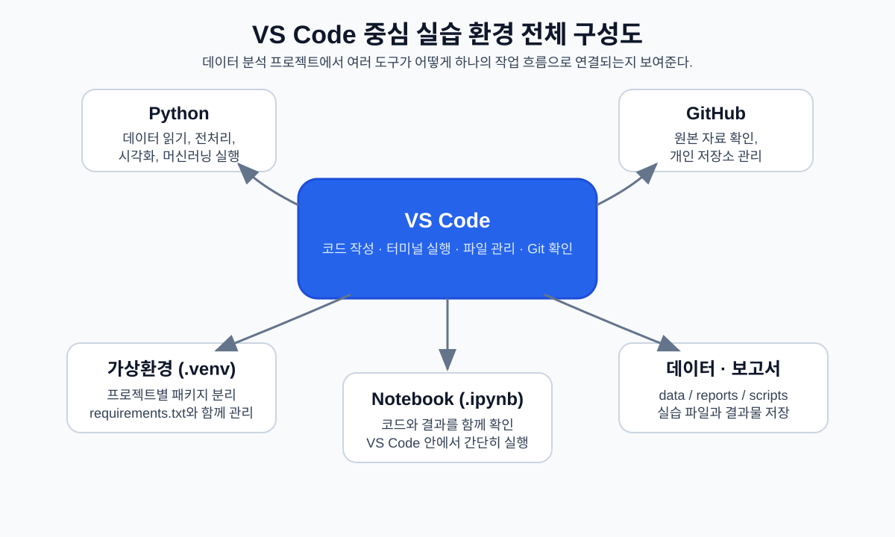
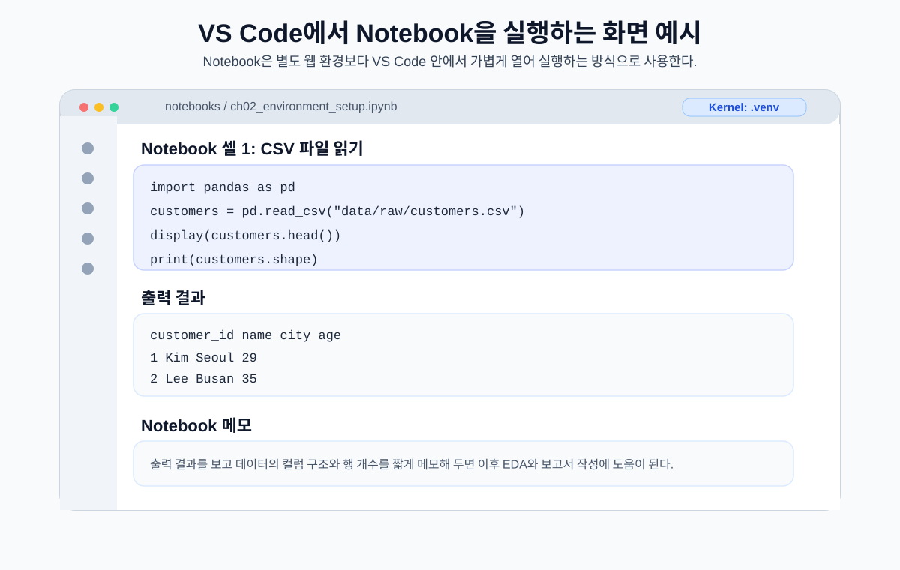
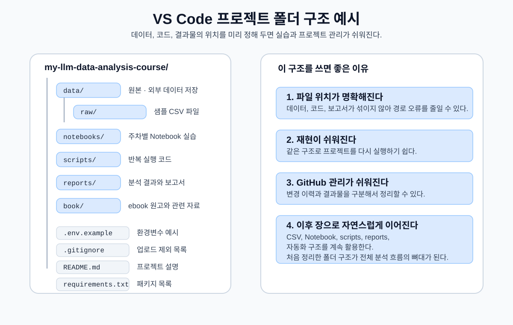

# 2장. VS Code에서 시작하는 데이터 분석 환경

데이터 분석은 코드 한 줄을 실행하는 일에서 시작되는 것처럼 보이지만, 실제로는 그보다 앞서 준비해야 할 것이 많습니다. 같은 코드를 실행해도 Python 버전이 다르거나, 패키지가 설치된 위치가 다르거나, 작업 폴더가 달라지면 전혀 다른 오류가 발생할 수 있습니다. 분석 자체보다 환경 설정에서 더 많은 시간을 쓰게 되는 경우도 흔합니다.

이 장에서는 앞으로의 분석 프로젝트를 안정적으로 이어 가기 위한 기본 환경을 준비합니다. 핵심은 여러 도구를 따로따로 익히는 것이 아니라, **VS Code를 중심으로 Python, GitHub, 가상환경, Notebook, 샘플 데이터를 하나의 작업 흐름으로 연결하는 것**입니다.

이 책에서는 Jupyter Notebook을 별도의 웹 환경으로 길게 다루기보다, VS Code 안에서 간단히 열고 실행하는 방식으로 사용합니다. 분석 코드 작성, 터미널 명령 실행, 파일 관리, Git 변경사항 확인은 대부분 VS Code에서 진행합니다. Notebook은 코드와 결과를 함께 확인해야 할 때 사용하는 보조적인 실습 형식으로 이해하면 됩니다.

## 1. 왜 환경 설정이 먼저인가

데이터 분석 프로젝트는 보통 CSV 파일 하나를 읽는 간단한 작업에서 시작합니다. 하지만 프로젝트가 조금만 커져도 코드, 데이터, 결과물, 설정 파일, 보고서가 함께 움직입니다. 이 파일들이 흩어져 있으면 분석 흐름을 다시 실행하기 어렵고, 다른 사람이 같은 결과를 재현하기도 어렵습니다.

분석 환경을 먼저 정리해 두면 다음과 같은 장점이 있습니다.

- 어떤 Python 환경에서 코드를 실행하는지 명확해집니다.
- 필요한 패키지를 한 번에 설치하고 다시 재현할 수 있습니다.
- 데이터 파일과 코드 파일의 위치를 일관되게 관리할 수 있습니다.
- GitHub를 통해 작업 이력과 결과물을 남길 수 있습니다.
- LLM이나 AI 코딩 도구에 오류를 질문할 때 현재 상황을 정확히 설명할 수 있습니다.

분석 환경은 단순한 설치 과정이 아니라, 앞으로 15주 동안 반복해서 사용할 작업 공간을 만드는 일입니다. 2주차부터는 CSV 데이터 구조를 살펴보고, 3~6주차에는 pandas, 전처리, EDA, 시각화를 다룹니다. 7~10주차에는 머신러닝 기초와 회귀·분류 실습으로 확장하고, 11주차 이후에는 LLM을 활용해 분석 질문을 정리하고 코드 초안을 만들고 결과를 검증하는 흐름으로 이어집니다.

| 구간 | 주요 흐름 | 이 장에서 준비하는 것 |
| --- | --- | --- |
| 1주차 | AI 기반 데이터 분석 개요와 개발 환경 설정 | VS Code, Python, GitHub, 가상환경 |
| 2~3주차 | 데이터 구조 이해와 pandas 기초 | CSV 파일 로드, DataFrame 확인 |
| 4~6주차 | 전처리, EDA, 시각화 | pandas, matplotlib, seaborn 실행 환경 |
| 7~10주차 | 머신러닝 기초, 회귀, 분류 | scikit-learn 기반 모델링 환경 |
| 11~12주차 | LLM 분석 프롬프트와 코드 검증 | `.env`, API Key 보안, LLM 질문 방식 |
| 13~14주차 | 외부 데이터 수집과 자동화 | 프로젝트 구조, 스크립트, 실행 흐름 관리 |
| 15주차 | 기말 프로젝트 | 개인 저장소와 재현 가능한 분석 환경 |

## 2. VS Code를 중심에 두는 이유

데이터 분석 입문 단계에서는 Notebook 하나만 열어도 충분해 보입니다. 하지만 실제 프로젝트에서는 데이터 파일, Python 스크립트, Notebook, 환경 설정 파일, 보고서, README가 함께 필요합니다. VS Code는 이러한 파일을 하나의 프로젝트 폴더 안에서 관리하기에 적합합니다.

VS Code에서는 다음 작업을 한 화면에서 처리할 수 있습니다.

- 프로젝트 폴더 구조 확인
- Python 코드와 Markdown 문서 작성
- 터미널에서 명령어 실행
- Jupyter Notebook 파일 열기와 셀 실행
- Git 변경사항 확인과 commit/push
- `.env`, `.gitignore`, `requirements.txt` 같은 설정 파일 관리
- LLM 또는 AI 코딩 도구를 활용한 코드 검토

<figure class="figure">
  
  <figcaption>그림 2-1. VS Code 중심 실습 환경 전체 구성도</figcaption>
</figure>

이번 책에서 사용하는 도구의 역할은 다음처럼 정리할 수 있습니다.

| 도구 | 역할 | 이 책에서의 사용 방식 |
| --- | --- | --- |
| VS Code | 기본 작업 공간 | 코드 작성, 터미널 실행, 파일 관리, Git 관리 |
| Python | 분석 코드 실행 언어 | 데이터 읽기, 전처리, 시각화, 머신러닝 실행 |
| Jupyter Notebook | 코드와 결과를 함께 보는 파일 형식 | VS Code 안에서 `.ipynb` 파일을 열어 간단히 실행 |
| GitHub | 코드와 결과물 저장소 | 원본 자료 확인, 개인 저장소 관리, 과제·프로젝트 제출 |
| `.venv` | 프로젝트별 Python 가상환경 | 패키지 충돌 방지 |
| `requirements.txt` | 필요한 패키지 목록 | 같은 환경을 다시 만들기 위한 기준 |
| `.env` | API Key 등 민감한 설정 저장 | LLM/API 실습을 위한 보안 관리 |

### Jupyter Notebook은 어디에 쓰는가

Jupyter Notebook은 코드, 실행 결과, 설명 문장을 한 파일에 함께 기록할 수 있는 형식입니다. 데이터의 모양을 빠르게 확인하거나 그래프 결과를 바로 보고 싶을 때 유용합니다.

다만 이 책에서는 Notebook 자체를 중심 도구로 삼지 않습니다. Notebook은 VS Code 안에서 열어 실행합니다. 이렇게 하면 Notebook의 장점은 활용하면서도 프로젝트 폴더, Python 환경, GitHub 작업 흐름을 한곳에서 관리할 수 있습니다.

<figure class="figure">
  
  <figcaption>그림 2-2. VS Code에서 Notebook을 실행하는 화면 예시</figcaption>
</figure>

Notebook을 사용할 때 중요한 점은 셀을 실행하는 것에서 멈추지 않는 것입니다. 출력 결과가 무엇을 의미하는지 짧게라도 기록해 두면, 이후 EDA나 프로젝트 보고서를 작성할 때 큰 도움이 됩니다.

## 3. 프로젝트 폴더는 분석의 뼈대다

분석 프로젝트는 폴더 구조가 정리되어 있을수록 다루기 쉽습니다. 데이터 파일은 `data` 폴더에, 실습 Notebook은 `notebooks` 폴더에, 반복 실행할 코드는 `scripts` 폴더에 두면 파일을 찾는 시간이 줄어듭니다.

<figure class="figure">
  
  <figcaption>그림 2-3. VS Code 프로젝트 폴더 구조 예시</figcaption>
</figure>

예를 들어 이 책의 실습 저장소는 다음과 같은 구조를 가질 수 있습니다.

```text
my-llm-data-analysis-course/
├─ data/
│  └─ raw/
├─ notebooks/
├─ scripts/
├─ reports/
├─ book/
├─ .env.example
├─ .gitignore
├─ README.md
└─ requirements.txt
```

각 폴더의 역할은 단순합니다.

| 위치 | 역할 |
| --- | --- |
| `data/raw` | 원본 또는 샘플 CSV 파일 저장 |
| `notebooks` | 주차별 Notebook 실습 파일 저장 |
| `scripts` | 데이터 생성, 자동화, 반복 실행 코드 저장 |
| `reports` | 분석 결과 보고서나 산출물 저장 |
| `book` | ebook 원고와 관련 자료 저장 |
| `requirements.txt` | 필요한 Python 패키지 목록 |
| `.env.example` | 환경변수 예시 파일 |
| `.gitignore` | GitHub에 올리지 않을 파일 목록 |

폴더 구조를 처음부터 완벽하게 외울 필요는 없습니다. 중요한 것은 코드와 데이터가 어디에 있는지, 그리고 현재 터미널이 어느 폴더에서 실행되고 있는지를 확인하는 습관입니다.

## 4. Python과 가상환경

Python은 데이터 분석 코드를 실행하는 기본 언어입니다. CSV 파일을 읽고, 데이터를 정리하고, 그래프를 그리고, 머신러닝 모델을 학습하는 대부분의 작업은 Python 코드로 이루어집니다.

먼저 터미널에서 Python이 실행되는지 확인합니다.

```powershell
python --version
```

버전이 출력되면 Python 명령을 사용할 수 있는 상태입니다. Windows에서는 PC 환경에 따라 `python` 대신 `py` 명령을 사용해야 할 수도 있고, macOS나 Linux에서는 `python3` 명령을 사용하는 경우가 많습니다.

```bash
python3 --version
```

### 가상환경이 필요한 이유

Python 패키지는 프로젝트마다 필요한 버전이 다를 수 있습니다. 어떤 프로젝트에서는 최신 pandas가 필요하고, 다른 프로젝트에서는 특정 버전의 scikit-learn이 필요할 수 있습니다. 모든 패키지를 PC 전체 환경에 설치하면 프로젝트 간 충돌이 발생하기 쉽습니다.

가상환경은 프로젝트별로 분리된 Python 실행 공간입니다. 이 책에서는 프로젝트 폴더 안에 `.venv`라는 이름의 가상환경을 만들어 사용합니다.

```powershell
python -m venv .venv
```

Windows PowerShell에서는 다음 명령으로 가상환경을 활성화합니다.

```powershell
.\.venv\Scripts\Activate.ps1
```

macOS나 Linux에서는 다음 명령을 사용합니다.

```bash
source .venv/bin/activate
```

가상환경이 활성화되면 터미널 앞부분에 보통 `(.venv)` 표시가 나타납니다.

```text
(.venv) PS D:\DEV\my-llm-data-analysis-course>
```

이 표시가 없으면 패키지를 설치해도 다른 Python 환경에 설치될 수 있습니다. 실습을 시작하기 전에는 항상 가상환경이 활성화되어 있는지 확인하는 습관을 들이는 것이 좋습니다.

### PowerShell 실행 정책 오류

Windows PowerShell에서 가상환경을 활성화할 때 다음과 같은 오류가 나타날 수 있습니다.

```text
running scripts is disabled on this system
```

이 경우 현재 PowerShell 창에서만 임시로 실행 정책을 완화한 뒤 다시 활성화할 수 있습니다.

```powershell
Set-ExecutionPolicy -Scope Process -ExecutionPolicy Bypass
.\.venv\Scripts\Activate.ps1
```

`-Scope Process` 옵션은 현재 PowerShell 창에만 적용됩니다. 시스템 전체 설정을 바꾸는 방식이 아니므로 실습 상황에서는 비교적 안전하게 사용할 수 있습니다. 그래도 명령어를 실행하기 전에는 의미를 이해하고 사용하는 것이 좋습니다.

## 5. 패키지 설치는 requirements.txt로 관리한다

데이터 분석에는 기본 Python만으로는 부족한 경우가 많습니다. 표 형태 데이터를 다루려면 pandas가 필요하고, 수치 계산에는 numpy가 자주 쓰입니다. 그래프를 그릴 때는 matplotlib이나 seaborn을 사용하고, 머신러닝 실습에는 scikit-learn이 필요합니다.

이런 패키지 목록을 한 파일에 모아 둔 것이 `requirements.txt`입니다. 가상환경을 활성화한 뒤 다음 명령으로 필요한 패키지를 설치합니다.

```powershell
python -m pip install --upgrade pip
pip install -r requirements.txt
```

처음부터 모든 패키지의 사용법을 외울 필요는 없습니다. 지금은 어떤 패키지가 어떤 역할을 하는지 정도만 가볍게 이해해 두면 충분합니다.

| 패키지 | 주된 역할 |
| --- | --- |
| pandas | 표 형태 데이터 처리 |
| numpy | 수치 계산 |
| matplotlib | 기본 시각화 |
| seaborn | 통계 기반 시각화 |
| scikit-learn | 머신러닝 모델링 |
| jupyter | Notebook 실행 지원 |
| openpyxl | Excel 파일 처리 |
| python-dotenv | `.env` 파일에서 환경변수 읽기 |
| faker | 가상 샘플 데이터 생성 |
| python-docx | Word 보고서 생성 |

설치가 끝난 뒤에는 VS Code에서 Python 인터프리터가 프로젝트의 `.venv`를 사용하고 있는지 확인해야 합니다. VS Code 오른쪽 아래 또는 명령 팔레트에서 Python 인터프리터를 선택할 수 있습니다.

```text
Python: Select Interpreter
```

목록에서 프로젝트 폴더 안의 `.venv`를 선택합니다. Notebook 파일을 열 때도 오른쪽 위 커널 선택 메뉴에서 같은 `.venv` 환경을 선택해야 합니다.

## 6. GitHub와 개인 저장소

이 책에서 제공하는 GitHub 저장소는 실습 원본 자료를 확인하기 위한 공간입니다. 독자는 이 원본 저장소를 직접 수정하지 않고, 자신의 GitHub 계정에 개인 실습 저장소를 만들어 작업합니다.

원본 저장소와 개인 저장소를 분리하면 다음과 같은 장점이 있습니다.

| 구분 | 원본 GitHub 저장소 | 개인 GitHub 저장소 |
| --- | --- | --- |
| 역할 | 실습 자료와 기본 구조 제공 | 자신의 코드, 결과, 보고서 저장 |
| 수정 권한 | 보통 읽기 중심 | 자유롭게 수정 가능 |
| 포함 내용 | 기본 코드, 샘플 데이터 생성 스크립트, 원고 | 수정한 Notebook, 분석 결과, 프로젝트 산출물 |
| 활용 | 기준 자료 확인 | 실습 기록, 제출, 포트폴리오 |

GitHub를 처음 사용할 때는 다음 용어를 먼저 구분해 두면 좋습니다.

| 용어 | 의미 |
| --- | --- |
| Repository | 코드와 문서를 저장하는 GitHub 저장소 |
| Clone | GitHub 저장소를 내 PC로 내려받는 작업 |
| Commit | 변경 내용을 하나의 기록으로 저장하는 작업 |
| Push | 로컬 commit을 GitHub 원격 저장소에 업로드하는 작업 |

### Template Repository 방식

원본 저장소가 Template Repository로 제공된다면 이 방식이 가장 간단합니다. GitHub에서 `Use this template` 버튼을 눌러 자신의 계정에 같은 구조의 새 저장소를 만들 수 있습니다.

개인 저장소를 만든 뒤에는 로컬 PC로 내려받습니다.

```bash
git clone https://github.com/본인아이디/my-llm-data-analysis-course.git
cd my-llm-data-analysis-course
```

VS Code가 설치되어 있다면 프로젝트 폴더에서 다음 명령으로 바로 열 수 있습니다.

```bash
code .
```

### Download ZIP 방식

GitHub 사용이 익숙하지 않다면 처음에는 ZIP 파일로 내려받아 시작할 수도 있습니다. 다만 ZIP 방식은 Git 변경 이력을 바로 관리하기 어렵기 때문에, 프로젝트 결과를 지속적으로 남기려면 개인 저장소와 연결하는 과정이 추가로 필요합니다.

가능하다면 Template Repository 방식으로 시작하는 것이 좋습니다. 개인 저장소에 작업을 남기면 이후 프로젝트 결과를 정리하거나 포트폴리오로 활용하기도 쉽습니다.

## 7. VS Code에서 처음 실행해 보기

이제 프로젝트 폴더를 VS Code에서 열고, 터미널을 사용해 기본 실행 환경을 준비해 보겠습니다. Windows PowerShell 기준 흐름은 다음과 같습니다.

```powershell
python -m venv .venv
.\.venv\Scripts\Activate.ps1
python -m pip install --upgrade pip
pip install -r requirements.txt
python scripts/generate_sample_data.py
```

macOS나 Linux에서는 가상환경 생성과 활성화 명령이 조금 다릅니다.

```bash
python3 -m venv .venv
source .venv/bin/activate
pip install -r requirements.txt
python scripts/generate_sample_data.py
```

`generate_sample_data.py` 스크립트는 이후 실습에서 사용할 샘플 CSV 파일을 생성합니다. 실행 후 `data/raw` 폴더에 다음 파일들이 만들어졌는지 확인합니다.

```text
customers.csv
products.csv
orders.csv
order_items.csv
```

파일이 보이지 않는다면 스크립트가 실행된 위치를 먼저 확인해야 합니다. VS Code 터미널이 프로젝트 루트 폴더에서 열려 있어야 합니다. 현재 위치는 다음 코드로 확인할 수 있습니다.

```powershell
pwd
```

Python 코드 안에서는 다음처럼 확인할 수 있습니다.

```python
from pathlib import Path

print(Path.cwd())
```

## 8. Notebook은 가볍게 열어 확인한다

Notebook을 사용할 때는 별도로 `jupyter notebook` 명령을 실행해 웹 브라우저를 열 수도 있지만, 이 책에서는 VS Code 안에서 Notebook 파일을 여는 방식을 기본으로 합니다.

1. VS Code에서 `notebooks` 폴더를 엽니다.
2. `ch02_environment_setup.ipynb` 파일을 엽니다.
3. 오른쪽 위 커널 선택 메뉴에서 프로젝트의 `.venv` 환경을 선택합니다.
4. 아래 코드를 실행해 CSV 파일이 정상적으로 읽히는지 확인합니다.

```python
import pandas as pd

customers = pd.read_csv("data/raw/customers.csv")
display(customers.head())
print(customers.shape)
```

위 코드가 정상적으로 실행되면 CSV 파일을 pandas DataFrame으로 불러올 수 있는 상태입니다. 만약 `FileNotFoundError`가 발생한다면 파일이 없는 것이 아니라, 현재 Notebook의 실행 위치가 예상과 다를 가능성이 큽니다.

경로 오류를 확인할 때는 먼저 현재 작업 폴더를 확인합니다.

```python
from pathlib import Path

Path.cwd()
```

프로젝트 루트가 아닌 `notebooks` 폴더 기준으로 실행되고 있다면 경로를 다음처럼 조정해야 할 수도 있습니다.

```python
customers = pd.read_csv("../data/raw/customers.csv")
```

상대 경로 오류는 데이터 분석 입문자가 가장 자주 만나는 문제 중 하나입니다. 오류가 발생했을 때는 파일이 실제로 어디에 있는지, 코드가 어느 위치에서 실행되고 있는지부터 확인하면 대부분 해결의 실마리를 찾을 수 있습니다.

## 9. `.env` 파일과 API Key 보안

11주차 이후에는 LLM API나 외부 API를 활용하는 실습으로 확장됩니다. 이때 API Key를 코드에 직접 적거나 GitHub에 올리면 안 됩니다. API Key는 비밀번호와 비슷하게 다뤄야 합니다.

저장소에는 보통 `.env.example` 파일이 포함됩니다. 이 파일은 어떤 환경변수가 필요한지 보여 주는 예시입니다.

```text
GEMINI_API_KEY=YOUR_API_KEY
GEMINI_MODEL_NAME=MODEL_NAME
```

실제 키를 사용할 때는 `.env.example`을 복사해 `.env` 파일을 만들고, 그 안에 개인 키를 입력합니다.

Windows PowerShell에서는 다음처럼 복사할 수 있습니다.

```powershell
Copy-Item .env.example .env
```

macOS나 Linux에서는 다음 명령을 사용합니다.

```bash
cp .env.example .env
```

`.env` 파일은 절대 GitHub에 올리지 않습니다. 이를 위해 `.gitignore`에 `.env`가 포함되어 있는지 확인해야 합니다.

```text
.env
.venv/
__pycache__/
.ipynb_checkpoints/
```

LLM에게 오류를 질문할 때도 API Key, 비밀번호, 토큰, 개인 이메일, 내부 서버 주소가 포함되어 있지 않은지 먼저 확인해야 합니다. LLM은 오류 해결을 도와주는 도구이지만, 민감정보를 안전하게 다루는 책임은 사용자에게 있습니다.

## 10. LLM은 환경 오류를 정리하는 도구가 될 수 있다

LLM은 분석을 대신해 주는 도구가 아닙니다. 특히 데이터 분석에서는 최종 판단과 검증을 사람이 해야 합니다. 다만 설치 오류, 패키지 오류, 파일 경로 오류처럼 원인을 찾기 어려운 문제를 정리할 때는 좋은 보조 도구가 될 수 있습니다.

좋은 질문은 현재 상황을 구체적으로 설명합니다. 단순히 “오류가 났어요”라고 묻는 것보다, 실행한 명령어, 현재 폴더, 사용 중인 운영체제, 오류 메시지를 함께 제공하는 편이 좋습니다.

예를 들어 가상환경 활성화 오류가 발생했다면 다음처럼 질문할 수 있습니다.

```text
당신은 Python 데이터 분석 프로젝트의 실습 조교입니다.

Windows PowerShell에서 가상환경을 활성화하려고 했는데 오류가 발생했습니다.

현재 상황:
- 운영체제: Windows
- 편집기: VS Code
- 프로젝트 폴더: my-llm-data-analysis-course
- 실행한 명령어: .\.venv\Scripts\Activate.ps1

오류 메시지:
[여기에 오류 메시지를 붙여넣기]

요청:
- 초보자가 이해할 수 있게 원인을 설명해 주세요.
- 위험한 명령어는 제안하지 말아 주세요.
- 현재 PowerShell 창에서만 해결하는 방법을 우선 알려 주세요.
- API Key, 비밀번호, 토큰을 공유하지 말라고 안내해 주세요.
```

파일 경로 오류는 다음처럼 질문할 수 있습니다.

```text
VS Code에서 Notebook 파일을 실행하는 중 FileNotFoundError가 발생했습니다.

현재 상황:
- 프로젝트 폴더 이름: my-llm-data-analysis-course
- 데이터 파일 위치: data/raw/customers.csv
- Notebook 위치: notebooks/ch02_environment_setup.ipynb
- 사용한 코드: pd.read_csv("data/raw/customers.csv")

요청:
- 현재 작업 폴더를 확인하는 방법을 알려 주세요.
- 상대 경로가 왜 달라질 수 있는지 설명해 주세요.
- 가능한 수정 코드 예시를 제시해 주세요.
```

LLM의 답변은 바로 실행하지 말고 한 번 더 확인해야 합니다. 특히 파일 삭제, 환경 초기화, 권한 변경, 시스템 설정 변경과 관련된 명령어는 신중하게 다뤄야 합니다.

## 11. Git으로 작업 흐름을 남긴다

분석 프로젝트는 한 번에 완성되지 않습니다. 데이터를 읽고, 전처리하고, 시각화하고, 모델을 바꾸고, 보고서를 고치는 과정이 반복됩니다. Git은 이러한 변경 과정을 기록하는 도구입니다.

처음에는 많은 명령을 외우기보다 기본 흐름만 이해하면 됩니다.

```bash
git status
git add .
git commit -m "Set up analysis environment"
git push
```

각 명령의 의미는 다음과 같습니다.

| 명령어 | 의미 |
| --- | --- |
| `git status` | 변경된 파일 확인 |
| `git add .` | 변경 파일을 commit 준비 상태로 올림 |
| `git commit -m "메시지"` | 변경 내용을 하나의 기록으로 저장 |
| `git push` | 로컬 commit을 GitHub 저장소에 업로드 |

GitHub에 올리면 안 되는 파일이 포함되지 않았는지 확인하는 것도 중요합니다. 특히 `.env`, `.venv`, 캐시 폴더, 대용량 데이터 파일은 주의해야 합니다.

## 12. 환경 점검하기

모든 설정을 한 번에 완벽하게 끝낼 필요는 없습니다. 다만 이후 장으로 넘어가기 전에 다음 항목이 준비되어 있으면 데이터 분석 실습을 안정적으로 시작할 수 있습니다.

| 확인할 항목 | 확인 방법 |
| --- | --- |
| Python 실행 가능 | `python --version` 또는 `python3 --version` |
| VS Code에서 프로젝트 열림 | 프로젝트 루트 폴더가 Explorer에 표시됨 |
| 가상환경 생성 | `.venv` 폴더 존재 |
| 가상환경 활성화 | 터미널 앞에 `(.venv)` 표시 |
| 패키지 설치 | `pip install -r requirements.txt` 완료 |
| VS Code Python 인터프리터 | 프로젝트 `.venv` 선택 |
| 샘플 데이터 생성 | `data/raw`에 CSV 파일 존재 |
| CSV 로드 확인 | `pd.read_csv()` 실행 성공 |
| `.env` 보안 | `.env`가 `.gitignore`에 포함됨 |
| GitHub 연결 | `git status`, `git push` 흐름 확인 |

문제가 생겼을 때는 오류 메시지를 그대로 받아들이기보다, 어느 단계에서 발생했는지 나누어 보는 것이 좋습니다.

- Python 명령이 실행되지 않는 문제인가?
- 가상환경이 활성화되지 않는 문제인가?
- 패키지가 설치되지 않은 문제인가?
- VS Code가 다른 Python 인터프리터를 보고 있는 문제인가?
- 데이터 파일 경로가 잘못된 문제인가?
- GitHub 인증이나 권한 문제인가?

이렇게 문제를 분리하면 LLM에게 질문할 때도 훨씬 정확한 답변을 얻을 수 있습니다.

## 13. 다음 장으로 이어지는 흐름

환경 설정이 끝나면 이제 실제 데이터를 읽고 구조를 살펴볼 수 있습니다. 다음 장에서는 CSV 파일을 pandas로 불러오고, 행과 열, 데이터 타입, 결측치, 기본 통계량을 확인하는 방법을 다룹니다.

데이터 분석은 복잡한 모델에서 시작되지 않습니다. 먼저 데이터가 어떤 모양인지 확인하고, 각 컬럼이 무엇을 의미하는지 이해하는 것에서 출발합니다. VS Code와 Python 환경이 준비되어 있다면, 이제 분석의 첫 단계인 데이터 구조 이해로 넘어갈 수 있습니다.
