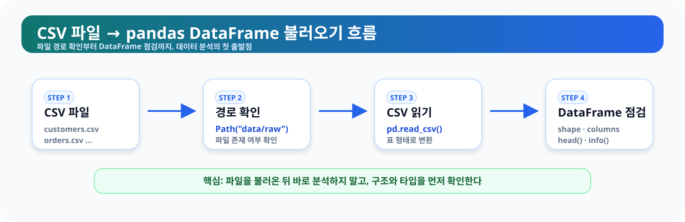
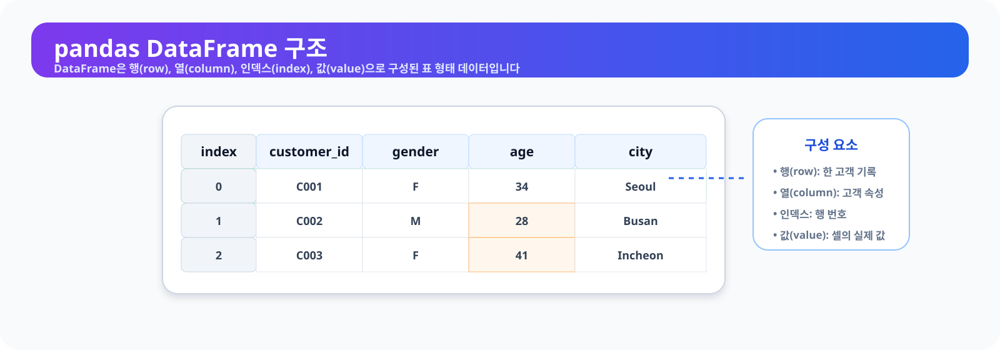
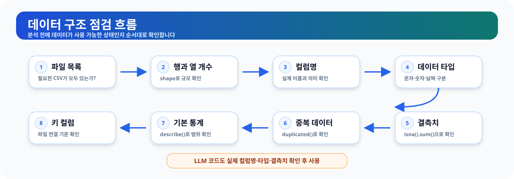
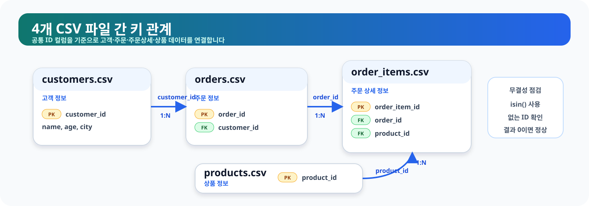
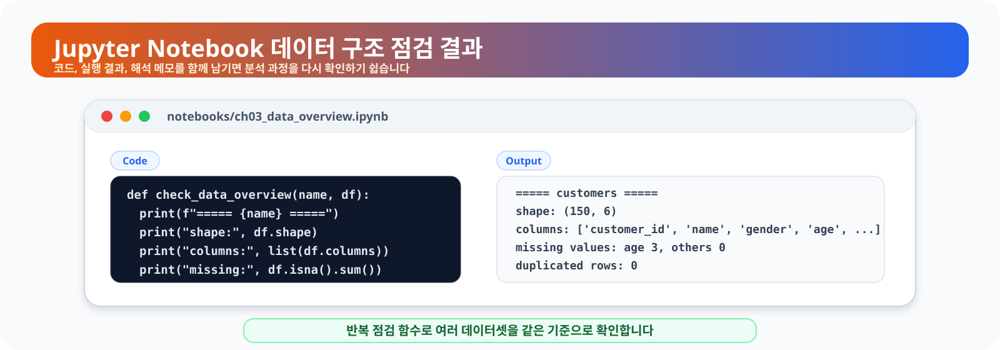

# 3장. 데이터의 첫인상 읽기

데이터 분석은 복잡한 모델이나 화려한 그래프에서 시작하지 않습니다. 먼저 해야 할 일은 데이터가 어떤 모양인지 차분히 살펴보는 것입니다. 파일은 몇 개인지, 각 파일은 어떤 역할을 하는지, 어떤 컬럼이 있고 어떤 값이 들어 있는지 확인해야 이후 분석이 흔들리지 않습니다.

CSV 파일을 pandas로 불러오는 일 자체는 어렵지 않습니다. 하지만 파일을 불러왔다고 해서 곧바로 분석을 시작할 수 있는 것은 아닙니다. 날짜가 문자열로 저장되어 있을 수도 있고, 숫자처럼 보이는 값이 실제로는 문자열일 수도 있습니다. 어떤 컬럼에는 값이 비어 있을 수 있고, 어떤 ID는 중복되어 있을 수도 있습니다. 이런 부분을 확인하지 않고 분석을 시작하면 그래프나 모델 결과가 그럴듯해 보여도 잘못된 결론으로 이어질 수 있습니다.

이번 장에서는 온라인 쇼핑몰 고객·매출 분석 프로젝트에서 사용할 4개의 CSV 파일을 불러오고, 데이터의 기본 구조를 읽는 방법을 살펴봅니다. 이 과정은 이후 pandas 기초, 전처리, 탐색적 데이터 분석(EDA), 시각화, 머신러닝, LLM 기반 분석으로 이어지는 출발점입니다.

## 이 장에서 생각해 볼 질문

데이터를 처음 열었을 때는 다음 질문을 먼저 던져 보는 것이 좋습니다.

- 데이터 파일은 몇 개인가?
- 각 파일은 어떤 역할을 하는가?
- 각 파일은 몇 행, 몇 열로 구성되어 있는가?
- 어떤 컬럼이 있고, 각 컬럼은 어떤 의미를 가지는가?
- 숫자형, 문자열, 날짜형 컬럼은 무엇인가?
- 결측치나 중복 데이터는 없는가?
- 각 데이터셋에서 고유해야 하는 ID는 무엇인가?
- 여러 파일을 연결할 수 있는 기준 컬럼은 무엇인가?
- LLM이 설명한 데이터 구조가 실제 데이터와 일치하는가?

이 질문들에 답할 수 있으면 본격적인 분석에 들어갈 준비가 된 것입니다.

<figure class="figure">
  
  <figcaption>그림 3-1. CSV 파일을 pandas DataFrame으로 불러오는 흐름</figcaption>
</figure>

## 1. 데이터를 보기 전에 확인해야 할 것

데이터 구조를 파악한다는 것은 데이터를 분석하기 전에 데이터가 어떤 형태로 구성되어 있는지 확인하는 과정입니다. 단순히 파일이 열리는지 보는 것이 아니라, 그 데이터가 분석 가능한 상태인지 점검하는 일에 가깝습니다.

예를 들어 `orders.csv`에 `order_date`라는 컬럼이 있다고 가정해 보겠습니다. 이름만 보면 주문일처럼 보입니다. 하지만 이 컬럼이 실제 날짜 타입인지, 문자열인지, 일부 값이 비어 있는지 확인해야 합니다. 날짜가 문자열로 저장되어 있다면 월별 매출 분석을 하기 전에 날짜 타입으로 변환해야 합니다.

데이터를 처음 볼 때는 다음 항목을 순서대로 확인합니다.

| 확인 항목 | 의미 |
| --- | --- |
| 파일 목록 | 분석에 필요한 파일이 모두 있는지 확인합니다. |
| 행과 열 개수 | 데이터 규모와 구조를 파악합니다. |
| 컬럼명 | 어떤 정보가 들어 있는지 확인합니다. |
| 데이터 타입 | 숫자형, 문자열, 날짜형 등 값의 종류를 확인합니다. |
| 결측치 | 비어 있는 값이 있는지 확인합니다. |
| 중복 데이터 | 같은 행이나 고유해야 하는 ID가 반복되는지 확인합니다. |
| 기본 통계 | 숫자형 컬럼의 범위와 이상 가능성을 살펴봅니다. |
| 키 컬럼 | 각 행을 구분하거나 여러 파일을 연결할 기준 컬럼을 확인합니다. |

이 과정은 지루해 보일 수 있지만, 실제 분석에서 가장 중요한 습관 중 하나입니다. 데이터를 제대로 확인한 사람은 이후 전처리와 시각화, 머신러닝 단계에서 발생할 오류를 훨씬 빠르게 발견할 수 있습니다.

## 2. CSV 파일과 DataFrame

CSV는 Comma-Separated Values의 줄임말입니다. 값을 쉼표로 구분해 저장한 텍스트 파일입니다. 메모장으로 열면 쉼표로 구분된 텍스트처럼 보이고, 스프레드시트 프로그램으로 열면 표처럼 보입니다.

pandas는 CSV 파일을 읽어 `DataFrame`이라는 표 형태의 데이터로 다룹니다. DataFrame은 스프레드시트의 시트와 비슷하게 행과 열로 구성되어 있습니다.

| 구성 요소 | 설명 |
| --- | --- |
| 행(row) | 하나의 관측값 또는 기록입니다. |
| 열(column) | 데이터의 속성 또는 변수입니다. |
| 인덱스(index) | DataFrame 안에서 각 행을 구분하는 번호 또는 이름입니다. |
| 값(value) | 행과 열이 만나는 위치에 있는 실제 데이터입니다. |

예를 들어 고객 데이터에서 한 행은 고객 한 명을 의미할 수 있습니다. `customer_id`, `gender`, `age`, `city` 같은 열은 고객의 속성을 의미합니다.

인덱스와 `customer_id`는 역할이 다를 수 있습니다. 인덱스는 pandas가 DataFrame 내부에서 행을 구분하기 위해 사용하는 값이고, `customer_id`는 업무 데이터에서 고객을 식별하는 ID입니다. 따라서 인덱스가 고유하다고 해서 `customer_id`까지 고유하다고 단정해서는 안 됩니다.

<figure class="figure">
  
  <figcaption>그림 3-2. pandas DataFrame 구조 예시</figcaption>
</figure>

DataFrame을 이해하면 이후 pandas 문법도 훨씬 쉽게 받아들일 수 있습니다. 대부분의 데이터 분석 코드는 결국 “어떤 행을 볼 것인가”, “어떤 열을 사용할 것인가”, “어떤 기준으로 묶고 계산할 것인가”의 조합입니다.

## 3. 온라인 쇼핑몰 데이터 살펴보기

이 책에서 사용할 데이터는 가상의 온라인 쇼핑몰 운영 데이터입니다. 분석에 사용할 파일은 4개입니다.

| 파일 | 설명 | 주요 확인 항목 |
| --- | --- | --- |
| `customers.csv` | 고객 정보 | 고객 수, 연령, 성별, 지역, 가입일 |
| `products.csv` | 상품 정보 | 상품 수, 카테고리, 가격 |
| `orders.csv` | 주문 정보 | 주문 수, 주문일, 결제 수단, 주문 상태 |
| `order_items.csv` | 주문 상세 정보 | 주문별 상품, 수량, 단가 |

처음에는 이 파일들을 따로 살펴봅니다. 각 파일이 어떤 구조인지 이해한 뒤에야 고객별 구매 금액, 상품 카테고리별 매출, 주문 취소율 같은 분석으로 확장할 수 있습니다.

온라인 쇼핑몰 데이터에서는 여러 파일의 관계를 이해하는 것이 중요합니다. 고객 정보만으로는 매출을 알 수 없고, 상품 정보만으로는 누가 무엇을 샀는지 알 수 없습니다. 주문과 주문 상세 데이터를 연결해야 실제 구매 과정을 볼 수 있습니다.

기본 생성 스크립트는 결측치와 주요 ID 중복이 없도록 샘플 데이터를 만듭니다. 그렇더라도 실제 분석에서는 파일을 다시 생성하거나 외부 데이터로 교체할 수 있으므로, 구조 점검 과정을 생략하지 않는 것이 좋습니다.

<figure class="figure">
  
  <figcaption>그림 3-3. 데이터 구조 점검 흐름도</figcaption>
</figure>

## 4. 코드로 데이터 구조 확인하기

이번 장의 코드는 `notebooks/ch03_data_overview.ipynb`에서 실행할 수 있습니다. 여기서는 핵심 과정을 살펴봅니다.

먼저 pandas와 파일 경로 관리를 위한 `Path`를 불러옵니다.

```python
from pathlib import Path
import pandas as pd
```

`pandas`는 CSV 파일을 읽고 표 형태 데이터를 다루는 핵심 패키지입니다. `Path`는 현재 작업 폴더와 파일 경로를 다룰 때 사용합니다.

### 현재 작업 폴더 확인하기

CSV 파일을 불러올 때 가장 흔한 오류 중 하나는 파일 경로 오류입니다. 먼저 현재 작업 폴더를 확인합니다.

```python
print("현재 작업 폴더:", Path.cwd())
```

현재 작업 폴더가 프로젝트 루트라면 다음과 같은 파일과 폴더가 보여야 합니다.

```text
README.md
requirements.txt
data/
notebooks/
scripts/
book/
```

Jupyter Notebook을 `notebooks` 폴더를 작업 폴더로 하여 실행한 경우에는 데이터 경로가 달라질 수 있습니다. 파일을 찾지 못하는 오류가 발생하면 코드를 임의로 바꾸기 전에 `Path.cwd()`의 출력과 실제 데이터 파일 위치를 함께 확인합니다.

### 프로젝트 루트와 데이터 경로 설정하기

현재 작업 폴더가 프로젝트 루트이거나 `notebooks` 폴더인 경우를 모두 처리하도록 다음처럼 작성할 수 있습니다.

```python
project_root = Path.cwd()

if project_root.name == "notebooks":
    project_root = project_root.parent

data_dir = project_root / "data" / "raw"
print("데이터 폴더:", data_dir.resolve())
```

이 코드는 현재 작업 폴더 이름이 `notebooks`이면 한 단계 위 폴더를 프로젝트 루트로 사용합니다. 다른 위치에서 노트북을 실행하고 있다면 `project_root`를 실제 프로젝트 폴더 경로로 직접 지정해야 합니다.

파일이 실제로 존재하는지도 확인합니다.

```python
required_files = [
    "customers.csv",
    "products.csv",
    "orders.csv",
    "order_items.csv",
]

for file_name in required_files:
    file_path = data_dir / file_name
    print(f"{file_name}: {file_path.exists()}")
```

예상 출력은 다음과 같습니다.

```text
customers.csv: True
products.csv: True
orders.csv: True
order_items.csv: True
```

하나라도 `False`가 나오면 경로가 잘못되었거나 샘플 데이터가 아직 생성되지 않은 것입니다. 샘플 데이터가 없다면 터미널에서 프로젝트 루트로 이동한 뒤 다음 명령을 실행합니다.

```bash
python scripts/generate_sample_data.py
```

명령을 다른 폴더에서 실행하면 `scripts/generate_sample_data.py` 경로를 찾지 못할 수 있으므로, 실행 전에 터미널의 현재 위치도 확인합니다.

### CSV 파일 불러오기

이제 4개의 CSV 파일을 DataFrame으로 불러옵니다.

```python
customers = pd.read_csv(data_dir / "customers.csv")
products = pd.read_csv(data_dir / "products.csv")
orders = pd.read_csv(data_dir / "orders.csv")
order_items = pd.read_csv(data_dir / "order_items.csv")
```

정상적으로 실행되면 각 CSV 파일이 pandas DataFrame으로 저장됩니다. 이제부터는 이 변수들을 사용해 데이터 구조를 확인할 수 있습니다.

### 데이터 크기 확인하기

`shape`는 데이터의 행과 열 개수를 알려 줍니다.

```python
print("customers:", customers.shape)
print("products:", products.shape)
print("orders:", orders.shape)
print("order_items:", order_items.shape)
```

현재 제공되는 생성 스크립트를 기본 설정으로 실행하면 다음과 같이 출력됩니다.

```text
customers: (150, 6)
products: (100, 4)
orders: (300, 5)
order_items: (764, 5)
```

`shape` 결과는 `(행 개수, 열 개수)` 형식입니다. 예를 들어 `(150, 6)`은 150개의 행과 6개의 열이 있다는 뜻입니다. 생성 스크립트의 옵션이나 데이터가 바뀌면 실제 숫자도 달라질 수 있으므로, 보고서에는 직접 실행한 결과를 기록해야 합니다.

여러 데이터셋의 크기를 하나의 표로 정리하면 전체 구조를 보기 쉽습니다.

```python
summary = pd.DataFrame({
    "dataset": ["customers", "products", "orders", "order_items"],
    "rows": [
        customers.shape[0],
        products.shape[0],
        orders.shape[0],
        order_items.shape[0],
    ],
    "columns": [
        customers.shape[1],
        products.shape[1],
        orders.shape[1],
        order_items.shape[1],
    ],
})

summary
```

예상 결과는 다음과 같은 형태입니다.

| dataset | rows | columns |
| --- | ---: | ---: |
| customers | 150 | 6 |
| products | 100 | 4 |
| orders | 300 | 5 |
| order_items | 764 | 5 |

이 표는 보고서나 발표 자료에서 데이터 개요를 설명할 때도 사용할 수 있습니다.

### 데이터 앞부분과 마지막 부분 확인하기

`head()`는 기본적으로 데이터의 앞부분 5행을 보여줍니다. 괄호 안에 숫자를 넣으면 확인할 행 수를 바꿀 수 있습니다.

```python
customers.head()
customers.head(3)
```

다른 데이터도 같은 방식으로 확인합니다.

```python
products.head()
orders.head()
order_items.head()
```

`head()`를 볼 때는 컬럼명이 예상과 일치하는지, 값의 형태가 자연스러운지, 날짜와 숫자가 어떤 형식으로 저장되어 있는지 살펴봅니다.

앞부분만 보고 전체 데이터가 정상이라고 판단하기는 어렵습니다. `tail()`은 기본적으로 마지막 5행을 보여 줍니다.

```python
customers.tail()
```

`head()`와 `tail()`은 일부 행만 보여 주므로, 이 결과만으로 결측치나 중복이 없다고 판단해서는 안 됩니다.

### 컬럼명 확인하기

컬럼명은 코드 작성에서 매우 중요합니다. LLM이 생성한 코드가 실제 컬럼명과 다르면 오류가 발생합니다.

```python
print(customers.columns)
print(products.columns)
print(orders.columns)
print(order_items.columns)
```

`customers.columns`는 pandas의 `Index` 형태로 표시됩니다. 일반적인 Python 리스트 형태로 보고 싶다면 다음처럼 작성합니다.

```python
list(customers.columns)
```

예를 들어 실제 컬럼은 `customer_id`인데 LLM이 `cust_id`라고 코드를 작성하면 `KeyError`가 발생합니다. 따라서 LLM의 도움을 받더라도 실제 컬럼명은 반드시 데이터에서 직접 확인해야 합니다.

### 데이터 타입 확인하기

`info()`를 사용하면 각 컬럼의 데이터 타입과 비어 있지 않은 값의 개수를 확인할 수 있습니다.

```python
customers.info()
```

다른 데이터도 같은 방식으로 확인합니다.

```python
products.info()
orders.info()
order_items.info()
```

`info()`에서 특히 확인할 항목은 다음과 같습니다.

- 전체 행 수와 컬럼 수
- 각 컬럼의 데이터 타입
- 비어 있지 않은 값의 개수인 `Non-Null Count`
- 날짜처럼 보이지만 `object`로 저장된 컬럼
- 대략적인 메모리 사용량

예를 들어 전체 행이 150개인데 어떤 컬럼의 `Non-Null Count`가 147이라면 해당 컬럼에는 결측치가 3개 있다는 뜻입니다. `object`는 보통 문자열 데이터를 의미하지만, 날짜나 숫자가 문자열로 저장된 경우도 있으므로 값의 실제 형태를 함께 확인해야 합니다.

데이터 타입만 간단히 확인하고 싶을 때는 `dtypes`를 사용할 수 있습니다.

```python
customers.dtypes
```

여러 DataFrame에 같은 점검 코드를 반복하기 위해 이름과 DataFrame을 딕셔너리로 묶을 수 있습니다.

```python
datasets = {
    "customers": customers,
    "products": products,
    "orders": orders,
    "order_items": order_items,
}
```

딕셔너리는 이름과 값을 한 쌍으로 저장하는 Python 자료형입니다. 여기서는 데이터셋 이름을 키로, DataFrame을 값으로 저장합니다. `.items()`를 사용하면 이름과 DataFrame을 하나씩 꺼내 반복할 수 있습니다.

```python
for name, df in datasets.items():
    print(f"\n[{name}]")
    print(df.dtypes)
```

## 5. 결측치, 중복, 데이터 타입 읽기

데이터 구조를 볼 때 우선 확인해야 할 문제는 결측치와 중복입니다. 결측치는 값이 비어 있는 상태이고, 중복은 같은 행이나 같은 ID가 반복되는 상태입니다. 둘 다 분석 결과에 영향을 줄 수 있지만, 발견했다고 해서 무조건 삭제해야 하는 것은 아닙니다.

이번 장에서는 결측치와 중복을 직접 처리하기보다, 어느 데이터셋의 어떤 컬럼에서 문제가 발견되는지 기록하는 데 집중합니다. 삭제·대체·보정 방법은 5장 데이터 전처리에서 자세히 다룹니다.

### 결측치 확인하기

결측치는 `isna()`와 `sum()`을 사용해 확인할 수 있습니다.

```python
customers.isna().sum()
```

여러 데이터셋의 결측치를 한 번에 확인할 수도 있습니다.

```python
for name, df in datasets.items():
    print(f"\n[{name}]")
    print(df.isna().sum())
```

결측치 개수와 비율을 함께 보면 컬럼별 상태를 더 쉽게 이해할 수 있습니다.

```python
missing_summary = pd.DataFrame({
    "missing_count": customers.isna().sum(),
    "missing_ratio_pct": customers.isna().mean() * 100,
})

missing_summary
```

현재 기본 생성 스크립트로 만든 `customers.csv`에는 결측치가 없으므로 모든 값이 0으로 나오는 것이 정상입니다. 결과가 다르다면 실제 출력값을 기준으로 원인을 확인합니다.

결측치 비율이 높다면 이후 전처리 단계에서 처리 방법을 결정해야 합니다. 예를 들어 `age` 컬럼에 결측치가 있으면 연령대별 분석에서 일부 고객이 제외될 수 있습니다.

| 처리 방법 | 설명 |
| --- | --- |
| 행 제외 | 결측치가 있는 행을 특정 분석에서 제외합니다. |
| 대표값 대체 | 평균, 중앙값, 최빈값 등으로 채웁니다. |
| 별도 범주 처리 | `Unknown` 같은 범주로 표시합니다. |
| 컬럼 제외 | 분석 목적에 적합하지 않은 컬럼은 사용하지 않습니다. |
| 원인 확인 | 원본 데이터 수집 과정에서 문제가 있었는지 확인합니다. |

어떤 방법이 적절한지는 컬럼의 의미, 결측 원인, 분석 목적에 따라 달라집니다.

### 전체 행 중복 확인하기

전체 행이 중복되어 있는지 확인합니다.

```python
customers.duplicated().sum()
```

여러 데이터셋의 중복 행 개수를 확인할 수도 있습니다.

```python
for name, df in datasets.items():
    duplicated_count = df.duplicated().sum()
    print(f"{name}: {duplicated_count}")
```

단, 모든 값의 반복이 오류는 아닙니다. 예를 들어 `order_items`에서는 같은 `order_id`가 여러 번 나올 수 있습니다. 한 주문에 여러 상품이 포함될 수 있기 때문입니다.

### 주요 ID의 결측치와 중복 확인하기

각 데이터셋에서 한 행을 고유하게 구분해야 하는 ID는 따로 확인해야 합니다.

```python
key_columns = {
    "customers": "customer_id",
    "products": "product_id",
    "orders": "order_id",
    "order_items": "order_item_id",
}

for name, key_column in key_columns.items():
    df = datasets[name]
    null_count = df[key_column].isna().sum()
    duplicated_count = df[key_column].duplicated().sum()

    print(
        f"{name}.{key_column} - "
        f"결측치: {null_count}, 중복: {duplicated_count}"
    )
```

현재 샘플 데이터에서는 모든 결과가 0이어야 합니다. 반면 `order_items["order_id"]`의 중복은 자연스럽습니다. 한 주문에 여러 주문 상세 행이 연결될 수 있기 때문입니다.

중복 여부는 숫자만 보고 판단하지 말고, 해당 컬럼이 고유해야 하는 ID인지 여러 행에서 반복될 수 있는 연결 ID인지 구분해 해석해야 합니다.

### 숫자형 컬럼 기본 통계 확인하기

`describe()`는 숫자형 컬럼의 기본 통계 정보를 보여 줍니다. ID는 숫자로 저장되어 있어도 크기나 평균에 업무적 의미가 없는 식별자이므로, 분석할 숫자 컬럼을 명시적으로 선택하는 것이 좋습니다.

```python
customers[["age"]].describe()
```

상품 가격과 주문 상세의 수량·단가도 확인합니다.

```python
products[["price"]].describe()
order_items[["quantity", "unit_price"]].describe()
```

`describe()`에서 확인할 주요 항목은 다음과 같습니다.

| 항목 | 의미 |
| --- | --- |
| count | 결측치를 제외한 값의 개수 |
| mean | 평균 |
| std | 값이 평균 주변에서 얼마나 퍼져 있는지를 나타내는 표준편차 |
| min | 최소값 |
| 25% | 값을 작은 순서로 놓았을 때 하위 25% 지점인 1사분위수 |
| 50% | 가운데 값인 중앙값 |
| 75% | 하위 75% 지점인 3사분위수 |
| max | 최대값 |

최댓값이나 최솟값이 업무적으로 가능한 범위를 벗어나면 이상치 가능성을 의심할 수 있습니다. 평균과 중앙값의 차이가 크면 값의 분포가 한쪽으로 치우쳐 있을 가능성도 있습니다. 다만 `describe()`만으로 이상치를 확정해서는 안 되며, 원본 값과 업무 규칙을 함께 확인해야 합니다.

현재 샘플 데이터의 가격 컬럼은 숫자형이므로 별도 변환이 필요하지 않습니다. 다만 실무 데이터에서는 숫자가 `"10,000"`처럼 쉼표가 포함된 문자열로 저장되는 경우가 있습니다. 다음 코드는 이러한 상황을 설명하기 위한 참고 예시입니다.

```python
price_text = pd.Series(["10,000", "25,500", "3000", "확인 필요"])

price_number = pd.to_numeric(
    price_text.str.replace(",", "", regex=False),
    errors="coerce",
)

price_number
```

`errors="coerce"`는 숫자로 변환할 수 없는 값을 오류로 중단하지 않고 `NaN`으로 바꿉니다. 변환 후에는 새로 생긴 결측치가 있는지 반드시 확인해야 합니다.

```python
price_number.isna().sum()
```

### 범주형 컬럼 고유값 확인하기

문자열 또는 범주형 컬럼은 고유값 개수와 값별 빈도를 확인합니다.

```python
customers["city"].nunique(dropna=False)
customers["city"].value_counts(dropna=False)
```

상품 카테고리와 주문 상태도 확인합니다.

```python
products["category"].value_counts(dropna=False)
orders["order_status"].value_counts(dropna=False)
```

`nunique()`는 서로 다른 값이 몇 개인지 알려 줍니다. `value_counts()`는 각 값이 몇 번 등장했는지 보여 줍니다. `dropna=False`를 지정하면 결측치도 결과에서 제외하지 않고 함께 확인할 수 있습니다.

범주형 컬럼을 볼 때는 다음을 확인합니다.

- 고유값이 몇 개인가?
- 특정 값에 데이터가 지나치게 몰려 있는가?
- 오타나 대소문자·띄어쓰기 차이가 있는가?
- 결측치가 있는가?
- 분석에 사용할 수 있는 그룹 기준인가?

예를 들어 `Seoul`, `seoul`, `SEOUL`이 함께 있다면 같은 지역이 다르게 기록된 것일 수 있습니다. 이런 문제는 전처리 단계에서 정리해야 합니다.

### 날짜 컬럼 확인하기

날짜 컬럼은 분석에서 매우 중요합니다. 월별, 분기별, 요일별 분석을 하려면 날짜 타입으로 변환해야 합니다.

먼저 주문일 컬럼의 앞부분과 데이터 타입을 확인합니다.

```python
orders["order_date"].head()
orders["order_date"].dtype
```

날짜 타입으로 변환합니다.

```python
orders["order_date"] = pd.to_datetime(
    orders["order_date"],
    errors="coerce",
)
```

변환 후에는 타입, 변환 실패 건수, 날짜 범위를 함께 확인합니다.

```python
print("데이터 타입:", orders["order_date"].dtype)
print("날짜 변환 실패 건수:", orders["order_date"].isna().sum())
print("가장 빠른 주문일:", orders["order_date"].min())
print("가장 최근 주문일:", orders["order_date"].max())
```

`errors="coerce"`를 사용하면 날짜로 변환할 수 없는 값이 `NaT`로 바뀝니다. 날짜 변환 실패 건수가 0보다 크면 원본 값에 오타나 형식 차이가 있는지 확인해야 합니다.

고객 가입일인 `signup_date`도 같은 방식으로 확인할 수 있습니다.

```python
customers["signup_date"] = pd.to_datetime(
    customers["signup_date"],
    errors="coerce",
)
```

이 변환은 현재 메모리에 있는 DataFrame을 변경하며 원본 CSV 파일을 자동으로 덮어쓰지는 않습니다. 전처리 결과를 파일로 저장하는 방법은 5장에서 다룹니다.

날짜 범위는 분석 질문을 결정하는 데도 중요합니다. 데이터가 3개월치인지, 1년치인지에 따라 월별 매출 분석의 해석이 달라질 수 있습니다.

## 6. 여러 파일의 관계 확인하기

온라인 쇼핑몰 데이터는 하나의 파일만으로 분석하기 어렵습니다. 고객, 상품, 주문, 주문 상세 데이터가 서로 연결되어 있기 때문입니다.

CSV 파일은 데이터베이스처럼 기본 키와 외래 키 제약조건을 자동으로 검사하지 않습니다. 따라서 부모 데이터의 ID가 고유한지, 연결 대상 ID가 실제로 존재하는지를 코드로 확인해야 합니다.

| 연결 관계 | 의미 |
| --- | --- |
| `customers.customer_id` ↔ `orders.customer_id` | 어떤 고객이 주문했는지 연결합니다. |
| `orders.order_id` ↔ `order_items.order_id` | 주문과 주문 상세를 연결합니다. |
| `products.product_id` ↔ `order_items.product_id` | 주문 상세와 상품 정보를 연결합니다. |

<figure class="figure">
  
  <figcaption>그림 3-4. 4개 CSV 파일 간 키 관계도</figcaption>
</figure>

앞에서 `customer_id`, `product_id`, `order_id`, `order_item_id`의 결측치와 중복을 확인했습니다. 부모 데이터의 ID가 고유하다는 전제 아래, 연결 대상에 존재하지 않는 ID가 있는지 확인합니다.

먼저 `orders`의 `customer_id`가 `customers`에 모두 존재하는지 단계별로 확인합니다.

```python
customer_exists = orders["customer_id"].isin(customers["customer_id"])
invalid_customers = orders.loc[~customer_exists]

print("customers에 없는 customer_id 행 수:", len(invalid_customers))
```

`isin()`은 각 값이 다른 값 목록에 포함되어 있는지를 `True` 또는 `False`로 반환합니다. `~`는 이 참·거짓 조건을 반대로 바꿉니다. 따라서 `~customer_exists`는 고객 데이터에 존재하지 않는 `customer_id`를 가진 주문만 선택합니다.

`order_items`의 `order_id`가 `orders`에 모두 존재하는지도 확인합니다.

```python
order_exists = order_items["order_id"].isin(orders["order_id"])
invalid_orders = order_items.loc[~order_exists]

print("orders에 없는 order_id 행 수:", len(invalid_orders))
```

마지막으로 `order_items`의 `product_id`가 `products`에 모두 존재하는지 확인합니다.

```python
product_exists = order_items["product_id"].isin(products["product_id"])
invalid_products = order_items.loc[~product_exists]

print("products에 없는 product_id 행 수:", len(invalid_products))
```

부모 데이터의 주요 ID에 결측치와 중복이 없고, 세 검사 결과가 모두 0이면 현재 샘플 데이터의 기본적인 연결 관계가 유지되고 있다고 볼 수 있습니다.

검사 결과가 0보다 크다면 해당 행을 바로 삭제하지 말고 다음을 먼저 확인합니다.

- 데이터 생성이나 수집 과정에서 일부 파일이 누락되었는가?
- ID의 데이터 타입이 서로 다른가? 예: 숫자 `1`과 문자열 `"1"`
- 앞뒤 공백이나 표기 차이가 있는가?
- 기준 데이터보다 거래 데이터가 먼저 들어온 시점 차이가 있는가?
- 어떤 병합 방식이 분석 목적에 적합한가?

실제 병합과 조인 방식은 4장에서 자세히 다룹니다.

## 7. 반복 점검을 함수로 정리하기

데이터 구조 확인은 여러 파일에 반복해서 적용하는 작업입니다. 이럴 때는 간단한 함수를 만들어 두면 편리합니다.

```python
def check_data_overview(name, df, key_column=None):
    print(f"===== {name} =====")
    print("shape:", df.shape)

    print("\ncolumns:")
    print(list(df.columns))

    print("\ndtypes:")
    print(df.dtypes)

    print("\nmissing values:")
    print(df.isna().sum())

    print("\nmissing ratio (%):")
    print((df.isna().mean() * 100).round(2))

    print("\nduplicated rows:", df.duplicated().sum())

    if key_column is not None:
        print(f"\n{key_column} missing:", df[key_column].isna().sum())
        print(f"{key_column} duplicated:", df[key_column].duplicated().sum())
```

`def`는 사용자가 직접 함수를 만들 때 사용하는 Python 문법입니다. 위 함수는 데이터셋 이름, DataFrame, 선택적인 ID 컬럼명을 입력받아 크기, 컬럼, 데이터 타입, 결측치, 중복을 한 번에 출력합니다.

각 데이터셋에 적용할 주요 ID를 딕셔너리로 정리합니다.

```python
key_columns = {
    "customers": "customer_id",
    "products": "product_id",
    "orders": "order_id",
    "order_items": "order_item_id",
}
```

여러 데이터셋에 반복 적용합니다.

```python
for name, df in datasets.items():
    check_data_overview(
        name=name,
        df=df,
        key_column=key_columns[name],
    )
    print()
```

Jupyter Notebook에서는 코드, 실행 결과, 해석 메모를 함께 남기면 이후 분석 과정을 다시 확인하기 쉽습니다.

<figure class="figure">
  
  <figcaption>그림 3-5. Jupyter Notebook 데이터 구조 점검 결과 화면 예시</figcaption>
</figure>

이 함수는 간단하지만 실무에서도 유용한 기본 패턴입니다. 새로운 데이터를 받을 때마다 같은 형식으로 구조를 점검하면 분석 초기에 발생하는 실수를 줄일 수 있습니다.

## 8. LLM을 활용해 데이터 구조 점검하기

LLM은 데이터 구조를 설명하고 분석 계획을 세우는 데 도움을 줄 수 있습니다. 하지만 실제 고객명, 주문 상세, 거래 정보처럼 개인이나 거래를 식별할 수 있는 값을 승인되지 않은 외부 LLM 서비스에 그대로 입력해서는 안 됩니다.

원본 행 대신 다음과 같은 구조 정보만 제공하는 것이 좋습니다.

- 컬럼명과 데이터 타입
- 행과 열 개수
- 결측치 개수 또는 비율
- 전체 중복 행 개수
- 주요 ID의 결측치와 중복 개수
- 범주형 컬럼의 고유값 목록 또는 요약
- 날짜 범위

예를 들어 `customers.head()` 결과를 그대로 입력하기보다 실제 점검 결과를 다음처럼 요약해서 질문할 수 있습니다.

```text
customers.csv 구조 요약

컬럼:
- customer_id: int64
- name: object
- gender: object
- age: int64
- city: object
- signup_date: object

데이터 크기: 150행 6열
결측치: 없음
전체 중복 행: 0개
customer_id 중복: 0개

이 데이터 구조를 보고 분석 전에 추가로 확인해야 할 점을 알려 주세요.
실제 데이터 확인 없이 단정하지 말고, 추정과 확인이 필요한 내용을 구분해 주세요.
```

위 숫자는 현재 기본 생성 스크립트의 예상 결과입니다. 데이터가 바뀌었다면 예시를 그대로 복사하지 말고 직접 실행한 결과로 교체해야 합니다.

### 여러 파일의 역할 설명 요청 예시

```text
온라인 쇼핑몰 데이터 분석을 시작하기 전에 다음 CSV 파일들의 구조를 이해하려고 합니다.

파일 목록:
- customers.csv: 고객 정보
- products.csv: 상품 정보
- orders.csv: 주문 정보
- order_items.csv: 주문 상세 정보

각 파일의 역할과 예상되는 연결 키를 설명하고,
분석 전에 확인해야 할 항목을 체크리스트로 정리해 주세요.

실제 데이터 확인 없이 단정하지 말고,
추정한 내용과 실제로 확인해야 할 내용을 구분해 주세요.
```

### 컬럼 의미 추정 요청 예시

```text
다음은 customers.csv의 컬럼 목록입니다.

- customer_id
- name
- gender
- age
- city
- signup_date

각 컬럼의 의미를 추정하고,
데이터 분석에서 어떻게 활용할 수 있는지 표로 정리해 주세요.

컬럼명만으로 확정할 수 없는 내용은
반드시 '확인 필요'라고 표시해 주세요.
```

### 데이터 타입 점검 요청 예시

```text
다음은 orders.csv의 컬럼과 데이터 타입입니다.

order_id: int64
customer_id: int64
order_date: object
payment_method: object
order_status: object

이 데이터 타입을 보고 분석 전에 확인해야 할 점을 알려 주세요.
특히 order_date 컬럼의 변환 방법과 변환 후 검증 항목을 설명해 주세요.
```

### LLM 답변 검증 요청 예시

```text
LLM이 다음과 같이 답했습니다.

"고객 데이터에 age 컬럼이 있으므로 연령대별 매출 분석을 바로 수행하면 됩니다."

이 답변이 충분히 안전한지 검토해 주세요.
실제 분석 전에 추가로 확인해야 할 사항을 알려 주세요.
결측치, 이상치, 고객 데이터와 주문 데이터의 연결 가능성을 포함해 설명해 주세요.
```

LLM이 제안한 분석이 실제 데이터와 맞는지 확인하는 과정은 반드시 필요합니다. 예를 들어 연령대별 매출 분석을 제안했다면 다음을 확인해야 합니다.

- `age` 컬럼이 실제로 존재하는가?
- `age`가 숫자형이며 업무적으로 가능한 범위인가?
- 결측치가 있는가?
- `customer_id`가 고객 데이터에서 고유한가?
- 고객 데이터와 주문 데이터가 `customer_id`로 정상적으로 연결되는가?
- 취소·환불 주문을 매출에 포함할 것인가?

LLM은 초안을 빠르게 만들 수 있지만, 보고서에 들어가는 숫자와 해석은 반드시 실제 실행 결과를 기준으로 확인해야 합니다.

## 9. 구조 점검에서 다음 분석으로

이번 장에서 확인한 결과는 최종 분석 결론이 아닙니다. 데이터 분석을 시작하기 전의 사전 점검 결과입니다. 데이터가 몇 행과 몇 열인지, 어떤 컬럼이 있는지, 결측치와 중복이 있는지, 주요 ID가 고유한지, 파일 간 연결 관계가 유지되는지를 확인해야 이후 분석이 안정적으로 이어집니다.

데이터 구조 점검을 마칠 때는 다음 항목을 확인합니다.

| 점검 항목 | 확인 |
| --- | --- |
| 필요한 CSV 파일이 모두 존재하는가? | □ |
| 현재 작업 폴더와 데이터 경로를 확인했는가? | □ |
| 각 데이터셋의 행과 열 개수를 확인했는가? | □ |
| 컬럼명이 예상과 일치하는가? | □ |
| 숫자형, 문자열, 날짜형 컬럼을 구분했는가? | □ |
| 날짜 컬럼의 변환 실패 건수와 범위를 확인했는가? | □ |
| 결측치가 있는 컬럼과 비율을 확인했는가? | □ |
| 전체 중복 행이 있는지 확인했는가? | □ |
| 주요 ID 컬럼의 결측치와 중복 여부를 확인했는가? | □ |
| ID를 일반 숫자형 변수처럼 해석하지 않았는가? | □ |
| 여러 파일을 연결할 키 컬럼을 확인했는가? | □ |
| 연결 대상에 존재하지 않는 ID가 있는지 확인했는가? | □ |
| LLM에 원본 행 대신 구조 요약을 제공했는가? | □ |
| LLM이 제안한 설명을 실제 데이터와 비교해 검증했는가? | □ |

직접 더 연습해 보고 싶다면 다음을 수행해 봅니다.

- 4개 CSV 파일의 행과 열 개수를 하나의 표로 정리합니다.
- 각 파일의 결측치 비율과 전체 중복 행 개수를 확인합니다.
- 주요 ID 컬럼의 결측치와 중복 여부를 표로 정리합니다.
- 주문일과 가입일을 날짜 타입으로 변환하고 데이터 기간을 확인합니다.
- 범주형 컬럼의 고유값과 빈도를 확인합니다.
- LLM에게 데이터 구조 요약을 요청한 뒤 실제 데이터와 맞는지 검증합니다.
- `check_data_overview()` 함수에 날짜 범위와 범주형 고유값 요약을 추가합니다.

데이터 구조를 이해하면 다음 단계가 훨씬 쉬워집니다. 다음 장에서는 이번 장에서 불러온 데이터를 바탕으로 pandas의 선택, 필터링, 정렬, 집계 기초를 다룹니다.
