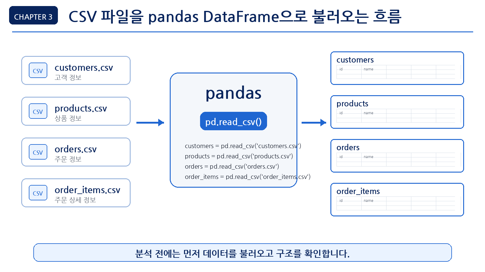
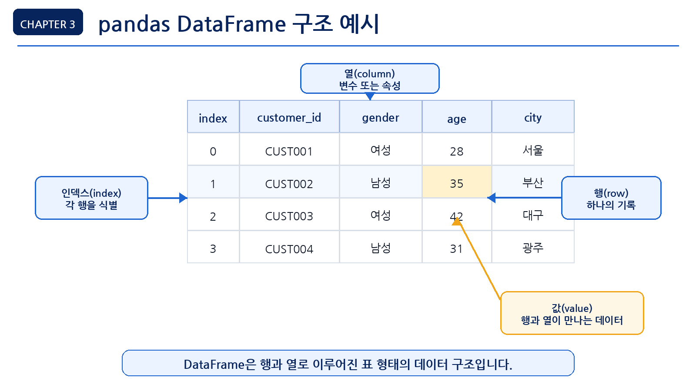
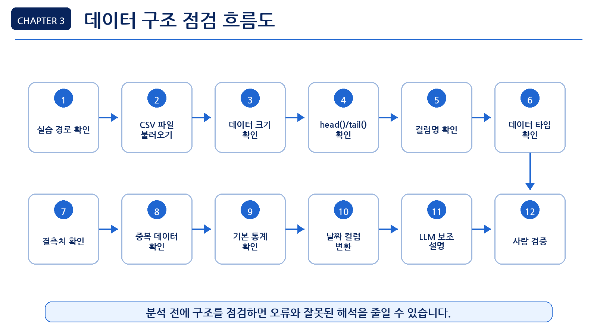
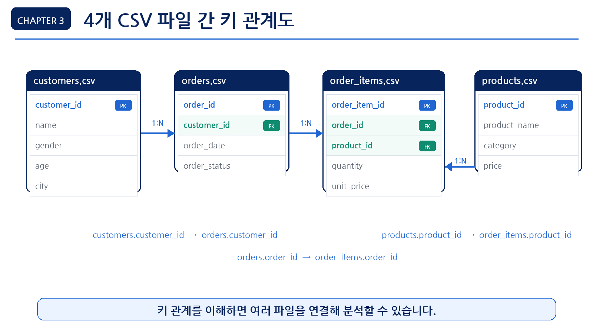
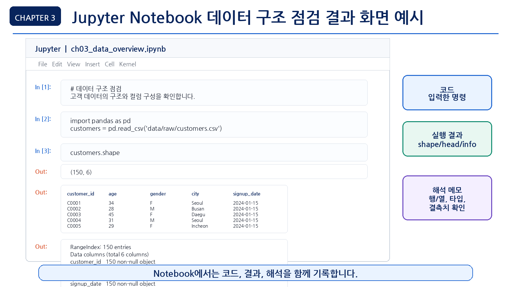

# 3장 데이터 불러오기와 구조 파악

이 장에서는 Chapter 2에서 준비한 실습 환경을 바탕으로, 실제 CSV 파일을 불러오고 데이터의 기본 구조를 확인합니다. 데이터 분석을 시작할 때 가장 먼저 해야 할 일은 복잡한 분석이나 시각화가 아니라 **데이터가 어떤 모양인지 이해하는 것**입니다.

이번 장에서는 온라인 쇼핑몰 고객·매출 분석 프로젝트에서 사용할 4개의 CSV 파일을 불러오고, 각 데이터의 행과 열, 컬럼명, 데이터 타입, 결측치, 중복 여부, 기본 통계 정보를 확인합니다. 이 과정은 이후 전처리, 시각화, LLM 기반 분석, 보고서 작성의 기초가 됩니다.

데이터 구조를 제대로 파악하지 않고 분석을 시작하면 잘못된 컬럼을 사용하거나, 날짜를 문자열로 처리하거나, 결측치를 무시한 채 잘못된 결론을 내릴 수 있습니다. 따라서 이번 장의 핵심은 **분석 전에 데이터를 점검하는 습관**을 만드는 것입니다.

## 수업 시간 구성

| 구성                 |  권장 시간 |
| ------------------ | -----: |
| 데이터 구조 파악 개념 이해    |    30분 |
| CSV 파일 불러오기 실습     |    40분 |
| 행/열/컬럼/데이터 타입 확인   |    50분 |
| 결측치와 중복 데이터 확인     |    40분 |
| 기본 통계와 고유값 확인      |    40분 |
| LLM을 활용한 데이터 구조 설명 |    30분 |
| 연습 문제 및 심화 과제      | 60~90분 |

기본 수업은 약 3시간을 기준으로 구성되어 있습니다. 추가 실습과 연습 문제까지 포함하면 최대 5시간 분량으로 확장할 수 있습니다.


## 1. 학습 목표

이 장을 마치면 학습자는 다음을 할 수 있습니다.

- pandas를 사용해 CSV 파일을 불러올 수 있습니다.
- `DataFrame`의 기본 구조를 설명할 수 있습니다.
- `shape`, `head()`, `tail()`, `columns`, `info()`를 사용해 데이터 구조를 확인할 수 있습니다.
- 데이터 타입이 분석에 미치는 영향을 설명할 수 있습니다.
- 결측치와 중복 데이터를 확인할 수 있습니다.
- 숫자형 컬럼의 기본 통계 정보를 확인할 수 있습니다.
- 범주형 컬럼의 고유값과 빈도를 확인할 수 있습니다.
- 여러 CSV 파일의 관계를 분석 전에 점검할 수 있습니다.
- LLM에게 데이터 구조를 설명하게 하고, 그 답변을 검증할 수 있습니다.


## 2. 이번 장에서 만들 결과물

이번 장에서는 본격적인 분석 결과가 아니라, 분석을 시작하기 위한 **데이터 구조 점검 결과**를 만듭니다.

이번 장에서 만들 결과물은 다음과 같습니다.

- CSV 파일 4개 로드 결과
- 각 데이터셋의 행과 열 개수 요약표
- 각 데이터셋의 컬럼명과 데이터 타입 목록
- 결측치 확인 결과
- 중복 데이터 확인 결과
- 숫자형 컬럼의 기본 통계 요약
- 범주형 컬럼의 고유값 확인 결과
- 데이터 구조 점검 체크리스트
- LLM 데이터 설명 프롬프트와 검증 결과

이 장에서 필요한 그림과 화면 예시는 각 개념이 등장하는 위치에 함께 배치합니다.

<figure class="figure">
  
  <figcaption>그림 3-1. CSV 파일을 pandas DataFrame으로 불러오는 흐름</figcaption>
</figure>


## 3. 핵심 개념

### 3.1 데이터 구조 파악이란 무엇인가

데이터 구조 파악은 데이터를 분석하기 전에 데이터가 어떤 형태로 구성되어 있는지 확인하는 과정입니다.

데이터 구조를 파악할 때는 다음 질문에 답할 수 있어야 합니다.

- 데이터 파일은 몇 개인가?
- 각 파일은 몇 행, 몇 열로 구성되어 있는가?
- 어떤 컬럼이 있는가?
- 각 컬럼은 숫자인가, 문자인가, 날짜인가?
- 비어 있는 값이 있는가?
- 중복된 행이 있는가?
- 분석에 사용할 수 있는 주요 기준 컬럼은 무엇인가?
- 여러 파일을 연결할 수 있는 키 컬럼은 무엇인가?

예를 들어 `orders.csv` 파일에 `order_date`가 있다고 해도, 이 컬럼이 실제 날짜 타입인지 문자열 타입인지 확인해야 합니다. 날짜가 문자열로 저장되어 있으면 월별 매출 분석을 하기 전에 날짜 타입으로 변환해야 합니다.


### 3.2 DataFrame이란 무엇인가

pandas에서 CSV 파일을 읽으면 보통 `DataFrame`이라는 형태로 저장됩니다. DataFrame은 행과 열로 구성된 표 형태의 데이터입니다.

엑셀 시트와 비슷하게 생각하면 이해하기 쉽습니다.

| 구성 요소      | 설명                      |
| ---------- | ----------------------- |
| 행(row)     | 하나의 관측값 또는 기록           |
| 열(column)  | 데이터의 속성 또는 변수           |
| 인덱스(index) | 각 행을 구분하는 번호 또는 이름      |
| 값(value)   | 행과 열이 만나는 위치에 있는 실제 데이터 |

예를 들어 고객 데이터에서 한 행은 고객 한 명을 의미할 수 있습니다. `customer_id`, `gender`, `age`, `city` 같은 열은 고객의 속성을 의미합니다.

<figure class="figure">
  
  <figcaption>그림 3-2. pandas DataFrame 구조 예시</figcaption>
</figure>


### 3.3 데이터 타입이 중요한 이유

데이터 타입은 각 컬럼의 값이 어떤 종류인지 나타냅니다. 데이터 타입에 따라 사용할 수 있는 분석 방법이 달라집니다.

| 데이터 타입 | 예시                          | 분석 활용         |
| ------ | --------------------------- | ------------- |
| 정수형    | `age`, `quantity`           | 합계, 평균, 구간화   |
| 실수형    | `price`, `unit_price`       | 평균, 최대값, 최소값  |
| 문자열    | `name`, `city`, `category`  | 그룹화, 빈도 분석    |
| 날짜형    | `order_date`, `signup_date` | 월별/분기별/요일별 분석 |
| 불리언    | `is_active`                 | 조건 필터링        |

초보자가 자주 만나는 문제는 날짜나 숫자가 문자열로 저장되어 있는 경우입니다. 예를 들어 가격이 `"10,000"`처럼 문자열로 저장되어 있으면 바로 합계를 구하기 어렵습니다. 날짜도 문자열이면 월별 집계를 하기 전에 변환이 필요합니다.


### 3.4 데이터 사전(Data Dictionary)이란 무엇인가

데이터 사전은 각 컬럼이 무엇을 의미하는지 정리한 표입니다. 데이터 분석을 시작하기 전에 데이터 사전을 만들면 컬럼명을 잘못 이해하거나, 분석에 사용할 수 없는 컬럼을 무리하게 사용하는 일을 줄일 수 있습니다.

이번 장에서는 다음과 같은 형식으로 데이터 사전을 작성합니다.

| 컬럼명 | 의미 | 예상 타입 | 확인 방법 |
|---|---|---|---|
| `customer_id` | 고객을 구분하는 ID | 정수형 또는 문자열 ID | `customers["customer_id"].head()` |
| `order_id` | 주문을 구분하는 ID | 정수형 또는 문자열 ID | `orders["order_id"].duplicated().sum()` |
| `product_id` | 상품을 구분하는 ID | 정수형 또는 문자열 ID | `products["product_id"].head()` |
| `order_date` | 주문이 발생한 날짜 | 날짜형 | `pd.to_datetime()` 변환 결과 |
| `price` | 상품 가격 | 숫자형 | `products["price"].describe()` |
| `quantity` | 주문 수량 | 숫자형 | `order_items["quantity"].describe()` |
| `category` | 상품 분류 | 문자열 또는 범주형 | `products["category"].value_counts()` |

데이터 사전의 의미는 처음부터 완벽하게 확정하지 않아도 됩니다. 먼저 컬럼명과 샘플 값을 보고 의미를 추정한 뒤, 데이터 타입과 실제 값의 범위를 확인하면서 수정하면 됩니다.


### 3.5 결측치란 무엇인가

결측치는 데이터에서 값이 비어 있는 상태를 의미합니다. pandas에서는 보통 `NaN`으로 표시됩니다.

결측치가 있으면 다음 문제가 생길 수 있습니다.

- 평균 계산 결과가 달라질 수 있습니다.
- 특정 그룹의 분석 결과가 왜곡될 수 있습니다.
- 머신러닝 모델 학습 시 오류가 발생할 수 있습니다.
- 보고서에서 일부 데이터가 누락된 사실을 놓칠 수 있습니다.

결측치가 있다고 해서 무조건 삭제해야 하는 것은 아닙니다. 먼저 결측치가 어디에 얼마나 있는지 확인하고, 분석 목적에 따라 처리 방법을 결정해야 합니다.


### 3.6 중복 데이터란 무엇인가

중복 데이터는 같은 내용이 두 번 이상 반복된 데이터입니다. 예를 들어 같은 주문 번호가 여러 번 들어 있거나, 동일한 고객 정보가 중복 저장되어 있을 수 있습니다.

중복 데이터가 있으면 다음 문제가 발생할 수 있습니다.

- 주문 수가 실제보다 많게 계산됩니다.
- 매출 합계가 부풀려질 수 있습니다.
- 고객 수가 실제보다 많게 계산됩니다.
- 분석 결과의 신뢰도가 떨어집니다.

하지만 모든 중복이 오류는 아닙니다. 예를 들어 `order_items.csv`에서는 하나의 `order_id`가 여러 번 등장할 수 있습니다. 한 주문에 여러 상품이 포함될 수 있기 때문입니다. 따라서 중복 여부는 데이터의 의미를 이해한 뒤 판단해야 합니다.


## 4. 실습 시나리오

이번 장의 실습 시나리오는 다음과 같습니다.

> 온라인 쇼핑몰 운영 데이터를 분석하기 전에, 고객·상품·주문·주문상세 CSV 파일을 불러오고 각 파일의 기본 구조를 점검합니다. 아직 매출 분석이나 시각화는 하지 않습니다. 먼저 데이터가 분석 가능한 형태인지 확인하는 것이 목표입니다.

이번 장에서 사용할 파일은 다음과 같습니다.

| 파일                | 설명       | 주요 확인 항목              |
| ----------------- | -------- | --------------------- |
| `customers.csv`   | 고객 정보    | 고객 수, 연령, 성별, 지역, 가입일 |
| `products.csv`    | 상품 정보    | 상품 수, 카테고리, 가격        |
| `orders.csv`      | 주문 정보    | 주문 수, 주문일, 결제수단, 주문상태 |
| `order_items.csv` | 주문 상세 정보 | 주문별 상품, 수량, 단가        |

이번 장의 실습 흐름은 다음과 같습니다.

1. 실습 경로 확인
2. CSV 파일 4개 불러오기
3. 각 데이터의 크기 확인
4. 앞부분 데이터 확인
5. 컬럼명 확인
6. 데이터 타입 확인
7. 결측치 확인
8. 중복 데이터 확인
9. 기본 통계 확인
10. LLM에게 데이터 구조 설명 요청
11. 사람이 검증해야 할 부분 정리

<figure class="figure">
  
  <figcaption>그림 3-3. 데이터 구조 점검 흐름도</figcaption>
</figure>


## 5. 실습 코드

이번 장의 전체 실습은 다음 Notebook에서 진행합니다.

```text
notebooks/ch03_data_overview.ipynb
```

본문에는 핵심 코드만 제공합니다.


### 5.1 기본 패키지 불러오기

먼저 pandas와 파일 경로 관리를 위한 `Path`를 불러옵니다.

```python
from pathlib import Path
import pandas as pd
```

`pandas`는 CSV 파일을 읽고 표 형태 데이터를 다루는 핵심 패키지입니다. `Path`는 현재 작업 폴더와 파일 경로를 다룰 때 사용합니다.


### 5.2 현재 작업 폴더 확인하기

CSV 파일을 불러올 때 가장 흔한 오류는 파일 경로 오류입니다. 먼저 현재 작업 폴더를 확인합니다.

```python
print("현재 작업 폴더:", Path.cwd())
```

현재 작업 폴더가 프로젝트 루트라면 다음과 같은 파일과 폴더가 보여야 합니다.

```text
README.md
requirements.txt
data/
notebooks/
scripts/
book/
```

Notebook을 `notebooks` 폴더 안에서 실행하는 경우에는 데이터 경로가 달라질 수 있습니다.


### 5.3 데이터 폴더 경로 설정하기

먼저 프로젝트 루트에서 실행하는 경우를 기준으로 경로를 설정합니다.

```python
data_dir = Path("data/raw")
```

만약 Notebook이 `notebooks` 폴더 안에서 실행되어 파일을 찾지 못한다면 다음 경로를 사용할 수 있습니다.

```python
data_dir = Path("../data/raw")
```

파일 존재 여부를 확인합니다.

```python
print("customers.csv:", (data_dir / "customers.csv").exists())
print("products.csv:", (data_dir / "products.csv").exists())
print("orders.csv:", (data_dir / "orders.csv").exists())
print("order_items.csv:", (data_dir / "order_items.csv").exists())
```

예상 출력은 다음과 같습니다.

```text
customers.csv: True
products.csv: True
orders.csv: True
order_items.csv: True
```

하나라도 `False`가 나오면 경로가 잘못되었거나 샘플 데이터가 생성되지 않은 것입니다.


### 5.4 CSV 파일 불러오기

이제 4개의 CSV 파일을 불러옵니다.

```python
customers = pd.read_csv(data_dir / "customers.csv")
products = pd.read_csv(data_dir / "products.csv")
orders = pd.read_csv(data_dir / "orders.csv")
order_items = pd.read_csv(data_dir / "order_items.csv")
```

정상적으로 실행되면 각 파일이 DataFrame으로 저장됩니다.


### 5.5 데이터 크기 확인하기

각 데이터의 행과 열 개수를 확인합니다.

```python
print("customers:", customers.shape)
print("products:", products.shape)
print("orders:", orders.shape)
print("order_items:", order_items.shape)
```

예상 출력 예시는 다음과 같습니다.

```text
customers: (150, 6)
products: (100, 4)
orders: (300, 5)
order_items: (764, 5)
```

실제 숫자는 샘플 데이터 생성 방식에 따라 달라질 수 있습니다.

`shape` 결과는 `(행 개수, 열 개수)` 형식입니다. 예를 들어 `(150, 6)`은 150개의 행과 6개의 열이 있다는 뜻입니다.


### 5.6 여러 데이터 크기를 표로 정리하기

데이터 크기를 하나의 요약표로 정리하면 전체 구조를 보기 쉽습니다.

```python
summary = pd.DataFrame({
    "dataset": ["customers", "products", "orders", "order_items"],
    "rows": [customers.shape[0], products.shape[0], orders.shape[0], order_items.shape[0]],
    "columns": [customers.shape[1], products.shape[1], orders.shape[1], order_items.shape[1]]
})

summary
```

예상 결과는 다음과 같은 형태입니다.

| dataset     | rows | columns |
| ----------- | ---: | ------: |
| customers   |  150 |       6 |
| products    |  100 |       4 |
| orders      |  300 |       5 |
| order_items |  764 |       5 |

이 표는 보고서나 발표 자료에서도 데이터 개요를 설명할 때 자주 사용됩니다.


### 5.7 데이터 앞부분 확인하기

`head()`는 데이터의 앞부분 5행을 보여줍니다.

```python
customers.head()
```

다른 데이터도 같은 방식으로 확인합니다.

```python
products.head()
```

```python
orders.head()
```

```python
order_items.head()
```

`head()`를 볼 때는 다음을 확인합니다.

- 컬럼명이 예상과 일치하는가?
- 값의 형태가 자연스러운가?
- 날짜가 어떤 형식으로 저장되어 있는가?
- 숫자 컬럼이 숫자처럼 보이는가?
- ID 컬럼이 고유 식별자처럼 보이는가?


### 5.8 데이터 마지막 부분 확인하기

`tail()`은 데이터의 마지막 5행을 보여줍니다.

```python
customers.tail()
```

`head()`만 확인하면 앞부분 데이터만 보고 전체 데이터가 정상이라고 착각할 수 있습니다. `tail()`도 함께 확인하면 데이터가 끝까지 비슷한 구조를 유지하는지 점검할 수 있습니다.


### 5.9 컬럼명 확인하기

각 데이터의 컬럼명을 확인합니다.

```python
print(customers.columns)
print(products.columns)
print(orders.columns)
print(order_items.columns)
```

컬럼명을 리스트로 보고 싶다면 다음처럼 작성할 수 있습니다.

```python
list(customers.columns)
```

컬럼명은 코드 작성에서 매우 중요합니다. LLM이 생성한 코드가 실제 컬럼명과 다르면 오류가 발생합니다.

예를 들어 실제 컬럼은 `customer_id`인데 LLM이 `cust_id`라고 코드를 작성하면 실행되지 않습니다.


### 5.10 데이터 타입 확인하기

`info()`를 사용해 각 컬럼의 데이터 타입과 비어 있지 않은 값의 개수를 확인합니다.

```python
customers.info()
```

```python
products.info()
```

```python
orders.info()
```

```python
order_items.info()
```

`info()`에서 확인할 항목은 다음과 같습니다.

- 컬럼 개수
- 각 컬럼의 데이터 타입
- 비어 있지 않은 값의 개수
- 메모리 사용량
- 날짜처럼 보이지만 문자열로 저장된 컬럼


### 5.11 dtypes로 데이터 타입만 확인하기

`dtypes`를 사용하면 컬럼별 데이터 타입만 간단히 확인할 수 있습니다.

```python
customers.dtypes
```

여러 데이터셋의 타입을 한 번에 확인하려면 다음처럼 작성할 수 있습니다.

```python
datasets = {
    "customers": customers,
    "products": products,
    "orders": orders,
    "order_items": order_items
}

for name, df in datasets.items():
    print(f"\n[{name}]")
    print(df.dtypes)
```


### 5.12 결측치 확인하기

결측치는 `isna()`와 `sum()`을 사용해 확인할 수 있습니다.

```python
customers.isna().sum()
```

여러 데이터셋의 결측치를 한 번에 확인합니다.

```python
for name, df in datasets.items():
    print(f"\n[{name}]")
    print(df.isna().sum())
```

결측치 비율도 확인할 수 있습니다.

```python
missing_summary = customers.isna().mean() * 100
missing_summary
```

결과가 `0`이면 해당 컬럼에 결측치가 없다는 뜻입니다. 결측치 비율이 높다면 이후 전처리 단계에서 처리 방법을 결정해야 합니다.


### 5.13 중복 데이터 확인하기

전체 행이 중복되어 있는지 확인합니다.

```python
customers.duplicated().sum()
```

여러 데이터셋의 중복 행 개수를 확인합니다.

```python
for name, df in datasets.items():
    duplicated_count = df.duplicated().sum()
    print(f"{name}: {duplicated_count}")
```

단, 모든 중복이 오류는 아닙니다. 예를 들어 `order_items`에서는 같은 `order_id`가 여러 번 나올 수 있습니다. 한 주문에 여러 상품이 포함될 수 있기 때문입니다.

ID 컬럼 기준으로 중복을 확인하려면 다음처럼 작성합니다.

```python
customers["customer_id"].duplicated().sum()
```

```python
orders["order_id"].duplicated().sum()
```


### 5.14 파일 간 키 관계 확인하기

여러 CSV 파일을 함께 분석하려면 파일 간 연결 기준이 되는 키 컬럼을 확인해야 합니다. 키 관계가 맞지 않으면 고객별 구매금액이나 상품별 매출을 계산할 때 일부 데이터가 누락될 수 있습니다.

아래 그림은 고객, 주문, 주문 상세, 상품 데이터가 어떤 키 컬럼으로 연결되는지 보여줍니다.

<figure class="figure">
  
  <figcaption>그림 3-4. 4개 CSV 파일 간 키 관계도</figcaption>
</figure>

먼저 `orders`의 `customer_id`가 `customers`에 모두 존재하는지 확인합니다.

```python
invalid_customers = orders[~orders["customer_id"].isin(customers["customer_id"])]
print("customers에 없는 customer_id 수:", len(invalid_customers))
```

`order_items`의 `order_id`가 `orders`에 모두 존재하는지도 확인합니다.

```python
invalid_orders = order_items[~order_items["order_id"].isin(orders["order_id"])]
print("orders에 없는 order_id 수:", len(invalid_orders))
```

마지막으로 `order_items`의 `product_id`가 `products`에 모두 존재하는지 확인합니다.

```python
invalid_products = order_items[~order_items["product_id"].isin(products["product_id"])]
print("products에 없는 product_id 수:", len(invalid_products))
```

세 결과가 모두 `0`이면 현재 샘플 데이터에서는 기본적인 연결 관계가 유지되고 있다고 볼 수 있습니다. 만약 0보다 큰 값이 나오면 어느 파일에서 기준 ID가 빠져 있는지 먼저 확인해야 합니다.


### 5.15 숫자형 컬럼 기본 통계 확인하기

`describe()`는 숫자형 컬럼의 기본 통계 정보를 보여줍니다.

```python
customers.describe()
```

상품 가격의 기본 통계를 확인합니다.

```python
products["price"].describe()
```

실무 데이터에서는 숫자가 `"10,000"`처럼 쉼표가 포함된 문자열로 저장되어 있는 경우도 있습니다. 이때는 쉼표를 제거한 뒤 숫자형으로 변환합니다.

```python
price_text = pd.Series(["10,000", "25,500", "3000"])
price_number = pd.to_numeric(
    price_text.str.replace(",", "", regex=False),
    errors="coerce"
)

price_number
```

`errors="coerce"`는 숫자로 바꿀 수 없는 값이 있을 때 오류를 내지 않고 `NaN`으로 처리합니다. 변환 후에는 결측치가 생겼는지도 함께 확인해야 합니다.

주문 상세 데이터에서 수량과 단가를 확인합니다.

```python
order_items[["quantity", "unit_price"]].describe()
```

`describe()`에서 확인할 주요 항목은 다음과 같습니다.

| 항목    | 의미    |
| ----- | ----- |
| count | 값의 개수 |
| mean  | 평균    |
| std   | 표준편차  |
| min   | 최소값   |
| 25%   | 1사분위수 |
| 50%   | 중앙값   |
| 75%   | 3사분위수 |
| max   | 최대값   |

최댓값이나 최솟값이 지나치게 크거나 작으면 이상치 가능성을 의심할 수 있습니다.


### 5.16 범주형 컬럼 고유값 확인하기

문자형 또는 범주형 컬럼은 고유값 개수와 빈도를 확인합니다.

```python
customers["city"].nunique()
```

```python
customers["city"].value_counts().head()
```

상품 카테고리를 확인합니다.

```python
products["category"].value_counts()
```

주문 상태를 확인합니다.

```python
orders["order_status"].value_counts()
```

범주형 컬럼을 확인할 때는 다음을 봅니다.

- 고유값이 몇 개인가?
- 특정 값에 데이터가 지나치게 몰려 있는가?
- 오타나 표기 차이가 있는가?
- 분석에 사용할 수 있는 그룹 기준인가?

예를 들어 `Seoul`, `seoul`, `SEOUL`이 함께 있다면 같은 지역이 다르게 기록된 것일 수 있습니다. 이런 문제는 전처리 단계에서 정리해야 합니다.


### 5.17 날짜 컬럼 확인하기

날짜 컬럼은 분석에서 매우 중요합니다. 월별, 분기별, 요일별 분석을 하려면 날짜 타입으로 변환해야 합니다.

먼저 주문일 컬럼의 앞부분을 확인합니다.

```python
orders["order_date"].head()
```

데이터 타입을 확인합니다.

```python
orders["order_date"].dtype
```

날짜 타입으로 변환합니다.

```python
orders["order_date"] = pd.to_datetime(orders["order_date"], errors="coerce")
```

변환 후 다시 타입을 확인합니다.

```python
orders["order_date"].dtype
```

날짜 범위도 확인합니다.

```python
print("날짜 변환 실패 건수:", orders["order_date"].isna().sum())
print("가장 빠른 주문일:", orders["order_date"].min())
print("가장 최근 주문일:", orders["order_date"].max())
```

`errors="coerce"`를 사용하면 날짜로 변환할 수 없는 값이 `NaT`로 바뀝니다. 날짜 변환 실패 건수가 0보다 크면 원본 값에 오타나 형식 차이가 있는지 확인해야 합니다.

날짜 범위는 분석 기간을 결정하는 데 중요합니다. 예를 들어 주문 데이터가 3개월치인지, 1년치인지에 따라 분석 질문이 달라집니다.


### 5.18 데이터 구조 점검 함수 만들기

반복 작업을 줄이기 위해 간단한 점검 함수를 만들 수 있습니다.

```python
def check_data_overview(name, df):
    print(f"===== {name} =====")
    print("shape:", df.shape)
    print("\ncolumns:")
    print(list(df.columns))
    print("\ndtypes:")
    print(df.dtypes)
    print("\nmissing values:")
    print(df.isna().sum())
    print("\nduplicated rows:", df.duplicated().sum())
```

함수를 실행합니다.

```python
check_data_overview("customers", customers)
```

여러 데이터셋에 반복 적용할 수 있습니다.

```python
for name, df in datasets.items():
    check_data_overview(name, df)
    print()
```

Jupyter Notebook에서는 코드, 실행 결과, 해석 메모를 함께 남기면 이후 분석 과정을 다시 확인하기 쉽습니다.

<figure class="figure">
  
  <figcaption>그림 3-5. Jupyter Notebook 데이터 구조 점검 결과 화면 예시</figcaption>
</figure>

이 함수는 실무에서도 데이터 구조를 빠르게 확인할 때 사용할 수 있는 기본 패턴입니다.


## 6. LLM 활용 프롬프트

LLM은 데이터 구조를 이해하고 분석 계획을 세우는 데 도움을 줄 수 있습니다. 하지만 실제 데이터 구조와 맞는지는 반드시 사람이 검증해야 합니다.

LLM에 질문할 때는 원본 데이터를 그대로 붙여넣지 않습니다. 고객명, 주문 상세, 실제 거래 정보처럼 개인이나 거래를 식별할 수 있는 값은 제외하고, 컬럼명, 데이터 타입, 행과 열 개수, 결측치 요약, 중복 여부처럼 구조를 설명하는 정보만 입력합니다.

예를 들어 `customers.head()` 전체 결과를 그대로 입력하기보다 다음처럼 요약해서 질문합니다.

```text
customers.csv 컬럼:
- customer_id
- name
- gender
- age
- city
- signup_date

데이터 크기: 150행 6열
결측치: age 컬럼 3개

이 데이터 구조를 보고 분석 전에 확인해야 할 점을 알려 주세요.
```

이 방식은 개인정보와 원본 데이터를 보호하면서도 LLM의 도움을 받을 수 있는 안전한 방법입니다.


### 6.1 데이터 구조 설명 요청

```text
당신은 데이터 분석 강사입니다.

온라인 쇼핑몰 데이터 분석을 시작하기 전에 다음 CSV 파일들의 구조를 이해하려고 합니다.

파일 목록:
- customers.csv: 고객 정보
- products.csv: 상품 정보
- orders.csv: 주문 정보
- order_items.csv: 주문 상세 정보

각 파일이 어떤 역할을 하는지 설명하고,
데이터 분석 전에 확인해야 할 항목을 체크리스트로 정리해 주세요.

초보자가 이해할 수 있도록 쉽게 설명해 주세요.
```


### 6.2 컬럼 의미 추정 요청

```text
다음은 customers.csv의 컬럼 목록입니다.

- customer_id
- name
- gender
- age
- city
- signup_date

각 컬럼의 의미를 추정하고,
데이터 분석에서 어떻게 활용할 수 있는지 표로 정리해 주세요.

단, 실제 데이터 확인 없이 단정하지 말고,
추정한 내용과 확인이 필요한 내용을 구분해 주세요.
```


### 6.3 데이터 타입 점검 요청

```text
다음은 orders.csv의 컬럼과 데이터 타입입니다.

order_id: object
customer_id: object
order_date: object
payment_method: object
order_status: object

이 데이터 타입을 보고 분석 전에 확인해야 할 점을 알려 주세요.
특히 order_date 컬럼을 어떻게 처리해야 하는지 설명해 주세요.
```


### 6.4 결측치 점검 해석 요청

```text
다음은 customers.csv의 결측치 확인 결과입니다.

customer_id     0
name            0
gender          0
age             3
city            0
signup_date     0

이 결과를 초보자가 이해할 수 있도록 설명해 주세요.
age 컬럼에 결측치가 있을 때 어떤 분석에 영향을 줄 수 있는지도 알려 주세요.
```


### 6.5 LLM 답변 검증 요청

```text
LLM이 다음과 같이 답했습니다.

"고객 데이터에 age 컬럼이 있으므로 연령대별 매출 분석을 바로 수행하면 됩니다."

이 답변이 충분히 안전한지 검토해 주세요.
실제 분석 전에 추가로 확인해야 할 사항을 알려 주세요.
결측치, 이상치, 고객 데이터와 주문 데이터 연결 가능성을 포함해 설명해 주세요.
```


### 6.6 데이터 구조 요약 보고서 작성 요청

```text
다음 정보를 바탕으로 데이터 구조 요약 보고서 초안을 작성해 주세요.

데이터셋:
- customers: 150행 6열
- products: 100행 4열
- orders: 300행 5열
- order_items: 764행 5열

주요 키:
- customers.customer_id
- orders.customer_id
- orders.order_id
- order_items.order_id
- products.product_id
- order_items.product_id

주의사항:
- 날짜 컬럼은 문자열일 수 있으므로 변환 필요
- 결측치와 중복 여부 확인 필요
- order_items는 한 주문에 여러 상품이 포함될 수 있음

보고서 형식:
- 데이터 개요
- 파일 간 관계
- 분석 전 확인할 점
- 다음 단계
```


## 7. 결과 해석

이번 장에서 확인한 결과는 최종 분석 결론이 아닙니다. 데이터 분석을 시작하기 전의 **사전 점검 결과**입니다.


### 7.1 행과 열 개수 해석

각 데이터셋의 행 개수는 데이터의 규모를 의미합니다.

예를 들어 다음과 같은 결과가 나왔다고 가정합니다.

```text
customers: (150, 6)
products: (100, 4)
orders: (300, 5)
order_items: (764, 5)
```

이 결과는 다음처럼 해석할 수 있습니다.

| 데이터         | 해석                       |
| ----------- | ------------------------ |
| customers   | 고객 150명에 대한 6개 정보가 있음    |
| products    | 상품 100개에 대한 4개 정보가 있음    |
| orders      | 주문 300건에 대한 5개 정보가 있음    |
| order_items | 주문 상세 764건에 대한 5개 정보가 있음 |

`order_items`의 행 수가 `orders`보다 많은 것은 자연스러울 수 있습니다. 한 주문에 여러 상품이 포함될 수 있기 때문입니다.


### 7.2 컬럼명 해석

컬럼명은 분석의 출발점입니다. 컬럼명을 보면 어떤 분석이 가능한지 대략 알 수 있습니다.

예를 들어 다음 컬럼이 있다면 여러 분석이 가능합니다.

| 컬럼           | 가능한 분석       |
| ------------ | ------------ |
| `age`        | 연령대별 고객 분석   |
| `city`       | 지역별 고객 분포    |
| `category`   | 상품 카테고리별 매출  |
| `order_date` | 월별/요일별 주문 분석 |
| `quantity`   | 상품별 판매 수량    |
| `unit_price` | 상품별 단가 분석    |

하지만 컬럼이 있다고 해서 바로 분석할 수 있는 것은 아닙니다. 결측치, 데이터 타입, 이상치, 다른 파일과의 연결 가능성을 확인해야 합니다.


### 7.3 데이터 타입 해석

데이터 타입을 확인하면 어떤 전처리가 필요한지 알 수 있습니다.

예를 들어 `order_date`가 `object`로 표시되면 문자열로 저장되어 있을 가능성이 큽니다. 월별 분석을 하려면 날짜 타입으로 변환해야 합니다.

```python
orders["order_date"] = pd.to_datetime(orders["order_date"], errors="coerce")
print("날짜 변환 실패 건수:", orders["order_date"].isna().sum())
```

`price`나 `unit_price`가 숫자형이 아니라 문자열이라면 합계나 평균을 계산하기 전에 숫자형으로 변환해야 합니다.


### 7.4 결측치 해석

결측치가 있는 컬럼은 분석에 영향을 줄 수 있습니다.

예를 들어 `age` 컬럼에 결측치가 있으면 연령대별 분석에서 일부 고객이 제외될 수 있습니다. `city` 컬럼에 결측치가 있으면 지역별 분석이 부정확해질 수 있습니다.

결측치를 확인한 뒤에는 다음 중 하나를 선택할 수 있습니다.

- 결측치가 있는 행 제외
- 평균값 또는 대표값으로 대체
- `Unknown` 같은 별도 범주로 처리
- 해당 컬럼을 분석에서 제외
- 원본 데이터 수집 과정 확인

어떤 방법을 선택할지는 분석 목적에 따라 달라집니다.


### 7.5 중복 데이터 해석

중복 데이터는 데이터의 의미를 알고 판단해야 합니다.

예를 들어 `customers["customer_id"]`가 중복되면 고객 정보가 중복 저장되었을 가능성이 있습니다. 반면 `order_items["order_id"]`가 중복되는 것은 자연스럽습니다. 한 주문에 여러 상품이 포함될 수 있기 때문입니다.

따라서 중복 확인은 단순히 숫자만 보는 것이 아니라, 해당 컬럼의 의미와 데이터 구조를 함께 이해해야 합니다.


## 8. 실무 적용 포인트

실무 데이터 분석에서는 데이터를 받자마자 모델을 만들거나 그래프를 그리지 않습니다. 먼저 데이터 구조를 확인하고, 분석 가능한 상태인지 점검합니다.

실무에서 자주 사용하는 데이터 점검 순서는 다음과 같습니다.

1. 파일 목록 확인
2. 각 파일의 행과 열 개수 확인
3. 컬럼명 확인
4. 데이터 타입 확인
5. 결측치 확인
6. 중복 데이터 확인
7. 기본 통계 확인
8. 주요 키 컬럼 확인
9. 파일 간 관계 확인
10. 분석 가능 질문 정리

이 과정을 거치면 이후 분석에서 발생할 오류를 크게 줄일 수 있습니다.


### 데이터 구조 점검 체크리스트

| 점검 항목                           | 확인 |
| ------------------------------- | --- |
| 필요한 CSV 파일이 모두 존재하는가?           | □  |
| 각 데이터셋의 행과 열 개수를 확인했는가?         | □  |
| 컬럼명이 예상과 일치하는가?                 | □  |
| 날짜 컬럼의 데이터 타입을 확인했는가?           | □  |
| 숫자 컬럼이 실제 숫자형으로 저장되어 있는가?       | □  |
| 결측치가 있는 컬럼을 확인했는가?              | □  |
| 중복 데이터가 있는지 확인했는가?              | □  |
| 주요 ID 컬럼의 중복 여부를 확인했는가?         | □  |
| 여러 파일을 연결할 키 컬럼을 확인했는가?         | □  |
| 파일 간 키 관계가 실제로 연결 가능한지 확인했는가? | □  |
| LLM에 원본 데이터 대신 구조 요약만 입력했는가?    | □  |
| LLM이 제안한 설명을 실제 데이터와 비교해 검증했는가? | □  |


## 9. 연습 문제

### 기본 연습 문제

1. `customers.csv`, `products.csv`, `orders.csv`, `order_items.csv`를 pandas로 불러오세요.
   - 제출 형식: 코드와 실행 결과
   - 포함 항목: `pd.read_csv()`

2. 4개 데이터셋의 행과 열 개수를 하나의 표로 정리하세요.
   - 제출 형식: DataFrame 출력 결과
   - 포함 항목: 데이터셋 이름, 행 개수, 열 개수

3. 각 데이터셋의 컬럼명을 확인하고 표로 정리하세요.
   - 제출 형식: Markdown 표
   - 포함 항목: 데이터셋 이름, 컬럼 목록

4. 각 데이터셋의 결측치 개수를 확인하세요.
   - 제출 형식: 코드와 출력 결과
   - 포함 항목: `isna().sum()`

5. `orders.csv`의 `order_date` 컬럼을 날짜 타입으로 변환하고 날짜 범위를 확인하세요.
   - 제출 형식: 코드와 출력 결과
   - 포함 항목: `pd.to_datetime()`, `min()`, `max()`


### 심화 과제

1. 데이터 구조 점검 보고서를 작성하세요.
   - 제출 형식: Markdown 문서
   - 포함 항목: 데이터 개요, 주요 컬럼, 결측치, 중복 여부, 파일 간 관계

2. LLM에게 데이터 구조를 설명하게 하는 프롬프트를 작성하고, 답변 중 실제 데이터와 맞지 않거나 추가 검증이 필요한 부분을 표시하세요.
   - 제출 형식: 프롬프트, LLM 답변 요약, 검증 결과

3. `check_data_overview()` 함수를 개선하세요.
   - 제출 형식: Python 코드
   - 조건: 결측치 비율, 중복 행 개수, 데이터 타입 요약을 포함

4. 데이터 구조 점검 요약 파일을 작성하세요.
   - 제출 형식: `reports/ch03_data_overview_summary.md`
   - 포함 항목: 파일별 shape, 주요 컬럼, 결측치, 중복 여부, 키 관계 확인 결과, 날짜 변환 결과, 다음 분석 전 확인 사항


## 10. 정리

이번 장에서는 온라인 쇼핑몰 고객·매출 분석 프로젝트에서 사용할 CSV 파일을 불러오고, 데이터의 기본 구조를 확인했습니다. 데이터 분석의 첫 단계는 복잡한 모델을 만드는 것이 아니라, 데이터가 어떤 형태인지 이해하는 것입니다.

pandas의 `read_csv()`를 사용하면 CSV 파일을 DataFrame으로 불러올 수 있습니다. `shape`, `head()`, `columns`, `info()`, `dtypes`를 사용하면 데이터의 크기, 컬럼, 타입을 확인할 수 있습니다.

결측치와 중복 데이터는 분석 결과에 큰 영향을 줄 수 있습니다. 따라서 분석 전에 반드시 확인해야 합니다. 특히 중복 여부는 데이터의 의미를 알고 판단해야 합니다. `order_items`처럼 같은 주문 번호가 여러 번 등장하는 것이 자연스러운 경우도 있습니다.

날짜 컬럼은 월별, 분기별, 요일별 분석에 자주 사용되므로 데이터 타입을 반드시 확인해야 합니다. 문자열로 저장된 날짜는 `pd.to_datetime()`을 사용해 날짜 타입으로 변환할 수 있습니다.

LLM은 데이터 구조를 설명하고 분석 전 점검 항목을 정리하는 데 도움을 줄 수 있습니다. 하지만 LLM이 제안한 설명은 반드시 실제 데이터의 컬럼명, 데이터 타입, 결측치, 파일 관계와 비교해 검증해야 합니다.

다음 장에서는 이번 장에서 확인한 데이터 구조를 바탕으로 pandas를 사용해 기본 집계, 필터링, 정렬, 그룹화 작업을 수행합니다.
