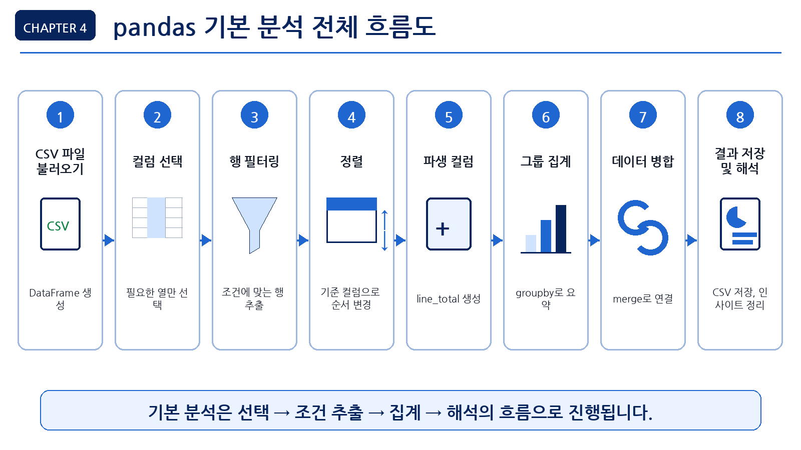
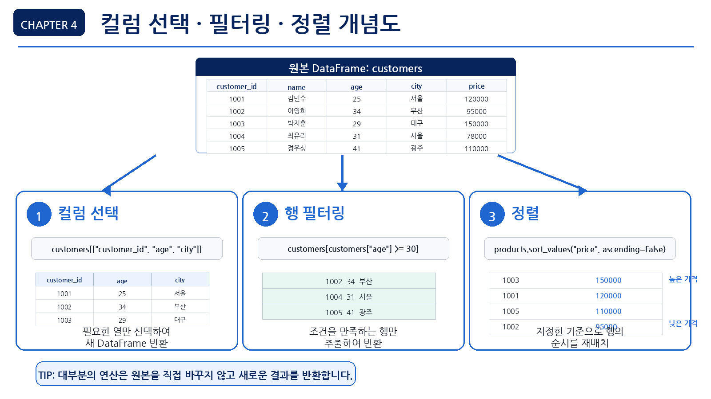
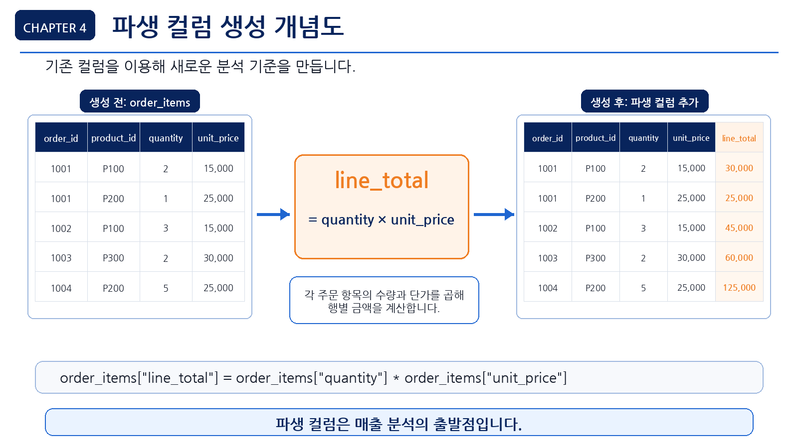
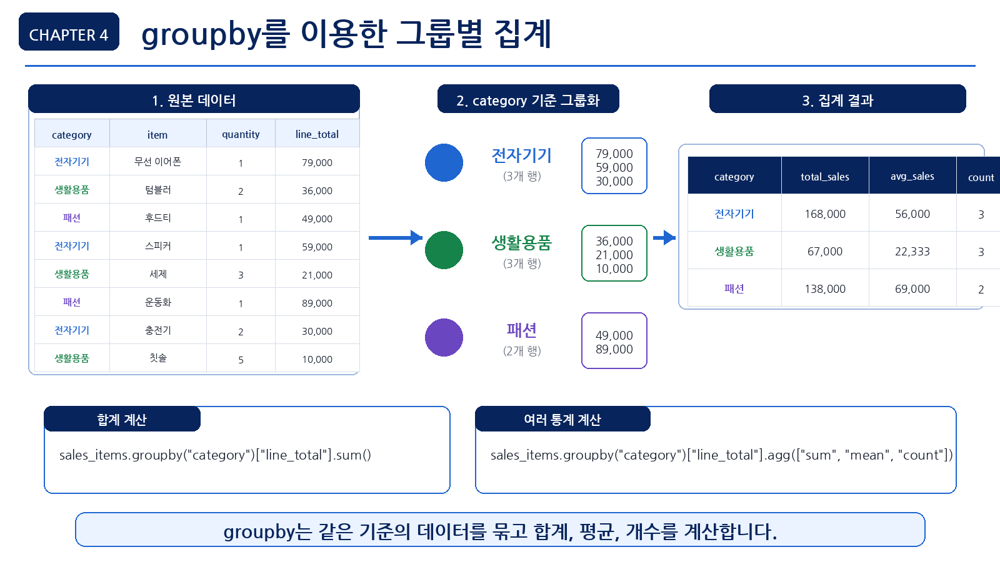
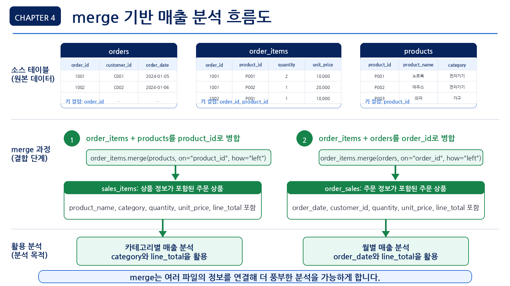

# 4장. pandas로 데이터에 질문하기

3장에서는 데이터를 불러오고 구조를 살펴보았습니다. 파일이 몇 개인지, 어떤 컬럼이 있는지, 결측치와 중복은 없는지, 여러 파일이 어떤 키로 연결되는지 확인했습니다. 이제부터는 데이터를 단순히 바라보는 단계를 넘어, 데이터에 질문을 던지고 pandas로 답을 찾아갑니다.

pandas는 Python 데이터 분석에서 가장 기본적이면서도 강력한 도구입니다. 필요한 컬럼만 고르고, 조건에 맞는 행을 추출하고, 특정 기준으로 정렬하고, 그룹별로 합계나 평균을 계산할 수 있습니다. 대부분의 분석은 이 기본 기능들의 조합에서 시작됩니다.

이번 장의 핵심은 복잡한 머신러닝 모델을 만드는 것이 아닙니다. 데이터를 정확히 선택하고, 조건에 맞게 걸러내고, 새로운 계산 컬럼을 만들고, 여러 파일을 연결해 요약표를 만드는 능력을 익히는 것입니다. 이 능력이 있어야 이후 전처리, EDA, 시각화, 머신러닝, LLM 기반 분석도 안정적으로 이어질 수 있습니다.

## 이 장에서 생각해 볼 질문

pandas 기본 기능은 단순한 문법처럼 보이지만, 실제로는 분석 질문에 답하기 위한 가장 중요한 도구입니다. 다음 질문을 염두에 두고 읽어 보겠습니다.

- 고객 데이터에서 필요한 컬럼만 보고 싶다면 어떻게 해야 할까?
- 30세 이상 고객이나 특정 지역 고객만 추출하려면 어떻게 해야 할까?
- 가격이 높은 상품이나 최근 주문을 빠르게 확인하려면 어떻게 정렬해야 할까?
- 수량과 단가를 이용해 주문 상세 금액을 만들 수 있을까?
- 카테고리별 매출이나 월별 매출은 어떻게 계산할까?
- 여러 CSV 파일을 연결할 때 무엇을 확인해야 할까?
- LLM이 만들어 준 pandas 코드는 어떻게 검증해야 할까?

<figure class="figure">
  
  <figcaption>그림 4-1. pandas 기본 분석 전체 흐름도</figcaption>
</figure>

## 1. pandas 기본 분석의 흐름

pandas 기본 분석은 DataFrame에서 필요한 데이터를 선택하고, 조건에 맞게 걸러내고, 기준별로 요약하는 작업입니다. 실무에서 자주 사용하는 작업은 다음과 같습니다.

| 작업 | pandas 기능 | 예시 |
| --- | --- | --- |
| 컬럼 선택 | `df["컬럼명"]`, `df[[...]]` | 고객 ID와 나이만 선택 |
| 행 필터링 | 조건식 | 30세 이상 고객만 추출 |
| 정렬 | `sort_values()` | 가격이 높은 상품순 정렬 |
| 파생 컬럼 생성 | 새 컬럼 대입 | 수량 × 단가로 매출 계산 |
| 빈도 확인 | `value_counts()` | 지역별 고객 수 확인 |
| 그룹 집계 | `groupby()` | 카테고리별 매출 합계 |
| 파일 연결 | `merge()` | 주문 상세와 상품 데이터 연결 |
| 결과 저장 | `to_csv()` | 분석 요약 결과 CSV 저장 |

이 기능들은 각각 따로 쓰이기도 하지만, 실제 분석에서는 대부분 연결해서 사용합니다. 예를 들어 카테고리별 매출을 계산하려면 주문 상세 데이터에 금액 컬럼을 만들고, 상품 데이터와 병합한 뒤, 카테고리 기준으로 그룹별 합계를 계산해야 합니다.

## 2. 데이터를 선택하고 걸러내는 법

분석은 보통 “무엇을 볼 것인가”에서 시작합니다. 모든 컬럼과 모든 행을 한꺼번에 보는 대신, 질문에 필요한 부분만 선택하면 데이터가 훨씬 읽기 쉬워집니다.

### 컬럼 선택

컬럼 선택은 DataFrame에서 필요한 열만 가져오는 작업입니다. 예를 들어 고객 분석에서 고객 이름까지 모두 필요하지 않을 수 있습니다. 연령, 성별, 지역만 보고 싶다면 해당 컬럼만 선택하면 됩니다.

```python
customers[["customer_id", "gender", "age", "city"]]
```

컬럼을 하나만 선택하면 Series가 됩니다.

```python
customers["city"].head()
```

컬럼을 여러 개 선택하면 DataFrame이 됩니다.

```python
customers[["city", "age"]].head()
```

컬럼 선택은 단순해 보이지만 매우 중요합니다. LLM이 작성한 코드에서 실제 존재하지 않는 컬럼명을 사용하면 오류가 발생하기 때문입니다. 따라서 분석 전에는 항상 `df.columns`로 실제 컬럼명을 확인하는 습관이 필요합니다.

### 행 필터링

행 필터링은 조건에 맞는 데이터만 추출하는 작업입니다. 예를 들어 다음과 같은 질문에 답할 때 사용합니다.

- 30세 이상 고객은 몇 명인가?
- 서울에 거주하는 고객은 누구인가?
- 완료된 주문만 분석하려면 어떻게 해야 하는가?
- 가격이 50,000원 이상인 상품은 무엇인가?

pandas에서는 조건식을 사용해 행을 필터링합니다.

```python
customers[customers["age"] >= 30]
```

조건이 여러 개인 경우에는 `&`, `|`, `~`를 사용합니다.

| 연산자 | 의미 | 예시 |
| --- | --- | --- |
| `&` | 그리고 | 30세 이상이면서 서울 거주 |
| `\|` | 또는 | 서울 또는 부산 거주 |
| `~` | 아니다 | 완료 상태가 아닌 주문 |

조건식을 사용할 때는 각 조건을 괄호로 감싸는 습관을 들이는 것이 좋습니다.

```python
customers[(customers["age"] >= 30) & (customers["city"] == "Seoul")]
```

서울 또는 부산에 거주하는 고객처럼 여러 값 중 하나에 해당하는 데이터를 찾을 때는 `isin()`이 더 읽기 쉽습니다.

```python
customers[customers["city"].isin(["Seoul", "Busan"])]
```

아래 그림은 컬럼 선택, 행 필터링, 정렬이 어떻게 다른 작업인지 보여줍니다.

<figure class="figure">
  
  <figcaption>그림 4-2. 컬럼 선택·필터링·정렬 개념도</figcaption>
</figure>

## 3. 정렬과 파생 컬럼

데이터를 필터링했다면 다음으로는 중요한 값이 위에 오도록 정렬하거나, 기존 컬럼을 이용해 새로운 분석 기준을 만들 수 있습니다.

### 정렬

정렬은 데이터를 특정 기준에 따라 오름차순 또는 내림차순으로 나열하는 작업입니다. 예를 들어 가격이 가장 높은 상품, 나이가 많은 고객, 가장 최근 주문 등을 찾을 때 사용합니다.

```python
products.sort_values("price", ascending=False)
```

`ascending=False`는 내림차순을 의미합니다. 가격, 매출, 주문 수처럼 큰 값을 먼저 보고 싶을 때 자주 사용합니다.

가격이 낮은 상품부터 보고 싶다면 오름차순으로 정렬합니다.

```python
products.sort_values("price", ascending=True).head()
```

정렬 결과를 변수에 저장할 수도 있습니다.

```python
top_price_products = products.sort_values("price", ascending=False)
top_price_products.head()
```

정렬은 결과 해석에서도 중요합니다. 매출이 큰 순서로 정렬하면 어떤 카테고리나 상품이 중요한지 빠르게 파악할 수 있습니다.

### 파생 컬럼 만들기

파생 컬럼은 기존 컬럼을 활용해 새로 만든 컬럼입니다. 주문 상세 데이터에 `quantity`와 `unit_price`가 있다면 두 값을 곱해서 주문 상세 금액을 계산할 수 있습니다.

```python
order_items["line_total"] = order_items["quantity"] * order_items["unit_price"]
```

여기서 `line_total`은 새로 만든 파생 컬럼입니다. 이 컬럼은 이후 상품별 매출, 카테고리별 매출, 월별 매출, 고객별 구매 금액을 계산하는 기초가 됩니다.

파생 컬럼은 실무 분석에서 매우 자주 사용됩니다.

| 기존 컬럼 | 파생 컬럼 예시 | 의미 |
| --- | --- | --- |
| `quantity`, `unit_price` | `line_total` | 주문 상세 금액 |
| `order_date` | `order_month` | 주문 월 |
| `age` | `age_group` | 연령대 |
| `price` | `price_level` | 가격대 |
| `order_status` | `is_completed` | 완료 주문 여부 |

<figure class="figure">
  
  <figcaption>그림 4-3. 파생 컬럼 line_total 생성 개념도</figcaption>
</figure>

이번 장에서는 `line_total`과 `order_month`를 만듭니다. 연령대나 가격대 같은 파생 컬럼은 이후 전처리 장에서 더 자세히 다룹니다.

## 4. 그룹별로 요약하기

그룹별 집계는 데이터를 특정 기준으로 묶고 합계, 평균, 개수 등을 계산하는 작업입니다. 실무 데이터 분석에서 가장 자주 사용하는 pandas 기능 중 하나입니다.

예를 들어 다음 질문에 답할 수 있습니다.

- 상품 카테고리별 매출은 얼마인가?
- 지역별 고객 수는 몇 명인가?
- 주문 상태별 주문 수는 어떻게 되는가?
- 고객별 주문 횟수는 몇 회인가?
- 월별 매출은 어떻게 변하는가?

pandas에서는 `groupby()`를 사용합니다.

```python
products.groupby("category")["price"].mean()
```

`groupby()`는 기준 컬럼으로 데이터를 나눈 뒤, 특정 컬럼에 대해 합계, 평균, 개수 등을 계산합니다.

<figure class="figure">
  
  <figcaption>그림 4-4. groupby를 이용한 그룹별 집계 개념도</figcaption>
</figure>

범주형 데이터의 단순 빈도는 `value_counts()`로 확인할 수 있습니다.

```python
orders["order_status"].value_counts()
```

비율까지 보고 싶다면 `normalize=True`를 사용합니다.

```python
orders["payment_method"].value_counts(normalize=True) * 100
```

`value_counts()`는 단일 컬럼의 분포를 빠르게 확인할 때 좋고, `groupby()`는 여러 기준으로 합계나 평균을 계산할 때 적합합니다.

## 5. 여러 파일을 연결하는 merge

온라인 쇼핑몰 데이터는 하나의 파일만으로 충분히 분석하기 어렵습니다. 예를 들어 카테고리별 매출을 계산하려면 주문 상세 데이터와 상품 데이터를 연결해야 합니다.

- `order_items.csv`: 주문별 상품, 수량, 단가
- `products.csv`: 상품명, 카테고리, 가격

`order_items`에는 `product_id`가 있고, `products`에도 `product_id`가 있습니다. 이 공통 컬럼을 기준으로 두 데이터를 연결할 수 있습니다.

```python
order_items.merge(products, on="product_id", how="left")
```

`merge()`를 사용할 때는 다음을 확인해야 합니다.

- 연결 기준 컬럼이 양쪽 데이터에 모두 있는가?
- 기준 컬럼의 값이 실제로 매칭되는가?
- 연결 후 행 수가 예상과 크게 달라지지 않는가?
- 같은 이름의 컬럼이 중복되지 않는가?
- `how="left"`와 `how="inner"`의 차이를 이해했는가?

아래 그림은 주문 상세 데이터, 상품 데이터, 주문 데이터를 병합해 매출 분석으로 이어지는 흐름을 보여줍니다.

<figure class="figure">
  
  <figcaption>그림 4-5. merge 기반 매출 분석 흐름도</figcaption>
</figure>

이번 장에서는 기본적으로 `how="left"`를 사용합니다. 왼쪽 데이터의 행을 유지하면서 오른쪽 데이터의 정보를 붙이는 방식이기 때문입니다.

## 6. 코드로 pandas 기본 분석하기

이번 장의 코드는 `notebooks/ch04_pandas_basic.ipynb`에서 실행할 수 있습니다. 여기서는 핵심 흐름을 따라가며 pandas 기본 분석을 하나씩 확인합니다.

### 기본 패키지와 데이터 불러오기

먼저 필요한 패키지를 불러오고, 분석 결과를 저장할 폴더를 준비합니다.

```python
from pathlib import Path
import pandas as pd
```

```python
report_dir = Path("reports")
report_dir.mkdir(exist_ok=True)
```

Notebook을 `notebooks` 폴더 안에서 실행하는 경우에는 경로를 다음처럼 조정할 수 있습니다.

```python
report_dir = Path("../reports")
report_dir.mkdir(exist_ok=True)
```

데이터 폴더 경로를 설정합니다.

```python
data_dir = Path("data/raw")
```

파일을 찾지 못하면 다음 경로를 사용합니다.

```python
data_dir = Path("../data/raw")
```

CSV 파일 4개를 불러옵니다.

```python
customers = pd.read_csv(data_dir / "customers.csv")
products = pd.read_csv(data_dir / "products.csv")
orders = pd.read_csv(data_dir / "orders.csv")
order_items = pd.read_csv(data_dir / "order_items.csv")
```

각 데이터의 크기를 확인합니다.

```python
print("customers:", customers.shape)
print("products:", products.shape)
print("orders:", orders.shape)
print("order_items:", order_items.shape)
```

분석을 시작하기 전에 컬럼명을 다시 확인합니다.

```python
print("customers:", list(customers.columns))
print("products:", list(products.columns))
print("orders:", list(orders.columns))
print("order_items:", list(order_items.columns))
```

LLM이 작성한 코드를 사용할 때도 실제 컬럼명과 일치하는지 반드시 확인해야 합니다.

### 필요한 컬럼 선택하기

고객 데이터에서 분석에 필요한 컬럼만 선택합니다.

```python
customer_basic = customers[["customer_id", "gender", "age", "city"]]
customer_basic.head()
```

상품 데이터에서도 필요한 컬럼만 선택할 수 있습니다.

```python
product_basic = products[["product_id", "product_name", "category", "price"]]
product_basic.head()
```

### 조건에 맞는 행 필터링하기

30세 이상 고객만 추출합니다.

```python
customers_over_30 = customers[customers["age"] >= 30]
customers_over_30.head()
```

30세 이상 고객 수를 확인합니다.

```python
len(customers_over_30)
```

서울에 거주하는 고객만 추출합니다.

```python
seoul_customers = customers[customers["city"] == "Seoul"]
seoul_customers.head()
```

도시명이 실제 데이터에서 영어인지 한글인지 먼저 확인하는 것이 좋습니다.

```python
customers["city"].value_counts()
```

30세 이상이면서 서울에 거주하는 고객을 추출합니다.

```python
target_customers = customers[
    (customers["age"] >= 30) &
    (customers["city"] == "Seoul")
]

target_customers.head()
```

서울 또는 부산에 거주하는 고객을 추출합니다.

```python
city_customers = customers[customers["city"].isin(["Seoul", "Busan"])]
city_customers.head()
```

### 주문 상태와 정렬 확인하기

주문 상태별 주문 수를 확인합니다.

```python
orders["order_status"].value_counts()
```

완료된 주문만 추출합니다.

```python
completed_orders = orders[orders["order_status"] == "completed"]
completed_orders.head()
```

실제 데이터에서 주문 상태 값이 `completed`, `Complete`, `완료` 등으로 다를 수 있습니다. 따라서 먼저 `value_counts()`로 실제 값을 확인한 뒤 필터링해야 합니다.

상품 가격이 높은 순서대로 정렬합니다.

```python
products.sort_values("price", ascending=False).head()
```

상품 가격이 낮은 순서대로 정렬합니다.

```python
products.sort_values("price", ascending=True).head()
```

고객 나이가 많은 순서대로 정렬합니다.

```python
customers.sort_values("age", ascending=False).head()
```

### 주문 상세 금액 만들기

주문 상세 데이터에는 상품 수량과 단가가 있습니다. 두 값을 곱하면 주문 상세 금액을 계산할 수 있습니다.

```python
order_items["line_total"] = order_items["quantity"] * order_items["unit_price"]
order_items.head()
```

`line_total` 컬럼의 기본 통계를 확인합니다.

```python
order_items["line_total"].describe()
```

전체 주문 상세 금액 합계를 확인합니다.

```python
total_sales = order_items["line_total"].sum()
total_sales
```

이 값은 주문 상세 기준의 전체 매출 합계로 해석할 수 있습니다. 다만 취소 주문이나 환불 주문이 포함되어 있는지는 추가로 확인해야 합니다.

## 7. 매출 요약표 만들기

pandas 기본 분석은 단순 필터링에서 끝나지 않습니다. 여러 파일을 병합하고, 그룹별로 요약하면 실제 업무 질문에 답할 수 있는 표를 만들 수 있습니다.

### 상품 데이터와 주문 상세 데이터 병합하기

카테고리별 매출을 계산하려면 `order_items`와 `products`를 연결해야 합니다. 먼저 두 데이터의 기준 컬럼을 확인합니다.

```python
print(order_items.columns)
print(products.columns)
```

두 데이터 모두 `product_id`를 가지고 있어야 합니다.

```python
sales_items = order_items.merge(
    products,
    on="product_id",
    how="left"
)

sales_items.head()
```

병합 후 데이터 크기를 확인합니다.

```python
print("병합 전 order_items:", order_items.shape)
print("병합 후 sales_items:", sales_items.shape)
```

`how="left"`를 사용했기 때문에 행 수는 보통 `order_items`와 같아야 합니다. 행 수가 달라졌다면 기준 키 중복이나 매칭 문제를 확인해야 합니다.

상품 정보가 연결되지 않은 행이 있는지 확인합니다.

```python
sales_items["product_name"].isna().sum()
```

카테고리가 비어 있는 행이 있는지도 확인합니다.

```python
sales_items["category"].isna().sum()
```

값이 0이면 모든 주문 상세 데이터가 상품 데이터와 정상적으로 연결된 것입니다.

### 카테고리별 매출 집계하기

카테고리별 매출 합계를 계산합니다.

```python
category_sales = (
    sales_items
    .groupby("category", as_index=False)["line_total"]
    .sum()
    .sort_values("line_total", ascending=False)
)

category_sales
```

컬럼명을 더 읽기 쉽게 바꿀 수 있습니다.

```python
category_sales = category_sales.rename(columns={
    "line_total": "total_sales"
})

category_sales
```

카테고리별 매출 비중도 계산합니다.

```python
category_sales["sales_ratio"] = (
    category_sales["total_sales"] / category_sales["total_sales"].sum() * 100
)

category_sales
```

카테고리별 매출 결과는 어떤 상품군이 매출에 많이 기여했는지 보여줍니다. 다만 매출이 높은 이유가 판매 수량 때문인지, 상품 단가 때문인지는 추가 분석이 필요합니다.

### 상품별 매출 집계하기

상품별 매출을 계산합니다.

```python
product_sales = (
    sales_items
    .groupby(["product_id", "product_name", "category"], as_index=False)
    .agg(
        total_quantity=("quantity", "sum"),
        total_sales=("line_total", "sum")
    )
    .sort_values("total_sales", ascending=False)
)

product_sales.head(10)
```

이 결과를 통해 어떤 상품이 가장 많이 팔렸는지, 어떤 상품이 매출에 크게 기여했는지 확인할 수 있습니다.

### 월별 매출 집계하기

월별 매출을 계산하려면 주문일 정보가 필요합니다. 주문일은 `orders`에 있고, 매출 금액은 `order_items`에 있습니다. 따라서 두 데이터를 `order_id` 기준으로 연결합니다.

```python
order_sales = order_items.merge(
    orders,
    on="order_id",
    how="left"
)

order_sales.head()
```

병합 결과를 확인합니다.

```python
print("병합 전 order_items:", order_items.shape)
print("병합 후 order_sales:", order_sales.shape)
```

주문 정보가 연결되지 않은 행이 있는지 확인합니다.

```python
order_sales["order_date"].isna().sum()
```

`order_date`를 날짜 타입으로 변환합니다.

```python
order_sales["order_date"] = pd.to_datetime(order_sales["order_date"], errors="coerce")
```

날짜 변환 실패 건수를 확인합니다.

```python
order_sales["order_date"].isna().sum()
```

주문 월 컬럼을 만듭니다.

```python
order_sales["order_month"] = order_sales["order_date"].dt.to_period("M").astype(str)
order_sales[["order_date", "order_month"]].head()
```

`.dt`는 날짜형 컬럼에서 연도, 월, 일 같은 날짜 속성을 꺼낼 때 사용하는 접근자입니다. `to_period("M")`은 날짜를 월 단위 기간으로 바꾸고, `astype(str)`은 이후 저장과 표시가 쉽도록 문자열로 변환합니다.

월별 매출을 계산합니다.

```python
monthly_sales = (
    order_sales
    .groupby("order_month", as_index=False)["line_total"]
    .sum()
    .rename(columns={"line_total": "total_sales"})
    .sort_values("order_month")
)

monthly_sales
```

월별 주문 수를 함께 계산하고 싶다면 다음처럼 작성할 수 있습니다.

```python
monthly_summary = (
    order_sales
    .groupby("order_month", as_index=False)
    .agg(
        total_sales=("line_total", "sum"),
        order_count=("order_id", "nunique")
    )
    .sort_values("order_month")
)

monthly_summary
```

`agg(새컬럼명=(원본컬럼명, 집계함수))` 형식은 집계 결과 컬럼명을 직접 정하는 방법입니다. 여기서 `order_count=("order_id", "nunique")`는 주문 상세 행 수가 아니라 고유한 주문 건수를 계산하겠다는 뜻입니다.

### 고객별 구매 금액 집계하기

고객별 구매 금액을 계산하려면 `orders`, `order_items`, `customers`를 연결해야 합니다. 먼저 주문 상세와 주문 데이터를 연결한 `order_sales`를 사용합니다.

```python
customer_sales_base = order_sales.merge(
    customers,
    on="customer_id",
    how="left"
)

customer_sales_base.head()
```

고객별 구매 금액과 주문 횟수를 계산합니다.

```python
customer_sales = (
    customer_sales_base
    .groupby(["customer_id", "name", "city"], as_index=False)
    .agg(
        order_count=("order_id", "nunique"),
        total_sales=("line_total", "sum")
    )
    .sort_values("total_sales", ascending=False)
)

customer_sales.head(10)
```

고객 단위 집계를 더 엄밀하게 하려면 먼저 `customer_id`만 기준으로 매출과 주문 수를 집계한 뒤, `city`나 `name` 같은 고객 속성을 나중에 병합하는 방식도 사용할 수 있습니다. 이번 샘플 데이터에서는 고객별 도시와 이름이 하나로 유지된다는 전제에서 함께 묶어 집계합니다.

### 분석 결과 저장하기

분석 결과를 CSV 파일로 저장합니다.

```python
category_sales.to_csv(report_dir / "ch04_category_sales.csv", index=False)
product_sales.to_csv(report_dir / "ch04_product_sales.csv", index=False)
monthly_summary.to_csv(report_dir / "ch04_monthly_sales.csv", index=False)
customer_sales.to_csv(report_dir / "ch04_customer_sales.csv", index=False)
```

Windows Excel에서 한글이 포함된 CSV를 바로 열 계획이라면 `to_csv(..., encoding="utf-8-sig")` 옵션을 사용할 수 있습니다. Python이나 Jupyter에서 다시 읽는 용도라면 기본 UTF-8 저장만으로도 충분합니다.

저장된 파일 목록을 확인합니다.

```python
list(report_dir.glob("ch04_*.csv"))
```

## 8. 반복되는 분석을 함수로 정리하기

분석을 하다 보면 같은 구조의 점검 코드를 반복해서 사용하게 됩니다. 간단한 요약 함수를 만들어 두면 여러 DataFrame을 빠르게 확인할 수 있습니다.

```python
def summarize_dataframe(name, df):
    print(f"===== {name} =====")
    print("shape:", df.shape)
    print("columns:", list(df.columns))
    print("missing values:", df.isna().sum().sum())
    print("duplicated rows:", df.duplicated().sum())
```

여러 데이터셋에 적용합니다.

```python
datasets = {
    "customers": customers,
    "products": products,
    "orders": orders,
    "order_items": order_items
}

for name, df in datasets.items():
    summarize_dataframe(name, df)
    print()
```

이 함수는 3장의 데이터 구조 점검과 4장의 기본 분석을 연결하는 역할을 합니다. 이후 전처리 장에서는 이런 함수를 더 확장해 결측치 비율, 데이터 타입, 이상치 후보까지 함께 확인할 수 있습니다.

## 9. LLM에게 pandas 코드를 요청하고 검증하기

LLM은 pandas 코드 작성과 분석 아이디어 정리에 도움을 줄 수 있습니다. 하지만 LLM이 만든 코드는 실제 데이터 컬럼명, 데이터 타입, 파일 관계와 반드시 비교해야 합니다.

실제 고객명, 이메일, 주문 상세 원본 데이터를 그대로 LLM에 입력하지 않는 것이 좋습니다. 가능하면 컬럼명, 데이터 크기, 요약 통계, 결측치 개수처럼 구조화된 요약 정보만 입력합니다.

### 필터링 코드 요청 예시

```text
다음 customers DataFrame에서 조건에 맞는 데이터를 필터링하는 pandas 코드를 작성해 주세요.

DataFrame 이름:
customers

컬럼:
- customer_id
- name
- gender
- age
- city
- signup_date

조건:
- age가 30 이상
- city가 Seoul 또는 Busan

초보자가 이해할 수 있도록 코드와 설명을 함께 작성해 주세요.
단, 실제 데이터가 아니라 컬럼 구조만 보고 작성해 주세요.
```

### groupby 집계 코드 요청 예시

```text
온라인 쇼핑몰 주문 상세 데이터에서 카테고리별 매출을 계산하려고 합니다.

DataFrame 정보:
- order_items: order_id, product_id, quantity, unit_price, line_total
- products: product_id, product_name, category, price

하고 싶은 작업:
1. product_id 기준으로 두 DataFrame 병합
2. category별 line_total 합계 계산
3. 매출이 큰 순서로 정렬

pandas 코드로 작성해 주세요.
각 단계마다 초보자용 설명을 주석으로 추가해 주세요.
```

### merge 코드 검토 요청 예시

```text
다음 pandas 코드가 안전한지 검토해 주세요.

sales_items = order_items.merge(products, on="product_id", how="left")

검토할 내용:
- 이 코드가 어떤 의미인지
- 실행 전 확인해야 할 컬럼
- 실행 후 확인해야 할 사항
- 병합 후 행 수가 달라질 때 의심할 수 있는 문제
- 초보자가 자주 하는 실수
```

### 월별 매출 분석 코드 요청 예시

```text
orders와 order_items 데이터를 사용해 월별 매출을 계산하려고 합니다.

orders 컬럼:
- order_id
- customer_id
- order_date
- payment_method
- order_status

order_items 컬럼:
- order_item_id
- order_id
- product_id
- quantity
- unit_price
- line_total

요구사항:
1. order_id 기준으로 두 데이터를 병합
2. order_date를 날짜 타입으로 변환
3. order_month 컬럼 생성
4. 월별 total_sales와 order_count 계산

pandas 코드로 작성해 주세요.
단, 날짜 변환 실패 건수를 확인하는 코드도 포함해 주세요.
```

### LLM 코드 검증 요청 예시

```text
LLM이 다음 코드를 제안했습니다.

category_sales = order_items.groupby("category")["line_total"].sum()

이 코드가 현재 데이터 구조에서 바로 실행 가능한지 검토해 주세요.

현재 데이터 구조:
- order_items에는 order_id, product_id, quantity, unit_price, line_total이 있습니다.
- products에는 product_id, product_name, category, price가 있습니다.

문제점이 있다면 왜 문제가 되는지 설명하고,
올바른 분석 흐름과 수정 코드를 제안해 주세요.
```

이 예시는 LLM이 자주 하는 실수를 잘 보여줍니다. `category`는 `order_items`에 없고 `products`에 있으므로, 먼저 두 데이터를 `product_id` 기준으로 병합해야 합니다. LLM이 만든 코드가 짧고 그럴듯해 보여도 실제 데이터 구조와 맞지 않으면 실행되지 않거나 잘못된 결과를 만들 수 있습니다.

### 분석 결과 해석 요청 예시

```text
다음은 카테고리별 매출 분석 결과입니다.

category,total_sales,sales_ratio
전자기기,12500000,42.5
생활용품,7800000,26.5
패션,6200000,21.1
식품,2900000,9.9

이 결과를 초보자도 이해할 수 있도록 해석해 주세요.

단, 다음 조건을 지켜 주세요.
- 데이터에 없는 내용을 추측하지 말 것
- 원인 분석은 가설로 표현할 것
- 추가로 확인해야 할 데이터 항목을 제안할 것
- 보고서에 넣을 수 있는 문장으로 정리할 것
```

LLM은 결과 해석 문장을 다듬는 데 유용하지만, 데이터에 없는 원인을 단정하지 않도록 주의해야 합니다.

## 10. 결과를 읽는 방법

이번 장의 결과는 최종 인사이트라기보다 pandas 기본 분석을 통해 만든 기초 요약 결과입니다. 기초 요약표를 읽을 때는 “무엇이 높고 낮은가”와 “왜 그런가”를 구분해야 합니다.

예를 들어 30세 이상 고객을 필터링했다면 결과는 다음처럼 해석할 수 있습니다.

```text
전체 고객 중 30세 이상 고객만 추출한 결과입니다.
이 결과는 연령대별 고객 분석이나 특정 고객군 분석의 기초 자료로 사용할 수 있습니다.
```

하지만 여기서 바로 “30세 이상 고객이 더 중요한 고객이다”라고 결론 내리면 안 됩니다. 구매 금액, 주문 횟수, 가입 기간 등을 함께 확인해야 합니다.

가격이 높은 상품을 정렬하면 고가 상품 목록을 확인할 수 있습니다.

```text
상품 가격이 높은 순서로 정렬한 결과입니다.
이 결과는 고가 상품군을 확인하는 데 유용하지만, 실제 매출 기여도를 판단하려면 판매 수량과 주문 데이터를 함께 분석해야 합니다.
```

가격이 높다고 해서 반드시 매출이 높은 것은 아닙니다. 판매 수량이 적으면 매출 기여도는 낮을 수 있습니다.

카테고리별 매출 결과는 어떤 상품군이 매출에 많이 기여했는지 보여줍니다.

```text
전자기기 카테고리의 매출 비중이 가장 높게 나타났습니다.
다만 이 결과가 판매 수량 때문인지, 상품 단가가 높기 때문인지는 추가 분석이 필요합니다.
```

월별 매출은 시간에 따른 매출 흐름을 확인하는 데 사용합니다. 특정 월의 매출 증가 또는 감소를 확인할 수 있지만, 그 원인을 설명하려면 프로모션, 신규 상품 출시, 계절성, 주문 수 변화 등을 추가로 확인해야 합니다. 그래프를 통한 추세 분석은 이후 시각화 장에서 다룹니다.

고객별 구매 금액은 우수 고객 분석의 기초가 됩니다. 다만 일회성 고액 구매 고객과 반복 구매 고객은 구분해서 해석해야 합니다. 따라서 고객별 구매 금액만 보는 것보다 주문 횟수와 함께 보는 것이 좋습니다.

## 11. 기본 분석에서 다음 단계로

pandas 기본 분석은 거의 모든 분석 프로젝트의 출발점입니다. 데이터가 크거나 복잡해도 기본 흐름은 크게 다르지 않습니다.

분석을 마칠 때는 다음 항목을 점검해 봅니다.

| 점검 항목 | 확인 |
| --- | --- |
| 실제 컬럼명을 확인했는가? | □ |
| 필요한 컬럼만 선택했는가? | □ |
| 필터링 조건을 괄호로 명확히 작성했는가? | □ |
| 문자열 값의 실제 표기를 확인했는가? | □ |
| 정렬 기준과 오름차순/내림차순을 확인했는가? | □ |
| 파생 컬럼 계산식이 맞는가? | □ |
| `groupby()` 기준 컬럼이 적절한가? | □ |
| 집계 함수가 분석 목적에 맞는가? | □ |
| `merge()` 기준 컬럼이 양쪽 데이터에 모두 있는가? | □ |
| `merge()` 후 행 수와 결측치를 확인했는가? | □ |
| 날짜 컬럼을 안전하게 변환했는가? | □ |
| LLM이 만든 코드가 실제 데이터 구조와 일치하는가? | □ |
| 분석 결과를 과장해서 해석하지 않았는가? | □ |
| 결과 파일을 적절한 폴더에 저장했는가? | □ |

직접 더 연습해 보고 싶다면 다음을 해볼 수 있습니다.

- 고객 데이터에서 `customer_id`, `gender`, `age`, `city` 컬럼만 선택합니다.
- 30세 이상 고객만 필터링합니다.
- 상품 데이터를 가격이 높은 순서로 정렬합니다.
- 주문 상세 데이터에 `line_total` 컬럼을 생성합니다.
- 상품 데이터와 주문 상세 데이터를 병합한 뒤 카테고리별 매출을 계산합니다.
- 월별 매출 요약표를 작성하고 CSV로 저장합니다.
- LLM에게 카테고리별 매출 분석 코드를 작성하게 한 뒤, 실제 데이터 구조와 맞지 않는 부분을 검토합니다.

이번 장에서는 필요한 데이터를 선택하고, 조건에 맞게 필터링하고, 정렬하고, 그룹별로 집계하는 방법을 살펴보았습니다. 다음 장에서는 이 기본 분석을 더 안정적으로 만들기 위해 결측치, 중복값, 데이터 타입, 날짜, 문자열 표기 문제를 체계적으로 정리하는 데이터 전처리 과정을 다룹니다.
