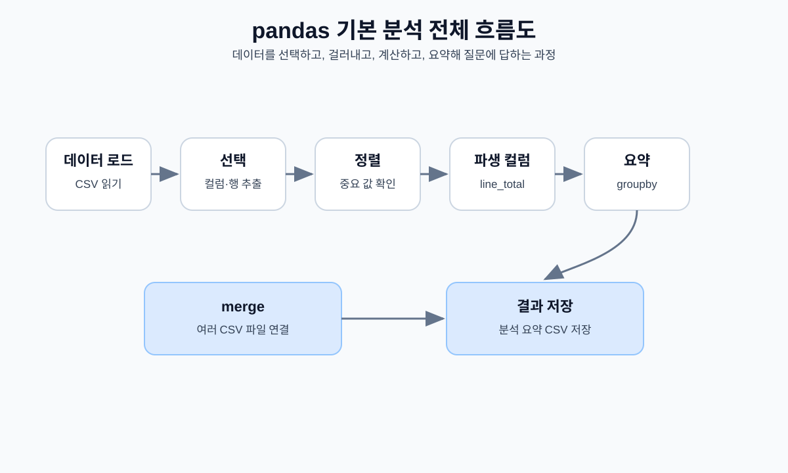
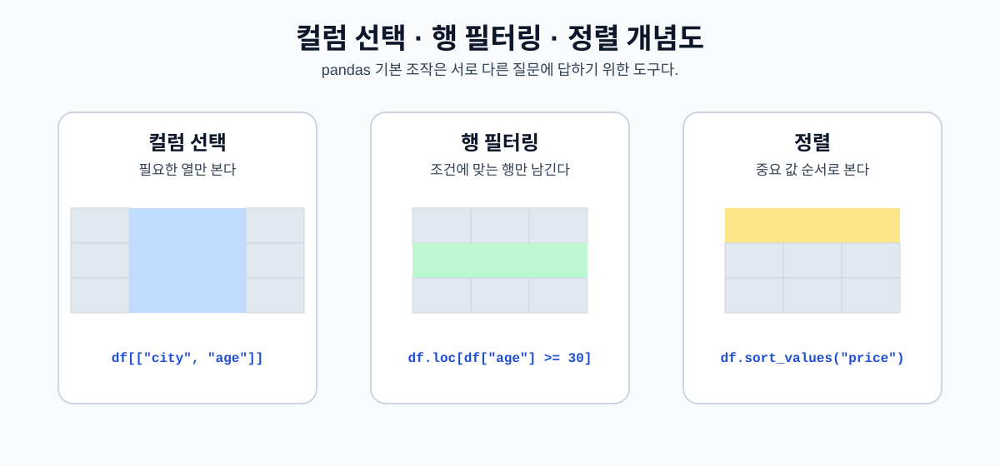
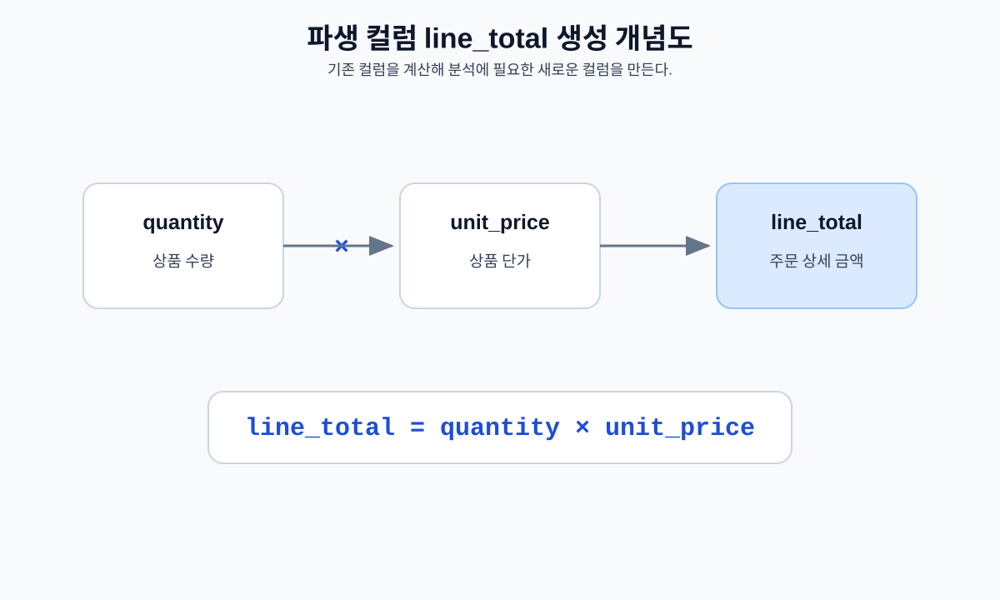
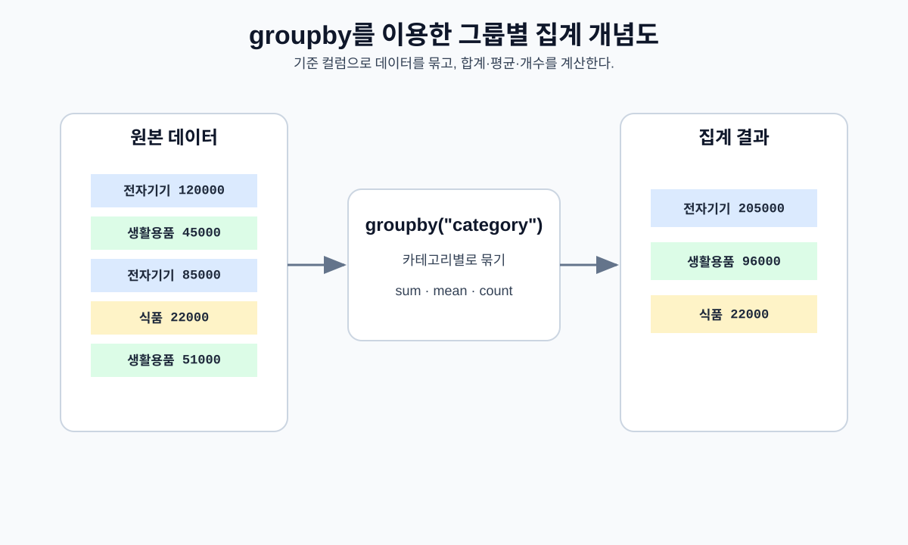
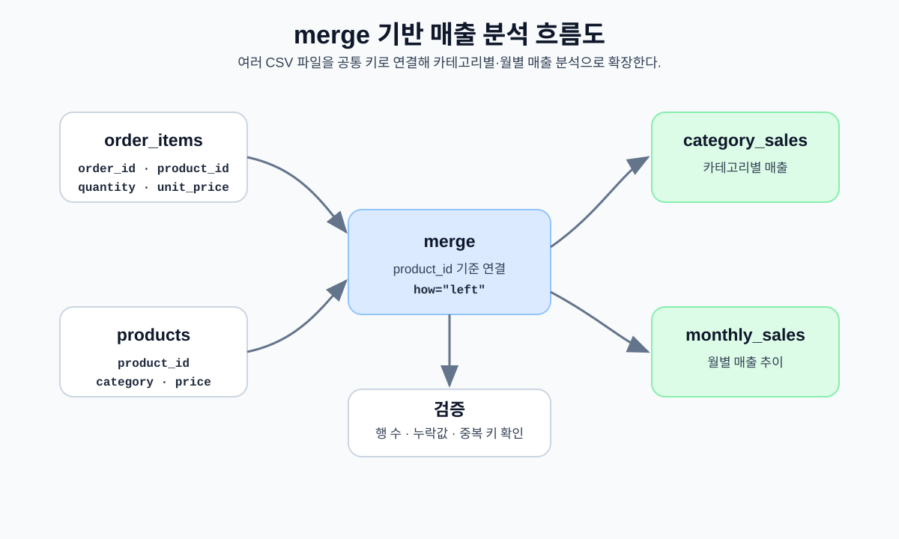

# 4장. pandas로 데이터에 질문하기

3장에서는 데이터를 불러오고 구조를 살펴보았습니다. 파일이 몇 개인지, 어떤 컬럼이 있는지, 결측치와 중복은 없는지, 여러 파일이 어떤 키로 연결되는지 확인했습니다. 이제부터는 데이터를 단순히 바라보는 단계를 넘어, 데이터에 질문을 던지고 pandas로 답을 찾아갑니다.

pandas는 Python 데이터 분석에서 가장 기본적이면서도 강력한 도구입니다. 필요한 컬럼만 고르고, 조건에 맞는 행을 추출하고, 특정 기준으로 정렬하고, 그룹별로 합계나 평균을 계산할 수 있습니다. 대부분의 분석은 이 기본 기능들의 조합에서 시작됩니다.

이번 장의 핵심은 복잡한 머신러닝 모델을 만드는 것이 아닙니다. 데이터를 정확히 선택하고, 조건에 맞게 걸러내고, 새로운 계산 컬럼을 만들고, 여러 파일을 안전하게 연결해 요약표를 만드는 능력을 익히는 것입니다. 이 능력이 있어야 이후 전처리, EDA, 시각화, 머신러닝, LLM 기반 분석도 안정적으로 이어질 수 있습니다.

## 이 장에서 생각해 볼 질문

- 고객 데이터에서 필요한 컬럼만 보고 싶다면 어떻게 해야 할까?
- 30세 이상 고객이나 특정 지역 고객만 추출하려면 어떻게 해야 할까?
- 가격이 높은 상품이나 최근 주문을 빠르게 확인하려면 어떻게 정렬해야 할까?
- 수량과 단가를 이용해 주문 상세 금액을 만들 수 있을까?
- 취소·환불 주문을 제외한 완료 주문 매출은 어떻게 계산할까?
- 카테고리별 매출이나 월별 매출은 어떻게 계산할까?
- 여러 CSV 파일을 연결할 때 결과가 부풀려지지 않았는지 어떻게 검증할까?
- LLM이 만들어 준 pandas 코드는 어떻게 검증해야 할까?

<figure class="figure">
  
  <figcaption>그림 4-1. pandas 기본 분석 전체 흐름도</figcaption>
</figure>

## 1. pandas 기본 분석의 흐름

pandas 기본 분석은 DataFrame에서 필요한 데이터를 선택하고, 조건에 맞게 걸러내고, 기준별로 요약하는 작업입니다.

| 작업 | pandas 기능 | 예시 |
| --- | --- | --- |
| 컬럼 선택 | `df["컬럼명"]`, `df[[...]]` | 고객 ID와 나이만 선택 |
| 행 필터링 | 조건식, `isin()` | 30세 이상 고객만 추출 |
| 정렬 | `sort_values()` | 가격이 높은 상품순 정렬 |
| 파생 컬럼 생성 | 새 컬럼 대입 | 수량 × 단가로 주문 상세 금액 계산 |
| 빈도 확인 | `value_counts()` | 주문 상태별 건수 확인 |
| 그룹 집계 | `groupby()`, `agg()` | 카테고리별 매출 합계 |
| 파일 연결 | `merge()` | 주문 상세와 상품 데이터 연결 |
| 병합 검증 | `validate`, `indicator` | 키 중복과 미매칭 확인 |
| 결과 저장 | `to_csv()` | 분석 요약 결과 CSV 저장 |

이 기능들은 실제 분석에서 연결해서 사용합니다. 예를 들어 카테고리별 완료 주문 매출을 계산하려면 다음 순서가 필요합니다.

1. 주문 상세 데이터에 `line_total`을 만듭니다.
2. 주문 데이터와 병합해 주문 상태를 붙입니다.
3. `completed` 주문만 남깁니다.
4. 상품 데이터와 병합해 카테고리를 붙입니다.
5. 카테고리 기준으로 매출을 집계합니다.
6. 병합 전후 행 수와 미매칭 건수를 검증합니다.

## 2. 데이터를 선택하고 걸러내는 법

분석은 보통 “무엇을 볼 것인가”에서 시작합니다. 모든 컬럼과 모든 행을 한꺼번에 보는 대신, 질문에 필요한 부분만 선택하면 데이터가 훨씬 읽기 쉬워집니다.

### 컬럼 선택

컬럼 하나를 선택하면 Series가 됩니다.

```python
customers["city"].head()
```

컬럼 여러 개를 선택하면 DataFrame이 됩니다.

```python
customers[["customer_id", "gender", "age", "city"]].head()
```

분석 전에는 항상 실제 컬럼명을 먼저 확인합니다.

```python
customers.columns.tolist()
```

LLM이 작성한 코드에서 존재하지 않는 컬럼명을 사용하면 `KeyError`가 발생합니다. 컬럼 이름의 대소문자, 공백, 언어가 실제 데이터와 일치하는지도 확인해야 합니다.

### 행 필터링

30세 이상 고객만 추출합니다.

```python
customers_over_30 = customers[customers["age"] >= 30]
```

조건이 여러 개인 경우에는 `&`, `|`, `~`를 사용합니다.

| 연산자 | 의미 | 예시 |
| --- | --- | --- |
| `&` | 그리고 | 30세 이상이면서 서울 거주 |
| `\|` | 또는 | 서울 또는 부산 거주 |
| `~` | 아니다 | 완료 상태가 아닌 주문 |

각 조건은 괄호로 감싸는 습관을 들이는 것이 좋습니다.

```python
customers[
    (customers["age"] >= 30)
    & (customers["city"] == "서울")
]
```

여러 값 중 하나에 해당하는 데이터를 찾을 때는 `isin()`이 읽기 쉽습니다.

```python
customers[customers["city"].isin(["서울", "부산"])]
```

이 책의 샘플 데이터 생성 스크립트는 도시명을 `서울`, `부산`처럼 한글로 만듭니다. 다른 데이터에서는 `Seoul`, `Busan`처럼 영어로 저장될 수도 있으므로 필터링 전에 실제 값을 확인합니다.

```python
customers["city"].value_counts()
```

<figure class="figure">
  
  <figcaption>그림 4-2. 컬럼 선택·필터링·정렬 개념도</figcaption>
</figure>

## 3. 정렬과 파생 컬럼

### 정렬

가격이 높은 상품부터 확인합니다.

```python
products.sort_values("price", ascending=False).head(10)
```

`ascending=False`는 내림차순, `ascending=True`는 오름차순입니다. 가격, 매출, 주문 수처럼 큰 값을 먼저 보고 싶을 때는 내림차순을 자주 사용합니다.

### 파생 컬럼 만들기

파생 컬럼은 기존 컬럼을 활용해 새로 만든 컬럼입니다. 주문 상세 데이터의 수량과 단가를 곱하면 한 행의 주문 상세 금액을 계산할 수 있습니다.

```python
order_items = order_items.copy()
order_items["line_total"] = (
    order_items["quantity"] * order_items["unit_price"]
)
```

| 기존 컬럼 | 파생 컬럼 | 의미 |
| --- | --- | --- |
| `quantity`, `unit_price` | `line_total` | 주문 상세 1행의 금액 |
| `order_date` | `order_month` | 주문 월 |
| `age` | `age_group` | 연령대 |
| `order_status` | `is_completed` | 완료 주문 여부 |

<figure class="figure">
  
  <figcaption>그림 4-3. 파생 컬럼 line_total 생성 개념도</figcaption>
</figure>

`line_total`의 합계가 곧바로 확정 매출을 의미하는 것은 아닙니다. 주문 상세 데이터에는 취소되거나 환불된 주문의 상품도 포함될 수 있습니다. 따라서 주문 상태를 연결하기 전에는 **전체 주문 상세 금액**으로 표현하는 것이 정확합니다.

```python
all_order_amount = order_items["line_total"].sum()
all_order_amount
```

## 4. 그룹별로 요약하기

그룹별 집계는 데이터를 특정 기준으로 묶고 합계, 평균, 개수 등을 계산하는 작업입니다.

```python
products.groupby("category")["price"].mean()
```

여러 집계를 한 번에 수행할 때는 `agg()`를 사용합니다.

```python
products.groupby("category", as_index=False).agg(
    product_count=("product_id", "nunique"),
    average_price=("price", "mean"),
)
```

<figure class="figure">
  
  <figcaption>그림 4-4. groupby를 이용한 그룹별 집계 개념도</figcaption>
</figure>

단일 컬럼의 값별 빈도는 `value_counts()`로 확인할 수 있습니다.

```python
orders["order_status"].value_counts()
```

비율까지 확인하려면 `normalize=True`를 사용합니다.

```python
orders["payment_method"].value_counts(normalize=True).mul(100).round(1)
```

## 5. 여러 파일을 안전하게 연결하는 merge

온라인 쇼핑몰 데이터는 하나의 파일만으로 충분히 분석하기 어렵습니다.

- `order_items.csv`: 주문별 상품, 수량, 단가
- `products.csv`: 상품명, 카테고리, 가격
- `orders.csv`: 주문일, 고객 ID, 주문 상태
- `customers.csv`: 고객 속성

예를 들어 `order_items`와 `products`는 `product_id`를 기준으로 연결합니다.

```python
sales_items = order_items.merge(
    products,
    on="product_id",
    how="left",
    validate="many_to_one",
)
```

`validate="many_to_one"`은 왼쪽의 `product_id`는 여러 번 나올 수 있지만 오른쪽 `products`의 `product_id`는 한 번만 나와야 한다는 뜻입니다. 상품 테이블의 키가 중복되어 있으면 오류를 발생시켜 잘못된 병합을 조기에 발견할 수 있습니다.

`left merge`가 왼쪽 행 수를 항상 보장하는 것은 아닙니다. 오른쪽 기준 키가 중복되면 왼쪽 한 행이 여러 행으로 늘어날 수 있습니다. 따라서 다음 항목을 확인해야 합니다.

- 양쪽 데이터에 연결 기준 컬럼이 있는가?
- 오른쪽 기준 키가 기대한 대로 고유한가?
- 병합 후 행 수가 예상과 같은가?
- 오른쪽 정보가 연결되지 않은 행은 몇 개인가?
- 같은 이름의 컬럼이 `_x`, `_y`로 중복되지 않았는가?

병합 출처를 직접 확인하려면 `indicator=True`를 사용할 수 있습니다.

```python
sales_items_check = order_items.merge(
    products,
    on="product_id",
    how="left",
    validate="many_to_one",
    indicator=True,
)

sales_items_check["_merge"].value_counts()
```

모든 행이 `both`라면 양쪽 데이터가 정상적으로 연결된 것입니다.

<figure class="figure">
  
  <figcaption>그림 4-5. merge 기반 매출 분석 흐름도</figcaption>
</figure>

## 6. 실습 환경과 데이터 불러오기

이번 장의 전체 코드는 `notebooks/ch04_pandas_basic.ipynb`에서 실행할 수 있습니다.

### 프로젝트 루트 찾기

VS Code에서 Notebook을 실행할 때 현재 작업 폴더가 프로젝트 루트일 수도 있고 `notebooks` 폴더일 수도 있습니다. 고정된 상대 경로만 사용하면 실행 위치에 따라 `FileNotFoundError`가 발생할 수 있습니다.

```python
from pathlib import Path

import pandas as pd


def find_project_root(start_path):
    start_path = Path(start_path).resolve()
    for candidate in [start_path, *start_path.parents]:
        if (
            (candidate / "requirements.txt").exists()
            and (candidate / "scripts").exists()
        ):
            return candidate
    raise FileNotFoundError("프로젝트 루트 폴더를 찾을 수 없습니다.")


PROJECT_ROOT = find_project_root(Path.cwd())
DATA_DIR = PROJECT_ROOT / "data" / "raw"
REPORT_DIR = PROJECT_ROOT / "reports"
REPORT_DIR.mkdir(parents=True, exist_ok=True)
```

### 파일 존재 여부 확인

```python
required_files = [
    "customers.csv",
    "products.csv",
    "orders.csv",
    "order_items.csv",
]

missing_files = [
    filename
    for filename in required_files
    if not (DATA_DIR / filename).exists()
]

if missing_files:
    raise FileNotFoundError(
        "필요한 데이터 파일이 없습니다: " + ", ".join(missing_files)
        + ". 프로젝트 루트에서 "
        + "python scripts/generate_sample_data.py를 실행하세요."
    )
```

### 데이터 불러오기

```python
customers = pd.read_csv(DATA_DIR / "customers.csv")
products = pd.read_csv(DATA_DIR / "products.csv")
orders = pd.read_csv(DATA_DIR / "orders.csv")
order_items = pd.read_csv(DATA_DIR / "order_items.csv")
```

각 데이터의 크기와 컬럼명을 확인합니다.

```python
for name, df in {
    "customers": customers,
    "products": products,
    "orders": orders,
    "order_items": order_items,
}.items():
    print(name, df.shape, df.columns.tolist())
```

## 7. 기본 선택·필터링·정렬 실습

```python
customer_basic = customers[
    ["customer_id", "gender", "age", "city"]
]
customer_basic.head()
```

```python
customers_over_30 = customers[customers["age"] >= 30]
customers_over_30.head()
```

```python
seoul_customers = customers[customers["city"] == "서울"]
seoul_customers.head()
```

```python
city_customers = customers[
    customers["city"].isin(["서울", "부산"])
]
city_customers.head()
```

주문 상태는 필터링 전에 실제 값을 확인합니다.

```python
orders["order_status"].value_counts()
```

```python
completed_orders = orders[
    orders["order_status"] == "completed"
]
completed_orders.head()
```

## 8. 완료 주문 기준 분석 데이터 만들기

먼저 주문 상세 금액을 만듭니다.

```python
order_items = order_items.copy()
order_items["line_total"] = (
    order_items["quantity"] * order_items["unit_price"]
)
```

주문 상태와 주문일을 붙입니다.

```python
order_sales = order_items.merge(
    orders[
        [
            "order_id",
            "customer_id",
            "order_date",
            "order_status",
        ]
    ],
    on="order_id",
    how="left",
    validate="many_to_one",
    indicator=True,
)

print(order_sales["_merge"].value_counts())
order_sales = order_sales.drop(columns="_merge")
```

주문일을 날짜 타입으로 변환하고 실패 건수를 확인합니다.

```python
order_sales["order_date"] = pd.to_datetime(
    order_sales["order_date"],
    errors="coerce",
)

print("날짜 변환 실패:", order_sales["order_date"].isna().sum())
```

완료 주문만 추출합니다.

```python
completed_order_sales = order_sales[
    order_sales["order_status"] == "completed"
].copy()

completed_order_sales["order_month"] = (
    completed_order_sales["order_date"]
    .dt.to_period("M")
    .astype(str)
)
```

이후 이 장에서 사용하는 `매출`은 별도 설명이 없는 한 완료 주문 기준입니다. 취소·환불 주문을 포함한 주문 금액과 완료 주문 매출을 구분해야 결과를 정확하게 해석할 수 있습니다.

## 9. 카테고리별·상품별 매출

완료 주문 상세에 상품 정보를 붙입니다.

```python
completed_sales_items = completed_order_sales.merge(
    products,
    on="product_id",
    how="left",
    validate="many_to_one",
    indicator=True,
)

print(completed_sales_items["_merge"].value_counts())
completed_sales_items = completed_sales_items.drop(columns="_merge")
```

### 카테고리별 매출

```python
category_sales = (
    completed_sales_items
    .groupby("category", as_index=False)
    .agg(
        total_quantity=("quantity", "sum"),
        total_sales=("line_total", "sum"),
    )
    .sort_values("total_sales", ascending=False)
)

category_sales["sales_ratio"] = (
    category_sales["total_sales"]
    / category_sales["total_sales"].sum()
    * 100
).round(2)

category_sales
```

카테고리 매출이 높은 이유가 판매 수량 때문인지, 평균 단가 때문인지는 이 결과만으로 알 수 없습니다. 수량과 단가를 함께 확인해야 합니다.

### 상품별 매출

```python
product_sales = (
    completed_sales_items
    .groupby(
        ["product_id", "product_name", "category"],
        as_index=False,
    )
    .agg(
        total_quantity=("quantity", "sum"),
        total_sales=("line_total", "sum"),
    )
    .sort_values("total_sales", ascending=False)
)

product_sales.head(10)
```

## 10. 월별 매출과 고객별 구매 금액

### 월별 매출

```python
monthly_summary = (
    completed_order_sales
    .groupby("order_month", as_index=False)
    .agg(
        total_sales=("line_total", "sum"),
        order_count=("order_id", "nunique"),
    )
    .sort_values("order_month")
)

monthly_summary["average_order_value"] = (
    monthly_summary["total_sales"]
    / monthly_summary["order_count"]
).round(0)

monthly_summary
```

`order_count=("order_id", "nunique")`는 주문 상세 행 수가 아니라 고유한 주문 건수를 계산한다는 뜻입니다.

### 고객별 구매 금액

고객 식별자인 `customer_id`를 먼저 기준으로 집계한 뒤 고객 속성을 붙입니다. 고객 이름을 그룹 기준에 직접 포함하면 이름 변경이나 중복 이름 때문에 결과가 흔들릴 수 있습니다.

```python
customer_sales = (
    completed_order_sales
    .groupby("customer_id", as_index=False)
    .agg(
        order_count=("order_id", "nunique"),
        total_sales=("line_total", "sum"),
    )
    .sort_values("total_sales", ascending=False)
)

customer_sales = customer_sales.merge(
    customers[["customer_id", "city"]],
    on="customer_id",
    how="left",
    validate="one_to_one",
)

customer_sales["customer_label"] = (
    "Customer " + customer_sales["customer_id"].astype(str)
)

customer_sales[
    [
        "customer_label",
        "city",
        "order_count",
        "total_sales",
    ]
].head(10)
```

보고서나 LLM 입력에는 실제 고객 이름, 이메일, 전화번호보다 익명화된 고객 ID를 사용하는 것이 안전합니다.

## 11. 분석 결과 저장하기

Windows Excel에서 한글 CSV를 바로 열 계획이라면 `encoding="utf-8-sig"`를 사용합니다.

```python
category_sales.to_csv(
    REPORT_DIR / "ch04_category_sales.csv",
    index=False,
    encoding="utf-8-sig",
)

product_sales.to_csv(
    REPORT_DIR / "ch04_product_sales.csv",
    index=False,
    encoding="utf-8-sig",
)

monthly_summary.to_csv(
    REPORT_DIR / "ch04_monthly_sales.csv",
    index=False,
    encoding="utf-8-sig",
)

customer_sales.to_csv(
    REPORT_DIR / "ch04_customer_sales.csv",
    index=False,
    encoding="utf-8-sig",
)
```

저장 후에는 파일 존재 여부도 확인할 수 있습니다.

```python
for path in sorted(REPORT_DIR.glob("ch04_*.csv")):
    print(path.name, path.exists(), path.stat().st_size)
```

## 12. 반복되는 점검을 함수로 정리하기

```python
def summarize_dataframe(name, df):
    print(f"===== {name} =====")
    print("shape:", df.shape)
    print("columns:", df.columns.tolist())
    print("missing values:", int(df.isna().sum().sum()))
    print("duplicated rows:", int(df.duplicated().sum()))
```

```python
datasets = {
    "customers": customers,
    "products": products,
    "orders": orders,
    "order_items": order_items,
}

for name, df in datasets.items():
    summarize_dataframe(name, df)
    print()
```

이 함수는 기본적인 이상 신호를 빠르게 찾는 용도입니다. 결측치의 처리 방법이나 이상값 판단은 다음 장의 전처리 과정에서 더 자세히 다룹니다.

## 13. LLM에게 pandas 코드를 요청하고 검증하기

LLM은 pandas 코드 작성과 분석 아이디어 정리에 도움을 줄 수 있습니다. 하지만 실제 컬럼명, 데이터 타입, 키의 고유성, 주문 상태 범위와 반드시 비교해야 합니다.

실제 고객명, 이메일, 주문 원본을 그대로 입력하지 말고 컬럼명, 데이터 크기, 요약 통계, 결측치 개수처럼 구조화된 정보만 전달하는 것이 좋습니다.

### 필터링 코드 요청 예시

```text
다음 customers DataFrame에서 조건에 맞는 데이터를 필터링하는 pandas 코드를 작성해 주세요.

컬럼:
- customer_id
- gender
- age
- city

조건:
- age가 30 이상
- city가 서울 또는 부산

실제 데이터가 아니라 컬럼 구조만 보고 작성해 주세요.
각 조건을 괄호로 감싸고 isin()을 사용하는 이유도 설명해 주세요.
```

### 안전한 병합 코드 요청 예시

```text
order_items와 products를 product_id 기준으로 left merge하려고 합니다.

요구사항:
- products.product_id가 고유한지 확인
- validate="many_to_one" 사용
- indicator=True로 미매칭 행 확인
- 병합 전후 행 수 비교
- 중복 컬럼 확인

초보자가 이해할 수 있도록 코드와 검증 순서를 작성해 주세요.
```

### 완료 주문 기준 월별 매출 요청 예시

```text
orders와 order_items를 사용해 완료 주문 기준 월별 매출을 계산하려고 합니다.

orders 컬럼:
- order_id
- customer_id
- order_date
- order_status

order_items 컬럼:
- order_id
- product_id
- quantity
- unit_price

요구사항:
1. quantity와 unit_price로 line_total 생성
2. order_id 기준 many-to-one 병합
3. order_date 날짜 변환 실패 건수 확인
4. order_status가 completed인 주문만 필터링
5. 월별 total_sales와 고유 order_count 계산
6. 취소·환불 주문이 제외되었는지 확인
```

### LLM 코드 검증 예시

```text
LLM이 다음 코드를 제안했습니다.

category_sales = order_items.groupby("category")["line_total"].sum()

현재 데이터 구조:
- order_items: order_id, product_id, quantity, unit_price, line_total
- products: product_id, product_name, category, price
- orders: order_id, order_status

이 코드가 바로 실행 가능한지 검토해 주세요.
카테고리 연결 과정과 완료 주문 필터링이 빠져 있다면 이유를 설명하고,
merge 검증을 포함한 수정 코드를 제안해 주세요.
```

LLM이 만든 코드가 짧고 그럴듯해 보여도 실제 데이터 구조와 분석 범위가 맞지 않으면 실행되지 않거나 잘못된 결과를 만들 수 있습니다.

## 14. 결과를 읽는 방법

| 결과 | 확인할 질문 |
| --- | --- |
| 카테고리별 매출 | 완료 주문만 포함했는가? 판매 수량과 단가를 함께 봐야 하는가? |
| 상품별 매출 | 특정 상품에 매출이 집중되는가? |
| 월별 매출 | 월별 기간이 완전한가? 최근 월이 일부 기간만 포함된 것은 아닌가? |
| 고객별 구매 금액 | 일부 고객에게 집중되는가? 개인정보 표현은 안전한가? |
| 병합 결과 | 키 중복과 미매칭 행을 확인했는가? |

숫자를 계산하는 것에서 멈추지 말고, 어떤 조건과 범위로 계산했는지 함께 기록해야 합니다. 데이터에 없는 원인을 단정하지 않고 추가 확인이 필요한 사항을 구분하는 것이 중요합니다.

## 15. 실습 점검표

- 실제 컬럼명과 필터 값의 언어를 확인했는가?
- 원본 DataFrame을 수정하기 전에 필요한 경우 `.copy()`를 사용했는가?
- `line_total`과 완료 주문 매출을 구분했는가?
- 병합에 `validate`를 사용했는가?
- 병합 전후 행 수와 미매칭 건수를 확인했는가?
- 주문 수는 상세 행 수가 아니라 `nunique()`로 계산했는가?
- 고객 결과에서 개인정보를 안전하게 처리했는가?
- 저장된 CSV 파일을 다시 열 수 있는지 확인했는가?

## 16. 다음 장으로 이어지는 흐름

이번 장에서는 pandas로 데이터를 선택하고, 필터링하고, 정렬하고, 파생 컬럼을 만들고, 그룹별 집계를 수행했습니다. 또한 여러 CSV 파일을 `merge()`로 연결하고 병합 결과를 검증한 뒤, 완료 주문 기준으로 카테고리별·상품별·월별·고객별 매출 요약표를 만들었습니다.

다음 장에서는 이런 분석을 더 믿을 수 있게 만들기 위해 데이터 전처리를 다룹니다. 결측치, 중복, 타입 오류, 날짜 형식, 이상값 후보를 정리해야 분석 결과의 신뢰도를 높일 수 있습니다.
