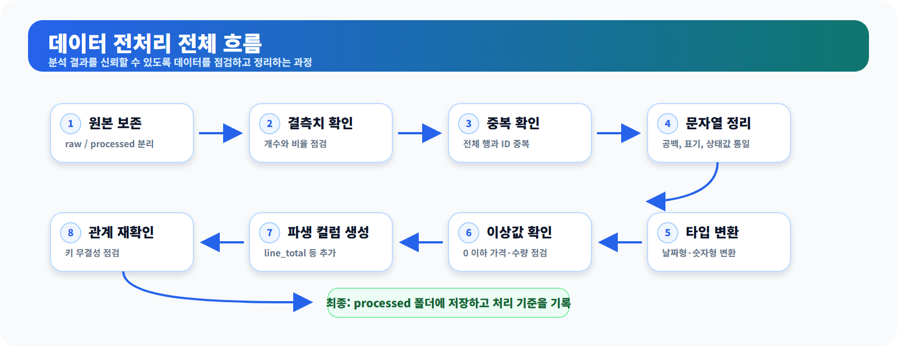
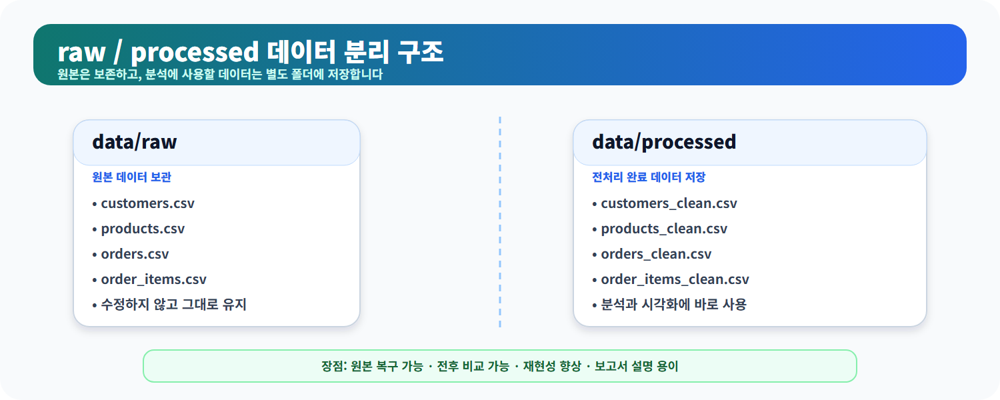
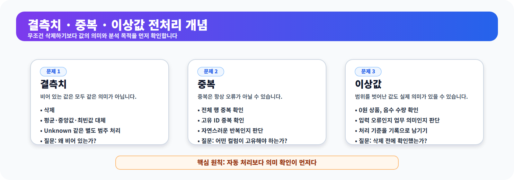
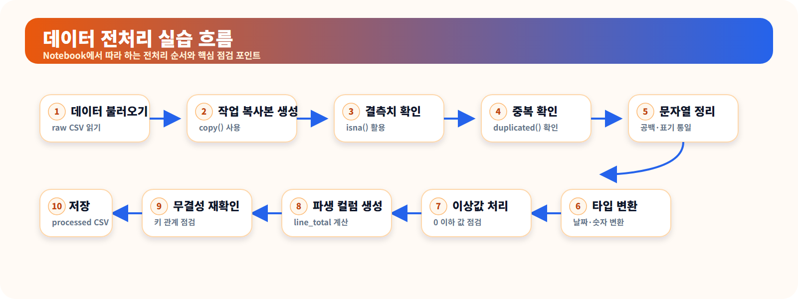
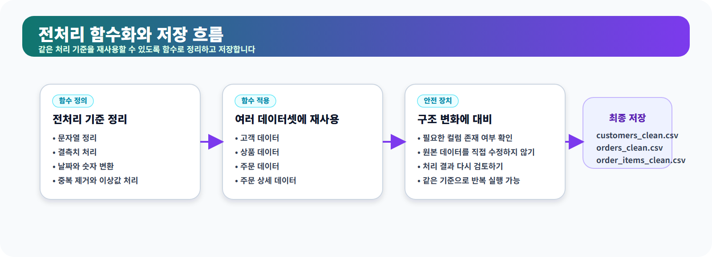

# 5장. 분석을 믿을 수 있게 만드는 데이터 전처리

데이터 분석은 데이터를 불러오는 순간 바로 시작되는 것처럼 보이지만, 실제 분석의 신뢰도는 그전에 결정되는 경우가 많습니다. 값이 비어 있거나, 같은 고객이 여러 번 기록되어 있거나, 날짜가 문자열로 저장되어 있거나, 숫자처럼 보이는 가격이 문자로 들어 있으면 분석 결과는 쉽게 왜곡됩니다.

데이터 전처리는 이러한 문제를 찾아내고 분석 목적에 맞게 정리하는 과정입니다. 단순히 데이터를 “깨끗하게” 만드는 작업이 아니라, **데이터의 상태를 확인하고 처리 기준과 영향을 기록하여 분석 결과를 검증할 수 있게 만드는 일**에 가깝습니다.

이 장에서는 온라인 쇼핑몰의 고객·상품·주문 데이터를 사용해 문자열과 빈 값, 데이터 타입, 결측치, 중복, 이상값, 파생 컬럼, 파일 간 연결 관계를 차례대로 점검합니다. 전처리 결과는 원본과 분리해 `data/processed` 폴더에 저장하고, 이후 탐색적 데이터 분석(EDA)과 시각화에서 사용할 수 있는 형태로 준비합니다.

<figure class="figure">
  
  <figcaption>그림 5-1. 데이터 전처리 전체 흐름도</figcaption>
</figure>

## 이 장에서 생각해 볼 질문

- 결측치는 모두 삭제하거나 대표값으로 채워도 되는가?
- 전체 행 중복과 고유 ID 중복은 어떻게 다른가?
- 공백 문자열이나 숫자 변환 실패는 언제 결측치가 되는가?
- 이상값은 어떤 기준으로 제외해야 하는가?
- 주문 상세 금액의 합계를 바로 매출이라고 불러도 되는가?
- 전처리 후에도 파일 간 연결 관계가 유지되는가?
- 전처리 기준과 제외된 데이터는 어떻게 기록해야 하는가?
- LLM이 제안한 전처리 코드를 어떤 기준으로 검증해야 하는가?

## 1. 왜 전처리가 필요한가

현실의 데이터는 처음부터 분석하기 좋은 형태로 주어지지 않습니다. 같은 도시명이 `Seoul`, ` seoul `, `SEOUL`처럼 다르게 기록될 수 있고, 날짜가 `2024-01-15`라는 문자열로 저장되어 있을 수도 있습니다. 숫자처럼 보이는 `"10,000"`도 실제로는 쉼표가 포함된 문자열일 수 있습니다.

이 상태에서 바로 집계하거나 그래프를 그리면 분석 결과가 달라질 수 있습니다. 고객의 평균 나이를 계산하려는데 결측치가 특정 연령대에 집중되어 있다면, 단순 평균 대체로 분포가 왜곡될 수 있습니다. 주문 수량이 음수인데 반품을 의미하는지 입력 오류인지 확인하지 않으면 금액 합계도 잘못 해석할 수 있습니다. 주문 상태가 `완료`, `complete`, `COMPLETED`처럼 섞여 있으면 같은 상태가 서로 다른 범주로 집계됩니다.

전처리에서 중요한 것은 문제를 무조건 삭제하거나 자동으로 고치는 것이 아닙니다. **왜 그런 값이 생겼는지, 분석 목적에 어떤 영향을 주는지, 어떤 기준으로 처리했는지를 설명할 수 있어야 합니다.**

| 문제 유형 | 예시 | 확인할 질문 |
| --- | --- | --- |
| 결측치 | 나이가 비어 있는 고객 | 누락 원인은 무엇이며 분석에서 제외해도 되는가? |
| 빈 문자열 | 도시 값이 공백만 포함 | 실제 결측치로 처리해야 하는가? |
| 중복 | 같은 고객 ID가 여러 번 등장 | 자연스러운 반복인가, 고유 키 오류인가? |
| 타입 오류 | 가격이 문자열로 저장됨 | 계산 가능한 숫자형으로 안전하게 변환할 수 있는가? |
| 날짜 오류 | 주문일이 문자열로 저장됨 | 변환 실패 없이 기간 분석에 사용할 수 있는가? |
| 문자열 표기 차이 | `Seoul`, ` Seoul`, `SEOUL` | 하나의 표기로 통일해야 하는가? |
| 이상값 | 수량이 음수이거나 가격이 0원 | 반품·행사·오류 중 무엇을 의미하는가? |
| 파생 컬럼 | 수량과 단가만 존재 | 계산식과 포함 범위를 명확히 정의할 수 있는가? |
| 연결 오류 | 존재하지 않는 상품 ID | 부모 데이터 누락인지 거래 데이터 오류인지 확인했는가? |

## 2. 원본 데이터와 전처리 데이터는 분리한다

전처리에서 가장 먼저 지켜야 할 원칙은 원본 파일을 직접 덮어쓰지 않는 것입니다. 원본 데이터는 `data/raw`에 보관하고, 전처리 결과는 `data/processed`에 따로 저장합니다.

```text
data/
├─ raw/
│  ├─ customers.csv
│  ├─ products.csv
│  ├─ orders.csv
│  └─ order_items.csv
└─ processed/
   ├─ customers_clean.csv
   ├─ products_clean.csv
   ├─ orders_clean.csv
   └─ order_items_clean.csv
```

원본과 전처리 데이터를 분리하면 다음과 같은 장점이 있습니다.

- 원본 데이터를 언제든 다시 확인할 수 있습니다.
- 전처리 기준을 바꾸어 전체 과정을 다시 실행할 수 있습니다.
- 전처리 전후의 행 수, 열 수, 결측치 변화를 비교할 수 있습니다.
- 다른 사람이 같은 과정을 재현하기 쉽습니다.
- 제외된 데이터와 처리 기준을 보고서에 명확히 남길 수 있습니다.

<figure class="figure">
  
  <figcaption>그림 5-2. raw 데이터와 processed 데이터 분리 구조</figcaption>
</figure>

DataFrame도 같은 원칙으로 다룹니다. 다음처럼 `.copy()`를 사용하면 원본 DataFrame과 독립된 전처리용 복사본을 만들 수 있습니다.

```python
customers_clean = customers.copy()
```

단순히 `customers_clean = customers`라고 대입하면 두 변수가 같은 객체를 가리킬 수 있으므로, 한쪽을 수정했을 때 원본 변수에도 영향이 생길 수 있습니다.

## 3. 전처리 순서도 결과에 영향을 준다

전처리는 여러 단계를 한꺼번에 실행하는 작업이 아닙니다. 어느 순서로 처리하는지에 따라 결측치 수와 중복 행 수가 달라질 수 있습니다.

예를 들어 공백만 들어 있는 문자열은 처음에는 결측치로 집계되지 않을 수 있습니다. 문자열 공백을 제거한 뒤 빈 문자열을 결측치로 바꾸면 결측치 수가 늘어납니다. 숫자 변환에 실패한 값도 `NaN`으로 바뀌므로, 타입 변환 이후에 결측치를 다시 확인해야 합니다.

이 장에서는 다음 순서로 진행합니다.

```text
원본 보존
→ 초기 구조 기록
→ 문자열 공백과 빈 값 정리
→ 날짜·숫자 타입 변환
→ 변환 실패와 결측치 확인
→ 결측치 처리
→ 전체 중복과 고유 ID 중복 확인
→ 범주형 값 표준화
→ 이상값 확인과 처리
→ 파생 컬럼 생성
→ 파일 간 연결 관계 재검증
→ 전후 비교·저장·보고
```

이 순서가 모든 프로젝트의 정답은 아닙니다. 다만 각 단계가 다음 단계에 어떤 영향을 주는지 기록하는 습관이 중요합니다.

<figure class="figure">
  
  <figcaption>그림 5-3. 결측치·중복·이상값 전처리 개념도</figcaption>
</figure>

## 4. 작업 공간을 준비하고 원본 데이터를 불러온다

전체 코드는 `notebooks/ch05_data_preprocessing.ipynb`에서 따라갈 수 있습니다. 먼저 필요한 패키지를 불러옵니다.

```python
from pathlib import Path
import pandas as pd
```

현재 작업 폴더가 프로젝트 루트이거나 `notebooks` 폴더인 경우를 모두 처리하도록 프로젝트 경로를 정합니다.

```python
project_root = Path.cwd()

if project_root.name == "notebooks":
    project_root = project_root.parent

raw_dir = project_root / "data" / "raw"
processed_dir = project_root / "data" / "processed"
report_dir = project_root / "reports"

processed_dir.mkdir(parents=True, exist_ok=True)
report_dir.mkdir(parents=True, exist_ok=True)

print("프로젝트 루트:", project_root.resolve())
print("원본 데이터 폴더:", raw_dir.resolve())
```

다른 위치에서 노트북을 실행했다면 `project_root`를 실제 프로젝트 폴더 경로로 직접 지정해야 합니다.

필요한 파일이 모두 있는지 먼저 확인합니다.

```python
required_files = [
    "customers.csv",
    "products.csv",
    "orders.csv",
    "order_items.csv",
]

missing_files = [
    file_name
    for file_name in required_files
    if not (raw_dir / file_name).exists()
]

if missing_files:
    raise FileNotFoundError(
        f"원본 데이터 파일을 찾을 수 없습니다: {missing_files}"
    )
```

파일이 없다면 프로젝트 루트에서 다음 명령을 실행해 기본 샘플 데이터를 생성합니다.

```bash
python scripts/generate_sample_data.py
```

원본 데이터를 불러옵니다.

```python
customers = pd.read_csv(raw_dir / "customers.csv")
products = pd.read_csv(raw_dir / "products.csv")
orders = pd.read_csv(raw_dir / "orders.csv")
order_items = pd.read_csv(raw_dir / "order_items.csv")
```

원본과 전처리용 DataFrame을 이름으로 관리하면 반복 작업을 줄일 수 있습니다.

```python
raw_data = {
    "customers": customers,
    "products": products,
    "orders": orders,
    "order_items": order_items,
}

clean_data = {
    name: df.copy()
    for name, df in raw_data.items()
}
```

전처리 전 데이터 크기를 기록합니다.

```python
raw_shapes = pd.DataFrame(
    [
        {
            "dataset": name,
            "rows": df.shape[0],
            "columns": df.shape[1],
        }
        for name, df in raw_data.items()
    ]
)

raw_shapes
```

기본 생성 스크립트를 사용했다면 `customers` 150행, `products` 100행, `orders` 300행, `order_items` 764행이 생성됩니다. 스크립트나 데이터가 바뀌었다면 실제 출력값을 기준으로 판단합니다.

<figure class="figure">
  
  <figcaption>그림 5-4. 데이터 전처리 실습 흐름도</figcaption>
</figure>

## 5. 전처리 전 상태를 먼저 기록한다

처리 전 상태를 남겨 두어야 어떤 문제가 원래부터 있었고, 전처리 과정에서 무엇이 바뀌었는지 설명할 수 있습니다.

```python
def quality_summary(df):
    return {
        "rows": len(df),
        "columns": df.shape[1],
        "missing_cells": int(df.isna().sum().sum()),
        "duplicated_rows": int(df.duplicated().sum()),
    }
```

```python
initial_quality = pd.DataFrame(
    [
        {"dataset": name, **quality_summary(df)}
        for name, df in clean_data.items()
    ]
)

initial_quality
```

기본 샘플 데이터에는 결측치와 전체 중복 행이 없도록 생성되어 있습니다. 따라서 결과가 모두 0으로 나오는 것이 정상입니다. 이후의 코드는 실제 데이터나 구조가 변경된 데이터에도 적용할 수 있는 안전한 전처리 패턴을 연습하기 위한 것입니다.

## 6. 문자열 공백과 빈 값을 정리한다

문자열 컬럼에는 앞뒤 공백이나 공백만 들어 있는 값이 존재할 수 있습니다. `"Seoul"`과 `" Seoul "`은 pandas에서 서로 다른 값으로 집계됩니다.

```python
def clean_string_columns(df):
    df = df.copy()
    string_columns = df.select_dtypes(
        include=["object", "string"]
    ).columns

    for column in string_columns:
        cleaned = df[column].astype("string").str.strip()
        df[column] = cleaned.mask(cleaned.eq(""), pd.NA)

    return df
```

`select_dtypes()`는 지정한 데이터 타입의 컬럼만 선택합니다. 여기서는 문자열로 처리할 수 있는 `object`와 `string` 타입을 선택합니다.

`mask(condition, value)`는 조건이 참인 위치를 지정한 값으로 바꿉니다. 위 코드에서는 공백 제거 후 빈 문자열이 된 값을 `pd.NA`로 바꿉니다. `astype(str)` 대신 pandas의 `"string"` 타입을 사용하면 기존 결측치를 문자열 `"nan"`으로 바꾸지 않고 유지할 수 있습니다.

모든 데이터셋에 적용합니다.

```python
clean_data = {
    name: clean_string_columns(df)
    for name, df in clean_data.items()
}

customers_clean = clean_data["customers"]
products_clean = clean_data["products"]
orders_clean = clean_data["orders"]
order_items_clean = clean_data["order_items"]
```

문자열을 정리한 뒤에는 결측치 수가 새로 늘어났는지 다시 확인합니다.

```python
for name, df in clean_data.items():
    print(f"\n[{name}]")
    print(df.isna().sum())
```

## 7. 날짜와 숫자형 컬럼을 안전하게 변환한다

타입 변환은 성공 여부를 함께 기록해야 합니다. `errors="coerce"`를 사용하면 변환할 수 없는 값이 결측치로 바뀌므로, 변환 전후의 결측치 차이를 확인합니다.

### 숫자형 변환

```python
def to_number_with_report(series, column_name):
    missing_before = series.isna()

    text = (
        series.astype("string")
        .str.replace(",", "", regex=False)
    )

    converted = pd.to_numeric(text, errors="coerce")
    new_failures = converted.isna() & ~missing_before

    print(
        f"{column_name} 숫자 변환 실패:",
        int(new_failures.sum()),
    )

    return converted
```

```python
customers_clean["age"] = to_number_with_report(
    customers_clean["age"],
    "customers.age",
)

products_clean["price"] = to_number_with_report(
    products_clean["price"],
    "products.price",
)

order_items_clean["quantity"] = to_number_with_report(
    order_items_clean["quantity"],
    "order_items.quantity",
)

order_items_clean["unit_price"] = to_number_with_report(
    order_items_clean["unit_price"],
    "order_items.unit_price",
)
```

현재 기본 샘플 데이터에서는 모두 숫자형이므로 변환 실패 건수는 0이어야 합니다. 실패 건수가 발생했다면 원본 값을 별도로 확인해야 하며, 실패값을 곧바로 삭제해서는 안 됩니다.

### 날짜형 변환

```python
def to_datetime_with_report(series, column_name):
    missing_before = series.isna()
    converted = pd.to_datetime(series, errors="coerce")
    new_failures = converted.isna() & ~missing_before

    print(
        f"{column_name} 날짜 변환 실패:",
        int(new_failures.sum()),
    )

    return converted
```

```python
customers_clean["signup_date"] = to_datetime_with_report(
    customers_clean["signup_date"],
    "customers.signup_date",
)

orders_clean["order_date"] = to_datetime_with_report(
    orders_clean["order_date"],
    "orders.order_date",
)
```

변환 후 날짜 범위를 확인합니다.

```python
print(
    "가입일 범위:",
    customers_clean["signup_date"].min(),
    "~",
    customers_clean["signup_date"].max(),
)

print(
    "주문일 범위:",
    orders_clean["order_date"].min(),
    "~",
    orders_clean["order_date"].max(),
)
```

날짜형 변환은 현재 메모리에 있는 DataFrame만 변경하며 원본 CSV 파일을 덮어쓰지 않습니다.

## 8. 결측치를 확인하고 처리한다

문자열 정리와 타입 변환이 끝난 뒤 결측치를 다시 요약합니다.

```python
def missing_summary(df):
    summary = pd.DataFrame({
        "missing_count": df.isna().sum(),
        "missing_ratio_pct": (
            df.isna().mean() * 100
        ).round(2),
    })

    return summary.sort_values(
        "missing_count",
        ascending=False,
    )
```

```python
missing_summary(customers_clean)
```

기본 샘플 데이터에는 결측치가 없으므로 실제 결과는 모두 0입니다. 다음 처리 코드는 실제 데이터에서 결측치가 발견된 경우를 대비한 예시입니다.

나이 결측치는 분석 목적에 따라 중앙값으로 대체할 수 있습니다.

```python
age_median = customers_clean["age"].median()

if pd.notna(age_median):
    customers_clean["age"] = (
        customers_clean["age"]
        .fillna(age_median)
    )
```

중앙값 대체는 전체 고객 수를 유지할 수 있지만, 실제 나이를 모르는 고객에게 대표값을 부여하는 방식입니다. 연령대별 분석이나 머신러닝에서 이 사실을 반드시 기록해야 합니다. 필요하면 대체 전에 결측 여부를 별도 컬럼으로 보존하는 방법도 검토할 수 있습니다.

도시 결측치는 `Unknown`이라는 별도 범주로 유지할 수 있습니다.

```python
customers_clean["city"] = (
    customers_clean["city"]
    .fillna("Unknown")
)
```

ID나 주문일처럼 분석 연결과 기간 정의에 필수적인 값은 대표값으로 임의 대체하지 않습니다. 원본 시스템 확인, 제외, 보류 중 어떤 방법을 사용할지 별도의 기준이 필요합니다.

## 9. 전체 중복과 고유 ID 중복을 구분한다

전체 행이 완전히 같은 중복을 먼저 확인합니다.

```python
for name, df in clean_data.items():
    print(
        name,
        "전체 중복 행:",
        int(df.duplicated().sum()),
    )
```

중복 행의 내용을 확인한 뒤 완전 중복만 제거합니다.

```python
customers_clean = (
    customers_clean
    .drop_duplicates()
    .reset_index(drop=True)
)

products_clean = (
    products_clean
    .drop_duplicates()
    .reset_index(drop=True)
)

orders_clean = (
    orders_clean
    .drop_duplicates()
    .reset_index(drop=True)
)

order_items_clean = (
    order_items_clean
    .drop_duplicates()
    .reset_index(drop=True)
)
```

전체 행 중복이 없더라도 고유해야 하는 ID가 중복될 수 있습니다.

```python
key_columns = {
    "customers": "customer_id",
    "products": "product_id",
    "orders": "order_id",
    "order_items": "order_item_id",
}
```

```python
clean_data = {
    "customers": customers_clean,
    "products": products_clean,
    "orders": orders_clean,
    "order_items": order_items_clean,
}

key_quality_rows = []

for name, key_column in key_columns.items():
    df = clean_data[name]

    key_quality_rows.append({
        "dataset": name,
        "key": key_column,
        "missing_key": int(
            df[key_column].isna().sum()
        ),
        "duplicated_key": int(
            df[key_column].duplicated().sum()
        ),
    })

key_quality = pd.DataFrame(key_quality_rows)
key_quality
```

`order_items`의 `order_id`는 여러 상품이 한 주문에 포함될 수 있으므로 반복이 자연스럽습니다. 반면 `order_item_id`는 주문 상세 행을 고유하게 식별해야 하므로 중복되면 오류로 판단할 수 있습니다.

고유 키의 결측치나 중복을 자동으로 한 행만 남겨 해결하면 안 됩니다. 서로 다른 값이 같은 ID에 연결되어 있을 수 있으므로 원본 시스템이나 업무 규칙을 확인해야 합니다. 저장 전에 문제가 남아 있으면 실행을 중단하도록 검사할 수 있습니다.

```python
if (
    key_quality["missing_key"].gt(0).any()
    or key_quality["duplicated_key"].gt(0).any()
):
    raise ValueError(
        "고유 키 결측치 또는 중복이 남아 있습니다."
    )
```

## 10. 범주형 값을 표준화한다

주문 상태값처럼 범주형 컬럼은 실제 분포를 먼저 확인합니다.

```python
orders_clean["order_status"].value_counts(
    dropna=False
)
```

대소문자와 일부 동의어를 통일합니다.

```python
status_text = (
    orders_clean["order_status"]
    .astype("string")
    .str.strip()
    .str.lower()
)

status_map = {
    "complete": "completed",
    "completed": "completed",
    "완료": "completed",
    "cancel": "cancelled",
    "canceled": "cancelled",
    "cancelled": "cancelled",
    "취소": "cancelled",
    "refund": "refunded",
    "refunded": "refunded",
    "환불": "refunded",
}

orders_clean["order_status"] = (
    status_text.replace(status_map)
)
```

처리 후 다시 분포를 확인합니다.

```python
orders_clean["order_status"].value_counts(
    dropna=False
)
```

허용할 상태값을 정했다면 예상하지 못한 값도 확인합니다.

```python
allowed_statuses = {
    "completed",
    "cancelled",
    "refunded",
}

unexpected_statuses = orders_clean.loc[
    orders_clean["order_status"].notna()
    & ~orders_clean["order_status"].isin(
        allowed_statuses
    ),
    "order_status",
].value_counts()

unexpected_statuses
```

예상하지 못한 상태값을 임의로 가장 비슷한 값에 매핑하지 않습니다. 의미를 확인한 뒤 매핑표를 보완해야 합니다.

## 11. 이상값은 처리 기준과 제외 건수를 남긴다

숫자형 컬럼의 기본 통계를 확인합니다.

```python
customers_clean[["age"]].describe()
products_clean[["price"]].describe()
order_items_clean[
    ["quantity", "unit_price"]
].describe()
```

ID는 숫자로 저장되어 있어도 평균이나 사분위수에 업무적 의미가 없는 식별자이므로 통계 해석 대상에서 제외합니다.

이번 실습에서는 다음 조건을 정상 판매 분석에서 확인이 필요한 값으로 가정합니다.

```python
invalid_age = (
    customers_clean["age"].lt(0)
    | customers_clean["age"].gt(120)
)

invalid_product_price = (
    products_clean["price"].isna()
    | products_clean["price"].le(0)
)

invalid_order_item = (
    order_items_clean["quantity"].isna()
    | order_items_clean["unit_price"].isna()
    | order_items_clean["quantity"].le(0)
    | order_items_clean["unit_price"].le(0)
)
```

```python
print("나이 이상값 후보:", int(invalid_age.sum()))
print(
    "가격 이상값 후보:",
    int(invalid_product_price.sum()),
)
print(
    "주문 상세 이상값 후보:",
    int(invalid_order_item.sum()),
)
```

기본 샘플 데이터에서는 모두 0이어야 합니다. 실제 데이터에서 값이 발견되면 다음을 먼저 확인합니다.

- 0원 상품이 행사나 증정 상품인가?
- 음수 수량이 반품을 의미하는가?
- 단가가 0인 행이 별도 할인 구조를 의미하는가?
- 나이 범위가 실제 업무 기준과 일치하는가?
- 입력 오류를 원본 시스템에서 수정할 수 있는가?

여기서는 **정상 판매 금액 분석**을 위한 실습 규칙으로 가격·수량·단가가 0 이하이거나 변환에 실패한 행을 분석용 데이터에서 제외한다고 가정합니다. 제외 전에 반드시 건수와 원본 행을 별도로 확인해야 합니다.

```python
products_excluded = products_clean.loc[
    invalid_product_price
].copy()

order_items_excluded = order_items_clean.loc[
    invalid_order_item
].copy()

products_clean = products_clean.loc[
    ~invalid_product_price
].copy()

order_items_clean = order_items_clean.loc[
    ~invalid_order_item
].copy()
```

나이 이상값은 실제 고객 확인 없이 대표값으로 덮어쓰지 않습니다. 분석 목적에 따라 제외하거나 별도 범주로 처리할 수 있습니다.

## 12. 파일 간 연결 관계를 다시 확인한다

CSV 파일은 데이터베이스처럼 기본 키와 외래 키 제약조건을 자동으로 검사하지 않습니다. 전처리 과정에서 상품이나 주문 상세 행을 제외하면 파일 간 관계가 깨질 수도 있습니다.

먼저 연결 대상에 존재하지 않는 ID를 확인합니다.

```python
invalid_customers = orders_clean.loc[
    ~orders_clean["customer_id"].isin(
        customers_clean["customer_id"]
    )
].copy()

invalid_orders = order_items_clean.loc[
    ~order_items_clean["order_id"].isin(
        orders_clean["order_id"]
    )
].copy()

invalid_products = order_items_clean.loc[
    ~order_items_clean["product_id"].isin(
        products_clean["product_id"]
    )
].copy()
```

```python
print(
    "customers에 없는 customer_id 행 수:",
    len(invalid_customers),
)

print(
    "orders에 없는 order_id 행 수:",
    len(invalid_orders),
)

print(
    "products에 없는 product_id 행 수:",
    len(invalid_products),
)
```

문제가 발견되면 바로 삭제하지 말고 다음을 확인합니다.

- 부모 데이터 파일이 누락되었는가?
- ID 타입이 숫자와 문자열로 서로 다른가?
- 앞뒤 공백이나 표기 차이가 있는가?
- 거래 데이터가 기준 데이터보다 먼저 들어온 시점 차이인가?
- 전처리 과정에서 부모 행만 제외했는가?

이번 실습에서는 정상 판매 분석용 데이터의 연결 관계를 유지하기 위해 부모 데이터에 존재하지 않는 주문 상세 행은 별도 확인 대상으로 보관한 뒤 분석용 복사본에서 제외한다고 가정합니다.

```python
orphan_order_item_mask = (
    ~order_items_clean["order_id"].isin(
        orders_clean["order_id"]
    )
    | ~order_items_clean["product_id"].isin(
        products_clean["product_id"]
    )
)

orphan_order_items = order_items_clean.loc[
    orphan_order_item_mask
].copy()

order_items_clean = order_items_clean.loc[
    ~orphan_order_item_mask
].copy()
```

고객 데이터에 없는 주문은 주문 자체의 의미를 확인해야 하므로 자동으로 제거하지 않습니다. `invalid_customers`가 남아 있다면 저장 전에 원인을 해결하거나 별도 예외 데이터로 분리합니다.

## 13. 파생 컬럼과 매출 기준을 명확히 한다

날짜형 컬럼에서 주문 월과 요일을 만들 수 있습니다.

```python
orders_clean["order_month"] = (
    orders_clean["order_date"]
    .dt.strftime("%Y-%m")
)

orders_clean["order_dayofweek"] = (
    orders_clean["order_date"]
    .dt.day_name()
)
```

`strftime("%Y-%m")`은 날짜가 없는 위치를 결측치로 유지합니다. 날짜형을 곧바로 `astype(str)`로 바꾸면 결측치가 문자열 `"NaT"`로 저장될 수 있으므로 주의합니다.

주문 상세 금액을 계산합니다.

```python
order_items_clean["line_total"] = (
    order_items_clean["quantity"]
    * order_items_clean["unit_price"]
)
```

`line_total`은 한 주문 상세 행의 수량과 단가를 곱한 **주문 상세 금액**입니다. 모든 `line_total`의 합계를 곧바로 매출이라고 부르면 안 됩니다. 취소·환불 주문이 포함될 수 있기 때문입니다.

주문 상태를 연결해 완료 주문 기준 금액을 계산합니다.

```python
sales_items = order_items_clean.merge(
    orders_clean[
        ["order_id", "order_status"]
    ],
    on="order_id",
    how="left",
    validate="many_to_one",
)
```

`validate="many_to_one"`은 여러 주문 상세 행이 하나의 주문 행에 연결되는 구조인지 검사합니다. `orders.order_id`가 중복되어 있으면 병합 단계에서 오류가 발생합니다.

```python
completed_sales = sales_items.loc[
    sales_items["order_status"].eq("completed"),
    "line_total",
].sum()

print("완료 주문 기준 금액:", completed_sales)
```

이 값도 회사의 회계상 순매출과 반드시 같지는 않습니다. 할인, 배송비, 세금, 부분 환불 등의 컬럼이 없다면 계산 가능한 범위만 명확히 설명해야 합니다.

## 14. 전처리 전후를 비교하고 저장한다

전처리 결과를 다시 이름별로 묶습니다.

```python
clean_data = {
    "customers": customers_clean,
    "products": products_clean,
    "orders": orders_clean,
    "order_items": order_items_clean,
}
```

전처리 후 데이터 크기를 계산합니다.

```python
processed_shapes = pd.DataFrame(
    [
        {
            "dataset": name,
            "rows": df.shape[0],
            "columns": df.shape[1],
        }
        for name, df in clean_data.items()
    ]
)

comparison = raw_shapes.merge(
    processed_shapes,
    on="dataset",
    suffixes=("_raw", "_processed"),
)

comparison["rows_removed"] = (
    comparison["rows_raw"]
    - comparison["rows_processed"]
)

comparison["columns_added"] = (
    comparison["columns_processed"]
    - comparison["columns_raw"]
)

comparison
```

행 수가 줄었다면 제외 기준과 제외 건수를 설명해야 합니다. 열 수가 늘었다면 어떤 파생 컬럼이 추가되었는지 기록합니다.

저장 전 마지막 검증을 수행합니다.

```python
if len(invalid_customers) > 0:
    raise ValueError(
        "고객 데이터에 없는 customer_id가 "
        "orders에 남아 있습니다."
    )

if (
    key_quality["missing_key"].gt(0).any()
    or key_quality["duplicated_key"].gt(0).any()
):
    raise ValueError(
        "고유 키 문제가 해결되지 않았습니다."
    )
```

전처리된 데이터를 저장합니다. `utf-8-sig`는 Windows에서 Excel로 CSV를 열 때 한글이 깨지는 문제를 줄일 수 있습니다.

```python
customers_clean.to_csv(
    processed_dir / "customers_clean.csv",
    index=False,
    encoding="utf-8-sig",
    date_format="%Y-%m-%d",
)

products_clean.to_csv(
    processed_dir / "products_clean.csv",
    index=False,
    encoding="utf-8-sig",
)

orders_clean.to_csv(
    processed_dir / "orders_clean.csv",
    index=False,
    encoding="utf-8-sig",
    date_format="%Y-%m-%d",
)

order_items_clean.to_csv(
    processed_dir / "order_items_clean.csv",
    index=False,
    encoding="utf-8-sig",
)
```

제외된 행이 있다면 검토용 파일로 따로 저장할 수 있습니다.

```python
rejected_dir = processed_dir / "rejected"
rejected_dir.mkdir(parents=True, exist_ok=True)

if not products_excluded.empty:
    products_excluded.to_csv(
        rejected_dir / "products_excluded.csv",
        index=False,
        encoding="utf-8-sig",
    )

if not order_items_excluded.empty:
    order_items_excluded.to_csv(
        rejected_dir / "order_items_excluded.csv",
        index=False,
        encoding="utf-8-sig",
    )

if not orphan_order_items.empty:
    orphan_order_items.to_csv(
        rejected_dir / "orphan_order_items.csv",
        index=False,
        encoding="utf-8-sig",
    )
```

## 15. 전처리 보고서를 남긴다

`comparison.to_markdown()`은 `tabulate` 패키지를 사용합니다. 이 프로젝트의 `requirements.txt`에는 `tabulate`가 포함되어 있습니다. 별도 환경에서 오류가 발생하면 `pip install tabulate`로 설치하거나 `to_string()`을 사용할 수 있습니다.

```python
try:
    comparison_text = comparison.to_markdown(
        index=False
    )
except ImportError:
    comparison_text = comparison.to_string(
        index=False
    )
```

전처리 기준과 결과를 Markdown 파일로 저장합니다.

```python
summary_text = f"""
# Chapter 5 데이터 전처리 요약

## 전처리 결과 파일

- customers_clean.csv
- products_clean.csv
- orders_clean.csv
- order_items_clean.csv

## 전처리 전후 데이터 크기

{comparison_text}

## 주요 처리 기준

- 문자열 앞뒤 공백 제거
- 공백만 있는 문자열을 결측치로 변환
- 날짜·숫자 변환 실패 건수 확인
- 나이 결측치는 중앙값 대체 가능성을 검토
- 도시 결측치는 Unknown 범주로 처리
- 전체 중복 행 제거
- 고유 ID 결측치·중복 검사
- 주문 상태값 표준화
- 0 이하 가격·수량·단가는 정상 판매 분석에서 제외
- 주문 상세 금액 line_total 생성
- 완료 주문만 별도로 집계
- 파일 간 연결 관계 재검증

## 제외 및 검토 대상

- 가격 이상값 후보: {len(products_excluded)}행
- 주문 상세 이상값 후보: {len(order_items_excluded)}행
- 연결 대상이 없는 주문 상세: {len(orphan_order_items)}행

## 완료 주문 기준 금액

- {completed_sales:,.0f}

## 주의사항

완료 주문 기준 금액은 할인, 배송비, 세금, 부분 환불을 반영한 회계상 순매출과 다를 수 있습니다.
"""

report_path = (
    report_dir
    / "ch05_preprocessing_summary.md"
)

report_path.write_text(
    summary_text,
    encoding="utf-8",
)
```

보고서에는 코드가 실행되었다는 사실보다 **어떤 기준으로 무엇을 바꾸었고, 어떤 데이터가 제외되었는지**를 남기는 것이 중요합니다.

## 16. 전처리 과정을 함수로 정리한다

반복해서 사용할 전처리 로직은 함수로 분리할 수 있습니다. 다음은 핵심 원칙만 담은 간단한 예시입니다.

```python
def preprocess_customers(df):
    result = clean_string_columns(df)

    result["age"] = pd.to_numeric(
        result["age"],
        errors="coerce",
    )

    median_age = result["age"].median()

    if pd.notna(median_age):
        result["age"] = (
            result["age"]
            .fillna(median_age)
        )

    result["city"] = (
        result["city"]
        .fillna("Unknown")
    )

    result["signup_date"] = pd.to_datetime(
        result["signup_date"],
        errors="coerce",
    )

    return (
        result
        .drop_duplicates()
        .reset_index(drop=True)
    )
```

```python
def preprocess_products(df):
    result = clean_string_columns(df)

    result["price"] = to_number_with_report(
        result["price"],
        "products.price",
    )

    result = result.loc[
        result["price"].gt(0)
    ]

    return (
        result
        .drop_duplicates()
        .reset_index(drop=True)
    )
```

```python
def preprocess_orders(df):
    result = clean_string_columns(df)

    result["order_date"] = (
        to_datetime_with_report(
            result["order_date"],
            "orders.order_date",
        )
    )

    status = (
        result["order_status"]
        .astype("string")
        .str.lower()
    )

    result["order_status"] = (
        status.replace(status_map)
    )

    result["order_month"] = (
        result["order_date"]
        .dt.strftime("%Y-%m")
    )

    result["order_dayofweek"] = (
        result["order_date"]
        .dt.day_name()
    )

    return (
        result
        .drop_duplicates()
        .reset_index(drop=True)
    )
```

```python
def preprocess_order_items(df):
    result = clean_string_columns(df)

    result["quantity"] = to_number_with_report(
        result["quantity"],
        "order_items.quantity",
    )

    result["unit_price"] = to_number_with_report(
        result["unit_price"],
        "order_items.unit_price",
    )

    valid_rows = (
        result["quantity"].gt(0)
        & result["unit_price"].gt(0)
    )

    result = result.loc[valid_rows].copy()

    required_columns = {
        "quantity",
        "unit_price",
    }

    if required_columns.issubset(
        result.columns
    ):
        result["line_total"] = (
            result["quantity"]
            * result["unit_price"]
        )

    return (
        result
        .drop_duplicates()
        .reset_index(drop=True)
    )
```

`issubset()`은 필요한 컬럼이 모두 존재하는지 확인합니다. 다음 표현과 같은 의미입니다.

```python
(
    "quantity" in result.columns
    and "unit_price" in result.columns
)
```

함수를 적용한 뒤에도 고유 키와 파일 간 연결 관계 검증은 별도로 수행해야 합니다. 함수가 오류 없이 실행됐다는 사실만으로 데이터 품질이 보장되지는 않습니다.

<figure class="figure">
  
  <figcaption>그림 5-5. 전처리 함수화와 저장 흐름도</figcaption>
</figure>

## 17. LLM과 함께 전처리 코드를 검토한다

LLM은 전처리 코드 초안 작성, 오류 설명, 누락된 검증 항목 확인에 도움을 줄 수 있습니다. 그러나 결측치 대체, 중복 제거, 이상값 제외는 분석 결과를 직접 바꾸므로 LLM이 제안한 코드를 그대로 적용해서는 안 됩니다.

실제 고객명, 이메일, 주소, 주문 내역, API 키, 내부 기밀정보는 승인되지 않은 외부 LLM 서비스에 입력하지 않습니다. 다음과 같은 구조 요약만 제공합니다.

```text
customers.csv 구조 요약

- 행 수: 150
- 컬럼: customer_id, name, gender, age, city, signup_date
- age 결측치: 0
- city 결측치: 0
- 전체 중복 행: 0
- customer_id 결측치: 0
- customer_id 중복: 0

분석 목적:
- 고객 연령대별 구매 패턴 분석
- 지역별 고객 분포 확인

실제 데이터 확인 없이 값을 만들어내지 말고,
필요한 전처리와 검증 항목을 구분해 설명해 주세요.
```

가상의 오류 상황을 검토하려면 실제 샘플 데이터 결과와 혼동되지 않도록 명시합니다.

```text
다음은 전처리 방법을 비교하기 위한 가상의 상황입니다.

- age 결측치: 3건
- city 결측치: 2건

1. 삭제, 중앙값 대체, Unknown 처리의 장단점을 비교해 주세요.
2. 분석 결과에 미칠 영향을 설명해 주세요.
3. 실제 값을 임의로 추정하지 마세요.
```

LLM이 만든 전처리 코드는 다음 기준으로 검토합니다.

| 검토 기준 | 확인할 질문 |
| --- | --- |
| 원본 보존 | 원본 파일과 DataFrame을 직접 덮어쓰지 않는가? |
| 처리 순서 | 문자열 정리와 타입 변환 이후 결측치를 다시 확인하는가? |
| 변환 실패 | 숫자·날짜 변환 실패 건수를 확인하는가? |
| 결측치 처리 | 컬럼의 의미와 분석 목적에 맞는가? |
| 중복 처리 | 전체 중복과 고유 ID 중복을 구분하는가? |
| 이상값 처리 | 삭제 전에 업무적 의미와 제외 건수를 확인하는가? |
| 파일 관계 | 부모 키 고유성과 외래 키 연결을 다시 검사하는가? |
| 파생 컬럼 | 계산식과 포함 범위를 명확히 정의하는가? |
| 매출 기준 | 취소·환불 주문을 구분하는가? |
| 보안 | 개인정보·API 키·기밀정보를 입력하지 않았는가? |
| 기록 | 변경 기준과 제외 데이터를 재현 가능하게 남기는가? |

## 18. 전처리 결과를 어떻게 해석할 것인가

전처리 후에는 “코드가 실행되었다”에서 멈추면 안 됩니다. 어떤 문제가 발견되었고, 어떤 기준으로 처리했으며, 데이터가 어떻게 바뀌었는지를 설명할 수 있어야 합니다.

좋은 기록은 다음과 같습니다.

```text
문자열 앞뒤 공백을 제거하고 공백만 있는 값을 결측치로 변환했습니다.
숫자·날짜 변환 실패 건수를 확인했으며 새로 발생한 결측치는 없었습니다.
전체 중복 행은 제거했지만 고유 ID 중복은 자동으로 해결하지 않았습니다.
가격·수량·단가가 0 이하인 행은 정상 판매 분석에서 제외하고 별도 파일로 저장했습니다.
주문 상태가 completed인 주문만 완료 주문 기준 금액 계산에 포함했습니다.
```

다음과 같은 기록은 정보가 부족합니다.

```text
데이터를 깨끗하게 정리했습니다.
이상값을 제거했습니다.
매출을 계산했습니다.
```

처리 기준, 제외 건수, 포함 범위가 없으면 다른 사람이 같은 결과를 재현하거나 검증하기 어렵습니다.

## 19. 다음 장으로 이어지는 흐름

전처리는 분석 가능한 데이터를 만드는 과정이고, EDA는 그 데이터에 질문을 던지는 과정입니다. 결측치, 중복, 타입, 이상값, 주문 상태와 파일 관계를 정리해 두면 고객 행동, 주문 패턴, 상품별 금액, 완료 주문 비중 같은 질문을 더 안정적으로 탐색할 수 있습니다.

다음 장에서는 전처리된 데이터를 바탕으로 분석 질문을 만들고, 집계 결과가 무엇을 의미하는지 살펴봅니다.