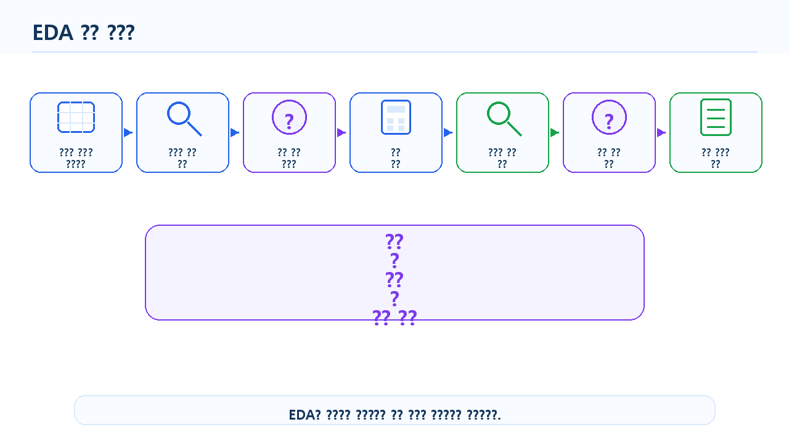
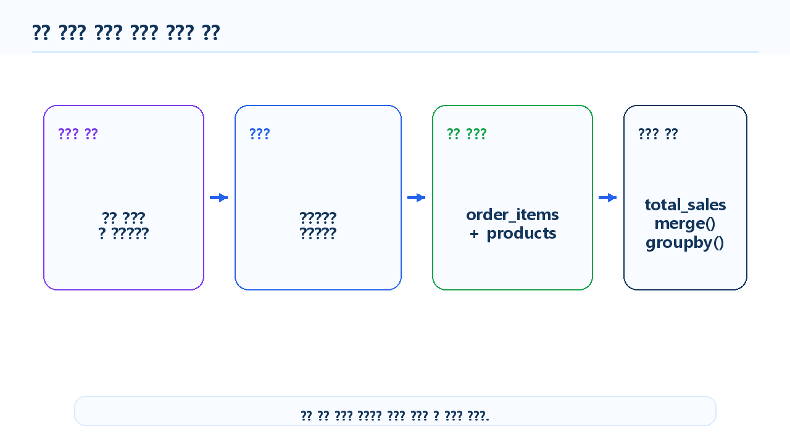
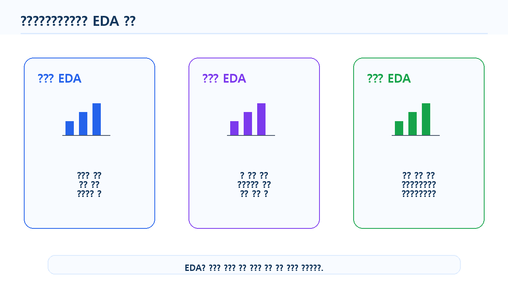
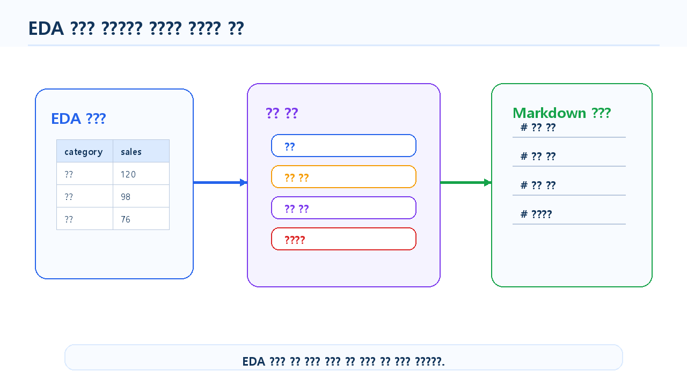

# 6장. 데이터를 보며 질문을 만드는 EDA

전처리를 마친 데이터는 이제 분석할 준비가 된 데이터입니다. 하지만 준비된 데이터를 바로 그래프로 만들거나 모델에 넣는다고 해서 좋은 분석이 되는 것은 아닙니다. 데이터 분석에서 중요한 첫 단계는 “무엇을 볼 것인가”를 정하는 일입니다.

EDA는 Exploratory Data Analysis, 즉 탐색적 데이터 분석을 의미합니다. 이름 그대로 데이터를 여러 방향에서 탐색하면서 분포, 패턴, 차이, 관계, 이상한 값을 발견하는 과정입니다. EDA의 목적은 단순히 표와 그래프를 많이 만드는 것이 아니라, **데이터를 보며 더 나은 분석 질문을 찾아가는 것**입니다.

데이터 분석 초보자가 자주 하는 실수는 데이터를 불러오자마자 그래프를 그리거나, LLM에게 바로 “인사이트를 찾아줘”라고 요청하는 것입니다. 하지만 좋은 분석 결과는 좋은 질문에서 시작됩니다. 질문이 모호하면 지표도 모호해지고, 지표가 모호하면 해석도 흔들립니다.

이 장에서는 온라인 쇼핑몰 데이터를 바탕으로 EDA 질문을 만들고, 그 질문을 pandas 코드와 지표로 연결하는 방법을 살펴봅니다. 고객, 상품, 주문, 매출을 각각 다른 관점에서 탐색하면서 “현재 데이터로 답할 수 있는 질문”과 “추가 데이터가 필요한 질문”을 구분해 봅니다.

<figure class="figure">
  
  <figcaption>그림 6-1. EDA 전체 흐름도</figcaption>
</figure>

## 1. EDA는 결론보다 질문에 가깝다

EDA는 최종 결론을 내리는 단계가 아닙니다. 오히려 결론을 내리기 전에 데이터를 이해하고, 분석 방향을 잡고, 더 확인해야 할 질문을 만드는 단계입니다.

예를 들어 월별 매출이 증가하는 그래프를 보았다고 해서 바로 “마케팅이 성공했다”라고 말할 수는 없습니다. 매출 증가가 실제로 마케팅 때문인지, 계절성 때문인지, 특정 고가 상품 판매 때문인지, 신규 고객 유입 때문인지는 추가 분석이 필요합니다. EDA에서는 이런 원인을 단정하기보다 “무엇을 더 확인해야 하는가”를 정리하는 것이 중요합니다.

EDA에서 자주 던지는 질문은 다음과 같습니다.

- 데이터는 어떤 변수들로 구성되어 있는가?
- 주요 숫자형 변수의 분포는 어떤가?
- 주요 범주형 변수의 빈도는 어떤가?
- 특정 그룹 간 차이가 있는가?
- 시간에 따른 변화가 있는가?
- 이상하게 큰 값이나 작은 값이 있는가?
- 다음 단계에서 더 깊이 볼 질문은 무엇인가?

EDA 결과를 해석할 때는 “관찰”, “가설”, “결론”을 구분해야 합니다.

| 구분 | 의미 | 예시 |
| --- | --- | --- |
| 관찰 | 데이터에서 직접 확인한 사실 | 전자기기 카테고리의 매출 비중이 가장 높다 |
| 가설 | 관찰을 바탕으로 생각해 볼 가능성 | 전자기기는 단가가 높아 매출 비중이 클 수 있다 |
| 결론 | 추가 검증 후 말할 수 있는 판단 | 단가와 판매 수량을 함께 분석한 결과 매출 차이의 주요 요인은 단가였다 |

EDA에서는 관찰과 가설까지는 만들 수 있지만, 결론은 추가 검증을 거쳐 조심스럽게 내려야 합니다.

## 2. 좋은 분석 질문은 데이터로 답할 수 있다

분석 질문은 데이터를 사용해 답할 수 있는 구체적인 질문이어야 합니다. “매출을 늘리려면 어떻게 해야 하는가?”는 중요한 질문이지만, 너무 넓습니다. 현재 가진 데이터만으로 바로 답하기 어렵습니다. 반면 “월별 매출 합계는 어떻게 변하는가?”는 pandas로 계산할 수 있는 구체적인 질문입니다.

좋은 분석 질문은 다음 조건을 가집니다.

| 조건 | 설명 | 예시 |
| --- | --- | --- |
| 데이터 기반 | 현재 데이터로 답할 수 있어야 함 | 월별 매출은 어떻게 변하는가? |
| 구체적 | 분석 대상과 기준이 명확해야 함 | 카테고리별 매출 비중은 어떻게 다른가? |
| 측정 가능 | 지표로 계산할 수 있어야 함 | 주문 수, 총매출, 평균 구매 금액 |
| 해석 가능 | 결과가 다음 판단과 연결되어야 함 | 어떤 상품군을 더 자세히 봐야 하는가? |
| 검증 가능 | 코드로 확인할 수 있어야 함 | `groupby()`로 계산 가능 |

반대로 다음 질문은 아직 EDA 질문으로는 부족합니다.

| 질문 | 부족한 이유 | 바꿔 볼 수 있는 질문 |
| --- | --- | --- |
| 고객이 왜 이탈했는가? | 이탈 여부 데이터가 없을 수 있음 | 최근 주문이 없는 고객은 얼마나 되는가? |
| 어떤 상품이 인기가 많은가? | 인기의 기준이 모호함 | 상품별 판매 수량 또는 매출은 어떻게 다른가? |
| 매출을 늘리려면 어떻게 해야 하는가? | 너무 포괄적임 | 매출 비중이 높은 카테고리는 무엇인가? |
| 고객 만족도는 어떤가? | 만족도 데이터가 없을 수 있음 | 재구매 횟수나 주문 빈도를 대신 볼 수 있는가? |

분석 질문은 지표로 바뀌어야 합니다. 그래야 pandas 코드로 계산하고, 표나 그래프로 확인할 수 있습니다.

| 원래 질문 | 구체화된 질문 | 지표 |
| --- | --- | --- |
| 어떤 카테고리가 잘 팔리는가? | 카테고리별 총매출은 얼마인가? | `category_sales` |
| 고객이 많이 사는가? | 고객별 주문 횟수는 몇 회인가? | `order_count` |
| 매출이 늘고 있는가? | 월별 매출 합계는 어떻게 변하는가? | `monthly_sales` |
| 고가 상품이 팔리는가? | 상품별 평균 단가와 판매 수량은 어떤 관계인가? | `price`, `total_quantity` |

<figure class="figure">
  
  <figcaption>그림 6-2. 분석 질문을 지표와 코드로 바꾸는 흐름</figcaption>
</figure>

## 3. EDA의 기본 관점

EDA는 한 번에 모든 것을 보려고 하면 복잡해집니다. 처음에는 하나의 변수부터 보고, 이후 두 변수의 관계, 세 개 이상의 변수를 함께 보는 방식으로 넓혀 가는 것이 좋습니다.

### 하나의 변수 보기

단변량 EDA는 하나의 변수만 살펴보는 탐색입니다. 데이터의 기본 모양을 파악하는 데 사용합니다.

- 고객 나이 분포는 어떤가?
- 고객은 어느 도시에 많이 분포하는가?
- 상품 카테고리는 몇 종류인가?
- 주문 상태별 주문 수는 어떻게 되는가?
- 상품 가격의 평균과 최댓값은 얼마인가?

### 두 변수의 관계 보기

이변량 EDA는 두 변수 사이의 관계를 살펴보는 탐색입니다. 그룹 간 차이나 변수 간 관계를 확인할 때 유용합니다.

- 상품 카테고리별 매출은 어떻게 다른가?
- 결제수단별 주문 수는 어떻게 다른가?
- 월별 매출은 어떻게 변하는가?
- 고객 지역별 주문 금액은 어떻게 다른가?
- 상품 가격과 판매 수량은 어떤 관계가 있는가?

### 세 개 이상의 변수 함께 보기

다변량 EDA는 세 개 이상의 변수를 함께 살펴보는 탐색입니다. 더 깊은 질문을 만들 수 있지만, 초보 단계에서는 해석이 복잡해질 수 있습니다. 먼저 기본 지표를 확인한 뒤 확장하는 것이 좋습니다.

- 월별·카테고리별 매출은 어떻게 다른가?
- 지역별·연령대별 고객 구매 금액은 어떻게 다른가?
- 주문 상태와 결제수단에 따라 매출 차이가 있는가?
- 고객별 주문 횟수와 총 구매 금액은 어떤 관계가 있는가?

<figure class="figure">
  
  <figcaption>그림 6-3. 단변량·이변량·다변량 EDA 비교</figcaption>
</figure>

## 4. 전처리된 데이터를 다시 불러온다

EDA는 Chapter 5에서 저장한 전처리 데이터를 사용합니다. 전체 코드는 `notebooks/ch06_eda_questions.ipynb`에서 이어서 실행할 수 있습니다. 여기서는 핵심 흐름만 살펴봅니다.

먼저 필요한 패키지를 불러옵니다.

```python
from pathlib import Path
import pandas as pd
```

VS Code에서 Notebook을 실행할 때는 현재 작업 폴더가 프로젝트 루트인지, `notebooks` 폴더인지에 따라 상대 경로가 달라질 수 있습니다. 다음 코드는 현재 위치를 기준으로 `base_dir`를 정해 줍니다.

```python
current_dir = Path.cwd()

if current_dir.name == "notebooks":
    base_dir = current_dir.parent
else:
    base_dir = current_dir

processed_dir = base_dir / "data" / "processed"
report_dir = base_dir / "reports"
report_dir.mkdir(exist_ok=True)

print("processed_dir:", processed_dir)
print("report_dir:", report_dir)
```

`to_markdown()`을 사용할 때 환경에 따라 `tabulate` 패키지가 필요할 수 있습니다. 오류가 발생하면 터미널이나 Notebook에서 다음 명령을 실행합니다.

```text
pip install tabulate
```

전처리된 데이터를 불러옵니다.

```python
customers = pd.read_csv(processed_dir / "customers_clean.csv")
products = pd.read_csv(processed_dir / "products_clean.csv")
orders = pd.read_csv(processed_dir / "orders_clean.csv")
order_items = pd.read_csv(processed_dir / "order_items_clean.csv")
```

데이터 크기를 확인합니다.

```python
print("customers:", customers.shape)
print("products:", products.shape)
print("orders:", orders.shape)
print("order_items:", order_items.shape)
```

CSV로 저장했다가 다시 불러오면 날짜 컬럼이 문자열로 돌아올 수 있습니다. 따라서 EDA 전에 날짜형으로 다시 변환합니다.

```python
orders["order_date"] = pd.to_datetime(orders["order_date"], errors="coerce")

if "signup_date" in customers.columns:
    customers["signup_date"] = pd.to_datetime(customers["signup_date"], errors="coerce")
```

`order_month`가 없다면 다시 생성합니다.

```python
if "order_month" not in orders.columns:
    orders["order_month"] = orders["order_date"].dt.to_period("M").astype(str)
```

## 5. 질문을 먼저 표로 정리한다

EDA를 시작하기 전에 어떤 질문을 볼지 먼저 표로 정리해 두면 분석이 산만해지지 않습니다. 아래 표는 고객, 상품, 주문, 매출, 시간, 고객 가치 관점에서 만들 수 있는 기본 질문입니다.

```python
questions = pd.DataFrame({
    "analysis_area": ["고객", "상품", "주문", "매출", "시간", "고객 가치"],
    "question": [
        "고객은 어떤 지역과 연령대에 분포하는가?",
        "어떤 카테고리의 상품이 많은가?",
        "주문 상태와 결제수단 분포는 어떤가?",
        "카테고리별 매출은 어떻게 다른가?",
        "월별 매출과 주문 수는 어떻게 변하는가?",
        "구매 금액이 높은 고객은 누구인가?"
    ],
    "metric": [
        "고객 수, 평균 나이",
        "카테고리별 상품 수",
        "주문 수, 비율",
        "총매출, 매출 비중",
        "월별 매출, 월별 주문 수",
        "고객별 총매출, 주문 횟수"
    ],
    "required_data": [
        "customers",
        "products",
        "orders",
        "order_items, products",
        "orders, order_items",
        "customers, orders, order_items"
    ]
})

questions
```

이 표는 분석 결과표가 아니라 EDA의 방향을 잡는 지도에 가깝습니다. 질문을 먼저 정리해 두면 어떤 데이터를 병합해야 하는지, 어떤 지표를 계산해야 하는지 더 분명해집니다.

## 6. 고객, 상품, 주문을 각각 살펴본다

먼저 각 데이터셋을 따로 살펴봅니다. 하나의 데이터셋 안에서 분포와 빈도를 확인하면 이후 병합 분석을 할 때 기준이 생깁니다.

고객 나이의 기본 통계를 확인합니다.

```python
customers["age"].describe()
```

도시별 고객 수를 확인합니다.

```python
customer_city = customers["city"].value_counts().reset_index()
customer_city.columns = ["city", "customer_count"]
customer_city
```

성별 고객 수를 확인합니다.

```python
customer_gender = customers["gender"].value_counts().reset_index()
customer_gender.columns = ["gender", "customer_count"]
customer_gender
```

고객 데이터에서 이어질 수 있는 질문은 다음과 같습니다.

```text
- 고객은 어느 도시에 많이 분포하는가?
- 고객의 평균 나이는 어느 정도인가?
- 성별 고객 수는 어떻게 분포하는가?
- 도시별 구매 금액도 차이가 있는가?
```

상품 데이터에서는 카테고리와 가격을 먼저 봅니다.

```python
product_category = products["category"].value_counts().reset_index()
product_category.columns = ["category", "product_count"]
product_category
```

```python
products["price"].describe()
```

카테고리별 평균 가격도 확인할 수 있습니다.

```python
category_price = (
    products
    .groupby("category", as_index=False)
    .agg(
        product_count=("product_id", "count"),
        avg_price=("price", "mean"),
        min_price=("price", "min"),
        max_price=("price", "max")
    )
    .sort_values("avg_price", ascending=False)
)

category_price
```

주문 데이터에서는 주문 상태, 결제수단, 주문 기간을 확인합니다.

```python
order_status = orders["order_status"].value_counts().reset_index()
order_status.columns = ["order_status", "order_count"]
order_status
```

```python
payment_method = orders["payment_method"].value_counts().reset_index()
payment_method.columns = ["payment_method", "order_count"]
payment_method
```

```python
print("주문 시작일:", orders["order_date"].min())
print("주문 종료일:", orders["order_date"].max())
```

## 7. 매출을 계산할 수 있는 형태로 연결한다

고객, 상품, 주문을 각각 확인했다면 이제 매출 분석을 위해 데이터를 연결합니다. 먼저 주문 상세 데이터에 `line_total`이 있는지 확인합니다.

```python
"line_total" in order_items.columns
```

없다면 수량과 단가를 곱해 다시 생성합니다.

```python
if "line_total" not in order_items.columns:
    order_items["line_total"] = order_items["quantity"] * order_items["unit_price"]
```

주문 상세 금액의 기본 통계를 확인합니다.

```python
order_items["line_total"].describe()
```

전체 매출 합계도 확인합니다.

```python
total_sales = order_items["line_total"].sum()
total_sales
```

카테고리별 매출을 계산하려면 주문 상세와 상품 정보를 병합해야 합니다.

```python
sales_items = order_items.merge(
    products,
    on="product_id",
    how="left"
)
```

병합 후에는 행 수와 누락 여부를 반드시 확인합니다. 병합은 EDA에서 자주 사용하지만, 잘못하면 데이터가 늘어나거나 줄어들 수 있습니다.

```python
print("병합 전 order_items:", order_items.shape)
print("병합 후 sales_items:", sales_items.shape)
print("상품명 누락:", sales_items["product_name"].isna().sum())
print("카테고리 누락:", sales_items["category"].isna().sum())
```

카테고리별 매출을 계산합니다.

```python
category_sales = (
    sales_items
    .groupby("category", as_index=False)
    .agg(
        total_quantity=("quantity", "sum"),
        total_sales=("line_total", "sum")
    )
    .sort_values("total_sales", ascending=False)
)

category_sales
```

매출 비중도 함께 계산합니다.

```python
category_sales["sales_ratio"] = (
    category_sales["total_sales"] / category_sales["total_sales"].sum() * 100
).round(2)

category_sales
```

카테고리별 매출은 어떤 상품군이 매출에 기여하는지 보여 줍니다. 다만 매출이 높은 이유가 판매 수량 때문인지, 단가 때문인지는 추가로 확인해야 합니다.

## 8. 시간 흐름과 고객 가치를 살펴본다

월별 매출을 보려면 주문 상세와 주문 정보를 연결합니다.

```python
order_sales = order_items.merge(
    orders,
    on="order_id",
    how="left"
)
```

날짜를 다시 확인하고 월 정보를 생성합니다.

```python
order_sales["order_date"] = pd.to_datetime(order_sales["order_date"], errors="coerce")
order_sales["order_month"] = order_sales["order_date"].dt.to_period("M").astype(str)
```

월별 매출과 주문 수를 계산합니다.

```python
monthly_sales = (
    order_sales
    .groupby("order_month", as_index=False)
    .agg(
        total_sales=("line_total", "sum"),
        order_count=("order_id", "nunique")
    )
    .sort_values("order_month")
)

monthly_sales
```

평균 주문 금액도 계산할 수 있습니다.

```python
monthly_sales["avg_order_value"] = (
    monthly_sales["total_sales"] / monthly_sales["order_count"]
).round(0)

monthly_sales
```

월별 매출은 시간에 따른 흐름을 보여 주지만, 원인을 바로 설명하지는 않습니다. 특정 월에 매출이 늘었다면 주문 수가 늘었는지, 평균 주문 금액이 늘었는지, 특정 카테고리 매출이 늘었는지를 이어서 확인해야 합니다.

고객별 구매 금액을 보려면 고객 정보를 결합합니다.

```python
customer_sales_base = order_sales.merge(
    customers,
    on="customer_id",
    how="left"
)
```

고객별 구매 금액과 주문 횟수를 계산합니다.

```python
customer_sales = (
    customer_sales_base
    .groupby(["customer_id", "name", "city"], as_index=False)
    .agg(
        order_count=("order_id", "nunique"),
        total_sales=("line_total", "sum")
    )
    .sort_values("total_sales", ascending=False)
)

customer_sales.head(10)
```

평균 주문 금액을 추가합니다.

```python
customer_sales["avg_order_value"] = (
    customer_sales["total_sales"] / customer_sales["order_count"]
).round(0)

customer_sales.head(10)
```

고객별 총 구매 금액은 우수 고객 분석의 출발점입니다. 하지만 한 번의 고액 구매 고객과 여러 번 반복 구매한 고객은 다르게 해석해야 합니다. 그래서 `total_sales`와 `order_count`, `avg_order_value`를 함께 봅니다.

## 9. EDA 결과를 다시 질문으로 연결한다

EDA의 가치는 표를 만드는 데서 끝나지 않습니다. 각 결과가 다음 질문으로 이어져야 합니다.

```python
eda_result_summary = pd.DataFrame({
    "question": [
        "고객은 어느 도시에 많이 분포하는가?",
        "어떤 카테고리의 상품이 많은가?",
        "카테고리별 매출은 어떻게 다른가?",
        "월별 매출과 주문 수는 어떻게 변하는가?",
        "구매 금액이 높은 고객은 누구인가?"
    ],
    "result_table": [
        "customer_city",
        "product_category",
        "category_sales",
        "monthly_sales",
        "customer_sales"
    ],
    "next_question": [
        "도시별 구매 금액도 차이가 있는가?",
        "상품 수가 많은 카테고리가 매출도 높은가?",
        "매출 차이가 수량 때문인가 단가 때문인가?",
        "특정 월의 매출 변화는 어떤 카테고리 때문인가?",
        "고액 구매 고객은 반복 구매 고객인가?"
    ]
})

eda_result_summary
```

EDA 결과는 필요한 경우 CSV로 저장해 보고서 작성이나 다음 장의 시각화에서 사용할 수 있습니다.

```python
category_sales.to_csv(report_dir / "ch06_category_sales.csv", index=False)
monthly_sales.to_csv(report_dir / "ch06_monthly_sales.csv", index=False)
customer_sales.to_csv(report_dir / "ch06_customer_sales.csv", index=False)
eda_result_summary.to_csv(report_dir / "ch06_eda_questions.csv", index=False)
```

저장 결과를 확인합니다.

```python
list(report_dir.glob("ch06_*.csv"))
```

간단한 Markdown 요약 보고서를 만들 수도 있습니다.

```python
summary_text = f"""
# Chapter 6 EDA 요약 보고서

## 1. 분석 목적

전처리된 온라인 쇼핑몰 데이터를 사용해 고객, 상품, 주문, 매출 관점의 기본 현황을 탐색했습니다.

## 2. 주요 분석 질문

{questions.to_markdown(index=False)}

## 3. 카테고리별 매출 요약

{category_sales.head(10).to_markdown(index=False)}

## 4. 월별 매출 요약

{monthly_sales.to_markdown(index=False)}

## 5. 고객별 구매 금액 상위 10명

{customer_sales.head(10).to_markdown(index=False)}

## 6. 추가 분석 질문

{eda_result_summary.to_markdown(index=False)}

## 7. 해석 시 주의사항

- EDA 결과는 최종 결론이 아니라 추가 분석을 위한 관찰 결과입니다.
- 매출이 높은 카테고리가 반드시 선호도가 높은 카테고리라는 뜻은 아닙니다.
- 월별 매출 변화의 원인을 설명하려면 프로모션, 계절성, 신규 상품 등의 추가 정보가 필요합니다.
- 고객별 구매 금액은 주문 횟수와 함께 해석해야 합니다.
"""

report_path = report_dir / "ch06_eda_summary.md"
report_path.write_text(summary_text, encoding="utf-8")
```

<figure class="figure">
  
  <figcaption>그림 6-5. EDA 결과를 인사이트와 보고서로 연결하는 흐름</figcaption>
</figure>

## 10. LLM과 함께 질문을 확장한다

LLM은 EDA 질문을 확장하고, 결과 해석 문장을 다듬는 데 도움이 됩니다. 하지만 LLM이 제안한 질문이 실제 데이터로 답할 수 있는지는 반드시 사람이 확인해야 합니다. 데이터에 없는 이탈 여부, 만족도, 프로모션 정보까지 LLM이 추측해서 말하게 두면 분석이 쉽게 왜곡됩니다.

LLM에게는 원본 고객명, 이메일, 주문 상세 전체 데이터를 넣지 않습니다. 컬럼명, 데이터 타입, 집계 결과, 요약표처럼 구조화된 정보 중심으로 질문합니다.

EDA 질문을 만들 때는 다음처럼 요청할 수 있습니다.

```text
온라인 쇼핑몰 데이터로 EDA를 수행하려고 합니다.

데이터셋:
- customers: 고객 정보
- products: 상품 정보
- orders: 주문 정보
- order_items: 주문 상세 정보

주요 컬럼:
- customers: customer_id, gender, age, city, signup_date
- products: product_id, product_name, category, price
- orders: order_id, customer_id, order_date, payment_method, order_status
- order_items: order_id, product_id, quantity, unit_price, line_total

요청:
1. 현재 데이터로 검증 가능한 EDA 질문 10개를 만들어 주세요.
2. 각 질문에 필요한 데이터셋과 pandas 기능을 함께 정리해 주세요.
3. 데이터에 없는 내용은 추측하지 마세요.
4. 각 질문을 계산 가능한 지표로 바꿔 주세요.
```

EDA 결과 해석을 요청할 때는 원인 단정을 막는 조건을 넣는 것이 좋습니다.

```text
다음은 온라인 쇼핑몰 카테고리별 매출 요약 결과입니다.

category,total_quantity,total_sales,sales_ratio
전자기기,320,12500000,42.5
생활용품,510,7800000,26.5
패션,260,6200000,21.1
식품,430,2900000,9.9

이 결과를 보고서에 넣을 수 있도록 해석해 주세요.

조건:
- 데이터에 없는 원인을 단정하지 말 것
- 원인 설명은 가설로 표현할 것
- 추가로 확인해야 할 분석 질문을 제안할 것
- 관찰, 가설, 추가 분석을 구분할 것
```

LLM이 만든 질문을 검토할 때는 다음처럼 현재 데이터로 답할 수 있는지 확인합니다.

```text
LLM이 다음 분석 질문을 제안했습니다.

1. 고객이 왜 이탈했는가?
2. 고객 만족도는 어떤가?
3. 어떤 상품이 가장 인기가 많은가?
4. 매출이 높은 카테고리는 무엇인가?
5. 월별 매출은 어떻게 변하는가?

현재 데이터에는 고객 이탈 여부와 만족도 데이터가 없습니다.

각 질문이 현재 데이터로 분석 가능한지 검토해 주세요.
분석하기 어려운 질문은 현재 데이터로 답할 수 있는 질문으로 수정해 주세요.
```

LLM은 질문을 넓히는 데 유용하지만, 질문을 좁히고 검증 가능한 형태로 바꾸는 책임은 분석자에게 있습니다.

## 11. EDA 결과를 읽을 때 조심할 점

EDA 결과는 강력한 출발점이지만, 최종 결론은 아닙니다. 도시별 고객 수가 많다고 해서 그 도시의 매출이 반드시 높다고 말할 수 없습니다. 상품 수가 많은 카테고리가 매출도 높다고 단정할 수 없습니다. 월별 매출이 증가했다고 해서 바로 프로모션 효과라고 말할 수도 없습니다.

EDA 결과를 읽을 때는 다음과 같은 문장을 구분해 사용하는 것이 좋습니다.

```text
관찰: 전자기기 카테고리의 매출 비중이 가장 높게 나타났습니다.
가설: 전자기기는 평균 단가가 높아 매출 비중이 클 가능성이 있습니다.
추가 분석: 카테고리별 판매 수량과 평균 단가를 함께 비교할 필요가 있습니다.
```

고객별 구매 금액도 마찬가지입니다.

```text
관찰: 일부 고객의 총 구매 금액이 다른 고객보다 높게 나타났습니다.
가설: 해당 고객은 반복 구매 고객이거나 한 번에 고액 주문을 한 고객일 수 있습니다.
추가 분석: 주문 횟수와 평균 주문 금액을 함께 확인해야 합니다.
```

이처럼 EDA는 분석 결과를 과장하지 않고, 다음 질문을 더 정교하게 만드는 과정입니다.

## 12. 다음 장으로 이어지는 흐름

EDA를 통해 고객, 상품, 주문, 매출 관점의 기본 질문과 지표를 정리했습니다. 이제 다음 단계는 이 결과를 더 직관적으로 보여 주는 것입니다.

다음 장에서는 데이터 시각화를 다룹니다. EDA에서 만든 질문과 집계표를 바탕으로 막대그래프, 선그래프, 분포 그래프를 만들고, 어떤 그래프가 어떤 질문에 적합한지 살펴봅니다. 좋은 시각화는 단순히 예쁜 그림이 아니라, 분석 질문과 지표를 더 명확하게 보여 주는 도구입니다.
