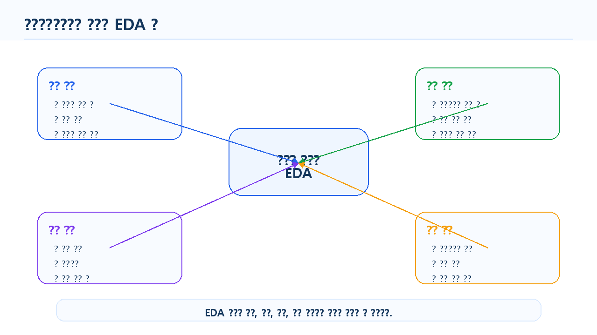

# 6장 EDA와 분석 질문 만들기

이 장에서는 Chapter 5에서 전처리한 온라인 쇼핑몰 데이터를 바탕으로 탐색적 데이터 분석, 즉 EDA를 수행하고 분석 질문을 구체화하는 방법을 배웁니다.

EDA는 Exploratory Data Analysis의 약자로, 본격적인 모델링이나 보고서 작성 전에 데이터를 여러 관점에서 탐색하는 과정입니다. 데이터의 분포, 패턴, 차이, 관계, 이상한 값을 확인하면서 “무엇을 더 분석해야 하는가?”를 찾아가는 단계입니다.

데이터 분석 초보자가 자주 하는 실수는 데이터를 불러오자마자 그래프를 그리거나, LLM에게 바로 “인사이트를 찾아줘”라고 요청하는 것입니다. 하지만 좋은 분석 결과는 좋은 질문에서 시작됩니다. 이번 장에서는 단순히 표와 그래프를 확인하는 것을 넘어, 데이터를 보고 의미 있는 분석 질문을 만드는 방법을 실습합니다.

이번 장의 핵심은 **데이터를 탐색하면서 분석 질문을 만들고, 그 질문을 pandas 코드와 지표로 연결하는 능력**입니다.

## 수업 시간 구성

| 구성                |  권장 시간 |
| ----------------- | -----: |
| EDA 개념과 목적 이해     |    30분 |
| 전처리 데이터 불러오기      |    25분 |
| 분석 질문과 지표 설계      |    40분 |
| 단변량 EDA 실습        |    45분 |
| 이변량 EDA 실습        |    50분 |
| 고객·상품·주문 관점 EDA   |    50분 |
| EDA 결과 해석과 질문 정리  |    40분 |
| LLM을 활용한 분석 질문 확장 |    30분 |
| 연습 문제 및 심화 과제     | 60~90분 |

핵심 EDA 실습은 약 5시간을 기준으로 구성되어 있습니다. 연습 문제와 심화 과제까지 포함하면 6시간 이상으로 확장할 수 있습니다.

## 1. 학습 목표

이 장을 마치면 학습자는 다음을 할 수 있습니다.

- EDA의 목적과 역할을 설명할 수 있습니다.
- 분석 질문과 단순 호기심의 차이를 구분할 수 있습니다.
- 온라인 쇼핑몰 데이터에서 고객, 상품, 주문 관점의 분석 질문을 만들 수 있습니다.
- 분석 질문을 pandas 코드와 지표로 연결할 수 있습니다.
- 단변량 EDA와 이변량 EDA의 차이를 설명할 수 있습니다.
- 범주형 변수와 숫자형 변수의 기본 분포를 확인할 수 있습니다.
- 고객별, 카테고리별, 월별 주요 지표를 탐색할 수 있습니다.
- EDA 결과를 바탕으로 추가 분석 질문을 도출할 수 있습니다.
- LLM이 제안한 분석 질문을 실제 데이터로 검증 가능한 형태로 수정할 수 있습니다.
- EDA 결과를 Markdown 요약 보고서로 정리할 수 있습니다.

## 2. 이번 장에서 만들 결과물

이번 장에서는 전처리된 데이터를 바탕으로 다음 결과물을 만듭니다.

- EDA 분석 질문 목록
- 분석 질문별 필요 데이터와 지표 정리표
- 고객 데이터 기본 분포 요약
- 상품 카테고리 및 가격 분포 요약
- 주문 상태와 결제수단 분포 요약
- 월별 매출 및 주문 수 요약표
- 카테고리별 매출 요약표
- 고객별 구매 금액 및 주문 횟수 요약표
- EDA 결과 해석 메모
- LLM 분석 질문 확장 프롬프트와 검증 결과
- `reports/ch06_eda_summary.md` 요약 보고서

아래 그림은 EDA가 데이터 분석 프로젝트에서 어떤 위치에 있는지 보여줍니다.

<figure class="figure">
  
  <figcaption>그림 6-1. EDA 전체 흐름도</figcaption>
</figure>

## 3. 핵심 개념

### 3.1 EDA란 무엇인가

EDA는 데이터를 탐색하면서 구조, 분포, 패턴, 관계, 이상한 값을 파악하는 과정입니다.

EDA에서는 보통 다음 질문에 답합니다.

- 데이터는 어떤 변수들로 구성되어 있는가?
- 주요 숫자형 변수의 분포는 어떤가?
- 주요 범주형 변수의 빈도는 어떤가?
- 특정 그룹 간 차이가 있는가?
- 시간에 따른 변화가 있는가?
- 이상하게 큰 값이나 작은 값이 있는가?
- 추가로 분석할 만한 질문은 무엇인가?

EDA는 최종 결론을 내리는 단계가 아니라, 분석 방향을 잡는 단계입니다. 따라서 EDA 결과를 해석할 때는 “결론”보다 “관찰”과 “가설”을 구분해야 합니다.

### 3.2 분석 질문이란 무엇인가

분석 질문은 데이터를 사용해 답할 수 있는 구체적인 질문입니다.

좋은 분석 질문은 다음 조건을 만족합니다.

| 조건     | 설명                 | 예시                    |
| ------ | ------------------ | --------------------- |
| 데이터 기반 | 현재 데이터로 답할 수 있어야 함 | 월별 매출은 어떻게 변하는가?      |
| 구체적    | 분석 대상과 기준이 명확해야 함  | 카테고리별 매출 비중은 어떻게 다른가? |
| 측정 가능  | 지표로 계산할 수 있어야 함    | 주문 수, 매출 합계, 평균 구매 금액 |
| 해석 가능  | 결과가 의사결정과 연결되어야 함  | 어떤 상품군을 우선 관리해야 하는가?  |
| 검증 가능  | 코드로 확인할 수 있어야 함    | `groupby()`로 계산 가능    |

반대로 다음 질문은 아직 좋은 분석 질문이라고 보기 어렵습니다.

| 질문                   | 문제점                |
| -------------------- | ------------------ |
| 고객이 왜 이탈했는가?         | 이탈 여부 데이터가 없을 수 있음 |
| 어떤 상품이 인기가 많은가?      | 인기의 기준이 모호함        |
| 매출을 늘리려면 어떻게 해야 하는가? | 너무 포괄적임            |
| 고객 만족도는 어떤가?         | 만족도 데이터가 없을 수 있음   |

이런 질문은 데이터와 지표를 기준으로 더 구체화해야 합니다.

### 3.3 분석 질문을 지표로 바꾸기

분석 질문은 pandas 코드로 계산할 수 있는 지표로 바뀌어야 합니다.

예를 들어 “어떤 카테고리가 잘 팔리는가?”라는 질문은 너무 모호합니다. 이를 다음처럼 바꿀 수 있습니다.

| 원래 질문            | 구체화된 질문                    | 지표                        |
| ---------------- | -------------------------- | ------------------------- |
| 어떤 카테고리가 잘 팔리는가? | 카테고리별 총매출은 얼마인가?           | `category_sales`          |
| 고객이 많이 사는가?      | 고객별 주문 횟수는 몇 회인가?          | `order_count`             |
| 매출이 늘고 있는가?      | 월별 매출 합계는 어떻게 변하는가?        | `monthly_sales`           |
| 고가 상품이 팔리는가?     | 상품별 평균 단가와 판매 수량은 어떤 관계인가? | `price`, `total_quantity` |

아래 그림은 분석 질문이 지표와 코드로 연결되는 과정을 보여줍니다.

<figure class="figure">
  
  <figcaption>그림 6-2. 분석 질문을 지표와 코드로 바꾸는 흐름</figcaption>
</figure>

### 3.4 단변량 EDA란 무엇인가

단변량 EDA는 하나의 변수만 살펴보는 탐색입니다.

예를 들어 다음과 같은 질문이 단변량 EDA에 해당합니다.

- 고객 나이 분포는 어떤가?
- 고객은 어느 도시에 많이 분포하는가?
- 상품 카테고리는 몇 종류인가?
- 주문 상태별 주문 수는 어떻게 되는가?
- 상품 가격의 평균과 최댓값은 얼마인가?

단변량 EDA는 데이터의 기본 특성을 이해하는 데 사용합니다.

### 3.5 이변량 EDA란 무엇인가

이변량 EDA는 두 변수 사이의 관계를 살펴보는 탐색입니다.

예를 들어 다음 질문이 이변량 EDA에 해당합니다.

- 상품 카테고리별 매출은 어떻게 다른가?
- 결제수단별 주문 수는 어떻게 다른가?
- 월별 매출은 어떻게 변하는가?
- 고객 지역별 주문 금액은 어떻게 다른가?
- 상품 가격과 판매 수량은 어떤 관계가 있는가?

이변량 EDA는 그룹 간 차이나 변수 간 관계를 확인하는 데 유용합니다.

### 3.6 다변량 EDA란 무엇인가

다변량 EDA는 세 개 이상의 변수를 함께 보는 탐색입니다.

예를 들어 다음 질문이 다변량 EDA에 해당합니다.

- 월별·카테고리별 매출은 어떻게 다른가?
- 지역별·연령대별 고객 구매 금액은 어떻게 다른가?
- 주문 상태와 결제수단에 따라 매출 차이가 있는가?
- 고객별 주문 횟수와 총 구매 금액은 어떤 관계가 있는가?

다변량 EDA는 더 깊은 분석에 유용하지만, 초보 단계에서는 너무 복잡한 해석을 피하고 기본 지표부터 확인하는 것이 좋습니다.

<figure class="figure">
  
  <figcaption>그림 6-3. 단변량·이변량·다변량 EDA 비교</figcaption>
</figure>

### 3.7 EDA 결과 해석 시 주의할 점

EDA는 가설을 만드는 단계입니다. 따라서 결과를 볼 때 다음을 주의해야 합니다.

- 상관관계를 원인으로 단정하지 않습니다.
- 데이터에 없는 내용을 추측하지 않습니다.
- 표본 수가 너무 작은 그룹은 조심해서 해석합니다.
- 결측치와 이상값 처리 여부를 함께 확인합니다.
- 한 가지 지표만 보고 결론을 내리지 않습니다.
- LLM이 제안한 해석은 반드시 데이터로 검증합니다.

예를 들어 전자기기 매출이 높게 나왔다고 해서 “고객이 전자기기를 가장 선호한다”고 바로 말할 수는 없습니다. 전자기기는 단가가 높기 때문에 판매 수량이 적어도 매출이 높게 보일 수 있습니다. 따라서 판매 수량, 주문 건수, 평균 단가를 함께 확인해야 합니다.

## 4. 실습 시나리오

이번 장의 실습 시나리오는 다음과 같습니다.

> 온라인 쇼핑몰 운영자가 전처리된 고객, 상품, 주문, 주문 상세 데이터를 바탕으로 현재 쇼핑몰의 기본 현황을 파악하려고 합니다. 매출이 어느 카테고리에서 많이 발생하는지, 월별 매출 흐름은 어떤지, 고객별 구매 금액은 어떻게 다른지 탐색하고, 다음 분석 단계에서 다룰 질문을 정리합니다.

이번 장에서 사용할 주요 분석 질문은 다음과 같습니다.

| 분석 관점 | 분석 질문                  | 주요 지표          |
| ----- | ---------------------- | -------------- |
| 고객    | 고객은 어떤 지역과 연령대에 분포하는가? | 고객 수, 평균 나이    |
| 상품    | 어떤 카테고리의 상품이 많은가?      | 카테고리별 상품 수     |
| 주문    | 주문 상태와 결제수단 분포는 어떤가?   | 주문 수, 비율       |
| 매출    | 카테고리별 매출은 어떻게 다른가?     | 총매출, 매출 비중     |
| 시간    | 월별 매출과 주문 수는 어떻게 변하는가? | 월별 매출, 월별 주문 수 |
| 고객 가치 | 구매 금액이 높은 고객은 누구인가?    | 고객별 총매출, 주문 횟수 |

아래 그림은 고객, 상품, 주문 데이터를 EDA 관점으로 나누어 보는 구조를 보여줍니다.

<figure class="figure">
  
  <figcaption>그림 6-4. 고객·상품·주문 관점의 EDA 맵</figcaption>
</figure>

## 5. 실습 코드

이번 장의 전체 실습은 다음 Notebook에서 진행합니다.

```text
notebooks/ch06_eda_analysis_questions.ipynb
```

본문에는 핵심 코드만 제공합니다.

### 5.1 기본 패키지 불러오기

```python
from pathlib import Path
import pandas as pd
```

실습 파일을 프로젝트 루트에서 실행하는 경우와 `notebooks` 폴더 안에서 실행하는 경우에는 상대 경로가 달라질 수 있습니다. 초보자는 두 경로 예시를 모두 실행하지 말고, 아래처럼 현재 실행 위치를 기준으로 `base_dir`를 자동으로 정한 뒤 사용하는 것이 안전합니다.

```python
current_dir = Path.cwd()

if current_dir.name == "notebooks":
    base_dir = current_dir.parent
else:
    base_dir = current_dir

processed_dir = base_dir / "data" / "processed"
report_dir = base_dir / "reports"
report_dir.mkdir(exist_ok=True)

print("processed_dir:", processed_dir)
print("report_dir:", report_dir)
```

이 코드를 사용하면 노트북을 프로젝트 루트에서 실행하든 `notebooks` 폴더 안에서 실행하든 같은 방식으로 동작합니다.

`to_markdown()`을 사용하려면 환경에 따라 `tabulate` 패키지가 필요할 수 있습니다. 오류가 발생하면 터미널 또는 노트북에서 다음 명령을 실행하세요.

```text
pip install tabulate
```

### 5.2 전처리 데이터 불러오기

앞에서 설정한 `processed_dir`를 사용해 Chapter 5에서 저장한 전처리 데이터를 불러옵니다.

```python
customers = pd.read_csv(processed_dir / "customers_clean.csv")
products = pd.read_csv(processed_dir / "products_clean.csv")
orders = pd.read_csv(processed_dir / "orders_clean.csv")
order_items = pd.read_csv(processed_dir / "order_items_clean.csv")
```

데이터 크기를 확인합니다.

```python
print("customers:", customers.shape)
print("products:", products.shape)
print("orders:", orders.shape)
print("order_items:", order_items.shape)
```

### 5.3 날짜 컬럼 다시 확인하기

CSV로 저장했다가 다시 불러오면 날짜 컬럼이 문자열로 돌아올 수 있습니다. 따라서 다시 날짜형으로 변환합니다.

```python
orders["order_date"] = pd.to_datetime(orders["order_date"], errors="coerce")

if "signup_date" in customers.columns:
    customers["signup_date"] = pd.to_datetime(customers["signup_date"], errors="coerce")
```

`order_month`가 없다면 다시 생성합니다.

```python
if "order_month" not in orders.columns:
    orders["order_month"] = orders["order_date"].dt.to_period("M").astype(str)
```

### 5.4 분석 질문 정리표 만들기

먼저 이번 장에서 다룰 분석 질문을 표로 정리합니다.

```python
questions = pd.DataFrame({
    "analysis_area": ["고객", "상품", "주문", "매출", "시간", "고객 가치"],
    "question": [
        "고객은 어떤 지역과 연령대에 분포하는가?",
        "어떤 카테고리의 상품이 많은가?",
        "주문 상태와 결제수단 분포는 어떤가?",
        "카테고리별 매출은 어떻게 다른가?",
        "월별 매출과 주문 수는 어떻게 변하는가?",
        "구매 금액이 높은 고객은 누구인가?"
    ],
    "metric": [
        "고객 수, 평균 나이",
        "카테고리별 상품 수",
        "주문 수, 비율",
        "총매출, 매출 비중",
        "월별 매출, 월별 주문 수",
        "고객별 총매출, 주문 횟수"
    ],
    "required_data": [
        "customers",
        "products",
        "orders",
        "order_items, products",
        "orders, order_items",
        "customers, orders, order_items"
    ]
})

questions
```

이 표는 EDA의 방향을 정리하는 데 사용합니다.

### 5.5 고객 데이터 단변량 EDA

고객 나이의 기본 통계를 확인합니다.

```python
customers["age"].describe()
```

도시별 고객 수를 확인합니다.

```python
customer_city = customers["city"].value_counts().reset_index()
customer_city.columns = ["city", "customer_count"]
customer_city
```

성별 고객 수를 확인합니다.

```python
customer_gender = customers["gender"].value_counts().reset_index()
customer_gender.columns = ["gender", "customer_count"]
customer_gender
```

고객 데이터에서 확인할 수 있는 기본 질문은 다음과 같습니다.

```text
- 고객은 어느 도시에 많이 분포하는가?
- 고객의 평균 나이는 어느 정도인가?
- 성별 고객 수는 어떻게 분포하는가?
```

### 5.6 상품 데이터 단변량 EDA

상품 카테고리별 상품 수를 확인합니다.

```python
product_category = products["category"].value_counts().reset_index()
product_category.columns = ["category", "product_count"]
product_category
```

상품 가격의 기본 통계를 확인합니다.

```python
products["price"].describe()
```

카테고리별 평균 가격을 확인합니다.

```python
category_price = (
    products
    .groupby("category", as_index=False)
    .agg(
        product_count=("product_id", "count"),
        avg_price=("price", "mean"),
        min_price=("price", "min"),
        max_price=("price", "max")
    )
    .sort_values("avg_price", ascending=False)
)

category_price
```

### 5.7 주문 데이터 단변량 EDA

주문 상태별 주문 수를 확인합니다.

```python
order_status = orders["order_status"].value_counts().reset_index()
order_status.columns = ["order_status", "order_count"]
order_status
```

결제수단별 주문 수를 확인합니다.

```python
payment_method = orders["payment_method"].value_counts().reset_index()
payment_method.columns = ["payment_method", "order_count"]
payment_method
```

주문 기간을 확인합니다.

```python
print("주문 시작일:", orders["order_date"].min())
print("주문 종료일:", orders["order_date"].max())
```

### 5.8 주문 상세 데이터 확인

`line_total` 컬럼이 있는지 확인합니다.

```python
"line_total" in order_items.columns
```

없다면 다시 생성합니다.

```python
if "line_total" not in order_items.columns:
    order_items["line_total"] = order_items["quantity"] * order_items["unit_price"]
```

주문 상세 금액의 기본 통계를 확인합니다.

```python
order_items["line_total"].describe()
```

전체 매출 합계를 확인합니다.

```python
total_sales = order_items["line_total"].sum()
total_sales
```

### 5.9 카테고리별 매출 EDA

상품 정보와 주문 상세 정보를 병합합니다.

```python
sales_items = order_items.merge(
    products,
    on="product_id",
    how="left"
)
```

병합 결과를 검증합니다.

```python
print("병합 전 order_items:", order_items.shape)
print("병합 후 sales_items:", sales_items.shape)
print("상품명 누락:", sales_items["product_name"].isna().sum())
print("카테고리 누락:", sales_items["category"].isna().sum())
```

카테고리별 매출을 계산합니다.

```python
category_sales = (
    sales_items
    .groupby("category", as_index=False)
    .agg(
        total_quantity=("quantity", "sum"),
        total_sales=("line_total", "sum")
    )
    .sort_values("total_sales", ascending=False)
)

category_sales
```

매출 비중을 계산합니다.

```python
category_sales["sales_ratio"] = (
    category_sales["total_sales"] / category_sales["total_sales"].sum() * 100
).round(2)

category_sales
```

### 5.10 월별 매출 EDA

주문 정보와 주문 상세 정보를 병합합니다.

```python
order_sales = order_items.merge(
    orders,
    on="order_id",
    how="left"
)
```

날짜를 다시 변환하고 월 정보를 생성합니다.

```python
order_sales["order_date"] = pd.to_datetime(order_sales["order_date"], errors="coerce")
order_sales["order_month"] = order_sales["order_date"].dt.to_period("M").astype(str)
```

월별 매출과 주문 수를 계산합니다.

```python
monthly_sales = (
    order_sales
    .groupby("order_month", as_index=False)
    .agg(
        total_sales=("line_total", "sum"),
        order_count=("order_id", "nunique")
    )
    .sort_values("order_month")
)

monthly_sales
```

월별 평균 주문 금액을 계산합니다.

```python
monthly_sales["avg_order_value"] = (
    monthly_sales["total_sales"] / monthly_sales["order_count"]
).round(0)

monthly_sales
```

### 5.11 고객별 구매 금액 EDA

고객 정보를 결합합니다.

```python
customer_sales_base = order_sales.merge(
    customers,
    on="customer_id",
    how="left"
)
```

고객별 구매 금액과 주문 횟수를 계산합니다.

```python
customer_sales = (
    customer_sales_base
    .groupby(["customer_id", "name", "city"], as_index=False)
    .agg(
        order_count=("order_id", "nunique"),
        total_sales=("line_total", "sum")
    )
    .sort_values("total_sales", ascending=False)
)

customer_sales.head(10)
```

평균 주문 금액을 추가합니다.

```python
customer_sales["avg_order_value"] = (
    customer_sales["total_sales"] / customer_sales["order_count"]
).round(0)

customer_sales.head(10)
```

### 5.12 EDA 결과를 분석 질문과 연결하기

EDA 결과를 질문별로 정리합니다.

```python
eda_result_summary = pd.DataFrame({
    "question": [
        "고객은 어느 도시에 많이 분포하는가?",
        "어떤 카테고리의 상품이 많은가?",
        "카테고리별 매출은 어떻게 다른가?",
        "월별 매출과 주문 수는 어떻게 변하는가?",
        "구매 금액이 높은 고객은 누구인가?"
    ],
    "result_table": [
        "customer_city",
        "product_category",
        "category_sales",
        "monthly_sales",
        "customer_sales"
    ],
    "next_question": [
        "도시별 구매 금액도 차이가 있는가?",
        "상품 수가 많은 카테고리가 매출도 높은가?",
        "매출 차이가 판매 수량 때문인가, 단가 때문인가?",
        "특정 월의 매출 증가 원인은 무엇인가?",
        "고액 구매 고객은 반복 구매 고객인가?"
    ]
})

eda_result_summary
```

EDA는 여기서 끝나지 않습니다. 한 번의 결과는 다음 질문으로 이어집니다.

### 5.13 결과 저장하기

EDA 결과를 CSV 파일로 저장합니다.

```python
customer_city.to_csv(report_dir / "ch06_customer_city.csv", index=False)
product_category.to_csv(report_dir / "ch06_product_category.csv", index=False)
category_sales.to_csv(report_dir / "ch06_category_sales.csv", index=False)
monthly_sales.to_csv(report_dir / "ch06_monthly_sales.csv", index=False)
customer_sales.to_csv(report_dir / "ch06_customer_sales.csv", index=False)
eda_result_summary.to_csv(report_dir / "ch06_eda_questions.csv", index=False)
```

저장 결과를 확인합니다.

```python
list(report_dir.glob("ch06_*.csv"))
```

### 5.14 EDA 요약 보고서 작성하기

간단한 Markdown 보고서를 생성합니다.

```python
summary_text = f"""
# Chapter 6 EDA 요약 보고서

## 1. 분석 목적

전처리된 온라인 쇼핑몰 데이터를 사용해 고객, 상품, 주문, 매출 관점의 기본 현황을 탐색했습니다.

## 2. 주요 분석 질문

{questions.to_markdown(index=False)}

## 3. 카테고리별 매출 요약

{category_sales.head(10).to_markdown(index=False)}

## 4. 월별 매출 요약

{monthly_sales.to_markdown(index=False)}

## 5. 고객별 구매 금액 상위 10명

{customer_sales.head(10).to_markdown(index=False)}

## 6. 추가 분석 질문

{eda_result_summary.to_markdown(index=False)}

## 7. 해석 시 주의사항

- EDA 결과는 최종 결론이 아니라 추가 분석을 위한 관찰 결과입니다.
- 매출이 높은 카테고리가 반드시 선호도가 높은 카테고리라는 뜻은 아닙니다.
- 월별 매출 변화의 원인을 설명하려면 프로모션, 계절성, 신규 상품 등의 추가 정보가 필요합니다.
- 고객별 구매 금액은 주문 횟수와 함께 해석해야 합니다.
"""

report_path = report_dir / "ch06_eda_summary.md"
report_path.write_text(summary_text, encoding="utf-8")
```

아래 그림은 EDA 결과가 인사이트와 보고서로 이어지는 흐름을 보여줍니다.

<figure class="figure">
  
  <figcaption>그림 6-5. EDA 결과를 인사이트와 보고서로 연결하는 흐름</figcaption>
</figure>

## 6. LLM 활용 프롬프트

LLM은 EDA 질문을 확장하고, 분석 결과를 해석하는 데 도움을 줄 수 있습니다. 하지만 LLM이 제안한 질문이 실제 데이터로 검증 가능한지는 반드시 사람이 확인해야 합니다.

LLM에게 질문할 때는 원본 고객명, 이메일, 주문 상세 전체 데이터를 넣지 않습니다. 컬럼명, 집계 결과, 요약표 중심으로 질문합니다.

### 6.1 EDA 분석 질문 생성 요청

```text
당신은 데이터 분석 강사입니다.

온라인 쇼핑몰 데이터로 EDA를 수행하려고 합니다.

데이터셋:
- customers: 고객 정보
- products: 상품 정보
- orders: 주문 정보
- order_items: 주문 상세 정보

주요 컬럼:
- customers: customer_id, gender, age, city, signup_date
- products: product_id, product_name, category, price
- orders: order_id, customer_id, order_date, payment_method, order_status
- order_items: order_id, product_id, quantity, unit_price, line_total

요청:
1. 초보자가 수행할 수 있는 EDA 질문 10개를 만들어 주세요.
2. 각 질문에 필요한 데이터셋과 pandas 기능을 함께 정리해 주세요.
3. 실제 데이터로 검증 가능한 질문만 제안해 주세요.
4. 데이터에 없는 내용은 추측하지 마세요.
```

### 6.2 분석 질문을 지표로 바꾸기

```text
다음 분석 질문을 pandas로 계산 가능한 지표로 바꿔 주세요.

분석 질문:
- 어떤 카테고리가 잘 팔리는가?
- 고객 구매 금액은 어떻게 다른가?
- 월별 매출 흐름은 어떤가?
- 결제수단별 주문 수는 어떻게 다른가?

각 질문에 대해 다음 항목을 표로 정리해 주세요.

- 구체화된 질문
- 필요한 데이터셋
- 필요한 컬럼
- 계산할 지표
- 사용할 pandas 기능
- 주의할 점
```

### 6.3 EDA 결과 해석 요청

```text
다음은 온라인 쇼핑몰 카테고리별 매출 요약 결과입니다.

category,total_quantity,total_sales,sales_ratio
전자기기,320,12500000,42.5
생활용품,510,7800000,26.5
패션,260,6200000,21.1
식품,430,2900000,9.9

이 결과를 보고서에 넣을 수 있도록 해석해 주세요.

조건:
- 데이터에 없는 원인을 단정하지 말 것
- 원인 설명은 가설로 표현할 것
- 추가로 확인해야 할 분석 질문을 제안할 것
- 초보자도 이해할 수 있게 작성할 것
```

### 6.4 LLM이 만든 분석 질문 검토 요청

```text
LLM이 다음 분석 질문을 제안했습니다.

1. 고객이 왜 이탈했는가?
2. 고객 만족도는 어떤가?
3. 어떤 상품이 가장 인기가 많은가?
4. 매출이 높은 카테고리는 무엇인가?
5. 월별 매출은 어떻게 변하는가?

현재 데이터에는 고객 이탈 여부와 만족도 데이터가 없습니다.

각 질문이 현재 데이터로 분석 가능한지 검토해 주세요.
분석하기 어려운 질문은 현재 데이터로 답할 수 있는 질문으로 수정해 주세요.
```

### 6.5 EDA 보고서 초안 작성 요청

```text
다음 EDA 결과를 바탕으로 보고서 초안을 작성해 주세요.

분석 대상:
- 온라인 쇼핑몰 고객, 상품, 주문, 주문 상세 데이터

주요 결과:
- 카테고리별 매출 요약표
- 월별 매출 요약표
- 고객별 구매 금액 상위 10명
- 주문 상태별 주문 수
- 결제수단별 주문 수

보고서 구성:
1. 분석 목적
2. 데이터 개요
3. 주요 EDA 결과
4. 관찰 내용
5. 추가 분석 질문
6. 해석 시 주의사항

조건:
- 과장된 표현을 피할 것
- 원인과 관찰을 구분할 것
- 데이터에 없는 내용을 추측하지 말 것
- 실무 보고서 문체로 작성할 것
```

## 7. 결과 해석

이번 장의 결과는 최종 결론이 아니라 EDA를 통해 발견한 관찰 결과입니다.

### 7.1 고객 분포 해석

도시별 고객 수를 확인하면 고객 기반이 어느 지역에 집중되어 있는지 볼 수 있습니다.

```text
도시별 고객 수를 확인한 결과, 특정 도시에 고객이 상대적으로 많이 분포할 수 있습니다.
다만 고객 수가 많다고 해서 해당 도시의 매출이 반드시 높다는 뜻은 아닙니다.
```

추가 질문은 다음과 같습니다.

- 도시별 주문 수는 어떻게 다른가?
- 도시별 총 구매 금액은 어떻게 다른가?
- 도시별 평균 주문 금액은 차이가 있는가?

### 7.2 상품 카테고리 해석

카테고리별 상품 수는 상품 구성이 어떻게 되어 있는지 보여줍니다.

```text
상품 수가 많은 카테고리는 운영자가 많이 취급하는 상품군일 수 있습니다.
하지만 상품 수가 많다고 해서 매출이 높은 것은 아니므로 카테고리별 매출과 함께 확인해야 합니다.
```

추가 질문은 다음과 같습니다.

- 상품 수가 많은 카테고리가 매출도 높은가?
- 평균 가격이 높은 카테고리는 무엇인가?
- 판매 수량이 많은 카테고리는 무엇인가?

### 7.3 카테고리별 매출 해석

카테고리별 매출은 어떤 상품군이 매출에 기여하는지 보여줍니다.

```text
카테고리별 매출을 비교하면 매출 기여도가 높은 상품군을 확인할 수 있습니다.
다만 매출이 높은 이유가 판매 수량 때문인지, 단가 때문인지는 추가로 확인해야 합니다.
```

추가 질문은 다음과 같습니다.

- 카테고리별 판매 수량은 어떻게 다른가?
- 카테고리별 평균 단가는 어떻게 다른가?
- 매출 비중이 높은 카테고리의 상품 수는 충분한가?

### 7.4 월별 매출 해석

월별 매출은 시간에 따른 흐름을 보여줍니다.

```text
월별 매출 요약을 통해 특정 월에 매출이 증가하거나 감소했는지 확인할 수 있습니다.
하지만 매출 변화의 원인을 설명하려면 프로모션, 계절성, 신규 상품 출시 여부 등 추가 정보가 필요합니다.
```

추가 질문은 다음과 같습니다.

- 특정 월에 주문 수가 증가했는가?
- 평균 주문 금액이 증가했는가?
- 특정 카테고리의 매출이 특정 월에 증가했는가?

### 7.5 고객별 구매 금액 해석

고객별 구매 금액은 우수 고객 분석의 출발점입니다.

```text
고객별 총 구매 금액을 계산하면 구매 금액이 높은 고객을 확인할 수 있습니다.
하지만 한 번의 고액 구매 고객과 여러 번 반복 구매한 고객은 구분해서 해석해야 합니다.
```

추가 질문은 다음과 같습니다.

- 총 구매 금액이 높은 고객은 주문 횟수도 많은가?
- 평균 주문 금액이 높은 고객은 누구인가?
- 지역별 우수 고객 분포는 어떻게 되는가?

## 8. 실무 적용 포인트

실무 EDA에서는 데이터를 보고 바로 결론을 내리기보다 질문을 계속 구체화해야 합니다.

실무에서 자주 사용하는 EDA 흐름은 다음과 같습니다.

1. 데이터 개요를 확인합니다.
2. 주요 변수의 분포를 확인합니다.
3. 비즈니스 관점의 질문을 만듭니다.
4. 질문을 계산 가능한 지표로 바꿉니다.
5. pandas로 지표를 계산합니다.
6. 결과를 표나 그래프로 확인합니다.
7. 관찰 결과와 원인 가설을 구분합니다.
8. 추가 분석 질문을 정리합니다.
9. 결과를 보고서나 발표 자료로 정리합니다.
10. LLM이 제안한 질문과 해석을 실제 데이터로 검증합니다.

### EDA 체크리스트

| 점검 항목                       | 확인 |
|---|---|
| 전처리된 데이터를 사용했는가? | □ |
| 분석 질문을 먼저 정리했는가? | □ |
| 질문별 필요한 데이터와 컬럼을 확인했는가? | □ |
| 질문을 계산 가능한 지표로 바꾸었는가? | □ |
| 단변량 EDA를 수행했는가? | □ |
| 이변량 EDA를 수행했는가? | □ |
| 병합 결과의 행 수와 결측치를 확인했는가? | □ |
| 매출, 주문 수, 평균 주문 금액을 구분했는가? | □ |
| 관찰 결과와 원인 가설을 구분했는가? | □ |
| 데이터에 없는 내용을 추측하지 않았는가? | □ |
| 추가 분석 질문을 정리했는가? | □ |
| LLM이 제안한 질문을 실제 데이터로 검증했는가? | □ |
| EDA 결과를 보고서 파일로 저장했는가? | □ |

## 9. 연습 문제

### 기본 연습 문제

1. Chapter 5에서 저장한 전처리 데이터 4개를 불러오세요.
   - 제출 형식: 코드와 shape 출력 결과
   - 포함 항목: `customers_clean.csv`, `products_clean.csv`, `orders_clean.csv`, `order_items_clean.csv`

2. 이번 장에서 다룰 EDA 분석 질문 5개를 표로 정리하세요.
   - 제출 형식: DataFrame 또는 Markdown 표
   - 포함 항목: 분석 질문, 필요한 데이터, 계산할 지표

3. 고객 도시별 고객 수를 계산하세요.
   - 제출 형식: 코드와 출력 결과
   - 포함 항목: `value_counts()`

4. 상품 카테고리별 상품 수와 평균 가격을 계산하세요.
   - 제출 형식: 코드와 출력 결과
   - 포함 항목: `groupby()`, `agg()`

5. 카테고리별 매출과 매출 비중을 계산하세요.
   - 제출 형식: 코드와 결과표
   - 포함 항목: `merge()`, `groupby()`, `sales_ratio`

6. 월별 매출과 월별 주문 수를 계산하세요.
   - 제출 형식: 코드와 결과표
   - 포함 항목: `order_month`, `total_sales`, `order_count`

7. EDA 결과를 바탕으로 추가 분석 질문 3개를 작성하세요.
   - 제출 형식: Markdown 목록
   - 조건: 실제 데이터로 검증 가능한 질문만 작성

### 심화 과제

1. 고객별 구매 금액 상위 10명을 계산하고 해석하세요.
   - 제출 형식: 결과표와 해석 문장
   - 포함 항목: `order_count`, `total_sales`, `avg_order_value`

2. 카테고리별 매출이 높은 이유를 확인하기 위한 추가 지표를 계산하세요.
   - 제출 형식: 결과표
   - 포함 항목: 판매 수량, 평균 단가, 상품 수

3. LLM에게 EDA 질문을 생성하게 한 뒤, 현재 데이터로 분석 가능한 질문과 불가능한 질문을 구분하세요.
   - 제출 형식: 프롬프트, LLM 답변 요약, 검토 결과

4. `reports/ch06_eda_summary.md` 파일을 작성하세요.
   - 제출 형식: Markdown 파일
   - 포함 항목: 분석 목적, 주요 질문, EDA 결과, 추가 질문, 해석 시 주의사항

## 10. 정리

이번 장에서는 Chapter 5에서 전처리한 데이터를 바탕으로 EDA를 수행하고 분석 질문을 만드는 방법을 배웠습니다. EDA는 최종 결론을 내리는 단계가 아니라 데이터를 탐색하고 추가 분석 방향을 정하는 단계입니다.

좋은 분석은 좋은 질문에서 시작됩니다. “어떤 상품이 인기 있는가?”처럼 모호한 질문은 “카테고리별 총매출은 어떻게 다른가?”, “상품별 판매 수량은 어떻게 다른가?”, “평균 단가가 높은 상품군은 무엇인가?”처럼 계산 가능한 질문으로 구체화해야 합니다.

단변량 EDA는 하나의 변수 분포를 확인하는 과정입니다. 고객 나이, 도시, 상품 카테고리, 주문 상태 같은 변수를 각각 살펴볼 수 있습니다. 이변량 EDA는 두 변수의 관계나 그룹 간 차이를 확인하는 과정입니다. 카테고리별 매출, 월별 매출, 고객별 구매 금액 등이 이에 해당합니다.

EDA 결과를 해석할 때는 관찰과 원인을 구분해야 합니다. 매출이 높다는 사실은 데이터로 확인할 수 있지만, 왜 높은지는 추가 데이터나 분석이 필요합니다. 따라서 원인을 단정하지 말고 가설로 표현해야 합니다.

LLM은 분석 질문을 확장하고 해석 문장을 작성하는 데 도움을 줄 수 있습니다. 하지만 LLM이 제안한 질문이 현재 데이터로 답할 수 있는지, 해석이 데이터에 근거하는지 반드시 검토해야 합니다.

다음 장에서는 이번 장에서 만든 EDA 질문과 요약 결과를 바탕으로 데이터 시각화를 수행하고, 그래프를 통해 분석 결과를 더 직관적으로 전달하는 방법을 배웁니다.
