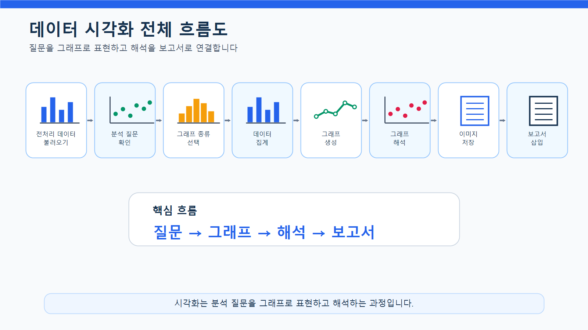
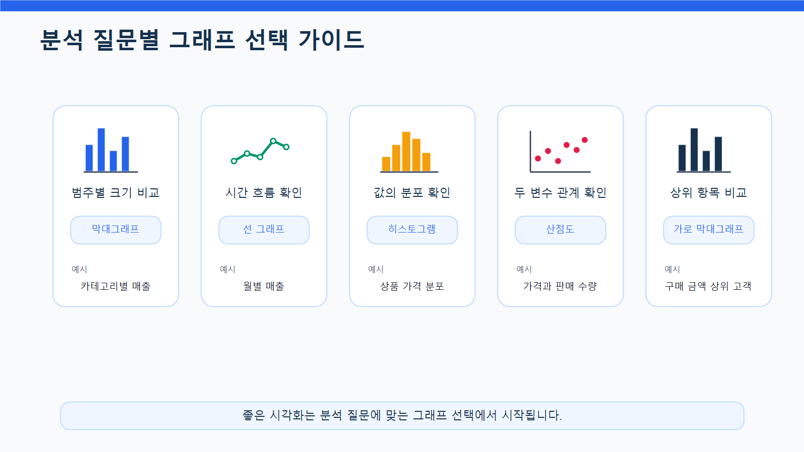
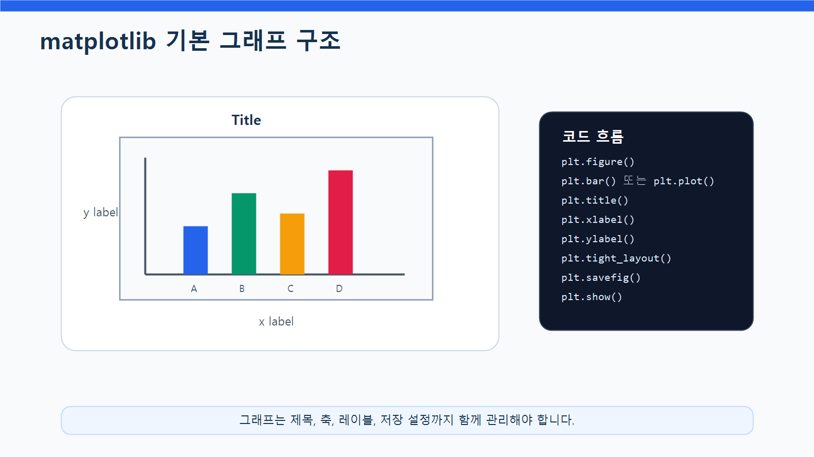
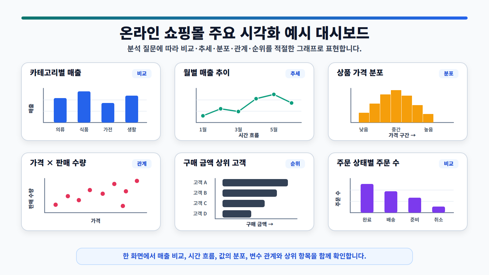
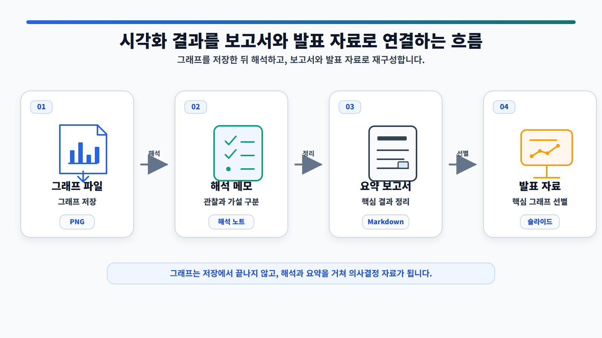

# 7장. 그래프로 데이터의 이야기를 보여주기

표는 정확합니다. 하지만 표만으로는 데이터의 흐름과 차이를 빠르게 이해하기 어렵습니다. 카테고리별 매출을 표로 보면 숫자를 하나씩 비교해야 하지만, 막대그래프로 보면 어느 카테고리가 큰지 한눈에 들어옵니다. 월별 매출도 표로 보면 값의 나열에 가깝지만, 선 그래프로 그리면 증가와 감소의 흐름이 훨씬 쉽게 보입니다.

데이터 시각화는 분석 결과를 예쁘게 꾸미는 작업이 아닙니다. 데이터의 패턴, 차이, 추세, 분포, 관계를 더 빠르게 이해하고 다른 사람에게 설득력 있게 전달하기 위한 분석 도구입니다. 좋은 그래프는 복잡한 설명을 줄이고, 독자가 핵심을 스스로 발견하도록 도와줍니다.

이번 장에서는 앞에서 정리한 온라인 쇼핑몰 데이터를 바탕으로 카테고리별 매출, 월별 매출, 상품 가격 분포, 가격과 판매 수량의 관계, 고객별 구매 금액 상위 목록을 시각화합니다. 핵심은 그래프를 많이 그리는 것이 아니라, 분석 질문에 맞는 그래프를 고르고, 그래프가 말하는 것과 말하지 않는 것을 구분하는 것입니다.

## 이 장에서 생각해 볼 질문

시각화를 시작하기 전에 다음 질문을 떠올려 봅니다.

- 지금 확인하려는 것은 비교인가, 추세인가, 분포인가, 관계인가?
- 이 분석 질문에 가장 잘 맞는 그래프는 무엇인가?
- 그래프의 x축과 y축은 무엇을 의미하는가?
- 그래프 제목만 보고도 핵심 내용을 이해할 수 있는가?
- 그래프가 원인을 설명하는가, 아니면 패턴만 보여주는가?
- 개인정보가 포함된 그래프는 익명화되어 있는가?
- LLM이 작성한 그래프 해석이 실제 데이터에 근거하고 있는가?

아래 그림은 데이터 시각화가 분석 과정에서 어떤 역할을 하는지 보여줍니다.

<figure class="figure">
  
  <figcaption>그림 7-1. 데이터 시각화 전체 흐름도</figcaption>
</figure>

## 1. 시각화는 분석 질문에서 시작된다

좋은 시각화는 그래프 종류를 많이 아는 데서 시작하지 않습니다. 먼저 어떤 질문에 답하려는지 정해야 합니다.

예를 들어 “카테고리별 매출은 어떻게 다른가?”라는 질문은 범주별 크기를 비교하는 문제입니다. 이때는 막대그래프가 적합합니다. “월별 매출은 어떻게 변하는가?”라는 질문은 시간 흐름을 보는 문제이므로 선 그래프가 적합합니다. “상품 가격은 어느 구간에 몰려 있는가?”라는 질문은 분포를 보는 문제이므로 히스토그램이 적합합니다.

| 분석 목적 | 적합한 그래프 | 예시 질문 |
| --- | --- | --- |
| 범주별 크기 비교 | 막대그래프 | 카테고리별 매출은 어떻게 다른가? |
| 시간 흐름 확인 | 선 그래프 | 월별 매출은 어떻게 변하는가? |
| 값의 분포 확인 | 히스토그램 | 상품 가격은 어떤 범위에 몰려 있는가? |
| 두 변수 관계 확인 | 산점도 | 가격과 판매 수량은 관계가 있는가? |
| 상위 항목 비교 | 가로 막대그래프 | 구매 금액 상위 고객은 누구인가? |
| 비율 비교 | 막대그래프 또는 파이 차트 | 주문 상태별 비중은 어떻게 되는가? |

파이 차트는 비율을 직관적으로 보여줄 수 있지만, 항목이 많거나 값 차이가 작으면 비교가 어렵습니다. 실무에서는 비율 비교도 막대그래프로 표현하는 경우가 많습니다.

<figure class="figure">
  
  <figcaption>그림 7-2. 분석 질문별 그래프 선택 가이드</figcaption>
</figure>

## 2. matplotlib 그래프의 기본 구조

matplotlib은 Python에서 가장 널리 사용되는 시각화 라이브러리 중 하나입니다. pandas로 집계한 결과를 그래프로 표현할 때 자주 사용합니다.

matplotlib 그래프는 보통 다음 흐름으로 작성합니다.

1. 그래프 크기를 정합니다.
2. 그래프 종류를 선택합니다.
3. x축과 y축 데이터를 지정합니다.
4. 제목과 축 이름을 추가합니다.
5. 눈금과 레이블을 정리합니다.
6. 그래프를 화면에 표시합니다.
7. 필요하면 이미지 파일로 저장합니다.

기본 구조는 다음과 같습니다.

```python
import matplotlib.pyplot as plt

plt.figure(figsize=(10, 5))
plt.bar(x_data, y_data)
plt.title("그래프 제목")
plt.xlabel("x축 이름")
plt.ylabel("y축 이름")
plt.xticks(rotation=45)
plt.tight_layout()
plt.show()
```

아래 그림은 matplotlib 그래프가 어떤 요소로 구성되는지 보여줍니다.

<figure class="figure">
  
  <figcaption>그림 7-3. matplotlib 기본 그래프 구조</figcaption>
</figure>

### 한글 폰트 설정

matplotlib에서 한글 제목이나 축 이름을 사용하면 글자가 깨질 수 있습니다. Windows 환경에서는 보통 `Malgun Gothic`을 사용합니다.

```python
import matplotlib.pyplot as plt

plt.rcParams["font.family"] = "Malgun Gothic"
plt.rcParams["axes.unicode_minus"] = False
```

`axes.unicode_minus`를 `False`로 설정하면 음수 기호가 깨지는 문제를 줄일 수 있습니다. Mac 환경에서는 `AppleGothic`, Linux 환경에서는 `NanumGothic`을 사용할 수 있습니다.

```python
# Mac 예시
plt.rcParams["font.family"] = "AppleGothic"
plt.rcParams["axes.unicode_minus"] = False
```

```python
# Linux 예시
plt.rcParams["font.family"] = "NanumGothic"
plt.rcParams["axes.unicode_minus"] = False
```

## 3. 그래프 종류별로 읽는 법

그래프는 종류마다 잘 보여주는 것이 다릅니다. 같은 데이터를 사용해도 그래프 선택이 잘못되면 메시지가 흐려질 수 있습니다.

### 막대그래프

막대그래프는 범주별 크기를 비교할 때 사용합니다. 카테고리별 매출, 주문 상태별 주문 수, 결제수단별 주문 수, 고객별 구매 금액 상위 10명처럼 항목 간 차이를 비교할 때 적합합니다.

막대그래프는 x축에 범주, y축에 값을 배치합니다. 항목이 많거나 이름이 길다면 세로 막대보다 가로 막대가 읽기 좋을 때가 많습니다.

### 선 그래프

선 그래프는 시간에 따른 변화를 확인할 때 사용합니다. 월별 매출, 월별 주문 수, 기간별 방문자 수처럼 순서가 중요한 데이터에 적합합니다.

선 그래프에서는 x축 순서가 중요합니다. 날짜나 월이 올바른 순서로 정렬되어 있지 않으면 그래프가 잘못된 흐름을 보여줄 수 있습니다.

### 히스토그램

히스토그램은 숫자형 데이터의 분포를 확인할 때 사용합니다. 상품 가격, 고객 나이, 주문 상세 금액처럼 값이 어느 구간에 많이 몰려 있는지 볼 때 유용합니다.

히스토그램은 값의 범위를 여러 구간으로 나누고, 각 구간에 데이터가 몇 개 있는지 보여줍니다.

### 산점도

산점도는 두 숫자형 변수의 관계를 확인할 때 사용합니다. 상품 가격과 판매 수량, 고객별 주문 횟수와 총 구매 금액, 상품별 판매 수량과 매출의 관계를 탐색할 수 있습니다.

산점도는 관계를 탐색하는 데 유용하지만, 상관관계가 보인다고 해서 원인 관계가 있다는 뜻은 아닙니다.

## 4. 온라인 쇼핑몰 데이터로 시각화할 질문

이번 장에서는 온라인 쇼핑몰 운영자가 EDA 결과를 더 쉽게 이해하고 보고서에 활용하기 위해 주요 분석 결과를 그래프로 표현한다고 가정합니다.

| 시각화 질문 | 사용할 데이터 | 그래프 |
| --- | --- | --- |
| 카테고리별 매출은 어떻게 다른가? | `category_sales` | 막대그래프 |
| 월별 매출은 어떻게 변하는가? | `monthly_sales` | 선 그래프 |
| 상품 가격은 어떤 구간에 몰려 있는가? | `products` | 히스토그램 |
| 상품 가격과 판매 수량은 관계가 있는가? | `product_sales` | 산점도 |
| 구매 금액 상위 고객은 누구인가? | `customer_sales` | 가로 막대그래프 |
| 주문 상태별 주문 수는 어떻게 다른가? | `orders` | 막대그래프 |

아래 그림은 이번 장에서 만들 주요 시각화 결과를 한 화면에 요약한 예시입니다.

<figure class="figure">
  
  <figcaption>그림 7-4. 온라인 쇼핑몰 주요 시각화 예시 대시보드</figcaption>
</figure>

## 5. 시각화를 위한 데이터 준비

이번 장의 코드는 `notebooks/ch07_data_visualization.ipynb`에서 실행할 수 있습니다. 여기서는 핵심 흐름만 살펴봅니다.

먼저 필요한 패키지를 불러옵니다.

```python
from pathlib import Path
import pandas as pd
import matplotlib.pyplot as plt
```

한글 폰트를 설정합니다.

```python
plt.rcParams["font.family"] = "Malgun Gothic"
plt.rcParams["axes.unicode_minus"] = False
```

실습 파일을 프로젝트 루트에서 실행하는 경우와 `notebooks` 폴더 안에서 실행하는 경우에는 상대 경로가 달라질 수 있습니다. 현재 실행 위치를 기준으로 `base_dir`를 자동으로 정하면 더 안전합니다.

```python
current_dir = Path.cwd()

if current_dir.name == "notebooks":
    base_dir = current_dir.parent
else:
    base_dir = current_dir

processed_dir = base_dir / "data" / "processed"
report_dir = base_dir / "reports"
figure_dir = report_dir / "figures"

figure_dir.mkdir(parents=True, exist_ok=True)

print("processed_dir:", processed_dir)
print("report_dir:", report_dir)
print("figure_dir:", figure_dir)
```

경로가 올바르게 설정되었는지 확인합니다.

```python
print("processed_dir exists:", processed_dir.exists())
print("figure_dir exists:", figure_dir.exists())
```

`to_markdown()`을 사용하려면 환경에 따라 `tabulate` 패키지가 필요할 수 있습니다. 오류가 발생하면 터미널 또는 노트북에서 다음 명령을 실행합니다.

```text
pip install tabulate
```

### 전처리 데이터 불러오기

앞에서 설정한 `processed_dir`를 사용해 전처리 데이터를 불러옵니다.

```python
customers = pd.read_csv(processed_dir / "customers_clean.csv")
products = pd.read_csv(processed_dir / "products_clean.csv")
orders = pd.read_csv(processed_dir / "orders_clean.csv")
order_items = pd.read_csv(processed_dir / "order_items_clean.csv")
```

날짜 컬럼을 다시 변환합니다.

```python
orders["order_date"] = pd.to_datetime(orders["order_date"], errors="coerce")

if "order_month" not in orders.columns:
    orders["order_month"] = orders["order_date"].dt.to_period("M").astype(str)
```

`line_total`이 없으면 다시 생성합니다.

```python
if "line_total" not in order_items.columns:
    order_items["line_total"] = order_items["quantity"] * order_items["unit_price"]
```

### 집계 데이터 만들기

상품 데이터와 주문 상세 데이터를 병합합니다.

```python
sales_items = order_items.merge(
    products,
    on="product_id",
    how="left"
)
```

카테고리별 매출을 계산합니다.

```python
category_sales = (
    sales_items
    .groupby("category", as_index=False)
    .agg(
        total_quantity=("quantity", "sum"),
        total_sales=("line_total", "sum")
    )
    .sort_values("total_sales", ascending=False)
)

category_sales["sales_ratio"] = (
    category_sales["total_sales"] / category_sales["total_sales"].sum() * 100
).round(2)

category_sales
```

주문 데이터와 주문 상세 데이터를 병합합니다.

```python
order_sales = order_items.merge(
    orders,
    on="order_id",
    how="left"
)

order_sales["order_date"] = pd.to_datetime(order_sales["order_date"], errors="coerce")
order_sales["order_month"] = order_sales["order_date"].dt.to_period("M").astype(str)
```

월별 매출을 계산합니다.

```python
monthly_sales = (
    order_sales
    .groupby("order_month", as_index=False)
    .agg(
        total_sales=("line_total", "sum"),
        order_count=("order_id", "nunique")
    )
    .sort_values("order_month")
)

monthly_sales
```

상품별 매출과 판매 수량을 계산합니다.

```python
product_sales = (
    sales_items
    .groupby(["product_id", "product_name", "category", "price"], as_index=False)
    .agg(
        total_quantity=("quantity", "sum"),
        total_sales=("line_total", "sum")
    )
    .sort_values("total_sales", ascending=False)
)

product_sales.head()
```

고객별 구매 금액을 계산합니다.

```python
customer_sales_base = order_sales.merge(
    customers,
    on="customer_id",
    how="left"
)

customer_sales = (
    customer_sales_base
    .groupby(["customer_id", "name", "city"], as_index=False)
    .agg(
        order_count=("order_id", "nunique"),
        total_sales=("line_total", "sum")
    )
    .sort_values("total_sales", ascending=False)
)

customer_sales["avg_order_value"] = (
    customer_sales["total_sales"] / customer_sales["order_count"]
).round(0)

customer_sales.head()
```

## 6. 주요 그래프 만들기

이제 집계 데이터를 사용해 주요 그래프를 만듭니다. 각 그래프는 화면에 표시하는 코드와 파일로 저장하는 코드를 함께 살펴봅니다.

### 카테고리별 매출 막대그래프

카테고리별 매출을 막대그래프로 표현합니다.

```python
plt.figure(figsize=(10, 5))

plt.bar(
    category_sales["category"],
    category_sales["total_sales"]
)

plt.title("카테고리별 매출")
plt.xlabel("카테고리")
plt.ylabel("총매출")
plt.xticks(rotation=45)
plt.tight_layout()
plt.show()
```

그래프를 파일로 저장합니다.

```python
plt.figure(figsize=(10, 5))

plt.bar(
    category_sales["category"],
    category_sales["total_sales"]
)

plt.title("카테고리별 매출")
plt.xlabel("카테고리")
plt.ylabel("총매출")
plt.xticks(rotation=45)
plt.tight_layout()

plt.savefig(figure_dir / "ch07_category_sales_bar.png", dpi=150)
plt.show()
```

카테고리별 매출 막대그래프는 어떤 카테고리가 전체 매출에 크게 기여하는지 보여줍니다. 다만 매출이 높은 이유가 판매 수량 때문인지, 단가 때문인지는 추가 분석이 필요합니다.

### 월별 매출 선 그래프

월별 매출 흐름을 선 그래프로 표현합니다.

```python
plt.figure(figsize=(10, 5))

plt.plot(
    monthly_sales["order_month"],
    monthly_sales["total_sales"],
    marker="o"
)

plt.title("월별 매출 추이")
plt.xlabel("주문 월")
plt.ylabel("총매출")
plt.xticks(rotation=45)
plt.tight_layout()
plt.show()
```

그래프를 저장합니다.

```python
plt.figure(figsize=(10, 5))

plt.plot(
    monthly_sales["order_month"],
    monthly_sales["total_sales"],
    marker="o"
)

plt.title("월별 매출 추이")
plt.xlabel("주문 월")
plt.ylabel("총매출")
plt.xticks(rotation=45)
plt.tight_layout()

plt.savefig(figure_dir / "ch07_monthly_sales_line.png", dpi=150)
plt.show()
```

월별 매출 선 그래프는 시간에 따른 매출 증가와 감소 흐름을 보여줍니다. 특정 월에 매출이 크게 증가했다면 주문 수, 프로모션, 특정 카테고리 매출 증가 여부를 추가로 확인해야 합니다.

### 상품 가격 분포 히스토그램

상품 가격이 어떤 구간에 많이 분포하는지 확인합니다.

```python
plt.figure(figsize=(10, 5))

plt.hist(
    products["price"],
    bins=20
)

plt.title("상품 가격 분포")
plt.xlabel("상품 가격")
plt.ylabel("상품 수")
plt.tight_layout()
plt.show()
```

그래프를 저장합니다.

```python
plt.figure(figsize=(10, 5))

plt.hist(
    products["price"],
    bins=20
)

plt.title("상품 가격 분포")
plt.xlabel("상품 가격")
plt.ylabel("상품 수")
plt.tight_layout()

plt.savefig(figure_dir / "ch07_product_price_hist.png", dpi=150)
plt.show()
```

상품 가격 히스토그램은 상품이 어느 가격대에 많이 분포하는지 보여줍니다. 가격이 매우 높은 상품이 일부 존재한다면 고가 상품군인지, 입력 오류인지 추가 확인이 필요합니다.

### 상품 가격과 판매 수량 산점도

상품 가격과 판매 수량의 관계를 산점도로 확인합니다.

```python
plt.figure(figsize=(10, 5))

plt.scatter(
    product_sales["price"],
    product_sales["total_quantity"],
    alpha=0.6
)

plt.title("상품 가격과 판매 수량의 관계")
plt.xlabel("상품 가격")
plt.ylabel("총 판매 수량")
plt.tight_layout()
plt.show()
```

그래프를 저장합니다.

```python
plt.figure(figsize=(10, 5))

plt.scatter(
    product_sales["price"],
    product_sales["total_quantity"],
    alpha=0.6
)

plt.title("상품 가격과 판매 수량의 관계")
plt.xlabel("상품 가격")
plt.ylabel("총 판매 수량")
plt.tight_layout()

plt.savefig(figure_dir / "ch07_price_quantity_scatter.png", dpi=150)
plt.show()
```

산점도는 상품 가격과 판매 수량 사이에 뚜렷한 관계가 있는지 탐색하는 데 사용합니다. 점들이 특정 방향으로 모여 있다면 추가 분석 대상이 될 수 있지만, 산점도만으로 원인을 단정하면 안 됩니다.

### 고객별 구매 금액 상위 10명 가로 막대그래프

상위 10명 고객의 구매 금액을 가로 막대그래프로 표현합니다.

```python
top_customers = customer_sales.head(10).sort_values("total_sales")
```

```python
plt.figure(figsize=(10, 6))

plt.barh(
    top_customers["name"],
    top_customers["total_sales"]
)

plt.title("구매 금액 상위 10명 고객")
plt.xlabel("총 구매 금액")
plt.ylabel("고객명")
plt.tight_layout()
plt.show()
```

실무나 보고서 제출용 그래프에서는 고객명을 그대로 사용하기보다 익명화 라벨을 사용하는 것을 권장합니다. 개인정보 보호가 필요한 경우 고객 ID 또는 익명화된 이름을 사용합니다.

```python
top_customers = customer_sales.head(10).copy()
top_customers["customer_label"] = "Customer " + top_customers["customer_id"].astype(str)
top_customers = top_customers.sort_values("total_sales")

plt.figure(figsize=(10, 6))

plt.barh(
    top_customers["customer_label"],
    top_customers["total_sales"]
)

plt.title("구매 금액 상위 10명 고객")
plt.xlabel("총 구매 금액")
plt.ylabel("고객")
plt.tight_layout()

plt.savefig(figure_dir / "ch07_top_customers_barh.png", dpi=150)
plt.show()
```

### 주문 상태별 주문 수 막대그래프

주문 상태별 주문 수를 시각화합니다.

```python
order_status = orders["order_status"].value_counts().reset_index()
order_status.columns = ["order_status", "order_count"]
```

```python
plt.figure(figsize=(8, 5))

plt.bar(
    order_status["order_status"],
    order_status["order_count"]
)

plt.title("주문 상태별 주문 수")
plt.xlabel("주문 상태")
plt.ylabel("주문 수")
plt.tight_layout()
plt.show()
```

그래프를 저장합니다.

```python
plt.figure(figsize=(8, 5))

plt.bar(
    order_status["order_status"],
    order_status["order_count"]
)

plt.title("주문 상태별 주문 수")
plt.xlabel("주문 상태")
plt.ylabel("주문 수")
plt.tight_layout()

plt.savefig(figure_dir / "ch07_order_status_bar.png", dpi=150)
plt.show()
```

## 7. 그래프를 파일과 보고서로 연결하기

분석 과정에서 만든 그래프는 보고서나 발표 자료에 들어갈 수 있어야 합니다. 그래프 파일을 저장하고, 각 그래프의 목적과 해석 포인트를 함께 정리하면 이후 보고서 작성이 쉬워집니다.

저장된 그래프 파일을 확인합니다.

```python
list(figure_dir.glob("ch07_*.png"))
```

예상 파일은 다음과 같습니다.

```text
ch07_category_sales_bar.png
ch07_monthly_sales_line.png
ch07_product_price_hist.png
ch07_price_quantity_scatter.png
ch07_top_customers_barh.png
ch07_order_status_bar.png
```

각 그래프의 목적과 해석 포인트를 표로 정리합니다.

```python
visualization_summary = pd.DataFrame({
    "chart": [
        "카테고리별 매출 막대그래프",
        "월별 매출 선 그래프",
        "상품 가격 분포 히스토그램",
        "상품 가격과 판매 수량 산점도",
        "구매 금액 상위 고객 가로 막대그래프",
        "주문 상태별 주문 수 막대그래프"
    ],
    "question": [
        "카테고리별 매출은 어떻게 다른가?",
        "월별 매출은 어떻게 변하는가?",
        "상품 가격은 어떤 구간에 몰려 있는가?",
        "상품 가격과 판매 수량은 관계가 있는가?",
        "구매 금액이 높은 고객은 누구인가?",
        "주문 상태별 주문 수는 어떻게 다른가?"
    ],
    "interpretation_point": [
        "매출 기여도가 높은 카테고리 확인",
        "시간에 따른 증가와 감소 흐름 확인",
        "상품 가격대의 분포와 이상값 후보 확인",
        "가격과 판매 수량의 관계 탐색",
        "우수 고객 후보 확인",
        "완료, 취소 등 주문 상태 분포 확인"
    ],
    "file_name": [
        "ch07_category_sales_bar.png",
        "ch07_monthly_sales_line.png",
        "ch07_product_price_hist.png",
        "ch07_price_quantity_scatter.png",
        "ch07_top_customers_barh.png",
        "ch07_order_status_bar.png"
    ]
})

visualization_summary
```

시각화 결과를 Markdown 보고서로 저장합니다.

```python
summary_text = f"""
# Chapter 7 데이터 시각화 요약 보고서

## 1. 시각화 목적

전처리 및 EDA 결과를 바탕으로 온라인 쇼핑몰 데이터의 주요 패턴을 그래프로 확인했습니다.

## 2. 생성한 그래프 목록

{visualization_summary.to_markdown(index=False)}

## 3. 주요 해석 포인트

- 카테고리별 매출 그래프를 통해 매출 기여도가 높은 상품군을 확인할 수 있습니다.
- 월별 매출 선 그래프를 통해 시간에 따른 매출 흐름을 확인할 수 있습니다.
- 상품 가격 히스토그램을 통해 상품 가격대 분포를 확인할 수 있습니다.
- 가격과 판매 수량 산점도는 두 변수 사이의 관계를 탐색하는 데 사용합니다.
- 고객별 구매 금액 상위 그래프는 우수 고객 후보를 파악하는 데 유용합니다.
- 주문 상태별 주문 수 그래프는 완료, 취소 등 주문 상태의 분포를 확인하는 데 사용합니다.

## 4. 해석 시 주의사항

- 그래프는 데이터를 쉽게 보여주지만 원인을 자동으로 설명하지는 않습니다.
- 매출이 높은 이유는 판매 수량, 단가, 주문 수 등을 함께 확인해야 합니다.
- 고객명 등 개인정보가 포함될 수 있는 그래프는 익명화가 필요할 수 있습니다.
- 시각화 결과는 보고서에 넣기 전에 축, 제목, 단위가 명확한지 확인해야 합니다.

## 5. 다음 단계

다음 장에서는 지금까지 배운 데이터 불러오기, 전처리, EDA, 시각화를 종합하여 중간 실습 프로젝트를 수행합니다.
"""

summary_path = report_dir / "ch07_visualization_summary.md"
summary_path.write_text(summary_text, encoding="utf-8")
summary_path
```

아래 그림은 시각화 결과가 보고서와 발표 자료로 연결되는 흐름을 보여줍니다.

<figure class="figure">
  
  <figcaption>그림 7-5. 시각화 결과를 보고서와 발표 자료로 연결하는 흐름</figcaption>
</figure>

## 8. LLM에게 그래프 선택과 해석을 요청하기

LLM은 그래프 선택, matplotlib 코드 작성, 해석 문장 작성에 도움을 줄 수 있습니다. 하지만 그래프 해석은 반드시 실제 데이터와 비교해야 합니다. 원본 고객명이나 주문 상세 전체 데이터를 넣기보다는 집계표와 그래프 목적을 중심으로 질문하는 것이 안전합니다.

### 그래프 선택 요청 예시

```text
온라인 쇼핑몰 데이터에서 다음 분석 질문을 시각화하려고 합니다.

분석 질문:
1. 카테고리별 매출은 어떻게 다른가?
2. 월별 매출은 어떻게 변하는가?
3. 상품 가격은 어떤 구간에 몰려 있는가?
4. 상품 가격과 판매 수량은 관계가 있는가?
5. 구매 금액 상위 고객은 누구인가?

각 질문에 적합한 그래프 종류를 추천해 주세요.
각 그래프를 선택한 이유와 주의할 점도 함께 설명해 주세요.
```

### matplotlib 코드 요청 예시

```text
다음 DataFrame을 사용해 matplotlib 그래프 코드를 작성해 주세요.

DataFrame 이름:
category_sales

컬럼:
- category
- total_quantity
- total_sales
- sales_ratio

요구사항:
1. 카테고리별 total_sales 막대그래프 작성
2. 그래프 제목 추가
3. x축, y축 이름 추가
4. x축 레이블 45도 회전
5. tight_layout 적용
6. 초보자용 주석 포함

주의:
- 실제 데이터 값은 넣지 말고 DataFrame 컬럼명을 기준으로 작성해 주세요.
```

### 그래프 해석 요청 예시

```text
다음은 카테고리별 매출 그래프를 만들기 위한 요약 데이터입니다.

category,total_sales,sales_ratio
전자기기,12500000,42.5
생활용품,7800000,26.5
패션,6200000,21.1
식품,2900000,9.9

이 그래프를 보고서에 넣을 수 있도록 해석 문장을 작성해 주세요.

조건:
- 데이터에 없는 원인을 단정하지 말 것
- 관찰 결과와 원인 가설을 구분할 것
- 추가로 확인해야 할 분석 질문을 제안할 것
- 초보자도 이해할 수 있게 작성할 것
```

### 잘못된 그래프 선택 검토 요청 예시

```text
LLM이 다음과 같은 시각화 제안을 했습니다.

1. 월별 매출을 파이 차트로 표현
2. 상품 가격 분포를 선 그래프로 표현
3. 카테고리별 매출을 산점도로 표현
4. 가격과 판매 수량 관계를 산점도로 표현

각 제안이 적절한지 검토해 주세요.
부적절한 경우 더 적합한 그래프를 추천하고 이유를 설명해 주세요.
```

월별 매출은 시간 흐름을 보여야 하므로 선 그래프가 적합합니다. 상품 가격 분포는 히스토그램이 적합합니다. 카테고리별 매출은 범주별 비교이므로 막대그래프가 적합합니다. 가격과 판매 수량의 관계는 두 숫자형 변수의 관계이므로 산점도가 적합합니다.

### 시각화 보고서 초안 작성 요청 예시

```text
다음 시각화 결과를 바탕으로 보고서 초안을 작성해 주세요.

생성한 그래프:
- 카테고리별 매출 막대그래프
- 월별 매출 선 그래프
- 상품 가격 분포 히스토그램
- 상품 가격과 판매 수량 산점도
- 구매 금액 상위 고객 가로 막대그래프
- 주문 상태별 주문 수 막대그래프

보고서 구성:
1. 시각화 목적
2. 그래프별 주요 관찰 내용
3. 추가 분석이 필요한 부분
4. 해석 시 주의사항
5. 다음 단계

조건:
- 원인을 단정하지 말 것
- 데이터로 확인한 내용과 가설을 구분할 것
- 실무 보고서 문체로 작성할 것
```

## 9. 그래프를 해석할 때 주의할 점

그래프는 패턴을 보여주지만 원인을 자동으로 설명하지는 않습니다. 카테고리별 매출 막대그래프에서 특정 카테고리가 높게 나타났다면, 그 사실은 관찰 결과입니다. 하지만 그 이유가 상품 수가 많아서인지, 판매 수량이 많아서인지, 단가가 높아서인지는 추가 분석을 해야 합니다.

카테고리별 매출 그래프를 해석할 때는 다음 질문을 함께 확인합니다.

- 카테고리별 판매 수량은 어떻게 다른가?
- 카테고리별 평균 단가는 어떻게 다른가?
- 상품 수가 많은 카테고리가 매출도 높은가?

월별 매출 선 그래프는 시간 흐름을 보여줍니다. 특정 월의 매출 증가 또는 감소를 확인할 수 있지만, 원인을 설명하려면 주문 수, 평균 주문 금액, 프로모션 여부 등을 함께 확인해야 합니다.

상품 가격 히스토그램은 상품 가격대의 분포를 보여줍니다. 가격이 매우 높은 상품이 일부 존재한다면 고가 상품군인지, 입력 오류인지 확인해야 합니다.

산점도는 두 숫자형 변수의 관계를 탐색합니다. 가격이 높을수록 판매 수량이 줄어드는 것처럼 보일 수 있지만, 산점도만으로 가격이 판매 수량을 감소시킨다고 단정할 수는 없습니다. 카테고리, 브랜드, 할인 여부 같은 다른 요인이 영향을 줄 수 있습니다.

고객별 구매 금액 상위 그래프는 우수 고객 후보를 확인하는 데 유용합니다. 하지만 한 번에 많이 구매한 고객과 여러 번 반복 구매한 고객은 구분해서 해석해야 합니다. 따라서 총 구매 금액만 보지 말고 주문 횟수와 평균 주문 금액도 함께 확인하는 것이 좋습니다.

## 10. 시각화에서 다음 단계로

실무에서 시각화는 보고서를 보기 좋게 꾸미는 작업이 아니라, 분석 결과를 이해하고 전달하기 위한 도구입니다. 그래프를 만들 때는 다음 항목을 점검해 봅니다.

| 점검 항목 | 확인 |
| --- | --- |
| 분석 질문에 맞는 그래프를 선택했는가? | □ |
| 그래프 제목이 명확한가? | □ |
| x축과 y축 이름을 표시했는가? | □ |
| 필요한 경우 단위를 표시했는가? | □ |
| 범주형 데이터가 읽기 좋은 순서로 정렬되었는가? | □ |
| 시간 데이터가 올바른 순서로 정렬되었는가? | □ |
| 한글 폰트가 깨지지 않는가? | □ |
| 그래프 레이블이 겹치지 않는가? | □ |
| 그래프 해석에서 관찰과 원인을 구분했는가? | □ |
| 개인정보가 필요한 경우 익명화했는가? | □ |
| 그래프 파일을 저장했는가? | □ |
| 보고서에 넣을 해석 문장을 작성했는가? | □ |
| LLM이 제안한 그래프와 해석을 검증했는가? | □ |

직접 더 연습해 보고 싶다면 다음을 해볼 수 있습니다.

- 카테고리별 매출 요약표를 만들고 막대그래프로 표현합니다.
- 월별 매출 요약표를 만들고 선 그래프로 표현합니다.
- 상품 가격 분포를 히스토그램으로 표현합니다.
- 상품 가격과 판매 수량 관계를 산점도로 표현합니다.
- 고객별 구매 금액 상위 10명을 익명화한 가로 막대그래프로 표현합니다.
- 생성한 그래프 3개 이상을 `reports/figures` 폴더에 저장합니다.
- LLM에게 그래프 해석을 요청한 뒤, 데이터에 없는 내용이 포함되었는지 검토합니다.

이번 장에서는 전처리 및 EDA 결과를 바탕으로 데이터 시각화를 수행했습니다. 막대그래프는 범주별 크기를 비교할 때, 선 그래프는 시간에 따른 변화를 볼 때, 히스토그램은 숫자형 데이터의 분포를 볼 때, 산점도는 두 숫자형 변수의 관계를 탐색할 때 사용합니다.

그래프가 보기 좋아도 분석 질문과 맞지 않으면 좋은 시각화라고 보기 어렵습니다. 반대로 단순한 그래프라도 질문에 정확히 답하고 해석이 신중하다면 좋은 분석 결과가 될 수 있습니다. 다음 장에서는 지금까지 배운 데이터 불러오기, 전처리, EDA, 시각화를 종합하여 중간 실습 프로젝트를 수행합니다.
