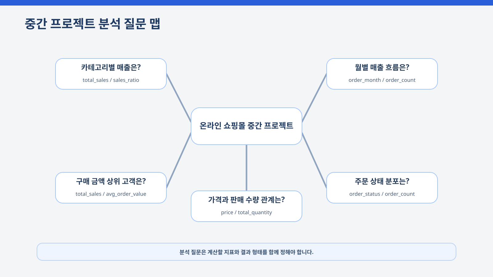

# 8장. 작은 데이터 분석 프로젝트 완성하기

지금까지는 데이터 분석의 각 단계를 나누어 살펴보았습니다. 데이터를 불러오고 구조를 확인하고, pandas로 집계하고, 전처리하고, EDA 질문을 만들고, 시각화까지 진행했습니다. 이 장에서는 이 과정을 하나의 재현 가능한 프로젝트로 연결합니다.

온라인 쇼핑몰의 고객, 상품, 주문, 주문 상세 데이터를 사용해 기본 운영 현황을 분석합니다. 복잡한 머신러닝 모델을 만드는 것이 목표는 아닙니다. **질문 설정 → 데이터 점검 → 전처리 → 안전한 병합 → 완료 주문 기준 집계 → 시각화 → 해석 → 보고서 작성 → 검증**의 흐름을 완성하는 것이 핵심입니다.

<figure class="figure">
  
  <figcaption>그림 8-1. 중간 프로젝트 전체 흐름도</figcaption>
</figure>

## 1. 프로젝트 목표와 분석 기준

이번 프로젝트에서는 다음 질문에 답합니다.

| 분석 질문 | 주요 지표 | 결과 형태 |
| --- | --- | --- |
| 카테고리별 완료 주문 매출은 어떻게 다른가? | 판매 수량, 매출, 매출 비중 | 집계표, 막대그래프 |
| 월별 완료 주문 매출과 주문 수는 어떻게 변하는가? | 월별 매출, 주문 수, 평균 주문 금액 | 집계표, 선그래프 |
| 완료 주문 기준 구매 금액 상위 고객은 누구인가? | 총 구매 금액, 주문 횟수, 평균 주문 금액 | 익명화된 집계표, 막대그래프 |
| 주문 상태별 주문 수는 어떻게 분포하는가? | 상태별 주문 수와 비율 | 요약표 |

이 장에서 **매출**은 별도 설명이 없는 한 `order_status == "completed"`인 주문의 금액을 뜻합니다. 취소 또는 환불 주문을 포함한 금액은 확정 매출과 구분해 **전체 주문 상세 금액**으로 표현합니다.

현재 데이터만으로 고객 만족도, 광고 효과, 재고 부족, 이탈 이유를 단정할 수는 없습니다. 분석 질문은 현재 데이터로 계산할 수 있는 지표와 연결되어야 합니다.

## 2. 재현 가능한 분석 파이프라인

프로젝트형 분석은 다음 단계를 하나의 흐름으로 연결합니다.

| 단계 | 수행 내용 | 주요 산출물 |
| --- | --- | --- |
| 질문 정리 | 현재 데이터로 답할 질문을 정함 | 분석 질문 목록 |
| 데이터 확인 | 파일, 컬럼, 타입, 결측치, 중복 확인 | 데이터 구조 요약 |
| 전처리 | 원본을 보존하고 분석 가능한 형태로 정리 | clean CSV |
| 관계 점검 | 기본키 중복과 외래키 미매칭 확인 | 관계 점검표 |
| 안전한 병합 | `validate`, `indicator`로 병합 검증 | 분석용 DataFrame |
| 지표 계산 | 완료 주문 기준 집계 | 결과 CSV |
| 시각화 | 질문에 맞는 그래프 생성 | PNG 이미지 |
| 해석 | 관찰, 한계, 다음 질문 정리 | 해석 메모 |
| 보고서 | 분석 흐름과 결과를 문서화 | Markdown 보고서 |
| 최종 검증 | 산출물 존재와 개인정보 노출 점검 | 제출 체크리스트 |

<figure class="figure">
  
  <figcaption>그림 8-2. 중간 프로젝트 분석 파이프라인</figcaption>
</figure>

재현 가능성을 높이려면 실행 위치, 전처리 기준, 병합 관계, 매출 정의, 저장 파일명을 명확히 해야 합니다. Notebook 화면에서 결과를 확인하고 끝내지 말고 주요 표와 그래프를 파일로 남깁니다.

## 3. 보고서는 코드의 설명서가 아니다

분석 보고서는 코드를 줄 단위로 설명하는 문서가 아닙니다. 읽는 사람이 분석 목적, 데이터, 처리 기준, 주요 결과, 해석, 한계를 이해할 수 있도록 정리해야 합니다.

| 섹션 | 포함 내용 |
| --- | --- |
| 분석 목적 | 무엇을 확인하려는지 설명 |
| 데이터 개요 | 사용 파일, 행·열 수, 주요 컬럼 |
| 분석 기준 | 완료 주문만 매출에 포함한다는 기준 |
| 전처리 내용 | 결측치, 중복, 타입 변환, 이상값 처리 |
| 관계와 병합 검증 | 키 중복, 미매칭, 병합 전후 행 수 |
| 주요 결과 | 표와 그래프 |
| 결과 해석 | 관찰과 추가 확인 사항 |
| 한계점 | 현재 데이터로 알 수 없는 내용 |
| 다음 단계 | 후속 분석 또는 개선 방향 |

<figure class="figure">
  
  <figcaption>그림 8-3. 중간 프로젝트 보고서 구조</figcaption>
</figure>

“전자기기 완료 주문 매출이 가장 높다”는 관찰입니다. “광고 효과 때문에 높다”는 광고 데이터가 있어야 검증할 수 있는 가설입니다. 관찰과 원인을 구분해 작성합니다.

## 4. 분석 질문과 지표 연결하기

분석 질문은 계산 가능한 지표와 연결되어야 합니다. 질문이 모호하면 필요한 데이터와 분석 코드도 모호해집니다.

<figure class="figure">
  
  <figcaption>그림 8-4. 중간 프로젝트 분석 질문 맵</figcaption>
</figure>

예를 들어 “매출이 높은 카테고리는 무엇인가?”라는 질문은 `category`, `quantity`, `line_total`이 필요합니다. “인기 있는 카테고리는 무엇인가?”라는 질문은 매출뿐 아니라 판매 수량, 구매 고객 수, 반복 구매 여부를 함께 정의해야 합니다.

## 5. 프로젝트 작업 공간 준비하기

전체 실습은 `notebooks/ch08_midterm_project.ipynb`에서 진행하며, 전체 파이프라인은 `python scripts/run_midterm_project.py`로 다시 실행할 수 있습니다.

현재 작업 폴더가 프로젝트 루트 또는 `notebooks` 폴더일 수 있으므로 상위 폴더를 탐색합니다.

```python
from pathlib import Path


def find_project_root(start_path):
    start_path = Path(start_path).resolve()

    for candidate in [start_path, *start_path.parents]:
        if (
            (candidate / "requirements.txt").exists()
            and (candidate / "scripts").exists()
        ):
            return candidate

    raise FileNotFoundError(
        "프로젝트 루트 폴더를 찾을 수 없습니다."
    )


PROJECT_ROOT = find_project_root(Path.cwd())
RAW_DIR = PROJECT_ROOT / "data" / "raw"
PROCESSED_DIR = PROJECT_ROOT / "data" / "processed"
REPORT_DIR = PROJECT_ROOT / "reports"
FIGURE_DIR = REPORT_DIR / "figures"

for path in [PROCESSED_DIR, REPORT_DIR, FIGURE_DIR]:
    path.mkdir(parents=True, exist_ok=True)
```

필요한 패키지는 개별 설치보다 저장소 기준으로 한 번에 설치합니다.

```powershell
python -m pip install -r requirements.txt
```

## 6. 원본 데이터와 필수 컬럼 확인하기

필요한 파일이 모두 존재하는지 확인한 뒤 불러옵니다.

```python
import pandas as pd

required_files = [
    "customers.csv",
    "products.csv",
    "orders.csv",
    "order_items.csv",
]

missing_files = [
    filename
    for filename in required_files
    if not (RAW_DIR / filename).exists()
]

if missing_files:
    raise FileNotFoundError(
        "필요한 파일이 없습니다: "
        + ", ".join(missing_files)
        + ". 프로젝트 루트에서 "
        + "python scripts/generate_sample_data.py를 실행하세요."
    )

customers = pd.read_csv(RAW_DIR / "customers.csv")
products = pd.read_csv(RAW_DIR / "products.csv")
orders = pd.read_csv(RAW_DIR / "orders.csv")
order_items = pd.read_csv(RAW_DIR / "order_items.csv")
```

이번 프로젝트에서 필요한 컬럼도 확인합니다.

```python
datasets = {
    "customers": customers,
    "products": products,
    "orders": orders,
    "order_items": order_items,
}

required_columns = {
    "customers": ["customer_id", "age", "city"],
    "products": [
        "product_id",
        "product_name",
        "category",
        "price",
    ],
    "orders": [
        "order_id",
        "customer_id",
        "order_date",
        "order_status",
    ],
    "order_items": [
        "order_item_id",
        "order_id",
        "product_id",
        "quantity",
        "unit_price",
    ],
}

for name, columns in required_columns.items():
    missing = [
        column
        for column in columns
        if column not in datasets[name].columns
    ]
    if missing:
        raise KeyError(
            f"{name}에 필요한 컬럼이 없습니다: {missing}"
        )
```

행·열 수, 결측치, 전체 행 중복을 보고서용 표로 저장합니다.

```python
dataset_summary = pd.DataFrame([
    {
        "dataset": name,
        "rows": df.shape[0],
        "columns": df.shape[1],
        "missing_values": int(df.isna().sum().sum()),
        "duplicated_rows": int(df.duplicated().sum()),
    }
    for name, df in datasets.items()
])
```

## 7. 원본을 보존하며 전처리하기

전처리는 원본 DataFrame을 직접 수정하지 않고 복사본을 사용합니다. 이 저장소에서는 `src.preprocessing`의 공통 함수를 이용할 수 있습니다.

```python
from src.preprocessing import (
    compare_shapes,
    preprocess_sales_data,
    save_processed_data,
    validate_relationships,
)

processed_data = preprocess_sales_data(datasets)
save_processed_data(processed_data, PROCESSED_DIR)

preprocessing_comparison = compare_shapes(
    datasets,
    processed_data,
)
relationship_checks = validate_relationships(
    processed_data,
)
```

전처리 과정에서는 다음 항목을 확인합니다.

- 숫자형 변환 실패 건수
- 날짜형 변환 실패 건수
- 가격·수량·단가가 0 이하인 행
- 전체 행 중복과 주요 키 중복
- 전처리 전후 행 수 변화
- 파일 간 외래키 미매칭

단순히 `errors="coerce"`를 사용하고 끝내지 말고, 변환 실패로 생긴 결측치의 개수와 처리 기준을 기록해야 합니다.

## 8. 키 중복과 병합 검증하기

관계형 데이터에서는 전체 행 중복뿐 아니라 식별 키 중복을 확인해야 합니다.

```python
from src.midterm_project import build_key_duplicate_checks

key_duplicate_checks = build_key_duplicate_checks(
    processed_data
)
```

`left merge`라고 해서 왼쪽 행 수가 자동으로 유지되는 것은 아닙니다. 오른쪽 키가 중복되어 있으면 왼쪽 한 행이 여러 행으로 늘어날 수 있습니다.

```python
order_sales = processed_data["order_items"].merge(
    processed_data["orders"][
        [
            "order_id",
            "customer_id",
            "order_date",
            "order_status",
        ]
    ],
    on="order_id",
    how="left",
    validate="many_to_one",
    indicator=True,
)

print(order_sales["_merge"].value_counts())
```

- `validate="many_to_one"`은 주문 상세의 `order_id`는 여러 번 나올 수 있지만 주문 테이블의 `order_id`는 한 번만 나와야 한다는 의미입니다.
- `indicator=True`는 각 행이 양쪽 데이터에서 매칭되었는지 확인할 수 있는 `_merge` 컬럼을 추가합니다.
- 병합 전후 행 수와 `left_only` 건수를 함께 확인합니다.

## 9. 완료 주문 기준 분석 데이터 만들기

주문 상세 금액을 만든 뒤 주문 상태를 연결합니다.

```python
order_items_clean = processed_data["order_items"].copy()

if "line_total" not in order_items_clean.columns:
    order_items_clean["line_total"] = (
        order_items_clean["quantity"]
        * order_items_clean["unit_price"]
    )
```

완료 주문만 분석 대상으로 선택합니다.

```python
order_sales = order_items_clean.merge(
    processed_data["orders"][
        [
            "order_id",
            "customer_id",
            "order_date",
            "order_month",
            "order_status",
        ]
    ],
    on="order_id",
    how="left",
    validate="many_to_one",
)

completed_order_sales = order_sales[
    order_sales["order_status"] == "completed"
].copy()
```

전체 주문 상세 금액과 완료 주문 매출을 구분해 비교합니다.

```python
amount_scope_summary = pd.DataFrame({
    "scope": [
        "전체 주문 상세 금액",
        "완료 주문 매출",
        "취소·환불 등 제외 금액",
    ],
    "amount": [
        order_sales["line_total"].sum(),
        completed_order_sales["line_total"].sum(),
        (
            order_sales["line_total"].sum()
            - completed_order_sales["line_total"].sum()
        ),
    ],
})
```

## 10. 주요 지표 계산하기

공통 분석 함수로 완료 주문 기준 결과표를 생성합니다.

```python
from src.midterm_project import build_analysis_tables

analysis_tables = build_analysis_tables(processed_data)

category_sales = analysis_tables["category_sales"]
monthly_sales = analysis_tables["monthly_sales"]
customer_sales = analysis_tables["customer_sales"]
order_status_summary = analysis_tables[
    "order_status_summary"
]
```

### 카테고리별 완료 주문 매출

```python
category_sales
```

카테고리 매출이 높은 이유가 판매 수량 때문인지 평균 단가 때문인지는 이 표만으로 알 수 없습니다. 판매 수량과 가격 수준을 함께 확인합니다.

### 월별 완료 주문 매출

```python
monthly_sales
```

`order_count`는 주문 상세 행 수가 아니라 고유한 주문 건수입니다. 월별 매출 변화가 주문 수 변화 때문인지 평균 주문 금액 변화 때문인지 구분합니다.

### 고객별 완료 주문 구매 금액

```python
customer_sales[
    [
        "customer_label",
        "city",
        "order_count",
        "total_sales",
        "avg_order_value",
    ]
].head(10)
```

고객 이름은 결과 CSV와 보고서에 포함하지 않습니다. `customer_id` 기반 익명화 라벨을 사용하고, 원본 고객 정보를 외부 LLM에 전달하지 않습니다.

### 주문 상태별 주문 수

```python
order_status_summary
```

주문 상태 분포는 전체 주문을 대상으로 계산합니다. 매출표의 완료 주문 기준과 분석 범위가 다르다는 점을 보고서에 명시합니다.

## 11. 결과 합계 일치 검증하기

카테고리별, 월별, 고객별 매출은 모두 같은 완료 주문 상세 데이터를 사용하므로 합계가 일치해야 합니다.

```python
completed_total = analysis_tables[
    "completed_order_sales"
]["line_total"].sum()

category_total = category_sales["total_sales"].sum()
monthly_total = monthly_sales["total_sales"].sum()
customer_total = customer_sales["total_sales"].sum()

assert (
    completed_total
    == category_total
    == monthly_total
    == customer_total
)
```

합계가 다르면 필터링 범위, 병합 누락, 중복 키, 그룹화 기준을 다시 확인합니다.

## 12. 시각화와 해석 메모 만들기

그래프 제목에도 완료 주문 기준임을 표시합니다.

```python
from src.midterm_project import (
    build_interpretation_notes,
    create_project_figures,
)

interpretation_notes = build_interpretation_notes()

create_project_figures(
    analysis_tables,
    FIGURE_DIR,
    show=True,
)
```

해석은 다음 세 부분으로 나누어 작성합니다.

| 구분 | 작성 내용 |
| --- | --- |
| 관찰 | 데이터와 그래프에서 직접 확인한 사실 |
| 주의점 | 현재 결과만으로 단정할 수 없는 내용 |
| 다음 질문 | 추가로 확인할 지표나 데이터 |

예를 들어 “특정 월의 매출이 증가했다”는 관찰이지만, “프로모션 때문에 증가했다”는 현재 데이터만으로 확인할 수 없는 가설입니다.

## 13. 결과 파일과 보고서 저장하기

결과표와 보고서는 공통 함수를 사용해 저장합니다.

```python
from src.midterm_project import (
    build_midterm_report,
    save_project_tables,
)

saved_tables = save_project_tables(
    dataset_summary,
    preprocessing_comparison,
    key_duplicate_checks,
    relationship_checks,
    analysis_tables,
    interpretation_notes,
    REPORT_DIR,
)

report_text = build_midterm_report(
    dataset_summary,
    preprocessing_comparison,
    key_duplicate_checks,
    relationship_checks,
    analysis_tables,
    interpretation_notes,
)

report_path = REPORT_DIR / "ch08_midterm_report.md"
report_path.write_text(report_text, encoding="utf-8")
```

보고서에는 다음 기준을 명시합니다.

- 매출은 완료 주문만 포함
- 취소·환불 주문을 포함한 금액과 완료 주문 매출을 구분
- 키 중복, 외래키 미매칭, 병합 전후 행 수 확인
- 고객 이름을 제외하고 익명화 라벨 사용
- 관찰과 원인 가설을 구분
- Notebook, CSV, 그래프, 보고서의 수치 일치 확인

## 14. LLM은 검토 파트너로 활용하기

LLM에는 실제 고객명이나 원본 행을 전달하지 않고 구조와 요약 결과만 제공합니다.

```text
온라인 쇼핑몰 중간 프로젝트 결과를 검토해 주세요.

분석 기준:
- 매출은 order_status가 completed인 주문만 포함
- 고객 이름은 제외하고 익명화 라벨 사용
- 병합은 validate와 indicator로 검증

검토 항목:
1. 분석 질문과 지표가 연결되어 있는가?
2. 취소·환불 주문이 매출에 포함되지 않았는가?
3. 병합 후 행 증가 또는 미매칭을 확인했는가?
4. 관찰과 원인 가설을 구분했는가?
5. 개인정보가 불필요하게 노출되지 않았는가?
6. Notebook, CSV, 그래프, 보고서의 수치가 일치하는가?

데이터에 없는 원인은 단정하지 말고,
필수 수정과 권장 개선을 구분해 주세요.
```

LLM의 제안은 실제 컬럼, 값의 종류, 집계 기준, 실행 결과와 비교해 검증합니다.

## 15. 제출물과 최종 검증

최종 산출물은 다음과 같습니다.

- `notebooks/ch08_midterm_project.ipynb`
- `data/processed/customers_clean.csv`
- `data/processed/products_clean.csv`
- `data/processed/orders_clean.csv`
- `data/processed/order_items_clean.csv`
- `reports/ch08_midterm_report.md`
- `reports/ch08_dataset_summary.csv`
- `reports/ch08_preprocessing_comparison.csv`
- `reports/ch08_key_duplicate_checks.csv`
- `reports/ch08_relationship_checks.csv`
- `reports/ch08_merge_checks.csv`
- `reports/ch08_amount_scope_summary.csv`
- `reports/ch08_category_sales.csv`
- `reports/ch08_monthly_sales.csv`
- `reports/ch08_customer_sales.csv`
- `reports/ch08_order_status_summary.csv`
- `reports/figures/ch08_category_sales.png`
- `reports/figures/ch08_monthly_sales.png`
- `reports/figures/ch08_top_customers.png`

<figure class="figure">
  
  <figcaption>그림 8-5. 중간 프로젝트 산출물 구성</figcaption>
</figure>

제출 전에는 다음을 확인합니다.

| 검증 항목 | 확인 기준 |
| --- | --- |
| 실행 가능성 | 위에서부터 다시 실행해 오류 없이 완료됨 |
| 매출 기준 | 완료 주문만 카테고리·월별·고객별 매출에 포함 |
| 병합 검증 | 키 중복, 미매칭, 병합 전후 행 수 확인 |
| 개인정보 | 고객 이름·이메일 등 불필요한 정보가 결과에 없음 |
| 결과 일치 | Notebook, CSV, 그래프, 보고서의 수치가 일치 |
| 해석 품질 | 관찰과 원인 가설이 구분됨 |
| 재현성 | 샘플 데이터 생성부터 전체 실행 순서가 기록됨 |
| 산출물 | 필수 파일이 모두 존재하고 비어 있지 않음 |

전체 파이프라인은 프로젝트 루트에서 다음 명령으로 확인할 수 있습니다.

```powershell
python scripts/generate_sample_data.py
python scripts/run_midterm_project.py
```

## 16. 다음 장으로 이어지는 흐름

중간 프로젝트까지는 데이터를 불러오고, 전처리하고, 안전하게 병합하고, 질문에 맞는 지표를 계산하고, 시각화와 보고서로 정리하는 기본 흐름을 다루었습니다.

다음 장부터는 머신러닝으로 확장합니다. 그러나 머신러닝도 좋은 데이터, 명확한 목표 변수, 적절한 평가 기준에서 출발합니다. 이번 프로젝트에서 익힌 원본 보존, 데이터 품질 점검, 완료 주문 기준, 병합 검증, 결과 해석 습관은 이후 모델링에서도 그대로 이어집니다.
