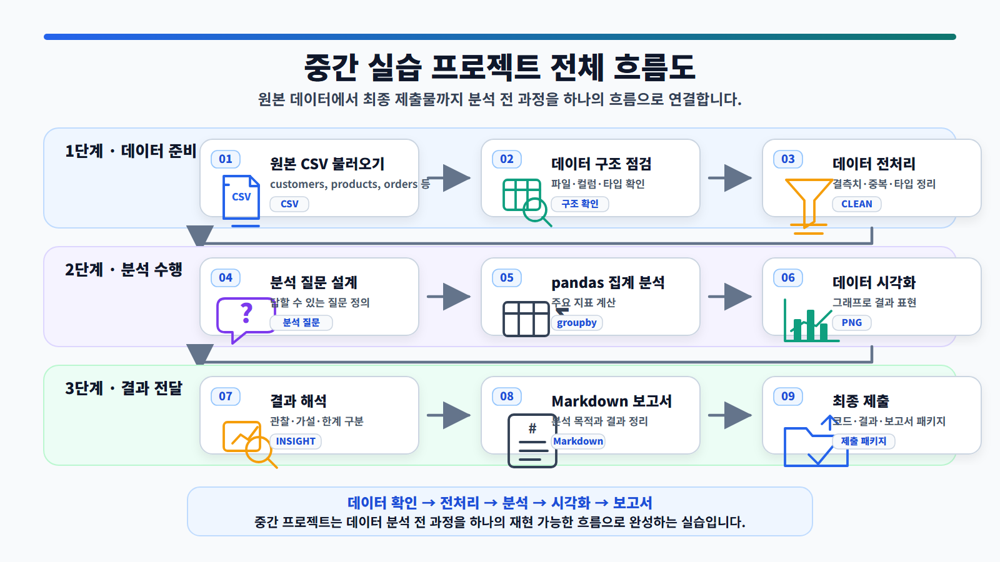
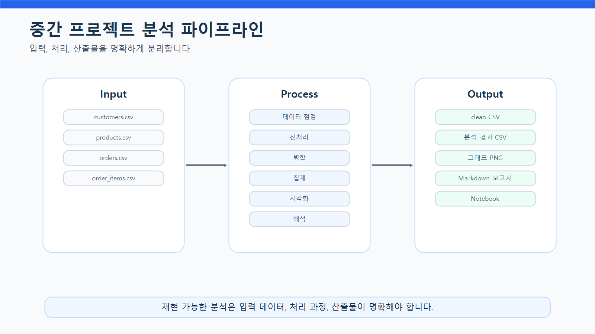
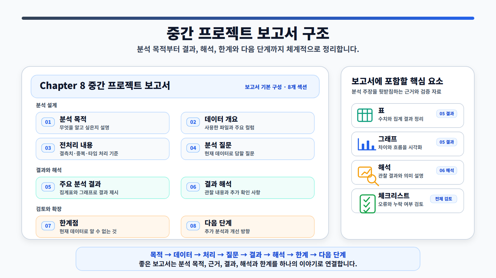
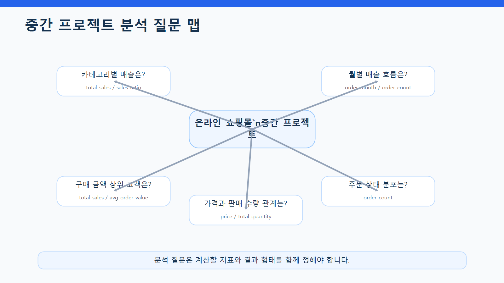
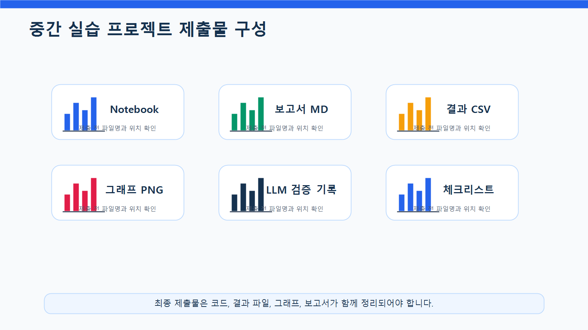

# 8장 중간 실습 프로젝트

이 장에서는 Chapter 3부터 Chapter 7까지 학습한 내용을 하나의 실습 프로젝트로 통합합니다. 지금까지 데이터 불러오기, 구조 파악, pandas 기본 분석, 데이터 전처리, EDA, 데이터 시각화를 각각 따로 연습했다면, 이번 장에서는 이 과정을 하나의 분석 흐름으로 연결합니다.

중간 실습 프로젝트의 목표는 복잡한 모델을 만드는 것이 아닙니다. 실제 데이터 분석 업무처럼 원본 데이터를 확인하고, 전처리하고, 분석 질문을 만들고, pandas로 지표를 계산하고, 그래프로 시각화한 뒤, 최종 보고서 형태로 정리하는 것입니다.

이번 프로젝트에서는 온라인 쇼핑몰 운영 데이터를 사용해 고객, 상품, 주문, 매출 관점의 기본 현황을 분석합니다. 학습자는 Notebook 코드, 분석 결과 CSV, 시각화 이미지, Markdown 보고서를 함께 제출합니다.

이번 장의 핵심은 **분석 전 과정을 하나의 재현 가능한 프로젝트로 완성하는 능력**입니다.

## 수업 시간 구성

| 구성              | 권장 시간 |
| --------------- | ----: |
| 프로젝트 목표와 제출물 안내 |   30분 |
| 데이터 구조 재확인      |   30분 |
| 전처리 코드 작성       |   50분 |
| 분석 질문 설계        |   40분 |
| pandas 집계 분석    |   60분 |
| 시각화 작성          |   50분 |
| 결과 해석과 보고서 작성   |   60분 |
| LLM 활용 검토 및 보완  |   30분 |
| 최종 제출물 정리       |   40분 |

기본 수업은 약 6시간 30분을 기준으로 구성되어 있습니다. 개인별 프로젝트 수행과 피드백까지 포함하면 1~2회차 프로젝트 수업으로 확장할 수 있습니다.

## 1. 학습 목표

이 장을 마치면 학습자는 다음을 할 수 있습니다.

* 데이터 분석 프로젝트의 전체 흐름을 설명할 수 있습니다.
* 원본 데이터를 불러오고 구조를 점검할 수 있습니다.
* 결측치, 중복값, 데이터 타입, 이상값을 확인하고 처리할 수 있습니다.
* 분석 질문을 직접 정의할 수 있습니다.
* 분석 질문을 pandas 집계 코드로 연결할 수 있습니다.
* 고객, 상품, 주문, 매출 관점의 기본 지표를 계산할 수 있습니다.
* 분석 결과를 그래프로 시각화할 수 있습니다.
* 시각화 결과를 보고서 문장으로 해석할 수 있습니다.
* LLM이 제안한 코드와 해석을 검증할 수 있습니다.
* Notebook, CSV, 이미지, Markdown 보고서를 하나의 프로젝트 산출물로 정리할 수 있습니다.

## 2. 이번 장에서 만들 결과물

이번 장에서는 중간 실습 프로젝트 산출물을 만듭니다.

제출해야 할 결과물은 다음과 같습니다.

* `notebooks/ch08_midterm_project.ipynb`
* `reports/ch08_midterm_report.md`
* `reports/ch08_dataset_summary.csv`
* `reports/ch08_category_sales.csv`
* `reports/ch08_monthly_sales.csv`
* `reports/ch08_customer_sales.csv`
* `reports/figures/ch08_category_sales.png`
* `reports/figures/ch08_monthly_sales.png`
* `reports/figures/ch08_top_customers.png`
* 프로젝트 수행 체크리스트
* LLM 활용 내역과 검증 결과

아래 그림은 중간 실습 프로젝트의 전체 흐름을 보여줍니다.

<figure class="figure">
  
  <figcaption>그림 8-1. 중간 실습 프로젝트 전체 흐름도</figcaption>
</figure>

## 3. 핵심 개념

### 3.1 프로젝트형 데이터 분석이란 무엇인가

프로젝트형 데이터 분석은 단순히 개별 코드를 실행하는 것이 아니라, 분석 목적에 맞게 데이터 처리 과정을 처음부터 끝까지 구성하는 방식입니다.

프로젝트형 분석에는 다음 단계가 포함됩니다.

| 단계     | 설명                 | 산출물          |
| ------ | ------------------ | ------------ |
| 문제 정의  | 무엇을 분석할지 정함        | 분석 질문        |
| 데이터 확인 | 파일, 컬럼, 타입, 결측치 확인 | 데이터 구조 요약    |
| 전처리    | 분석 가능한 형태로 데이터 정리  | clean 데이터    |
| 분석     | 질문에 필요한 지표 계산      | 집계표          |
| 시각화    | 결과를 그래프로 표현        | 이미지 파일       |
| 해석     | 결과의 의미와 한계 설명      | 해석 문장        |
| 보고서    | 전체 과정을 문서화         | Markdown 보고서 |
| 검증     | 코드와 해석의 오류 확인      | 체크리스트        |

중요한 것은 각 단계를 분리해서 생각하면서도, 최종적으로는 하나의 흐름으로 연결하는 것입니다.

### 3.2 좋은 프로젝트 질문의 조건

중간 프로젝트에서 가장 중요한 것은 분석 질문입니다. 좋은 질문이 있어야 필요한 데이터와 코드, 그래프가 결정됩니다.

좋은 프로젝트 질문은 다음 조건을 만족해야 합니다.

* 현재 데이터로 답할 수 있어야 합니다.
* 계산 가능한 지표로 바꿀 수 있어야 합니다.
* 분석 결과가 표나 그래프로 표현 가능해야 합니다.
* 결과 해석이 실무적 의미를 가질 수 있어야 합니다.
* 데이터에 없는 내용을 억지로 추측하지 않아야 합니다.

예를 들어 다음 질문은 현재 데이터로 분석하기 좋습니다.

* 카테고리별 매출은 어떻게 다른가?
* 월별 매출과 주문 수는 어떻게 변하는가?
* 구매 금액 상위 고객은 누구인가?
* 주문 상태별 주문 수는 어떻게 분포하는가?
* 상품 가격과 판매 수량 사이에 관계가 있는가?

반대로 다음 질문은 현재 데이터만으로 답하기 어렵습니다.

* 고객이 왜 이탈했는가?
* 고객 만족도는 어떤가?
* 광고가 매출에 어떤 영향을 주었는가?
* 재구매 의도는 높은가?

이런 질문은 관련 데이터가 추가로 있어야 분석할 수 있습니다.

### 3.3 분석 파이프라인이란 무엇인가

분석 파이프라인은 데이터가 입력되어 결과 보고서가 나오기까지의 처리 흐름입니다.

이번 프로젝트에서는 다음 파이프라인을 사용합니다.

1. 원본 데이터 불러오기
2. 데이터 구조 확인
3. 전처리 수행
4. 분석용 데이터 병합
5. 주요 지표 계산
6. 시각화 생성
7. 결과 저장
8. 보고서 작성
9. LLM 검토
10. 최종 제출

아래 그림은 이번 프로젝트에서 사용할 분석 파이프라인을 보여줍니다.

<figure class="figure">
  
  <figcaption>그림 8-2. 중간 프로젝트 분석 파이프라인</figcaption>
</figure>

### 3.4 재현 가능한 분석이란 무엇인가

재현 가능한 분석은 다른 사람이 같은 코드를 실행했을 때 같은 결과를 얻을 수 있는 분석입니다.

재현 가능한 분석을 위해서는 다음을 지켜야 합니다.

* 파일 경로를 명확히 작성합니다.
* 원본 데이터와 결과 데이터를 분리합니다.
* 코드 실행 순서를 Notebook에 정리합니다.
* 중간 결과를 변수명으로 명확히 저장합니다.
* 결과 CSV와 이미지 파일을 저장합니다.
* 보고서에 전처리 기준과 분석 기준을 기록합니다.
* LLM이 만든 코드는 검증 후 사용합니다.

재현 가능성이 낮으면 보고서 결과를 신뢰하기 어렵습니다.

### 3.5 프로젝트 보고서 구조

중간 프로젝트 보고서는 단순한 코드 설명이 아니라 분석 목적, 방법, 결과, 해석, 한계를 정리하는 문서입니다.

이번 장에서는 다음 구조를 사용합니다.

| 섹션       | 포함 내용              |
| -------- | ------------------ |
| 분석 목적    | 무엇을 분석하려는지 설명      |
| 데이터 개요   | 사용한 파일과 주요 컬럼      |
| 전처리 내용   | 결측치, 중복, 타입 변환 등   |
| 분석 질문    | 이번 프로젝트에서 답할 질문    |
| 주요 분석 결과 | 표와 그래프 중심 결과       |
| 결과 해석    | 관찰 내용과 추가 확인 필요 사항 |
| 한계점      | 현재 데이터로 알 수 없는 것   |
| 다음 단계    | 추가 분석 또는 개선 방향     |

아래 그림은 중간 프로젝트 보고서의 기본 구조를 보여줍니다.

<figure class="figure">
  
  <figcaption>그림 8-3. 중간 프로젝트 보고서 구조</figcaption>
</figure>

## 4. 프로젝트 시나리오

이번 장의 프로젝트 시나리오는 다음과 같습니다.

> 온라인 쇼핑몰 운영자가 최근 주문 데이터를 바탕으로 기본 매출 현황과 고객 구매 패턴을 파악하려고 합니다. 운영자는 어떤 카테고리가 매출에 많이 기여하는지, 월별 매출 흐름은 어떤지, 구매 금액이 높은 고객은 누구인지, 주문 상태는 어떻게 분포하는지 알고 싶어 합니다. 학습자는 데이터 분석가로서 원본 데이터를 점검하고, 전처리하고, 주요 지표와 그래프를 만들어 간단한 분석 보고서를 작성해야 합니다.

이번 프로젝트의 핵심 분석 질문은 다음과 같습니다.

| 번호 | 분석 질문                   | 주요 지표                                           | 결과 형태       |
|---:|---|---|---|
|  1 | 카테고리별 매출은 어떻게 다른가?      | `total_sales`, `sales_ratio`                    | 표, 막대그래프    |
|  2 | 월별 매출과 주문 수는 어떻게 변하는가?  | `total_sales`, `order_count`                    | 표, 선 그래프    |
|  3 | 구매 금액 상위 고객은 누구인가?      | `total_sales`, `order_count`, `avg_order_value` | 표, 가로 막대그래프 |
|  4 | 주문 상태별 주문 수는 어떻게 분포하는가? | `order_count`                                   | 표           |
|  5 | 상품 가격과 판매 수량은 관계가 있는가?  | `price`, `total_quantity`                       | 산점도         |

아래 그림은 프로젝트에서 다룰 핵심 분석 질문을 한 화면에 요약한 것입니다.

<figure class="figure">
  
  <figcaption>그림 8-4. 중간 프로젝트 분석 질문 맵</figcaption>
</figure>

## 5. 실습 코드

이번 장의 전체 실습은 다음 Notebook에서 진행합니다.

```text
notebooks/ch08_midterm_project.ipynb
```

본문에는 핵심 코드만 제공합니다.

### 5.1 기본 패키지 불러오기

```python
from pathlib import Path
import pandas as pd
import matplotlib.pyplot as plt
```

한글 폰트와 실행 경로를 설정합니다. 프로젝트 루트에서 실행하는 경우와 `notebooks` 폴더 안에서 실행하는 경우에는 상대 경로가 달라질 수 있습니다. 초보자는 두 경로 예시를 모두 실행하지 말고, 아래처럼 현재 실행 위치를 기준으로 `base_dir`를 자동으로 정한 뒤 사용하는 것이 안전합니다.

```python
plt.rcParams["font.family"] = "Malgun Gothic"
plt.rcParams["axes.unicode_minus"] = False
```

현재 실행 위치를 기준으로 프로젝트 기준 폴더를 찾습니다.

```python
current_dir = Path.cwd()

if current_dir.name == "notebooks":
    base_dir = current_dir.parent
else:
    base_dir = current_dir
```

작업 경로를 자동으로 설정합니다.

```python
raw_dir = base_dir / "data" / "raw"
processed_dir = base_dir / "data" / "processed"
report_dir = base_dir / "reports"
figure_dir = report_dir / "figures"

processed_dir.mkdir(parents=True, exist_ok=True)
report_dir.mkdir(parents=True, exist_ok=True)
figure_dir.mkdir(parents=True, exist_ok=True)
```

설정된 경로는 `print(raw_dir)`, `print(processed_dir)`, `print(report_dir)`, `print(figure_dir)`처럼 필요할 때 각각 확인할 수 있습니다.

이 코드를 사용하면 노트북을 프로젝트 루트에서 실행하든 `notebooks` 폴더에서 실행하든 같은 방식으로 동작합니다.

`to_markdown()`을 사용하려면 환경에 따라 `tabulate` 패키지가 필요할 수 있습니다. 오류가 발생하면 터미널 또는 노트북에서 `pip install tabulate`를 실행하세요.

### 5.2 원본 데이터 불러오기

```python
customers = pd.read_csv(raw_dir / "customers.csv")
products = pd.read_csv(raw_dir / "products.csv")
orders = pd.read_csv(raw_dir / "orders.csv")
order_items = pd.read_csv(raw_dir / "order_items.csv")
```

데이터 크기를 확인합니다.

```python
dataset_summary = pd.DataFrame({
    "dataset": ["customers", "products", "orders", "order_items"],
    "rows": [customers.shape[0], products.shape[0], orders.shape[0], order_items.shape[0]],
    "columns": [customers.shape[1], products.shape[1], orders.shape[1], order_items.shape[1]]
})

dataset_summary
```

데이터 개요를 저장합니다.

```python
dataset_summary.to_csv(report_dir / "ch08_dataset_summary.csv", index=False)
```

### 5.3 데이터 구조 점검하기

```python
datasets = {
    "customers": customers,
    "products": products,
    "orders": orders,
    "order_items": order_items
}

for name, df in datasets.items():
    print(f"\n===== {name} =====")
    print("shape:", df.shape)
    print("columns:", list(df.columns))
    print("missing values:", df.isna().sum().sum())
    print("duplicated rows:", df.duplicated().sum())
```

이 단계에서는 분석을 시작하기 전에 데이터가 어떤 구조인지 빠르게 확인합니다.

### 5.4 전처리 함수 준비하기

문자열 컬럼의 앞뒤 공백을 제거하는 함수를 만듭니다. 결측치는 그대로 유지합니다.

```python
def strip_string_columns(df):
    df = df.copy()
    string_columns = df.select_dtypes(include="object").columns
    
    for col in string_columns:
        df[col] = df[col].where(
            df[col].isna(),
            df[col].astype(str).str.strip()
        )
    
    return df
```

문자열 숫자를 숫자형으로 변환하는 함수를 만듭니다.

```python
def to_number(series):
    return pd.to_numeric(
        series.astype(str).str.replace(",", "", regex=False),
        errors="coerce"
    )
```

### 5.5 고객 데이터 전처리

```python
customers_clean = customers.copy()
customers_clean = strip_string_columns(customers_clean)

if "age" in customers_clean.columns:
    customers_clean["age"] = pd.to_numeric(customers_clean["age"], errors="coerce")
    customers_clean["age"] = customers_clean["age"].fillna(customers_clean["age"].median())

if "city" in customers_clean.columns:
    customers_clean["city"] = customers_clean["city"].fillna("Unknown")

if "signup_date" in customers_clean.columns:
    customers_clean["signup_date"] = pd.to_datetime(
        customers_clean["signup_date"],
        errors="coerce"
    )

customers_clean = customers_clean.drop_duplicates()
```

### 5.6 상품 데이터 전처리

```python
products_clean = products.copy()
products_clean = strip_string_columns(products_clean)

if "price" in products_clean.columns:
    products_clean["price"] = to_number(products_clean["price"])
    products_clean = products_clean[products_clean["price"] > 0]

products_clean = products_clean.drop_duplicates()
```

### 5.7 주문 데이터 전처리

```python
orders_clean = orders.copy()
orders_clean = strip_string_columns(orders_clean)

if "order_date" in orders_clean.columns:
    orders_clean["order_date"] = pd.to_datetime(
        orders_clean["order_date"],
        errors="coerce"
    )
    orders_clean["order_month"] = orders_clean["order_date"].dt.to_period("M").astype(str)

if "order_status" in orders_clean.columns:
    status_map = {
        "complete": "completed",
        "Complete": "completed",
        "COMPLETED": "completed",
        "완료": "completed",
        "cancel": "cancelled",
        "Cancel": "cancelled",
        "CANCELLED": "cancelled",
        "취소": "cancelled"
    }
    orders_clean["order_status"] = orders_clean["order_status"].replace(status_map)

orders_clean = orders_clean.drop_duplicates()
```

### 5.8 주문 상세 데이터 전처리

```python
order_items_clean = order_items.copy()
order_items_clean = strip_string_columns(order_items_clean)

if "quantity" in order_items_clean.columns:
    order_items_clean["quantity"] = to_number(order_items_clean["quantity"])

if "unit_price" in order_items_clean.columns:
    order_items_clean["unit_price"] = to_number(order_items_clean["unit_price"])

if "quantity" in order_items_clean.columns:
    order_items_clean = order_items_clean[order_items_clean["quantity"] > 0]

if "unit_price" in order_items_clean.columns:
    order_items_clean = order_items_clean[order_items_clean["unit_price"] > 0]

if {"quantity", "unit_price"}.issubset(order_items_clean.columns):
    order_items_clean["line_total"] = (
        order_items_clean["quantity"] * order_items_clean["unit_price"]
    )

order_items_clean = order_items_clean.drop_duplicates()
```

### 5.9 전처리 결과 저장하기

```python
customers_clean.to_csv(processed_dir / "customers_clean.csv", index=False)
products_clean.to_csv(processed_dir / "products_clean.csv", index=False)
orders_clean.to_csv(processed_dir / "orders_clean.csv", index=False)
order_items_clean.to_csv(processed_dir / "order_items_clean.csv", index=False)
```

전처리 전후 데이터 크기를 비교합니다.

```python
processed_summary = pd.DataFrame({
    "dataset": ["customers", "products", "orders", "order_items"],
    "rows_processed": [
        customers_clean.shape[0],
        products_clean.shape[0],
        orders_clean.shape[0],
        order_items_clean.shape[0]
    ],
    "columns_processed": [
        customers_clean.shape[1],
        products_clean.shape[1],
        orders_clean.shape[1],
        order_items_clean.shape[1]
    ]
})

preprocessing_comparison = dataset_summary.merge(
    processed_summary,
    on="dataset"
)

preprocessing_comparison
```

### 5.10 파일 간 키 관계 확인하기

```python
invalid_customers = orders_clean[
    ~orders_clean["customer_id"].isin(customers_clean["customer_id"])
]

invalid_orders = order_items_clean[
    ~order_items_clean["order_id"].isin(orders_clean["order_id"])
]

invalid_products = order_items_clean[
    ~order_items_clean["product_id"].isin(products_clean["product_id"])
]

print("customers에 없는 customer_id 수:", len(invalid_customers))
print("orders에 없는 order_id 수:", len(invalid_orders))
print("products에 없는 product_id 수:", len(invalid_products))
```

키 관계가 깨져 있으면 병합 결과에 결측치가 생길 수 있습니다. 따라서 분석 전에 반드시 확인해야 합니다.

### 5.11 분석용 데이터 병합하기

주문 상세와 상품 데이터를 병합합니다.

```python
sales_items = order_items_clean.merge(
    products_clean,
    on="product_id",
    how="left"
)
```

병합 결과를 검증합니다.

```python
print("병합 전 order_items_clean:", order_items_clean.shape)
print("병합 후 sales_items:", sales_items.shape)
print("상품명 누락:", sales_items["product_name"].isna().sum())
print("카테고리 누락:", sales_items["category"].isna().sum())
```

주문 상세와 주문 데이터를 병합합니다.

```python
order_sales = order_items_clean.merge(
    orders_clean,
    on="order_id",
    how="left"
)
```

고객 정보까지 병합합니다.

```python
customer_sales_base = order_sales.merge(
    customers_clean,
    on="customer_id",
    how="left"
)
```

### 5.12 카테고리별 매출 분석

```python
category_sales = (
    sales_items
    .groupby("category", as_index=False)
    .agg(
        total_quantity=("quantity", "sum"),
        total_sales=("line_total", "sum")
    )
    .sort_values("total_sales", ascending=False)
)

category_sales["sales_ratio"] = (
    category_sales["total_sales"] / category_sales["total_sales"].sum() * 100
).round(2)

category_sales
```

결과를 저장합니다.

```python
category_sales.to_csv(report_dir / "ch08_category_sales.csv", index=False)
```

### 5.13 월별 매출 분석

```python
order_sales["order_date"] = pd.to_datetime(order_sales["order_date"], errors="coerce")
order_sales["order_month"] = order_sales["order_date"].dt.to_period("M").astype(str)

monthly_sales = (
    order_sales
    .groupby("order_month", as_index=False)
    .agg(
        total_sales=("line_total", "sum"),
        order_count=("order_id", "nunique")
    )
    .sort_values("order_month")
)

monthly_sales["avg_order_value"] = (
    monthly_sales["total_sales"] / monthly_sales["order_count"]
).round(0)

monthly_sales
```

결과를 저장합니다.

```python
monthly_sales.to_csv(report_dir / "ch08_monthly_sales.csv", index=False)
```

### 5.14 고객별 구매 금액 분석

```python
customer_sales = (
    customer_sales_base
    .groupby(["customer_id", "name", "city"], as_index=False)
    .agg(
        order_count=("order_id", "nunique"),
        total_sales=("line_total", "sum")
    )
    .sort_values("total_sales", ascending=False)
)

customer_sales["avg_order_value"] = (
    customer_sales["total_sales"] / customer_sales["order_count"]
).round(0)

customer_sales.head(10)
```

결과를 저장합니다.

```python
customer_sales.to_csv(report_dir / "ch08_customer_sales.csv", index=False)
```

### 5.15 주문 상태별 주문 수 분석

```python
order_status_summary = (
    orders_clean["order_status"]
    .value_counts()
    .reset_index()
)

order_status_summary.columns = ["order_status", "order_count"]
order_status_summary
```

### 5.16 카테고리별 매출 시각화

```python
plt.figure(figsize=(10, 5))

plt.bar(
    category_sales["category"],
    category_sales["total_sales"]
)

plt.title("카테고리별 매출")
plt.xlabel("카테고리")
plt.ylabel("총매출")
plt.xticks(rotation=45)
plt.tight_layout()

plt.savefig(figure_dir / "ch08_category_sales.png", dpi=150)
plt.show()
```

### 5.17 월별 매출 시각화

```python
plt.figure(figsize=(10, 5))

plt.plot(
    monthly_sales["order_month"],
    monthly_sales["total_sales"],
    marker="o"
)

plt.title("월별 매출 추이")
plt.xlabel("주문 월")
plt.ylabel("총매출")
plt.xticks(rotation=45)
plt.tight_layout()

plt.savefig(figure_dir / "ch08_monthly_sales.png", dpi=150)
plt.show()
```

### 5.18 구매 금액 상위 고객 시각화

개인정보 보호를 위해 고객명을 직접 표시하지 않고 고객 ID 기반 라벨을 사용할 수 있습니다.

```python
top_customers = customer_sales.head(10).copy()
top_customers["customer_label"] = "Customer " + top_customers["customer_id"].astype(str)
top_customers = top_customers.sort_values("total_sales")
```

```python
plt.figure(figsize=(10, 6))

plt.barh(
    top_customers["customer_label"],
    top_customers["total_sales"]
)

plt.title("구매 금액 상위 10명 고객")
plt.xlabel("총 구매 금액")
plt.ylabel("고객")
plt.tight_layout()

plt.savefig(figure_dir / "ch08_top_customers.png", dpi=150)
plt.show()
```

### 5.19 분석 결과 해석 메모 만들기

```python
interpretation_notes = pd.DataFrame({
    "analysis": [
        "카테고리별 매출",
        "월별 매출",
        "고객별 구매 금액",
        "주문 상태별 주문 수"
    ],
    "observation": [
        "매출이 높은 카테고리를 확인할 수 있습니다.",
        "시간에 따른 매출 증가와 감소 흐름을 확인할 수 있습니다.",
        "구매 금액이 높은 고객 후보를 확인할 수 있습니다.",
        "주문 상태의 분포를 확인할 수 있습니다."
    ],
    "caution": [
        "매출이 높은 이유가 판매 수량 때문인지 단가 때문인지 추가 확인이 필요합니다.",
        "매출 변화의 원인을 설명하려면 프로모션, 계절성, 주문 수 변화 확인이 필요합니다.",
        "일회성 고액 구매 고객과 반복 구매 고객을 구분해야 합니다.",
        "취소 주문이 매출 계산에 포함되었는지 확인해야 합니다."
    ]
})

interpretation_notes
```

### 5.20 중간 프로젝트 보고서 작성하기

```python
report_text = f"""
# Chapter 8 중간 실습 프로젝트 보고서

## 1. 분석 목적

온라인 쇼핑몰 고객, 상품, 주문, 주문 상세 데이터를 사용해 기본 매출 현황과 고객 구매 패턴을 분석했습니다.

## 2. 데이터 개요

{dataset_summary.to_markdown(index=False)}

## 3. 전처리 전후 비교

{preprocessing_comparison.to_markdown(index=False)}

## 4. 주요 분석 질문

1. 카테고리별 매출은 어떻게 다른가?
2. 월별 매출과 주문 수는 어떻게 변하는가?
3. 구매 금액 상위 고객은 누구인가?
4. 주문 상태별 주문 수는 어떻게 분포하는가?

## 5. 카테고리별 매출

{category_sales.to_markdown(index=False)}

## 6. 월별 매출

{monthly_sales.to_markdown(index=False)}

## 7. 구매 금액 상위 고객

{customer_sales.head(10).to_markdown(index=False)}

## 8. 해석 메모

{interpretation_notes.to_markdown(index=False)}

## 9. 한계점

- 현재 데이터만으로 고객 만족도나 이탈 이유는 분석할 수 없습니다.
- 매출 변화의 원인을 설명하려면 프로모션, 광고, 재고, 계절성 데이터가 추가로 필요합니다.
- 구매 금액 상위 고객은 주문 횟수와 평균 주문 금액을 함께 해석해야 합니다.
- 취소 주문과 환불 주문 처리 기준에 따라 매출 결과가 달라질 수 있습니다.

## 10. 다음 단계

- 카테고리별 판매 수량과 평균 단가를 함께 비교합니다.
- 월별 매출 변동 원인을 추가 데이터와 함께 분석합니다.
- 고객별 구매 금액을 기준으로 고객 세분화를 시도합니다.
- LLM을 활용해 보고서 문장을 보완하되, 데이터에 없는 원인은 단정하지 않습니다.
"""

report_path = report_dir / "ch08_midterm_report.md"
report_path.write_text(report_text, encoding="utf-8")
```

아래 그림은 최종 제출물의 구성을 보여줍니다.

<figure class="figure">
  
  <figcaption>그림 8-5. 중간 실습 프로젝트 제출물 구성</figcaption>
</figure>

## 6. LLM 활용 프롬프트

LLM은 프로젝트 수행 과정에서 코드 검토, 분석 질문 보완, 보고서 문장 작성에 도움을 줄 수 있습니다. 하지만 LLM이 만든 내용은 반드시 실제 데이터와 비교해 검증해야 합니다.

### 6.1 프로젝트 분석 질문 검토 요청

```text
당신은 데이터 분석 프로젝트 멘토입니다.

온라인 쇼핑몰 데이터로 중간 실습 프로젝트를 진행하려고 합니다.

사용 데이터:
- customers: 고객 정보
- products: 상품 정보
- orders: 주문 정보
- order_items: 주문 상세 정보

초안 분석 질문:
1. 카테고리별 매출은 어떻게 다른가?
2. 월별 매출과 주문 수는 어떻게 변하는가?
3. 구매 금액 상위 고객은 누구인가?
4. 주문 상태별 주문 수는 어떻게 분포하는가?
5. 상품 가격과 판매 수량은 관계가 있는가?

각 질문이 현재 데이터로 분석 가능한지 검토해 주세요.
각 질문에 필요한 데이터, 지표, pandas 기능을 표로 정리해 주세요.
```

### 6.2 전처리 코드 검토 요청

```text
다음 전처리 코드가 안전한지 검토해 주세요.

검토 기준:
- 원본 데이터를 직접 수정하는지
- 결측치를 "nan" 문자열로 바꾸는 문제가 있는지
- 날짜 변환 실패 건수를 확인하는지
- 숫자형 변환 실패를 확인하는지
- 이상값을 무조건 삭제하고 있지 않은지
- 전처리 전후 데이터 크기를 비교하는지
- 파일 간 키 관계를 확인하는지

초보자가 이해할 수 있도록 문제점과 개선 방향을 정리해 주세요.
```

### 6.3 분석 결과 해석 요청

```text
다음은 중간 프로젝트의 주요 분석 결과입니다.

카테고리별 매출표:
- category
- total_quantity
- total_sales
- sales_ratio

월별 매출표:
- order_month
- total_sales
- order_count
- avg_order_value

고객별 구매 금액표:
- customer_id
- city
- order_count
- total_sales
- avg_order_value

이 결과를 바탕으로 보고서 해석 문장을 작성해 주세요.

조건:
- 데이터에 없는 원인은 단정하지 말 것
- 관찰 결과와 원인 가설을 구분할 것
- 추가로 확인해야 할 분석 질문을 포함할 것
- 실무 보고서 문체로 작성할 것
```

### 6.4 보고서 초안 검토 요청

```text
다음 중간 프로젝트 보고서 초안을 검토해 주세요.

검토 기준:
1. 분석 목적이 명확한가?
2. 데이터 개요가 충분한가?
3. 전처리 기준이 설명되어 있는가?
4. 분석 질문과 결과가 연결되어 있는가?
5. 그래프 해석이 과장되지 않았는가?
6. 데이터에 없는 원인을 단정하지 않았는가?
7. 한계점과 다음 단계가 포함되어 있는가?

수정이 필요한 부분을 표로 정리하고, 더 나은 문장 예시를 제안해 주세요.
```

## 7. 결과 해석

이번 프로젝트의 결과는 최종 정답이 아니라, 데이터 기반으로 현재 쇼핑몰의 기본 현황을 파악한 1차 분석 결과입니다.

### 7.1 카테고리별 매출 해석

카테고리별 매출은 어떤 상품군이 매출에 많이 기여했는지 보여줍니다.

```text
카테고리별 매출 결과를 통해 매출 비중이 높은 상품군을 확인할 수 있습니다.
다만 매출이 높은 이유가 판매 수량 때문인지, 상품 단가 때문인지는 추가 분석이 필요합니다.
```

추가로 확인할 질문은 다음과 같습니다.

* 카테고리별 판매 수량은 어떻게 다른가?
* 카테고리별 평균 단가는 어떻게 다른가?
* 상품 수가 많은 카테고리가 매출도 높은가?

### 7.2 월별 매출 해석

월별 매출은 시간에 따른 흐름을 보여줍니다.

```text
월별 매출과 주문 수를 함께 보면 매출 변화가 주문 수 변화와 관련이 있는지 확인할 수 있습니다.
다만 매출 변화의 원인을 설명하려면 프로모션, 계절성, 신규 상품 출시 여부 등 추가 데이터가 필요합니다.
```

추가로 확인할 질문은 다음과 같습니다.

* 특정 월의 주문 수가 증가했는가?
* 평균 주문 금액이 증가했는가?
* 특정 카테고리의 매출이 특정 월에 집중되었는가?

### 7.3 고객별 구매 금액 해석

고객별 구매 금액은 우수 고객 후보를 확인하는 데 유용합니다.

```text
고객별 총 구매 금액을 기준으로 구매 규모가 큰 고객을 확인할 수 있습니다.
다만 한 번에 크게 구매한 고객과 여러 번 반복 구매한 고객은 구분해서 해석해야 합니다.
```

추가로 확인할 질문은 다음과 같습니다.

* 상위 고객의 주문 횟수는 많은가?
* 평균 주문 금액이 높은 고객은 누구인가?
* 특정 도시의 고객이 상위 구매 고객에 많이 포함되는가?

## 8. 평가 기준

중간 실습 프로젝트는 다음 기준으로 평가할 수 있습니다.

| 평가 항목           |  배점 | 평가 기준                         |
|---|---:|---|
| 데이터 불러오기와 구조 파악 | 15점 | 4개 CSV 파일을 정확히 불러오고 구조를 점검했는가 |
| 전처리             | 20점 | 결측치, 중복, 타입 변환, 이상값 확인을 수행했는가 |
| 분석 질문 설계        | 15점 | 데이터로 답할 수 있는 구체적 질문을 만들었는가    |
| pandas 분석       | 20점 | 병합, 집계, 정렬, 비율 계산을 적절히 수행했는가  |
| 시각화             | 15점 | 질문에 맞는 그래프를 만들고 저장했는가         |
| 결과 해석과 보고서      | 15점 | 결과를 과장하지 않고 한계와 다음 단계를 정리했는가  |

## 9. 제출 체크리스트

| 제출 항목                                          | 확인 |
|---|---|
| `notebooks/ch08_midterm_project.ipynb`를 작성했는가? | □  |
| 원본 데이터 4개를 불러왔는가?                              | □  |
| 데이터 구조 요약표를 만들었는가?                             | □  |
| 전처리 과정을 코드로 작성했는가?                             | □  |
| 전처리 결과를 `data/processed`에 저장했는가?               | □  |
| 파일 간 키 관계를 확인했는가?                              | □  |
| 분석 질문을 명확히 정리했는가?                              | □  |
| 카테고리별 매출을 계산했는가?                               | □  |
| 월별 매출을 계산했는가?                                  | □  |
| 고객별 구매 금액을 계산했는가?                              | □  |
| 그래프 3개 이상을 저장했는가?                              | □  |
| `reports/ch08_midterm_report.md`를 작성했는가?       | □  |
| LLM 활용 내용을 검토하고 기록했는가?                         | □  |
| 데이터에 없는 원인을 단정하지 않았는가?                         | □  |

## 10. 정리

이번 장에서는 지금까지 학습한 데이터 분석 과정을 하나의 중간 실습 프로젝트로 통합했습니다. 데이터 분석 프로젝트는 단순히 코드를 많이 작성하는 것이 아니라, 분석 질문을 정하고, 데이터를 점검하고, 전처리하고, 지표를 계산하고, 그래프로 표현하고, 결과를 해석하는 전체 흐름을 관리하는 과정입니다.

이번 프로젝트에서는 온라인 쇼핑몰 데이터를 사용해 카테고리별 매출, 월별 매출, 고객별 구매 금액, 주문 상태별 주문 수를 분석했습니다. 이 과정에서 `read_csv()`, `isna()`, `duplicated()`, `pd.to_datetime()`, `merge()`, `groupby()`, `agg()`, `sort_values()`, `matplotlib` 시각화 기능을 종합적으로 사용했습니다.

전처리 단계에서는 원본 데이터를 직접 수정하지 않고 복사본을 만들고, 전처리 결과를 별도 파일로 저장하는 습관을 익혔습니다. 분석 단계에서는 질문을 계산 가능한 지표로 바꾸고, pandas 코드로 결과를 만들었습니다. 시각화 단계에서는 표로 확인한 결과를 막대그래프와 선 그래프로 표현했습니다.

보고서 작성 단계에서는 결과를 과장하지 않고 관찰과 가설을 구분하는 것이 중요합니다. 매출이 높은 카테고리를 확인할 수는 있지만, 왜 높은지 설명하려면 판매 수량, 단가, 프로모션, 계절성 같은 추가 분석이 필요합니다.

LLM은 코드 작성과 보고서 문장 보완에 도움을 줄 수 있지만, 분석 결과의 책임은 사람에게 있습니다. 따라서 LLM이 제안한 코드는 직접 실행해 검증하고, 해석 문장은 실제 데이터에 근거하는지 확인해야 합니다.

다음 장에서는 LLM 프롬프트를 활용해 데이터 분석 업무를 보조하는 방법을 더 체계적으로 배웁니다.
