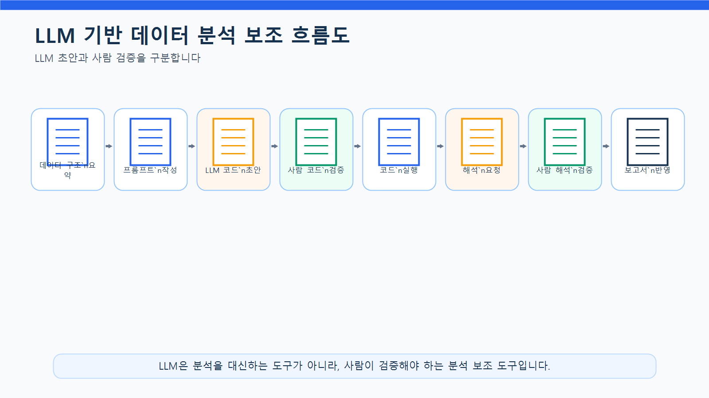
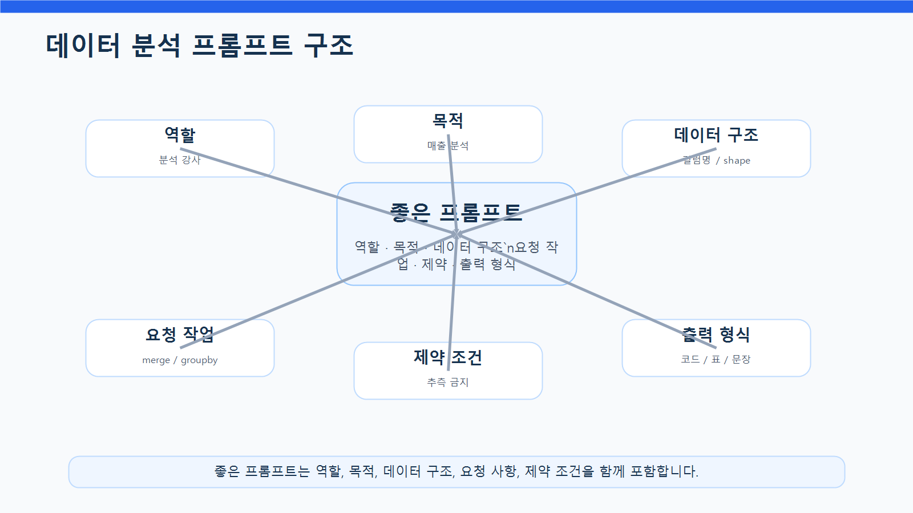
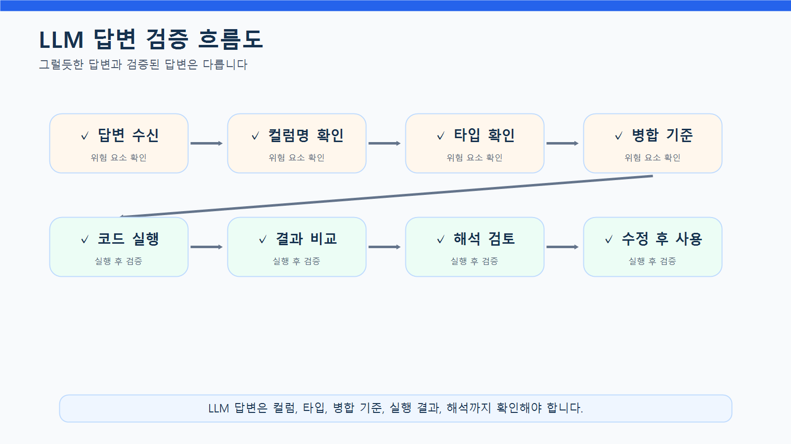
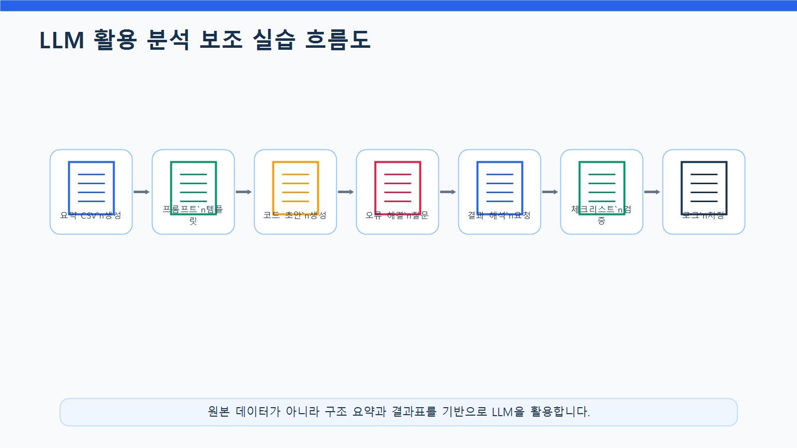
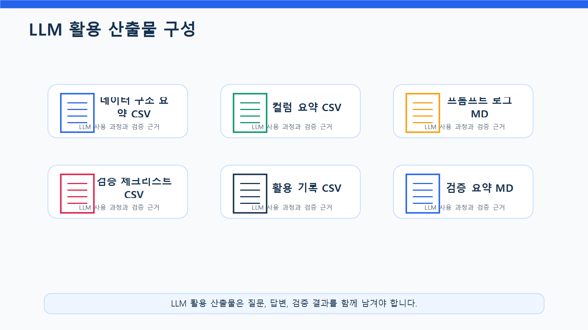

# 9장 LLM 프롬프트 기반 분석 보조

이 장에서는 지금까지 수행한 데이터 분석 과정을 LLM으로 보조하는 방법을 배웁니다. Chapter 3부터 Chapter 8까지는 pandas를 중심으로 데이터 불러오기, 전처리, EDA, 시각화, 중간 프로젝트를 수행했습니다. 이번 장에서는 같은 분석 과정을 LLM과 함께 진행할 때 어떤 방식으로 질문하고, 어떤 결과를 검증해야 하는지 실습합니다.

LLM은 데이터 분석에서 매우 강력한 보조 도구가 될 수 있습니다. 코드 작성, 오류 해결, 분석 질문 정리, 결과 해석, 보고서 문장 작성 등 다양한 작업을 도와줄 수 있습니다. 하지만 LLM이 항상 정확한 답을 주는 것은 아닙니다. 실제 데이터 구조와 다른 컬럼명을 사용하거나, 데이터에 없는 내용을 추측하거나, 검증되지 않은 원인을 단정할 수 있습니다.

따라서 이번 장의 핵심은 LLM에게 “분석을 맡기는 것”이 아니라, **LLM을 분석 보조 도구로 활용하고 사람이 최종 검증하는 능력**을 기르는 것입니다.

## 수업 시간 구성

| 구성                   |  권장 시간 |
| -------------------- | -----: |
| LLM 기반 분석 보조 개념 이해   |    30분 |
| 안전한 데이터 요약 정보 만들기    |    35분 |
| 프롬프트 작성 원칙 학습        |    40분 |
| pandas 코드 생성 프롬프트 실습 |    45분 |
| 오류 해결 프롬프트 실습        |    40분 |
| 분석 결과 해석 프롬프트 실습     |    45분 |
| LLM 답변 검증 체크리스트 작성   |    35분 |
| 보고서 문장 보완 실습         |    40분 |
| 연습 문제 및 심화 과제        | 60~90분 |

기본 수업은 약 3시간을 기준으로 구성되어 있습니다. LLM 답변 비교, 실패 사례 분석, 보고서 개선까지 포함하면 최대 5시간 분량으로 확장할 수 있습니다.

## 1. 학습 목표

이 장을 마치면 학습자는 다음을 할 수 있습니다.

* 데이터 분석에서 LLM이 도와줄 수 있는 작업과 한계를 설명할 수 있습니다.
* 원본 데이터를 직접 입력하지 않고 안전한 요약 정보를 만들 수 있습니다.
* 분석 목적, 데이터 구조, 요청 사항, 제약 조건을 포함한 프롬프트를 작성할 수 있습니다.
* LLM에게 pandas 코드 생성을 요청할 수 있습니다.
* LLM이 만든 코드를 실제 컬럼명과 데이터 타입 기준으로 검증할 수 있습니다.
* 오류 메시지를 LLM에게 효과적으로 전달할 수 있습니다.
* LLM이 작성한 분석 해석 문장을 데이터 기반으로 검토할 수 있습니다.
* 데이터에 없는 내용을 추측하거나 원인을 단정하는 답변을 찾아낼 수 있습니다.
* LLM 활용 내역과 검증 결과를 보고서에 기록할 수 있습니다.

## 2. 이번 장에서 만들 결과물

이번 장에서는 LLM을 활용한 분석 보조 실습 결과를 만듭니다.

이번 장에서 만들 결과물은 다음과 같습니다.

* LLM에 입력할 데이터 구조 요약표
* 안전한 프롬프트 템플릿
* pandas 코드 생성 프롬프트
* 오류 해결 프롬프트
* 분석 질문 확장 프롬프트
* 그래프 해석 프롬프트
* 보고서 문장 개선 프롬프트
* LLM 답변 검증 체크리스트
* LLM 활용 기록표
* `reports/ch09_llm_prompt_log.md`
* `reports/ch09_llm_review_summary.md`

아래 그림은 LLM이 데이터 분석 과정에서 어떤 역할을 할 수 있는지 보여줍니다.

<figure class="figure">
  
  <figcaption>그림 9-1. LLM 기반 데이터 분석 보조 흐름도</figcaption>
</figure>

## 3. 핵심 개념

### 3.1 LLM은 데이터 분석에서 무엇을 도와줄 수 있는가

LLM은 데이터 분석 과정에서 다음과 같은 작업을 도와줄 수 있습니다.

| 작업        | LLM 활용 예시         | 사람이 확인할 점           |
| --------- | ----------------- | ------------------- |
| 분석 질문 만들기 | 현재 데이터로 가능한 질문 제안 | 실제 데이터로 답할 수 있는가    |
| 코드 작성     | pandas 코드 초안 생성   | 컬럼명, 타입, 병합 기준이 맞는가 |
| 오류 해결     | 에러 메시지 원인 설명      | 제안 코드가 실제로 실행되는가    |
| 결과 해석     | 표와 그래프 해석 문장 작성   | 원인을 단정하지 않는가        |
| 보고서 작성    | 보고서 초안 작성         | 과장 표현이나 추측이 없는가     |
| 체크리스트 작성  | 검증 항목 정리          | 프로젝트 기준에 맞는가        |

LLM은 초안을 빠르게 만드는 데 강점이 있습니다. 하지만 실제 데이터 파일을 직접 확인하지 못하거나, 제공된 정보가 부족하면 잘못된 답을 만들 수 있습니다.

### 3.2 LLM에게 원본 데이터를 그대로 넣으면 안 되는 이유

LLM에게 고객명, 이메일, 전화번호, 주소, 주문 상세 등 원본 데이터를 그대로 입력하는 것은 위험할 수 있습니다. 실습 데이터라 하더라도 실제 업무에서는 개인정보와 거래 정보 보호가 매우 중요합니다.

LLM에 입력하기 적절한 정보는 다음과 같습니다.

| 입력 가능 정보 | 예시                                       |
| -------- | ---------------------------------------- |
| 데이터셋 이름  | customers, products, orders, order_items |
| 컬럼명      | customer_id, order_date, category        |
| 데이터 크기   | 150행 6열                                  |
| 데이터 타입   | age: int, order_date: object             |
| 결측치 개수   | age 결측치 3개                               |
| 집계 결과    | 카테고리별 매출 요약표                             |
| 오류 메시지   | KeyError, TypeError 등                    |
| 분석 목적    | 월별 매출 분석                                 |

주의해야 할 정보는 다음과 같습니다.

| 주의 정보     | 예시                     |
| --------- | ---------------------- |
| 개인정보      | 이름, 이메일, 전화번호, 주소      |
| 거래 상세 원본  | 개별 주문 내역 전체            |
| 민감한 내부 정보 | 매출 원본 전체, 고객 식별 가능 데이터 |
| 인증 정보     | API Key, 비밀번호, 토큰      |
| 비공개 문서    | 계약서, 인사 정보, 내부 전략 문서   |

이번 장에서는 원본 데이터 대신 구조 요약과 집계 결과를 사용해 LLM에게 질문합니다.

### 3.3 좋은 프롬프트의 구조

좋은 프롬프트는 단순히 “코드 작성해 줘”라고 묻는 것이 아닙니다. LLM이 정확히 답할 수 있도록 배경, 데이터 구조, 요청 사항, 제약 조건, 출력 형식을 함께 제공합니다.

좋은 프롬프트의 기본 구조는 다음과 같습니다.

| 구성 요소  | 설명                  |
| ------ | ------------------- |
| 역할     | LLM에게 어떤 역할로 답할지 지정 |
| 목적     | 무엇을 하려는지 설명         |
| 데이터 구조 | 데이터셋과 컬럼 정보 제공      |
| 요청 작업  | 작성할 코드나 해석 작업 명시    |
| 제약 조건  | 추측 금지, 초보자용 설명 등    |
| 출력 형식  | 코드, 표, 보고서 문장 등 지정  |
| 검증 요청  | 확인해야 할 위험 요소 포함     |

아래 그림은 좋은 프롬프트가 어떤 요소로 구성되는지 보여줍니다.

<figure class="figure">
  
  <figcaption>그림 9-2. 데이터 분석 프롬프트 구조</figcaption>
</figure>

### 3.4 나쁜 프롬프트와 좋은 프롬프트 비교

나쁜 프롬프트는 정보가 부족하고, 요청이 모호합니다.

```text
데이터 분석 코드 짜줘.
```

이 프롬프트에는 데이터 구조, 분석 목적, 컬럼명, 원하는 결과가 없습니다. LLM은 임의로 컬럼명을 만들어낼 수 있습니다.

좋은 프롬프트는 다음처럼 작성합니다.

```text
당신은 Python 데이터 분석 강사입니다.

온라인 쇼핑몰 데이터에서 카테고리별 매출을 계산하려고 합니다.

데이터 구조:
- order_items: order_id, product_id, quantity, unit_price, line_total
- products: product_id, product_name, category, price

요청:
1. product_id 기준으로 두 DataFrame을 병합
2. category별 line_total 합계 계산
3. 매출이 큰 순서로 정렬
4. 초보자용 주석 포함

주의:
- 실제 데이터에 없는 컬럼명을 만들지 마세요.
- 병합 후 행 수와 결측치 확인 코드도 포함해 주세요.
```

좋은 프롬프트는 LLM이 추측할 여지를 줄이고, 검증 가능한 답변을 만들도록 돕습니다.

### 3.5 LLM 답변 검증이 필요한 이유

LLM 답변은 반드시 검증해야 합니다. 특히 데이터 분석에서는 다음 오류가 자주 발생합니다.

| 오류 유형         | 예시                                       |
| ------------- | ---------------------------------------- |
| 존재하지 않는 컬럼 사용 | `sales_amount` 컬럼이 없는데 사용                |
| 병합 기준 오류      | `order_id`가 아니라 `product_id`로 병합해야 하는 상황 |
| 데이터 타입 무시     | 날짜 문자열을 변환하지 않고 월별 분석                    |
| 결측치 무시        | 변환 실패값 확인 없이 코드 작성                       |
| 원인 단정         | “전자기기 매출이 높은 이유는 고객 선호 때문”               |
| 개인정보 노출       | 고객명을 그대로 그래프에 표시                         |
| 과도한 자동화       | 이상값을 무조건 삭제                              |

LLM은 문장을 자연스럽게 작성하기 때문에 틀린 답변도 그럴듯하게 보일 수 있습니다. 따라서 실행, 비교, 검증 절차가 필요합니다.

### 3.6 LLM 활용 기록이 필요한 이유

실무나 교육 프로젝트에서는 LLM을 어떻게 사용했는지 기록하는 것이 좋습니다.

기록할 항목은 다음과 같습니다.

| 항목        | 예시                    |
| --------- | --------------------- |
| 사용 목적     | pandas 코드 초안 작성       |
| 입력한 정보    | 컬럼명, 데이터 크기, 분석 목적    |
| LLM 답변 요약 | merge와 groupby 코드 제안  |
| 검증 결과     | 컬럼명은 맞았지만 날짜 변환 누락    |
| 수정 내용     | `pd.to_datetime()` 추가 |
| 최종 사용 여부  | 수정 후 사용               |

아래 그림은 LLM 답변을 사람이 검증하는 흐름을 보여줍니다.

<figure class="figure">
  
  <figcaption>그림 9-3. LLM 답변 검증 흐름도</figcaption>
</figure>

## 4. 실습 시나리오

이번 장의 실습 시나리오는 다음과 같습니다.

> 온라인 쇼핑몰 데이터 분석 프로젝트를 진행하면서 LLM을 분석 보조 도구로 사용하려고 합니다. 원본 데이터를 그대로 입력하지 않고, 데이터 구조 요약과 집계 결과를 바탕으로 LLM에게 pandas 코드 작성, 오류 해결, 분석 질문 확장, 결과 해석, 보고서 문장 보완을 요청합니다. 이후 LLM 답변이 실제 데이터와 맞는지 검증하고, 수정 사항을 기록합니다.

이번 장에서 사용할 주요 LLM 활용 작업은 다음과 같습니다.

| 활용 작업        | 입력 정보            | 산출물        |
| ------------ | ---------------- | ---------- |
| 데이터 구조 설명    | 데이터셋, 컬럼명, shape | 분석 전 확인 사항 |
| pandas 코드 생성 | 컬럼명, 분석 목적       | 코드 초안      |
| 오류 해결        | 에러 메시지, 코드 일부    | 수정 코드      |
| 분석 질문 확장     | 데이터 구조, 분석 목적    | 추가 질문 목록   |
| 결과 해석        | 집계표, 그래프 목적      | 해석 문장      |
| 보고서 문장 개선    | 초안 문장            | 실무형 문장     |

아래 그림은 LLM을 활용한 분석 보조 실습 흐름을 보여줍니다.

<figure class="figure">
  
  <figcaption>그림 9-4. LLM 활용 분석 보조 실습 흐름도</figcaption>
</figure>

## 5. 실습 코드

이번 장의 전체 실습은 다음 Notebook에서 진행합니다.

```text
notebooks/ch09_llm_prompt_analysis_assistant.ipynb
```

본문에는 핵심 코드만 제공합니다.

### 5.1 기본 패키지 불러오기

```python
from pathlib import Path
import pandas as pd
```

실습 파일을 프로젝트 루트에서 실행하는 경우와 `notebooks` 폴더 안에서 실행하는 경우에는 상대 경로가 달라질 수 있습니다. 초보자는 두 경로 예시를 모두 실행하지 말고, 아래처럼 현재 실행 위치를 기준으로 `base_dir`를 자동으로 정한 뒤 사용하는 것이 안전합니다.

```python
current_dir = Path.cwd()

if current_dir.name == "notebooks":
    base_dir = current_dir.parent
else:
    base_dir = current_dir

processed_dir = base_dir / "data" / "processed"
report_dir = base_dir / "reports"

report_dir.mkdir(parents=True, exist_ok=True)

print("processed_dir:", processed_dir)
print("report_dir:", report_dir)
```

이 코드를 사용하면 노트북을 프로젝트 루트에서 실행하든 `notebooks` 폴더 안에서 실행하든 같은 방식으로 동작합니다.

`to_markdown()`을 사용하려면 환경에 따라 `tabulate` 패키지가 필요할 수 있습니다. 오류가 발생하면 터미널 또는 노트북에서 `pip install tabulate`를 실행하세요.

### 5.2 전처리 데이터 불러오기

```python
customers = pd.read_csv(processed_dir / "customers_clean.csv")
products = pd.read_csv(processed_dir / "products_clean.csv")
orders = pd.read_csv(processed_dir / "orders_clean.csv")
order_items = pd.read_csv(processed_dir / "order_items_clean.csv")
```

데이터셋을 딕셔너리로 정리합니다.

```python
datasets = {
    "customers": customers,
    "products": products,
    "orders": orders,
    "order_items": order_items
}
```

### 5.3 LLM 입력용 데이터 구조 요약 만들기

원본 데이터를 그대로 넣지 않고, 구조 요약만 만듭니다.

```python
dataset_summary = []

for name, df in datasets.items():
    dataset_summary.append({
        "dataset": name,
        "rows": df.shape[0],
        "columns": df.shape[1],
        "column_list": ", ".join(df.columns),
        "missing_values": int(df.isna().sum().sum()),
        "duplicated_rows": int(df.duplicated().sum())
    })

dataset_summary = pd.DataFrame(dataset_summary)
dataset_summary
```

요약표를 저장합니다.

```python
dataset_summary.to_csv(report_dir / "ch09_dataset_summary_for_llm.csv", index=False)
```

이 표는 LLM에게 데이터 구조를 설명할 때 사용할 수 있습니다.

### 5.4 컬럼별 데이터 타입 요약 만들기

```python
column_summary_rows = []

for name, df in datasets.items():
    for col in df.columns:
        column_summary_rows.append({
            "dataset": name,
            "column": col,
            "dtype": str(df[col].dtype),
            "missing_count": int(df[col].isna().sum()),
            "unique_count": int(df[col].nunique())
        })

column_summary = pd.DataFrame(column_summary_rows)
column_summary
```

저장합니다.

```python
column_summary.to_csv(report_dir / "ch09_column_summary_for_llm.csv", index=False)
```

### 5.5 LLM 프롬프트 템플릿 만들기

분석 코드 요청용 템플릿을 만듭니다.

```python
code_prompt_template = """
당신은 Python 데이터 분석 강사입니다.

분석 목적:
{analysis_goal}

데이터 구조:
{data_structure}

요청 작업:
{task}

제약 조건:
- 실제 데이터에 없는 컬럼명을 만들지 마세요.
- pandas 코드로 작성해 주세요.
- 초보자가 이해할 수 있도록 주석을 포함해 주세요.
- 병합이 필요한 경우 병합 전후 행 수 확인 코드를 포함해 주세요.
- 날짜 변환이 필요한 경우 변환 실패 건수 확인 코드를 포함해 주세요.

출력 형식:
1. 코드
2. 코드 설명
3. 실행 후 확인해야 할 사항
"""
```

카테고리별 매출 분석 프롬프트를 생성합니다.

```python
data_structure_text = """
order_items:
- order_id
- product_id
- quantity
- unit_price
- line_total

products:
- product_id
- product_name
- category
- price
"""

prompt_category_sales = code_prompt_template.format(
    analysis_goal="온라인 쇼핑몰 데이터에서 카테고리별 매출을 계산하려고 합니다.",
    data_structure=data_structure_text,
    task="""
1. order_items와 products를 product_id 기준으로 병합
2. category별 line_total 합계 계산
3. total_sales 기준 내림차순 정렬
4. sales_ratio 컬럼 생성
"""
)

print(prompt_category_sales)
```

### 5.6 오류 해결 프롬프트 만들기

LLM에게 오류 해결을 요청할 때는 코드와 오류 메시지를 함께 제공합니다. 단, 전체 데이터는 제공하지 않습니다.

```python
error_prompt_template = """
당신은 Python pandas 오류 해결 도우미입니다.

다음 코드에서 오류가 발생했습니다.

코드:
{code}

오류 메시지:
{error_message}

데이터 구조:
{data_structure}

요청:
1. 오류 원인을 설명해 주세요.
2. 수정 코드를 작성해 주세요.
3. 비슷한 오류를 예방하는 방법을 알려 주세요.

주의:
- 실제 데이터에 없는 컬럼명을 새로 만들지 마세요.
- 답변은 초보자도 이해할 수 있게 작성해 주세요.
"""
```

예시 프롬프트를 만듭니다.

```python
sample_error_prompt = error_prompt_template.format(
    code='category_sales = order_items.groupby("category")["line_total"].sum()',
    error_message="KeyError: 'category'",
    data_structure=data_structure_text
)

print(sample_error_prompt)
```

### 5.7 분석 결과 해석 프롬프트 만들기

카테고리별 매출 결과를 LLM에 입력할 수 있도록 요약합니다.

```python
sales_items = order_items.merge(
    products,
    on="product_id",
    how="left"
)

category_sales = (
    sales_items
    .groupby("category", as_index=False)
    .agg(
        total_quantity=("quantity", "sum"),
        total_sales=("line_total", "sum")
    )
    .sort_values("total_sales", ascending=False)
)

category_sales["sales_ratio"] = (
    category_sales["total_sales"] / category_sales["total_sales"].sum() * 100
).round(2)

category_sales
```

LLM 입력용 텍스트로 변환합니다.

```python
category_sales_text = category_sales.to_csv(index=False)
print(category_sales_text)
```

해석 요청 프롬프트를 만듭니다.

```python
interpretation_prompt = f"""
당신은 데이터 분석 보고서 작성 도우미입니다.

다음은 온라인 쇼핑몰 카테고리별 매출 분석 결과입니다.

{category_sales_text}

요청:
1. 결과를 초보자도 이해할 수 있게 해석해 주세요.
2. 데이터로 확인한 관찰 내용과 원인 가설을 구분해 주세요.
3. 데이터에 없는 원인을 단정하지 마세요.
4. 추가로 확인해야 할 분석 질문 3개를 제안해 주세요.
5. 보고서에 넣을 수 있는 문장으로 작성해 주세요.
"""

print(interpretation_prompt)
```

### 5.8 LLM 답변 검증표 만들기

LLM 답변을 검증하기 위한 표를 만듭니다.

```python
llm_review_checklist = pd.DataFrame({
    "check_item": [
        "실제 컬럼명과 일치하는가?",
        "존재하지 않는 데이터를 가정하지 않았는가?",
        "병합 기준이 올바른가?",
        "날짜 변환이 필요한 경우 처리했는가?",
        "결측치나 변환 실패를 확인했는가?",
        "코드가 실제로 실행 가능한가?",
        "해석에서 원인을 단정하지 않았는가?",
        "데이터에 없는 내용을 추측하지 않았는가?",
        "개인정보나 원본 데이터를 노출하지 않았는가?",
        "추가 검증이 필요한 부분을 명시했는가?"
    ],
    "result": ["□"] * 10,
    "memo": [""] * 10
})

llm_review_checklist
```

저장합니다.

```python
llm_review_checklist.to_csv(report_dir / "ch09_llm_review_checklist.csv", index=False)
```

### 5.9 LLM 활용 기록표 만들기

```python
llm_usage_log = pd.DataFrame({
    "step": [
        "데이터 구조 설명",
        "pandas 코드 생성",
        "오류 해결",
        "결과 해석",
        "보고서 문장 개선"
    ],
    "purpose": [
        "데이터셋 구조를 설명하고 분석 전 확인 사항 정리",
        "카테고리별 매출 분석 코드 초안 생성",
        "KeyError 원인 파악과 수정 코드 작성",
        "카테고리별 매출 결과 해석",
        "보고서 문장 자연스럽게 개선"
    ],
    "input_type": [
        "컬럼명, shape, 결측치 요약",
        "데이터 구조와 분석 목적",
        "오류 메시지와 코드",
        "집계 결과표",
        "보고서 초안 문장"
    ],
    "validation_point": [
        "데이터에 없는 분석을 제안했는지 확인",
        "컬럼명과 병합 기준 확인",
        "수정 코드 실행 여부 확인",
        "원인 단정 여부 확인",
        "과장 표현과 추측 확인"
    ]
})

llm_usage_log
```

저장합니다.

```python
llm_usage_log.to_csv(report_dir / "ch09_llm_usage_log.csv", index=False)
```

### 5.10 LLM 프롬프트 로그 저장하기

실습에서 사용한 주요 프롬프트를 Markdown 파일로 저장합니다.

```python
prompt_log = f"""
# Chapter 9 LLM 프롬프트 로그

## 1. 카테고리별 매출 분석 코드 요청 프롬프트

~~~text
{prompt_category_sales}
~~~

## 2. 오류 해결 요청 프롬프트

~~~text
{sample_error_prompt}
~~~

## 3. 분석 결과 해석 요청 프롬프트

~~~text
{interpretation_prompt}
~~~

## 4. 사용 시 주의사항

- 원본 고객명, 이메일, 주문 상세 전체 데이터를 LLM에 입력하지 않았습니다.
- 컬럼명과 집계 결과 중심으로 질문했습니다.
- LLM 답변은 실제 코드 실행과 결과 비교를 통해 검증해야 합니다.
"""

prompt_log_path = report_dir / "ch09_llm_prompt_log.md"
prompt_log_path.write_text(prompt_log, encoding="utf-8")
```

### 5.11 LLM 검증 요약 보고서 작성하기

```python
review_summary = f"""
# Chapter 9 LLM 답변 검증 요약

## 1. 검증 목적

LLM이 생성한 데이터 분석 코드와 해석 문장이 실제 데이터 구조와 일치하는지 확인합니다.

## 2. 데이터 구조 요약

{dataset_summary.to_markdown(index=False)}

## 3. LLM 활용 기록

{llm_usage_log.to_markdown(index=False)}

## 4. 검증 체크리스트

{llm_review_checklist.to_markdown(index=False)}

## 5. 주요 검증 포인트

- LLM이 실제 데이터에 없는 컬럼명을 사용하지 않았는지 확인합니다.
- 병합 기준이 실제 키 관계와 맞는지 확인합니다.
- 날짜 변환과 결측치 확인 코드가 포함되어 있는지 확인합니다.
- 결과 해석에서 데이터에 없는 원인을 단정하지 않았는지 확인합니다.
- 개인정보나 원본 데이터를 LLM에 입력하지 않았는지 확인합니다.

## 6. 결론

LLM은 코드 초안 작성과 해석 문장 작성에 유용하지만, 최종 분석 결과는 반드시 사람이 검증해야 합니다.
"""

review_summary_path = report_dir / "ch09_llm_review_summary.md"
review_summary_path.write_text(review_summary, encoding="utf-8")
```

아래 그림은 LLM 활용 결과를 프로젝트 산출물로 정리하는 흐름을 보여줍니다.

<figure class="figure">
  
  <figcaption>그림 9-5. LLM 활용 산출물 구성</figcaption>
</figure>

## 6. LLM 활용 프롬프트

이번 장에서는 LLM 활용 자체가 주제이므로, 실습용 프롬프트를 상황별로 정리합니다.

### 6.1 데이터 구조 설명 요청

```text
당신은 데이터 분석 강사입니다.

온라인 쇼핑몰 데이터 분석을 시작하기 전에 데이터 구조를 이해하려고 합니다.

데이터셋 요약:
- customers: 150행, 6열
- products: 100행, 4열
- orders: 300행, 5열
- order_items: 764행, 5열

주요 컬럼:
- customers: customer_id, gender, age, city, signup_date
- products: product_id, product_name, category, price
- orders: order_id, customer_id, order_date, payment_method, order_status
- order_items: order_id, product_id, quantity, unit_price, line_total

요청:
1. 각 데이터셋의 역할을 설명해 주세요.
2. 파일 간 연결 관계를 설명해 주세요.
3. 분석 전에 확인해야 할 사항을 체크리스트로 정리해 주세요.

주의:
- 실제 데이터에 없는 내용을 추측하지 마세요.
- 초보자도 이해할 수 있게 설명해 주세요.
```

### 6.2 pandas 코드 생성 요청

```text
당신은 Python 데이터 분석 실습 조교입니다.

온라인 쇼핑몰 데이터에서 월별 매출을 계산하려고 합니다.

데이터 구조:
- orders: order_id, customer_id, order_date, payment_method, order_status
- order_items: order_id, product_id, quantity, unit_price, line_total

요청:
1. order_id 기준으로 orders와 order_items를 병합
2. order_date를 날짜형으로 변환
3. order_month 컬럼 생성
4. 월별 total_sales와 order_count 계산
5. order_month 기준으로 정렬

주의:
- 날짜 변환 실패 건수 확인 코드를 포함해 주세요.
- 병합 전후 행 수 확인 코드를 포함해 주세요.
- 초보자용 주석을 포함해 주세요.
```

### 6.3 오류 해결 요청

```text
다음 pandas 코드에서 오류가 발생했습니다.

코드:
category_sales = order_items.groupby("category")["line_total"].sum()

오류:
KeyError: 'category'

현재 데이터 구조:
- order_items: order_id, product_id, quantity, unit_price, line_total
- products: product_id, product_name, category, price

요청:
1. 오류 원인을 설명해 주세요.
2. 올바른 분석 흐름을 설명해 주세요.
3. 수정된 pandas 코드를 작성해 주세요.
4. 병합 후 검증해야 할 사항도 포함해 주세요.
```

### 6.4 분석 질문 확장 요청

```text
온라인 쇼핑몰 데이터로 EDA를 수행했습니다.

현재 가능한 데이터:
- 고객 정보
- 상품 정보
- 주문 정보
- 주문 상세 정보

이미 수행한 분석:
- 카테고리별 매출
- 월별 매출
- 고객별 구매 금액
- 주문 상태별 주문 수

요청:
1. 추가로 분석해 볼 수 있는 질문 10개를 제안해 주세요.
2. 각 질문이 현재 데이터로 가능한지 표시해 주세요.
3. 필요한 데이터셋과 컬럼을 함께 정리해 주세요.
4. 현재 데이터로 불가능한 질문은 제외하거나 수정해 주세요.
```

### 6.5 그래프 해석 요청

```text
다음은 월별 매출 그래프를 만들기 위한 요약 데이터입니다.

order_month,total_sales,order_count,avg_order_value
2024-01,3200000,42,76190
2024-02,4100000,51,80392
2024-03,3900000,49,79591
2024-04,5200000,63,82540

요청:
1. 이 결과를 보고서 문장으로 해석해 주세요.
2. 관찰 결과와 원인 가설을 구분해 주세요.
3. 데이터에 없는 원인을 단정하지 마세요.
4. 추가로 확인해야 할 분석 질문을 3개 제안해 주세요.
```

### 6.6 보고서 문장 개선 요청

```text
다음 문장을 데이터 분석 보고서에 적합하게 다듬어 주세요.

초안:
전자기기 매출이 제일 높다. 아마 사람들이 전자기기를 좋아해서 그런 것 같다. 그래서 전자기기를 더 많이 팔면 된다.

수정 조건:
- 과장된 표현을 줄일 것
- 데이터로 확인한 사실과 가설을 구분할 것
- 추가 분석이 필요한 부분을 언급할 것
- 실무 보고서 문체로 작성할 것
```

## 7. 결과 해석

이번 장의 결과는 LLM이 만든 답변 그 자체가 아니라, LLM을 어떻게 활용하고 검증했는지에 대한 기록입니다.

### 7.1 코드 생성 결과 해석

LLM이 생성한 코드는 초안으로 활용할 수 있습니다. 하지만 다음 항목을 확인해야 합니다.

```text
LLM이 생성한 코드는 실제 컬럼명과 데이터 구조를 기준으로 검증해야 합니다.
특히 merge 기준, groupby 기준, 날짜 변환, 결측치 확인 코드가 포함되어 있는지 확인해야 합니다.
```

### 7.2 오류 해결 결과 해석

LLM은 오류 메시지의 원인을 설명하는 데 유용합니다. 하지만 제안한 코드가 실제로 실행되는지는 직접 확인해야 합니다.

```text
KeyError는 대체로 컬럼명이 없을 때 발생합니다.
LLM이 제안한 수정 코드가 실제 데이터 컬럼 구조와 맞는지 확인한 후 사용해야 합니다.
```

### 7.3 분석 결과 해석 문장 검토

LLM은 자연스러운 해석 문장을 잘 작성하지만, 원인을 단정하는 경우가 있습니다.

예를 들어 다음 문장은 위험합니다.

```text
전자기기 매출이 높은 이유는 고객들이 전자기기를 가장 선호하기 때문입니다.
```

더 안전한 표현은 다음과 같습니다.

```text
전자기기 카테고리의 매출 비중이 가장 높게 나타났습니다.
다만 이 결과가 고객 선호 때문인지, 상품 단가 때문인지, 판매 수량 때문인지는 추가 분석이 필요합니다.
```

## 8. 실무 적용 포인트

실무에서 LLM을 사용할 때는 다음 원칙을 지켜야 합니다.

1. 원본 데이터를 그대로 입력하지 않습니다.
2. 컬럼명, 데이터 타입, 집계 결과 중심으로 질문합니다.
3. 분석 목적과 출력 형식을 명확히 작성합니다.
4. 실제 데이터에 없는 컬럼명을 만들지 말라고 요청합니다.
5. 병합과 날짜 변환은 반드시 검증합니다.
6. LLM이 만든 코드는 직접 실행해 확인합니다.
7. 오류가 발생하면 코드와 오류 메시지를 함께 제공합니다.
8. 해석 문장은 데이터 기반 표현인지 확인합니다.
9. 원인 단정 문장은 가설로 바꿉니다.
10. LLM 활용 내역과 수정 내용을 기록합니다.

### LLM 분석 보조 체크리스트

| 점검 항목                          | 확인 |
|---|---|
| 원본 개인정보나 거래 상세를 입력하지 않았는가? | □ |
| 데이터 구조 요약만 입력했는가? | □ |
| 분석 목적을 명확히 작성했는가? | □ |
| 원하는 출력 형식을 지정했는가? | □ |
| 실제 데이터에 없는 컬럼명을 만들지 말라고 요청했는가? | □ |
| LLM이 만든 코드가 실제로 실행되는가? | □ |
| 컬럼명과 데이터 타입이 실제 데이터와 일치하는가? | □ |
| 병합 기준이 올바른가? | □ |
| 날짜 변환과 결측치 확인 코드가 포함되었는가? | □ |
| 해석 문장에서 원인을 단정하지 않았는가? | □ |
| 데이터에 없는 내용을 추측하지 않았는가? | □ |
| LLM 답변을 수정한 내용을 기록했는가? | □ |

## 9. 연습 문제

### 기본 연습 문제

1. LLM에 입력할 데이터 구조 요약표를 만드세요.

   * 제출 형식: 코드와 출력 결과
   * 포함 항목: 데이터셋 이름, 행 수, 열 수, 컬럼 목록

2. 카테고리별 매출 분석 코드를 요청하는 프롬프트를 작성하세요.

   * 제출 형식: 프롬프트 원문
   * 조건: 데이터 구조, 요청 작업, 제약 조건 포함

3. LLM이 만든 코드에서 실제 데이터에 없는 컬럼명이 있는지 검토하세요.

   * 제출 형식: 검토 표
   * 포함 항목: 컬럼명, 실제 존재 여부, 수정 필요 여부

4. KeyError 오류 해결 프롬프트를 작성하세요.

   * 제출 형식: 오류 코드, 오류 메시지, 데이터 구조, 요청 사항

5. LLM이 작성한 해석 문장에서 원인 단정 표현을 찾아 수정하세요.

   * 제출 형식: 원문, 문제점, 수정 문장

### 심화 과제

1. LLM 활용 기록표를 작성하세요.

   * 제출 형식: 표
   * 포함 항목: 사용 목적, 입력 정보, 답변 요약, 검증 결과, 수정 내용

2. LLM에게 월별 매출 해석을 요청하고, 데이터에 없는 추측이 포함되었는지 검토하세요.

   * 제출 형식: 프롬프트, LLM 답변, 검토 결과

3. LLM에게 보고서 초안을 작성하게 한 뒤, 과장 표현과 원인 단정 표현을 수정하세요.

   * 제출 형식: 초안, 수정 전후 비교

4. `reports/ch09_llm_prompt_log.md` 파일을 작성하세요.

   * 제출 형식: Markdown 파일
   * 포함 항목: 사용 프롬프트, 목적, 입력 정보, 검증 결과

5. `reports/ch09_llm_review_summary.md` 파일을 작성하세요.

   * 제출 형식: Markdown 파일
   * 포함 항목: 검증 목적, 체크리스트, 주요 수정 사항, 최종 결론

## 10. 정리

이번 장에서는 LLM을 데이터 분석 보조 도구로 활용하는 방법을 배웠습니다. LLM은 pandas 코드 작성, 오류 해결, 분석 질문 생성, 결과 해석, 보고서 문장 보완에 도움을 줄 수 있습니다. 하지만 LLM 답변은 항상 검증이 필요합니다.

좋은 프롬프트는 역할, 목적, 데이터 구조, 요청 작업, 제약 조건, 출력 형식을 포함합니다. 데이터 분석에서 프롬프트가 모호하면 LLM이 존재하지 않는 컬럼명을 만들거나, 데이터에 없는 내용을 추측할 수 있습니다.

LLM에게 원본 데이터를 그대로 입력하지 않는 것도 중요합니다. 고객명, 이메일, 전화번호, 주문 상세 전체 데이터 대신 컬럼명, 데이터 타입, 결측치 개수, 집계 결과처럼 요약된 정보를 사용하는 것이 안전합니다.

LLM이 작성한 코드는 반드시 실제 데이터로 실행해 검증해야 합니다. 특히 컬럼명, 병합 기준, 날짜 변환, 결측치 처리, 이상값 처리 여부를 확인해야 합니다. 해석 문장에서는 관찰과 원인 가설을 구분해야 하며, 데이터에 없는 원인을 단정하면 안 됩니다.

다음 장에서는 LLM을 활용해 데이터 분석 코드를 생성하고, 생성된 코드를 사람이 검증·수정하는 과정을 더 깊게 실습합니다.
