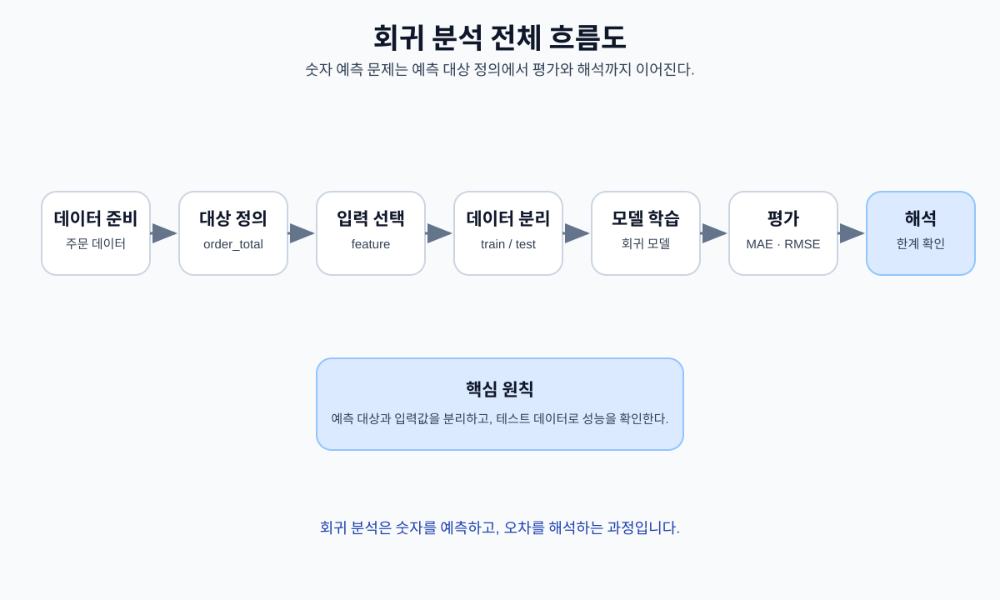
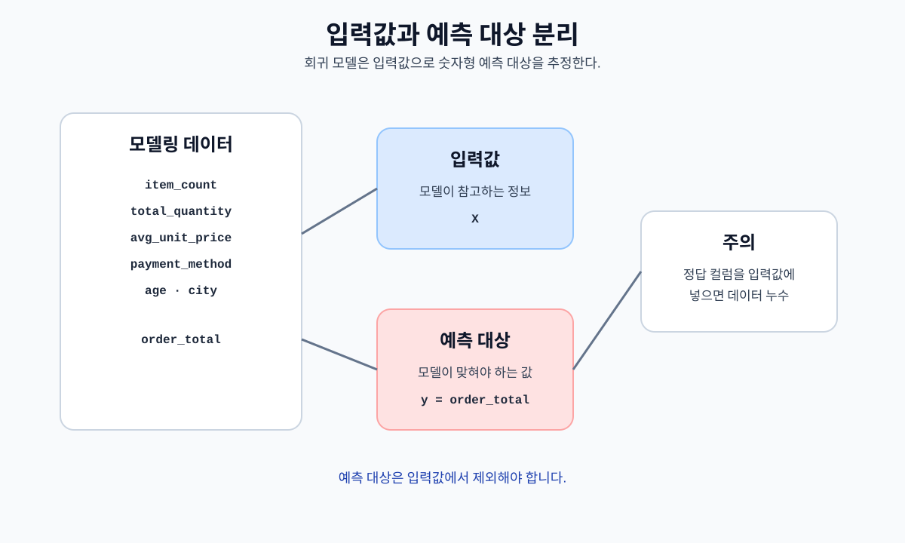
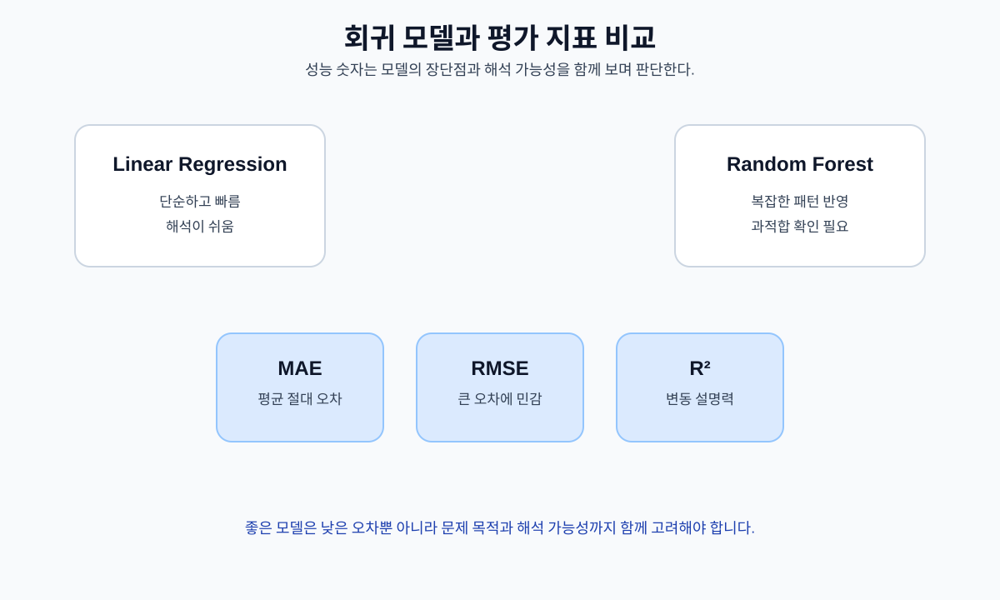
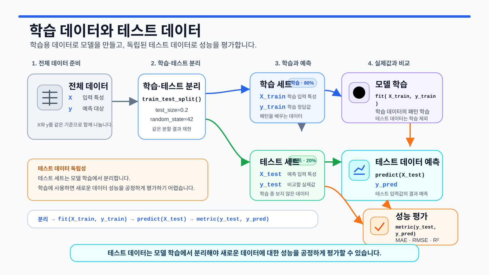

# 9장. 회귀 분석으로 숫자 예측하기

지금까지는 데이터를 불러오고, 정리하고, 질문을 만들고, 그래프로 확인하는 과정을 살펴보았습니다. 이러한 과정은 주로 **무슨 일이 있었는가**를 이해하는 데 초점을 둡니다. 이제 한 걸음 더 나아가, 이미 관찰한 데이터의 패턴을 바탕으로 새로운 숫자 값을 추정하는 회귀 모델링을 살펴보겠습니다.

회귀는 금액, 수량, 점수, 온도처럼 연속적인 숫자 값을 예측하는 머신러닝 문제입니다. 그러나 회귀 모델을 만드는 목적은 단순히 높은 점수를 얻는 것이 아닙니다. **예측 시점을 먼저 정하고, 그 시점에 실제로 사용할 수 있는 정보만 입력값으로 선택한 뒤, 단순한 기준보다 모델이 더 유용한지 검증하는 것**이 중요합니다.

이 장에서는 온라인 쇼핑몰 데이터로 주문 금액을 예측하는 교육용 예제를 다룹니다. 주문 상세 금액은 수량과 단가로 직접 계산되므로, 같은 주문에서 만든 `total_quantity`, `avg_unit_price`, `line_total` 같은 값을 입력값으로 사용하면 목표값을 사실상 미리 알려 주는 문제가 생깁니다. 따라서 이번 실습에서는 주문 상세 정보는 목표값을 만드는 데만 사용하고, 모델 입력에는 주문 시점·결제 수단·고객의 비식별 특성만 사용합니다.

이 예제는 실제 운영 모델을 완성하는 것이 아니라, 데이터 누수를 피하고 회귀 모델을 정직하게 평가하는 과정을 익히기 위한 실습입니다. 현재 가상 데이터는 변수 사이의 예측 패턴이 강하게 설계되어 있지 않으므로, 복잡한 모델도 단순 평균 기준보다 크게 좋아지지 않을 수 있습니다. 낮은 성능 역시 중요한 분석 결과입니다.

<figure class="figure">
  
  <figcaption>그림 9-1. 회귀 분석 전체 흐름도</figcaption>
</figure>

## 이 장에서 생각해 볼 질문

- 어떤 숫자를 예측하려고 하는가?
- 모델은 어느 시점에 예측을 수행한다고 가정하는가?
- 예측 시점에 실제로 알 수 있는 입력값은 무엇인가?
- 목표값이나 목표값의 계산 재료가 입력값에 섞이지 않았는가?
- 데이터를 시간 순서대로 나누어야 하는 이유는 무엇인가?
- 모델은 단순 평균 예측보다 실제로 나은가?
- MAE, RMSE, R²는 각각 무엇을 알려 주는가?
- 훈련 성능과 테스트 성능의 차이는 과적합을 나타내는가?
- 성능이 낮을 때 모델을 억지로 운영에 사용하지 않을 수 있는가?
- LLM이 작성한 회귀 코드는 어떤 기준으로 검증해야 하는가?

## 1. 회귀 문제는 예측 시점부터 정의한다

회귀는 연속적인 숫자 값을 예측합니다. 범주를 예측하는 분류와 달리, 회귀의 결과는 금액이나 수량처럼 숫자로 표현됩니다.

온라인 쇼핑몰에서는 다음과 같은 회귀 문제를 생각할 수 있습니다.

| 예측 질문 | 예측 대상 | 예측 시점에 사용할 수 있는 정보 예시 |
| --- | --- | --- |
| 새 주문의 금액은 어느 정도일까? | 주문 상세 금액 합계 | 주문 시점, 결제 수단, 고객 연령·지역 |
| 고객의 다음 30일 구매 금액은 얼마일까? | 미래 30일 구매 금액 | 예측 기준일 이전 구매 이력 |
| 상품의 다음 달 판매 수량은 얼마일까? | 다음 달 판매 수량 | 이전 기간 판매량, 가격, 카테고리 |
| 다음 달 완료 주문 금액은 얼마일까? | 다음 달 완료 주문 금액 | 이전 월 금액, 주문 수, 계절 정보 |

같은 목표값이라도 **언제 예측하는가**에 따라 사용할 수 있는 입력값이 달라집니다. 예를 들어 주문이 모두 완료된 뒤 주문 상세를 집계할 수 있다면 주문 금액은 예측할 필요 없이 계산하면 됩니다. 반대로 주문 상세 처리가 지연되어 주문 메타데이터만 먼저 도착하는 상황이라면, 주문 금액을 미리 추정하는 교육용 문제를 만들 수 있습니다.

이번 장에서는 다음과 같이 문제를 정의합니다.

- 예측 대상:
  - 한 주문의 주문 상세 금액 합계(`order_total`)

- 교육용 예측 시점:
  - 주문 메타데이터와 고객 특성은 확인할 수 있지만
  주문 상세의 수량·단가·금액은 모델에 제공하지 않는 시점

- 사용할 입력값:
  - `payment_method`
  - `order_month`
  - `order_dayofweek`
  - `gender`
  - `age`
  - `city`

- 입력에서 제외할 값:
  - `order_id`, `customer_id`
  - `order_status`
  - `product_id`
  - `quantity`, `unit_price`, `line_total`
  - `item_count`, `total_quantity`, `avg_unit_price`

`order_id`와 `customer_id`는 식별자이므로 일반적인 숫자 변수처럼 사용하지 않습니다. `order_status`는 주문 처리 이후에 확정될 수 있으므로 예측 시점 이후 정보가 될 가능성이 있습니다. 주문 상세에서 계산한 수량·단가·금액 관련 값은 목표값과 직접 연결되므로 입력에서 제외합니다.

이 문제는 실제 서비스 배포를 위한 완성된 예측 문제라기보다, **입력값의 가용 시점과 데이터 누수를 판단하는 연습**입니다.

## 2. 데이터 누수는 정답 컬럼만의 문제가 아니다

데이터 누수(data leakage)는 모델이 실제 예측 시점에는 사용할 수 없는 정보를 훈련 과정에서 미리 보는 문제입니다.

가장 명확한 누수는 목표값 자체를 입력에 넣는 것입니다.

```python
# 잘못된 예시
X = model_data[["order_total", "age", "city"]]
y = model_data["order_total"]
```

하지만 목표값의 계산 재료나 결과 이후에 만들어지는 컬럼도 누수가 될 수 있습니다.

| 입력값 후보 | 사용 여부 | 이유 |
| --- | --- | --- |
| `order_total` | 제외 | 예측 대상 자체입니다. |
| `line_total` | 제외 | 주문 금액을 구성하는 직접 계산값입니다. |
| `quantity`, `unit_price` | 제외 | 목표값 계산에 직접 사용됩니다. |
| `total_quantity`, `avg_unit_price` | 제외 | 같은 주문 상세에서 만든 목표값의 대리 변수입니다. |
| `item_count` | 제외 | 주문 상세가 모두 확인된 뒤 계산되는 값입니다. |
| `order_status` | 제외 | 예측 시점 이후에 확정될 수 있습니다. |
| `order_id`, `customer_id` | 제외 | 식별자를 외우거나 특정 고객을 암기할 위험이 있습니다. |
| `payment_method` | 사용 | 이 실습에서 예측 시점에 이미 확인된다고 가정합니다. |
| 주문 월·요일 | 사용 | 주문일에서 만들 수 있는 시점 정보입니다. |
| 연령·성별·지역 | 사용 | 고객 데이터에 있는 비식별 특성입니다. |

여기서 중요한 기준은 “이 컬럼이 데이터 파일에 존재하는가?”가 아니라, **실제 예측 시점에 이 값을 사용할 수 있는가?**입니다.

<figure class="figure">
  
  <figcaption>그림 9-2. 입력값과 예측 대상 분리 개념도</figcaption>
</figure>

## 3. 회귀 평가 지표와 베이스라인

회귀 모델은 한 가지 지표만으로 판단하지 않습니다. 이번 장에서는 MAE, RMSE, R²를 함께 확인합니다.

| 지표 | 의미 | 해석할 때 주의할 점 |
| --- | --- | --- |
| MAE | 평균 절대 오차 | 목표값과 같은 단위로 평균적인 오차 크기를 보여 줍니다. |
| RMSE | 평균 제곱근 오차 | 큰 오차에 더 민감합니다. MAE보다 훨씬 크면 일부 큰 오차를 확인합니다. |
| R² | 결정계수 | 기준 평균 예측과 비교해 변동을 얼마나 설명하는지 봅니다. 음수가 될 수도 있습니다. |

주문 금액의 단위가 원이라면 MAE와 RMSE도 원 단위입니다. 예를 들어 MAE가 120,000이라면 예측값과 실제값이 평균적으로 약 12만 원 차이 난다고 해석할 수 있습니다.

R²는 보통 1에 가까울수록 좋지만 반드시 0과 1 사이에 있는 것은 아닙니다.

- `R² = 1`: 테스트 데이터를 완벽하게 예측했습니다.
- `R² = 0`: 테스트 데이터의 평균값을 예측하는 것과 비슷합니다.
- `R² < 0`: 단순 평균 예측보다도 성능이 낮습니다.

모델의 성능을 판단하려면 **베이스라인(baseline)**이 필요합니다. 이번 장에서는 훈련 데이터의 평균을 모든 테스트 주문에 예측하는 `DummyRegressor`를 기준 모델로 사용합니다. 복잡한 모델이 베이스라인보다 낫지 않다면, 현재 입력값만으로는 목표값을 충분히 예측하기 어렵다는 뜻일 수 있습니다.

## 4. 선형 회귀와 랜덤 포레스트 회귀

이번 장에서는 베이스라인과 함께 두 가지 회귀 모델을 비교합니다.

| 모델 | 역할 | 장점 | 주의할 점 |
| --- | --- | --- | --- |
| DummyRegressor | 단순 기준 | 모델이 최소한 넘어야 할 기준을 제공합니다. | 입력값의 관계를 학습하지 않습니다. |
| LinearRegression | 선형 모델 | 구조가 단순하고 비교적 해석하기 쉽습니다. | 복잡한 비선형 관계를 표현하기 어렵습니다. |
| RandomForestRegressor | 트리 앙상블 | 비선형 관계와 변수 간 상호작용을 표현할 수 있습니다. | 과적합 가능성이 있고 해석이 더 어렵습니다. |

복잡한 모델이 항상 더 좋은 것은 아닙니다. 입력값에 예측 정보가 거의 없다면 랜덤 포레스트도 베이스라인보다 나아지지 않을 수 있습니다. 반대로 훈련 성능만 지나치게 높고 테스트 성능이 낮다면 과적합을 의심해야 합니다.

<figure class="figure">
  
  <figcaption>그림 9-3. 회귀 모델과 평가 지표 비교</figcaption>
</figure>

## 5. 실습 환경과 데이터 불러오기

이번 장의 전체 코드는 `notebooks/ch09_regression_analysis.ipynb`에서 실행할 수 있습니다.

먼저 필요한 패키지를 불러옵니다.

```python
from pathlib import Path

import matplotlib.pyplot as plt
import numpy as np
import pandas as pd

from sklearn.compose import ColumnTransformer
from sklearn.dummy import DummyRegressor
from sklearn.ensemble import RandomForestRegressor
from sklearn.impute import SimpleImputer
from sklearn.linear_model import LinearRegression
from sklearn.metrics import (
    mean_absolute_error,
    mean_squared_error,
    r2_score,
)
from sklearn.model_selection import (
    TimeSeriesSplit,
    cross_validate,
)
from sklearn.pipeline import Pipeline
from sklearn.preprocessing import (
    OneHotEncoder,
    StandardScaler,
)
```

프로젝트 루트와 `notebooks` 폴더에서 실행하는 경우를 모두 처리합니다.

```python
project_root = Path.cwd()

if project_root.name == "notebooks":
    project_root = project_root.parent

processed_dir = project_root / "data" / "processed"
report_dir = project_root / "reports"
figure_dir = report_dir / "figures"

report_dir.mkdir(parents=True, exist_ok=True)
figure_dir.mkdir(parents=True, exist_ok=True)

print("프로젝트 루트:", project_root.resolve())
print("전처리 데이터:", processed_dir.resolve())
```

5장에서 저장한 전처리 파일이 모두 존재하는지 확인합니다.

```python
required_files = [
    "customers_clean.csv",
    "orders_clean.csv",
    "order_items_clean.csv",
]

for file_name in required_files:
    file_path = processed_dir / file_name
    print(f"{file_name}: {file_path.exists()}")
```

하나라도 `False`라면 5장의 전처리 실습을 먼저 실행합니다. 원본 데이터로 바로 대체하면 5장에서 적용한 숫자 변환, 이상값 처리, 키 검증 기준이 달라질 수 있으므로 이 장에서는 전처리 파일만 사용합니다.

```python
customers = pd.read_csv(
    processed_dir / "customers_clean.csv"
)
orders = pd.read_csv(
    processed_dir / "orders_clean.csv"
)
order_items = pd.read_csv(
    processed_dir / "order_items_clean.csv"
)
```

필요한 컬럼을 확인합니다.

```python
required_columns = {
    "customers": {
        "customer_id",
        "gender",
        "age",
        "city",
    },
    "orders": {
        "order_id",
        "customer_id",
        "order_date",
        "payment_method",
        "order_status",
    },
    "order_items": {
        "order_id",
        "quantity",
        "unit_price",
    },
}

datasets = {
    "customers": customers,
    "orders": orders,
    "order_items": order_items,
}

for name, columns in required_columns.items():
    missing_columns = columns - set(
        datasets[name].columns
    )

    if missing_columns:
        raise KeyError(
            f"{name}에 필요한 컬럼이 없습니다: "
            f"{sorted(missing_columns)}"
        )
```

`line_total`이 없다면 수량과 단가로 다시 만듭니다. 이 컬럼은 목표값 생성에만 사용하며 모델 입력에는 넣지 않습니다.

```python
if "line_total" not in order_items.columns:
    order_items["line_total"] = (
        pd.to_numeric(
            order_items["quantity"],
            errors="coerce",
        )
        * pd.to_numeric(
            order_items["unit_price"],
            errors="coerce",
        )
    )
```

## 6. 주문 단위 목표값 만들기

주문 상세는 한 주문에 여러 행이 있을 수 있으므로 주문별 금액으로 집계합니다.

```python
order_totals = (
    order_items
    .groupby("order_id", as_index=False)
    .agg(
        order_total=("line_total", "sum"),
    )
)
```

`order_total`은 한 주문의 주문 상세 금액 합계입니다. 취소·환불 주문도 주문 당시의 상세 금액을 가질 수 있으므로, 이 값을 회계상의 매출이나 순매출이라고 부르지 않습니다.

주문 정보와 고객 특성을 연결합니다.

```python
orders["order_date"] = pd.to_datetime(
    orders["order_date"],
    errors="coerce",
)

model_data = orders.merge(
    order_totals,
    on="order_id",
    how="inner",
    validate="one_to_one",
)

model_data = model_data.merge(
    customers[
        [
            "customer_id",
            "gender",
            "age",
            "city",
        ]
    ],
    on="customer_id",
    how="left",
    validate="many_to_one",
)
```

병합 결과를 확인합니다.

```python
print("주문 수:", len(orders))
print("모델링 데이터 행 수:", len(model_data))
print(
    "주문일 변환 실패:",
    model_data["order_date"].isna().sum(),
)
print(
    "주문 금액 결측치:",
    model_data["order_total"].isna().sum(),
)
```

주문일에서 월과 요일을 만듭니다.

```python
model_data["order_month"] = (
    model_data["order_date"].dt.month
)

model_data["order_dayofweek"] = (
    model_data["order_date"].dt.dayofweek
)
```

예측 대상의 분포를 확인합니다.

```python
model_data["order_total"].describe()
```

주문 금액이 한쪽으로 치우쳐 있거나 매우 큰 주문이 일부 있다면 MAE와 RMSE의 차이가 커질 수 있습니다. 현재 장에서는 값을 자동으로 제거하지 않고, 5장의 전처리 기준과 실제 업무 의미를 먼저 확인합니다.

## 7. 입력값과 목표값 정의하기

이번 실습에서 사용할 입력값은 다음과 같습니다.

```python
numeric_features = [
    "order_month",
    "order_dayofweek",
    "age",
]

categorical_features = [
    "payment_method",
    "gender",
    "city",
]

feature_columns = (
    numeric_features
    + categorical_features
)

target_column = "order_total"
```

누수 위험이 있는 컬럼이 입력에 포함되지 않았는지 확인합니다.

```python
forbidden_features = {
    "order_total",
    "line_total",
    "quantity",
    "unit_price",
    "item_count",
    "total_quantity",
    "avg_unit_price",
    "order_status",
    "order_id",
    "customer_id",
}

leaked_features = (
    set(feature_columns)
    & forbidden_features
)

if leaked_features:
    raise ValueError(
        "입력값에 누수 위험 컬럼이 있습니다: "
        f"{sorted(leaked_features)}"
    )
```

날짜와 목표값이 없는 행은 사용할 수 없으므로 제외 건수를 기록합니다.

```python
before_drop = len(model_data)

model_data = model_data.dropna(
    subset=[
        "order_date",
        target_column,
    ]
).copy()

print(
    "필수값 결측으로 제외된 행:",
    before_drop - len(model_data),
)
```

숫자형·범주형 입력의 결측치는 이후 파이프라인 안에서 처리합니다. 전체 데이터를 미리 대체하면 테스트 데이터의 분포가 훈련 과정에 섞일 수 있으므로, 훈련 데이터에 맞춘 대체 규칙을 모델 파이프라인 안에 넣습니다.

## 8. 시간 순서대로 훈련·테스트 데이터 나누기

이번 예제는 과거 주문으로 이후 주문을 예측하는 상황을 모방하기 위해 날짜 순서대로 나눕니다.

```python
model_data = model_data.sort_values(
    ["order_date", "order_id"]
).reset_index(drop=True)

split_index = int(
    len(model_data) * 0.8
)

train_data = model_data.iloc[
    :split_index
].copy()

test_data = model_data.iloc[
    split_index:
].copy()
```

훈련·테스트 기간을 확인합니다.

```python
print(
    "훈련 기간:",
    train_data["order_date"].min(),
    "~",
    train_data["order_date"].max(),
)

print(
    "테스트 기간:",
    test_data["order_date"].min(),
    "~",
    test_data["order_date"].max(),
)

print("훈련 행 수:", len(train_data))
print("테스트 행 수:", len(test_data))
```

입력값과 목표값을 분리합니다.

```python
X_train = train_data[
    feature_columns
]

y_train = train_data[
    target_column
]

X_test = test_data[
    feature_columns
]

y_test = test_data[
    target_column
]
```

무작위 분할은 간단하지만 미래 주문이 훈련 데이터에 섞일 수 있습니다. 시간 흐름이 있는 업무 문제에서는 날짜 기준 분할이 더 현실적인 경우가 많습니다. 다만 실제 배포 목적과 데이터 생성 과정을 고려해 분할 방식을 결정해야 합니다.

<figure class="figure">
  
  <figcaption>그림 9-4. 훈련 데이터와 테스트 데이터 평가 흐름</figcaption>
</figure>

## 9. 전처리와 모델을 파이프라인으로 묶기

숫자형 컬럼은 중앙값으로 결측치를 대체하고 표준화합니다. 범주형 컬럼은 최빈값으로 결측치를 대체한 뒤 원-핫 인코딩합니다.

```python
def make_preprocessor():
    numeric_pipeline = Pipeline(
        steps=[
            (
                "imputer",
                SimpleImputer(
                    strategy="median"
                ),
            ),
            (
                "scaler",
                StandardScaler(),
            ),
        ]
    )

    categorical_pipeline = Pipeline(
        steps=[
            (
                "imputer",
                SimpleImputer(
                    strategy="most_frequent"
                ),
            ),
            (
                "encoder",
                OneHotEncoder(
                    handle_unknown="ignore",
                    sparse_output=False,
                ),
            ),
        ]
    )

    return ColumnTransformer(
        transformers=[
            (
                "numeric",
                numeric_pipeline,
                numeric_features,
            ),
            (
                "categorical",
                categorical_pipeline,
                categorical_features,
            ),
        ]
    )
```

`SimpleImputer`와 `OneHotEncoder`가 파이프라인 안에 있으면 훈련 데이터에서 학습한 대체값과 범주 정보만 테스트 데이터에 적용됩니다. `handle_unknown="ignore"`는 테스트 기간에 처음 등장한 범주 때문에 예측이 중단되는 것을 방지합니다.

모델을 각각 독립적인 파이프라인으로 만듭니다.

```python
models = {
    "Baseline Mean": Pipeline(
        steps=[
            (
                "preprocessor",
                make_preprocessor(),
            ),
            (
                "model",
                DummyRegressor(
                    strategy="mean"
                ),
            ),
        ]
    ),
    "Linear Regression": Pipeline(
        steps=[
            (
                "preprocessor",
                make_preprocessor(),
            ),
            (
                "model",
                LinearRegression(),
            ),
        ]
    ),
    "Random Forest": Pipeline(
        steps=[
            (
                "preprocessor",
                make_preprocessor(),
            ),
            (
                "model",
                RandomForestRegressor(
                    n_estimators=300,
                    min_samples_leaf=5,
                    random_state=42,
                    n_jobs=-1,
                ),
            ),
        ]
    ),
}
```

`min_samples_leaf=5`는 각 말단 노드에 최소 5개의 훈련 샘플이 남도록 하여, 작은 데이터에서 지나치게 세밀한 규칙을 만드는 것을 줄이기 위한 설정입니다. 이 값이 항상 최선이라는 뜻은 아니며, 검증 결과에 따라 조정합니다.

## 10. 모델 훈련과 테스트 평가

평가 지표를 계산하는 함수를 만듭니다.

```python
def evaluate_regression(
    y_true,
    y_pred,
):
    mse = mean_squared_error(
        y_true,
        y_pred,
    )

    return {
        "MAE": mean_absolute_error(
            y_true,
            y_pred,
        ),
        "RMSE": np.sqrt(mse),
        "R2": r2_score(
            y_true,
            y_pred,
        ),
    }
```

각 모델을 훈련하고 훈련·테스트 성능을 모두 기록합니다.

```python
comparison_rows = []
predictions = {}

for model_name, model in models.items():
    model.fit(
        X_train,
        y_train,
    )

    train_pred = model.predict(
        X_train
    )

    test_pred = model.predict(
        X_test
    )

    train_metrics = evaluate_regression(
        y_train,
        train_pred,
    )

    test_metrics = evaluate_regression(
        y_test,
        test_pred,
    )

    comparison_rows.append(
        {
            "model": model_name,
            "train_MAE": train_metrics["MAE"],
            "test_MAE": test_metrics["MAE"],
            "test_RMSE": test_metrics["RMSE"],
            "test_R2": test_metrics["R2"],
        }
    )

    predictions[model_name] = test_pred
```

결과표를 만듭니다.

```python
model_comparison = pd.DataFrame(
    comparison_rows
).sort_values(
    "test_MAE"
)

model_comparison
```

베이스라인 대비 MAE 개선율도 확인합니다.

```python
baseline_mae = model_comparison.loc[
    model_comparison["model"].eq(
        "Baseline Mean"
    ),
    "test_MAE",
].iloc[0]

model_comparison[
    "MAE_improvement_vs_baseline_pct"
] = (
    (
        baseline_mae
        - model_comparison["test_MAE"]
    )
    / baseline_mae
    * 100
).round(2)

model_comparison
```

개선율이 양수이면 베이스라인보다 MAE가 낮고, 음수이면 단순 평균보다도 오차가 큽니다. 작은 차이를 과장해서 해석해서는 안 됩니다.

훈련 MAE가 매우 낮은데 테스트 MAE가 크다면 과적합 가능성을 확인합니다. 반대로 모든 모델이 베이스라인과 비슷하다면 현재 입력값에 주문 금액을 설명할 정보가 충분하지 않을 수 있습니다.

## 11. 시간 순서 교차검증으로 안정성 확인하기

한 번의 테스트 분할 결과는 특정 기간에 따라 달라질 수 있습니다. 훈련 데이터 안에서 `TimeSeriesSplit`을 사용해 여러 시점의 검증 결과를 확인할 수 있습니다.

```python
time_cv = TimeSeriesSplit(
    n_splits=5
)

cv_rows = []

for model_name in [
    "Linear Regression",
    "Random Forest",
]:
    cv_result = cross_validate(
        models[model_name],
        X_train,
        y_train,
        cv=time_cv,
        scoring={
            "mae": (
                "neg_mean_absolute_error"
            ),
            "r2": "r2",
        },
    )

    cv_rows.append(
        {
            "model": model_name,
            "cv_MAE_mean": (
                -cv_result[
                    "test_mae"
                ].mean()
            ),
            "cv_MAE_std": (
                cv_result[
                    "test_mae"
                ].std()
            ),
            "cv_R2_mean": (
                cv_result[
                    "test_r2"
                ].mean()
            ),
        }
    )

cv_summary = pd.DataFrame(
    cv_rows
)

cv_summary
```

교차검증 MAE의 표준편차가 크다면 시점에 따라 성능이 불안정하다는 뜻입니다. R²가 반복적으로 음수라면 현재 변수로는 평균 예측을 안정적으로 넘지 못하고 있을 가능성이 큽니다.

테스트 데이터는 최종 평가용으로 남겨 두는 것이 좋습니다. 테스트 결과를 보고 모델과 변수를 계속 바꾸면 테스트 데이터에도 간접적으로 과적합될 수 있습니다.

## 12. 실제값과 예측값, 잔차 확인하기

테스트 MAE가 가장 낮은 비베이스라인 모델을 선택해 진단합니다.

```python
candidate_results = (
    model_comparison.loc[
        ~model_comparison["model"].eq(
            "Baseline Mean"
        )
    ]
    .sort_values("test_MAE")
)

selected_model_name = (
    candidate_results.iloc[0][
        "model"
    ]
)

selected_prediction = predictions[
    selected_model_name
]
```

내부 검토용 결과표를 만듭니다.

```python
prediction_result = (
    test_data[
        [
            "order_id",
            "order_date",
        ]
    ]
    .reset_index(drop=True)
    .copy()
)

prediction_result["actual_order_total"] = (
    y_test
    .reset_index(drop=True)
)

prediction_result[
    "predicted_order_total"
] = selected_prediction

prediction_result["residual"] = (
    prediction_result[
        "actual_order_total"
    ]
    - prediction_result[
        "predicted_order_total"
    ]
)

prediction_result["abs_error"] = (
    prediction_result[
        "residual"
    ].abs()
)

prediction_result.sort_values(
    "abs_error",
    ascending=False,
).head(10)
```

`residual`은 실제값에서 예측값을 뺀 값입니다.

- 잔차가 양수이면 실제값을 낮게 예측했습니다.
- 잔차가 음수이면 실제값을 높게 예측했습니다.
- 큰 절대 오차가 특정 금액대나 시점에 몰리는지 확인합니다.

실제값과 예측값을 산점도로 확인합니다.

```python
fig, ax = plt.subplots(
    figsize=(7, 6)
)

ax.scatter(
    prediction_result[
        "actual_order_total"
    ],
    prediction_result[
        "predicted_order_total"
    ],
    alpha=0.7,
)

min_value = min(
    prediction_result[
        "actual_order_total"
    ].min(),
    prediction_result[
        "predicted_order_total"
    ].min(),
)

max_value = max(
    prediction_result[
        "actual_order_total"
    ].max(),
    prediction_result[
        "predicted_order_total"
    ].max(),
)

ax.plot(
    [min_value, max_value],
    [min_value, max_value],
    linestyle="--",
)

ax.set_title(
    f"실제 주문 금액과 예측값: "
    f"{selected_model_name}"
)
ax.set_xlabel("실제 주문 금액")
ax.set_ylabel("예측 주문 금액")

fig.tight_layout()
fig.savefig(
    figure_dir
    / "ch09_actual_vs_predicted.png",
    dpi=150,
    bbox_inches="tight",
)
plt.show()
```

점이 대각선에 가까울수록 실제값과 예측값이 비슷합니다. 다만 그래프가 그럴듯해 보여도 반드시 평가 지표와 함께 해석합니다.

잔차 분포도 확인합니다.

```python
fig, ax = plt.subplots(
    figsize=(8, 5)
)

ax.hist(
    prediction_result["residual"],
    bins=15,
)

ax.axvline(
    0,
    linestyle="--",
)

ax.set_title("예측 잔차 분포")
ax.set_xlabel(
    "잔차(실제값 - 예측값)"
)
ax.set_ylabel("주문 수")

fig.tight_layout()
fig.savefig(
    figure_dir
    / "ch09_residual_histogram.png",
    dpi=150,
    bbox_inches="tight",
)
plt.show()
```

잔차가 0 주변에 고르게 분포하지 않고 한쪽으로 치우치거나 큰 오차가 반복되면 모델이 특정 구간을 체계적으로 잘못 예측하는지 확인합니다.

## 13. 결과를 저장하고 해석하기

모델 비교 결과를 저장합니다.

```python
model_comparison.to_csv(
    report_dir
    / "ch09_regression_model_comparison.csv",
    index=False,
    encoding="utf-8-sig",
)

cv_summary.to_csv(
    report_dir
    / "ch09_regression_cv_summary.csv",
    index=False,
    encoding="utf-8-sig",
)
```

예측 결과에는 주문 식별자가 포함되어 있으므로 외부 공개 보고서에 그대로 포함하지 않습니다. 내부 오류 분석용 파일로 저장하고 접근 권한을 관리합니다.

```python
prediction_result.to_csv(
    report_dir
    / "ch09_regression_predictions_internal.csv",
    index=False,
    encoding="utf-8-sig",
)
```

결과는 다음 기준으로 해석합니다.

1. **베이스라인보다 나은가?**  
   복잡한 모델의 테스트 MAE가 단순 평균보다 낮은지 확인합니다.

2. **오차가 업무적으로 허용 가능한가?**  
   MAE가 낮아 보여도 주문 금액 규모와 비교해야 합니다.

3. **큰 오차가 반복되는가?**  
   RMSE가 MAE보다 훨씬 크면 일부 주문의 큰 오차를 확인합니다.

4. **과적합이 있는가?**  
   훈련 MAE와 테스트 MAE의 차이를 확인합니다.

5. **기간에 따라 성능이 흔들리는가?**  
   시간 순서 교차검증의 평균과 표준편차를 확인합니다.

6. **현재 변수만으로 예측할 수 있는 문제인가?**  
   모든 모델이 베이스라인과 비슷하거나 R²가 음수라면 유용한 신호가 부족할 수 있습니다.

예를 들어 다음처럼 작성할 수 있습니다.

```text
주문 시점과 고객 특성만으로 주문 금액을 예측하기 위해
단순 평균, 선형 회귀, 랜덤 포레스트 회귀를 비교했습니다.

테스트 데이터와 시간 순서 교차검증 결과를 함께 확인한 결과,
복잡한 모델이 베이스라인보다 일관되게 개선되는지 평가했습니다.

현재 가상 데이터에서는 입력 변수와 주문 금액 사이의 관계가
강하지 않을 수 있으므로 R²가 낮거나 음수가 나오는 것도 가능합니다.
이는 코드 실패가 아니라 현재 입력 정보의 예측 한계를 보여주는 결과입니다.

실제 운영에 사용하려면 예측 시점 이전의 고객 구매 이력,
프로모션, 유입 채널 등 추가 변수를 적법하게 확보하고
새로운 기간의 데이터에서 다시 검증해야 합니다.
```

낮은 성능을 감추거나 데이터 누수가 있는 변수를 추가해 점수만 높이면 안 됩니다. 모델을 사용하지 않는 결정도 올바른 분석 결과가 될 수 있습니다.

## 14. LLM에게 회귀 코드를 요청할 때

LLM에게는 원본 고객명이나 전체 거래 데이터를 제공하지 않고, 컬럼 구조와 문제 정의만 전달합니다.

```text
온라인 쇼핑몰 주문 금액을 예측하는 교육용 회귀 모델을 만들려고 합니다.

예측 대상:
- order_total: 주문별 line_total 합계

예측 시점:
- 주문 메타데이터와 고객의 비식별 특성은 알 수 있지만
  주문 상세의 수량, 단가, 금액은 모델에 제공하지 않음

사용 가능한 입력값:
- payment_method
- order_month
- order_dayofweek
- gender
- age
- city

사용하면 안 되는 입력값:
- order_total, line_total
- quantity, unit_price
- item_count, total_quantity, avg_unit_price
- order_status
- order_id, customer_id

요청:
1. 날짜 순서로 훈련 데이터 80%, 테스트 데이터 20%를 나누어 주세요.
2. 결측치 처리와 OneHotEncoder를 Pipeline 안에 넣어 주세요.
3. DummyRegressor, LinearRegression, RandomForestRegressor를 비교해 주세요.
4. MAE, RMSE, R²와 베이스라인 대비 개선율을 계산해 주세요.
5. 훈련·테스트 성능 차이와 데이터 누수 가능성을 설명해 주세요.
6. R²가 음수일 때의 의미도 설명해 주세요.

주의:
- 실제 데이터에 없는 컬럼을 만들지 마세요.
- 테스트 데이터로 전처리 규칙을 학습하지 마세요.
- 높은 성능을 가정하거나 결과를 임의로 만들어내지 마세요.
```

LLM이 만든 코드는 다음 기준으로 검토합니다.

| 검토 항목 | 확인 |
| --- | --- |
| 예측 시점이 명확한가? | □ |
| 목표값과 목표값의 계산 재료를 입력에서 제외했는가? | □ |
| 예측 이후에 알 수 있는 정보를 사용하지 않았는가? | □ |
| 식별자를 일반 숫자 변수로 사용하지 않았는가? | □ |
| 전처리기가 훈련 데이터 안에서만 학습되는가? | □ |
| 시간 순서 또는 업무 목적에 맞는 분할을 사용했는가? | □ |
| 단순 베이스라인과 비교했는가? | □ |
| 테스트 데이터로 최종 성능을 평가했는가? | □ |
| MAE, RMSE, R²를 올바르게 해석했는가? | □ |
| 음수 R²와 낮은 성능을 숨기지 않았는가? | □ |
| 훈련 성능과 테스트 성능을 비교했는가? | □ |
| 개인정보나 거래 식별자를 외부 LLM에 입력하지 않았는가? | □ |

LLM은 코드 초안을 빠르게 만들 수 있지만 예측 시점과 데이터 의미를 스스로 보장하지는 못합니다. 자연스럽게 실행되는 코드라도 목표값의 계산 재료를 입력에 넣거나, 전체 데이터에서 전처리한 뒤 분할하거나, 테스트 결과를 과장할 수 있습니다.

## 15. 다음 단계

이번 장에서는 다음 과정을 다뤘습니다.

- 예측 시점 정의
- 목표값 생성
- 누수 가능성이 있는 입력값 제외
- 시간 순서 훈련·테스트 분할
- 파이프라인 기반 전처리
- 베이스라인·선형 회귀·랜덤 포레스트 비교
- MAE·RMSE·R² 평가
- 교차검증과 잔차 확인
- 모델 사용 가능성 판단

직접 더 연습해 보고 싶다면 다음을 수행해 봅니다.

- 무작위 분할과 시간 순서 분할의 결과를 비교합니다.
- 입력값에서 고객 특성을 제외했을 때 성능 변화를 확인합니다.
- 예측 시점 이전의 고객 구매 이력을 누수 없이 만드는 방법을 설계합니다.
- 목표값에 로그 변환을 적용했을 때 MAE와 잔차 분포가 어떻게 달라지는지 확인합니다.
- 랜덤 포레스트의 `min_samples_leaf` 값을 바꾸어 과적합 변화를 비교합니다.
- 베이스라인보다 성능이 나아지지 않는 이유를 데이터 생성 방식과 연결해 설명합니다.
- LLM이 제안한 회귀 코드에서 예측 시점 이후 정보가 포함되었는지 검토합니다.

다음 장에서는 숫자를 예측하는 회귀와 달리, 특정 상태나 범주를 예측하는 분류 분석을 다룹니다. 분류에서도 예측 시점, 데이터 누수, 베이스라인, 평가 지표를 같은 원칙으로 확인해야 합니다.
