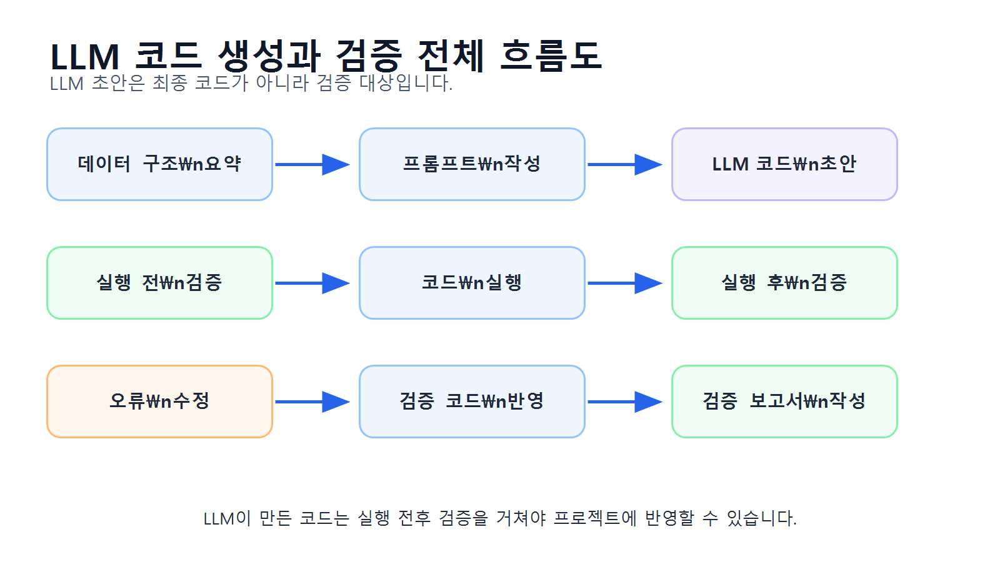
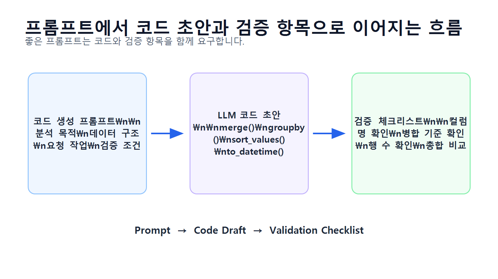
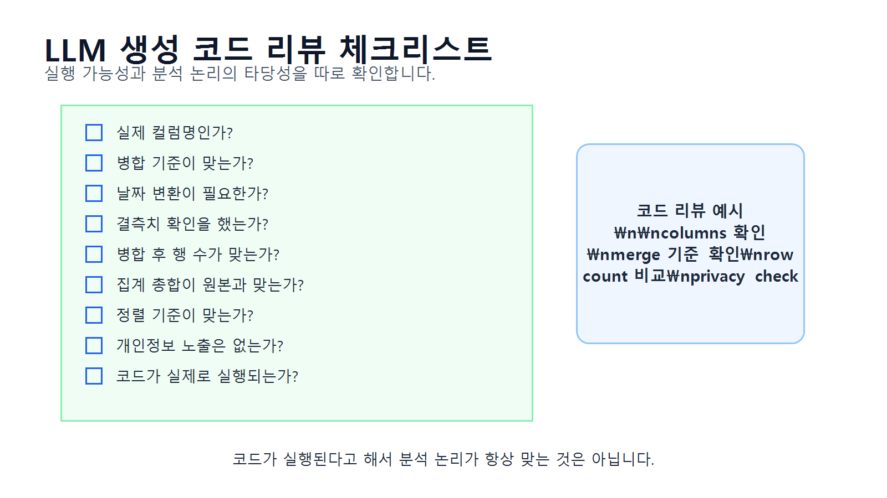
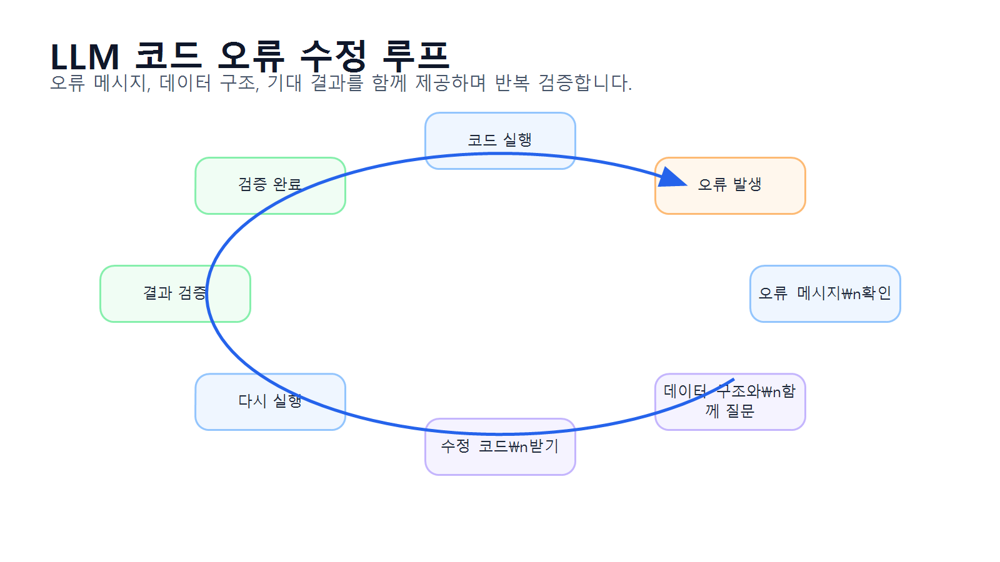
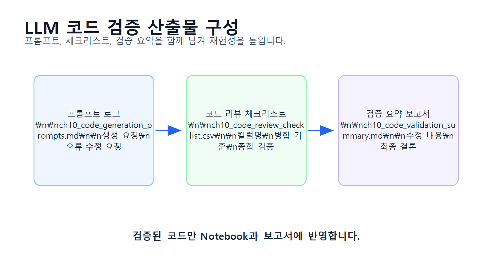

# 10장 LLM을 활용한 코드 생성과 검증

이 장에서는 LLM을 활용해 데이터 분석 코드를 생성하고, 생성된 코드를 사람이 검증·수정하는 방법을 배웁니다. Chapter 9에서는 LLM 프롬프트 기반 분석 보조의 개념과 프롬프트 작성법을 다루었다면, 이번 장에서는 한 단계 더 나아가 LLM이 작성한 pandas 코드를 실제 프로젝트에 적용하기 전에 어떻게 점검해야 하는지 실습합니다.

LLM은 pandas 코드 초안을 매우 빠르게 만들어 줄 수 있습니다. 예를 들어 카테고리별 매출 집계, 월별 매출 분석, 고객별 구매 금액 계산, 그래프 생성 코드 등을 몇 초 안에 제안할 수 있습니다. 하지만 LLM이 만든 코드가 항상 실행 가능한 것은 아닙니다. 존재하지 않는 컬럼명을 사용하거나, 병합 기준을 잘못 선택하거나, 날짜 변환을 빠뜨리거나, 결과 검증 없이 집계 코드를 작성할 수 있습니다.

따라서 LLM 기반 코드 생성에서 중요한 것은 “코드를 빨리 받는 것”이 아니라, **LLM이 만든 코드를 실제 데이터 구조와 실행 결과 기준으로 검증하는 것**입니다.

## 수업 시간 구성

| 구성 | 권장 시간 |
|---|---:|
| LLM 코드 생성의 장점과 위험 이해 |    30분 |
| 코드 생성용 데이터 구조 요약 만들기 |    30분 |
| pandas 코드 생성 프롬프트 작성 |    40분 |
| LLM 생성 코드 검토 기준 학습   |    45분 |
| 코드 실행 전 정적 검증 실습     |    40분 |
| 코드 실행 후 결과 검증 실습     |    50분 |
| 오류 수정 루프 실습          |    45분 |
| 코드 검증 보고서 작성         |    40분 |
| 연습 문제 및 심화 과제        | 60~90분 |

기본 수업은 약 5시간을 기준으로 구성되어 있습니다. LLM 답변 비교, 오류 사례 분석, 코드 리뷰 보고서 작성과 연습 문제까지 포함하면 6~7시간 분량으로 확장할 수 있습니다.

## 1. 학습 목표

이 장을 마치면 학습자는 다음을 할 수 있습니다.

* LLM을 활용한 코드 생성의 장점과 위험을 설명할 수 있습니다.
* 코드 생성 전에 데이터 구조 요약 정보를 준비할 수 있습니다.
* 분석 목적에 맞는 pandas 코드 생성 프롬프트를 작성할 수 있습니다.
* LLM이 생성한 코드에서 존재하지 않는 컬럼명을 찾을 수 있습니다.
* `merge()`, `groupby()`, `to_datetime()` 코드의 검증 포인트를 설명할 수 있습니다.
* 코드 실행 전 점검과 실행 후 점검을 구분할 수 있습니다.
* LLM 코드 실행 결과가 예상과 맞는지 확인할 수 있습니다.
* 오류 메시지를 바탕으로 수정 프롬프트를 작성할 수 있습니다.
* LLM이 생성한 코드의 위험도를 평가할 수 있습니다.
* 검증된 코드만 Notebook과 프로젝트 보고서에 반영할 수 있습니다.

## 2. 이번 장에서 만들 결과물

이번 장에서는 LLM이 생성한 데이터 분석 코드를 검증하는 실습 결과물을 만듭니다.

이번 장에서 만들 결과물은 다음과 같습니다.

* 코드 생성용 데이터 구조 요약표
* LLM 코드 생성 프롬프트
* LLM 생성 코드 검토 체크리스트
* 카테고리별 매출 코드 검증 결과
* 월별 매출 코드 검증 결과
* 고객별 구매 금액 코드 검증 결과
* 오류 수정 프롬프트 예시
* 코드 실행 전후 검증표
* `reports/ch10_code_generation_prompts.md`
* `reports/ch10_code_review_checklist.csv`
* `reports/ch10_code_validation_summary.md`

아래 그림은 LLM 코드 생성과 검증의 전체 흐름을 보여줍니다.

<figure class="figure">
  
  <figcaption>그림 10-1. LLM 코드 생성과 검증 전체 흐름도</figcaption>
</figure>

## 3. 핵심 개념

### 3.1 LLM 코드 생성이란 무엇인가

LLM 코드 생성은 사용자가 분석 목적과 데이터 구조를 설명하면 LLM이 Python, pandas, matplotlib 등의 코드를 작성해 주는 방식입니다.

예를 들어 다음과 같은 요청이 가능합니다.

* `orders`와 `order_items`를 병합해 월별 매출을 계산하는 코드 작성
* `products`와 `order_items`를 병합해 카테고리별 매출 계산
* 고객별 주문 횟수와 총 구매 금액 계산
* 결측치 확인 코드 작성
* 그래프 저장 코드 작성
* 오류 메시지를 보고 수정 코드 제안

LLM은 코드 초안을 만드는 속도가 빠르기 때문에 학습자와 실무자 모두에게 유용합니다. 하지만 LLM이 데이터 파일을 직접 확인하지 못하는 상황에서는 사용자가 제공한 정보에 의존합니다. 따라서 입력 정보가 부족하거나 모호하면 잘못된 코드를 생성할 수 있습니다.

### 3.2 LLM 코드 생성의 장점과 위험

LLM 코드 생성은 효율적이지만 검증 없이 사용하면 위험합니다.

| 구분 | 내용 |
|---|---|
| 장점 | 코드 초안을 빠르게 만들 수 있음           |
| 장점 | 초보자가 pandas 문법을 이해하는 데 도움    |
| 장점 | 오류 메시지의 원인을 설명받을 수 있음        |
| 장점 | 여러 분석 방법을 비교해 볼 수 있음         |
| 위험 | 실제 데이터에 없는 컬럼명을 사용할 수 있음     |
| 위험 | 병합 기준을 잘못 선택할 수 있음           |
| 위험 | 날짜와 숫자형 변환을 생략할 수 있음         |
| 위험 | 결측치와 중복 데이터를 무시할 수 있음        |
| 위험 | 실행은 되지만 논리적으로 틀린 결과를 만들 수 있음 |
| 위험 | 개인정보가 포함된 결과를 그대로 출력할 수 있음   |

코드가 실행된다고 해서 항상 맞는 분석은 아닙니다. 실행 오류가 없어도 병합 기준이 틀리거나, 취소 주문이 포함되거나, 날짜 정렬이 잘못되면 결과가 왜곡될 수 있습니다.

### 3.3 코드 생성 전에 준비해야 할 정보

LLM에게 좋은 코드를 받으려면 먼저 데이터 구조를 정확히 제공해야 합니다.

LLM에 제공하면 좋은 정보는 다음과 같습니다.

| 정보 | 예시 |
|---|---|
| 데이터셋 이름 | `customers`, `products`, `orders`, `order_items`   |
| 컬럼 목록   | `order_id`, `product_id`, `quantity`, `unit_price` |
| 데이터 타입  | `order_date: object`, `price: int64`               |
| 주요 키    | `product_id`, `order_id`, `customer_id`            |
| 분석 목적   | 카테고리별 매출 계산                                        |
| 원하는 결과  | `category`, `total_sales`, `sales_ratio`           |
| 검증 조건   | 병합 전후 행 수 확인                                       |
| 제약 조건   | 실제 컬럼명만 사용, 추측 금지                                  |

반대로 원본 데이터 전체, 고객명, 이메일, 전화번호, API Key 등은 입력하지 않아야 합니다.

### 3.4 좋은 코드 생성 프롬프트의 구조

좋은 코드 생성 프롬프트는 다음 요소를 포함합니다.

| 구성 요소 | 설명 |
|---|---|
| 역할     | Python 데이터 분석 강사, pandas 코드 리뷰어 등 |
| 분석 목적  | 무엇을 계산하려는지 설명                     |
| 데이터 구조 | 데이터셋과 컬럼명 제공                      |
| 요청 작업  | 단계별 작업 지시                         |
| 검증 조건  | 병합 전후 행 수, 결측치 확인 등               |
| 출력 형식  | 코드, 주석, 설명, 확인 항목                 |
| 제약 조건  | 실제 컬럼만 사용, 추측 금지                  |

아래 그림은 프롬프트가 코드 초안과 검증 항목으로 이어지는 과정을 보여줍니다.

<figure class="figure">
  
  <figcaption>그림 10-2. 프롬프트에서 코드 초안과 검증 항목으로 이어지는 흐름</figcaption>
</figure>

### 3.5 실행 전 검증과 실행 후 검증

LLM이 만든 코드는 실행 전과 실행 후에 모두 검증해야 합니다.

실행 전 검증은 코드가 실제 데이터 구조와 맞는지 확인하는 단계입니다.

| 실행 전 검증 항목 | 확인 예시 |
|---|---|
| 컬럼명 확인     | `category`가 실제 어느 DataFrame에 있는가        |
| 데이터셋 이름 확인 | `df`가 아니라 `orders`, `order_items` 사용    |
| 병합 기준 확인   | `product_id`, `order_id`, `customer_id` |
| 날짜 변환 여부   | `pd.to_datetime()` 포함 여부                |
| 숫자형 변환 여부  | `pd.to_numeric()` 필요 여부                 |
| 개인정보 출력 여부 | 고객명 노출 여부                               |

실행 후 검증은 코드 실행 결과가 논리적으로 맞는지 확인하는 단계입니다.

| 실행 후 검증 항목 | 확인 예시 |
|---|---|
| 병합 후 행 수   | `left merge` 후 행 수가 예상과 맞는가 |
| 결측치 발생     | 병합 후 `category` 누락이 있는가     |
| 집계 결과 크기   | 카테고리 수가 예상과 맞는가             |
| 총합 비교      | 집계 후 총매출이 원본 합계와 맞는가        |
| 정렬 확인      | 매출 내림차순 정렬이 되었는가            |
| 날짜 순서      | 월별 결과가 시간순으로 정렬되었는가         |

### 3.6 코드 리뷰 체크리스트

LLM 코드 검증에는 체크리스트가 필요합니다.

아래 그림은 LLM 생성 코드를 검토할 때 확인해야 할 항목을 보여줍니다.

<figure class="figure">
  
  <figcaption>그림 10-3. LLM 생성 코드 리뷰 체크리스트</figcaption>
</figure>

### 3.7 오류 수정 루프

LLM이 생성한 코드에서 오류가 발생하면 오류 메시지를 그대로 복사해서 다시 질문하는 것보다, 다음 정보를 함께 제공하는 것이 좋습니다.

* 실행한 코드
* 오류 메시지
* 관련 데이터셋의 컬럼명
* 기대한 결과
* 실제 발생한 문제
* 수정 시 지켜야 할 조건

오류 수정은 한 번에 끝나지 않을 수 있습니다. 코드를 수정하고, 다시 실행하고, 결과를 검증하는 반복 과정이 필요합니다.

<figure class="figure">
  
  <figcaption>그림 10-4. LLM 코드 오류 수정 루프</figcaption>
</figure>

## 4. 실습 시나리오

이번 장의 실습 시나리오는 다음과 같습니다.

> 온라인 쇼핑몰 분석 프로젝트에서 LLM을 사용해 pandas 분석 코드 초안을 작성하려고 합니다. 학습자는 원본 데이터를 그대로 입력하지 않고 데이터 구조 요약을 바탕으로 LLM에게 코드 생성을 요청합니다. 이후 LLM이 만든 코드를 실제 컬럼명, 병합 기준, 데이터 타입, 실행 결과 기준으로 검증하고 필요한 부분을 수정합니다.

이번 장에서 다룰 코드 생성 과제는 다음과 같습니다.

| 과제 | 분석 목적 | 주요 검증 포인트 |
|---|---|---|
| 카테고리별 매출 코드    | 상품군별 매출 비교    | `products` 병합 필요 여부      |
| 월별 매출 코드       | 시간별 매출 흐름 확인  | 날짜 변환과 월 정렬              |
| 고객별 구매 금액 코드   | 우수 고객 후보 확인   | 개인정보 익명화 여부              |
| 주문 상태별 주문 수 코드 | 주문 상태 분포 확인   | 상태값 표기 통일 여부             |
| 오류 수정 코드       | `KeyError` 해결 | 컬럼이 어느 DataFrame에 있는지 확인 |

## 5. 실습 코드

이번 장의 전체 실습은 다음 Notebook에서 진행합니다.

```text
notebooks/ch10_llm_code_generation.ipynb
```

본문에는 핵심 코드만 제공합니다.

### 5.1 기본 패키지 불러오기

```python
from pathlib import Path
import pandas as pd
```

실습 파일을 프로젝트 루트에서 실행하는 경우와 `notebooks` 폴더 안에서 실행하는 경우에는 상대 경로가 달라질 수 있습니다. 아래 코드는 현재 실행 위치를 확인한 뒤 공통 기준 폴더를 자동으로 설정합니다.

```python
current_dir = Path.cwd()

if current_dir.name == "notebooks":
    base_dir = current_dir.parent
else:
    base_dir = current_dir

processed_dir = base_dir / "data" / "processed"
report_dir = base_dir / "reports"

report_dir.mkdir(parents=True, exist_ok=True)

print("processed_dir:", processed_dir)
print("report_dir:", report_dir)
```

이 코드를 사용하면 노트북을 프로젝트 루트에서 실행하든 `notebooks` 폴더 안에서 실행하든 같은 방식으로 동작합니다.

`to_markdown()`을 사용하려면 환경에 따라 `tabulate` 패키지가 필요할 수 있습니다. 오류가 발생하면 터미널 또는 노트북에서 `pip install tabulate`를 실행하세요.

### 5.2 전처리 데이터 불러오기

```python
customers = pd.read_csv(processed_dir / "customers_clean.csv")
products = pd.read_csv(processed_dir / "products_clean.csv")
orders = pd.read_csv(processed_dir / "orders_clean.csv")
order_items = pd.read_csv(processed_dir / "order_items_clean.csv")
```

데이터셋을 딕셔너리로 정리합니다.

```python
datasets = {
    "customers": customers,
    "products": products,
    "orders": orders,
    "order_items": order_items
}
```

### 5.3 코드 생성용 데이터 구조 요약 만들기

LLM에 원본 데이터를 넣지 않고 구조 요약을 제공합니다.

```python
schema_rows = []

for name, df in datasets.items():
    schema_rows.append({
        "dataset": name,
        "rows": df.shape[0],
        "columns": df.shape[1],
        "column_list": ", ".join(df.columns),
        "dtypes": ", ".join([f"{col}: {dtype}" for col, dtype in df.dtypes.items()])
    })

schema_summary = pd.DataFrame(schema_rows)
schema_summary
```

저장합니다.

```python
schema_summary.to_csv(report_dir / "ch10_schema_summary_for_code_generation.csv", index=False)
```

### 5.4 컬럼 존재 여부 확인 함수 만들기

LLM이 만든 코드가 실제 컬럼명을 사용하는지 확인하기 위한 함수를 만듭니다.

```python
def check_columns(df, required_columns, dataset_name="DataFrame"):
    missing_columns = [col for col in required_columns if col not in df.columns]
    
    if missing_columns:
        print(f"[{dataset_name}] 누락 컬럼:", missing_columns)
    else:
        print(f"[{dataset_name}] 필요한 컬럼이 모두 존재합니다.")
    
    return missing_columns
```

예시로 확인합니다.

```python
check_columns(order_items, ["order_id", "product_id", "quantity", "unit_price", "line_total"], "order_items")
check_columns(products, ["product_id", "product_name", "category", "price"], "products")
```

### 5.5 카테고리별 매출 코드 생성 프롬프트 만들기

LLM에게 보낼 프롬프트를 만듭니다.

```python
category_sales_prompt = """
당신은 Python pandas 데이터 분석 강사입니다.

분석 목적:
온라인 쇼핑몰 데이터에서 카테고리별 매출을 계산하려고 합니다.

데이터 구조:
- order_items: order_id, product_id, quantity, unit_price, line_total
- products: product_id, product_name, category, price

요청 작업:
1. order_items와 products를 product_id 기준으로 병합
2. 병합 전후 행 수 확인
3. 병합 후 category 누락 건수 확인
4. category별 total_quantity와 total_sales 계산
5. total_sales 기준 내림차순 정렬
6. sales_ratio 컬럼 생성

제약 조건:
- 실제 컬럼명만 사용해 주세요.
- 초보자가 이해할 수 있도록 주석을 포함해 주세요.
- 실행 후 확인해야 할 항목도 함께 알려 주세요.

출력 형식:
1. pandas 코드
2. 코드 설명
3. 검증 체크리스트
"""

print(category_sales_prompt)
```

### 5.6 LLM 생성 코드 예시 검증하기

LLM이 다음 코드를 생성했다고 가정합니다.

```python
# LLM 생성 코드 예시
sales_items = order_items.merge(products, on="product_id", how="left")

print("병합 전:", order_items.shape)
print("병합 후:", sales_items.shape)
print("카테고리 누락:", sales_items["category"].isna().sum())

category_sales = (
    sales_items
    .groupby("category", as_index=False)
    .agg(
        total_quantity=("quantity", "sum"),
        total_sales=("line_total", "sum")
    )
    .sort_values("total_sales", ascending=False)
)

category_sales["sales_ratio"] = (
    category_sales["total_sales"] / category_sales["total_sales"].sum() * 100
).round(2)

category_sales
```

실행 전 필요한 컬럼을 확인합니다.

```python
check_columns(order_items, ["product_id", "quantity", "line_total"], "order_items")
check_columns(products, ["product_id", "category"], "products")
```

코드를 실행합니다.

```python
sales_items = order_items.merge(products, on="product_id", how="left")

print("병합 전:", order_items.shape)
print("병합 후:", sales_items.shape)
print("카테고리 누락:", sales_items["category"].isna().sum())

category_sales = (
    sales_items
    .groupby("category", as_index=False)
    .agg(
        total_quantity=("quantity", "sum"),
        total_sales=("line_total", "sum")
    )
    .sort_values("total_sales", ascending=False)
)

category_sales["sales_ratio"] = (
    category_sales["total_sales"] / category_sales["total_sales"].sum() * 100
).round(2)

category_sales
```

총매출이 일치하는지 검증합니다.

```python
original_total_sales = order_items["line_total"].sum()
grouped_total_sales = category_sales["total_sales"].sum()

print("원본 line_total 합계:", original_total_sales)
print("카테고리별 매출 합계:", grouped_total_sales)
print("차이:", original_total_sales - grouped_total_sales)
```

합계 차이가 0에 가깝다면 집계 결과가 원본 매출 합계와 일치한다고 볼 수 있습니다.

### 5.7 월별 매출 코드 생성 프롬프트 만들기

```python
monthly_sales_prompt = """
당신은 Python pandas 데이터 분석 강사입니다.

분석 목적:
온라인 쇼핑몰 데이터에서 월별 매출과 주문 수를 계산하려고 합니다.

데이터 구조:
- orders: order_id, customer_id, order_date, payment_method, order_status
- order_items: order_id, product_id, quantity, unit_price, line_total

요청 작업:
1. order_items와 orders를 order_id 기준으로 병합
2. 병합 전후 행 수 확인
3. order_date를 날짜형으로 변환
4. 날짜 변환 실패 건수 확인
5. order_month 컬럼 생성
6. 월별 total_sales와 order_count 계산
7. order_month 기준 오름차순 정렬

제약 조건:
- 실제 컬럼명만 사용해 주세요.
- 날짜 변환에는 errors="coerce"를 사용해 주세요.
- 초보자용 주석을 포함해 주세요.

출력 형식:
1. pandas 코드
2. 코드 설명
3. 실행 후 검증 항목
"""

print(monthly_sales_prompt)
```

### 5.8 월별 매출 코드 검증하기

LLM이 생성한 월별 매출 코드의 검증 절차입니다.

```python
check_columns(order_items, ["order_id", "line_total"], "order_items")
check_columns(orders, ["order_id", "order_date"], "orders")
```

```python
order_sales = order_items.merge(
    orders,
    on="order_id",
    how="left"
)

print("병합 전 order_items:", order_items.shape)
print("병합 후 order_sales:", order_sales.shape)
print("order_date 누락:", order_sales["order_date"].isna().sum())
```

날짜 변환과 월별 집계를 수행합니다.

```python
order_sales["order_date"] = pd.to_datetime(order_sales["order_date"], errors="coerce")
print("날짜 변환 실패:", order_sales["order_date"].isna().sum())

order_sales["order_month"] = order_sales["order_date"].dt.to_period("M").astype(str)

monthly_sales = (
    order_sales
    .groupby("order_month", as_index=False)
    .agg(
        total_sales=("line_total", "sum"),
        order_count=("order_id", "nunique")
    )
    .sort_values("order_month")
)

monthly_sales
```

총매출을 검증합니다.

```python
print("원본 line_total 합계:", order_items["line_total"].sum())
print("월별 매출 합계:", monthly_sales["total_sales"].sum())
```

### 5.9 고객별 구매 금액 코드 생성 프롬프트 만들기

```python
customer_sales_prompt = """
당신은 Python pandas 데이터 분석 강사입니다.

분석 목적:
온라인 쇼핑몰 데이터에서 고객별 구매 금액과 주문 횟수를 계산하려고 합니다.

데이터 구조:
- customers: customer_id, name, gender, age, city, signup_date
- orders: order_id, customer_id, order_date, payment_method, order_status
- order_items: order_id, product_id, quantity, unit_price, line_total

요청 작업:
1. order_items와 orders를 order_id 기준으로 병합
2. 병합 결과를 customers와 customer_id 기준으로 병합
3. 고객별 order_count와 total_sales 계산
4. avg_order_value 계산
5. total_sales 기준 내림차순 정렬
6. 개인정보 보호를 위해 그래프용 라벨은 name 대신 Customer + customer_id 형식으로 생성

제약 조건:
- 실제 컬럼명만 사용해 주세요.
- 고객명을 그대로 노출하지 않는 방법을 포함해 주세요.
- 병합 전후 행 수와 누락값 확인 코드를 포함해 주세요.

출력 형식:
1. pandas 코드
2. 코드 설명
3. 개인정보 보호 주의사항
"""

print(customer_sales_prompt)
```

### 5.10 고객별 구매 금액 코드 검증하기

```python
check_columns(order_items, ["order_id", "line_total"], "order_items")
check_columns(orders, ["order_id", "customer_id"], "orders")
check_columns(customers, ["customer_id", "city"], "customers")
```

```python
order_sales = order_items.merge(
    orders,
    on="order_id",
    how="left"
)

customer_sales_base = order_sales.merge(
    customers,
    on="customer_id",
    how="left"
)

print("order_items:", order_items.shape)
print("order_sales:", order_sales.shape)
print("customer_sales_base:", customer_sales_base.shape)
print("customer_id 누락:", customer_sales_base["customer_id"].isna().sum())
```

고객별 집계를 수행합니다.

```python
customer_sales = (
    customer_sales_base
    .groupby(["customer_id", "city"], as_index=False)
    .agg(
        order_count=("order_id", "nunique"),
        total_sales=("line_total", "sum")
    )
    .sort_values("total_sales", ascending=False)
)

customer_sales["avg_order_value"] = (
    customer_sales["total_sales"] / customer_sales["order_count"]
).round(0)

customer_sales["customer_label"] = "Customer " + customer_sales["customer_id"].astype(str)

customer_sales.head(10)
```

고객 단위 집계를 더 안전하게 하려면 `customer_id`만 기준으로 먼저 집계하고, `city` 같은 고객 속성은 이후에 병합하는 방식도 사용할 수 있습니다. 이번 예시는 샘플 데이터에서 고객의 도시가 하나로 유지된다는 전제에서 `customer_id`와 `city`를 함께 사용합니다.

주의할 점은 고객명을 사용하지 않아도 고객 ID 자체가 내부 식별자일 수 있다는 것입니다. 실제 업무에서는 익명화 기준을 별도로 정해야 합니다.

### 5.11 오류 수정 프롬프트 만들기

LLM이 다음과 같은 잘못된 코드를 생성했다고 가정합니다.

```python
wrong_code = 'category_sales = order_items.groupby("category")["line_total"].sum()'
error_message = "KeyError: 'category'"
```

이 오류는 `category` 컬럼이 `order_items`가 아니라 `products`에 있기 때문에 발생합니다.

오류 수정 프롬프트를 만듭니다.

```python
debug_prompt = f"""
당신은 pandas 코드 오류 해결 도우미입니다.

다음 코드에서 오류가 발생했습니다.

코드:
{wrong_code}

오류 메시지:
{error_message}

현재 데이터 구조:
- order_items: order_id, product_id, quantity, unit_price, line_total
- products: product_id, product_name, category, price

기대 결과:
- category별 line_total 합계를 계산하고 싶습니다.

요청:
1. 오류 원인을 설명해 주세요.
2. category 컬럼이 어느 DataFrame에 있는지 설명해 주세요.
3. 올바른 병합 순서를 제안해 주세요.
4. 수정된 pandas 코드를 작성해 주세요.
5. 병합 후 검증해야 할 항목도 포함해 주세요.
"""

print(debug_prompt)
```

### 5.12 코드 검증 체크리스트 만들기

```python
code_review_checklist = pd.DataFrame({
    "check_item": [
        "실제 데이터셋 이름을 사용했는가?",
        "실제 컬럼명만 사용했는가?",
        "필요한 컬럼 존재 여부를 확인했는가?",
        "병합 기준 컬럼이 올바른가?",
        "병합 전후 행 수를 확인했는가?",
        "병합 후 누락값을 확인했는가?",
        "날짜 컬럼을 안전하게 변환했는가?",
        "날짜 변환 실패 건수를 확인했는가?",
        "숫자형 컬럼의 타입을 확인했는가?",
        "집계 결과 총합이 원본과 일치하는가?",
        "정렬 기준이 분석 목적과 맞는가?",
        "개인정보 노출 가능성을 확인했는가?",
        "코드가 실제로 실행되는가?",
        "결과 해석에 필요한 검증 항목이 포함되었는가?"
    ],
    "result": ["□"] * 14,
    "memo": [""] * 14
})

code_review_checklist
```

저장합니다.

```python
code_review_checklist.to_csv(report_dir / "ch10_code_review_checklist.csv", index=False)
```

### 5.13 코드 검증 결과 요약표 만들기

```python
validation_summary = pd.DataFrame({
    "code_task": [
        "카테고리별 매출",
        "월별 매출",
        "고객별 구매 금액",
        "KeyError 오류 수정"
    ],
    "llm_output_status": [
        "사용 가능",
        "보완 후 사용",
        "보완 후 사용",
        "수정 필요"
    ],
    "main_issue": [
        "병합 후 누락값 확인 필요",
        "날짜 변환 실패 확인 필요",
        "고객명 노출 방지 필요",
        "category 컬럼 위치 오해"
    ],
    "fixed_action": [
        "category 결측치 확인 코드 추가",
        "pd.to_datetime(errors='coerce')와 실패 건수 확인 추가",
        "customer_label 생성으로 익명화",
        "products 병합 후 groupby 수행"
    ]
})

validation_summary
```

저장합니다.

```python
validation_summary.to_csv(report_dir / "ch10_code_validation_summary.csv", index=False)
```

### 5.14 코드 생성 프롬프트 로그 저장하기

```python
prompt_log = f"""
# Chapter 10 LLM 코드 생성 프롬프트 로그

## 1. 카테고리별 매출 코드 생성 프롬프트

~~~text
{category_sales_prompt}
~~~

## 2. 월별 매출 코드 생성 프롬프트

~~~text
{monthly_sales_prompt}
~~~

## 3. 고객별 구매 금액 코드 생성 프롬프트

~~~text
{customer_sales_prompt}
~~~

## 4. 오류 수정 프롬프트

~~~text
{debug_prompt}
~~~

## 5. 사용 원칙

- 원본 데이터 전체를 LLM에 입력하지 않았습니다.
- 컬럼명과 데이터 구조 요약만 사용했습니다.
- LLM이 만든 코드는 실행 전 컬럼명과 병합 기준을 확인했습니다.
- 실행 후 병합 결과와 집계 총합을 확인했습니다.
"""

prompt_log_path = report_dir / "ch10_code_generation_prompts.md"
prompt_log_path.write_text(prompt_log, encoding="utf-8")
```

### 5.15 코드 검증 요약 보고서 작성하기

```python
validation_report = f"""
# Chapter 10 LLM 코드 생성 및 검증 요약 보고서

## 1. 검증 목적

LLM이 생성한 pandas 분석 코드가 실제 데이터 구조와 분석 목적에 맞는지 확인했습니다.

## 2. 데이터 구조 요약

{schema_summary.to_markdown(index=False)}

## 3. 코드 검증 체크리스트

{code_review_checklist.to_markdown(index=False)}

## 4. 코드 검증 결과 요약

{validation_summary.to_markdown(index=False)}

## 5. 주요 확인 사항

- 카테고리별 매출 분석에서는 `category` 컬럼이 `products`에 있으므로 `order_items`와 `products` 병합이 필요합니다.
- 월별 매출 분석에서는 `order_date`를 날짜형으로 변환하고 변환 실패 건수를 확인해야 합니다.
- 고객별 구매 금액 분석에서는 고객명 노출을 피하고 익명화된 라벨을 사용하는 것이 좋습니다.
- LLM이 생성한 코드는 실행 전 컬럼명과 병합 기준을 확인해야 합니다.
- 코드 실행 후에는 병합 전후 행 수, 누락값, 집계 총합을 확인해야 합니다.

## 6. 결론

LLM은 pandas 코드 초안 작성에 유용하지만, 실제 데이터 구조와 실행 결과 기준의 검증 없이는 그대로 사용할 수 없습니다.
"""

validation_report_path = report_dir / "ch10_code_validation_summary.md"
validation_report_path.write_text(validation_report, encoding="utf-8")
```

아래 그림은 이번 장에서 생성하는 코드 검증 산출물 구성을 보여줍니다.

<figure class="figure">
  
  <figcaption>그림 10-5. LLM 코드 검증 산출물 구성</figcaption>
</figure>

## 6. LLM 활용 프롬프트

이번 장에서는 코드 생성과 검증을 중심으로 LLM 활용 프롬프트를 정리합니다.

### 6.1 카테고리별 매출 코드 생성 요청

```text
당신은 Python pandas 데이터 분석 강사입니다.

온라인 쇼핑몰 데이터에서 카테고리별 매출을 계산하려고 합니다.

데이터 구조:
- order_items: order_id, product_id, quantity, unit_price, line_total
- products: product_id, product_name, category, price

요청:
1. order_items와 products를 product_id 기준으로 병합
2. 병합 전후 행 수 확인
3. 병합 후 category 누락 건수 확인
4. category별 total_quantity와 total_sales 계산
5. total_sales 기준 내림차순 정렬
6. sales_ratio 컬럼 생성

조건:
- 실제 컬럼명만 사용하세요.
- 초보자용 주석을 포함하세요.
- 실행 후 검증해야 할 항목을 함께 작성하세요.
```

### 6.2 월별 매출 코드 생성 요청

```text
당신은 Python pandas 데이터 분석 강사입니다.

orders와 order_items를 사용해 월별 매출을 계산하려고 합니다.

데이터 구조:
- orders: order_id, customer_id, order_date, payment_method, order_status
- order_items: order_id, product_id, quantity, unit_price, line_total

요청:
1. order_id 기준으로 두 데이터를 병합
2. 병합 전후 행 수 확인
3. order_date를 날짜형으로 변환
4. 날짜 변환 실패 건수 확인
5. order_month 컬럼 생성
6. 월별 total_sales와 order_count 계산
7. order_month 기준으로 정렬

조건:
- 날짜 변환에는 errors="coerce"를 사용하세요.
- 실제 컬럼명만 사용하세요.
- 초보자용 주석을 포함하세요.
```

### 6.3 고객별 구매 금액 코드 생성 요청

```text
당신은 Python pandas 데이터 분석 강사입니다.

고객별 구매 금액과 주문 횟수를 계산하려고 합니다.

데이터 구조:
- customers: customer_id, name, gender, age, city, signup_date
- orders: order_id, customer_id, order_date, payment_method, order_status
- order_items: order_id, product_id, quantity, unit_price, line_total

요청:
1. order_items와 orders를 order_id 기준으로 병합
2. 병합 결과를 customers와 customer_id 기준으로 병합
3. 고객별 order_count와 total_sales 계산
4. avg_order_value 계산
5. total_sales 기준 내림차순 정렬
6. 개인정보 보호를 위해 그래프용 라벨은 name 대신 Customer + customer_id 형식으로 생성

조건:
- 고객명을 그대로 그래프에 사용하지 마세요.
- 병합 전후 행 수와 누락값 확인 코드를 포함하세요.
```

### 6.4 LLM 생성 코드 검토 요청

```text
다음 코드는 LLM이 생성한 pandas 코드입니다.

코드:
category_sales = order_items.groupby("category")["line_total"].sum()

현재 데이터 구조:
- order_items: order_id, product_id, quantity, unit_price, line_total
- products: product_id, product_name, category, price

검토 요청:
1. 이 코드가 바로 실행 가능한지 검토해 주세요.
2. 문제가 있다면 왜 문제가 되는지 설명해 주세요.
3. 올바른 분석 흐름을 제안해 주세요.
4. 수정된 코드를 작성해 주세요.
5. 실행 후 검증해야 할 항목을 알려 주세요.
```

### 6.5 코드 실행 결과 검증 요청

```text
다음은 pandas 코드 실행 결과입니다.

병합 전 order_items: (764, 6)
병합 후 sales_items: (764, 9)
category 누락: 0
원본 line_total 합계: 29600000
카테고리별 매출 합계: 29600000

이 결과를 검증 관점에서 해석해 주세요.

요청:
1. 병합 결과가 정상으로 보이는지 설명
2. 집계 결과가 원본과 일치하는지 설명
3. 추가로 확인해야 할 항목 제안
4. 보고서에 넣을 수 있는 검증 문장 작성
```

## 7. 결과 해석

이번 장의 결과는 LLM이 생성한 코드 자체가 아니라, 그 코드를 검증하는 절차와 기록입니다.

### 7.1 카테고리별 매출 코드 검증 해석

```text
카테고리별 매출 분석 코드는 order_items와 products를 product_id 기준으로 병합한 뒤 실행해야 합니다.
category 컬럼은 order_items에 없기 때문에, 병합 없이 groupby를 수행하면 오류가 발생합니다.
```

검증 포인트는 다음과 같습니다.

* `product_id`가 두 데이터에 모두 있는가?
* 병합 후 행 수가 유지되는가?
* `category` 누락값이 없는가?
* 카테고리별 매출 합계가 원본 `line_total` 합계와 일치하는가?

### 7.2 월별 매출 코드 검증 해석

```text
월별 매출 분석에서는 order_date를 날짜형으로 변환한 뒤 order_month를 생성해야 합니다.
날짜 변환 실패 건수를 확인하지 않으면 일부 주문이 월별 집계에서 누락될 수 있습니다.
```

검증 포인트는 다음과 같습니다.

* `order_id` 기준 병합이 맞는가?
* 병합 후 `order_date` 누락값이 없는가?
* 날짜 변환 실패 건수는 몇 개인가?
* 월별 매출 합계가 원본 매출 합계와 일치하는가?

### 7.3 고객별 구매 금액 코드 검증 해석

```text
고객별 구매 금액 분석에서는 orders와 order_items를 먼저 병합하고, 이후 customers를 customer_id 기준으로 연결해야 합니다.
고객명을 그대로 공개하면 개인정보 문제가 생길 수 있으므로 보고서나 그래프에서는 익명화된 라벨을 사용하는 것이 좋습니다.
```

검증 포인트는 다음과 같습니다.

* `customer_id` 기준 병합이 맞는가?
* 고객 정보 누락이 없는가?
* 주문 횟수는 `nunique()`로 계산했는가?
* 고객명을 그대로 노출하지 않았는가?

## 8. 실무 적용 포인트

실무에서 LLM 코드 생성 기능을 사용할 때는 다음 원칙을 지켜야 합니다.

1. 원본 데이터 전체를 LLM에 입력하지 않습니다.
2. 데이터 구조 요약과 분석 목적을 명확히 제공합니다.
3. 실제 컬럼명만 사용하라고 요청합니다.
4. 코드 생성 요청에는 검증 코드도 포함하도록 요구합니다.
5. LLM 코드 실행 전 컬럼명과 병합 기준을 확인합니다.
6. LLM 코드 실행 후 행 수, 결측치, 총합을 확인합니다.
7. 오류가 발생하면 코드, 오류 메시지, 데이터 구조를 함께 제공합니다.
8. 고객명이나 식별 정보가 노출되지 않도록 확인합니다.
9. 실행된 코드라도 논리적으로 맞는지 검토합니다.
10. 최종 사용한 코드는 검증 결과와 함께 기록합니다.

### LLM 코드 생성 검증 체크리스트

| 점검 항목 | 확인 |
|---|---|
| 원본 데이터 전체를 LLM에 입력하지 않았는가? | □ |
| 데이터셋 이름과 컬럼명을 정확히 제공했는가? | □ |
| 분석 목적을 명확히 작성했는가? | □ |
| 실제 컬럼명만 사용하라고 요청했는가? | □ |
| 병합 기준 컬럼을 명확히 지정했는가? | □ |
| 날짜 변환이 필요한 경우 명시했는가? | □ |
| 코드 실행 전 컬럼 존재 여부를 확인했는가? | □ |
| 병합 전후 행 수를 확인했는가? | □ |
| 병합 후 누락값을 확인했는가? | □ |
| 집계 결과 총합이 원본과 일치하는가? | □ |
| 개인정보 노출 가능성을 확인했는가? | □ |
| 오류 발생 시 수정 프롬프트를 작성했는가? | □ |
| 최종 사용 코드와 수정 내용을 기록했는가? | □ |

## 9. 연습 문제

### 기본 연습 문제

1. LLM에 입력할 코드 생성용 데이터 구조 요약표를 만드세요.

   * 제출 형식: 코드와 출력 결과
   * 포함 항목: 데이터셋 이름, 컬럼 목록, 데이터 타입

2. 카테고리별 매출 분석 코드를 요청하는 프롬프트를 작성하세요.

   * 제출 형식: 프롬프트 원문
   * 포함 항목: 데이터 구조, 요청 작업, 검증 조건

3. LLM이 생성한 카테고리별 매출 코드를 실행 전 검증하세요.

   * 제출 형식: 체크리스트
   * 포함 항목: 컬럼 존재 여부, 병합 기준

4. 월별 매출 분석 코드 생성 프롬프트를 작성하세요.

   * 제출 형식: 프롬프트 원문
   * 포함 항목: 날짜 변환, 변환 실패 확인, 월별 집계

5. LLM 코드 실행 후 병합 전후 행 수와 총합을 검증하세요.

   * 제출 형식: 코드와 검증 결과
   * 포함 항목: shape 비교, 매출 합계 비교

### 심화 과제

1. LLM이 생성한 잘못된 코드를 하나 만들고 문제점을 분석하세요.

   * 제출 형식: 잘못된 코드, 오류 원인, 수정 코드

2. `KeyError: 'category'` 오류 해결 프롬프트를 작성하세요.

   * 제출 형식: 오류 코드, 오류 메시지, 데이터 구조, 수정 요청

3. 고객별 구매 금액 분석 코드에서 개인정보 노출 가능성을 검토하세요.

   * 제출 형식: 문제점, 수정 방법, 익명화 코드

4. `reports/ch10_code_generation_prompts.md` 파일을 작성하세요.

   * 제출 형식: Markdown 파일
   * 포함 항목: 코드 생성 프롬프트, 오류 수정 프롬프트

5. `reports/ch10_code_validation_summary.md` 파일을 작성하세요.

   * 제출 형식: Markdown 파일
   * 포함 항목: 검증 목적, 검증 체크리스트, 코드별 수정 사항, 결론

## 10. 정리

이번 장에서는 LLM을 활용해 데이터 분석 코드를 생성하고, 생성된 코드를 검증하는 방법을 배웠습니다. LLM은 pandas 코드 초안을 빠르게 작성할 수 있지만, 실제 데이터 구조와 맞는지 확인하지 않으면 잘못된 분석 결과를 만들 수 있습니다.

좋은 코드 생성 프롬프트에는 분석 목적, 데이터 구조, 요청 작업, 검증 조건, 출력 형식이 포함되어야 합니다. 특히 실제 데이터에 없는 컬럼명을 만들지 말라고 명확히 요청해야 합니다.

LLM이 생성한 코드는 실행 전과 실행 후에 모두 검증해야 합니다. 실행 전에는 컬럼명, 데이터셋 이름, 병합 기준, 날짜 변환 여부를 확인합니다. 실행 후에는 병합 전후 행 수, 누락값, 집계 총합, 정렬 결과를 확인합니다.

오류가 발생했을 때는 오류 메시지만 보내는 것보다 코드, 오류 메시지, 데이터 구조, 기대 결과를 함께 제공하는 것이 좋습니다. 이렇게 하면 LLM이 오류 원인을 더 정확히 파악하고 수정 코드를 제안할 가능성이 높아집니다.

실무에서는 LLM이 만든 코드라도 최종 책임은 분석자에게 있습니다. 따라서 검증된 코드만 프로젝트에 반영하고, 사용한 프롬프트와 수정 내역을 기록해야 합니다.

다음 장에서는 이렇게 생성·검증한 분석 결과를 바탕으로 인사이트를 도출하고, 관찰 결과와 원인 가설을 구분해 해석하는 방법을 배웁니다.
