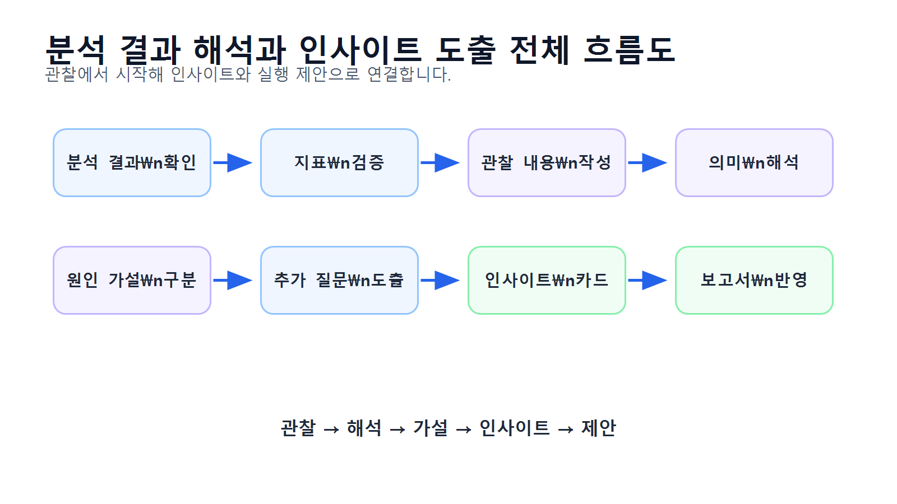
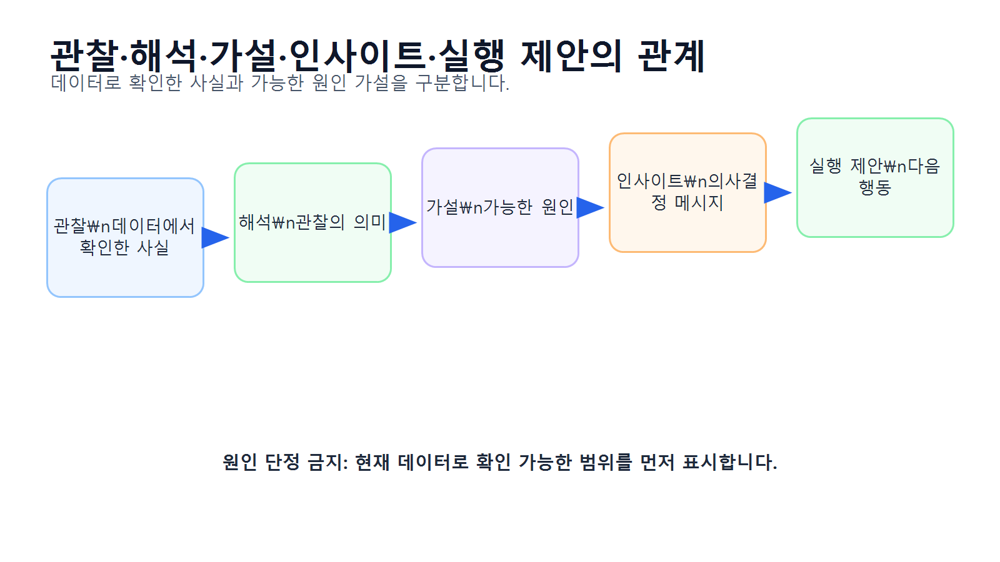
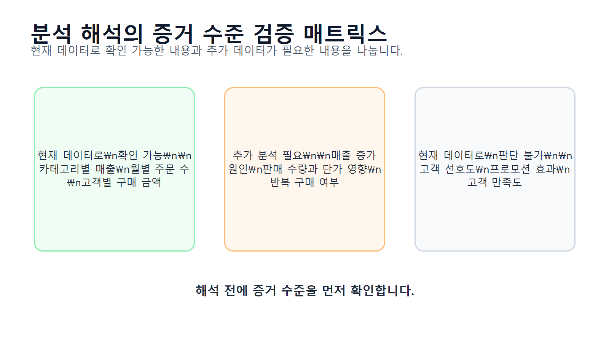
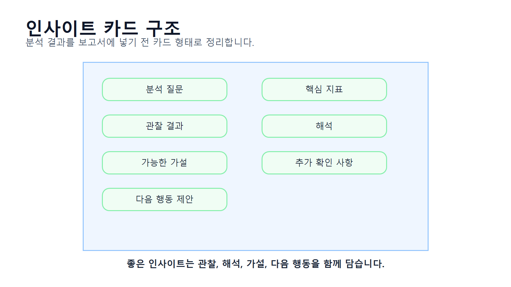
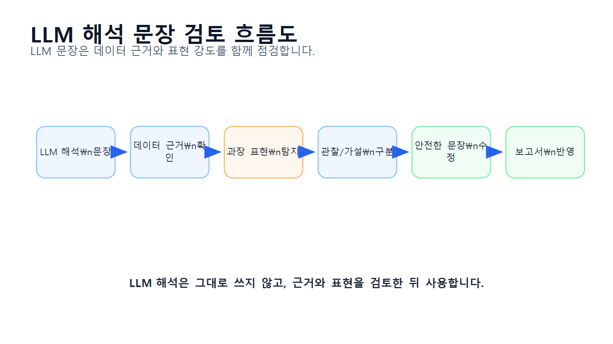

# 11장 분석 결과 해석과 인사이트 도출

이 장에서는 지금까지 계산한 분석 결과를 바탕으로 해석 문장을 작성하고, 인사이트를 도출하는 방법을 배웁니다. Chapter 10에서는 LLM을 활용해 분석 코드를 생성하고 검증하는 방법을 다루었다면, 이번 장에서는 그 결과를 사람이 이해할 수 있는 의미 있는 문장으로 바꾸는 과정에 집중합니다.

데이터 분석에서 중요한 것은 표와 그래프를 만드는 것에서 끝나지 않습니다. 카테고리별 매출표, 월별 매출 그래프, 고객별 구매 금액표가 있어도 그것이 무엇을 의미하는지 설명하지 못하면 분석 결과를 실무에 활용하기 어렵습니다.

하지만 해석은 조심해야 합니다. 매출이 높은 카테고리를 보고 바로 “고객이 이 카테고리를 좋아한다”고 단정하면 안 됩니다. 매출이 높은 이유는 판매 수량이 많아서일 수도 있고, 상품 단가가 높아서일 수도 있으며, 특정 기간의 프로모션 때문일 수도 있습니다. 데이터에 없는 원인을 단정하는 순간 분석 결과의 신뢰도가 떨어집니다.

이번 장의 핵심은 **분석 결과에서 관찰, 해석, 가설, 인사이트, 실행 제안을 구분하는 능력**입니다.

## 수업 시간 구성

| 구성 | 권장 시간 |
|---|---:|
| 분석 결과 해석의 개념 이해  |    30분 |
| 관찰·해석·가설·인사이트 구분 |    40분 |
| 주요 지표 검증과 해석 실습  |    45분 |
| 카테고리별 매출 해석 실습   |    45분 |
| 월별 매출 해석 실습      |    40분 |
| 고객별 구매 금액 해석 실습  |    45분 |
| 인사이트 카드 작성       |    45분 |
| LLM 해석 문장 검토     |    40분 |
| 연습 문제 및 심화 과제    | 60~90분 |

기본 수업은 약 3시간을 기준으로 구성되어 있습니다. 인사이트 카드 작성, 발표용 문장 작성, LLM 해석 검증까지 포함하면 최대 5시간 분량으로 확장할 수 있습니다.

## 1. 학습 목표

이 장을 마치면 학습자는 다음을 할 수 있습니다.

* 분석 결과 해석이 왜 중요한지 설명할 수 있습니다.
* 관찰, 해석, 가설, 인사이트, 실행 제안을 구분할 수 있습니다.
* 표와 그래프에서 데이터로 확인 가능한 사실을 추출할 수 있습니다.
* 데이터에 없는 원인을 단정하지 않는 문장을 작성할 수 있습니다.
* 카테고리별 매출 결과를 판매 수량, 단가, 비중 관점에서 해석할 수 있습니다.
* 월별 매출 결과를 주문 수와 평균 주문 금액 관점에서 해석할 수 있습니다.
* 고객별 구매 금액 결과를 주문 횟수와 평균 주문 금액 관점에서 해석할 수 있습니다.
* 분석 결과를 인사이트 카드 형식으로 정리할 수 있습니다.
* LLM이 작성한 해석 문장에서 과장, 추측, 원인 단정을 찾아 수정할 수 있습니다.
* 보고서에 넣을 수 있는 실무형 해석 문장을 작성할 수 있습니다.

## 2. 이번 장에서 만들 결과물

이번 장에서는 분석 결과를 해석하고 인사이트로 정리한 산출물을 만듭니다.

이번 장에서 만들 결과물은 다음과 같습니다.

* 주요 분석 결과 검증표
* 관찰·가설·추가 분석 질문 정리표
* 카테고리별 매출 인사이트 카드
* 월별 매출 인사이트 카드
* 고객별 구매 금액 인사이트 카드
* 주문 상태별 주문 수 해석 메모
* LLM 해석 문장 검토표
* 안전한 해석 문장 예시 모음
* `reports/ch11_insight_cards.csv`
* `reports/ch11_interpretation_summary.md`
* `reports/ch11_llm_interpretation_review.md`

아래 그림은 분석 결과가 해석과 인사이트로 이어지는 전체 흐름을 보여줍니다.

<figure class="figure">
  
  <figcaption>그림 11-1. 분석 결과 해석과 인사이트 도출 전체 흐름도</figcaption>
</figure>

## 3. 핵심 개념

### 3.1 분석 결과 해석이란 무엇인가

분석 결과 해석은 표, 그래프, 지표가 무엇을 의미하는지 설명하는 과정입니다.

예를 들어 다음과 같은 결과가 있다고 가정해 보겠습니다.

```text
전자기기 카테고리 매출 비중: 42.5%
생활용품 카테고리 매출 비중: 26.5%
패션 카테고리 매출 비중: 21.1%
식품 카테고리 매출 비중: 9.9%
```

이 결과에서 바로 말할 수 있는 사실은 다음입니다.

```text
전자기기 카테고리의 매출 비중이 가장 높다.
```

하지만 다음 문장은 조심해야 합니다.

```text
고객들이 전자기기를 가장 좋아하기 때문에 전자기기 매출이 높다.
```

이 문장은 “고객 선호”라는 원인을 단정하고 있습니다. 하지만 현재 데이터에 고객 선호도 조사나 클릭 로그가 없다면 이 원인을 직접 확인할 수 없습니다.

더 안전한 해석은 다음과 같습니다.

```text
전자기기 카테고리의 매출 비중이 가장 높게 나타났습니다. 다만 이 결과가 판매 수량 때문인지, 상품 단가 때문인지, 특정 기간의 프로모션 때문인지는 추가 분석이 필요합니다.
```

### 3.2 관찰, 해석, 가설, 인사이트, 실행 제안

분석 결과를 보고서에 쓸 때는 다음 단계를 구분해야 합니다.

| 구분 | 의미 | 예시 |
|---|---|---|
| 관찰    | 데이터에서 직접 확인한 사실     | 전자기기 매출 비중이 가장 높다                   |
| 해석    | 관찰 결과의 의미를 설명       | 전자기기가 전체 매출에 크게 기여한다                |
| 가설    | 가능한 원인을 조심스럽게 제시    | 단가가 높거나 판매 수량이 많았을 가능성이 있다          |
| 인사이트  | 의사결정에 도움이 되는 핵심 메시지 | 전자기기 매출 구조를 판매 수량과 단가로 분해해 볼 필요가 있다 |
| 실행 제안 | 다음 행동 방향            | 카테고리별 판매 수량과 평균 단가를 추가 분석한다         |

이 구분을 하지 않으면 데이터로 확인한 사실과 추측이 섞이게 됩니다.

아래 그림은 관찰에서 실행 제안까지 이어지는 흐름을 보여줍니다.

<figure class="figure">
  
  <figcaption>그림 11-2. 관찰·해석·가설·인사이트·실행 제안의 관계</figcaption>
</figure>

### 3.3 좋은 인사이트의 조건

좋은 인사이트는 단순한 숫자 설명이 아닙니다. 의사결정에 도움이 되는 메시지여야 합니다.

좋은 인사이트는 다음 조건을 만족합니다.

| 조건 | 설명 |
|---|---|
| 데이터 기반 | 실제 분석 결과에 근거해야 함       |
| 구체성    | 어떤 지표가 어떻게 다른지 명확해야 함  |
| 해석 가능성 | 왜 중요한지 설명할 수 있어야 함     |
| 한계 인식  | 데이터로 알 수 없는 부분을 구분해야 함 |
| 실행 연결  | 다음 분석이나 업무 행동으로 이어져야 함 |

예를 들어 다음 문장은 단순한 관찰입니다.

```text
전자기기 매출이 가장 높다.
```

다음 문장은 인사이트에 더 가깝습니다.

```text
전자기기 카테고리가 전체 매출에서 가장 큰 비중을 차지하므로, 해당 카테고리의 매출 구조를 판매 수량과 평균 단가로 분해해 추가 확인할 필요가 있습니다.
```

두 번째 문장은 데이터 기반 관찰에서 출발해 다음 분석 방향까지 제안하고 있습니다.

### 3.4 과장된 해석과 안전한 해석

LLM이나 초보 분석자가 자주 하는 실수는 결과를 과장하거나 원인을 단정하는 것입니다.

| 위험한 문장 | 문제점 | 안전한 문장 |
|---|---|---|
| 전자기기는 고객 선호도가 가장 높다 | 선호도 데이터 없음     | 전자기기의 매출 비중이 가장 높다        |
| 4월 프로모션이 성공했다       | 프로모션 데이터 없음    | 4월 매출이 증가했으며 원인 확인이 필요하다  |
| 상위 고객은 충성 고객이다      | 반복 구매 여부 확인 필요 | 상위 고객은 총 구매 금액이 높다        |
| 식품은 인기가 없다          | 매출만으로 인기 단정 불가 | 식품 카테고리의 매출 비중이 낮다        |
| 매출이 계속 성장하고 있다      | 기간이 짧을 수 있음    | 관찰 기간 내 일부 월에서 증가 흐름이 보인다 |

보고서에서는 데이터로 직접 확인한 사실과 추가 확인이 필요한 가설을 구분해야 합니다.

### 3.5 증거 수준을 확인해야 하는 이유

모든 분석 결과가 같은 수준의 증거를 갖는 것은 아닙니다.

예를 들어 다음은 데이터로 직접 확인할 수 있는 사실입니다.

* 카테고리별 매출 합계
* 월별 주문 수
* 고객별 총 구매 금액
* 주문 상태별 주문 수

반면 다음은 추가 데이터가 필요한 해석입니다.

* 고객 선호도
* 프로모션 효과
* 광고 효과
* 재구매 의도
* 이탈 원인

따라서 해석을 작성할 때는 “현재 데이터로 확인 가능”, “추가 분석 필요”, “현재 데이터로 판단 불가”를 구분해야 합니다.

아래 그림은 분석 결과의 증거 수준을 점검하는 기준을 보여줍니다.

<figure class="figure">
  
  <figcaption>그림 11-3. 분석 해석의 증거 수준 검증 매트릭스</figcaption>
</figure>

### 3.6 인사이트 카드란 무엇인가

인사이트 카드는 분석 결과를 간결하게 정리하는 템플릿입니다. 보고서나 발표 자료를 만들 때 유용합니다.

이번 장에서는 다음 구조의 인사이트 카드를 사용합니다.

| 항목 | 내용 |
|---|---|
| 분석 질문 | 무엇을 알고 싶었는가    |
| 핵심 지표 | 어떤 지표를 봤는가     |
| 관찰 결과 | 데이터에서 확인한 사실   |
| 해석    | 결과가 의미하는 바     |
| 가설    | 가능한 원인         |
| 추가 확인 | 더 분석해야 할 내용    |
| 제안    | 다음 행동 또는 분석 방향 |

아래 그림은 인사이트 카드의 구조를 보여줍니다.

<figure class="figure">
  
  <figcaption>그림 11-4. 인사이트 카드 구조</figcaption>
</figure>

## 4. 실습 시나리오

이번 장의 실습 시나리오는 다음과 같습니다.

> 온라인 쇼핑몰 운영 데이터를 분석한 결과, 카테고리별 매출, 월별 매출, 고객별 구매 금액, 주문 상태별 주문 수 결과가 만들어졌습니다. 이제 데이터 분석가는 이 결과를 운영자에게 설명할 수 있도록 해석 문장을 작성하고, 추가 분석 질문과 실행 제안을 정리해야 합니다. 단, 데이터에 없는 원인을 단정하지 않고 관찰과 가설을 구분해야 합니다.

이번 장에서 해석할 주요 분석 결과는 다음과 같습니다.

| 분석 결과 | 핵심 질문 | 해석 포인트 |
|---|---|---|
| 카테고리별 매출     | 어떤 카테고리가 매출에 기여하는가?  | 매출 비중, 판매 수량, 평균 단가      |
| 월별 매출        | 매출은 시간에 따라 어떻게 변하는가? | 매출 추세, 주문 수, 평균 주문 금액    |
| 고객별 구매 금액    | 구매 금액이 높은 고객은 누구인가?  | 총 구매 금액, 주문 횟수, 평균 주문 금액 |
| 주문 상태별 주문 수  | 주문 상태는 어떻게 분포하는가?    | 완료, 취소, 대기 주문 비중         |
| 상품 가격과 판매 수량 | 가격과 판매 수량은 관계가 있는가?  | 산점도 패턴, 추가 분석 필요         |

## 5. 실습 코드

이번 장의 전체 실습은 다음 Notebook에서 진행합니다.

```text
notebooks/ch11_insight_interpretation.ipynb
```

본문에는 핵심 코드만 제공합니다.

### 5.1 기본 패키지 불러오기

```python
from pathlib import Path
import pandas as pd
```

실습 파일을 프로젝트 루트에서 실행하는 경우와 `notebooks` 폴더 안에서 실행하는 경우에는 상대 경로가 달라질 수 있습니다. 아래 코드는 현재 실행 위치를 확인한 뒤 공통 기준 폴더를 자동으로 설정합니다.

```python
current_dir = Path.cwd()

if current_dir.name == "notebooks":
    base_dir = current_dir.parent
else:
    base_dir = current_dir

report_dir = base_dir / "reports"
report_dir.mkdir(parents=True, exist_ok=True)

print("report_dir:", report_dir)
```

이 코드는 프로젝트 루트에서 실행하든 `notebooks` 폴더에서 실행하든 같은 방식으로 동작합니다.

`to_markdown()`을 사용하려면 환경에 따라 `tabulate` 패키지가 필요할 수 있습니다. 오류가 발생하면 터미널 또는 노트북에서 `pip install tabulate`를 실행하세요.

```text
pip install tabulate
```

### 5.2 이전 장 분석 결과 불러오기

Chapter 8 또는 Chapter 10에서 저장한 분석 결과를 불러옵니다.

```python
category_sales = pd.read_csv(report_dir / "ch08_category_sales.csv")
monthly_sales = pd.read_csv(report_dir / "ch08_monthly_sales.csv")
customer_sales = pd.read_csv(report_dir / "ch08_customer_sales.csv")
```

파일이 없는 경우에는 Chapter 8의 중간 프로젝트 Notebook을 먼저 실행해야 합니다.

```python
print(category_sales.head())
print(monthly_sales.head())
print(customer_sales.head())
```

### 5.3 분석 결과 기본 검증하기

해석 전에 결과가 비어 있지 않은지 확인합니다.

```python
print("category_sales:", category_sales.shape)
print("monthly_sales:", monthly_sales.shape)
print("customer_sales:", customer_sales.shape)
```

주요 컬럼을 확인합니다.

```python
print("category_sales columns:", list(category_sales.columns))
print("monthly_sales columns:", list(monthly_sales.columns))
print("customer_sales columns:", list(customer_sales.columns))
```

해석은 검증된 결과를 바탕으로 작성해야 합니다.

### 5.4 카테고리별 매출 결과 해석 준비

카테고리별 매출 상위 항목을 확인합니다.

```python
category_sales_sorted = category_sales.sort_values("total_sales", ascending=False)
category_sales_sorted
```

가장 매출이 높은 카테고리를 추출합니다.

```python
top_category = category_sales_sorted.iloc[0]

top_category_name = top_category["category"]
top_category_sales = top_category["total_sales"]
top_category_ratio = top_category["sales_ratio"]

print("매출 1위 카테고리:", top_category_name)
print("매출:", top_category_sales)
print("매출 비중:", top_category_ratio)
```

카테고리별 판매 수량과 매출을 함께 봅니다.

```python
category_sales_sorted[["category", "total_quantity", "total_sales", "sales_ratio"]]
```

판매 수량과 매출은 서로 다른 의미를 가집니다. 판매 수량이 많아서 매출이 높은 것인지, 단가가 높아서 매출이 높은 것인지 추가 확인이 필요합니다.

### 5.5 카테고리별 평균 판매 단가 계산하기

카테고리별 평균 판매 단가를 계산합니다.

```python
category_sales_sorted["avg_unit_revenue"] = (
    category_sales_sorted["total_sales"] / category_sales_sorted["total_quantity"]
).round(0)

category_sales_sorted
```

이 지표를 사용하면 매출이 높은 이유를 조금 더 조심스럽게 탐색할 수 있습니다.

```python
category_interpretation = f"""
카테고리별 매출 결과에서 {top_category_name} 카테고리의 매출 비중이 가장 높게 나타났습니다.
이는 해당 카테고리가 전체 매출에 크게 기여하고 있음을 의미합니다.
다만 매출이 높은 이유가 판매 수량 때문인지, 평균 판매 단가 때문인지는 추가로 확인해야 합니다.
따라서 카테고리별 total_quantity와 avg_unit_revenue를 함께 비교하는 것이 필요합니다.
"""

print(category_interpretation)
```

### 5.6 월별 매출 결과 해석 준비

월별 매출을 확인합니다.

```python
monthly_sales_sorted = monthly_sales.sort_values("order_month")
monthly_sales_sorted
```

매출이 가장 높은 월을 확인합니다.

```python
top_month = monthly_sales_sorted.sort_values("total_sales", ascending=False).iloc[0]

top_month_name = top_month["order_month"]
top_month_sales = top_month["total_sales"]
top_month_orders = top_month["order_count"]

print("매출이 가장 높은 월:", top_month_name)
print("매출:", top_month_sales)
print("주문 수:", top_month_orders)
```

전월 대비 증감률을 계산합니다.

```python
monthly_sales_sorted["sales_change"] = monthly_sales_sorted["total_sales"].diff()
monthly_sales_sorted["sales_change_ratio"] = (
    monthly_sales_sorted["total_sales"].pct_change() * 100
).round(2)

monthly_sales_sorted
```

월별 매출 해석 문장을 작성합니다.

```python
monthly_interpretation = f"""
월별 매출 결과에서 {top_month_name}의 매출이 가장 높게 나타났습니다.
이 월의 주문 수는 {top_month_orders}건입니다.
다만 매출 증가의 원인이 주문 수 증가 때문인지, 평균 주문 금액 증가 때문인지는 추가 확인이 필요합니다.
월별 total_sales, order_count, avg_order_value를 함께 비교해야 더 안전한 해석이 가능합니다.
"""

print(monthly_interpretation)
```

### 5.7 고객별 구매 금액 결과 해석 준비

구매 금액 상위 고객을 확인합니다.

```python
customer_sales_sorted = customer_sales.sort_values("total_sales", ascending=False)
customer_sales_sorted.head(10)
```

고객별 구매 금액을 해석할 때는 총 구매 금액만 보지 않고 주문 횟수와 평균 주문 금액도 함께 봐야 합니다.

```python
if "avg_order_value" not in customer_sales_sorted.columns:
    customer_sales_sorted["avg_order_value"] = (
        customer_sales_sorted["total_sales"] / customer_sales_sorted["order_count"]
    ).round(0)

customer_sales_sorted.head(10)
```

상위 고객의 해석 문장을 작성합니다.

```python
top_customer = customer_sales_sorted.iloc[0]

customer_interpretation = f"""
구매 금액 기준 상위 고객은 전체 고객 중 총 구매 금액이 가장 높은 고객입니다.
다만 총 구매 금액이 높다는 사실만으로 충성 고객이라고 단정할 수는 없습니다.
주문 횟수가 많은 반복 구매 고객인지, 한 번에 큰 금액을 구매한 고객인지 구분해야 합니다.
따라서 total_sales와 함께 order_count, avg_order_value를 함께 확인해야 합니다.
"""

print(customer_interpretation)
```

### 5.8 관찰·가설·추가 분석 질문 정리표 만들기

분석 결과별로 관찰, 가설, 추가 질문을 정리합니다.

```python
interpretation_table = pd.DataFrame({
    "analysis_area": [
        "카테고리별 매출",
        "월별 매출",
        "고객별 구매 금액"
    ],
    "observation": [
        f"{top_category_name} 카테고리의 매출 비중이 가장 높게 나타났습니다.",
        f"{top_month_name}의 월별 매출이 가장 높게 나타났습니다.",
        "구매 금액 상위 고객은 전체 고객 중 총 구매 금액이 높은 고객입니다."
    ],
    "hypothesis": [
        "판매 수량이 많거나 평균 판매 단가가 높았을 가능성이 있습니다.",
        "주문 수 증가 또는 평균 주문 금액 증가가 영향을 주었을 가능성이 있습니다.",
        "반복 구매 또는 일회성 고액 구매가 영향을 주었을 가능성이 있습니다."
    ],
    "additional_question": [
        "카테고리별 판매 수량과 평균 판매 단가는 어떻게 다른가?",
        "해당 월의 주문 수와 평균 주문 금액은 어떻게 변했는가?",
        "상위 고객은 주문 횟수가 많은가, 평균 주문 금액이 높은가?"
    ]
})

interpretation_table
```

저장합니다.

```python
interpretation_table.to_csv(report_dir / "ch11_interpretation_table.csv", index=False)
```

### 5.9 인사이트 카드 만들기

인사이트 카드는 분석 결과를 보고서나 발표 자료에 바로 활용할 수 있는 형태로 정리한 것입니다.

```python
insight_cards = pd.DataFrame({
    "insight_title": [
        "카테고리별 매출 기여도 확인",
        "월별 매출 변동 확인",
        "구매 금액 상위 고객 특성 확인"
    ],
    "analysis_question": [
        "카테고리별 매출은 어떻게 다른가?",
        "월별 매출과 주문 수는 어떻게 변하는가?",
        "구매 금액 상위 고객은 누구인가?"
    ],
    "key_metric": [
        "total_sales, sales_ratio, total_quantity",
        "total_sales, order_count, avg_order_value",
        "total_sales, order_count, avg_order_value"
    ],
    "observation": [
        f"{top_category_name} 카테고리의 매출 비중이 가장 높게 나타났습니다.",
        f"{top_month_name}의 매출이 가장 높게 나타났습니다.",
        "구매 금액 상위 고객은 총 구매 금액 기준으로 확인되었습니다."
    ],
    "interpretation": [
        "해당 카테고리가 전체 매출에 크게 기여하고 있습니다.",
        "특정 월에 매출이 집중되었을 가능성이 있습니다.",
        "상위 고객군은 매출 기여도가 높아 별도 분석 가치가 있습니다."
    ],
    "caution": [
        "매출이 높은 이유를 고객 선호로 단정할 수 없습니다.",
        "매출 증가 원인을 프로모션이나 계절성으로 단정할 수 없습니다.",
        "총 구매 금액만으로 충성 고객이라고 단정할 수 없습니다."
    ],
    "next_step": [
        "판매 수량과 평균 판매 단가를 함께 분석합니다.",
        "주문 수와 평균 주문 금액 변화를 함께 확인합니다.",
        "주문 횟수와 평균 주문 금액을 기준으로 고객 유형을 나눕니다."
    ]
})

insight_cards
```

저장합니다.

```python
insight_cards.to_csv(report_dir / "ch11_insight_cards.csv", index=False)
```

### 5.10 LLM 해석 문장 검토표 만들기

LLM이 작성한 해석 문장을 검토하기 위한 표를 만듭니다.

```python
llm_interpretation_review = pd.DataFrame({
    "llm_sentence": [
        "전자기기 매출이 가장 높은 이유는 고객들이 전자기기를 가장 선호하기 때문입니다.",
        "4월 매출이 증가했으므로 프로모션이 성공했다고 볼 수 있습니다.",
        "구매 금액 상위 고객은 충성 고객입니다."
    ],
    "problem": [
        "고객 선호도 데이터가 없는데 원인을 단정했습니다.",
        "프로모션 데이터가 없는데 원인을 단정했습니다.",
        "반복 구매 여부를 확인하지 않고 충성 고객으로 단정했습니다."
    ],
    "safe_sentence": [
        "전자기기 카테고리의 매출 비중이 가장 높게 나타났습니다. 다만 고객 선호, 단가, 판매 수량 중 어떤 요인이 영향을 주었는지는 추가 분석이 필요합니다.",
        "4월 매출이 증가한 것으로 나타났습니다. 다만 이 증가가 프로모션 때문인지는 관련 데이터가 추가로 필요합니다.",
        "구매 금액 상위 고객은 매출 기여도가 높은 고객입니다. 다만 충성 고객 여부는 주문 횟수와 재구매 패턴을 함께 확인해야 합니다."
    ]
})

llm_interpretation_review
```

저장합니다.

```python
llm_interpretation_review.to_csv(report_dir / "ch11_llm_interpretation_review.csv", index=False)
```

아래 그림은 LLM이 작성한 해석 문장을 사람이 검토하고 수정하는 흐름을 보여줍니다.

<figure class="figure">
  
  <figcaption>그림 11-5. LLM 해석 문장 검토 흐름도</figcaption>
</figure>

### 5.11 해석 요약 보고서 작성하기

```python
summary_text = f"""
# Chapter 11 분석 결과 해석과 인사이트 요약 보고서

## 1. 목적

이번 보고서는 온라인 쇼핑몰 분석 결과를 바탕으로 관찰, 해석, 가설, 추가 분석 질문을 구분해 정리하는 것을 목적으로 합니다.

## 2. 주요 해석 결과

{interpretation_table.to_markdown(index=False)}

## 3. 인사이트 카드

{insight_cards.to_markdown(index=False)}

## 4. LLM 해석 문장 검토

{llm_interpretation_review.to_markdown(index=False)}

## 5. 해석 시 주의사항

- 데이터로 확인한 사실과 원인 가설을 구분해야 합니다.
- 매출이 높다는 사실만으로 고객 선호를 단정할 수 없습니다.
- 월별 매출 변화의 원인을 설명하려면 프로모션, 계절성, 광고, 재고 등의 추가 데이터가 필요합니다.
- 고객별 구매 금액만으로 충성 고객 여부를 판단하기 어렵습니다.
- LLM이 작성한 해석 문장은 반드시 데이터 근거와 비교해 검토해야 합니다.

## 6. 다음 단계

- 카테고리별 매출을 판매 수량과 평균 판매 단가로 분해합니다.
- 월별 매출을 주문 수와 평균 주문 금액으로 분해합니다.
- 고객별 구매 금액을 주문 횟수와 평균 주문 금액으로 나누어 고객 유형을 분석합니다.
- 검증된 해석 문장을 바탕으로 최종 분석 보고서를 작성합니다.
"""

summary_path = report_dir / "ch11_interpretation_summary.md"
summary_path.write_text(summary_text, encoding="utf-8")
```

### 5.12 LLM 검토 보고서 작성하기

```python
llm_review_text = f"""
# Chapter 11 LLM 해석 문장 검토 보고서

## 1. 검토 목적

LLM이 작성한 분석 해석 문장이 실제 데이터에 근거하는지, 원인을 과도하게 단정하지 않는지 검토했습니다.

## 2. 검토 결과

{llm_interpretation_review.to_markdown(index=False)}

## 3. 주요 수정 원칙

- 원인 단정 표현을 피합니다.
- 데이터로 확인한 사실과 가설을 구분합니다.
- 현재 데이터로 확인할 수 없는 내용은 추가 분석 필요로 표시합니다.
- 고객 선호, 프로모션 효과, 충성 고객 여부처럼 추가 데이터가 필요한 표현은 조심해서 사용합니다.

## 4. 결론

LLM은 자연스러운 해석 문장을 작성하는 데 도움을 줄 수 있지만, 해석의 타당성은 사람이 데이터 기준으로 검토해야 합니다.
"""

llm_review_path = report_dir / "ch11_llm_interpretation_review.md"
llm_review_path.write_text(llm_review_text, encoding="utf-8")
```

## 6. LLM 활용 프롬프트

LLM은 분석 결과 해석 문장을 작성하는 데 도움을 줄 수 있습니다. 하지만 LLM이 원인을 단정하거나 데이터에 없는 내용을 추측할 수 있으므로 검토가 필요합니다.

### 6.1 분석 결과 해석 요청

```text
당신은 데이터 분석 보고서 작성 도우미입니다.

다음은 온라인 쇼핑몰 카테고리별 매출 분석 결과입니다.

category,total_quantity,total_sales,sales_ratio
전자기기,320,12500000,42.5
생활용품,510,7800000,26.5
패션,260,6200000,21.1
식품,430,2900000,9.9

요청:
1. 데이터로 확인 가능한 관찰 내용을 작성해 주세요.
2. 가능한 원인 가설을 조심스럽게 작성해 주세요.
3. 추가로 확인해야 할 분석 질문을 제안해 주세요.
4. 보고서에 넣을 수 있는 문장으로 정리해 주세요.

조건:
- 고객 선호, 프로모션 효과 같은 원인을 단정하지 마세요.
- 데이터에 없는 내용을 추측하지 마세요.
- 관찰과 가설을 구분해 주세요.
```

### 6.2 과장된 해석 수정 요청

```text
다음 문장은 데이터 분석 보고서에 넣기에는 과장된 표현이 포함되어 있습니다.

문장:
전자기기 매출이 가장 높은 이유는 고객들이 전자기기를 가장 좋아하기 때문입니다. 따라서 전자기기 상품을 더 많이 팔면 매출이 증가할 것입니다.

요청:
1. 이 문장의 문제점을 설명해 주세요.
2. 데이터로 확인한 사실과 추측을 구분해 주세요.
3. 더 안전한 보고서 문장으로 수정해 주세요.
4. 추가로 확인해야 할 데이터 항목을 제안해 주세요.
```

### 6.3 월별 매출 해석 요청

```text
다음은 월별 매출 분석 결과입니다.

order_month,total_sales,order_count,avg_order_value
2024-01,3200000,42,76190
2024-02,4100000,51,80392
2024-03,3900000,49,79591
2024-04,5200000,63,82540

요청:
1. 월별 매출 흐름을 해석해 주세요.
2. 매출 증가가 주문 수 때문인지 평균 주문 금액 때문인지 확인할 방법을 설명해 주세요.
3. 원인을 단정하지 않는 안전한 문장으로 작성해 주세요.
4. 추가 분석 질문 3개를 제안해 주세요.
```

### 6.4 고객별 구매 금액 해석 요청

```text
다음은 고객별 구매 금액 상위 결과입니다.

customer_id,city,order_count,total_sales,avg_order_value
C001,Seoul,2,950000,475000
C014,Busan,8,870000,108750
C032,Incheon,1,810000,810000

요청:
1. 총 구매 금액 기준 상위 고객을 해석해 주세요.
2. 일회성 고액 구매 고객과 반복 구매 고객을 구분해야 하는 이유를 설명해 주세요.
3. 충성 고객이라고 단정하지 않는 안전한 표현으로 작성해 주세요.
4. 추가로 확인해야 할 지표를 제안해 주세요.
```

### 6.5 인사이트 카드 작성 요청

```text
다음 분석 결과를 바탕으로 인사이트 카드를 작성해 주세요.

분석 질문:
카테고리별 매출은 어떻게 다른가?

주요 결과:
전자기기 카테고리의 매출 비중이 가장 높음

사용 가능한 지표:
- total_sales
- sales_ratio
- total_quantity
- avg_unit_revenue

인사이트 카드 형식:
1. 분석 질문
2. 핵심 지표
3. 관찰 결과
4. 해석
5. 가능한 가설
6. 추가 확인 사항
7. 다음 행동 제안

조건:
- 데이터에 없는 원인을 단정하지 말 것
- 고객 선호라고 단정하지 말 것
- 추가 분석 질문을 포함할 것
```

### 6.6 LLM 해석 문장 검토 요청

```text
다음은 LLM이 작성한 분석 해석 문장입니다.

1. 전자기기 매출이 가장 높은 이유는 고객들이 전자기기를 가장 선호하기 때문입니다.
2. 4월 매출이 증가했으므로 프로모션이 성공했다고 볼 수 있습니다.
3. 구매 금액 상위 고객은 충성 고객입니다.

현재 데이터에는 고객 선호도, 프로모션 여부, 재구매 의도 데이터가 없습니다.

요청:
1. 각 문장의 문제점을 설명해 주세요.
2. 데이터로 확인 가능한 표현으로 수정해 주세요.
3. 추가로 필요한 데이터나 분석을 제안해 주세요.
```

## 7. 결과 해석

이번 장의 결과는 분석 결과를 더 깊이 이해하기 위한 해석과 인사이트입니다.

### 7.1 카테고리별 매출 해석

카테고리별 매출 결과에서 가장 먼저 볼 것은 매출 합계와 매출 비중입니다.

```text
카테고리별 매출 결과에서 특정 카테고리의 매출 비중이 가장 높게 나타났다면, 해당 카테고리가 전체 매출에 크게 기여하고 있다고 해석할 수 있습니다.
```

하지만 매출이 높다는 사실만으로 고객 선호를 단정할 수 없습니다. 판매 수량이 많았는지, 평균 판매 단가가 높았는지, 특정 기간의 주문이 집중되었는지 추가 분석이 필요합니다.

### 7.2 월별 매출 해석

월별 매출 결과는 시간에 따른 변화를 보여줍니다.

```text
월별 매출 결과를 통해 특정 월의 매출 증가 또는 감소를 확인할 수 있습니다.
```

하지만 특정 월의 매출 증가를 프로모션 성공이나 계절성으로 바로 해석하면 안 됩니다. 현재 데이터에 프로모션, 광고, 시즌 이벤트 정보가 없다면 원인 분석은 가설 수준으로만 표현해야 합니다.

### 7.3 고객별 구매 금액 해석

고객별 구매 금액 결과는 매출 기여도가 높은 고객을 확인하는 데 유용합니다.

```text
총 구매 금액이 높은 고객은 매출 기여도가 높은 고객으로 볼 수 있습니다.
```

그러나 총 구매 금액이 높다고 해서 곧바로 충성 고객이라고 판단하면 안 됩니다. 충성 고객 여부를 판단하려면 반복 구매 횟수, 구매 주기, 최근 구매일, 재구매율 같은 추가 지표가 필요합니다.

### 7.4 주문 상태별 주문 수 해석

주문 상태별 주문 수는 완료, 취소, 대기 주문의 분포를 보여줍니다.

```text
주문 상태별 주문 수를 확인하면 분석에 포함해야 할 주문과 제외해야 할 주문을 판단하는 데 도움이 됩니다.
```

취소 주문이 매출 계산에 포함되어 있다면 실제 매출이 과대 계산될 수 있습니다. 따라서 매출 분석에서는 주문 상태 처리 기준을 명확히 기록해야 합니다.

## 8. 실무 적용 포인트

실무에서 분석 결과를 해석할 때는 다음 원칙을 지켜야 합니다.

1. 데이터로 확인한 사실부터 작성합니다.
2. 원인은 단정하지 않고 가설로 표현합니다.
3. 추가 분석이 필요한 부분을 명시합니다.
4. 한 가지 지표만 보고 결론을 내리지 않습니다.
5. 매출은 판매 수량과 단가로 나누어 봅니다.
6. 월별 변화는 주문 수와 평균 주문 금액을 함께 봅니다.
7. 고객별 구매 금액은 주문 횟수와 함께 해석합니다.
8. 취소 주문이나 환불 주문 처리 기준을 확인합니다.
9. LLM이 작성한 해석 문장은 반드시 검토합니다.
10. 인사이트는 다음 행동이나 추가 분석으로 연결되어야 합니다.

### 분석 결과 해석 체크리스트

| 점검 항목 | 확인 |
|---|---|
| 데이터로 확인한 사실을 먼저 작성했는가? | □ |
| 원인 단정 표현을 피했는가? | □ |
| 관찰과 가설을 구분했는가? | □ |
| 추가 분석 질문을 제시했는가? | □ |
| 매출을 판매 수량과 단가 관점에서 검토했는가? | □ |
| 월별 매출을 주문 수와 평균 주문 금액으로 함께 봤는가? | □ |
| 고객별 구매 금액을 주문 횟수와 함께 해석했는가? | □ |
| 현재 데이터로 판단할 수 없는 내용을 구분했는가? | □ |
| LLM 해석 문장에서 과장 표현을 수정했는가? | □ |
| 인사이트가 다음 행동 또는 추가 분석으로 연결되는가? | □ |

## 9. 연습 문제

### 기본 연습 문제

1. 카테고리별 매출 결과에서 가장 매출이 높은 카테고리를 찾고 해석 문장을 작성하세요.

   * 제출 형식: 코드와 해석 문장
   * 조건: 고객 선호라고 단정하지 말 것

2. 월별 매출 결과에서 매출이 가장 높은 월을 찾고 해석 문장을 작성하세요.

   * 제출 형식: 코드와 해석 문장
   * 조건: 프로모션이나 계절성을 단정하지 말 것

3. 고객별 구매 금액 상위 10명을 확인하고 해석 문장을 작성하세요.

   * 제출 형식: 결과표와 해석 문장
   * 조건: 충성 고객이라고 단정하지 말 것

4. 관찰, 가설, 추가 분석 질문을 구분한 표를 작성하세요.

   * 제출 형식: DataFrame 또는 Markdown 표
   * 포함 항목: 분석 영역, 관찰, 가설, 추가 질문

5. LLM이 작성한 과장된 해석 문장을 안전한 문장으로 수정하세요.

   * 제출 형식: 원문, 문제점, 수정 문장

### 심화 과제

1. 카테고리별 매출을 판매 수량과 평균 판매 단가로 분해해 해석하세요.

   * 제출 형식: 코드, 결과표, 해석 문장

2. 월별 매출 변화를 주문 수와 평균 주문 금액으로 나누어 해석하세요.

   * 제출 형식: 코드, 결과표, 해석 문장

3. 고객별 구매 금액 상위 고객을 반복 구매형과 고액 구매형으로 구분하는 기준을 제안하세요.

   * 제출 형식: 기준표와 설명

4. 인사이트 카드 3개를 작성하세요.

   * 제출 형식: Markdown 표 또는 CSV
   * 포함 항목: 분석 질문, 관찰, 해석, 가설, 추가 확인, 제안

5. `reports/ch11_interpretation_summary.md` 파일을 작성하세요.

   * 제출 형식: Markdown 파일
   * 포함 항목: 주요 해석 결과, 인사이트 카드, LLM 문장 검토, 다음 단계

## 10. 정리

이번 장에서는 분석 결과를 해석하고 인사이트로 정리하는 방법을 배웠습니다. 데이터 분석에서 표와 그래프를 만드는 것만큼 중요한 것은 그 결과를 정확하고 신중하게 설명하는 것입니다.

분석 결과를 해석할 때는 관찰, 해석, 가설, 인사이트, 실행 제안을 구분해야 합니다. 데이터로 직접 확인한 사실은 관찰이고, 그 의미를 설명하는 것은 해석입니다. 원인은 추가 데이터나 분석이 필요할 수 있으므로 가설로 표현해야 합니다.

카테고리별 매출 결과는 매출 비중을 보여주지만, 고객 선호를 직접 보여주는 것은 아닙니다. 월별 매출 결과는 시간에 따른 변화를 보여주지만, 프로모션이나 계절성의 효과를 바로 증명하지는 않습니다. 고객별 구매 금액은 매출 기여도가 높은 고객을 보여주지만, 충성 고객 여부를 판단하려면 반복 구매 지표가 필요합니다.

LLM은 해석 문장을 작성하는 데 도움을 줄 수 있지만, 과장 표현이나 원인 단정 문장이 포함될 수 있습니다. 따라서 LLM이 작성한 해석 문장은 반드시 데이터에 근거하는지 검토해야 합니다.

다음 장에서는 이번 장에서 정리한 인사이트를 바탕으로 분석 보고서를 자동으로 작성하고, 보고서 구조를 체계화하는 방법을 배웁니다.
