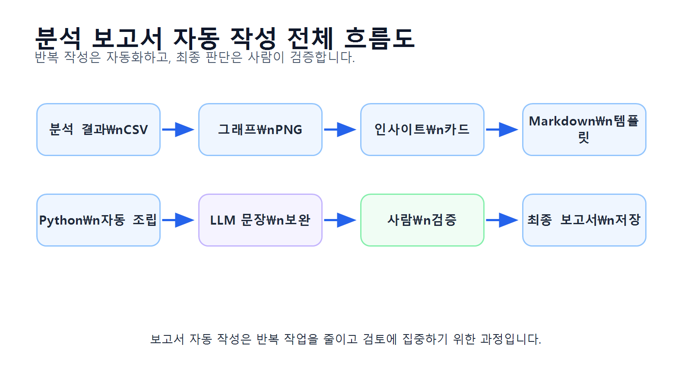
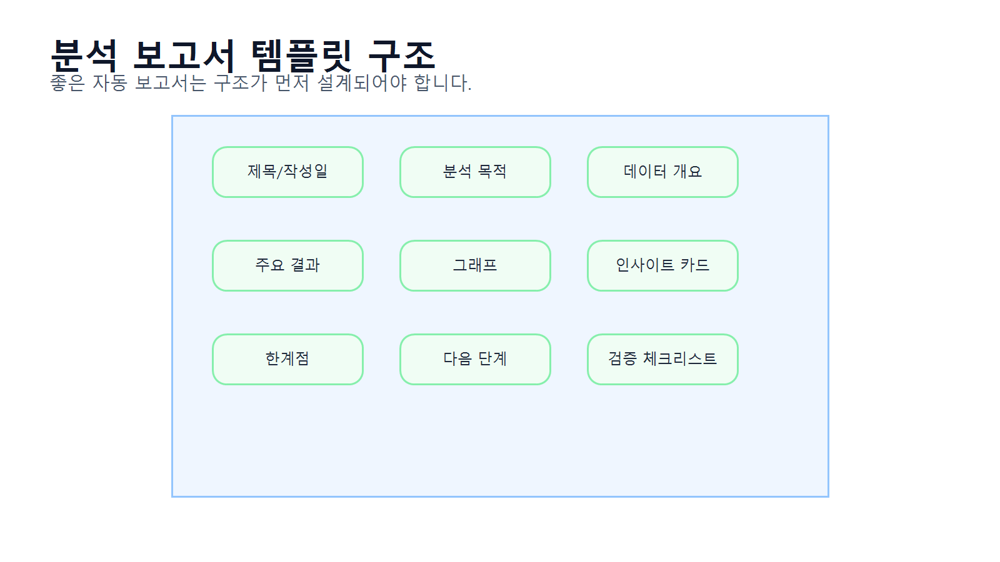
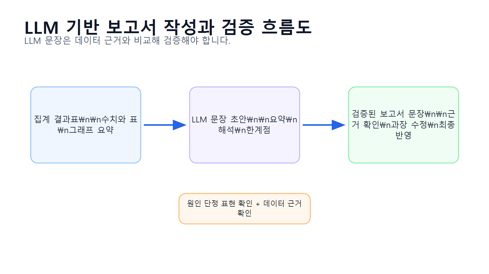
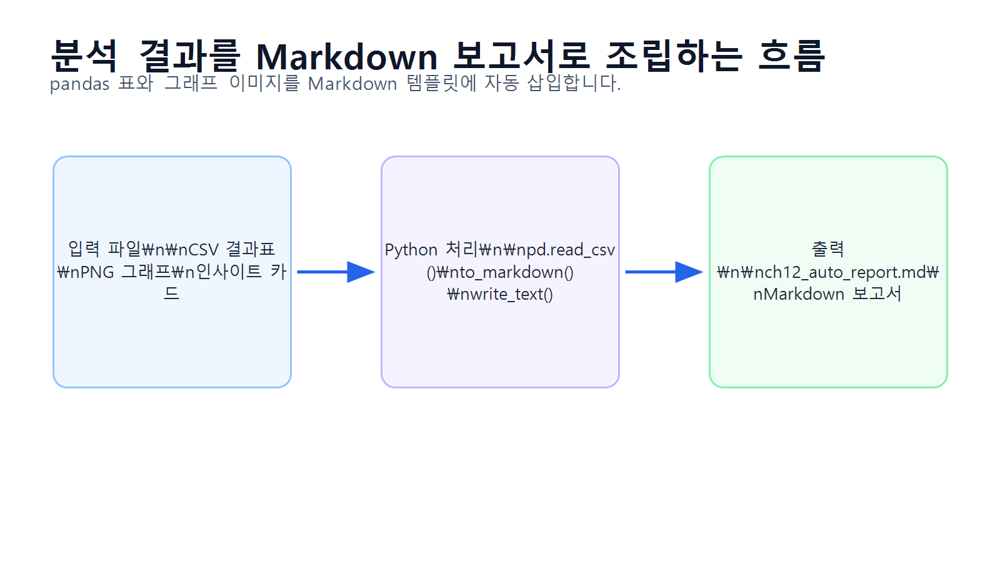
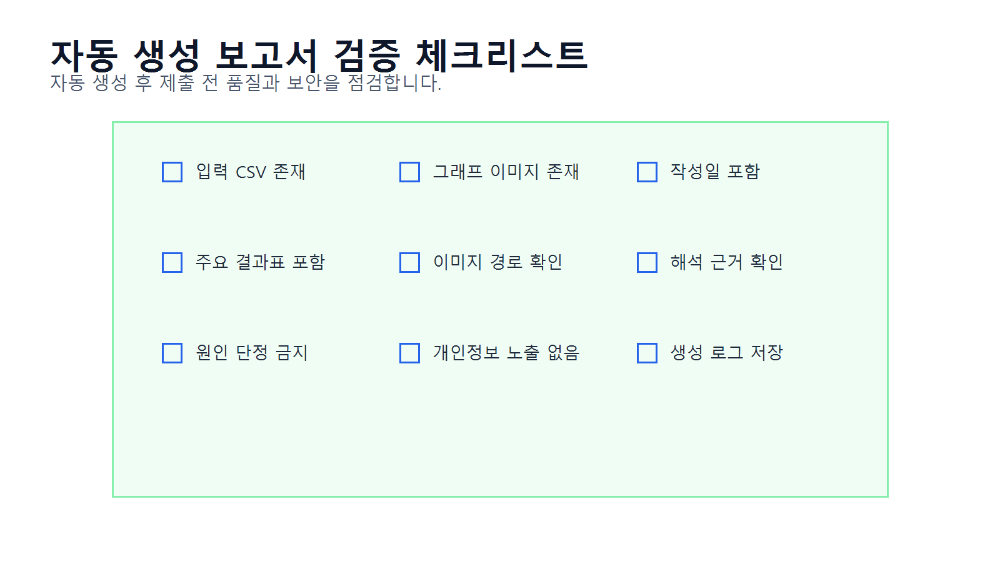

# 12장 분석 보고서 자동 작성

이 장에서는 지금까지 만든 분석 결과, 표, 그래프, 인사이트를 바탕으로 분석 보고서를 자동으로 작성하는 방법을 배웁니다. Chapter 11에서는 분석 결과를 해석하고 인사이트를 도출하는 방법을 다루었다면, 이번 장에서는 그 내용을 Markdown 보고서 형태로 자동 정리하는 과정을 실습합니다.

데이터 분석 프로젝트에서는 같은 형식의 보고서를 반복해서 작성해야 하는 경우가 많습니다. 예를 들어 매주 매출 현황 보고서, 월별 고객 분석 보고서, 카테고리별 판매 분석 보고서, 캠페인 성과 보고서 등을 작성해야 할 수 있습니다. 매번 표와 그래프를 복사하고 문장을 새로 작성하면 시간이 오래 걸리고 실수도 발생하기 쉽습니다.

보고서 자동 작성은 pandas로 만든 분석 결과표, matplotlib으로 저장한 그래프, 사람이 검토한 해석 문장, LLM이 보조한 보고서 초안을 하나의 문서로 조립하는 과정입니다. 단, 자동 작성된 보고서도 최종 검토가 필요합니다. 숫자, 표, 그래프, 해석 문장, 파일 경로가 정확한지 사람이 반드시 확인해야 합니다.

이번 장의 핵심은 **분석 결과를 재사용 가능한 보고서 템플릿으로 자동 조립하고, 사람이 최종 검증하는 능력**입니다.

## 수업 시간 구성

| 구성 | 권장 시간 |
|---|---:|
| 분석 보고서 자동 작성 개념 이해  |    30분 |
| 보고서 구조 설계           |    35분 |
| 분석 결과 파일 불러오기       |    35분 |
| Markdown 보고서 템플릿 작성 |    45분 |
| 표와 그래프 자동 삽입        |    50분 |
| LLM을 활용한 보고서 문장 보완  |    40분 |
| 보고서 검증 체크리스트 작성     |    35분 |
| 최종 보고서 파일 저장        |    30분 |
| 연습 문제 및 심화 과제       | 60~90분 |

기본 수업은 약 3시간을 기준으로 구성되어 있습니다. LLM 보고서 초안 작성, HTML/PDF 변환, 반복 보고서 자동화까지 확장하면 최대 5시간 분량으로 운영할 수 있습니다.

## 1. 학습 목표

이 장을 마치면 학습자는 다음을 할 수 있습니다.

* 분석 보고서 자동 작성이 필요한 이유를 설명할 수 있습니다.
* 분석 보고서의 기본 구조를 설계할 수 있습니다.
* 분석 결과 CSV 파일을 불러와 보고서에 삽입할 수 있습니다.
* 그래프 이미지 파일 경로를 Markdown 문서에 삽입할 수 있습니다.
* pandas 결과표를 Markdown 표로 변환할 수 있습니다.
* 분석 목적, 데이터 개요, 주요 결과, 해석, 한계점, 다음 단계를 포함한 보고서를 작성할 수 있습니다.
* LLM을 활용해 보고서 문장 초안을 만들 수 있습니다.
* LLM이 작성한 문장을 데이터에 근거해 검증할 수 있습니다.
* 자동 생성된 보고서를 Markdown 파일로 저장할 수 있습니다.
* 보고서 검증 체크리스트를 사용해 최종 제출 전 품질을 점검할 수 있습니다.

## 2. 이번 장에서 만들 결과물

이번 장에서는 분석 결과를 자동으로 정리한 보고서 산출물을 만듭니다.

이번 장에서 만들 결과물은 다음과 같습니다.

* 보고서 자동 작성용 분석 결과 파일 목록
* 보고서 템플릿 구조
* `reports/ch12_auto_report.md`
* `reports/ch12_report_validation_checklist.csv`
* `reports/ch12_report_generation_log.csv`
* LLM 보고서 초안 작성 프롬프트
* LLM 보고서 검토 프롬프트
* 보고서 검증 결과 요약
* 최종 보고서 Markdown 파일

아래 그림은 분석 결과가 자동 보고서로 조립되는 전체 흐름을 보여줍니다.

<figure class="figure">
  
  <figcaption>그림 12-1. 분석 보고서 자동 작성 전체 흐름도</figcaption>
</figure>

## 3. 핵심 개념

### 3.1 분석 보고서 자동 작성이란 무엇인가

분석 보고서 자동 작성은 분석 결과표, 그래프, 해석 문장, 검증 내용을 정해진 템플릿에 맞게 자동으로 조립하는 과정입니다.

수동 보고서 작성은 다음처럼 진행됩니다.

1. 분석 결과표를 복사합니다.
2. 그래프 이미지를 저장합니다.
3. 보고서 문서에 표를 붙여 넣습니다.
4. 그래프를 삽입합니다.
5. 해석 문장을 작성합니다.
6. 문장과 수치를 다시 확인합니다.

자동 보고서 작성은 이 과정을 코드로 처리합니다.

1. 분석 결과 CSV를 불러옵니다.
2. 그래프 파일 경로를 확인합니다.
3. 보고서 템플릿에 표와 이미지를 삽입합니다.
4. 해석 문장을 자동으로 배치합니다.
5. Markdown 파일로 저장합니다.
6. 사람이 최종 검토합니다.

자동화의 목적은 사람이 검토하지 않아도 되는 보고서를 만드는 것이 아니라, 반복 작업을 줄이고 검토에 집중할 수 있게 만드는 것입니다.

### 3.2 분석 보고서의 기본 구조

분석 보고서는 일반적으로 다음 구조를 가집니다.

| 섹션 | 포함 내용 |
|---|---|
| 제목       | 보고서명, 작성일, 분석 대상  |
| 분석 목적    | 왜 분석했는지 설명        |
| 데이터 개요   | 사용한 데이터셋과 주요 컬럼   |
| 전처리 요약   | 결측치, 중복, 타입 변환 등  |
| 주요 분석 질문 | 보고서에서 답할 질문       |
| 주요 결과    | 표와 그래프 중심 결과      |
| 해석과 인사이트 | 관찰, 가설, 추가 질문     |
| 한계점      | 현재 데이터로 알 수 없는 내용 |
| 다음 단계    | 추가 분석 또는 실행 제안    |
| 검증 체크리스트 | 보고서 품질 점검         |

이번 장에서는 이 구조를 Markdown 템플릿으로 만듭니다.

아래 그림은 분석 보고서 템플릿의 기본 구조를 보여줍니다.

<figure class="figure">
  
  <figcaption>그림 12-2. 분석 보고서 템플릿 구조</figcaption>
</figure>

### 3.3 Markdown 보고서를 사용하는 이유

Markdown은 분석 보고서 자동 작성에 적합합니다.

Markdown의 장점은 다음과 같습니다.

* 텍스트 기반이라 코드로 쉽게 생성할 수 있습니다.
* 제목, 표, 이미지, 목록을 간단한 문법으로 작성할 수 있습니다.
* GitHub, VSCode, Jupyter, Notion 등 다양한 도구에서 읽기 쉽습니다.
* HTML이나 PDF로 변환하기 쉽습니다.
* 분석 결과를 버전 관리하기 좋습니다.

Markdown에서 표는 다음처럼 작성합니다.

```markdown id="n0rx6f"
| category | total_sales | sales_ratio |
|---|---:|---:|
| 전자기기 | 12500000 | 42.5 |
| 생활용품 | 7800000 | 26.5 |
```

이미지는 다음처럼 삽입합니다.

```markdown id="9aitgt"

```

교재용 HTML/PDF 변환에서는 figure 태그를 사용할 수도 있습니다.

```html id="6q1wdf"
<figure class="figure">
  
  <figcaption>카테고리별 매출 그래프</figcaption>
</figure>
```

### 3.4 보고서 자동 작성에 필요한 입력 파일

이번 장에서는 이전 장에서 생성한 결과 파일을 사용합니다.

| 입력 파일 | 설명 |
|---|---|
| `reports/ch08_dataset_summary.csv`        | 데이터셋 구조 요약      |
| `reports/ch08_category_sales.csv`         | 카테고리별 매출 결과     |
| `reports/ch08_monthly_sales.csv`          | 월별 매출 결과        |
| `reports/ch08_customer_sales.csv`         | 고객별 구매 금액 결과    |
| `reports/figures/ch08_category_sales.png` | 카테고리별 매출 그래프    |
| `reports/figures/ch08_monthly_sales.png`  | 월별 매출 그래프       |
| `reports/figures/ch08_top_customers.png`  | 구매 금액 상위 고객 그래프 |
| `reports/ch11_insight_cards.csv`          | 인사이트 카드         |
| `reports/ch11_interpretation_table.csv`   | 관찰·가설·추가 질문 정리표 |

파일이 없다면 Chapter 8과 Chapter 11 Notebook을 먼저 실행해야 합니다.

### 3.5 보고서 자동화에서 LLM의 역할

LLM은 보고서 자동 작성에서 다음 작업을 보조할 수 있습니다.

| 작업 | LLM 활용 방식 | 검증 필요 사항 |
|---|---|---|
| 보고서 목차 제안 | 분석 목적에 맞는 구조 추천   | 과제 요구사항과 맞는가     |
| 해석 문장 초안  | 표와 지표를 바탕으로 문장 작성 | 원인 단정이 없는가       |
| 요약 문장 작성  | 핵심 결과 요약          | 수치가 정확한가         |
| 한계점 작성    | 현재 데이터의 한계 정리     | 데이터에 없는 내용 추측 여부 |
| 다음 단계 제안  | 추가 분석 방향 제안       | 실제 데이터로 가능한가     |
| 문장 다듬기    | 보고서 문체로 개선        | 과장 표현이 없는가       |

LLM이 작성한 문장은 자연스럽지만, 데이터에 없는 원인을 단정할 수 있습니다. 따라서 보고서 자동화에서는 LLM 초안과 사람 검토가 함께 필요합니다.

아래 그림은 LLM을 활용한 보고서 작성과 검증 흐름을 보여줍니다.

<figure class="figure">
  
  <figcaption>그림 12-3. LLM 기반 보고서 작성과 검증 흐름도</figcaption>
</figure>

### 3.6 자동 보고서도 검증이 필요한 이유

자동 생성된 보고서는 다음 문제가 생길 수 있습니다.

| 문제 | 예시 |
|---|---|
| 파일 누락     | 그래프 이미지가 존재하지 않음       |
| 표 누락      | CSV 파일 경로 오류           |
| 잘못된 수치    | 이전 분석 결과가 갱신되지 않음      |
| 이미지 경로 오류 | Markdown에서 이미지가 보이지 않음 |
| 과장된 해석    | 고객 선호도라고 단정            |
| 오래된 결과 사용 | 이전 실행 결과가 남아 있음        |
| 개인정보 노출   | 고객명이 그대로 표시됨           |

따라서 자동 보고서 생성 후에는 반드시 검증 체크리스트를 사용해야 합니다.

## 4. 실습 시나리오

이번 장의 실습 시나리오는 다음과 같습니다.

> 온라인 쇼핑몰 분석 프로젝트에서 카테고리별 매출, 월별 매출, 고객별 구매 금액, 인사이트 카드가 이미 생성되어 있습니다. 분석가는 이 결과를 매번 수동으로 정리하는 대신, Python 코드로 Markdown 분석 보고서를 자동 생성하려고 합니다. 생성된 보고서에는 분석 목적, 데이터 개요, 주요 결과표, 그래프, 해석, 한계점, 다음 단계가 포함되어야 합니다.

이번 장의 보고서 자동 작성 흐름은 다음과 같습니다.

1. 분석 결과 CSV 파일 확인
2. 그래프 이미지 파일 확인
3. 주요 결과표 불러오기
4. 인사이트 카드 불러오기
5. Markdown 템플릿 작성
6. 표를 Markdown으로 변환
7. 그래프 이미지 경로 삽입
8. 보고서 파일 저장
9. 검증 체크리스트 작성
10. LLM으로 문장 보완 후 사람이 검토

아래 그림은 분석 결과 파일이 Markdown 보고서로 조립되는 과정을 보여줍니다.

<figure class="figure">
  
  <figcaption>그림 12-4. 분석 결과를 Markdown 보고서로 조립하는 흐름</figcaption>
</figure>

## 5. 실습 코드

이번 장의 전체 실습은 다음 Notebook에서 진행합니다.

```text id="6a0mou"
notebooks/ch12_analysis_report_automation.ipynb
```

본문에는 핵심 코드만 제공합니다.

### 5.1 기본 패키지 불러오기

```python id="93wp04"
from pathlib import Path
from datetime import datetime
import pandas as pd
```

실습 파일을 프로젝트 루트에서 실행하는 경우와 `notebooks` 폴더 안에서 실행하는 경우에는 상대 경로가 달라질 수 있습니다. 아래 코드는 현재 실행 위치를 확인한 뒤 공통 기준 폴더를 자동으로 설정합니다.

```python id="ibhs8y"
current_dir = Path.cwd()

if current_dir.name == "notebooks":
    base_dir = current_dir.parent
else:
    base_dir = current_dir

report_dir = base_dir / "reports"
figure_dir = report_dir / "figures"

report_dir.mkdir(parents=True, exist_ok=True)
figure_dir.mkdir(parents=True, exist_ok=True)

print("report_dir:", report_dir)
print("figure_dir:", figure_dir)
```

이 코드는 프로젝트 루트에서 실행하든 `notebooks` 폴더에서 실행하든 같은 방식으로 동작합니다.

`to_markdown()`을 사용하려면 환경에 따라 `tabulate` 패키지가 필요할 수 있습니다. 오류가 발생하면 터미널 또는 노트북에서 `pip install tabulate`를 실행하세요.

```text
pip install tabulate
```

### 5.2 보고서 입력 파일 목록 만들기

보고서에 사용할 입력 파일을 정리합니다.

```python id="wr96ei"
input_files = {
    "dataset_summary": report_dir / "ch08_dataset_summary.csv",
    "category_sales": report_dir / "ch08_category_sales.csv",
    "monthly_sales": report_dir / "ch08_monthly_sales.csv",
    "customer_sales": report_dir / "ch08_customer_sales.csv",
    "insight_cards": report_dir / "ch11_insight_cards.csv",
    "interpretation_table": report_dir / "ch11_interpretation_table.csv",
    "category_sales_figure": figure_dir / "ch08_category_sales.png",
    "monthly_sales_figure": figure_dir / "ch08_monthly_sales.png",
    "top_customers_figure": figure_dir / "ch08_top_customers.png"
}

input_files
```

파일 존재 여부를 확인합니다.

```python id="68g92a"
file_check = pd.DataFrame({
    "name": list(input_files.keys()),
    "path": [str(path) for path in input_files.values()],
    "exists": [path.exists() for path in input_files.values()]
})

file_check
```

파일이 없는 항목이 있다면 이전 장의 Notebook을 먼저 실행해야 합니다.

### 5.3 분석 결과 CSV 불러오기

```python id="t82dd4"
dataset_summary = pd.read_csv(input_files["dataset_summary"])
category_sales = pd.read_csv(input_files["category_sales"])
monthly_sales = pd.read_csv(input_files["monthly_sales"])
customer_sales = pd.read_csv(input_files["customer_sales"])
```

인사이트 카드 파일은 없을 수도 있으므로 안전하게 불러옵니다.

```python id="g86nwb"
if input_files["insight_cards"].exists():
    insight_cards = pd.read_csv(input_files["insight_cards"])
else:
    insight_cards = pd.DataFrame({
        "insight_title": [],
        "analysis_question": [],
        "observation": [],
        "interpretation": [],
        "caution": [],
        "next_step": []
    })

if input_files["interpretation_table"].exists():
    interpretation_table = pd.read_csv(input_files["interpretation_table"])
else:
    interpretation_table = pd.DataFrame({
        "analysis_area": [],
        "observation": [],
        "hypothesis": [],
        "additional_question": []
    })
```

### 5.4 보고서용 요약 지표 만들기

카테고리별 매출 1위 항목을 추출합니다.

```python id="9mbmqx"
category_sales_sorted = category_sales.sort_values("total_sales", ascending=False)
top_category = category_sales_sorted.iloc[0]

top_category_name = top_category["category"]
top_category_sales = top_category["total_sales"]
top_category_ratio = top_category["sales_ratio"]
```

월별 매출 1위 항목을 추출합니다.

```python id="40togq"
monthly_sales_sorted = monthly_sales.sort_values("order_month")
top_month = monthly_sales.sort_values("total_sales", ascending=False).iloc[0]

top_month_name = top_month["order_month"]
top_month_sales = top_month["total_sales"]
top_month_order_count = top_month["order_count"]
```

고객별 구매 금액 상위 10명을 준비합니다.

```python id="0l34k3"
top_customers = customer_sales.sort_values("total_sales", ascending=False).head(10).copy()

if "customer_label" not in top_customers.columns:
    top_customers["customer_label"] = "Customer " + top_customers["customer_id"].astype(str)

top_customers_for_report = top_customers[
    ["customer_label", "city", "order_count", "total_sales", "avg_order_value"]
]
```

### 5.5 표를 Markdown으로 변환하기

pandas DataFrame은 `to_markdown()`으로 Markdown 표로 변환할 수 있습니다.

```python id="29bfaa"
dataset_summary_md = dataset_summary.to_markdown(index=False)
category_sales_md = category_sales_sorted.to_markdown(index=False)
monthly_sales_md = monthly_sales_sorted.to_markdown(index=False)
top_customers_md = top_customers_for_report.to_markdown(index=False)
```

인사이트 카드도 Markdown 표로 변환합니다.

```python id="dk4j5b"
if len(insight_cards) > 0:
    insight_cards_md = insight_cards.to_markdown(index=False)
else:
    insight_cards_md = "인사이트 카드 파일이 없습니다. Chapter 11을 먼저 실행해 주세요."

if len(interpretation_table) > 0:
    interpretation_table_md = interpretation_table.to_markdown(index=False)
else:
    interpretation_table_md = "해석 정리표 파일이 없습니다. Chapter 11을 먼저 실행해 주세요."
```

### 5.6 그래프 이미지 Markdown 만들기

Markdown 보고서에서는 상대 경로로 이미지를 삽입합니다.

```python id="cmufam"
category_sales_img = "figures/ch08_category_sales.png"
monthly_sales_img = "figures/ch08_monthly_sales.png"
top_customers_img = "figures/ch08_top_customers.png"
```

이미지 삽입 Markdown을 만듭니다.

```python id="zs07gx"
category_sales_figure_md = f"""

"""

monthly_sales_figure_md = f"""

"""

top_customers_figure_md = f"""

"""
```

### 5.7 기본 해석 문장 만들기

보고서에 들어갈 기본 해석 문장을 작성합니다.

```python id="0zxq6f"
category_interpretation = f"""
카테고리별 매출 결과에서 {top_category_name} 카테고리의 매출 비중이 가장 높게 나타났습니다.
이는 해당 카테고리가 전체 매출에 크게 기여하고 있음을 의미합니다.
다만 매출이 높은 이유가 판매 수량 때문인지, 평균 판매 단가 때문인지, 특정 기간의 주문 집중 때문인지는 추가 분석이 필요합니다.
"""

monthly_interpretation = f"""
월별 매출 결과에서 {top_month_name}의 매출이 가장 높게 나타났습니다.
해당 월의 주문 수는 {top_month_order_count}건입니다.
다만 매출 증가의 원인을 설명하려면 주문 수, 평균 주문 금액, 프로모션, 계절성 등의 추가 정보를 함께 확인해야 합니다.
"""

customer_interpretation = """
구매 금액 상위 고객은 전체 매출에 크게 기여한 고객군으로 볼 수 있습니다.
다만 총 구매 금액만으로 충성 고객이라고 단정할 수는 없습니다.
반복 구매 고객인지, 일회성 고액 구매 고객인지 구분하려면 주문 횟수와 평균 주문 금액을 함께 확인해야 합니다.
"""
```

### 5.8 Markdown 보고서 템플릿 작성하기

보고서 작성일을 생성합니다.

```python id="2usuzb"
today = datetime.now().strftime("%Y-%m-%d")
```

보고서 본문을 만듭니다.

```python id="p3jgk9"
report_text = f"""
# 온라인 쇼핑몰 데이터 분석 자동 보고서

작성일: {today}

## 1. 분석 목적

본 보고서는 온라인 쇼핑몰 고객, 상품, 주문, 주문 상세 데이터를 바탕으로 기본 매출 현황과 고객 구매 패턴을 파악하기 위해 작성되었습니다.

주요 분석 질문은 다음과 같습니다.

1. 카테고리별 매출은 어떻게 다른가?
2. 월별 매출과 주문 수는 어떻게 변하는가?
3. 구매 금액 상위 고객은 누구인가?
4. 분석 결과에서 어떤 추가 질문을 도출할 수 있는가?

## 2. 데이터 개요

사용한 데이터셋의 구조는 다음과 같습니다.

{dataset_summary_md}

## 3. 주요 분석 결과 요약

- 매출 비중이 가장 높은 카테고리: {top_category_name}
- {top_category_name} 카테고리 매출: {top_category_sales:,.0f}
- {top_category_name} 카테고리 매출 비중: {top_category_ratio:.2f}%
- 매출이 가장 높은 월: {top_month_name}
- {top_month_name} 매출: {top_month_sales:,.0f}
- {top_month_name} 주문 수: {top_month_order_count:,.0f}

## 4. 카테고리별 매출 분석

{category_sales_md}

{category_sales_figure_md}

### 해석

{category_interpretation}

## 5. 월별 매출 분석

{monthly_sales_md}

{monthly_sales_figure_md}

### 해석

{monthly_interpretation}

## 6. 구매 금액 상위 고객 분석

{top_customers_md}

{top_customers_figure_md}

### 해석

{customer_interpretation}

## 7. 인사이트 카드

{insight_cards_md}

## 8. 관찰·가설·추가 분석 질문

{interpretation_table_md}

## 9. 한계점

- 현재 데이터만으로 고객 선호도나 만족도를 직접 판단할 수 없습니다.
- 매출 변화의 원인을 설명하려면 프로모션, 광고, 재고, 계절성 데이터가 추가로 필요합니다.
- 구매 금액 상위 고객이 반드시 충성 고객이라는 의미는 아닙니다.
- 취소 주문과 환불 주문 처리 기준에 따라 매출 결과가 달라질 수 있습니다.
- 자동 생성된 보고서이므로 수치, 그래프, 해석 문장에 대한 최종 검토가 필요합니다.

## 10. 다음 단계

- 카테고리별 매출을 판매 수량과 평균 판매 단가로 분해합니다.
- 월별 매출을 주문 수와 평균 주문 금액으로 나누어 확인합니다.
- 고객별 구매 금액을 주문 횟수와 평균 주문 금액 기준으로 세분화합니다.
- LLM을 활용해 문장을 보완하되, 데이터에 없는 원인은 단정하지 않습니다.
- 보고서를 HTML 또는 PDF로 변환해 제출용 자료로 정리합니다.
"""
```

### 5.9 보고서 저장하기

```python id="8s5rse"
report_path = report_dir / "ch12_auto_report.md"
report_path.write_text(report_text, encoding="utf-8")

report_path
```

저장된 파일 내용을 확인합니다.

```python id="q40byj"
print(report_path.read_text(encoding="utf-8")[:1000])
```

### 5.10 보고서 생성 로그 만들기

보고서 생성에 사용한 입력 파일과 생성 결과를 로그로 남깁니다.

```python id="nyxmqk"
generation_log = pd.DataFrame({
    "item": [
        "dataset_summary",
        "category_sales",
        "monthly_sales",
        "customer_sales",
        "insight_cards",
        "interpretation_table",
        "output_report"
    ],
    "path": [
        str(input_files["dataset_summary"]),
        str(input_files["category_sales"]),
        str(input_files["monthly_sales"]),
        str(input_files["customer_sales"]),
        str(input_files["insight_cards"]),
        str(input_files["interpretation_table"]),
        str(report_path)
    ],
    "exists": [
        input_files["dataset_summary"].exists(),
        input_files["category_sales"].exists(),
        input_files["monthly_sales"].exists(),
        input_files["customer_sales"].exists(),
        input_files["insight_cards"].exists(),
        input_files["interpretation_table"].exists(),
        report_path.exists()
    ]
})

generation_log
```

저장합니다.

```python id="0qg297"
generation_log.to_csv(report_dir / "ch12_report_generation_log.csv", index=False)
```

### 5.11 보고서 검증 체크리스트 만들기

자동 생성된 보고서를 검증하기 위한 체크리스트를 만듭니다.

```python id="j2kt6n"
report_validation_checklist = pd.DataFrame({
    "check_item": [
        "보고서 파일이 생성되었는가?",
        "분석 목적이 명확히 작성되었는가?",
        "데이터 개요 표가 포함되었는가?",
        "카테고리별 매출표가 포함되었는가?",
        "월별 매출표가 포함되었는가?",
        "구매 금액 상위 고객표가 포함되었는가?",
        "그래프 이미지 경로가 올바른가?",
        "인사이트 카드가 포함되었는가?",
        "해석 문장에서 원인을 단정하지 않았는가?",
        "한계점이 포함되었는가?",
        "다음 단계가 포함되었는가?",
        "개인정보가 노출되지 않았는가?",
        "수치와 표가 최신 분석 결과와 일치하는가?"
    ],
    "result": ["□"] * 13,
    "memo": [""] * 13
})

report_validation_checklist
```

저장합니다.

```python id="w8aes6"
report_validation_checklist.to_csv(
    report_dir / "ch12_report_validation_checklist.csv",
    index=False
)
```

아래 그림은 자동 생성 보고서를 최종 검증하는 흐름을 보여줍니다.

<figure class="figure">
  
  <figcaption>그림 12-5. 자동 생성 보고서 검증 체크리스트</figcaption>
</figure>

### 5.12 LLM 보고서 문장 보완 프롬프트 만들기

자동 생성된 보고서를 LLM으로 보완할 때는 전체 원본 데이터를 넣지 않고, 보고서 초안 일부와 집계표를 사용합니다.

```python id="uh7x49"
llm_report_prompt = f"""
당신은 데이터 분석 보고서 편집자입니다.

다음은 온라인 쇼핑몰 데이터 분석 자동 보고서의 주요 결과입니다.

주요 결과:
- 매출 비중이 가장 높은 카테고리: {top_category_name}
- {top_category_name} 카테고리 매출 비중: {top_category_ratio:.2f}%
- 매출이 가장 높은 월: {top_month_name}
- {top_month_name} 주문 수: {top_month_order_count}건

요청:
1. 보고서의 주요 결과 요약 문장을 자연스럽게 다듬어 주세요.
2. 데이터로 확인한 사실과 원인 가설을 구분해 주세요.
3. 데이터에 없는 원인을 단정하지 마세요.
4. 추가로 확인해야 할 분석 질문을 제안해 주세요.
5. 실무 보고서 문체로 작성해 주세요.

주의:
- 고객 선호도, 프로모션 효과, 충성 고객 여부를 단정하지 마세요.
- 원본 고객명이나 개별 주문 데이터는 사용하지 마세요.
"""

print(llm_report_prompt)
```

프롬프트를 저장합니다.

```python id="nzsj4e"
prompt_path = report_dir / "ch12_llm_report_prompt.md"
prompt_path.write_text(llm_report_prompt, encoding="utf-8")
```

## 6. LLM 활용 프롬프트

LLM은 보고서 문장 보완과 구조 검토에 유용합니다. 하지만 자동 보고서의 수치와 해석을 그대로 맡기면 안 됩니다.

### 6.1 보고서 요약 문장 작성 요청

```text id="2079qd"
당신은 데이터 분석 보고서 작성 도우미입니다.

다음은 온라인 쇼핑몰 분석 결과 요약입니다.

- 매출 비중이 가장 높은 카테고리: 전자기기
- 전자기기 매출 비중: 42.5%
- 매출이 가장 높은 월: 2024-04
- 2024-04 주문 수: 63건

요청:
1. 보고서의 주요 결과 요약 문장을 작성해 주세요.
2. 데이터로 확인한 사실과 가능한 가설을 구분해 주세요.
3. 데이터에 없는 원인을 단정하지 마세요.
4. 추가로 확인해야 할 분석 질문을 3개 제안해 주세요.
```

### 6.2 보고서 구조 검토 요청

```text id="vvj319"
다음 분석 보고서 목차를 검토해 주세요.

보고서 목차:
1. 분석 목적
2. 데이터 개요
3. 주요 분석 결과 요약
4. 카테고리별 매출 분석
5. 월별 매출 분석
6. 구매 금액 상위 고객 분석
7. 인사이트 카드
8. 관찰·가설·추가 분석 질문
9. 한계점
10. 다음 단계

검토 기준:
- 데이터 분석 보고서 구조로 적절한가?
- 빠진 항목이 있는가?
- 순서가 자연스러운가?
- 초보자 프로젝트 보고서에 적합한가?
- 보완할 목차가 있다면 제안해 주세요.
```

### 6.3 자동 보고서 문장 검토 요청

```text id="4ri591"
다음 문장은 자동 생성된 분석 보고서의 해석 문장입니다.

문장:
전자기기 카테고리의 매출 비중이 가장 높게 나타났습니다. 이는 고객들이 전자기기를 가장 선호하기 때문입니다.

현재 데이터에는 고객 선호도 조사나 클릭 로그가 없습니다.

요청:
1. 이 문장의 문제점을 설명해 주세요.
2. 데이터로 확인한 사실과 추측을 구분해 주세요.
3. 더 안전한 보고서 문장으로 수정해 주세요.
4. 추가로 확인해야 할 데이터나 분석을 제안해 주세요.
```

### 6.4 보고서 한계점 작성 요청

```text id="wv91jr"
온라인 쇼핑몰 데이터 분석 보고서의 한계점을 작성하려고 합니다.

현재 사용한 데이터:
- 고객 정보
- 상품 정보
- 주문 정보
- 주문 상세 정보

분석한 내용:
- 카테고리별 매출
- 월별 매출
- 고객별 구매 금액
- 주문 상태별 주문 수

현재 없는 데이터:
- 고객 만족도
- 클릭 로그
- 광고비
- 프로모션 정보
- 재고 정보
- 반품 상세 사유

요청:
보고서에 넣을 수 있는 한계점 문장을 작성해 주세요.
조건:
- 과장하지 말 것
- 현재 데이터로 알 수 없는 내용을 명확히 구분할 것
- 추가 데이터가 필요한 항목을 제안할 것
```

### 6.5 최종 보고서 검토 요청

```text id="ouy7ta"
다음 기준으로 분석 보고서 최종본을 검토해 주세요.

검토 기준:
1. 분석 목적이 명확한가?
2. 데이터 개요가 포함되어 있는가?
3. 주요 결과표가 포함되어 있는가?
4. 그래프 설명이 충분한가?
5. 해석 문장에서 원인을 단정하지 않았는가?
6. 한계점이 포함되어 있는가?
7. 다음 단계가 구체적인가?
8. 개인정보 노출 위험은 없는가?
9. 수치와 그래프가 서로 일치하는가?
10. 보고서 문체가 실무 보고서에 적합한가?

출력 형식:
- 점검 항목
- 문제 여부
- 수정 제안
- 수정 문장 예시
```

## 7. 결과 해석

이번 장의 결과는 자동 생성된 Markdown 보고서입니다. 보고서 자동 작성은 분석 결과를 문서 형태로 빠르게 정리하는 데 유용합니다.

### 7.1 자동 보고서의 장점

자동 보고서는 다음 장점이 있습니다.

```text id="l1mt4y"
분석 결과 CSV와 그래프 이미지를 정해진 템플릿에 자동으로 삽입할 수 있습니다.
보고서 구조가 일정하게 유지되므로 반복 보고서 작성에 유리합니다.
```

특히 주간 보고서나 월간 보고서처럼 형식이 반복되는 문서에 적합합니다.

### 7.2 자동 보고서의 한계

자동 보고서는 최종 검토 없이 제출하면 위험합니다.

```text id="e4veye"
자동 보고서는 수치, 이미지 경로, 해석 문장이 잘못 포함될 수 있으므로 반드시 사람이 최종 검토해야 합니다.
```

예를 들어 이전 분석 결과 파일이 갱신되지 않았다면 오래된 결과가 보고서에 들어갈 수 있습니다. 이미지 경로가 틀리면 그래프가 보이지 않을 수도 있습니다.

### 7.3 LLM 보완 문장의 주의점

LLM은 보고서 문장을 자연스럽게 다듬는 데 도움이 됩니다. 하지만 원인 단정 표현이 들어갈 수 있습니다.

위험한 문장:

```text id="2xkesd"
전자기기 매출이 높은 이유는 고객들이 전자기기를 선호하기 때문입니다.
```

안전한 문장:

```text id="xd0x56"
전자기기 카테고리의 매출 비중이 가장 높게 나타났습니다. 다만 이 결과가 고객 선호 때문인지, 상품 단가 때문인지, 판매 수량 때문인지는 추가 분석이 필요합니다.
```

LLM 문장은 항상 데이터 근거와 비교해야 합니다.

## 8. 실무 적용 포인트

실무에서 보고서 자동 작성을 사용할 때는 다음 원칙을 지켜야 합니다.

1. 보고서 구조를 먼저 템플릿으로 설계합니다.
2. 분석 결과 파일명과 경로를 일관되게 관리합니다.
3. 표와 그래프를 자동 삽입합니다.
4. 보고서 작성일과 사용 데이터 기준일을 표시합니다.
5. 수치 요약은 코드로 자동 계산합니다.
6. 해석 문장은 자동 생성 후 사람이 검토합니다.
7. LLM이 작성한 문장은 원인 단정 여부를 확인합니다.
8. 개인정보가 포함된 표나 그래프는 익명화합니다.
9. 보고서 생성 로그를 남깁니다.
10. 최종 제출 전 검증 체크리스트를 사용합니다.

### 분석 보고서 자동 작성 체크리스트

| 점검 항목 | 확인 |
|---|---|
| 보고서 템플릿 구조가 명확한가? | □ |
| 입력 CSV 파일이 모두 존재하는가? | □ |
| 그래프 이미지 파일이 모두 존재하는가? | □ |
| 보고서 작성일이 포함되었는가? | □ |
| 데이터 개요 표가 포함되었는가? | □ |
| 주요 결과표가 포함되었는가? | □ |
| 그래프 이미지 경로가 올바른가? | □ |
| 해석 문장이 데이터에 근거하는가? | □ |
| 원인 단정 표현을 피했는가? | □ |
| 한계점이 포함되었는가? | □ |
| 다음 단계가 구체적인가? | □ |
| 개인정보 노출 위험이 없는가? | □ |
| 보고서 생성 로그를 저장했는가? | □ |

## 9. 연습 문제

### 기본 연습 문제

1. `reports/` 폴더에 있는 분석 결과 CSV 파일 목록을 확인하세요.

   * 제출 형식: 코드와 출력 결과
   * 포함 항목: `Path`, `exists()`

2. `ch08_category_sales.csv`를 불러와 Markdown 표로 변환하세요.

   * 제출 형식: 코드와 Markdown 출력 결과
   * 포함 항목: `pd.read_csv()`, `to_markdown()`

3. 카테고리별 매출 그래프 이미지를 Markdown 문법으로 삽입하세요.

   * 제출 형식: Markdown 이미지 문법
   * 포함 항목: `figures/ch08_category_sales.png`

4. 분석 목적, 데이터 개요, 주요 결과를 포함한 간단한 Markdown 보고서를 자동 생성하세요.

   * 제출 형식: Python 코드와 `.md` 파일

5. 보고서 검증 체크리스트를 CSV 파일로 저장하세요.

   * 제출 형식: 코드와 저장 파일
   * 포함 항목: `ch12_report_validation_checklist.csv`

### 심화 과제

1. 카테고리별 매출, 월별 매출, 고객별 구매 금액을 모두 포함한 자동 보고서를 작성하세요.

   * 제출 형식: `reports/ch12_auto_report.md`

2. LLM을 활용해 보고서 요약 문장을 보완하고, 원인 단정 표현이 있는지 검토하세요.

   * 제출 형식: 프롬프트, LLM 답변, 검토 결과

3. 자동 보고서 생성 로그를 작성하세요.

   * 제출 형식: `reports/ch12_report_generation_log.csv`

4. 보고서에 포함된 이미지 파일이 실제로 존재하는지 확인하는 코드를 작성하세요.

   * 제출 형식: 코드와 검증 결과

5. 자동 생성 보고서를 HTML 또는 PDF로 변환하기 전 점검 항목을 정리하세요.

   * 제출 형식: Markdown 체크리스트

## 10. 정리

이번 장에서는 분석 결과를 바탕으로 Markdown 분석 보고서를 자동 작성하는 방법을 배웠습니다. 보고서 자동 작성은 반복적인 표 삽입, 그래프 삽입, 기본 문장 작성 작업을 줄이고, 분석자가 해석과 검토에 더 집중할 수 있게 도와줍니다.

자동 보고서에는 분석 목적, 데이터 개요, 주요 분석 결과, 그래프, 해석, 인사이트, 한계점, 다음 단계가 포함되어야 합니다. pandas의 `to_markdown()`을 사용하면 DataFrame을 Markdown 표로 쉽게 변환할 수 있고, `Path.write_text()`를 사용하면 보고서를 파일로 저장할 수 있습니다.

LLM은 보고서 문장을 자연스럽게 다듬는 데 도움을 줄 수 있습니다. 하지만 LLM이 작성한 문장은 반드시 검토해야 합니다. 특히 고객 선호, 프로모션 효과, 충성 고객 여부처럼 현재 데이터로 확인할 수 없는 내용을 단정하지 않도록 주의해야 합니다.

자동화된 보고서도 최종 산출물이 되기 전에는 사람이 검증해야 합니다. 입력 파일이 최신인지, 그래프 이미지가 존재하는지, 표의 수치가 맞는지, 해석 문장이 데이터에 근거하는지 확인해야 합니다.

다음 장에서는 Make를 활용해 반복적인 분석 업무를 자동화하고, 보고서 생성 및 발송 흐름을 외부 자동화 도구와 연결하는 방법을 배웁니다.
