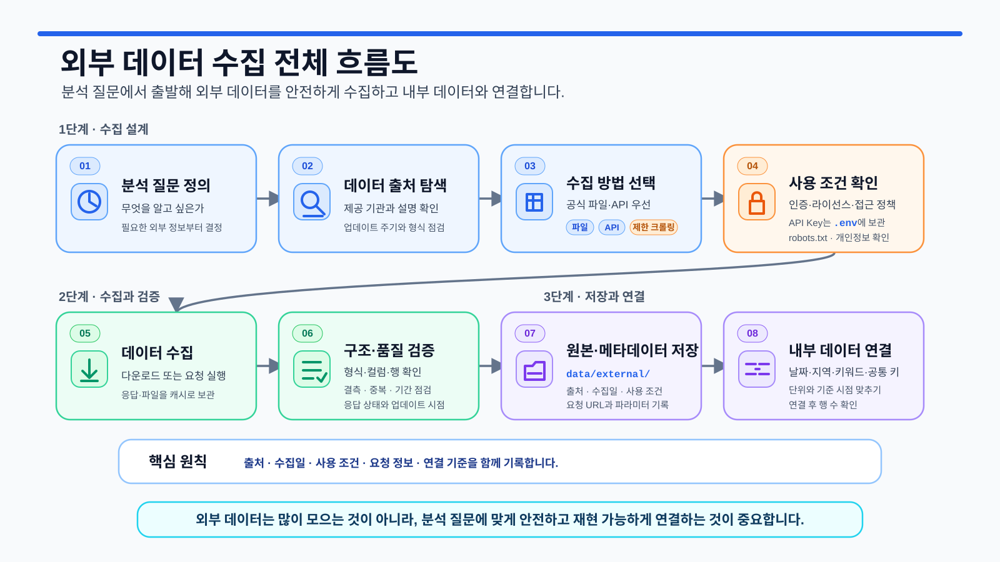
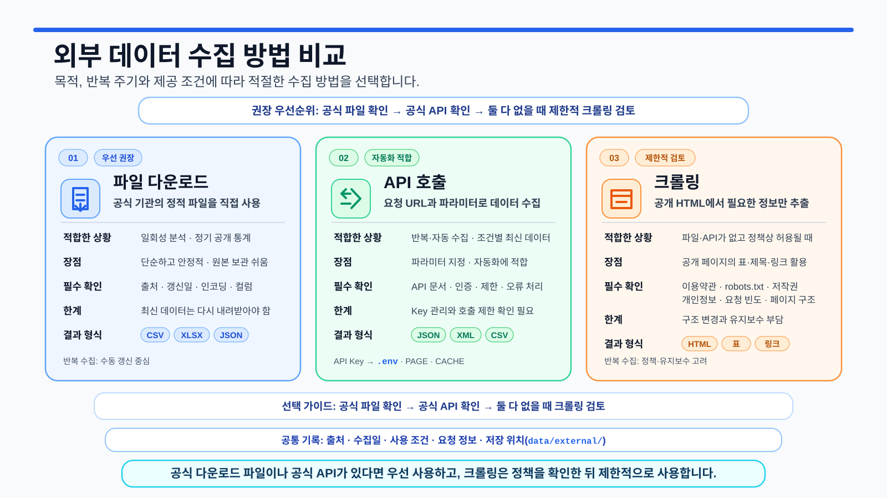
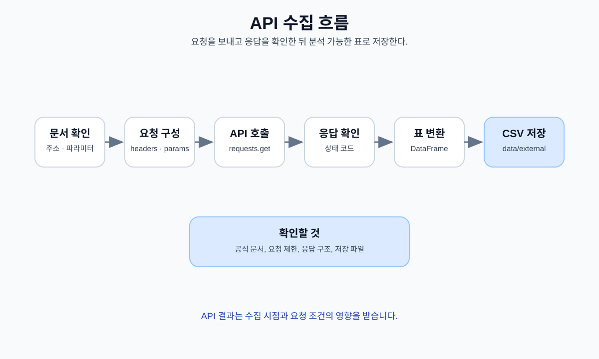
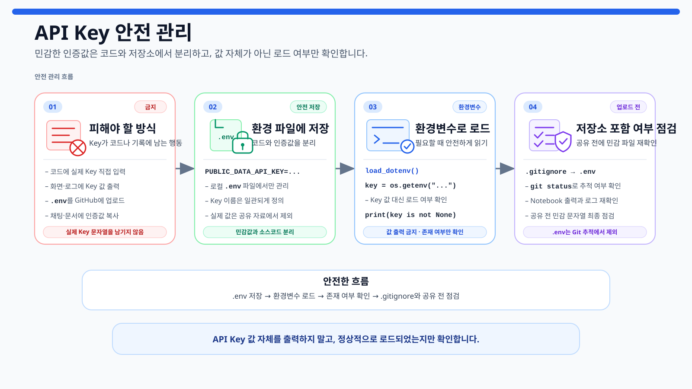
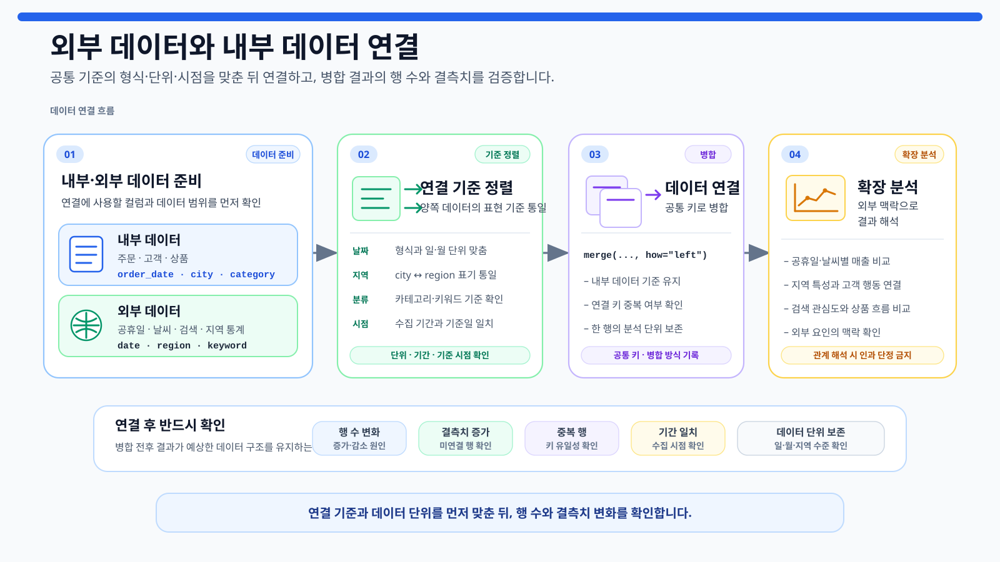

# 13장. 외부 데이터로 분석을 확장하기

지금까지는 저장소에 준비된 온라인 쇼핑몰 데이터를 중심으로 분석했습니다. 실제 프로젝트에서는 내부 데이터만으로 답하기 어려운 질문이 많습니다. 공휴일, 날씨, 지역 통계, 관광 정보, 검색 결과 같은 외부 데이터를 연결하면 분석 범위를 넓힐 수 있습니다.

외부 데이터 수집의 목표는 데이터를 많이 모으는 것이 아닙니다. **분석 질문에 필요한 출처를 고르고, 공식 문서를 확인하고, 최소 범위만 수집하고, 원본과 메타데이터를 보존하며, 기존 데이터와 안전하게 연결하는 것**이 핵심입니다.

<figure class="figure">
  
  <figcaption>그림 13-1. 외부 데이터 수집 전체 흐름도</figcaption>
</figure>

## 1. 외부 데이터는 분석 질문에서 시작한다

먼저 내부 데이터만으로 무엇을 알 수 없는지 정합니다.

| 내부 데이터에서 발견한 현상 | 함께 검토할 외부 데이터 | 연결 기준 | 주의 |
| --- | --- | --- | --- |
| 특정 월 매출이 증가함 | 공휴일, 날씨, 행사, 검색 결과 | 날짜 또는 월 | 함께 움직여도 원인으로 단정하지 않음 |
| 특정 지역 매출이 높음 | 인구, 관광지, 상권 정보 | 행정구역 코드 | 지역 단위와 표본 차이 확인 |
| 관광 서비스를 기획함 | 관광지, 숙박, 음식점, 위치 정보 | 지역 코드, 좌표 | 기준일과 이용조건 확인 |
| 특정 키워드 결과가 증가함 | 공식 검색 API 결과 | 키워드, 수집 시각 | 전체 수요나 여론으로 일반화하지 않음 |

외부 데이터는 새로운 맥락을 제공하지만 인과관계를 자동으로 증명하지 않습니다. 분석 목적, 데이터 기간, 연결 단위가 맞지 않으면 오히려 해석을 흐릴 수 있습니다.

## 2. 수집 방법의 우선순위를 정한다

외부 데이터는 다음 순서로 검토합니다.

| 우선순위 | 방법 | 장점 | 반드시 확인할 항목 |
| ---: | --- | --- | --- |
| 1 | 공식 파일 다운로드 | 원본 보존과 재현이 쉬움 | 기준일, 인코딩, 라이선스 |
| 2 | 공식 API | 최신 데이터와 자동 수집에 유리 | 공식 문서, 인증, 호출 제한, 오류 처리 |
| 3 | 제한적 크롤링 | API가 없는 공개 HTML 일부 확인 가능 | 이용약관, robots.txt, 저작권, 개인정보, 요청 빈도 |

<figure class="figure">
  
  <figcaption>그림 13-2. 외부 데이터 수집 방법 비교</figcaption>
</figure>

공식 파일이나 API가 있다면 크롤링보다 우선합니다. 크롤링은 공개되어 보이는 페이지라고 해서 자동으로 허용되는 것이 아닙니다. 로그인, 접근 제한 우회, 대량 반복 요청, 개인정보 수집은 실습 범위에서 제외합니다.

## 3. 출처와 이용조건을 먼저 기록한다

수집 전에 다음 정보를 기록합니다.

- 제공 기관과 원본 URL
- 데이터 설명과 기준일
- 업데이트 주기
- 라이선스·이용약관·출처 표시 조건
- 인증 방식과 호출 제한
- 수집할 필드와 기간
- 내부 데이터와 연결할 키
- 저장할 원본·정제 파일 경로

공공데이터포털의 OpenAPI는 활용신청과 승인을 거쳐 인증키를 발급받는 방식이 일반적이지만, 승인 방식과 호출량은 데이터별로 다를 수 있습니다. 반드시 선택한 데이터 상세 페이지와 활용 가이드를 확인합니다.

공식 문서는 다음 페이지에서 확인할 수 있습니다.

- [공공데이터포털 이용 가이드](https://www.data.go.kr/ugs/selectPublicDataUseGuideView.do)
- [네이버 블로그 검색 API 문서](https://developers.naver.com/docs/serviceapi/search/blog/blog.md)
- [Robots Exclusion Protocol RFC 9309](https://datatracker.ietf.org/doc/html/rfc9309)
- [Requests timeout과 오류 처리](https://requests.readthedocs.io/en/latest/user/quickstart/#timeouts)

API 주소와 정책은 바뀔 수 있으므로 출간된 예제보다 공식 문서를 우선합니다.

## 4. 외부 데이터 폴더를 분리한다

이번 장에서는 원본, 정제 결과, 메타데이터를 분리합니다.

```text
data/
└─ external/
   ├─ raw/         # API 원본 JSON, 내려받은 원본 파일, 허용된 HTML
   ├─ processed/   # 분석 가능한 CSV
   └─ metadata/    # 출처, 수집 시각, 요청 범위, 파일 해시
reports/
└─ ch13_*.csv 또는 ch13_*.md
```

실제 수집 데이터는 크기가 크거나 재배포 조건이 다를 수 있으므로 Git에 자동으로 올리지 않습니다. 저장소에는 폴더 구조만 유지하고, 제출이 필요한 경우 데이터 대신 출처와 재현 절차를 제공합니다.

전체 실습은 `notebooks/ch13_external_data_collection.ipynb`에서 진행합니다. 네트워크 요청은 기본적으로 비활성화되어 있으며, 공식 문서와 정책을 확인한 뒤 명시적으로 실행합니다.

## 5. 환경과 기본 산출물을 준비한다

프로젝트 루트를 찾습니다.

```python
from pathlib import Path
import sys


def find_project_root(start_path):
    start_path = Path(start_path).resolve()

    for candidate in [start_path, *start_path.parents]:
        if (
            (candidate / "requirements.txt").exists()
            and (candidate / "scripts").exists()
        ):
            return candidate

    raise FileNotFoundError(
        "프로젝트 루트 폴더를 찾을 수 없습니다."
    )


PROJECT_ROOT = find_project_root(Path.cwd())

if str(PROJECT_ROOT) not in sys.path:
    sys.path.insert(0, str(PROJECT_ROOT))
```

네트워크 호출 없이 폴더, 계획표, 체크리스트를 생성합니다.

```python
from src.external_data_collection import (
    run_external_data_collection_setup,
)

setup_result = run_external_data_collection_setup(
    base_dir=PROJECT_ROOT,
    report_dir=PROJECT_ROOT / "reports",
)

setup_result["paths"]
```

프로젝트 루트의 터미널에서도 실행할 수 있습니다.

```powershell
python scripts/run_external_data_collection.py
```

## 6. API Key를 코드와 로그에서 분리한다

`.env.example`을 복사해 `.env`를 만듭니다.

```powershell
copy .env.example .env
```

macOS와 Linux에서는 다음 명령을 사용할 수 있습니다.

```bash
cp .env.example .env
```

`.env`에는 실제 발급값을 입력합니다.

```text
PUBLIC_DATA_API_KEY=your_public_data_api_key_here
NAVER_CLIENT_ID=your_naver_client_id_here
NAVER_CLIENT_SECRET=your_naver_client_secret_here
```

로드 여부만 확인합니다.

```python
env_status = setup_result["outputs"]["env_status"]
env_status
```

다음 원칙을 지킵니다.

- Key 값을 `print()`하지 않습니다.
- 요청 헤더 전체를 로그로 남기지 않습니다.
- 오류 메시지에 인증값이 포함되지 않았는지 확인합니다.
- URL 쿼리에 인증키가 들어가는 API는 저장 전에 마스킹합니다.
- `.env`와 수집 원본 파일을 Git에 커밋하지 않습니다.
- 키가 노출되었다면 즉시 폐기하고 재발급합니다.

## 7. HTTP 요청은 timeout, 오류 처리, 제한적 재시도를 포함한다

`requests`는 timeout을 지정하지 않으면 응답을 계속 기다릴 수 있습니다. 공통 모듈은 연결 timeout과 읽기 timeout을 분리하고, `429`, 일부 `5xx` 응답에 대해서만 제한적으로 재시도합니다.

```python
from src.external_data_collection import (
    build_http_session,
    request_json_api,
)

session = build_http_session(
    total_retries=3,
    backoff_factor=0.5,
)
```

공공데이터 API는 서비스마다 URL, 인증 방식, 파라미터, 응답 구조가 다릅니다. 아래 코드는 실제 문서 값을 채운 뒤 사용합니다.

```python
RUN_PUBLIC_API = False

PUBLIC_API_URL = "https://공식-문서에서-확인한-주소"
PUBLIC_API_PARAMS = {
    "serviceKey": "환경변수에서 읽은 값",
    "pageNo": 1,
    "numOfRows": 100,
    "type": "json",
}

if RUN_PUBLIC_API:
    payload, metadata = request_json_api(
        PUBLIC_API_URL,
        params=PUBLIC_API_PARAMS,
        session=session,
    )
```

실행 전 확인할 항목은 다음과 같습니다.

- 인증키가 헤더인지 쿼리 파라미터인지
- JSON과 XML 중 어떤 형식을 반환하는지
- 페이지 번호와 페이지 크기 제한
- 오류가 HTTP 상태 코드인지 응답 본문 코드인지
- 인증키가 이미 인코딩된 값인지
- 호출 제한과 `Retry-After` 헤더가 있는지

문자열로 URL을 직접 이어 붙이기보다 `params` 딕셔너리를 사용합니다. 다만 인증키 인코딩 방식은 API별 문서를 그대로 따릅니다.

<figure class="figure">
  
  <figcaption>그림 13-3. API 수집과 검증 흐름</figcaption>
</figure>

## 8. 네이버 블로그 검색 API를 사용한다

네이버 블로그 검색 API는 HTTP 헤더에 Client ID와 Client Secret을 전달합니다. 공식 문서 기준으로 `display`는 1~100, `start`는 1~1000이며, 정렬은 `sim` 또는 `date`를 사용합니다. 호출 한도와 정책은 변경될 수 있으므로 개발자 센터에서 다시 확인합니다.

<figure class="figure">
  
  <figcaption>그림 13-4. API Key 안전 관리</figcaption>
</figure>

Notebook에서는 실제 네트워크 호출을 기본적으로 끕니다.

```python
from src.external_data_collection import (
    naver_blog_items_to_dataframe,
    save_json_snapshot,
    search_naver_blog,
)

RUN_NAVER_API = False

if RUN_NAVER_API:
    result, metadata = search_naver_blog(
        "제주 여행",
        display=10,
        start=1,
        sort="sim",
        session=session,
    )

    raw_path = save_json_snapshot(
        result,
        setup_result["paths"]["raw"]
        / "naver_blog_jeju.json",
    )

    naver_blog_df = naver_blog_items_to_dataframe(
        result
    )
    processed_path = (
        setup_result["paths"]["processed"]
        / "naver_blog_jeju.csv"
    )
    naver_blog_df.to_csv(
        processed_path,
        index=False,
        encoding="utf-8-sig",
    )

    display(metadata)
    display(naver_blog_df.head())
```

제목과 설명에는 검색어 강조용 HTML 태그가 포함될 수 있으므로 정제 컬럼을 사용합니다. `postdate`는 날짜형으로 변환합니다.

검색 API 결과는 검색어, 정렬 방식, 페이지 범위, 수집 시각, 검색 정책의 영향을 받습니다. 전체 여론, 시장 규모, 실제 구매 수요를 대표한다고 단정하지 않습니다.

## 9. 크롤링은 robots.txt와 이용약관을 각각 확인한다

robots.txt는 자동 수집 클라이언트가 따라야 할 접근 규칙을 전달하는 표준입니다. 그러나 robots.txt 허용은 계약상 이용허락이나 저작권 사용 허가가 아닙니다. 이용약관, 라이선스, 개인정보, 콘텐츠 사용 범위는 별도로 확인해야 합니다.

공통 모듈의 크롤링 함수는 다음 조건을 적용합니다.

- `http`와 `https`만 허용
- localhost와 사설·루프백 주소 차단
- robots.txt 확인
- 이용약관 확인 여부를 `policy_confirmed=True`로 명시
- 리다이렉트 발생 시 자동 추적하지 않고 재검토
- HTML 응답만 허용
- 응답 크기 제한
- timeout과 HTTP 오류 처리

```python
from src.external_data_collection import (
    extract_title_and_links,
    fetch_public_html,
    save_text_snapshot,
)

RUN_CRAWLING_EXAMPLE = False
POLICY_CONFIRMED = False
TARGET_URL = "https://example.com/"

if RUN_CRAWLING_EXAMPLE and POLICY_CONFIRMED:
    html, metadata = fetch_public_html(
        TARGET_URL,
        policy_confirmed=True,
        respect_robots=True,
        session=session,
    )

    raw_html_path = save_text_snapshot(
        html,
        setup_result["paths"]["raw"]
        / "example_page.html",
    )

    page_title, links_df = extract_title_and_links(
        html,
        base_url=TARGET_URL,
    )

    links_df.to_csv(
        setup_result["paths"]["processed"]
        / "example_links.csv",
        index=False,
        encoding="utf-8-sig",
    )

    print(page_title)
    display(metadata)
    display(links_df.head())
```

실제 사이트에서는 다음을 추가로 확인합니다.

- 로그인이나 유료 구독이 필요한가?
- 자동 수집을 금지하는 이용약관이 있는가?
- 페이지 원문을 재배포해도 되는가?
- 개인정보나 사용자 작성 콘텐츠가 포함되는가?
- 한 페이지 확인인지 반복·대량 수집인지
- 서버 부담을 줄일 요청 간격과 캐시 전략이 있는가?

`User-Agent`를 브라우저처럼 속여 접근 제한을 우회하지 않습니다. 자동 수집 주체를 식별할 수 있는 User-Agent를 사용합니다.

## 10. 원본, 정제 결과, 메타데이터를 함께 보관한다

같은 데이터를 다시 만들 수 있도록 다음을 구분해 저장합니다.

| 구분 | 예시 |
| --- | --- |
| 원본 | API JSON, 내려받은 CSV, 허용된 HTML |
| 정제 결과 | 필요한 컬럼만 정리한 CSV |
| 메타데이터 | 제공 기관, URL, 기준일, 수집 UTC 시각, 요청 범위 |
| 무결성 | 원본 파일 SHA-256 |
| 검증 | 행·열 수, 결측치, 중복, 파싱 실패 |
| 정책 | 라이선스·이용약관·robots.txt 확인 결과 |

파일 해시를 기록하면 이후 원본이 바뀌었는지 확인할 수 있습니다.

```python
from src.external_data_collection import sha256_file

# raw_file_hash = sha256_file(raw_path)
```

수집 일시와 데이터 기준일은 다릅니다. 오늘 내려받은 파일이 작년 기준 통계일 수 있으므로 두 값을 분리해 기록합니다.

## 11. 외부 데이터를 병합할 때 행 증가를 검증한다

외부 데이터는 날짜, 지역, 카테고리, 키워드, 위치 중 하나로 내부 데이터와 연결합니다.

<figure class="figure">
  
  <figcaption>그림 13-5. 외부 데이터와 내부 데이터 연결</figcaption>
</figure>

연결 전에 분석 단위를 맞춥니다.

- 일별과 월별 데이터
- 한국 표준시와 UTC
- 서울, 서울특별시, 행정구역 코드
- 상품 카테고리 분류 체계
- 위도·경도 좌표계
- 검색어와 수집 기간

공통 병합 함수는 `validate`와 `indicator`를 사용해 행 수와 미매칭을 확인합니다.

```python
from src.external_data_collection import (
    merge_external_data,
)

merged_monthly, merge_check = merge_external_data(
    monthly_sales,
    external_monthly,
    on="order_month",
    how="left",
    validate="many_to_one",
)

display(merge_check)
```

`left merge`도 오른쪽 키가 중복되면 행 수가 증가할 수 있습니다. 병합 전후 행 수, `left_only` 건수, 기간과 키의 중복을 반드시 확인합니다.

## 12. LLM에는 공식 문서 일부와 검증 조건을 함께 제공한다

LLM은 API 호출 코드 초안을 만드는 데 유용하지만 오래된 주소, 존재하지 않는 파라미터, 잘못된 응답 구조를 제안할 수 있습니다. API Key와 실제 내부 URL을 전달하지 않고, 공식 문서에서 확인한 구조만 제공합니다.

```text
역할:
외부 데이터 수집 코드 검토자

목적:
공식 JSON API에서 필요한 필드만 수집합니다.

공식 문서에서 확인한 정보:
- 요청 URL: 실제 공식 URL
- HTTP 메서드: GET
- 인증 위치: 헤더 또는 serviceKey 파라미터
- 파라미터: 공식 문서에 있는 항목만 작성
- 응답 구조: 실제 JSON 경로
- 호출 제한: 공식 문서 기준

요청:
1. requests와 params 딕셔너리 사용
2. 연결·읽기 timeout 지정
3. 429와 일시적 5xx만 제한적으로 재시도
4. raise_for_status와 JSON 파싱 오류 처리
5. 원본 JSON과 정제 CSV 분리 저장
6. 출처, UTC 수집 시각, 요청 범위 기록

제약:
- API Key를 코드, URL 로그, 오류 메시지에 노출하지 말 것
- 공식 문서에 없는 파라미터를 만들지 말 것
- 로그인·접근 제한 우회 코드를 제안하지 말 것
- 검색·크롤링 결과를 전체 여론이나 인과관계로 해석하지 말 것
```

LLM 답변은 다음 순서로 검증합니다.

1. 공식 URL과 파라미터가 맞는가?
2. 인증 정보가 노출되지 않는가?
3. timeout과 오류 처리가 있는가?
4. 응답 JSON 경로가 실제와 일치하는가?
5. 페이지네이션과 호출 제한을 지키는가?
6. 원본과 정제 결과가 분리되는가?
7. 이용약관과 수집 범위를 우회하지 않는가?

## 13. 생성되는 결과 파일

네트워크를 호출하지 않아도 다음 준비 자료가 생성됩니다.

- `reports/ch13_external_data_plan.csv`
- `reports/ch13_collection_method_summary.csv`
- `reports/ch13_external_integration_plan.csv`
- `reports/ch13_external_data_checklist.csv`
- `reports/ch13_external_data_log.csv`
- `reports/ch13_env_key_status.csv`
- `reports/ch13_external_data_summary.md`

실제 수집을 수행하면 `data/external/raw/`, `processed/`, `metadata/`에 별도 파일을 저장합니다.

## 14. 제출 전 체크리스트

| 점검 항목 | 확인 |
| --- | --- |
| 분석 질문에 필요한 데이터만 수집했는가? | □ |
| 공식 파일 또는 공식 API를 먼저 확인했는가? | □ |
| 제공 기관, URL, 기준일, 수집 시각을 기록했는가? | □ |
| 라이선스와 이용약관을 확인했는가? | □ |
| API Key와 인증 헤더를 노출하지 않았는가? | □ |
| timeout, 오류 처리, 제한적 재시도를 적용했는가? | □ |
| 원본 응답과 정제 결과를 분리했는가? | □ |
| 크롤링 전 robots.txt와 이용약관을 각각 확인했는가? | □ |
| 로그인·접근 제한 우회를 하지 않았는가? | □ |
| 개인정보와 저작물 원문을 불필요하게 저장하지 않았는가? | □ |
| 병합 전후 행 수와 미매칭을 확인했는가? | □ |
| 검색 결과를 전체 수요나 여론으로 단정하지 않았는가? | □ |
| LLM 코드가 공식 문서와 일치하는지 확인했는가? | □ |

## 15. 정리

이번 장에서 익힌 핵심 원칙은 다음과 같습니다.

- 외부 데이터 수집은 분석 질문에서 시작합니다.
- 공식 파일과 공식 API를 크롤링보다 우선합니다.
- API 주소와 정책은 출간 예제가 아니라 현재 공식 문서를 기준으로 확인합니다.
- 인증 정보는 코드, 로그, URL, GitHub에서 분리합니다.
- 네트워크 요청에는 timeout, 오류 처리, 제한적 재시도를 포함합니다.
- robots.txt와 이용약관은 서로 다른 확인 항목입니다.
- 원본, 정제 결과, 메타데이터, 파일 해시를 함께 관리합니다.
- 외부 데이터 병합 후 행 수와 미매칭을 검증합니다.
- 검색 결과나 동시 변화를 인과관계로 단정하지 않습니다.

다음 장에서는 수집·분석·보고 흐름을 반복 실행할 수 있도록 자동화 파이프라인으로 연결합니다.
