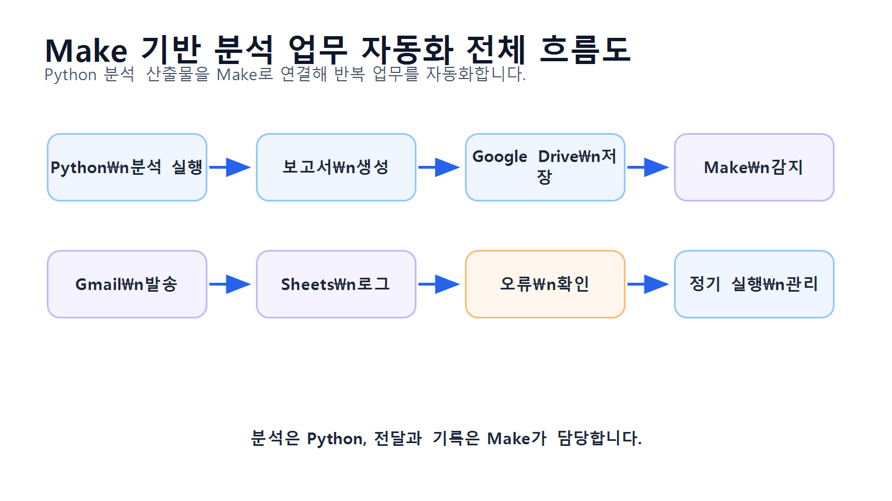
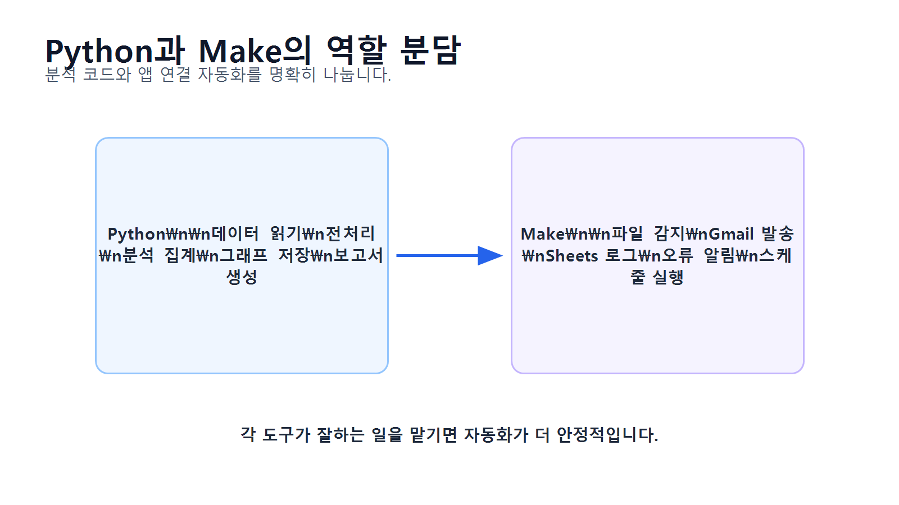
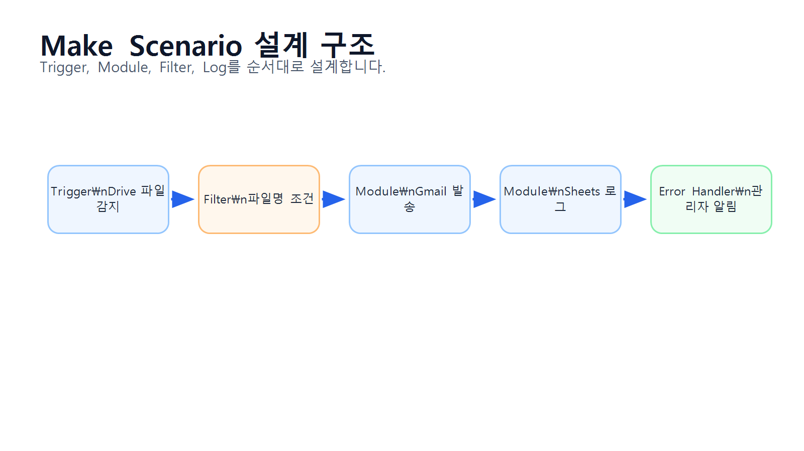
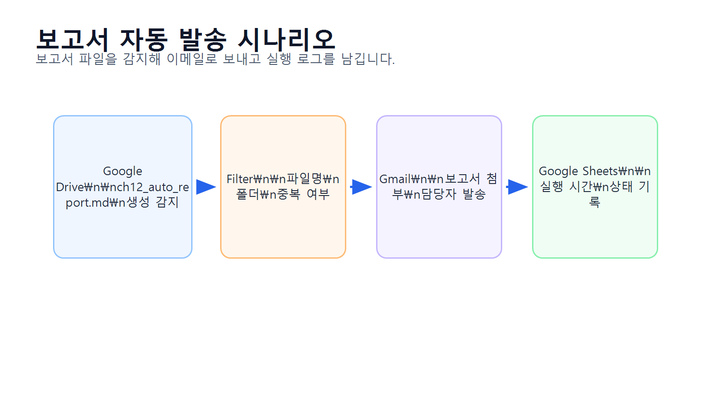
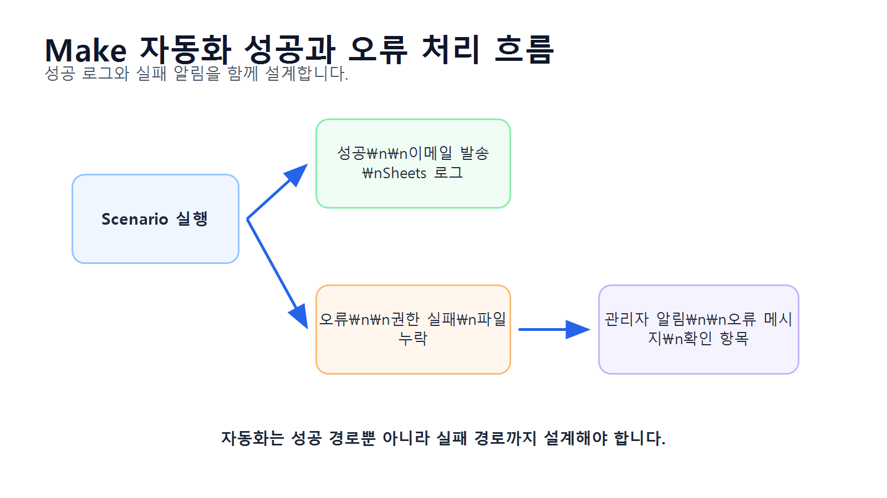

# 13장 Make 기반 반복 분석 업무 자동화

이 장에서는 지금까지 작성한 데이터 분석 코드와 보고서를 반복 업무 자동화 흐름으로 연결하는 방법을 배웁니다. Chapter 12에서는 분석 결과를 Markdown 보고서로 자동 작성하는 방법을 다루었다면, 이번 장에서는 생성된 보고서와 그래프 파일을 Make를 활용해 자동으로 전달하고 기록하는 흐름을 구성합니다.

데이터 분석 업무에서는 같은 작업을 반복하는 경우가 많습니다. 예를 들어 매주 월요일마다 데이터를 확인하고, 분석 스크립트를 실행하고, 보고서를 만들고, 담당자에게 이메일로 보내고, 처리 이력을 남기는 일이 반복될 수 있습니다. 이런 작업을 매번 사람이 수동으로 하면 시간이 오래 걸리고 누락 가능성도 커집니다.

Make는 여러 앱과 서비스를 연결해 업무 흐름을 자동화할 수 있는 도구입니다. Python 분석 스크립트, Google Drive, Gmail, Slack, Google Sheets 같은 도구를 연결하면 분석 결과 파일이 생성되었을 때 자동으로 저장, 전달, 기록하는 흐름을 만들 수 있습니다.

이번 장의 핵심은 <strong>분석 코드 자체를 모두 Make에서 처리하는 것이 아니라, Python 분석 결과를 Make로 연결해 반복 업무를 자동화하는 능력</strong>입니다.

## 수업 시간 구성

| 구성                          |  권장 시간 |
| --------------------------- | -----: |
| 반복 분석 업무 자동화 개념 이해          |    30분 |
| Make 기본 구조 이해               |    35분 |
| 자동화 대상 업무 정의                |    35분 |
| Python 분석 산출물 준비            |    40분 |
| Google Drive 기반 파일 전달 흐름 구성 |    45분 |
| Gmail 보고서 발송 자동화            |    45분 |
| Google Sheets 처리 로그 기록      |    40분 |
| 오류 처리와 검증 체크리스트 작성          |    40분 |
| 연습 문제 및 심화 과제               | 60~90분 |

기본 수업은 약 3시간을 기준으로 구성되어 있습니다. 실제 Make 시나리오 구성, Gmail 발송 테스트, 로그 기록, 오류 처리까지 포함하면 최대 5시간 분량으로 확장할 수 있습니다.

## 1. 학습 목표

이 장을 마치면 학습자는 다음을 할 수 있습니다.

* 반복 분석 업무에서 자동화가 필요한 이유를 설명할 수 있습니다.
* Make의 기본 구성 요소인 Scenario, Trigger, Module, Connection을 설명할 수 있습니다.
* Python 분석 코드와 Make 자동화의 역할을 구분할 수 있습니다.
* 분석 결과 파일을 Google Drive 동기화 폴더에 저장하는 구조를 설계할 수 있습니다.
* Make에서 새 보고서 파일을 감지하는 흐름을 구성할 수 있습니다.
* Gmail을 통해 분석 보고서를 자동 발송하는 시나리오를 설계할 수 있습니다.
* Google Sheets에 자동화 실행 로그를 기록할 수 있습니다.
* 자동화 실패 가능성과 검증 항목을 정리할 수 있습니다.
* LLM을 활용해 Make 자동화 시나리오 설계 초안을 만들 수 있습니다.
* 자동화 결과를 보고서와 운영 문서로 정리할 수 있습니다.

## 2. 이번 장에서 만들 결과물

이번 장에서는 Make를 활용한 반복 분석 업무 자동화 설계와 실행 흐름을 만듭니다.

이번 장에서 만들 결과물은 다음과 같습니다.

* 반복 분석 업무 자동화 시나리오 설계표
* Python 분석 산출물 폴더 구조
* Google Drive 업로드 대상 파일 목록
* Make Scenario 구성표
* Gmail 자동 발송 템플릿
* Google Sheets 실행 로그 구조
* 자동화 검증 체크리스트
* 오류 처리 기준표
* `reports/ch13_make_automation_plan.md`
* `reports/ch13_make_execution_log_template.csv`
* `reports/ch13_make_validation_checklist.csv`

아래 그림은 Python 분석 결과가 Make 자동화 흐름으로 연결되는 전체 구조를 보여줍니다.

<figure class="figure">
  
  <figcaption>그림 13-1. Make 기반 분석 업무 자동화 전체 흐름도</figcaption>
</figure>

## 3. 핵심 개념

### 3.1 반복 분석 업무 자동화란 무엇인가

반복 분석 업무 자동화는 사람이 매번 수동으로 처리하던 분석 관련 작업을 정해진 조건에 따라 자동으로 실행되게 만드는 것입니다.

예를 들어 다음과 같은 작업이 자동화 대상이 될 수 있습니다.

| 반복 업무           | 자동화 방식                 |
| --------------- | ---------------------- |
| 매주 분석 보고서 파일 확인 | 정해진 시간에 폴더 확인          |
| 보고서 파일 업로드      | Google Drive 폴더에 자동 저장 |
| 보고서 이메일 발송      | Gmail 모듈로 자동 발송        |
| 담당자 알림          | Slack 또는 이메일 알림        |
| 처리 이력 기록        | Google Sheets에 로그 추가   |
| 실패 여부 확인        | 오류 발생 시 관리자에게 알림       |

중요한 점은 모든 분석을 Make에서 직접 수행하는 것이 아니라는 것입니다. Python은 데이터 분석과 보고서 생성을 담당하고, Make는 반복적인 전달·알림·기록 업무를 담당하는 구조가 실무적으로 더 안정적입니다.

### 3.2 Make의 기본 구성 요소

Make에서는 자동화 흐름을 Scenario라고 부릅니다. 하나의 Scenario는 Trigger와 여러 Module로 구성됩니다.

| 구성 요소         | 설명           | 예시                                |
| ------------- | ------------ | --------------------------------- |
| Scenario      | 자동화 전체 흐름    | 주간 분석 보고서 발송                      |
| Trigger       | 자동화 시작 조건    | 새 파일 생성, 정해진 시간                   |
| Module        | 실행할 작업 단위    | 파일 검색, 이메일 발송                     |
| Connection    | 외부 서비스 연결 정보 | Google Drive, Gmail               |
| Filter        | 조건 분기        | 파일명이 `ch12_auto_report.md`일 때만 실행 |
| Router        | 여러 흐름으로 분기   | 이메일 발송과 로그 기록 동시 수행               |
| Error Handler | 오류 처리        | 실패 시 관리자에게 알림                     |

이번 장에서는 가장 단순하고 실습하기 쉬운 구조로 진행합니다.

```text id="esf4nf"
Google Drive 새 보고서 감지
→ Gmail로 보고서 발송
→ Google Sheets에 실행 로그 기록
```

### 3.3 Python과 Make의 역할 구분

데이터 분석 자동화에서는 Python과 Make의 역할을 구분하는 것이 중요합니다.

| 영역       | Python 역할           | Make 역할          |
| -------- | ------------------- | ---------------- |
| 데이터 불러오기 | CSV 읽기              | 보통 직접 수행하지 않음    |
| 전처리      | 결측치, 중복, 타입 처리      | 보통 직접 수행하지 않음    |
| 분석       | pandas 집계           | 보통 직접 수행하지 않음    |
| 시각화      | 그래프 PNG 저장          | 파일 전달            |
| 보고서 생성   | Markdown 보고서 작성     | 보고서 감지 및 발송      |
| 알림       | 선택적으로 가능            | Gmail, Slack 발송  |
| 로그       | CSV 저장 가능           | Google Sheets 기록 |
| 스케줄      | Python scheduler 가능 | Scenario 스케줄 가능  |

초보자 실습에서는 Python이 `reports/` 폴더에 보고서와 그래프를 생성하고, Make가 해당 파일을 감지해 이메일과 로그를 처리하는 방식이 가장 이해하기 쉽습니다.

아래 그림은 Python과 Make의 역할 분담을 보여줍니다.

<figure class="figure">
  
  <figcaption>그림 13-2. Python과 Make의 역할 분담</figcaption>
</figure>

### 3.4 자동화 트리거 설계

자동화는 언제 시작할지 정해야 합니다. 이것을 Trigger라고 합니다.

반복 분석 업무에서 자주 사용하는 Trigger는 다음과 같습니다.

| Trigger 방식 | 설명            | 적합한 상황       |
| ---------- | ------------- | ------------ |
| 일정 기반      | 매일, 매주, 매월 실행 | 정기 보고서       |
| 파일 감지      | 새 파일이 생기면 실행  | 보고서 생성 후 발송  |
| Webhook    | 외부 요청이 오면 실행  | 앱 또는 스크립트 연동 |
| 수동 실행      | 사람이 버튼을 눌러 실행 | 테스트, 검수      |
| 이메일 수신     | 특정 이메일이 오면 실행 | 외부 데이터 수신    |

이번 장에서는 초보자가 가장 쉽게 실습할 수 있는 파일 감지 방식과 일정 기반 방식을 중심으로 다룹니다.

### 3.5 Google Drive를 사용하는 이유

Make는 로컬 PC의 일반 폴더를 직접 감시하기 어렵습니다. 따라서 분석 결과를 Google Drive 동기화 폴더에 저장하면 Make가 Google Drive의 새 파일을 감지할 수 있습니다.

예를 들어 Python 보고서 저장 경로를 다음처럼 설정할 수 있습니다.

```text id="wpczii"
Google Drive/My Drive/llm-data-analysis-course/reports/
```

또는 Windows에서 Google Drive 동기화 폴더를 사용한다면 다음과 같은 구조가 될 수 있습니다.

```text id="8mfgjy"
G:/My Drive/llm-data-analysis-course/reports/
```

실습에서는 사용자의 실제 Google Drive 경로에 맞게 조정해야 합니다.

### 3.6 자동화 검증이 필요한 이유

자동화는 한 번 설정하면 편리하지만, 잘못 설정하면 같은 오류가 반복될 수 있습니다.

자동화에서 자주 발생하는 문제는 다음과 같습니다.

| 문제        | 예시                          |
| --------- | --------------------------- |
| 파일 경로 오류  | Make가 보고서 파일을 찾지 못함         |
| 파일명 조건 오류 | 다른 파일을 잘못 발송                |
| 권한 오류     | Google Drive 또는 Gmail 연결 실패 |
| 첨부 누락     | 이메일에 보고서가 첨부되지 않음           |
| 중복 발송     | 같은 파일을 여러 번 전송              |
| 로그 누락     | 실행 기록이 남지 않음                |
| 수신자 오류    | 잘못된 이메일 주소로 발송              |
| 오래된 파일 발송 | 최신 보고서가 아닌 이전 파일 사용         |

따라서 자동화는 반드시 테스트 파일로 먼저 검증해야 합니다.

### 3.7 자동화 설계 문서가 필요한 이유

자동화는 설정 화면만 보고 이해하기 어렵습니다. 따라서 자동화 시나리오를 문서로 정리해야 합니다.

자동화 설계 문서에는 다음 내용이 포함되어야 합니다.

| 항목      | 설명                         |
| ------- | -------------------------- |
| 자동화 이름  | 주간 분석 보고서 발송               |
| 목적      | 보고서 발송 반복 작업 감소            |
| Trigger | Google Drive 새 파일 감지       |
| 입력 파일   | `ch12_auto_report.md`      |
| 처리 단계   | 파일 검색, 이메일 발송, 로그 기록       |
| 출력 결과   | Gmail 발송, Google Sheets 로그 |
| 실패 처리   | 관리자 이메일 알림                 |
| 검증 기준   | 첨부 여부, 수신자, 로그 기록          |

아래 그림은 Make Scenario 설계 구조를 보여줍니다.

<figure class="figure">
  
  <figcaption>그림 13-3. Make Scenario 설계 구조</figcaption>
</figure>

## 4. 실습 시나리오

이번 장의 실습 시나리오는 다음과 같습니다.

> Python 분석 스크립트를 통해 `reports/ch12_auto_report.md` 보고서와 그래프 이미지가 생성되었습니다. 이 파일을 Google Drive에 저장한 뒤, Make가 새 보고서 파일을 감지하면 Gmail로 담당자에게 보고서를 보내고, Google Sheets에 실행 로그를 남기는 자동화 시나리오를 구성합니다.

이번 장의 자동화 흐름은 다음과 같습니다.

1. Python 분석 코드 실행
2. `reports/ch12_auto_report.md` 생성
3. 보고서와 그래프 파일을 Google Drive 동기화 폴더에 저장
4. Make에서 Google Drive 새 파일 감지
5. 파일명이 `ch12_auto_report.md`인지 확인
6. Gmail로 담당자에게 보고서 발송
7. Google Sheets에 실행 로그 추가
8. 오류 발생 시 관리자에게 알림

아래 그림은 이번 장에서 구현할 보고서 자동 발송 흐름을 보여줍니다.

<figure class="figure">
  
  <figcaption>그림 13-4. 보고서 자동 발송 시나리오</figcaption>
</figure>

## 5. 실습 준비

### 5.1 필요한 계정과 도구

이번 장 실습에는 다음 도구가 필요합니다.

| 도구                | 용도                |
| ----------------- | ----------------- |
| Python            | 분석 코드 실행 및 보고서 생성 |
| Google Drive      | 분석 결과 파일 저장       |
| Gmail             | 보고서 자동 발송         |
| Google Sheets     | 실행 로그 기록          |
| Make              | 자동화 시나리오 구성       |
| VSCode 또는 Jupyter | 분석 코드 실행          |

실제 수업에서는 개인 계정을 사용하기보다 실습용 계정을 사용하는 것이 좋습니다.

### 5.2 실습용 폴더 구조

Google Drive에 다음 폴더를 준비합니다.

```text id="f5ugru"
llm-data-analysis-course/
├─ reports/
│  ├─ ch12_auto_report.md
│  └─ figures/
│     ├─ ch08_category_sales.png
│     ├─ ch08_monthly_sales.png
│     └─ ch08_top_customers.png
└─ automation_logs/
```

로컬 프로젝트에서는 다음 구조와 연결됩니다.

```text id="m4394w"
llm-data-analysis-course/
├─ reports/
├─ notebooks/
├─ data/
└─ scripts/
```

Google Drive 동기화 폴더를 사용하는 경우, Python 보고서 출력 경로를 Drive 폴더로 바꿀 수 있습니다.

### 5.3 보고서 파일 준비

Chapter 12 Notebook을 실행해 다음 파일을 생성합니다.

```text id="zdhu90"
reports/ch12_auto_report.md
reports/figures/ch08_category_sales.png
reports/figures/ch08_monthly_sales.png
reports/figures/ch08_top_customers.png
```

파일이 생성되었는지 Python으로 확인합니다.

```python id="tw28nu"
from pathlib import Path

report_dir = Path("reports")
figure_dir = report_dir / "figures"

files_to_check = [
    report_dir / "ch12_auto_report.md",
    figure_dir / "ch08_category_sales.png",
    figure_dir / "ch08_monthly_sales.png",
    figure_dir / "ch08_top_customers.png",
]

for file_path in files_to_check:
    print(file_path, file_path.exists())
```

Notebook을 `notebooks` 폴더에서 실행한다면 다음처럼 경로를 조정합니다.

```python id="0x9enz"
report_dir = Path("../reports")
figure_dir = report_dir / "figures"
```

## 6. Make Scenario 설계

### 6.1 Scenario 1: Google Drive 보고서 파일 감지

첫 번째 Module은 Google Drive에서 새 파일을 감지하는 역할입니다.

설정 개념은 다음과 같습니다.

| 항목      | 설정 예시                              |
| ------- | ---------------------------------- |
| App     | Google Drive                       |
| Trigger | Watch files in a folder            |
| Folder  | `llm-data-analysis-course/reports` |
| 조건      | 새 파일이 생성될 때                        |
| 대상 파일   | `ch12_auto_report.md`              |

필터 조건은 다음처럼 설계합니다.

```text id="r3036c"
파일명 equals ch12_auto_report.md
```

이 필터를 추가하면 다른 파일이 업로드되었을 때 자동 발송되는 문제를 줄일 수 있습니다.

### 6.2 Scenario 2: Gmail 보고서 발송

두 번째 Module은 Gmail로 보고서를 발송하는 역할입니다.

설정 개념은 다음과 같습니다.

| 항목         | 설정 예시                     |
| ---------- | ------------------------- |
| App        | Gmail                     |
| Action     | Send an email             |
| To         | 담당자 이메일                   |
| Subject    | `[자동발송] 온라인 쇼핑몰 분석 보고서`   |
| Body       | 보고서 안내 문구                 |
| Attachment | Google Drive에서 감지한 보고서 파일 |

이메일 본문 예시는 다음과 같습니다.

```text id="2q2lko"
안녕하세요.

온라인 쇼핑몰 데이터 분석 자동 보고서를 전달드립니다.

첨부 파일:
- ch12_auto_report.md

확인 항목:
- 카테고리별 매출
- 월별 매출
- 구매 금액 상위 고객
- 인사이트 카드
- 한계점 및 다음 단계

본 메일은 Make 자동화 시나리오를 통해 발송되었습니다.
감사합니다.
```

### 6.3 Scenario 3: Google Sheets 실행 로그 기록

세 번째 Module은 Google Sheets에 자동화 실행 이력을 남기는 역할입니다.

Google Sheets에 다음 컬럼을 준비합니다.

| 컬럼명           | 설명       |
| ------------- | -------- |
| executed_at   | 실행 시각    |
| scenario_name | 자동화 이름   |
| file_name     | 처리 파일명   |
| file_path     | 파일 경로    |
| email_to      | 수신자      |
| status        | 성공 또는 실패 |
| memo          | 비고       |

Make에서는 Gmail 발송 후 Google Sheets의 Add a row 기능을 사용해 로그를 추가합니다.

로그 예시는 다음과 같습니다.

| executed_at      | scenario_name          | file_name           | email_to                                          | status  | memo     |
| ---------------- | ---------------------- | ------------------- | ------------------------------------------------- | ------- | -------- |
| 2026-06-19 09:00 | weekly_report_delivery | ch12_auto_report.md | [manager@example.com](mailto:manager@example.com) | success | 자동 발송 완료 |

### 6.4 Scenario 4: 오류 발생 시 알림

자동화 실패 시 별도 알림을 보내는 흐름도 설계할 수 있습니다.

오류 발생 시 알림 예시는 다음과 같습니다.

```text id="kb6s20"
[자동화 오류] 분석 보고서 발송 실패

오류가 발생했습니다.

확인 필요 항목:
- Google Drive 파일 존재 여부
- Gmail 연결 상태
- 수신자 이메일 주소
- 첨부 파일 권한
- Make Scenario 실행 로그
```

처음 실습에서는 오류 처리까지 복잡하게 만들기보다, 수동 테스트 후 로그를 확인하는 수준으로 진행해도 충분합니다.

아래 그림은 자동화 성공과 실패 흐름을 함께 보여줍니다.

<figure class="figure">
  
  <figcaption>그림 13-5. Make 자동화 성공과 오류 처리 흐름</figcaption>
</figure>

## 7. 실습 코드

이번 장의 전체 실습은 다음 Notebook에서 진행합니다.

```text id="4piq01"
notebooks/ch13_make_automation.ipynb
```

본문에는 Make와 연결하기 위한 파일 준비 및 자동화 설계 문서 생성 코드를 제공합니다.

### 7.1 기본 패키지 불러오기

```python id="l6xlqh"
from pathlib import Path
from datetime import datetime
import pandas as pd
```

경로를 설정합니다.

```python id="2452wl"
report_dir = Path("reports")
figure_dir = report_dir / "figures"
report_dir.mkdir(parents=True, exist_ok=True)
figure_dir.mkdir(parents=True, exist_ok=True)
```

Notebook을 `notebooks` 폴더 안에서 실행하는 경우에는 다음 경로를 사용합니다.

```python id="h8mnxh"
report_dir = Path("../reports")
figure_dir = report_dir / "figures"
```

### 7.2 Make 자동화 대상 파일 확인

```python id="6qcl3b"
automation_files = [
    report_dir / "ch12_auto_report.md",
    figure_dir / "ch08_category_sales.png",
    figure_dir / "ch08_monthly_sales.png",
    figure_dir / "ch08_top_customers.png",
]

automation_file_check = pd.DataFrame({
    "file_name": [file.name for file in automation_files],
    "path": [str(file) for file in automation_files],
    "exists": [file.exists() for file in automation_files]
})

automation_file_check
```

저장합니다.

```python id="7yzgkw"
automation_file_check.to_csv(
    report_dir / "ch13_automation_file_check.csv",
    index=False
)
```

### 7.3 자동화 시나리오 설계표 만들기

```python id="1l33m2"
make_scenario_plan = pd.DataFrame({
    "step": [
        1,
        2,
        3,
        4,
        5
    ],
    "module": [
        "Google Drive",
        "Filter",
        "Gmail",
        "Google Sheets",
        "Error Notification"
    ],
    "action": [
        "Watch files in reports folder",
        "Check file name equals ch12_auto_report.md",
        "Send report email with attachment",
        "Add execution log row",
        "Send error alert email"
    ],
    "input": [
        "reports folder",
        "file name",
        "report file, recipient email",
        "execution result",
        "error message"
    ],
    "output": [
        "new file detected",
        "target report file only",
        "email sent",
        "log row added",
        "admin notified"
    ]
})

make_scenario_plan
```

저장합니다.

```python id="1r0ck4"
make_scenario_plan.to_csv(
    report_dir / "ch13_make_scenario_plan.csv",
    index=False
)
```

### 7.4 실행 로그 템플릿 만들기

```python id="2dz8pr"
execution_log_template = pd.DataFrame({
    "executed_at": [],
    "scenario_name": [],
    "file_name": [],
    "file_path": [],
    "email_to": [],
    "status": [],
    "memo": []
})

execution_log_template
```

저장합니다.

```python id="u7z7xo"
execution_log_template.to_csv(
    report_dir / "ch13_make_execution_log_template.csv",
    index=False
)
```

### 7.5 자동화 검증 체크리스트 만들기

```python id="cxsd0y"
make_validation_checklist = pd.DataFrame({
    "check_item": [
        "Google Drive 보고서 폴더가 존재하는가?",
        "ch12_auto_report.md 파일이 존재하는가?",
        "그래프 이미지 파일이 함께 존재하는가?",
        "Make Google Drive 연결이 정상인가?",
        "파일명 필터가 설정되어 있는가?",
        "Gmail 연결이 정상인가?",
        "수신자 이메일 주소가 올바른가?",
        "이메일 제목과 본문이 적절한가?",
        "보고서 파일이 첨부되는가?",
        "Google Sheets 로그 시트가 준비되어 있는가?",
        "발송 성공 후 로그가 기록되는가?",
        "실패 시 확인할 오류 로그가 있는가?",
        "같은 파일이 중복 발송되지 않는가?",
        "테스트 수신자에게 먼저 발송했는가?"
    ],
    "result": ["□"] * 14,
    "memo": [""] * 14
})

make_validation_checklist
```

저장합니다.

```python id="4n6wbn"
make_validation_checklist.to_csv(
    report_dir / "ch13_make_validation_checklist.csv",
    index=False
)
```

### 7.6 이메일 본문 템플릿 만들기

```python id="ktr0rd"
email_template = """
안녕하세요.

온라인 쇼핑몰 데이터 분석 자동 보고서를 전달드립니다.

첨부 파일:
- ch12_auto_report.md

주요 포함 내용:
- 데이터 개요
- 카테고리별 매출 분석
- 월별 매출 분석
- 구매 금액 상위 고객 분석
- 인사이트 카드
- 한계점 및 다음 단계

확인 후 보완이 필요한 부분이 있으면 회신 부탁드립니다.

본 메일은 Make 자동화 시나리오를 통해 발송되었습니다.

감사합니다.
"""

print(email_template)
```

저장합니다.

```python id="t94cp5"
email_template_path = report_dir / "ch13_email_template.txt"
email_template_path.write_text(email_template, encoding="utf-8")
```

### 7.7 자동화 설계 문서 작성하기

````python id="vf2quf"
today = datetime.now().strftime("%Y-%m-%d")

automation_plan_text = f"""
# Chapter 13 Make 기반 반복 분석 업무 자동화 설계서

작성일: {today}

## 1. 자동화 목적

Python으로 생성한 온라인 쇼핑몰 분석 보고서를 Google Drive에 저장하고, Make를 사용해 담당자에게 자동 발송하며, 실행 로그를 Google Sheets에 기록합니다.

## 2. 자동화 대상 파일

{automation_file_check.to_markdown(index=False)}

## 3. Make Scenario 구성

{make_scenario_plan.to_markdown(index=False)}

## 4. 이메일 본문 템플릿

```text
{email_template}
````

## 5. 실행 로그 구조

| 컬럼명           | 설명                 |
| ------------- | ------------------ |
| executed_at   | 자동화 실행 시각          |
| scenario_name | Make Scenario 이름   |
| file_name     | 처리한 파일명            |
| file_path     | Google Drive 파일 경로 |
| email_to      | 수신자 이메일            |
| status        | success 또는 failed  |
| memo          | 기타 메모              |

## 6. 검증 체크리스트

{make_validation_checklist.to_markdown(index=False)}

## 7. 오류 발생 시 확인 사항

* Google Drive에 보고서 파일이 존재하는지 확인합니다.
* Make의 Google Drive 연결이 정상인지 확인합니다.
* Gmail 연결 권한이 만료되지 않았는지 확인합니다.
* 수신자 이메일 주소가 올바른지 확인합니다.
* 파일명 필터가 너무 좁거나 잘못 설정되지 않았는지 확인합니다.
* 같은 파일이 중복 발송되지 않았는지 실행 로그를 확인합니다.

## 8. 다음 단계

* 테스트 수신자에게 먼저 발송합니다.
* 이메일 첨부 파일이 정상인지 확인합니다.
* Google Sheets 로그가 정상 기록되는지 확인합니다.
* 이후 정기 실행 스케줄을 설정합니다.
  """

automation_plan_path = report_dir / "ch13_make_automation_plan.md"
automation_plan_path.write_text(automation_plan_text, encoding="utf-8")

````

### 7.8 자동화 테스트 결과 기록 예시

```python id="ky25l6"
test_log = pd.DataFrame({
    "executed_at": [datetime.now().strftime("%Y-%m-%d %H:%M:%S")],
    "scenario_name": ["weekly_report_delivery_test"],
    "file_name": ["ch12_auto_report.md"],
    "file_path": ["reports/ch12_auto_report.md"],
    "email_to": ["test@example.com"],
    "status": ["success"],
    "memo": ["테스트 발송 완료"]
})

test_log
````

저장합니다.

```python id="rn40px"
test_log.to_csv(
    report_dir / "ch13_make_test_log_example.csv",
    index=False
)
```

## 8. LLM 활용 프롬프트

LLM은 Make 자동화 시나리오 설계와 오류 점검에 도움을 줄 수 있습니다. 다만 실제 Make 설정 화면, 계정 권한, 연결 상태는 사람이 직접 확인해야 합니다.

### 8.1 Make 자동화 시나리오 설계 요청

```text id="of7vy2"
당신은 데이터 분석 업무 자동화 컨설턴트입니다.

Python으로 생성한 분석 보고서를 Make를 사용해 자동 발송하려고 합니다.

현재 산출물:
- reports/ch12_auto_report.md
- reports/figures/ch08_category_sales.png
- reports/figures/ch08_monthly_sales.png
- reports/figures/ch08_top_customers.png

사용할 도구:
- Google Drive
- Gmail
- Google Sheets
- Make

요청:
1. Make Scenario 구성을 단계별로 설계해 주세요.
2. Trigger, Module, Filter, Output을 표로 정리해 주세요.
3. 중복 발송을 방지하기 위한 조건을 제안해 주세요.
4. 실행 로그에 남길 항목을 제안해 주세요.
5. 초보자가 이해할 수 있게 설명해 주세요.
```

### 8.2 자동화 오류 점검 요청

```text id="6elk4p"
Make에서 Google Drive 새 파일 감지 후 Gmail로 보고서를 발송하는 시나리오를 만들었습니다.

문제:
- Scenario는 실행되었지만 이메일에 첨부 파일이 없습니다.

현재 흐름:
1. Google Drive Watch files
2. Filter: file name equals ch12_auto_report.md
3. Gmail Send an email
4. Google Sheets Add a row

요청:
1. 첨부 파일이 누락될 수 있는 원인을 정리해 주세요.
2. Google Drive 모듈에서 어떤 값을 Gmail 첨부로 넘겨야 하는지 설명해 주세요.
3. 테스트할 항목을 체크리스트로 작성해 주세요.
4. 초보자용으로 설명해 주세요.
```

### 8.3 이메일 본문 작성 요청

```text id="zrbaj3"
온라인 쇼핑몰 분석 보고서를 자동 발송하는 이메일 본문을 작성해 주세요.

조건:
- 보고서 파일명: ch12_auto_report.md
- 주요 내용: 카테고리별 매출, 월별 매출, 구매 금액 상위 고객, 인사이트 카드
- 자동 발송 메일임을 표시
- 과장된 표현 없이 공손한 실무 문체
- 수신자가 확인해야 할 항목을 목록으로 정리
```

### 8.4 자동화 검증 체크리스트 요청

```text id="ub59rt"
Make 기반 분석 보고서 자동 발송 시나리오를 검증하려고 합니다.

자동화 흐름:
- Google Drive 새 보고서 감지
- 파일명 필터 적용
- Gmail 보고서 발송
- Google Sheets 실행 로그 기록

검증 체크리스트를 작성해 주세요.

포함 항목:
- 파일 존재 여부
- 파일명 필터
- Gmail 수신자
- 첨부 파일
- 로그 기록
- 중복 발송 방지
- 실패 시 확인 항목
```

### 8.5 자동화 설계서 검토 요청

```text id="c2v27m"
다음 Make 자동화 설계서를 검토해 주세요.

목적:
Python 분석 보고서를 Google Drive에 저장하고 Make로 Gmail 발송 및 Google Sheets 로그 기록

구성:
1. Google Drive Watch files
2. Filter: file name equals ch12_auto_report.md
3. Gmail Send an email
4. Google Sheets Add a row

검토 기준:
- 흐름이 실무적으로 적절한가?
- 중복 발송 위험이 있는가?
- 오류 발생 시 확인할 항목이 충분한가?
- 로그 구조가 적절한가?
- 보완할 모듈이나 조건이 있는가?
```

## 9. 결과 해석

이번 장의 결과는 완성된 분석 모델이 아니라 반복 분석 업무 자동화 흐름입니다.

### 9.1 자동화 설계 결과 해석

```text id="41rhdp"
Make Scenario 설계표는 보고서 파일 감지, 이메일 발송, 로그 기록의 흐름을 명확히 보여줍니다.
이 설계표를 기준으로 실제 Make 화면에서 Module을 하나씩 구성할 수 있습니다.
```

자동화 설계표는 실제 구현 전 검토 문서 역할을 합니다.

### 9.2 실행 로그의 의미

```text id="4yhrvr"
실행 로그는 자동화가 언제, 어떤 파일을, 누구에게, 어떤 상태로 처리했는지 기록하는 자료입니다.
```

실행 로그가 없으면 자동화가 성공했는지, 중복 발송이 있었는지, 실패 원인이 무엇인지 추적하기 어렵습니다.

### 9.3 자동화 검증 결과 해석

```text id="5ahbba"
자동화 검증 체크리스트는 보고서 발송 전에 파일, 필터, 수신자, 첨부, 로그 기록이 정상인지 확인하기 위한 도구입니다.
```

자동화는 한 번 설정하면 반복 실행되기 때문에 초기에 검증을 꼼꼼히 해야 합니다.

## 10. 실무 적용 포인트

실무에서 Make 기반 분석 업무 자동화를 적용할 때는 다음 원칙을 지켜야 합니다.

1. Python과 Make의 역할을 명확히 나눕니다.
2. 분석 결과 파일명과 폴더 구조를 고정합니다.
3. 자동화는 테스트 수신자로 먼저 검증합니다.
4. 파일명 필터를 설정해 잘못된 파일 발송을 방지합니다.
5. 같은 파일이 중복 발송되지 않도록 조건을 추가합니다.
6. Gmail 발송 후 Google Sheets에 로그를 기록합니다.
7. 오류 발생 시 확인할 항목을 문서화합니다.
8. 계정 권한과 연결 만료 여부를 주기적으로 확인합니다.
9. 개인정보나 민감한 분석 결과가 포함된 경우 수신자를 제한합니다.
10. 자동화 결과를 사람이 정기적으로 검토합니다.

### Make 자동화 체크리스트

| 점검 항목                         | 확인 |
| ----------------------------- | -- |
| 자동화 목적이 명확한가?                 | □  |
| Python과 Make의 역할을 구분했는가?      | □  |
| 보고서 파일명이 고정되어 있는가?            | □  |
| Google Drive 폴더 구조가 정리되어 있는가? | □  |
| Trigger가 적절한가?                | □  |
| 파일명 Filter가 설정되어 있는가?         | □  |
| Gmail 수신자가 올바른가?              | □  |
| 이메일 본문이 적절한가?                 | □  |
| 첨부 파일이 정상적으로 전달되는가?           | □  |
| Google Sheets 로그가 기록되는가?      | □  |
| 중복 발송 방지 기준이 있는가?             | □  |
| 오류 발생 시 알림 또는 확인 절차가 있는가?     | □  |
| 테스트 실행을 완료했는가?                | □  |

## 11. 연습 문제

### 기본 연습 문제

1. Chapter 12에서 생성한 보고서 파일이 존재하는지 확인하세요.

   * 제출 형식: Python 코드와 출력 결과
   * 포함 항목: `Path.exists()`

2. Make 자동화 대상 파일 목록을 표로 작성하세요.

   * 제출 형식: DataFrame 또는 CSV
   * 포함 항목: 파일명, 경로, 존재 여부

3. Google Drive 새 파일 감지 → Gmail 발송 → Google Sheets 로그 기록 흐름을 설계하세요.

   * 제출 형식: 단계별 표
   * 포함 항목: Module, Action, Input, Output

4. Gmail 자동 발송 이메일 본문을 작성하세요.

   * 제출 형식: 텍스트 파일
   * 조건: 자동 발송 메일임을 표시

5. Make 자동화 검증 체크리스트를 작성하세요.

   * 제출 형식: CSV 파일
   * 포함 항목: 파일, 필터, 이메일, 첨부, 로그, 중복 발송

### 심화 과제

1. 자동화 실패 시 관리자에게 알림을 보내는 Error Handling 흐름을 설계하세요.

   * 제출 형식: 시나리오 설계표

2. 같은 보고서가 중복 발송되지 않도록 조건을 설계하세요.

   * 제출 형식: 필터 조건 설명
   * 예시: 파일명 + 생성 시간 + 로그 중복 확인

3. Google Sheets 실행 로그 구조를 설계하고 샘플 데이터를 입력하세요.

   * 제출 형식: CSV 또는 Google Sheets 구조

4. LLM에게 Make 자동화 설계를 요청하고, 답변의 문제점을 검토하세요.

   * 제출 형식: 프롬프트, 답변 요약, 검토 결과

5. `reports/ch13_make_automation_plan.md` 파일을 작성하세요.

   * 제출 형식: Markdown 파일
   * 포함 항목: 목적, 대상 파일, Scenario 구성, 이메일 본문, 로그 구조, 검증 체크리스트

## 12. 정리

이번 장에서는 Make를 활용해 반복 분석 업무를 자동화하는 방법을 배웠습니다. Python은 데이터 분석, 전처리, 시각화, 보고서 생성을 담당하고, Make는 생성된 보고서를 감지해 이메일로 발송하고 실행 로그를 기록하는 역할을 담당합니다.

실무에서 가장 중요한 것은 역할 분담입니다. 모든 일을 Make에서 처리하려고 하기보다, Python이 잘하는 분석 작업과 Make가 잘하는 앱 연결·알림·기록 작업을 나누면 더 안정적인 자동화 구조를 만들 수 있습니다.

이번 장에서는 Google Drive에 저장된 `ch12_auto_report.md` 파일을 Make가 감지하고, Gmail로 담당자에게 발송한 뒤, Google Sheets에 실행 로그를 기록하는 흐름을 설계했습니다. 이 흐름은 주간 보고서, 월간 보고서, 반복 분석 결과 발송 업무에 확장할 수 있습니다.

자동화는 편리하지만 검증이 필요합니다. 잘못된 파일이 발송되거나, 같은 파일이 중복 발송되거나, 첨부 파일이 누락될 수 있습니다. 따라서 파일명 필터, 테스트 수신자, 실행 로그, 오류 확인 절차를 반드시 포함해야 합니다.

LLM은 Make Scenario 설계 초안, 이메일 본문 작성, 오류 점검 체크리스트 작성에 도움을 줄 수 있습니다. 하지만 실제 Make 연결 상태, 권한, 실행 결과는 사람이 직접 확인해야 합니다.

다음 장에서는 Airflow를 활용해 데이터 분석 파이프라인을 더 체계적으로 스케줄링하고 관리하는 방법을 배웁니다.
