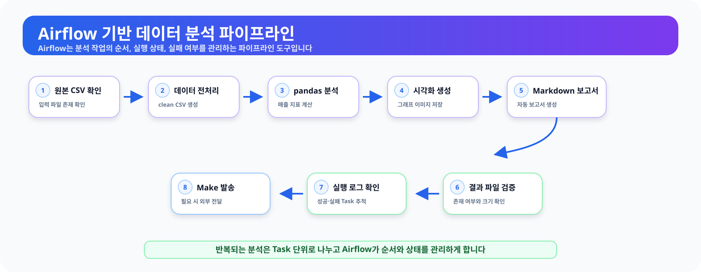
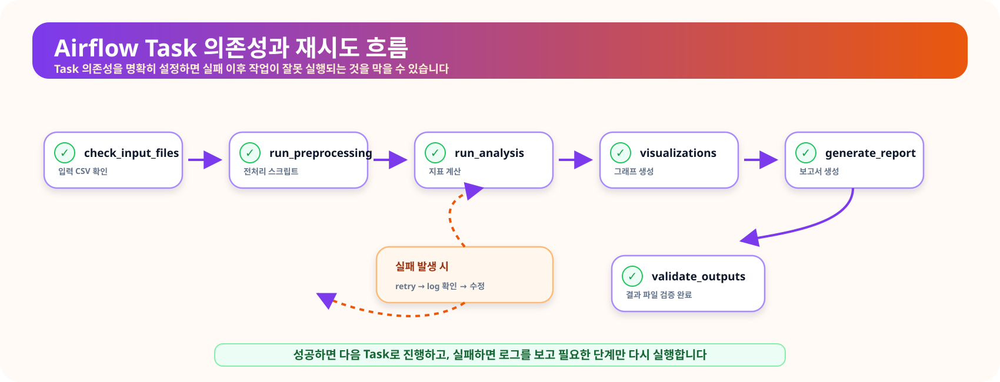

# 14장. 반복되는 분석 흐름을 안전하게 자동화하기

데이터 분석 업무는 한 번 실행하고 끝나는 경우보다 같은 흐름을 반복하는 경우가 더 많습니다. 새 파일을 확인하고, 전처리하고, 지표를 계산하고, 그래프와 보고서를 만든 뒤 결과가 정상인지 검증하는 과정이 매일 또는 매주 반복될 수 있습니다.

수동 실행은 단계가 적을 때는 편리합니다. 그러나 처리 단계가 늘어나면 실행 순서를 놓치거나, 이전 실행의 파일을 새 결과로 착각하거나, 일부 단계가 실패했는데도 전체 작업이 끝난 것으로 오해하기 쉽습니다. 분석 자동화는 이런 반복 작업을 **정해진 순서, 입력·출력 계약, 실패 기준, 재실행 규칙**에 따라 운영하는 과정입니다.

이 장에서는 Make, n8n, Airflow의 역할을 구분하고, 온라인 쇼핑몰 분석 흐름을 Python으로 먼저 검증한 뒤 Docker Compose 기반 Airflow 3.3.0 학습 환경에서 실행합니다.

> 이 장의 Docker Compose 구성은 로컬 학습과 탐색을 위한 것입니다. 운영 환경의 보안·고가용성·백업·모니터링을 보장하는 배포 템플릿이 아닙니다.

<figure class="figure">
  
  <figcaption>그림 14-1. 분석 자동화와 파이프라인 전체 흐름도</figcaption>
</figure>

## 이 장에서 생각해 볼 질문

- 각 Task의 입력과 출력은 무엇인가?
- 같은 파이프라인을 다시 실행해도 결과가 중복되지 않는가?
- 파일이 존재한다는 사실만으로 성공이라고 판단해도 되는가?
- 취소·환불 주문을 포함한 금액을 매출이라고 불러도 되는가?
- 실패한 Task를 재실행할 때 이전의 부분 결과가 남지 않는가?
- DAG의 스케줄과 타임존은 명확한가?
- 비밀번호와 JWT secret이 저장소에 하드코딩되어 있지 않은가?
- Airflow Task 성공과 분석 결과의 타당성을 구분하고 있는가?

## 1. 자동화는 분석 코드를 대신 쓰는 일이 아니다

자동화는 분석 코드를 없애는 것이 아니라, 검증된 코드를 안정적인 순서로 실행하도록 만드는 일입니다. 전처리, 분석, 시각화, 보고서 생성 코드가 한 파일에 뒤섞여 있으면 어느 단계가 실패했는지 확인하기 어렵습니다.

이번 장의 파이프라인은 다음 계약을 사용합니다.

| Task | 주요 입력 | 주요 출력 | 실패 기준 |
| --- | --- | --- | --- |
| `check_input_files` | `data/raw/*.csv` | 입력 점검 결과 | 파일 누락 또는 빈 파일 |
| `run_preprocessing` | 원본 CSV 4개 | `data/processed/*_clean.csv` | 컬럼·타입·키·참조 무결성 오류 |
| `run_analysis` | 전처리 CSV | 일자·카테고리 집계 CSV | 완료 주문 없음, 병합 오류 |
| `generate_visualizations` | 일자별 집계 | PNG 그래프 | 집계 파일 누락 또는 빈 결과 |
| `generate_report` | 집계·메타데이터·그래프 | Markdown 보고서 | 필수 결과 누락 |
| `validate_outputs` | 전체 산출물 | 검증 로그 CSV | 최신성·행 수·총합·범위 문구 오류 |

각 Task는 자신의 산출물을 전체 파일로 다시 만들고 원자적으로 교체합니다. 따라서 동일한 입력으로 재실행해도 행이 계속 추가되지 않습니다. 이런 성질을 멱등성(idempotency)이라고 합니다.

## 2. Make, n8n, Airflow의 역할

| 도구 | 잘 맞는 상황 | 예시 |
| --- | --- | --- |
| Make | 외부 SaaS 연결과 알림 | 보고서 생성 후 Gmail·Slack 전달 |
| n8n | 노코드·로우코드 워크플로우 | API 호출, 내부 도구 연결, 승인 흐름 |
| Airflow | 코드 기반 데이터 파이프라인 | 전처리 → 분석 → 보고서 실행 순서와 재시도 관리 |

Airflow는 분석 결과를 자동으로 옳게 만들어 주는 도구가 아닙니다. Airflow가 관리하는 것은 실행 순서, 스케줄, 재시도, 로그, 상태입니다. 금액 집계 기준과 결과 해석은 분석 코드와 사람이 책임집니다.

## 3. 이번 장의 금액 기준

`line_total`은 `quantity × unit_price`로 계산한 주문 상세 금액입니다. 전체 주문 상세 금액을 곧바로 회계상 순매출이라고 부를 수는 없습니다. 할인, 배송비, 세금, 부분 환불, 정산 시점이 반영되지 않을 수 있기 때문입니다.

이번 장에서는 다음 범위를 사용합니다.

- 집계 대상:
  - `order_status == "completed"`

- 금액 정의:
  - 주문 상세의 `quantity × unit_price` 합계

- 표현:
  - 완료 주문 기준 금액
  - 회계상 순매출로 단정하지 않음

일자별 집계와 카테고리별 집계는 동일한 완료 주문 범위를 사용하며, 마지막 검증 Task에서 두 집계의 총합이 일치하는지 확인합니다.

## 4. 프로젝트 구조

```text
llm-data-analysis-course/
├─ data/
│  ├─ raw/
│  └─ processed/
├─ scripts/
│  ├─ generate_sample_data.py
│  ├─ ch14_preprocessing.py
│  ├─ ch14_analysis.py
│  ├─ ch14_visualization.py
│  ├─ ch14_report.py
│  ├─ ch14_validate_outputs.py
│  └─ run_ch14_pipeline.py
├─ src/
│  └─ automation_pipeline.py
├─ reports/
│  └─ figures/
├─ notebooks/
│  └─ ch14_airflow_pipeline.ipynb
└─ automation/
   └─ airflow/
      ├─ Dockerfile
      ├─ docker-compose.yml
      ├─ requirements.txt
      ├─ .env.example
      └─ dags/
         └─ ch14_local_analysis_pipeline.py
```

원본 데이터 폴더에는 다음 파일이 있어야 합니다.

```text
customers.csv
products.csv
orders.csv
order_items.csv
```

파일이 없다면 프로젝트 루트에서 실행합니다.

```bash
python scripts/generate_sample_data.py
```

## 5. Airflow를 실행하기 전에 Python 파이프라인 검증

Airflow에서 실패하는 원인은 크게 두 종류입니다.

1. 데이터 또는 Python 분석 코드의 문제
2. Docker·Airflow 실행 환경의 문제

두 문제를 분리하기 위해 로컬 Python 파이프라인을 먼저 실행합니다.

```bash
python scripts/generate_sample_data.py
python scripts/run_ch14_pipeline.py
```

정상 실행되면 다음 주요 파일이 생성됩니다.

```text
data/processed/customers_clean.csv
data/processed/products_clean.csv
data/processed/orders_clean.csv
data/processed/order_items_clean.csv
reports/ch14_daily_sales.csv
reports/ch14_category_sales.csv
reports/ch14_pipeline_task_summary.csv
reports/ch14_airflow_setup_guide.csv
reports/ch14_pipeline_run_metadata.csv
reports/figures/ch14_daily_sales.png
reports/ch14_airflow_report.md
reports/ch14_airflow_validation_log.csv
```

검증 로그는 파일의 존재와 크기만 확인하지 않습니다.

- 원본 파일보다 산출물이 오래되지 않았는지
- CSV에 실제 데이터 행이 있는지
- 일자별 금액과 카테고리별 금액의 총합이 일치하는지
- 카테고리 비율 합계가 약 100%인지
- 보고서에 완료 주문 기준과 순매출 한계가 명시되었는지

로컬 실행이 실패하면 Airflow를 시작하기 전에 데이터와 Python 코드를 먼저 수정합니다.

## 6. Docker Compose 요구사항

Airflow 공식 Docker Compose 빠른 시작은 학습과 탐색에 적합하지만 운영 배포용은 아닙니다. 실습 전 다음을 확인합니다.

```bash
docker --version
docker compose version
docker run --rm hello-world
```

확인할 기준은 다음과 같습니다.

- Compose V2를 사용합니다.
- Airflow 공식 빠른 시작 기준으로 Compose 2.14 이상이 필요합니다.
- Docker Engine에 최소 4GB, 가능하면 8GB 정도의 메모리를 할당합니다.
- Linux에서는 마운트 폴더 권한 문제를 줄이기 위해 `AIRFLOW_UID=$(id -u)`를 사용합니다.

Docker 설치는 다음 별도 가이드를 참고합니다.

```text
https://blog.naver.com/dev-dog/224341211248
```

Airflow 공식 Docker Compose 문서도 함께 확인합니다.

```text
https://airflow.apache.org/docs/apache-airflow/stable/howto/docker-compose/index.html
```

## 7. 환경 파일과 비밀정보 준비

Airflow 폴더로 이동하고 예시 파일을 복사합니다.

```bash
cd automation/airflow
cp .env.example .env
```

Windows PowerShell:

```powershell
Copy-Item .env.example .env
```

`.env.example`에는 변수 이름만 두고 비밀값은 비워 둡니다.

```text
AIRFLOW_UID=50000
AIRFLOW_PROJECT_DIR=../..
AIRFLOW_VERSION=3.3.0
AIRFLOW_UI_PORT=8080
AIRFLOW_DEFAULT_TIMEZONE=utc
AIRFLOW_DAG_TIMEZONE=Asia/Seoul
AIRFLOW_DB_PASSWORD=
AIRFLOW_API_JWT_SECRET=
_AIRFLOW_WWW_USER_USERNAME=airflow
_AIRFLOW_WWW_USER_PASSWORD=
```

비어 있는 `AIRFLOW_DB_PASSWORD`, `AIRFLOW_API_JWT_SECRET`, `_AIRFLOW_WWW_USER_PASSWORD` 값은 시작 전에 반드시 채웁니다. 세 항목에는 서로 다른 임의 값을 사용합니다. 빈 값이면 Docker Compose의 필수 환경변수 검사에서 실행이 중단됩니다.

Python으로 임의 문자열을 만들 수 있습니다.

```bash
python -c "import secrets; print(secrets.token_urlsafe(32))"
```

중요한 원칙은 다음과 같습니다.

- 실제 `.env`는 Git에 커밋하지 않습니다.
- `.env.example`에는 변수 이름만 두고 비밀값은 비워 둡니다.
- 운영 비밀번호를 `airflow`, `admin`, `password`처럼 쉽게 추측할 수 있는 값으로 두지 않습니다.
- Docker Compose에 JWT secret이나 DB 비밀번호를 직접 적지 않습니다.
- 실제 비밀값이 Git에 포함되었다면 삭제만 하지 말고 즉시 폐기·교체합니다.

## 8. 이미지 빌드와 Airflow 초기화

이 저장소는 필요한 Python 패키지가 포함된 사용자 정의 이미지를 사용합니다.

```bash
docker compose build
docker compose up airflow-init
```

초기화가 정상적으로 끝나면 `airflow-init` 컨테이너가 종료 코드 0으로 끝납니다.

Airflow를 백그라운드에서 시작합니다.

```bash
docker compose up -d
docker compose ps
```

`postgres`, `airflow-api-server`, `airflow-scheduler`, `airflow-dag-processor`, `airflow-triggerer`가 실행 중인지 확인합니다. `unhealthy` 상태이거나 계속 재시작하는 서비스가 있으면 로그를 확인합니다.

```bash
docker compose logs --tail 100 airflow-api-server
docker compose logs --tail 100 airflow-scheduler
docker compose logs --tail 100 airflow-dag-processor
```

## 9. 로그인

브라우저에서 `.env`의 `AIRFLOW_UI_PORT`에 맞는 주소로 접속합니다.

```text
http://localhost:8080
```

Username에는 `_AIRFLOW_WWW_USER_USERNAME`, Password에는 `_AIRFLOW_WWW_USER_PASSWORD`로 직접 설정한 값을 입력합니다.


로그인이 되지 않으면 하드코딩된 다른 계정을 추측하지 말고 현재 Compose 설정을 확인합니다.

```bash
docker compose config
docker compose logs --tail 100 airflow-init
docker compose logs --tail 100 airflow-api-server
```

`.env`를 수정한 뒤 이미 생성된 메타데이터 DB와 계정이 남아 있다면 새 값이 즉시 적용되지 않을 수 있습니다. 학습 환경을 완전히 초기화해도 되는 경우에만 다음 명령을 사용합니다.

```bash
docker compose down --volumes --remove-orphans
docker compose up airflow-init
docker compose up -d
```

이 명령은 DAG 실행 기록과 계정 정보도 삭제합니다.

## 10. Airflow 3 TaskFlow DAG 구조

DAG 파일은 다음 위치에 있습니다.

```text
automation/airflow/dags/ch14_local_analysis_pipeline.py
```

Airflow 3의 공개 인터페이스인 `airflow.sdk`의 `@dag`, `@task`를 사용합니다.

```python
import os
from datetime import timedelta
from pathlib import Path

import pendulum
from airflow.sdk import dag, task

BASE_DIR = Path(
    os.getenv("PROJECT_ROOT", "/opt/airflow/project")
).resolve()

DAG_TIMEZONE = os.getenv(
    "AIRFLOW_DAG_TIMEZONE",
    "Asia/Seoul",
)

@dag(
    dag_id="ch14_local_analysis_pipeline",
    schedule=None,
    start_date=pendulum.datetime(
        2026, 1, 1, tz=DAG_TIMEZONE
    ),
    catchup=False,
    max_active_runs=1,
)
def pipeline():
    @task(
        retries=1,
        retry_delay=timedelta(minutes=1),
        execution_timeout=timedelta(minutes=10),
    )
    def preprocessing():
        run_preprocessing(BASE_DIR)

    # 나머지 Task도 같은 방식으로 정의합니다.
```

핵심 설정은 다음과 같습니다.

| 설정 | 의미 |
| --- | --- |
| `schedule=None` | 수업에서는 자동 스케줄 없이 수동 실행 |
| 타임존 포함 `start_date` | 모호한 로컬 시각을 피함 |
| `catchup=False` | 과거 실행 구간을 자동 생성하지 않음 |
| `max_active_runs=1` | 같은 DAG가 동시에 파일을 덮어쓰지 않도록 제한 |
| `retries=1` | 일시적 오류에 한 번 재시도 |
| `execution_timeout` | 멈춘 Task가 무한정 실행되지 않도록 제한 |

매일 오전 9시 실행으로 바꾸려면 운영 목적과 데이터 도착 시각을 확인한 뒤 다음처럼 변경할 수 있습니다.

```python
@dag(
    schedule="0 9 * * *",
    start_date=pendulum.datetime(
        2026, 1, 1, tz="Asia/Seoul"
    ),
    catchup=False,
)
```

자동 스케줄을 적용하기 전에 멱등성과 지연 데이터 처리 기준을 먼저 확인합니다.

<figure class="figure">
  
  <figcaption>그림 14-2. 분석 파이프라인의 Task 의존성 흐름</figcaption>
</figure>

## 11. DAG 확인과 실행

UI의 **Dags** 메뉴에서 `ch14_local_analysis_pipeline`을 찾습니다.

1. DAG 상세 화면을 엽니다.
2. 수동 실행 버튼으로 실행합니다.
3. Grid 또는 Graph 화면에서 Task 순서를 확인합니다.
4. 실패한 Task를 클릭해 로그를 확인합니다.
5. 마지막 `validate_outputs`까지 성공했는지 확인합니다.


CLI로 DAG가 정상 파싱되는지 확인할 수도 있습니다.

```bash
docker compose exec airflow-scheduler \
  airflow dags list | grep ch14_local_analysis_pipeline
```

특정 논리 시각으로 전체 DAG를 테스트하려면 다음 명령을 사용할 수 있습니다.

```bash
docker compose exec airflow-scheduler \
  airflow dags test ch14_local_analysis_pipeline 2026-07-01
```

`airflow dags test` 성공은 DAG 코드의 단일 테스트 실행을 의미합니다. 웹 UI의 Scheduler·Executor·API 통합 실행과 완전히 같은 검증은 아니므로 UI 실행도 별도로 확인합니다.

## 12. 산출물 검증

프로젝트 루트에서 검증 로그를 확인합니다.

```bash
cat reports/ch14_airflow_validation_log.csv
```

Windows PowerShell:

```powershell
Get-Content reports\ch14_airflow_validation_log.csv
```

모든 `status`가 `ok`인지 확인합니다. 특히 다음 행이 중요합니다.

- `daily_vs_category_completed_order_amount`
- `category_amount_ratio_pct_sum`
- `report_scope`

Task가 모두 초록색이더라도 검증 로그에 `error`가 있으면 분석 파이프라인은 완료된 것이 아닙니다.

## 13. 실패 상황 실습

자동화에서는 성공 화면보다 실패 원인을 읽는 능력이 중요합니다. 원본 파일을 삭제하지 말고 이름을 임시 변경합니다.

macOS·Linux·WSL2:

```bash
mv data/raw/customers.csv \
   data/raw/customers.csv.exercise-backup
```

Windows PowerShell:

```powershell
Rename-Item data\raw\customers.csv `
  customers.csv.exercise-backup
```

DAG를 실행하면 `check_input_files`에서 실패해야 합니다. 로그에서 누락 파일 경로가 정확히 표시되는지 확인합니다.

실습 후 반드시 복구합니다.

```powershell
Rename-Item data\raw\customers.csv.exercise-backup `
  customers.csv
```

실제 업무 데이터에서는 이런 실패 실습을 진행하지 않습니다.

## 14. 자주 발생하는 문제

### 14.1 컨테이너가 계속 재시작함

Docker Desktop에 할당된 메모리가 부족할 수 있습니다. Airflow 공식 빠른 시작은 최소 4GB, 가능하면 8GB 정도를 권장합니다.

```bash
docker compose ps
docker compose logs --tail 200 airflow-api-server
```

### 14.2 8080 포트 충돌

`.env`에서 포트를 변경합니다.

```text
AIRFLOW_UI_PORT=8081
```

브라우저 주소도 변경합니다.

```text
http://localhost:8081
```

### 14.3 `ModuleNotFoundError`

사용자 정의 이미지를 다시 빌드합니다.

```bash
docker compose build --no-cache
docker compose up airflow-init
docker compose up -d
```

Dockerfile은 Airflow 이미지와 같은 버전의 `apache-airflow`를 함께 지정해 의존성 충돌 가능성을 줄입니다.

### 14.4 Linux 파일 권한 오류

`.env`의 `AIRFLOW_UID`를 현재 사용자 ID로 설정합니다.

```bash
echo "AIRFLOW_UID=$(id -u)" >> .env
```

기존 `AIRFLOW_UID` 행이 있다면 중복 추가하지 말고 값을 교체합니다. 무조건 `chmod -R 777`을 적용하는 방식은 피합니다.

### 14.5 JWT 또는 API 인증 오류

Scheduler와 API 서버가 같은 `AIRFLOW_API_JWT_SECRET`을 사용해야 합니다.

```bash
docker compose exec airflow-scheduler \
  airflow config get-value api_auth jwt_secret

docker compose exec airflow-api-server \
  airflow config get-value api_auth jwt_secret
```

값 자체를 화면 공유나 보고서에 노출하지 않습니다.

### 14.6 이전 실행 결과가 새 결과처럼 보임

검증 로그의 최신성 항목과 `ch14_pipeline_run_metadata.csv`의 생성 시각을 확인합니다. 원본 데이터보다 결과가 오래되었다면 파이프라인을 다시 실행합니다.

## 15. 종료와 초기화

실습을 종료하되 실행 기록을 유지하려면 다음 명령을 사용합니다.

```bash
docker compose down
```

DB 볼륨과 실행 기록까지 삭제하려면 다음 명령을 사용합니다.

```bash
docker compose down --volumes --remove-orphans
```

초기화 명령은 복구가 필요한 경우나 완전한 재실습이 필요한 경우에만 사용합니다.

## 16. Make와 n8n으로 결과 전달하기

Airflow는 코드 기반 데이터 처리와 검증을 담당하고, Make와 n8n은 승인된 외부 서비스로 결과를 전달하는 데 사용할 수 있습니다.

| 구간 | 담당 도구 예시 | 역할 |
| --- | --- | --- |
| 데이터 처리 | Python, Airflow | 전처리, 분석, 시각화, 보고서 생성 |
| 결과 검증 | Python, Airflow | 최신성, 행 수, 총합, 파일 상태 확인 |
| 외부 전달 | Make, n8n | Gmail, Slack, Drive 등과 연결 |
| 운영 확인 | Airflow·Make·n8n 로그 | 실패 위치와 재실행 여부 확인 |

전달 단계에는 다음 조건을 둡니다.

- `validate_outputs`가 성공한 경우에만 전달합니다.
- 개인정보나 주문 식별자가 포함된 내부 파일을 공개 채널에 보내지 않습니다.
- API 키와 웹훅 주소는 각 도구의 비밀정보 저장 기능에 보관합니다.
- 재시도 시 동일한 보고서가 중복 발송되지 않도록 실행 ID를 기록합니다.

## 17. LLM에게 파이프라인 설계를 요청할 때

LLM은 DAG와 Docker Compose 초안을 만드는 데 도움을 줄 수 있지만, 생성한 설정을 바로 실행하면 안 됩니다.

```text
온라인 쇼핑몰 분석 파이프라인을 설계해 주세요.

실행 환경:
- Airflow 3.3.0
- Docker Compose 기반 로컬 학습 환경
- 프로젝트 경로: /opt/airflow/project
- DAG 타임존: Asia/Seoul
- 수동 실행: schedule=None

금액 범위:
- order_status == completed
- quantity × unit_price 합계
- 회계상 순매출로 단정하지 않음

필요한 Task:
- 입력 파일 존재·스키마 검사
- 전처리와 키 무결성 검사
- 일자별·카테고리별 집계
- 그래프와 Markdown 보고서 생성
- 산출물 최신성·행 수·총합 검증

운영 조건:
- 재실행해도 중복되지 않아야 함
- max_active_runs=1
- Task별 retry와 execution_timeout 명시
- 비밀값은 .env로 분리하고 예시 파일에는 값 저장 금지
- Docker Compose는 운영 배포용이 아님을 명시

요청:
1. airflow.sdk의 @dag, @task를 사용해 주세요.
2. 타임존이 포함된 start_date를 사용해 주세요.
3. 각 Task의 입력·출력·실패 조건을 설명해 주세요.
4. 분석 결과 검증과 Airflow 실행 성공을 구분해 주세요.
5. 실제 비밀번호나 API 키를 예시로 만들지 마세요.
```

LLM이 만든 코드는 Airflow 버전, import 경로, 파일 마운트, 타임존, 권한, 비밀정보 노출 여부를 사람이 검토해야 합니다.

## 18. 최종 체크리스트

| 검토 항목 | 확인 |
| --- | --- |
| Python 파이프라인을 Airflow 전에 실행했는가? | □ |
| 완료 주문 기준과 금액 정의가 명시되었는가? | □ |
| 전처리 단계에서 필수 컬럼·고유 키·참조 관계를 검증하는가? | □ |
| 병합에 관계 검증이 적용되었는가? | □ |
| 재실행해도 데이터가 중복되지 않는가? | □ |
| 산출물의 존재뿐 아니라 최신성·행 수·총합을 검증하는가? | □ |
| `start_date`가 타임존을 포함하는가? | □ |
| `catchup=False`, `max_active_runs=1`을 의도적으로 설정했는가? | □ |
| 비밀값이 `.env`로 분리되어 있는가? | □ |
| `.env.example`의 비밀값이 비어 있는가? | □ |
| 실제 `.env`가 Git에 포함되지 않는가? | □ |
| Docker Compose 구성이 학습용임을 명시했는가? | □ |
| 분석 성공과 업무 해석의 타당성을 구분하는가? | □ |

## 19. 정리

이 장에서는 반복 분석을 단순히 예약 실행하는 것이 아니라, 입력·출력 계약과 실패 기준을 가진 파이프라인으로 구성했습니다.

- Python 코드로 전체 흐름 검증
- 완료 주문 기준의 일관된 금액 집계
- 필수 컬럼·타입·키·참조 관계 검사
- 원자적 파일 저장과 멱등성 확보
- 산출물 최신성·행 수·총합 검증
- Airflow 3 TaskFlow API 기반 DAG
- 타임존이 포함된 `start_date`
- `catchup=False`, `max_active_runs=1`, 재시도와 실행 제한
- `.env`를 통한 비밀정보 분리
- Docker Compose 학습 환경과 운영 배포의 구분
- Make·n8n을 통한 승인된 결과 전달

다음 장에서는 지금까지 배운 EDA, 시각화, 머신러닝, LLM, 외부 데이터, 자동화 흐름을 하나의 최종 프로젝트로 통합합니다.
