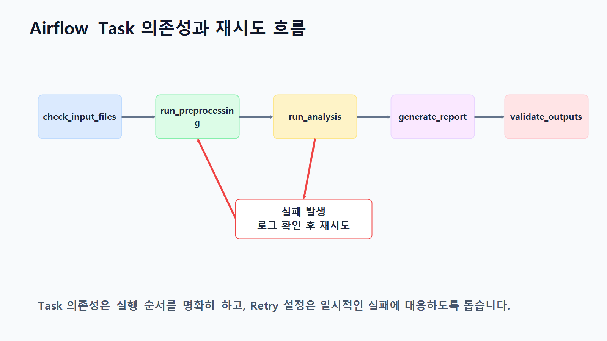
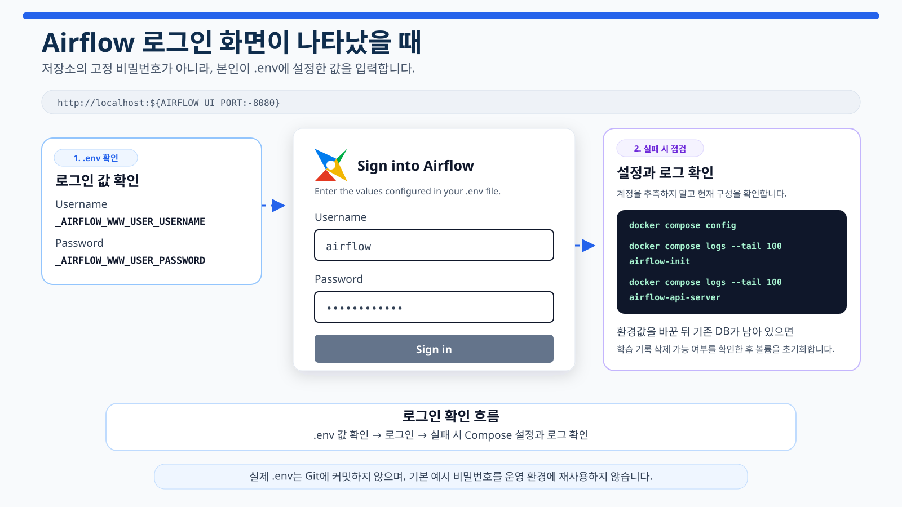
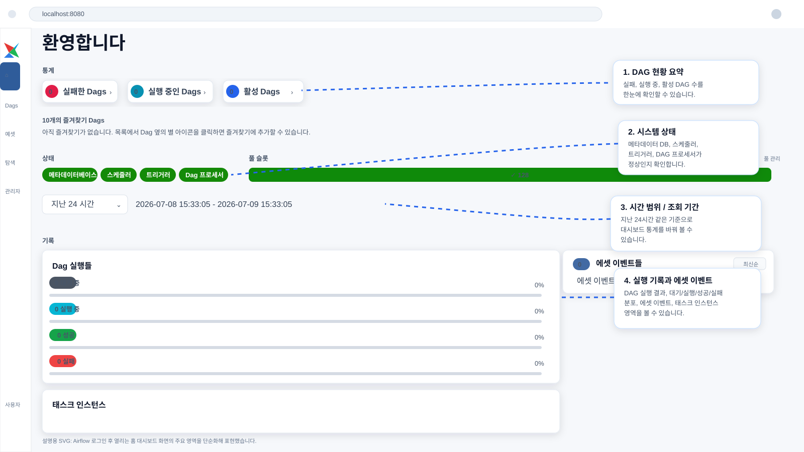
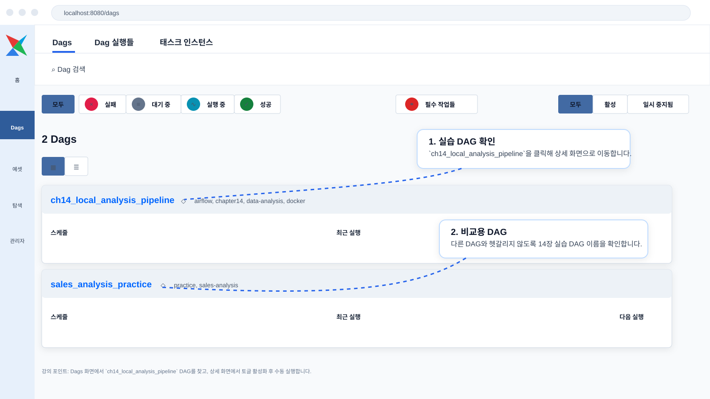
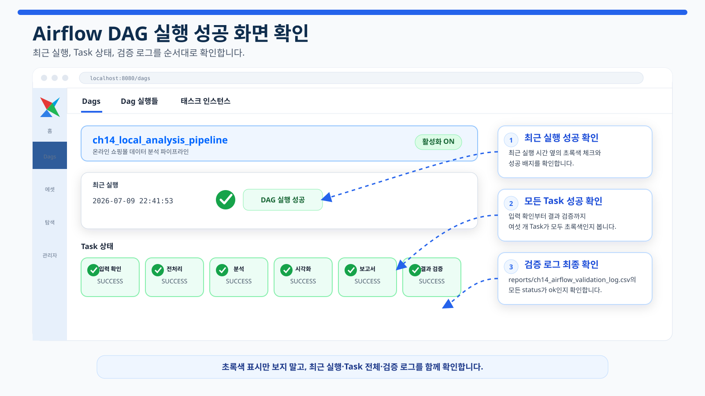

# 14장. 반복되는 분석 흐름을 자동화하기

데이터 분석은 한 번 실행하고 끝나는 작업처럼 보이지만, 실제 업무에서는 같은 흐름을 반복하는 경우가 많습니다. 매일 아침 전날 매출 데이터를 확인하고, 새 CSV 파일을 불러오고, 전처리하고, 지표를 계산하고, 그래프를 만들고, 보고서를 작성한 뒤, 담당자에게 전달하는 식입니다.

처음에는 이런 작업을 수동으로 실행해도 괜찮습니다. 하지만 반복 주기가 짧아지고, 처리 단계가 많아지고, 결과를 기다리는 사람이 생기면 수동 실행은 금방 불안정해집니다. 어떤 파일을 먼저 실행해야 하는지 헷갈릴 수 있고, 중간 오류를 놓칠 수 있으며, 보고서 파일이 생성되지 않았는데도 완료된 것으로 착각할 수 있습니다.

분석 자동화는 이런 반복 흐름을 정해진 순서와 조건에 따라 실행되도록 만드는 과정입니다. 이 장에서는 Make, n8n, Airflow를 분석 자동화 도구의 관점에서 살펴보고, 온라인 쇼핑몰 분석 흐름을 **Docker Compose 기반 Airflow 파이프라인**으로 직접 실행해 봅니다.

핵심은 특정 도구 하나를 외우는 것이 아닙니다. **반복되는 분석 작업을 단계로 나누고, 각 단계의 입력과 출력을 정리하며, 실패했을 때 어디에서 문제가 생겼는지 확인할 수 있는 구조를 만드는 것**입니다.

<figure class="figure">
  
  <figcaption>그림 14-1. 분석 자동화와 파이프라인 전체 흐름도</figcaption>
</figure>

## 1. 자동화는 코드를 대신 쓰는 일이 아니다

자동화는 분석 코드를 없애는 것이 아닙니다. 오히려 잘 정리된 분석 코드가 있어야 자동화할 수 있습니다. 전처리 코드, 분석 코드, 시각화 코드, 보고서 생성 코드가 뒤섞여 있으면 자동화 도구가 실행 순서를 관리하기 어렵습니다.

자동화하기 좋은 분석 흐름은 다음처럼 나눌 수 있습니다.

| 단계 | 하는 일 | 입력 | 출력 |
| --- | --- | --- | --- |
| 입력 확인 | 원본 데이터가 있는지 확인 | `data/raw/*.csv` | 확인 결과 |
| 전처리 | 결측치, 타입, 중복 처리 | 원본 CSV | `data/processed/*_clean.csv` |
| 분석 | 주요 지표 계산 | 전처리 데이터 | `reports/*.csv` |
| 시각화 | 그래프 생성 | 분석 결과 CSV | `reports/figures/*.png` |
| 보고서 | Markdown 보고서 작성 | 표, 그래프, 해석 문장 | `reports/*.md` |
| 검증 | 결과 파일 존재 여부 확인 | 산출물 목록 | 검증 로그 |
| 전달 | 메일, Slack, Drive 등으로 공유 | 보고서 파일 | 알림 또는 발송 기록 |

자동화의 목적은 사람이 아무것도 하지 않게 만드는 것이 아닙니다. 반복 실행과 파일 전달 같은 기계적인 일을 줄이고, 사람은 데이터 품질과 결과 해석을 확인하는 데 집중하도록 만드는 것입니다.

## 2. Make, n8n, Airflow는 어디에 쓰이는가

분석 자동화 도구는 모두 같은 역할을 하는 것처럼 보이지만, 실제로는 잘 맞는 상황이 조금씩 다릅니다.

| 도구 | 잘 맞는 상황 | 예시 |
| --- | --- | --- |
| Make | 외부 서비스 연결과 알림 자동화 | 보고서 파일 생성 후 Gmail 발송, Slack 알림 |
| n8n | 노코드/로우코드 기반 워크플로우 구성 | API 호출, 데이터 저장, 내부 도구 연결 |
| Airflow | 코드 기반 데이터 파이프라인 운영 | 전처리 → 분석 → 시각화 → 보고서 생성 순서 관리 |

Make와 n8n은 여러 앱을 연결하는 데 강합니다. 반면 Airflow는 데이터 파이프라인처럼 여러 코드 작업을 정해진 순서대로 실행하고, 실패한 작업의 로그를 확인하고, 필요한 작업만 재실행하는 데 적합합니다.

## 3. 왜 Docker Compose로 Airflow를 실행하는가

Airflow는 단순한 Python 라이브러리가 아니라 웹 UI, 스케줄러, DAG 처리기, 메타데이터 DB, 로그 관리가 함께 동작하는 데이터 파이프라인 애플리케이션입니다. 학생 PC마다 Python 버전, 운영체제, PATH, 의존성이 다르면 로컬 설치 과정에서 많은 오류가 생길 수 있습니다.

따라서 이 장에서는 Airflow를 로컬 Python 가상환경에 직접 설치하지 않고, **Docker Compose 기반으로 실행**합니다. Docker Compose를 사용하면 Airflow 실행 환경을 컨테이너로 묶어 Windows, macOS, Linux 간 차이를 줄일 수 있습니다.

도커 설치는 별도 블로그 글을 참고합니다.

**도커 설치 가이드 블로그 주소:** https://blog.naver.com/dev-dog/224341211248

설치 후 다음 명령이 정상 동작하는지 확인합니다.

```bash
docker --version
docker compose version
docker run hello-world
```

## 4. 이번 장에서 완성할 Docker 기반 Airflow 실습

이번 실습에서는 온라인 쇼핑몰 데이터 분석을 다음 순서로 자동화합니다.

```text
check_input_files
→ run_preprocessing
→ run_analysis
→ generate_visualizations
→ generate_report
→ validate_outputs
```

각 Task의 역할은 다음과 같습니다.

| Task | 역할 | 성공 조건 |
| --- | --- | --- |
| `check_input_files` | 원본 CSV 4개가 있는지 확인 | 모든 입력 파일 존재 |
| `run_preprocessing` | 원본 CSV를 전처리 파일로 저장 | `data/processed/*_clean.csv` 생성 |
| `run_analysis` | 일자별 매출과 카테고리별 매출 계산 | `reports/ch14_daily_sales.csv`, `reports/ch14_category_sales.csv` 생성 |
| `generate_visualizations` | 일자별 매출 그래프 생성 | `reports/figures/ch14_daily_sales.png` 생성 |
| `generate_report` | Markdown 보고서 생성 | `reports/ch14_airflow_report.md` 생성 |
| `validate_outputs` | 결과 파일 존재와 크기 검증 | 검증 로그 생성, 오류 없으면 성공 |

<figure class="figure">
  
  <figcaption>그림 14-2. 분석 파이프라인의 Task 의존성 흐름</figcaption>
</figure>

## 5. 실습 프로젝트 구조

이번 장의 주요 파일 구조는 다음과 같습니다.

```text
llm-data-analysis-course/
├─ data/
│  ├─ raw/
│  └─ processed/
├─ scripts/
│  ├─ ch14_preprocessing.py
│  ├─ ch14_analysis.py
│  ├─ ch14_visualization.py
│  ├─ ch14_report.py
│  ├─ ch14_validate_outputs.py
│  └─ run_ch14_pipeline.py
├─ src/
│  └─ automation_pipeline.py
├─ reports/
│  └─ figures/
└─ automation/
   └─ airflow/
      ├─ Dockerfile
      ├─ docker-compose.yml
      ├─ requirements.txt
      ├─ .env.example
      └─ dags/
         └─ ch14_local_analysis_pipeline.py
```

`data/raw/` 폴더에는 다음 4개 CSV 파일이 있어야 합니다.

```text
customers.csv
products.csv
orders.csv
order_items.csv
```

없다면 먼저 샘플 데이터 생성 스크립트를 실행합니다.

```bash
python scripts/generate_sample_data.py
```

## 6. Airflow에 연결하기 전 Python 파이프라인 먼저 검증하기

Airflow에서 실패가 나면 원인이 두 가지일 수 있습니다.

1. Python 분석 코드 자체가 잘못된 경우
2. Airflow 또는 Docker 실행 환경이 잘못된 경우

이 둘을 구분하려면 먼저 Airflow 없이 Python 스크립트만으로 전체 분석 흐름이 실행되는지 확인해야 합니다.

프로젝트 루트에서 다음 명령을 실행합니다.

```bash
python scripts/generate_sample_data.py
python scripts/run_ch14_pipeline.py
```

정상 실행되면 다음 산출물이 생성됩니다.

```text
data/processed/customers_clean.csv
data/processed/products_clean.csv
data/processed/orders_clean.csv
data/processed/order_items_clean.csv
reports/ch14_daily_sales.csv
reports/ch14_category_sales.csv
reports/figures/ch14_daily_sales.png
reports/ch14_airflow_report.md
reports/ch14_airflow_validation_log.csv
```

이 단계에서 오류가 나면 Docker나 Airflow 문제가 아니라 데이터 파일, 경로, Python 코드 문제일 가능성이 큽니다.

## 7. Docker Compose Airflow 환경 파일 준비

Airflow Docker 실습 폴더로 이동합니다.

```bash
cd automation/airflow
```

환경변수 예시 파일을 복사합니다.

```bash
cp .env.example .env
```

Windows PowerShell에서는 다음처럼 실행할 수 있습니다.

```powershell
copy .env.example .env
```

`.env.example`의 기본 내용은 다음과 같습니다.

```text
AIRFLOW_UID=50000
AIRFLOW_PROJECT_DIR=../..
_AIRFLOW_WWW_USER_USERNAME=airflow
_AIRFLOW_WWW_USER_PASSWORD=airflow
```

## 8. Airflow 메타데이터 DB 초기화

최초 1회 또는 완전 초기화 후에는 Airflow 메타데이터 DB를 초기화해야 합니다.

```bash
docker compose up airflow-init
```

기본 Compose 설정에서는 초기 계정이 다음과 같이 만들어지도록 설정되어 있습니다.

```text
ID: airflow
PW: airflow
```

다만 Airflow 3의 Simple Auth Manager 화면이 나타나고 `401 Unauthorized` 또는 `Invalid credentials`가 보이면, 실제 로그인 계정이 자동 생성 비밀번호 방식으로 만들어진 상태일 수 있습니다. 이 경우 아래 방법으로 실제 비밀번호를 확인합니다.

## 9. Airflow 실행과 로그인

초기화가 끝나면 다음 명령으로 Airflow를 실행합니다.

```bash
docker compose up
```

브라우저에서 아래 주소로 접속합니다.

```text
http://localhost:8080
```

아래와 같은 로그인 화면이 나타나면 계정을 입력합니다.



먼저 수업용 기본 계정을 입력합니다.

```text
ID: airflow
PW: airflow
```

컨테이너 상태는 다른 터미널에서 확인할 수 있습니다.

```bash
docker compose ps
```

### 9.1 `airflow / airflow`로 로그인이 안 될 때

로그인 화면에 다음 메시지가 보일 수 있습니다.

```text
401 Unauthorized
Invalid credentials
Simple auth manager enabled
```

이 경우 다음 명령으로 Simple Auth Manager가 생성한 비밀번호 파일을 확인합니다.

```powershell
docker exec -it llm-course-airflow-api-server cat /opt/airflow/simple_auth_manager_passwords.json.generated
```

실제 실행 예시는 다음과 같습니다. 단, 아래 예시의 비밀번호는 보안상 마스킹했습니다.

```powershell
(.venv) PS D:\DEV\llm-data-analysis-course> docker exec -it llm-course-airflow-api-server cat /opt/airflow/simple_auth_manager_passwords.json.generated
{"admin": "생성된_비밀번호"}
```

위 출력에서 JSON의 왼쪽 값이 사용자 이름이고, 오른쪽 값이 비밀번호입니다.

```text
Username: admin
Password: 생성된_비밀번호
```

Windows에서 로그에서 password 문자열을 검색하려면 다음 명령도 사용할 수 있습니다.

```powershell
docker logs llm-course-airflow-api-server | findstr /i password
```

`What's next: Try Docker Debug...` 문구는 Docker가 출력하는 안내 메시지입니다. Airflow 로그인 정보와 직접 관련이 없으므로 무시해도 됩니다.

### 9.2 로그인 후 처음 열리는 화면에서 확인할 수 있는 것

로그인에 성공하면 아래와 같은 **Airflow 홈 대시보드**가 열립니다.



이 화면은 Airflow 전체 상태를 빠르게 확인하는 요약 화면입니다. 수업에서는 아래 항목을 먼저 보면 됩니다.

1. **실패한 Dags / 실행 중인 Dags / 활성 Dags**
   - 현재 실패한 DAG가 있는지
   - 지금 실행 중인 DAG가 있는지
   - 활성화된 DAG가 몇 개인지 확인합니다.
2. **상태(Status)**
   - `메타데이터베이스`, `스케줄러`, `트리거러`, `Dag 프로세서`가 초록색이면 핵심 구성요소가 정상 동작 중입니다.
3. **왼쪽 메뉴**
   - `Dags` 메뉴에서 실제 DAG 목록과 실행 결과를 확인합니다.

즉, 로그인 후 첫 화면은 **“Airflow가 정상인지 확인하는 요약 화면”**, 실제 실습은 주로 **`Dags` 메뉴에서 진행**한다고 이해하면 됩니다.

## 10. DAG 확인과 실행

Airflow UI에서 `ch14_local_analysis_pipeline` DAG를 찾습니다.

1. 왼쪽 메뉴에서 **Dags**를 클릭합니다.
2. `ch14_local_analysis_pipeline` DAG를 찾습니다.
3. DAG가 일시 중지 상태이면 토글을 켜서 활성화합니다.
4. 수동 실행 버튼을 클릭합니다.
5. Graph 또는 Grid 화면에서 Task 실행 순서를 확인합니다.
6. 실패한 Task가 있으면 해당 Task의 로그를 확인합니다.

DAG 목록 화면은 다음과 같이 볼 수 있습니다.



DAG 파일은 다음 위치에 있습니다.

```text
automation/airflow/dags/ch14_local_analysis_pipeline.py
```

이 DAG는 컨테이너 내부에서 프로젝트 루트를 `/opt/airflow/project`로 보고 실행합니다. Docker Compose에서 프로젝트 전체 폴더를 컨테이너의 `/opt/airflow/project`로 연결했기 때문입니다.

### 10.1 DAG 실행 성공 화면 확인

웹 UI에서 `ch14_local_analysis_pipeline`을 수동 실행한 뒤 최근 실행 옆에 초록색 체크가 보이면 DAG 실행이 성공한 것입니다. 오른쪽 Task 막대가 모두 초록색이면 `check_input_files`부터 `validate_outputs`까지 전체 Task가 정상 완료된 상태입니다.



성공 화면에서 확인할 핵심은 다음 세 가지입니다.

1. `최근 실행` 시간 옆에 초록색 체크가 표시되는지 확인합니다.
2. 오른쪽 Task 막대가 모두 초록색인지 확인합니다.
3. 이후 `reports/ch14_airflow_validation_log.csv`에서 모든 `status`가 `ok`인지 확인합니다.

만약 최근 실행이 빨간색 실패로 표시되면 `check_input_files`부터 어떤 Task가 실패했는지 클릭해서 로그를 확인합니다. 실패한 Task 하나 때문에 뒤의 Task들이 `upstream failed`로 표시될 수 있습니다.

## 11. 산출물 검증

DAG가 정상 실행되면 프로젝트 루트의 `reports/` 폴더에 결과가 생성됩니다.

```text
reports/ch14_daily_sales.csv
reports/ch14_category_sales.csv
reports/figures/ch14_daily_sales.png
reports/ch14_airflow_report.md
reports/ch14_airflow_validation_log.csv
```

검증 로그를 확인합니다.

```bash
cat reports/ch14_airflow_validation_log.csv
```

Windows PowerShell에서는 다음처럼 확인할 수 있습니다.

```powershell
Get-Content reports\ch14_airflow_validation_log.csv
```

모든 행의 `status`가 `ok`이면 주요 산출물 생성이 정상입니다.

## 12. 실패 상황을 일부러 만들어 보기

자동화 실습에서 중요한 것은 성공보다 실패를 읽는 능력입니다. 입력 파일 하나를 잠시 다른 이름으로 바꿔 봅니다.

macOS, Linux, WSL2:

```bash
mv data/raw/customers.csv data/raw/customers_backup.csv
```

Windows PowerShell:

```powershell
ren data\raw\customers.csv customers_backup.csv
```

그다음 Airflow UI에서 DAG를 다시 실행합니다. 이번에는 `check_input_files` 단계에서 실패해야 합니다. 실패한 Task를 클릭하고 로그를 확인합니다.

실습이 끝나면 파일명을 다시 복구합니다.

```powershell
ren data\raw\customers_backup.csv customers.csv
```

## 13. Airflow 종료와 초기화

실습이 끝나면 `automation/airflow` 폴더에서 다음 명령으로 컨테이너를 종료합니다.

```bash
docker compose down
```

Airflow DB 볼륨까지 완전히 삭제하려면 다음 명령을 사용합니다.

```bash
docker compose down --volumes --remove-orphans
```

이 명령은 Airflow 메타데이터 DB도 삭제합니다. DAG 실행 기록과 계정 정보도 초기화되므로 주의해야 합니다.

## 14. 자주 발생하는 문제

### 14.1 8080 포트 충돌

이미 다른 프로그램이 8080 포트를 사용하고 있으면 Airflow UI가 열리지 않을 수 있습니다. 이 경우 `automation/airflow/docker-compose.yml`에서 포트 매핑을 바꿉니다.

```yaml
ports:
  - "8081:8080"
```

브라우저에서는 다음 주소로 접속합니다.

```text
http://localhost:8081
```

### 14.2 로그인 화면은 뜨지만 로그인이 안 됨

먼저 `airflow / airflow`를 입력합니다. 그래도 `401 Unauthorized` 또는 `Invalid credentials`가 나오면 Simple Auth Manager 비밀번호 파일을 확인합니다.

```powershell
docker exec -it llm-course-airflow-api-server cat /opt/airflow/simple_auth_manager_passwords.json.generated
```

### 14.3 ModuleNotFoundError

DAG 실행 중 `ModuleNotFoundError`가 발생하면 다음을 확인합니다.

- `automation/airflow/Dockerfile`에서 `requirements.txt`를 설치하는지 확인합니다.
- `automation/airflow/requirements.txt`에 필요한 패키지가 있는지 확인합니다.
- 이미지가 예전 상태라면 `docker compose build --no-cache` 후 다시 실행합니다.

```bash
docker compose build --no-cache
docker compose up airflow-init
docker compose up
```

### 14.4 입력 파일 없음

`check_input_files` 단계에서 실패하면 프로젝트 루트에서 샘플 데이터를 생성합니다.

```bash
python scripts/generate_sample_data.py
```

또는 Docker 컨테이너 내부에서 실행하려면 다음처럼 실행할 수 있습니다.

```bash
docker compose run --rm airflow-api-server python /opt/airflow/project/scripts/generate_sample_data.py
```

### 14.5 웹 UI Trigger는 실패하지만 CLI 테스트는 성공하는 경우

Airflow 3.x Docker Compose 환경에서는 웹 UI Trigger가 Scheduler, LocalExecutor, Execution API 서버를 함께 사용합니다. 따라서 `airflow dags test`는 성공하는데 웹 UI Trigger만 실패한다면 아래 설정을 확인합니다.

```yaml
AIRFLOW__CORE__EXECUTION_API_SERVER_URL: http://airflow-api-server:8080/execution/
AIRFLOW__API_AUTH__JWT_SECRET: llm-course-airflow-dev-jwt-secret
```

확인 명령은 다음과 같습니다.

```powershell
docker exec -it llm-course-airflow-scheduler airflow config get-value core execution_api_server_url
docker exec -it llm-course-airflow-scheduler airflow config get-value api_auth jwt_secret
docker exec -it llm-course-airflow-api-server airflow config get-value api_auth jwt_secret
```

Scheduler와 API 서버의 JWT secret이 서로 다르면 `Signature verification failed` 또는 `403` 오류가 발생할 수 있습니다.

## 15. Make와 n8n은 전달과 연결에 강하다

Airflow가 코드 기반 분석 파이프라인을 담당한다면, Make와 n8n은 결과물을 외부 서비스와 연결하는 데 유용합니다.

| 구간 | 담당 도구 예시 | 역할 |
| --- | --- | --- |
| 데이터 처리 | Python, Airflow | 전처리, 분석, 시각화, 보고서 생성 |
| 결과 검증 | Python, Airflow | 파일 생성 여부, 크기, 로그 확인 |
| 외부 전달 | Make, n8n | 메일 발송, Slack 알림, Drive 업로드 |
| 운영 확인 | Airflow UI, Make/n8n 실행 로그 | 실패 지점과 재실행 여부 확인 |

분석 처리와 외부 전달을 나누면 구조가 단순해집니다.

## 16. LLM에게 파이프라인 설계를 요청하는 프롬프트

LLM은 자동화 파이프라인 설계 초안을 만드는 데 도움을 줄 수 있습니다. 단, 파일 경로, 실행 환경, 실제 컬럼명, API 인증, 발송 권한은 사람이 확인해야 합니다.

```text
온라인 쇼핑몰 주문 데이터를 매일 분석하는 자동화 파이프라인을 설계하려고 합니다.

실행 환경:
- Docker Desktop 설치 완료
- Docker Compose 기반 Airflow 실행
- 프로젝트 루트는 컨테이너 내부에서 /opt/airflow/project로 마운트됨

입력 파일:
- orders.csv
- order_items.csv
- products.csv
- customers.csv

필요한 작업:
- 입력 파일 확인
- 데이터 전처리
- 매출 분석
- 시각화 생성
- Markdown 보고서 생성
- 결과 파일 검증
- 보고서 발송 또는 Slack 알림

요청:
1. 전체 작업을 단계별 Task로 나누어 주세요.
2. 각 Task의 입력과 출력을 표로 정리해 주세요.
3. Airflow가 담당할 부분과 Make/n8n이 담당할 부분을 나누어 주세요.
4. 실패했을 때 확인해야 할 로그와 검증 항목을 제안해 주세요.
5. Docker Compose 환경에서 경로 문제가 생기지 않도록 주의할 점을 알려 주세요.
6. 지나치게 복잡한 설치 절차보다 운영 흐름 중심으로 설명해 주세요.
```

## 17. 자동화 결과를 해석하는 방법

파이프라인이 성공했다고 해서 분석 결과가 항상 타당한 것은 아닙니다. 자동화 결과를 볼 때는 다음 세 가지를 나누어 확인합니다.

| 구분 | 확인할 질문 |
| --- | --- |
| 실행 성공 | 모든 Task가 성공했는가? |
| 산출물 성공 | 필요한 CSV, 그래프, 보고서가 생성되었는가? |
| 분석 품질 | 결과 수치와 해석이 데이터에 맞는가? |

Airflow UI에서 모든 Task가 초록색이어도 보고서의 해석이 잘못되었거나 CSV 값이 비어 있으면 분석 품질은 낮습니다.

## 18. 실습 과제

1. 도커 설치 가이드 블로그 주소(https://blog.naver.com/dev-dog/224341211248)를 참고해 Docker Desktop을 설치하고 `docker run hello-world`가 정상 실행되는지 확인하세요.
2. 프로젝트 루트에서 `python scripts/generate_sample_data.py`와 `python scripts/run_ch14_pipeline.py`를 실행해 Python 파이프라인을 먼저 검증하세요.
3. `automation/airflow` 폴더에서 `.env.example`을 `.env`로 복사하세요.
4. `docker compose up airflow-init`으로 Airflow DB를 초기화하세요.
5. `docker compose up`으로 Airflow를 실행하고 `http://localhost:8080`에 접속하세요.
6. 로그인 화면에서 먼저 `airflow / airflow`를 입력하세요.
7. 로그인이 안 되면 `docker exec -it llm-course-airflow-api-server cat /opt/airflow/simple_auth_manager_passwords.json.generated`로 생성 비밀번호를 확인하고 `admin / 생성된_비밀번호`로 로그인하세요.
8. 왼쪽 `Dags` 메뉴로 이동해 `ch14_local_analysis_pipeline` DAG를 찾고 수동 실행하세요.
9. 최근 실행 옆 초록색 체크와 오른쪽 Task 막대가 모두 초록색인지 확인하세요.
10. `reports/ch14_airflow_validation_log.csv`에서 모든 `status`가 `ok`인지 확인하세요.
11. 입력 파일 하나를 임시로 바꿔 실패 상황을 만들고 Airflow 로그를 확인하세요.
12. Make 또는 n8n으로 보고서 파일을 Slack이나 Gmail로 전달한다면 어떤 단계가 필요한지 표로 정리하세요.

## 19. 정리

이번 장에서는 다음 내용을 실습했습니다.

- 반복 분석 업무를 Task로 나누는 방법
- Make, n8n, Airflow의 역할 구분
- Docker 설치는 블로그 가이드로 분리하고, 메인 강의안에는 블로그 주소와 설치 확인 절차를 명시하는 방식
- Airflow 실행 전 Python 스크립트로 분석 코드 사전 검증
- Docker Compose 기반 Airflow 실행 구조
- `automation/airflow/docker-compose.yml`, `Dockerfile`, `requirements.txt`, `.env.example` 구성
- Airflow가 실행할 `scripts/ch14_*.py` 단계별 스크립트 구성
- `automation/airflow/dags/ch14_local_analysis_pipeline.py` DAG 구성
- Airflow UI 로그인 화면에서 `airflow / airflow`와 Simple Auth Manager 생성 비밀번호 확인 방법
- 로그인 후 홈 대시보드에서 DAG 현황, 상태, 실행 기록을 읽는 방법
- Airflow Dags 목록에서 실습 DAG를 찾고 실행하는 방법
- Airflow DAG 실행 성공 화면에서 최근 실행 초록색 체크와 Task 막대를 확인하는 방법
- Airflow UI에서 DAG 실행, 실패 Task 로그 확인, 산출물 검증
- 자동화 결과의 실행 성공, 산출물 성공, 분석 품질 구분

다음 장에서는 지금까지 배운 EDA, 시각화, 머신러닝, LLM 활용, 외부 데이터, 자동화 아이디어를 기말 프로젝트로 통합합니다.
