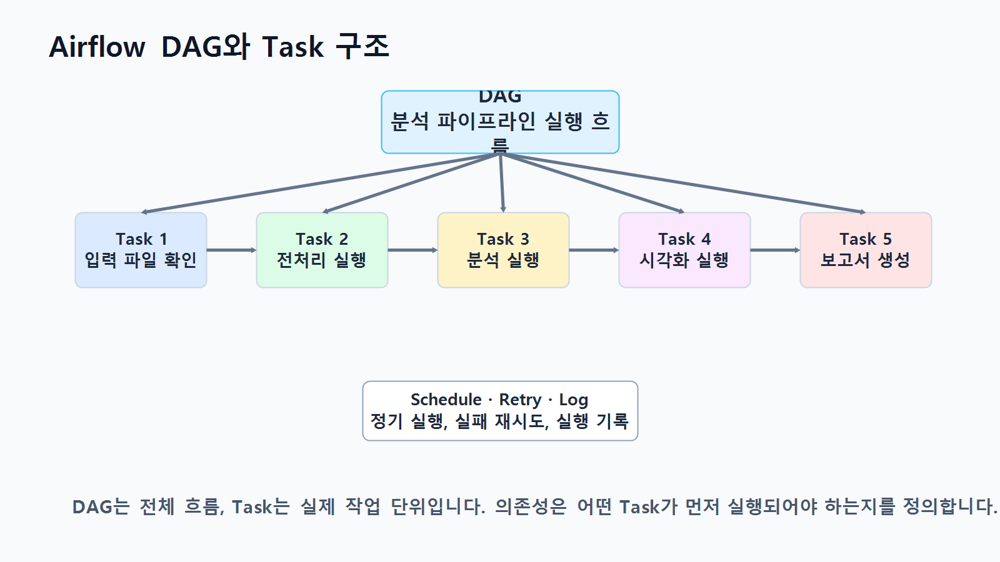
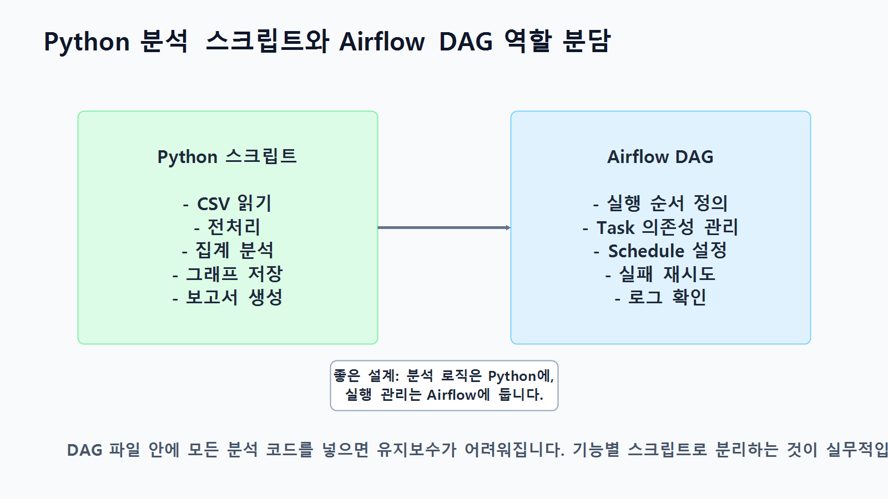
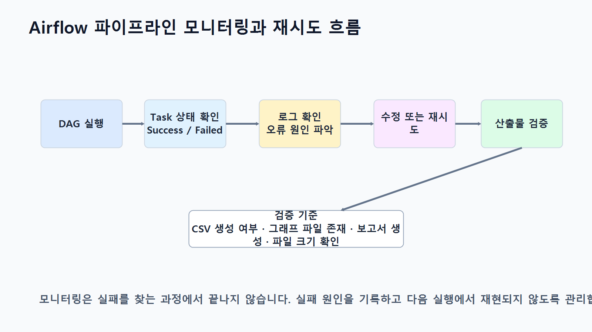

# 14장 Airflow 기반 데이터 분석 파이프라인

이 장에서는 데이터 분석 코드를 한 번 실행하는 수준을 넘어, 여러 분석 단계를 정해진 순서대로 자동 실행하는 방법을 배웁니다. Chapter 13에서 Make를 활용해 보고서 발송과 처리 로그를 자동화했다면, 이번 장에서는 Apache Airflow를 활용해 데이터 확인, 전처리, 분석, 시각화, 보고서 생성, 결과 파일 검증을 하나의 파이프라인으로 묶어 실행합니다.

데이터 분석 실무에서는 분석 코드 자체보다 실행 순서, 실패 재시도, 로그 확인, 결과 파일 검증이 더 중요해지는 경우가 많습니다. Airflow는 이런 반복 실행 구조를 DAG와 Task로 정의하고, 각 Task의 상태를 확인하면서 안정적으로 운영할 수 있게 도와줍니다.

이번 장의 핵심은 **분석 로직은 Python 스크립트에 두고, 실행 순서와 운영 관리는 Airflow DAG에서 담당하도록 역할을 나누는 능력**입니다.

## 수업 시간 구성

| 구성 | 권장 시간 |
| --- | ---: |
| Airflow 기반 파이프라인 개념 이해 | 30분 |
| DAG, Task, Operator, Dependency 구조 이해 | 40분 |
| Python 분석 스크립트와 Airflow DAG 역할 분담 | 35분 |
| 실습 폴더 구조와 입력 데이터 준비 | 30분 |
| Airflow DAG 설계 | 45분 |
| Task 의존성, Schedule, 실패 재시도 설정 | 45분 |
| 로그 확인과 결과 파일 검증 | 40분 |
| Make 보고서 발송 연계 구조 이해 | 30분 |
| 연습 문제 및 심화 과제 | 60~90분 |

기본 설명과 설계 수업은 약 3시간 내외로 운영할 수 있습니다. 실제 Airflow 설치, DAG 실행, 로그 확인, 오류 재현, 재시도 확인, Make 연계까지 포함하면 약 5시간 이상의 확장 실습으로 운영하는 것이 적절합니다.

## 1. 학습 목표

이 장을 마치면 학습자는 다음을 할 수 있습니다.

- Airflow 기반 데이터 분석 파이프라인의 필요성을 설명할 수 있습니다.
- DAG, Task, Operator, Dependency, Schedule의 의미를 구분할 수 있습니다.
- Python 분석 스크립트와 Airflow DAG의 역할을 분리해 설계할 수 있습니다.
- 여러 분석 작업을 Task 단위로 나누고 의존성을 설정할 수 있습니다.
- 실패 재시도와 로그 확인이 필요한 이유를 설명할 수 있습니다.
- 결과 파일 검증 Task를 추가해 파이프라인의 안정성을 높일 수 있습니다.
- 필요 시 Make와 연결해 보고서 발송 자동화로 확장할 수 있습니다.
- LLM을 활용해 DAG 설계 초안과 검증 체크리스트를 작성할 수 있습니다.

## 2. 이번 장에서 만들 결과물

이번 장에서는 온라인 쇼핑몰 분석 흐름을 Airflow DAG로 자동 실행하는 구조를 만듭니다.

이번 장에서 만들 결과물은 다음과 같습니다.

- `scripts/ch14_preprocessing.py`
- `scripts/ch14_analysis.py`
- `scripts/ch14_visualization.py`
- `scripts/ch14_report.py`
- `dags/ch14_analysis_pipeline_dag.py`
- `reports/ch14_airflow_report.md`
- `reports/figures/ch14_daily_sales.png`
- `reports/ch14_airflow_validation_log.csv`
- Airflow DAG 실행 로그 확인 결과
- 필요 시 Make 보고서 발송 연계 설계표

아래 그림은 Airflow가 데이터 분석 작업의 순서와 실행 상태를 관리하는 전체 흐름을 보여줍니다.

<figure class="figure">
  
  <figcaption>그림 14-1. Airflow 기반 데이터 분석 파이프라인 전체 흐름도</figcaption>
</figure>

## 3. 핵심 개념

### 3.1 Airflow 기반 데이터 분석 파이프라인이란 무엇인가

Airflow 기반 데이터 분석 파이프라인은 여러 분석 단계를 하나의 실행 흐름으로 정의하고, 정해진 순서와 조건에 따라 자동으로 실행하는 구조입니다.

예를 들어 다음 작업을 매일 아침 같은 순서로 실행해야 한다고 가정해 보겠습니다.

- 원본 CSV 파일이 존재하는지 확인합니다.
- 데이터 전처리 스크립트를 실행합니다.
- pandas 분석 스크립트를 실행합니다.
- 그래프 이미지를 생성합니다.
- Markdown 보고서를 생성합니다.
- 결과 파일이 정상 생성되었는지 검증합니다.
- 실패한 경우 로그를 확인하고 필요한 Task만 재실행합니다.

이 흐름을 수동으로 실행하면 순서를 실수하거나 중간 오류를 놓칠 수 있습니다. Airflow는 각 단계를 Task로 나누고, 어떤 Task가 먼저 실행되어야 하는지 Dependency로 표현합니다.

### 3.2 DAG, Task, Operator, Dependency, Schedule

Airflow를 이해하려면 다섯 가지 개념을 먼저 구분해야 합니다.

| 개념 | 의미 | 예시 |
| --- | --- | --- |
| DAG | 전체 작업 흐름 | 쇼핑몰 분석 파이프라인 |
| Task | DAG 안의 개별 실행 단위 | 전처리 실행, 보고서 생성 |
| Operator | Task를 실행하는 방식 | BashOperator, PythonOperator |
| Dependency | Task 사이의 실행 순서 | 전처리 후 분석 실행 |
| Schedule | DAG 실행 주기 | 매일 09시, 수동 실행 |

DAG는 전체 흐름이고, Task는 그 흐름 안에서 실행되는 개별 작업입니다. Operator는 Task가 실제로 어떤 방식으로 실행될지를 정합니다. Dependency는 작업 순서를 표현하고, Schedule은 언제 실행할지를 정의합니다.

<figure class="figure">
  
  <figcaption>그림 14-2. Airflow DAG와 Task 구조</figcaption>
</figure>

### 3.3 Python 분석 스크립트와 Airflow DAG의 역할 분담

Airflow를 처음 사용할 때 자주 하는 실수는 모든 분석 코드를 DAG 파일 안에 직접 넣는 것입니다. 이렇게 작성하면 DAG가 길어지고, 분석 코드 테스트도 어려워집니다.

실무에서는 다음처럼 역할을 나누는 방식이 더 안정적입니다.

| 영역 | Python 분석 스크립트 역할 | Airflow DAG 역할 |
| --- | --- | --- |
| 입력 확인 | 파일 존재 여부를 함수로 확인 가능 | 확인 Task 실행 |
| 전처리 | 결측치, 중복, 타입 처리 | 전처리 스크립트 실행 순서 관리 |
| 분석 | pandas 집계와 지표 계산 | 분석 스크립트 실행 상태 관리 |
| 시각화 | 그래프 PNG 저장 | 시각화 Task 실행 |
| 보고서 | Markdown 보고서 생성 | 보고서 생성 후 검증 Task 연결 |
| 오류 처리 | 예외 발생 시 종료 코드 반환 | 실패 감지, 재시도, 로그 제공 |
| 스케줄 | 직접 담당하지 않음 | 정기 실행 또는 수동 실행 |

분석 로직은 `scripts/` 폴더에 두고, DAG 파일은 `dags/` 폴더에서 실행 순서와 운영 설정만 관리하는 방식이 좋습니다.

<figure class="figure">
  
  <figcaption>그림 14-3. Python 분석 스크립트와 Airflow DAG의 역할 분담</figcaption>
</figure>

### 3.4 Task 의존성과 실패 재시도

Task 의존성은 어떤 작업이 먼저 끝나야 다음 작업이 실행되는지를 의미합니다.

이번 장에서는 다음 흐름을 사용합니다.

```text
check_input_files
→ run_preprocessing
→ run_analysis
→ generate_visualizations
→ generate_report
→ validate_outputs
```

이 순서를 지키면 전처리가 실패했는데 분석이 실행되거나, 보고서가 생성되지 않았는데 발송 단계로 넘어가는 문제를 줄일 수 있습니다.

Airflow에서는 실패한 Task에 대해 재시도 횟수와 재시도 간격을 설정할 수 있습니다. 예를 들어 일시적인 파일 접근 오류나 외부 저장소 동기화 지연이 있는 경우 재시도 설정이 도움이 됩니다.

<figure class="figure">
  
  <figcaption>그림 14-4. Airflow Task 의존성과 재시도 흐름</figcaption>
</figure>

### 3.5 로그 확인과 결과 파일 검증

Airflow의 장점은 각 Task의 실행 상태와 로그를 개별적으로 확인할 수 있다는 점입니다. 분석 결과가 이상할 때 전체 파이프라인을 다시 실행하기보다, 실패한 Task의 로그를 먼저 확인하고 필요한 부분만 수정하는 것이 좋습니다.

결과 파일 검증 Task는 다음 항목을 확인합니다.

- 보고서 파일이 생성되었는지 확인합니다.
- 그래프 이미지가 생성되었는지 확인합니다.
- 검증 로그 CSV가 생성되었는지 확인합니다.
- 파일 크기가 0이 아닌지 확인합니다.
- 필수 산출물이 빠졌다면 예외를 발생시켜 DAG를 실패 처리합니다.

<figure class="figure">
  
  <figcaption>그림 14-5. Airflow 파이프라인 모니터링과 재시도 흐름</figcaption>
</figure>

## 4. 실습 시나리오

이번 실습에서는 온라인 쇼핑몰 주문 데이터를 기준으로 하루 단위 매출 리포트를 자동 생성한다고 가정합니다.

실습 흐름은 다음과 같습니다.

1. `data/raw/` 폴더에 원본 CSV 파일이 있는지 확인합니다.
2. `scripts/ch14_preprocessing.py`로 정제 데이터를 생성합니다.
3. `scripts/ch14_analysis.py`로 매출 지표를 계산합니다.
4. `scripts/ch14_visualization.py`로 그래프 이미지를 생성합니다.
5. `scripts/ch14_report.py`로 Markdown 보고서를 생성합니다.
6. Airflow의 `validate_outputs` Task에서 결과 파일을 검증합니다.
7. 필요 시 Make가 보고서 파일을 감지해 Gmail로 발송합니다.

실무에서는 Airflow가 분석 파이프라인을 담당하고, Make는 보고서 발송, 알림, 외부 앱 연계를 담당하도록 나누면 운영이 단순해집니다. 필요 시 Make로 보고서 발송 단계를 연결해 최종 산출물을 담당자에게 전달할 수 있습니다.

## 5. 실습 준비

### 5.1 권장 폴더 구조

실습 폴더는 다음 구조를 권장합니다.

```text
llm-data-analysis-course/
  dags/
    ch14_analysis_pipeline_dag.py
  data/
    raw/
      orders.csv
      order_items.csv
      products.csv
      customers.csv
    processed/
  reports/
    figures/
  scripts/
    ch14_preprocessing.py
    ch14_analysis.py
    ch14_visualization.py
    ch14_report.py
```

### 5.2 필요한 Python 패키지

로컬 실습 환경 또는 Airflow 컨테이너 안에서 다음 패키지를 사용할 수 있어야 합니다.

```bash
pip install pandas matplotlib apache-airflow
```

수업 환경에서는 Airflow 설치가 부담스러울 수 있으므로 Docker 기반 Airflow 환경을 사용하거나, 강사가 준비한 실습 환경에서 DAG 파일만 수정하는 방식으로 진행해도 좋습니다.

### 5.3 입력 데이터 확인 기준

이번 실습에서 필요한 입력 파일은 다음과 같습니다.

| 파일 | 설명 | 필수 여부 |
| --- | --- | --- |
| `orders.csv` | 주문 기본 정보 | 필수 |
| `order_items.csv` | 주문 상세 품목 | 필수 |
| `products.csv` | 상품 정보 | 필수 |
| `customers.csv` | 고객 정보 | 필수 |

입력 파일이 없으면 전처리 이후 단계가 실행되어도 의미가 없으므로, 첫 Task에서 반드시 파일 존재 여부를 확인합니다.

## 6. Airflow DAG 설계

### 6.1 DAG 설계 원칙

Airflow DAG를 설계할 때는 다음 원칙을 지키는 것이 좋습니다.

- DAG 파일은 실행 흐름을 정의하는 데 집중합니다.
- 데이터 분석 코드는 별도 Python 스크립트로 분리합니다.
- Task 이름은 실행 목적이 드러나도록 작성합니다.
- Task 의존성은 한 줄로 읽히게 구성합니다.
- 실패 재시도 횟수와 간격을 명시합니다.
- 마지막 단계에 결과 파일 검증 Task를 둡니다.

### 6.2 이번 장의 Task 구성

| Task ID | Operator | 역할 |
| --- | --- | --- |
| `check_input_files` | PythonOperator | 원본 CSV 파일 존재 여부 확인 |
| `run_preprocessing` | BashOperator | 전처리 스크립트 실행 |
| `run_analysis` | BashOperator | 분석 스크립트 실행 |
| `generate_visualizations` | BashOperator | 시각화 스크립트 실행 |
| `generate_report` | BashOperator | 보고서 생성 스크립트 실행 |
| `validate_outputs` | PythonOperator | 결과 파일 존재 여부와 크기 검증 |

이번 장에서는 BashOperator와 PythonOperator를 함께 사용합니다. BashOperator는 독립 Python 스크립트를 실행할 때 사용하고, PythonOperator는 DAG 파일 안의 간단한 검증 함수를 실행할 때 사용합니다.

## 7. 실습 코드

이번 장은 Notebook 중심 실습이 아니라 Airflow DAG와 독립 Python 스크립트 중심 실습입니다. `notebooks/ch14_airflow_pipeline.ipynb`는 개념 확인과 코드 조각 테스트용으로 사용할 수 있지만, 실제 DAG 실행은 Airflow 환경에서 진행합니다.

아래 코드의 `Path(__file__).resolve().parents[1]`는 `.py` 스크립트 파일로 실행하는 상황을 전제로 합니다. Notebook 셀에서 그대로 실행하면 `__file__`이 정의되어 있지 않아 오류가 날 수 있습니다.

### 7.1 전처리 스크립트

아래 코드는 원본 CSV를 읽고 정제 데이터를 `data/processed/` 폴더에 저장하는 예시입니다.

```python
from pathlib import Path
import pandas as pd

BASE_DIR = Path(__file__).resolve().parents[1]
RAW_DIR = BASE_DIR / "data" / "raw"
PROCESSED_DIR = BASE_DIR / "data" / "processed"
PROCESSED_DIR.mkdir(parents=True, exist_ok=True)

orders = pd.read_csv(RAW_DIR / "orders.csv")
order_items = pd.read_csv(RAW_DIR / "order_items.csv")
products = pd.read_csv(RAW_DIR / "products.csv")
customers = pd.read_csv(RAW_DIR / "customers.csv")

orders["order_date"] = pd.to_datetime(orders["order_date"], errors="coerce")
orders = orders.dropna(subset=["order_id", "customer_id", "order_date"])
order_items = order_items.dropna(subset=["order_id", "product_id", "quantity", "unit_price"])

if "line_total" not in order_items.columns:
    order_items["line_total"] = order_items["quantity"] * order_items["unit_price"]

orders.to_csv(PROCESSED_DIR / "orders_clean.csv", index=False, encoding="utf-8-sig")
order_items.to_csv(PROCESSED_DIR / "order_items_clean.csv", index=False, encoding="utf-8-sig")
products.to_csv(PROCESSED_DIR / "products_clean.csv", index=False, encoding="utf-8-sig")
customers.to_csv(PROCESSED_DIR / "customers_clean.csv", index=False, encoding="utf-8-sig")

print("전처리 완료:", PROCESSED_DIR)
```

### 7.2 분석 스크립트

아래 코드는 주문 상세 데이터를 기준으로 일자별 매출을 계산합니다.

```python
from pathlib import Path
import pandas as pd

BASE_DIR = Path(__file__).resolve().parents[1]
PROCESSED_DIR = BASE_DIR / "data" / "processed"
REPORT_DIR = BASE_DIR / "reports"
REPORT_DIR.mkdir(parents=True, exist_ok=True)

orders = pd.read_csv(PROCESSED_DIR / "orders_clean.csv", parse_dates=["order_date"])
order_items = pd.read_csv(PROCESSED_DIR / "order_items_clean.csv")

if "line_total" in order_items.columns:
    order_items["sales"] = order_items["line_total"]
else:
    order_items["sales"] = order_items["quantity"] * order_items["unit_price"]

merged = order_items.merge(
    orders[["order_id", "order_date"]],
    on="order_id",
    how="left"
)

daily_sales = (
    merged.assign(order_day=merged["order_date"].dt.date)
    .groupby("order_day", as_index=False)["sales"]
    .sum()
    .sort_values("order_day")
)

daily_sales.to_csv(REPORT_DIR / "ch14_daily_sales.csv", index=False, encoding="utf-8-sig")
print("분석 완료:", REPORT_DIR / "ch14_daily_sales.csv")
```

### 7.3 시각화 스크립트

아래 코드는 일자별 매출 그래프를 생성합니다.

```python
from pathlib import Path
import pandas as pd
import matplotlib.pyplot as plt

BASE_DIR = Path(__file__).resolve().parents[1]
REPORT_DIR = BASE_DIR / "reports"
FIGURE_DIR = REPORT_DIR / "figures"
FIGURE_DIR.mkdir(parents=True, exist_ok=True)

daily_sales = pd.read_csv(REPORT_DIR / "ch14_daily_sales.csv")
daily_sales["order_day"] = pd.to_datetime(daily_sales["order_day"])

plt.figure(figsize=(10, 4))
plt.plot(daily_sales["order_day"], daily_sales["sales"], marker="o")
plt.title("Daily Sales")
plt.xlabel("Date")
plt.ylabel("Sales")
plt.grid(True, alpha=0.3)
plt.tight_layout()
plt.savefig(FIGURE_DIR / "ch14_daily_sales.png", dpi=150)
plt.close()

print("시각화 완료:", FIGURE_DIR / "ch14_daily_sales.png")
```

### 7.4 보고서 생성 스크립트

아래 코드는 분석 결과를 Markdown 보고서로 저장합니다.

```python
from pathlib import Path
import pandas as pd

BASE_DIR = Path(__file__).resolve().parents[1]
REPORT_DIR = BASE_DIR / "reports"
FIGURE_DIR = REPORT_DIR / "figures"
REPORT_DIR.mkdir(parents=True, exist_ok=True)

daily_sales = pd.read_csv(REPORT_DIR / "ch14_daily_sales.csv")
total_sales = daily_sales["sales"].sum()
average_sales = daily_sales["sales"].mean()
max_row = daily_sales.loc[daily_sales["sales"].idxmax()]

report_text = f"""# Chapter 14 Airflow 분석 보고서

## 핵심 지표

- 총 매출: {total_sales:,.0f}
- 일평균 매출: {average_sales:,.0f}
- 최고 매출일: {max_row["order_day"]}
- 최고 매출액: {max_row["sales"]:,.0f}

## 그래프 파일

- reports/figures/ch14_daily_sales.png

## 운영 메모

Airflow DAG에서 전처리, 분석, 시각화, 보고서 생성, 결과 검증 순서로 실행되었습니다.
"""

(REPORT_DIR / "ch14_airflow_report.md").write_text(report_text, encoding="utf-8")
print("보고서 생성 완료:", REPORT_DIR / "ch14_airflow_report.md")
```

### 7.5 Airflow DAG 코드

아래 DAG 코드는 이번 장의 핵심 실습 코드입니다. 학습자는 경로를 자신의 Airflow 실행 환경에 맞게 조정해야 합니다.

```python
from airflow import DAG
from airflow.operators.bash import BashOperator
from airflow.operators.python import PythonOperator
from datetime import datetime, timedelta
from pathlib import Path
import csv

BASE_DIR = Path("/opt/airflow")
DATA_DIR = BASE_DIR / "data"
RAW_DIR = DATA_DIR / "raw"
REPORT_DIR = BASE_DIR / "reports"
FIGURE_DIR = REPORT_DIR / "figures"

REQUIRED_INPUT_FILES = [
    RAW_DIR / "orders.csv",
    RAW_DIR / "order_items.csv",
    RAW_DIR / "products.csv",
    RAW_DIR / "customers.csv",
]

REQUIRED_OUTPUT_FILES = [
    REPORT_DIR / "ch14_daily_sales.csv",
    REPORT_DIR / "ch14_airflow_report.md",
    FIGURE_DIR / "ch14_daily_sales.png",
]

default_args = {
    "owner": "data-analysis-class",
    "depends_on_past": False,
    "retries": 2,
    "retry_delay": timedelta(minutes=5),
}

def _check_input_files():
    missing_files = [str(path) for path in REQUIRED_INPUT_FILES if not path.exists()]
    if missing_files:
        raise FileNotFoundError("입력 파일이 없습니다: " + ", ".join(missing_files))
    print("입력 파일 확인 완료")

def _validate_outputs():
    validation_rows = []

    for path in REQUIRED_OUTPUT_FILES:
        exists = path.exists()
        size = path.stat().st_size if exists else 0
        validation_rows.append({
            "file": str(path),
            "exists": exists,
            "size": size,
            "status": "ok" if exists and size > 0 else "error",
        })

    REPORT_DIR.mkdir(parents=True, exist_ok=True)
    log_path = REPORT_DIR / "ch14_airflow_validation_log.csv"

    with log_path.open("w", newline="", encoding="utf-8") as f:
        writer = csv.DictWriter(f, fieldnames=["file", "exists", "size", "status"])
        writer.writeheader()
        writer.writerows(validation_rows)

    failed = [row["file"] for row in validation_rows if row["status"] != "ok"]
    if failed:
        raise RuntimeError("결과 파일 검증 실패: " + ", ".join(failed))

    print("결과 파일 검증 완료:", log_path)

with DAG(
    dag_id="ch14_airflow_analysis_pipeline",
    description="Chapter 14 Airflow 기반 데이터 분석 파이프라인",
    start_date=datetime(2026, 1, 1),
    schedule="@daily",
    catchup=False,
    default_args=default_args,
    tags=["chapter14", "data-analysis", "airflow"],
) as dag:

    check_input_files = PythonOperator(
        task_id="check_input_files",
        python_callable=_check_input_files,
    )

    run_preprocessing = BashOperator(
        task_id="run_preprocessing",
        bash_command="python /opt/airflow/scripts/ch14_preprocessing.py",
    )

    run_analysis = BashOperator(
        task_id="run_analysis",
        bash_command="python /opt/airflow/scripts/ch14_analysis.py",
    )

    generate_visualizations = BashOperator(
        task_id="generate_visualizations",
        bash_command="python /opt/airflow/scripts/ch14_visualization.py",
    )

    generate_report = BashOperator(
        task_id="generate_report",
        bash_command="python /opt/airflow/scripts/ch14_report.py",
    )

    validate_outputs = PythonOperator(
        task_id="validate_outputs",
        python_callable=_validate_outputs,
    )

    check_input_files >> run_preprocessing >> run_analysis >> generate_visualizations >> generate_report >> validate_outputs
```

위 코드에서 가장 중요한 부분은 마지막 Task 의존성입니다.

```python
check_input_files >> run_preprocessing >> run_analysis >> generate_visualizations >> generate_report >> validate_outputs
```

이 한 줄이 전체 데이터 분석 파이프라인의 실행 순서를 정의합니다.

## 8. LLM 활용 프롬프트

Airflow DAG를 처음 설계할 때는 LLM을 활용해 Task 분리와 검증 항목 초안을 만들 수 있습니다. 단, LLM이 생성한 DAG 코드는 반드시 사람이 실행 환경과 경로를 검증해야 합니다.

### 8.1 DAG 설계 초안 요청 프롬프트

```text
온라인 쇼핑몰 주문 데이터를 매일 분석하는 Airflow DAG를 설계하려고 합니다.

입력 파일:
- orders.csv
- order_items.csv
- products.csv
- customers.csv

필요한 작업:
- 입력 파일 확인
- 데이터 전처리
- 매출 분석
- 시각화 생성
- Markdown 보고서 생성
- 결과 파일 검증

요구사항:
- DAG, Task, Operator, Dependency, Schedule 개념이 드러나게 설계해 주세요.
- Python 분석 스크립트와 Airflow DAG의 역할을 분리해 주세요.
- 실패 재시도와 로그 확인 관점을 포함해 주세요.
- 마지막에는 Make로 보고서 발송을 연결할 수 있는 구조도 제안해 주세요.
```

### 8.2 검증 체크리스트 요청 프롬프트

```text
아래 Airflow 데이터 분석 파이프라인을 운영하기 전에 확인해야 할 검증 체크리스트를 만들어 주세요.

Task 흐름:
check_input_files → run_preprocessing → run_analysis → generate_visualizations → generate_report → validate_outputs

체크리스트에는 다음 항목을 포함해 주세요.
- 입력 파일 검증
- 중간 산출물 검증
- 최종 보고서 검증
- 실패 재시도 기준
- 로그 확인 방법
- 결과 파일이 없을 때의 대응
- 필요 시 Make 보고서 발송 전 확인 항목
```

LLM은 초안을 빠르게 만드는 데 도움이 되지만, Airflow 실행 경로, 파일 권한, Docker 볼륨 연결, 실제 데이터 컬럼명은 반드시 사람이 확인해야 합니다.

## 9. 결과 해석

Airflow DAG 실행 결과를 해석할 때는 단순히 성공 여부만 보지 말고 Task 단위로 확인해야 합니다.

| 확인 항목 | 확인 방법 | 해석 기준 |
| --- | --- | --- |
| DAG 실행 상태 | Airflow UI의 DAG Runs | 전체 실행 성공 또는 실패 확인 |
| Task 상태 | Graph 또는 Grid 화면 | 어느 단계에서 실패했는지 확인 |
| 로그 | 실패 Task의 Log 메뉴 | 파일 경로, 컬럼명, 권한 오류 확인 |
| 결과 CSV | `reports/ch14_daily_sales.csv` | 행 수와 주요 값 확인 |
| 그래프 파일 | `reports/figures/` | PNG 생성 여부 확인 |
| 보고서 파일 | `reports/ch14_airflow_report.md` | 핵심 지표와 그래프 경로 확인 |
| 검증 로그 | `ch14_airflow_validation_log.csv` | 필수 산출물 존재 여부 확인 |

실패가 발생하면 먼저 로그를 확인하고, 원인을 수정한 뒤 실패한 Task부터 재실행합니다. 전체 DAG를 무조건 다시 실행하는 것보다 실패 지점부터 확인하는 습관이 중요합니다.

## 10. 실무 적용 포인트

Airflow를 실무 분석 파이프라인에 적용할 때는 다음 사항을 고려해야 합니다.

- DAG는 너무 복잡하게 만들지 말고 업무 단위로 분리합니다.
- 분석 스크립트는 Airflow 밖에서도 단독 실행 가능해야 합니다.
- 입력 데이터, 중간 산출물, 최종 산출물 경로를 명확히 분리합니다.
- 모든 Task는 실패 시 원인을 로그로 남기도록 작성합니다.
- 재시도는 무조건 많이 설정하지 말고 오류 유형에 맞게 설정합니다.
- 결과 파일 검증 없이 보고서 발송 단계로 넘어가지 않도록 합니다.
- 보고서 발송, Slack 알림, Google Sheets 기록은 필요 시 Make와 연결합니다.
- 운영 중인 DAG는 변경 이력을 남기고 테스트 환경에서 먼저 검증합니다.

Airflow는 분석 작업을 자동 실행하는 도구이고, Make는 외부 서비스와 연결해 결과를 전달하는 도구로 이해하면 역할 분담이 명확해집니다.

## 11. 연습 문제

### 11.1 기본 문제

1. DAG, Task, Operator, Dependency, Schedule의 의미를 한 문장씩 설명해 보세요.
2. `check_input_files` Task가 가장 먼저 실행되어야 하는 이유를 설명해 보세요.
3. BashOperator와 PythonOperator의 차이를 정리해 보세요.
4. 결과 파일 검증 Task에서 확인해야 할 항목을 5개 이상 작성해 보세요.
5. Airflow 로그를 확인해야 하는 상황을 3가지 작성해 보세요.

### 11.2 실습 문제

1. `validate_outputs` Task에 검증 대상 파일을 하나 더 추가해 보세요.
2. DAG의 `schedule`을 수동 실행 기준으로 바꾸어 보세요.
3. `retries` 값을 1, 2, 3으로 바꾸었을 때 운영상 차이를 설명해 보세요.
4. 전처리 스크립트에서 입력 컬럼이 없을 때 예외를 발생시키도록 수정해 보세요.
5. Make로 보고서를 발송하기 전에 확인해야 할 조건을 표로 정리해 보세요.

### 11.3 심화 문제

다음 조건을 만족하는 Airflow 파이프라인 개선안을 작성해 보세요.

- 원본 데이터가 없으면 이후 Task가 실행되지 않아야 합니다.
- 분석 결과 CSV의 행 수가 0이면 보고서를 생성하지 않아야 합니다.
- 보고서 생성 후 결과 파일 검증을 통과해야 합니다.
- 검증 성공 후에만 Make 보고서 발송 시나리오가 실행되어야 합니다.
- 실패한 Task의 로그를 보고 원인과 조치 내용을 운영 문서에 기록해야 합니다.

## 12. 정리

이번 장에서는 Airflow를 활용해 데이터 분석 작업을 하나의 파이프라인으로 구성하는 방법을 배웠습니다.

핵심 내용을 정리하면 다음과 같습니다.

- Airflow 기반 데이터 분석 파이프라인은 여러 분석 작업을 정해진 순서로 자동 실행하는 구조입니다.
- DAG는 전체 흐름이고, Task는 개별 실행 단계입니다.
- Operator는 Task 실행 방식을 정의하고, Dependency는 실행 순서를 정의합니다.
- Schedule은 DAG가 언제 실행될지를 정합니다.
- Python 분석 스크립트와 Airflow DAG는 역할을 분리하는 것이 좋습니다.
- Task 의존성을 명확히 설정하면 실패한 단계 이후의 작업이 잘못 실행되는 것을 막을 수 있습니다.
- 실패 재시도, 로그 확인, 결과 파일 검증은 실무 운영에서 매우 중요합니다.
- 필요 시 Make와 연결하면 보고서 발송, 알림, 실행 로그 기록까지 자동화할 수 있습니다.

Airflow는 분석 자동화의 실행 엔진이고, Make는 결과 전달과 외부 서비스 연계 도구입니다. 두 도구를 역할에 맞게 조합하면 반복 데이터 분석 업무를 더 안정적으로 운영할 수 있습니다.
