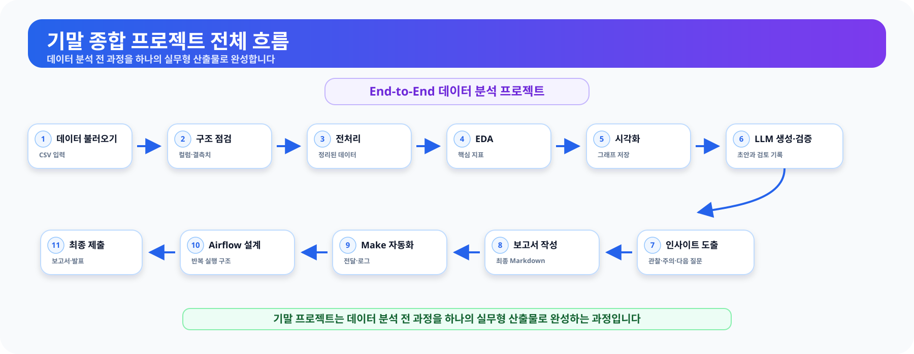
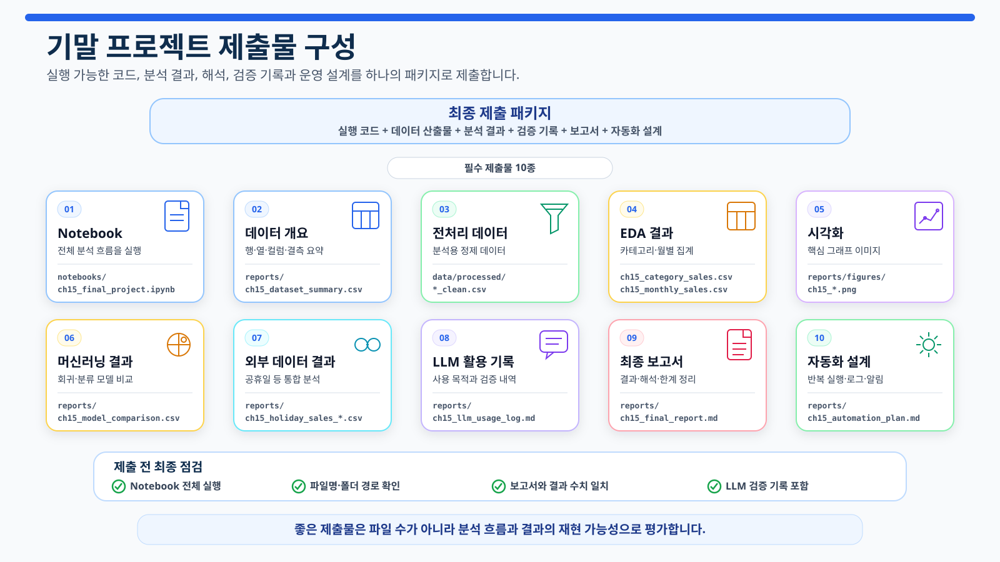
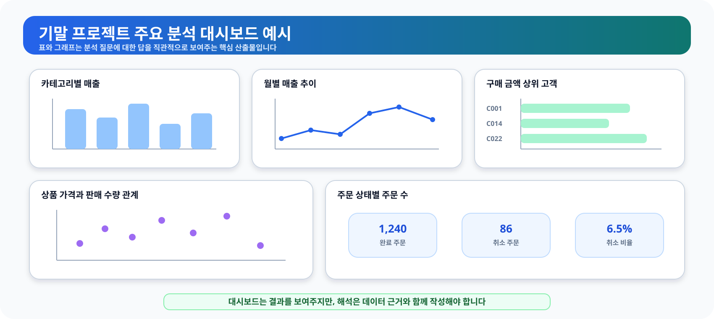

# 15장. 하나의 데이터 분석 프로젝트로 완성하기

지금까지 데이터 구조 이해, pandas 분석, 전처리, EDA, 시각화, 머신러닝, LLM 활용, 외부 데이터 수집과 자동화 설계를 차례로 살펴보았습니다. 최종 프로젝트에서는 이 내용을 한 번에 많이 실행하는 것이 아니라, **하나의 분석 질문을 기준으로 데이터·코드·검증·보고서를 연결하는 방법**을 연습합니다.

이번 장의 기본 주제는 다음과 같습니다.

```text
온라인 쇼핑몰의 완료 주문 매출을 분석하고,
주문 취소 위험을 예측하며,
선택한 외부 데이터를 연결해 분석 범위를 확장한다.
```

최종 프로젝트의 품질은 코드 줄 수나 모델 개수로 판단하지 않습니다. 분석 범위가 명확한지, 계산 기준이 일관적인지, 병합과 모델 평가가 검증되었는지, 개인정보와 API Key가 제외되었는지, 결과를 과장하지 않았는지가 더 중요합니다.

<figure class="figure">
  
  <figcaption>그림 15-1. 최종 프로젝트 전체 흐름도</figcaption>
</figure>

## 1. 프로젝트 목표와 범위를 먼저 정한다

최종 프로젝트는 다음 질문에 답할 수 있어야 합니다.

- 어떤 의사결정을 돕기 위한 분석인가?
- 매출에 포함하는 주문 상태는 무엇인가?
- 현재 데이터로 계산 가능한 지표는 무엇인가?
- 병합 후 행 수와 미매칭을 확인했는가?
- 머신러닝의 예측 시점과 타깃이 명확한가?
- LLM을 사용했다면 어떤 답변을 어떻게 검증했는가?
- 외부 데이터의 출처와 연결 기준을 기록했는가?
- 보고서의 관찰과 원인 가설을 구분했는가?

이번 실습에서는 **완료 주문(`completed`)만 매출로 계산**합니다. 취소·환불 주문 금액은 매출에서 제외하고 별도 범위표로 기록합니다.

```text
전체 주문 상세 금액
= 완료 주문 매출
+ 취소·환불 등 제외 금액
```

## 2. 필수 단계와 선택 단계를 구분한다

모든 기능을 억지로 넣을 필요는 없습니다. 필수 단계가 안정적으로 실행되고 검증된 뒤 선택 단계를 추가합니다.

| 구분 | 단계 | 기준 |
| --- | --- | --- |
| 필수 | 데이터 구조 점검 | 행·열 수, 결측치, 중복 확인 |
| 필수 | 전처리 | 타입·상태값·양수 조건 정리 |
| 필수 | 키 관계 검증 | 고객·주문·상품 외래키 확인 |
| 필수 | 완료 주문 EDA | 카테고리·월·고객·상품 집계 |
| 필수 | 시각화 | 분석 질문과 연결된 그래프 |
| 필수 | 프로젝트 검증 | 총합·행 수·익명화·파일 확인 |
| 필수 | 최종 보고서 | 목적, 결과, 한계, 다음 단계 |
| 선택 | 분류 모델 | 데이터가 충분할 때 실행 |
| 선택 | 외부 데이터 통합 | 출처 파일이 있을 때 실행 |
| 선택 | LLM 활용 | 실제 사용 내역만 기록 |
| 선택 | 자동화 구현 | 설계 이후 별도 구현 |

최종 프로젝트 기본 파이프라인은 외부 네트워크를 호출하지 않습니다. 외부 데이터 파일이 없거나 분류 데이터가 부족하면 해당 단계는 오류를 숨기지 않고 `skipped` 또는 `warning` 상태로 기록합니다.

## 3. 프로젝트 산출물 구조

<figure class="figure">
  
  <figcaption>그림 15-2. 최종 프로젝트 산출물 구성</figcaption>
</figure>

주요 산출물은 다음과 같습니다.

| 영역 | 주요 파일 |
| --- | --- |
| 데이터 개요 | `reports/ch15_dataset_summary.csv` |
| 전처리·키 검증 | `ch15_preprocessing_comparison.csv`, `ch15_relationship_checks.csv` |
| 병합·범위 검증 | `ch15_merge_checks.csv`, `ch15_amount_scope_summary.csv` |
| 완료 주문 EDA | `ch15_category_sales.csv`, `ch15_monthly_sales.csv` |
| 익명 고객·상품 결과 | `ch15_customer_sales.csv`, `ch15_product_sales.csv` |
| 시각화 | `reports/figures/ch15_*.png` |
| 분류 모델 | `ch15_classification_*.csv` |
| 외부 데이터 | `ch15_external_integration_status.csv` |
| LLM 기록 | `ch15_llm_usage_log.csv` |
| 자동화 설계 | `ch15_automation_plan.md` |
| 프로젝트 검증 | `ch15_project_validation.csv` |
| 최종 보고서 | `ch15_final_report.md` |
| 산출물 무결성 | `ch15_project_deliverables.csv` |

`ch15_project_deliverables.csv`에는 각 파일의 존재 여부, 크기와 SHA-256 해시가 기록됩니다.

## 4. 실행 환경 준비

전체 실습은 `notebooks/ch15_final_project.ipynb`에서 진행할 수 있습니다. 원본 데이터가 없다면 프로젝트 루트에서 먼저 실행합니다.

```powershell
python scripts/generate_sample_data.py
```

프로젝트 전체 파이프라인은 다음 명령으로 실행합니다.

```powershell
python scripts/run_final_project.py
```

Notebook에서는 프로젝트 루트를 자동으로 찾습니다.

```python
from pathlib import Path
import sys


def find_project_root(start_path):
    start_path = Path(start_path).resolve()

    for candidate in [start_path, *start_path.parents]:
        if (
            (candidate / "requirements.txt").exists()
            and (candidate / "scripts").exists()
        ):
            return candidate

    raise FileNotFoundError(
        "프로젝트 루트 폴더를 찾을 수 없습니다."
    )


PROJECT_ROOT = find_project_root(Path.cwd())

if str(PROJECT_ROOT) not in sys.path:
    sys.path.insert(0, str(PROJECT_ROOT))
```

## 5. 공통 파이프라인을 실행한다

최종 프로젝트는 앞 장의 검증된 공통 함수를 다시 사용합니다. 장마다 비슷한 전처리와 병합 코드를 복사하면 계산 기준이 달라질 수 있기 때문입니다.

```python
from src.final_project import run_final_project

result = run_final_project(
    PROJECT_ROOT,
    random_state=42,
)
```

핵심 결과는 다음 키로 확인합니다.

```python
core = result["core"]
classification_result = result["classification"]
external_result = result["external"]

display(core["dataset_summary"])
display(core["preprocessing_comparison"])
display(result["validation"])
```

## 6. 데이터 품질과 키 관계를 확인한다

최종 보고서를 작성하기 전에 데이터 구조와 관계 검증을 확인합니다.

```python
display(core["key_duplicate_checks"])
display(core["relationship_checks"])
display(core["public_tables"]["merge_checks"])
```

확인할 내용은 다음과 같습니다.

- 고객, 상품, 주문의 기본 키가 중복되지 않는가?
- `orders.customer_id`가 고객 테이블에 존재하는가?
- `order_items.order_id`가 주문 테이블에 존재하는가?
- `order_items.product_id`가 상품 테이블에 존재하는가?
- 병합 후 행 수가 예상과 같은가?
- 병합되지 않은 주문·상품·고객이 있는가?

`left merge`를 사용해도 오른쪽 키가 중복되면 행 수가 증가할 수 있습니다. 따라서 `how="left"`만으로 안전하다고 판단하지 않고 `validate`와 `indicator` 결과를 함께 확인합니다.

## 7. 완료 주문 매출 기준을 검증한다

분석 범위표를 확인합니다.

```python
amount_scope = core["public_tables"][
    "amount_scope_summary"
]
display(amount_scope)
```

핵심 집계는 모두 완료 주문 기준이어야 합니다.

```python
category_total = core["public_tables"][
    "category_sales"
]["total_sales"].sum()

monthly_total = core["public_tables"][
    "monthly_sales"
]["total_sales"].sum()

customer_total = core["public_tables"][
    "customer_sales"
]["total_sales"].sum()

product_total = core["public_tables"][
    "product_sales"
]["total_sales"].sum()

category_total, monthly_total, customer_total, product_total
```

네 값이 완료 주문 매출과 일치하지 않으면 어느 단계에서 주문 상태 필터가 빠졌는지 확인해야 합니다.

## 8. EDA와 시각화를 연결한다

프로젝트는 다음 질문을 중심으로 분석합니다.

| 분석 질문 | 결과표 | 시각화 |
| --- | --- | --- |
| 어떤 카테고리가 완료 주문 매출에 기여하는가? | `category_sales` | 막대그래프 |
| 월별 완료 주문 매출은 어떻게 변하는가? | `monthly_sales` | 선그래프 |
| 완료 주문 구매 금액 상위 고객군은 누구인가? | `customer_sales` | 가로 막대그래프 |
| 주문 상태별 주문 수는 어떻게 다른가? | `order_status_summary` | 막대그래프 |

```python
display(
    core["public_tables"]["category_sales"].head(10)
)
display(
    core["public_tables"]["monthly_sales"].head(12)
)
display(
    core["public_tables"]["customer_sales"].head(10)
)
```

고객 결과에는 원본 고객 ID, 이름, 이메일, 전화번호를 저장하지 않습니다. `Customer 1` 같은 익명 라벨만 외부 배포용 결과에 포함합니다.

그래프 파일은 `reports/figures/`에 저장됩니다.

<figure class="figure">
  
  <figcaption>그림 15-3. 최종 프로젝트 주요 분석 대시보드 예시</figcaption>
</figure>

## 9. 머신러닝은 분류 모델 하나를 기본으로 사용한다

최종 프로젝트 기본 모델은 10장에서 만든 주문 취소 분류 모델입니다.

타깃 범위는 다음과 같습니다.

| 주문 상태 | 타깃 | 사용 여부 |
| --- | ---: | --- |
| `completed` | 0 | 사용 |
| `cancelled` | 1 | 사용 |
| `refunded` | - | 제외 |
| 기타 상태 | - | 제외 |

분류 단계는 다음 원칙을 따릅니다.

1. 병합에 `validate`와 `indicator`를 사용합니다.
2. `order_status`와 `is_cancelled`를 입력값에서 제외합니다.
3. train, validation, test로 분리합니다.
4. DummyClassifier를 기준 모델로 사용합니다.
5. 모델과 임계값은 validation 데이터에서 선택합니다.
6. test 데이터는 최종 평가에 한 번만 사용합니다.
7. accuracy, precision, recall, f1-score와 혼동행렬을 함께 봅니다.

```python
display(classification_result["status"])
display(classification_result["validation_comparison"])
display(classification_result["test_metrics"])
display(classification_result["confusion_matrix"])
```

샘플 수가 부족하거나 각 클래스에 필요한 건수가 없으면 분류 단계는 `skipped`로 기록됩니다. 데이터를 억지로 복제하거나 테스트 데이터로 모델을 선택하지 않습니다.

### 회귀 분석을 추가할 때

회귀 모델은 선택 단계입니다. 주문 금액은 수량과 단가에서 직접 계산되는 값이므로, 주문 완료 후 만들어진 `total_quantity`, `avg_unit_price`를 입력값으로 사용하면 성능이 높아도 실무 예측 의미가 약할 수 있습니다. 회귀를 추가할 때는 반드시 다음을 설명합니다.

- 예측 시점
- 그 시점에 사용 가능한 입력값
- 타깃을 직접 또는 거의 결정하는 변수
- 기준 모델
- 모델 선택 데이터와 최종 테스트 데이터의 분리

## 10. 외부 데이터는 실제 파일이 있을 때만 연결한다

13장과 같은 폴더 구조를 사용합니다.

```text
data/external/
├─ raw/
├─ processed/
└─ metadata/
```

공휴일 예시를 연결하려면 다음 파일을 준비합니다.

```text
data/external/processed/holidays.csv
```

필수 컬럼은 다음과 같습니다.

```text
date,holiday_name,is_holiday
```

가능하면 다음 출처 정보도 함께 관리합니다.

```text
provider,source_url,data_reference_date,license_or_terms
```

외부 파일이 없으면 파이프라인은 가짜 공휴일 데이터를 만들지 않습니다. 대신 다음 템플릿을 생성하고 통합 단계를 `skipped`로 기록합니다.

```text
reports/ch15_holidays_template.csv
```

```python
display(external_result["status"])
display(external_result["comparison"])
display(external_result["merge_check"])
```

외부 데이터를 연결할 때는 다음을 확인합니다.

- 날짜가 정상적으로 변환되는가?
- 같은 날짜가 중복되지 않는가?
- 병합 후 일자별 매출 행 수가 유지되는가?
- 내부 데이터 기간과 외부 데이터 기준일이 겹치는가?
- 출처 파일의 SHA-256이 기록되었는가?
- 공휴일과 일반일 표본이 모두 존재하는가?

공휴일 평균 매출 차이가 보여도 공휴일이 매출 변화의 원인이라고 단정할 수 없습니다.

## 11. LLM 사용 기록은 실제 사용 내역만 작성한다

파이프라인은 빈 로그 템플릿을 생성합니다.

```python
display(result["llm_usage_log"])
```

주요 컬럼은 다음과 같습니다.

| 컬럼 | 기록 내용 |
| --- | --- |
| `executed_at` | 사용 날짜와 시간 |
| `provider` | 사용 서비스 |
| `model` | 실제 모델명 |
| `prompt_version` | 프롬프트 버전 |
| `step` | 사용 단계 |
| `input_summary` | 제공한 구조·집계 정보 |
| `response_summary` | 답변 요약 |
| `validation_result` | 실행·수치·논리 검증 |
| `revision_note` | 사람이 수정한 내용 |
| `final_use` | 사용·부분 사용·미사용 |

LLM을 사용하지 않았다면 `미사용` 상태를 그대로 둡니다. 사용하지 않은 도구를 사용했다고 작성하거나, 빈 템플릿을 실제 사용 기록처럼 제출하지 않습니다.

LLM 입력에는 다음 내용을 포함하지 않습니다.

- 고객명과 연락처
- 개별 주문 원본
- 실제 API Key와 토큰
- 내부 URL과 민감한 파일 경로
- 계약상 외부 제공이 금지된 자료

## 12. 자동화는 검증 실패를 처리해야 한다

자동화 설계서는 다음 순서를 포함합니다.

```text
원본 파일 확인
→ 전처리
→ 키 관계와 병합 검증
→ 완료 주문 EDA
→ 분류 모델 실행
→ 외부 데이터 존재 여부 확인
→ 프로젝트 검증
→ 보고서와 manifest 생성
→ 실패·경고 알림
```

단순히 Python 파일이 오류 없이 끝났다고 자동화가 성공한 것은 아닙니다.

- 필수 파일이 없으면 중단합니다.
- 키 관계가 깨지면 중단합니다.
- 완료 주문 매출 총합이 다르면 중단합니다.
- 외부 데이터가 없으면 선택 단계를 건너뜁니다.
- 모델 데이터가 부족하면 모델 단계를 건너뜁니다.
- 경고와 실패 상태를 로그와 알림에 남깁니다.

## 13. 프로젝트 검증표를 먼저 본다

```python
validation = result["validation"]
display(validation)
```

검증 상태는 다음 의미로 사용합니다.

| 상태 | 의미 |
| --- | --- |
| `PASS` | 필수 기준 충족 |
| `WARN` | 선택 단계 미실행 또는 해석 제한 |
| `FAIL` | 계산·관계·보안·산출물 오류 |

`FAIL`이 있다면 최종 보고서를 제출하기 전에 원인을 수정합니다. `WARN`은 무조건 오류가 아니지만, 보고서에 이유와 제한을 적어야 합니다.

## 14. 산출물 manifest로 재현성을 확인한다

```python
manifest = result["manifest"]
display(manifest)
```

manifest에는 다음 정보가 포함됩니다.

- 산출물 이름
- 필수 여부
- 저장 경로
- 파일 존재 여부
- 파일 크기
- SHA-256

파일 해시는 분석 결과가 바뀌었는지 확인하는 보조 수단입니다. 해시가 같다고 분석 내용이 타당하다는 뜻은 아니므로 프로젝트 검증표와 함께 사용합니다.

## 15. 최종 보고서와 발표 자료

최종 보고서는 다음 구조를 권장합니다.

```text
1. 프로젝트 목적과 분석 질문
2. 사용 데이터와 분석 범위
3. 전처리와 키 관계 검증
4. 완료 주문 기준 EDA
5. 시각화 결과
6. 분류 모델 결과 또는 미실행 사유
7. 외부 데이터 통합 결과 또는 미실행 사유
8. LLM 사용 및 검증 기록
9. 자동화 설계
10. 프로젝트 검증 결과
11. 결론, 한계, 다음 단계
```

발표에서는 코드 줄을 읽기보다 다음 내용을 설명합니다.

- 왜 완료 주문만 매출로 정의했는가?
- 어떤 병합 검증을 수행했는가?
- 핵심 지표가 같은 매출 총합을 사용하는가?
- 모델과 임계값을 어떻게 선택했는가?
- 외부 데이터가 실제 출처 데이터인가?
- 어떤 결과가 관찰이고 어떤 내용이 가설인가?
- `WARN` 또는 `FAIL` 항목은 무엇인가?

피해야 할 표현은 다음과 같습니다.

```text
공휴일 때문에 매출이 증가했습니다.
모델이 고객 행동의 원인을 설명합니다.
LLM이 생성했으므로 결과가 정확합니다.
높은 정확도이므로 바로 운영에 적용할 수 있습니다.
```

더 안전한 표현은 다음과 같습니다.

```text
공휴일 여부에 따른 평균 매출 차이가 관찰되었습니다.
현재 입력값 범위에서 취소 여부와 관련된 패턴을 확인했습니다.
LLM 제안은 실행과 수치 검증 후 일부 반영했습니다.
운영 적용 전 추가 데이터와 시간 순서 평가가 필요합니다.
```

## 16. 제출 전 체크리스트

| 영역 | 점검 항목 |
| --- | --- |
| 목적 | 분석 질문과 의사결정 목적이 명확한가? |
| 범위 | 완료 주문 매출 기준을 설명했는가? |
| 데이터 | 구조, 결측치, 중복, 키 관계를 확인했는가? |
| 병합 | `validate`, 행 수, 미매칭을 확인했는가? |
| EDA | 카테고리·월·고객·상품 총합이 일치하는가? |
| 개인정보 | 고객 ID, 이름, 연락처를 결과에서 제외했는가? |
| 모델 | 타깃 범위, 분할, 기준 모델, 지표를 설명했는가? |
| 외부 데이터 | 출처, 기준일, 라이선스, 파일 해시를 기록했는가? |
| LLM | 실제 사용 조건과 수정 내용을 기록했는가? |
| 자동화 | 실패·경고 상태 처리 방법이 있는가? |
| 보고서 | 관찰, 가설, 한계를 구분했는가? |
| 산출물 | manifest의 필수 파일이 모두 존재하는가? |

## 17. 한 번에 실행하기

프로젝트 루트에서 실행합니다.

```powershell
python scripts/generate_sample_data.py
python scripts/run_final_project.py
```

출력에서 다음 내용을 먼저 확인합니다.

```text
[프로젝트 검증]
[분류 단계]
[외부 데이터 단계]
[최종 보고서]
[산출물 manifest]
```

최종 프로젝트의 목적은 완벽한 모델을 만드는 것이 아닙니다. **분석 질문부터 데이터 범위, 검증, 해석, 보고서까지 연결된 재현 가능한 분석 흐름을 만드는 것**이 핵심입니다.
