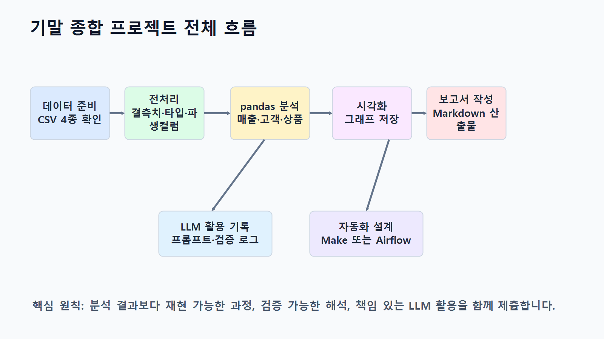
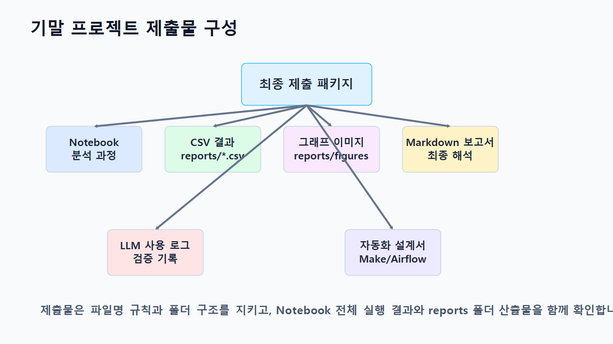
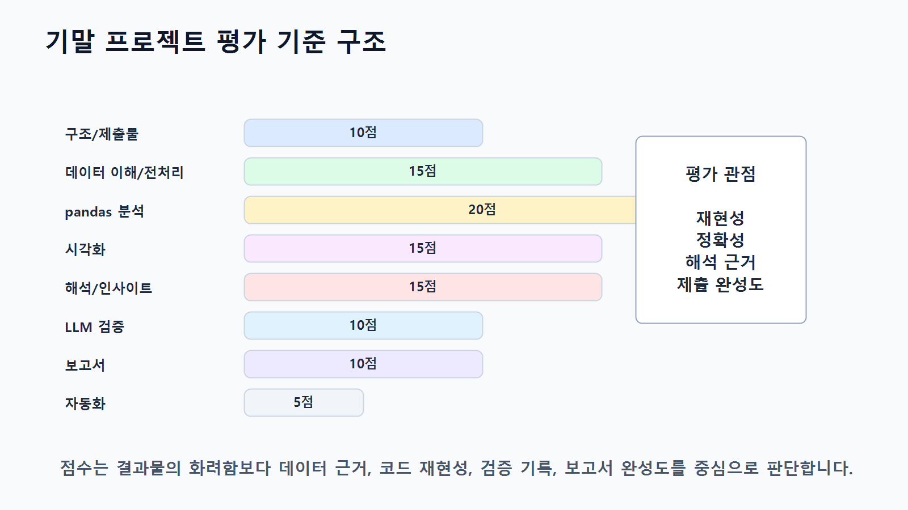
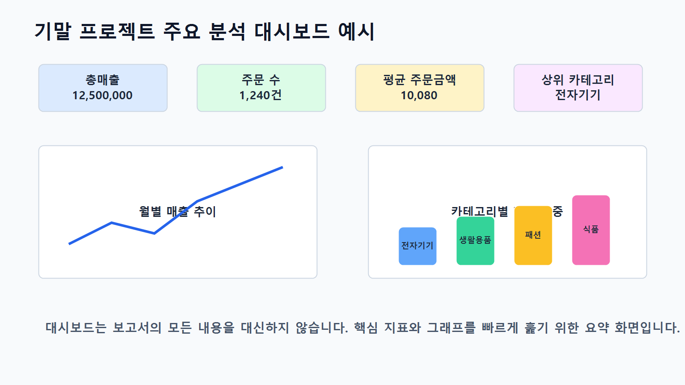
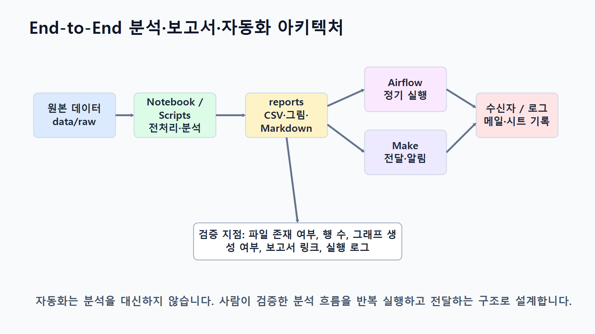

# 15장 기말 종합 프로젝트

이 장에서는 지금까지 학습한 전체 내용을 하나의 기말 종합 프로젝트로 완성합니다. Chapter 3부터 Chapter 14까지 데이터 불러오기, pandas 기본 분석, 전처리, EDA, 시각화, LLM 활용, 코드 생성과 검증, 인사이트 도출, 보고서 자동 작성, Make 자동화, Airflow 파이프라인을 단계별로 학습했습니다. 이번 장에서는 이 모든 과정을 하나의 실무형 분석 프로젝트로 통합합니다.

기말 종합 프로젝트의 목표는 단순히 코드 몇 개를 실행하는 것이 아닙니다. 실제 데이터 분석 업무처럼 분석 목적을 정의하고, 데이터 구조를 파악하고, 전처리 기준을 세우고, 분석 질문을 만들고, 결과를 시각화하고, LLM을 보조 도구로 활용하며, 최종 보고서와 자동화 설계까지 완성하는 것입니다.

이번 프로젝트에서는 온라인 쇼핑몰 데이터를 기반으로 매출 현황, 고객 구매 패턴, 상품 카테고리 성과, 월별 흐름을 분석합니다. 학습자는 Notebook, Python 스크립트, 분석 결과 CSV, 그래프 이미지, Markdown 보고서, LLM 활용 기록, 자동화 설계 문서를 함께 제출합니다.

이번 장의 핵심은 <strong>데이터 분석 전 과정을 실무 프로젝트 산출물로 완성하는 능력</strong>입니다.

## 수업 시간 구성

| 구성                 | 권장 시간 |
| ------------------ | ----: |
| 기말 프로젝트 목표와 제출물 안내 |   40분 |
| 분석 주제와 질문 설계       |   50분 |
| 데이터 구조 점검 및 전처리    |   60분 |
| pandas 분석 및 지표 계산  |   70분 |
| 시각화 작성 및 저장        |   60분 |
| LLM 활용 및 검증 기록 작성  |   50분 |
| 인사이트 도출과 보고서 작성    |   70분 |
| 자동화 설계 또는 파이프라인 설계 |   50분 |
| 최종 검증 및 제출물 정리     |   60분 |

기본 수업은 약 8~9시간을 기준으로 구성되어 있습니다. 개인별 프로젝트 수행, 발표, 피드백까지 포함하면 1~2주 프로젝트로 확장할 수 있습니다. 5시간 내외로 운영해야 한다면 데이터 구조 점검, 핵심 분석, 최종 보고서 작성 중심으로 범위를 줄입니다.

## 1. 학습 목표

이 장을 마치면 학습자는 다음을 할 수 있습니다.

* 데이터 분석 프로젝트의 전체 흐름을 독립적으로 수행할 수 있습니다.
* 분석 목적과 분석 질문을 데이터 구조에 맞게 정의할 수 있습니다.
* 원본 데이터를 불러오고 구조, 결측치, 중복, 데이터 타입을 점검할 수 있습니다.
* 분석 목적에 맞는 전처리 기준을 수립하고 적용할 수 있습니다.
* 여러 CSV 파일을 병합해 분석용 데이터셋을 만들 수 있습니다.
* pandas를 사용해 카테고리별, 월별, 고객별, 상품별 주요 지표를 계산할 수 있습니다.
* 분석 질문에 적합한 그래프를 선택하고 저장할 수 있습니다.
* 분석 결과에서 관찰, 가설, 인사이트, 다음 단계를 구분할 수 있습니다.
* LLM을 활용해 코드, 해석, 보고서 초안을 보조받고 검증할 수 있습니다.
* Markdown 분석 보고서를 작성할 수 있습니다.
* Make 또는 Airflow 기반 자동화 설계를 제안할 수 있습니다.
* 최종 산출물을 체계적으로 정리해 제출할 수 있습니다.

## 2. 기말 프로젝트 개요

이번 기말 종합 프로젝트의 주제는 다음과 같습니다.

```text
온라인 쇼핑몰 고객·상품·주문 데이터 기반 매출 분석 및 보고서 자동화 프로젝트
```

프로젝트의 기본 시나리오는 다음과 같습니다.

> 온라인 쇼핑몰 운영팀은 최근 주문 데이터를 바탕으로 매출 현황과 고객 구매 패턴을 파악하려고 합니다. 데이터 분석가는 원본 CSV 데이터를 점검하고, 전처리하고, 주요 지표를 계산하고, 시각화와 인사이트를 포함한 분석 보고서를 작성해야 합니다. 또한 향후 반복 분석 업무를 위해 보고서 자동화 또는 파이프라인 설계 방안을 제안해야 합니다.

이번 프로젝트에서 다룰 핵심 분석 영역은 다음과 같습니다.

| 분석 영역    | 핵심 질문                     | 주요 지표                            |
| -------- | ------------------------- | -------------------------------- |
| 매출 현황    | 전체 매출은 어느 정도인가?           | `total_sales`                    |
| 카테고리 분석  | 어떤 카테고리가 매출에 기여하는가?       | `sales_ratio`, `total_quantity`  |
| 월별 분석    | 매출과 주문 수는 월별로 어떻게 변하는가?   | `order_month`, `order_count`     |
| 고객 분석    | 구매 금액 상위 고객은 어떤 특성이 있는가?  | `order_count`, `avg_order_value` |
| 상품 분석    | 어떤 상품이 매출과 판매 수량에 기여하는가?  | `total_quantity`, `total_sales`  |
| 주문 상태 분석 | 완료, 취소, 대기 주문은 어떻게 분포하는가? | `order_status`, `order_count`    |
| 인사이트     | 다음에 어떤 분석이 필요한가?          | 관찰, 가설, 추가 질문                    |

아래 그림은 기말 종합 프로젝트의 전체 흐름을 보여줍니다.

<figure class="figure">
  
  <figcaption>그림 15-1. 기말 종합 프로젝트 전체 흐름도</figcaption>
</figure>

## 3. 제출 산출물

기말 프로젝트 제출물은 코드, 데이터 결과, 그래프, 보고서, 검증 기록, 자동화 설계를 모두 포함합니다.

| 구분       | 제출물                                       | 설명                     |
| -------- | ----------------------------------------- | ---------------------- |
| Notebook | `notebooks/ch15_final_project.ipynb`      | 전체 분석 과정 실행 Notebook   |
| 전처리 결과   | `data/processed/*_clean.csv`              | 전처리된 데이터               |
| 분석 결과    | `reports/ch15_category_sales.csv`         | 카테고리별 매출               |
| 분석 결과    | `reports/ch15_monthly_sales.csv`          | 월별 매출                  |
| 분석 결과    | `reports/ch15_customer_sales.csv`         | 고객별 구매 금액              |
| 분석 결과    | `reports/ch15_product_sales.csv`          | 상품별 매출                 |
| 그래프      | `reports/figures/ch15_category_sales.png` | 카테고리별 매출 그래프           |
| 그래프      | `reports/figures/ch15_monthly_sales.png`  | 월별 매출 그래프              |
| 그래프      | `reports/figures/ch15_top_customers.png`  | 상위 고객 그래프              |
| 보고서      | `reports/ch15_final_report.md`            | 최종 분석 보고서              |
| LLM 기록   | `reports/ch15_llm_usage_log.md`           | LLM 활용 및 검증 기록         |
| 자동화 설계   | `reports/ch15_automation_plan.md`         | Make 또는 Airflow 자동화 설계 |
| 체크리스트    | `reports/ch15_submission_checklist.csv`   | 최종 제출 점검표              |

아래 그림은 최종 제출 패키지 구성을 보여줍니다.

<figure class="figure">
  
  <figcaption>그림 15-2. 기말 프로젝트 제출물 구성</figcaption>
</figure>

## 4. 핵심 개념

### 4.1 종합 프로젝트형 분석이란 무엇인가

종합 프로젝트형 분석은 개별 실습 코드를 하나로 묶는 수준을 넘어, 문제 정의부터 결과 보고까지 전체 분석 흐름을 완성하는 방식입니다.

프로젝트형 분석은 다음 순서로 진행됩니다.

1. 분석 목적 정의
2. 데이터 구조 확인
3. 전처리 기준 수립
4. 분석 질문 설계
5. pandas 분석 수행
6. 시각화 생성
7. 인사이트 도출
8. LLM 활용 및 검증
9. 보고서 작성
10. 자동화 또는 파이프라인 설계
11. 최종 검증 및 제출

중요한 것은 각 단계가 서로 연결되어야 한다는 점입니다. 분석 질문 없이 그래프만 만들거나, 전처리 기준 없이 결과만 해석하면 프로젝트 완성도가 떨어집니다.

### 4.2 분석 질문과 산출물 연결

좋은 프로젝트는 분석 질문과 산출물이 명확하게 연결됩니다.

| 분석 질문               | 필요한 데이터                              | pandas 기능              | 산출물         |
| ------------------- | ------------------------------------ | ---------------------- | ----------- |
| 카테고리별 매출은 어떻게 다른가?  | `order_items`, `products`            | `merge()`, `groupby()` | 표, 막대그래프    |
| 월별 매출은 어떻게 변하는가?    | `orders`, `order_items`              | 날짜 변환, `groupby()`     | 표, 선 그래프    |
| 구매 금액 상위 고객은 누구인가?  | `customers`, `orders`, `order_items` | 병합, 집계                 | 표, 가로 막대그래프 |
| 상품별 판매 성과는 어떤가?     | `products`, `order_items`            | 병합, 집계, 정렬             | 상품별 매출표     |
| 주문 상태는 어떻게 분포하는가?   | `orders`                             | `value_counts()`       | 주문 상태 요약표   |
| 자동화하려면 어떤 구조가 필요한가? | 보고서, 그래프                             | Make 또는 Airflow 설계     | 자동화 설계서     |

### 4.3 프로젝트 품질을 결정하는 기준

기말 프로젝트의 품질은 코드 길이가 아니라 분석 흐름의 완성도로 평가합니다.

좋은 프로젝트는 다음 특징을 가집니다.

* 분석 목적이 명확합니다.
* 데이터 구조를 먼저 확인합니다.
* 전처리 기준이 설명되어 있습니다.
* 분석 질문과 코드가 연결됩니다.
* 표와 그래프가 해석과 연결됩니다.
* 원인 단정 없이 관찰과 가설을 구분합니다.
* LLM 활용 내용을 기록하고 검증합니다.
* 결과 파일과 보고서가 재현 가능합니다.
* 자동화 설계가 현실적인 업무 흐름과 연결됩니다.

아래 그림은 기말 프로젝트 평가 관점을 보여줍니다.

<figure class="figure">
  
  <figcaption>그림 15-3. 기말 프로젝트 평가 기준 구조</figcaption>
</figure>

## 5. 프로젝트 수행 절차

### 5.1 프로젝트 폴더 구조

기말 프로젝트에서는 다음 폴더 구조를 사용합니다.

```text
llm-data-analysis-course/
├─ data/
│  ├─ raw/
│  └─ processed/
├─ notebooks/
│  └─ ch15_final_project.ipynb
├─ reports/
│  ├─ figures/
│  ├─ ch15_final_report.md
│  ├─ ch15_llm_usage_log.md
│  └─ ch15_automation_plan.md
├─ scripts/
│  └─ ch15_final_project_pipeline.py
└─ prompts/
   └─ ch15_project_prompts.md
```

### 5.2 기본 패키지 불러오기

```python
from pathlib import Path
from datetime import datetime
import pandas as pd
import matplotlib.pyplot as plt
```

한글 폰트를 설정합니다.

```python
plt.rcParams["font.family"] = "Malgun Gothic"
plt.rcParams["axes.unicode_minus"] = False
```

macOS에서는 `AppleGothic`, Linux 또는 Colab에서는 `NanumGothic`을 사용할 수 있습니다. 본인 환경에서 한글이 깨지면 운영체제에 맞는 폰트로 변경합니다.

경로를 설정합니다.

```python
raw_dir = Path("data/raw")
processed_dir = Path("data/processed")
report_dir = Path("reports")
figure_dir = report_dir / "figures"

processed_dir.mkdir(parents=True, exist_ok=True)
report_dir.mkdir(parents=True, exist_ok=True)
figure_dir.mkdir(parents=True, exist_ok=True)
```

프로젝트 루트에서 Notebook을 실행하면 위 경로를 사용합니다. Notebook을 `notebooks` 폴더 안에서 실행하는 경우에는 다음 경로를 사용합니다. 실행 전 `Path.cwd()`로 현재 작업 폴더를 확인하고, 두 경로 버전 중 하나만 선택해 사용합니다.

```python
raw_dir = Path("../data/raw")
processed_dir = Path("../data/processed")
report_dir = Path("../reports")
figure_dir = report_dir / "figures"

processed_dir.mkdir(parents=True, exist_ok=True)
report_dir.mkdir(parents=True, exist_ok=True)
figure_dir.mkdir(parents=True, exist_ok=True)
```

`to_markdown()`을 사용하려면 `tabulate` 패키지가 필요합니다. `requirements.txt`를 설치했다면 함께 설치되지만, 오류가 발생하면 다음 명령을 실행합니다.

```text
pip install tabulate
```

### 5.3 원본 데이터 불러오기

```python
customers = pd.read_csv(raw_dir / "customers.csv")
products = pd.read_csv(raw_dir / "products.csv")
orders = pd.read_csv(raw_dir / "orders.csv")
order_items = pd.read_csv(raw_dir / "order_items.csv")
```

데이터셋을 딕셔너리로 정리합니다.

```python
datasets = {
    "customers": customers,
    "products": products,
    "orders": orders,
    "order_items": order_items
}
```

### 5.4 데이터 구조 요약표 만들기

```python
dataset_summary = []

for name, df in datasets.items():
    dataset_summary.append({
        "dataset": name,
        "rows": df.shape[0],
        "columns": df.shape[1],
        "column_list": ", ".join(df.columns),
        "missing_values": int(df.isna().sum().sum()),
        "duplicated_rows": int(df.duplicated().sum())
    })

dataset_summary = pd.DataFrame(dataset_summary)
dataset_summary
```

저장합니다.

```python
dataset_summary.to_csv(report_dir / "ch15_dataset_summary.csv", index=False)
```

### 5.5 전처리 함수 작성

문자열 공백 제거 함수입니다.

```python
def strip_string_columns(df):
    df = df.copy()
    string_columns = df.select_dtypes(include="object").columns
    
    for col in string_columns:
        df[col] = df[col].where(
            df[col].isna(),
            df[col].astype(str).str.strip()
        )
    
    return df
```

숫자형 변환 함수입니다.

```python
def to_number(series):
    return pd.to_numeric(
        series.astype(str).str.replace(",", "", regex=False),
        errors="coerce"
    )
```

### 5.6 데이터 전처리 수행

고객 데이터 전처리입니다.

```python
customers_clean = strip_string_columns(customers)

if "age" in customers_clean.columns:
    customers_clean["age"] = pd.to_numeric(customers_clean["age"], errors="coerce")
    customers_clean["age"] = customers_clean["age"].fillna(customers_clean["age"].median())

if "city" in customers_clean.columns:
    customers_clean["city"] = customers_clean["city"].fillna("Unknown")

if "signup_date" in customers_clean.columns:
    customers_clean["signup_date"] = pd.to_datetime(
        customers_clean["signup_date"],
        errors="coerce"
    )

customers_clean = customers_clean.drop_duplicates()
```

상품 데이터 전처리입니다.

```python
products_clean = strip_string_columns(products)

if "price" in products_clean.columns:
    products_clean["price"] = to_number(products_clean["price"])
    products_clean = products_clean[products_clean["price"] > 0]

products_clean = products_clean.drop_duplicates()
```

주문 데이터 전처리입니다.

```python
orders_clean = strip_string_columns(orders)

if "order_date" in orders_clean.columns:
    orders_clean["order_date"] = pd.to_datetime(
        orders_clean["order_date"],
        errors="coerce"
    )
    orders_clean["order_month"] = orders_clean["order_date"].dt.to_period("M").astype(str)

if "order_status" in orders_clean.columns:
    status_map = {
        "complete": "completed",
        "Complete": "completed",
        "COMPLETED": "completed",
        "완료": "completed",
        "cancel": "cancelled",
        "Cancel": "cancelled",
        "CANCELLED": "cancelled",
        "취소": "cancelled"
    }
    orders_clean["order_status"] = orders_clean["order_status"].replace(status_map)

orders_clean = orders_clean.drop_duplicates()
```

주문 상세 데이터 전처리입니다.

```python
order_items_clean = strip_string_columns(order_items)

if "quantity" in order_items_clean.columns:
    order_items_clean["quantity"] = to_number(order_items_clean["quantity"])

if "unit_price" in order_items_clean.columns:
    order_items_clean["unit_price"] = to_number(order_items_clean["unit_price"])

if "quantity" in order_items_clean.columns:
    order_items_clean = order_items_clean[order_items_clean["quantity"] > 0]

if "unit_price" in order_items_clean.columns:
    order_items_clean = order_items_clean[order_items_clean["unit_price"] > 0]

if {"quantity", "unit_price"}.issubset(order_items_clean.columns):
    order_items_clean["line_total"] = (
        order_items_clean["quantity"] * order_items_clean["unit_price"]
    )

order_items_clean = order_items_clean.drop_duplicates()
```

전처리 결과를 저장합니다.

```python
customers_clean.to_csv(processed_dir / "customers_clean.csv", index=False)
products_clean.to_csv(processed_dir / "products_clean.csv", index=False)
orders_clean.to_csv(processed_dir / "orders_clean.csv", index=False)
order_items_clean.to_csv(processed_dir / "order_items_clean.csv", index=False)
```

### 5.7 전처리 전후 비교

```python
processed_summary = pd.DataFrame({
    "dataset": ["customers", "products", "orders", "order_items"],
    "rows_processed": [
        customers_clean.shape[0],
        products_clean.shape[0],
        orders_clean.shape[0],
        order_items_clean.shape[0]
    ],
    "columns_processed": [
        customers_clean.shape[1],
        products_clean.shape[1],
        orders_clean.shape[1],
        order_items_clean.shape[1]
    ]
})

preprocessing_comparison = dataset_summary.merge(
    processed_summary,
    on="dataset"
)

preprocessing_comparison
```

저장합니다.

```python
preprocessing_comparison.to_csv(
    report_dir / "ch15_preprocessing_comparison.csv",
    index=False
)
```

### 5.8 분석용 데이터 병합

주문 상세와 상품 데이터를 병합합니다.

```python
sales_items = order_items_clean.merge(
    products_clean,
    on="product_id",
    how="left"
)
```

주문 상세와 주문 데이터를 병합합니다.

```python
order_sales = order_items_clean.merge(
    orders_clean,
    on="order_id",
    how="left"
)
```

고객 정보까지 병합합니다.

```python
customer_sales_base = order_sales.merge(
    customers_clean,
    on="customer_id",
    how="left"
)
```

병합 결과를 검증합니다.

```python
print("sales_items:", sales_items.shape)
print("order_sales:", order_sales.shape)
print("customer_sales_base:", customer_sales_base.shape)

print("category 누락:", sales_items["category"].isna().sum())
print("order_date 누락:", order_sales["order_date"].isna().sum())
print("customer_id 누락:", customer_sales_base["customer_id"].isna().sum())
```

## 6. 주요 분석

### 6.1 카테고리별 매출 분석

```python
category_sales = (
    sales_items
    .groupby("category", as_index=False)
    .agg(
        total_quantity=("quantity", "sum"),
        total_sales=("line_total", "sum")
    )
    .sort_values("total_sales", ascending=False)
)

category_sales["sales_ratio"] = (
    category_sales["total_sales"] / category_sales["total_sales"].sum() * 100
).round(2)

category_sales["avg_unit_revenue"] = (
    category_sales["total_sales"] / category_sales["total_quantity"]
).round(0)

category_sales
```

저장합니다.

```python
category_sales.to_csv(report_dir / "ch15_category_sales.csv", index=False)
```

### 6.2 월별 매출 분석

```python
order_sales["order_date"] = pd.to_datetime(order_sales["order_date"], errors="coerce")
order_sales["order_month"] = order_sales["order_date"].dt.to_period("M").astype(str)

monthly_sales = (
    order_sales
    .groupby("order_month", as_index=False)
    .agg(
        total_sales=("line_total", "sum"),
        order_count=("order_id", "nunique")
    )
    .sort_values("order_month")
)

monthly_sales["avg_order_value"] = (
    monthly_sales["total_sales"] / monthly_sales["order_count"]
).round(0)

monthly_sales["sales_change_ratio"] = (
    monthly_sales["total_sales"].pct_change() * 100
).round(2)

monthly_sales
```

저장합니다.

```python
monthly_sales.to_csv(report_dir / "ch15_monthly_sales.csv", index=False)
```

### 6.3 고객별 구매 금액 분석

```python
customer_sales = (
    customer_sales_base
    .groupby(["customer_id", "city"], as_index=False)
    .agg(
        order_count=("order_id", "nunique"),
        total_sales=("line_total", "sum")
    )
    .sort_values("total_sales", ascending=False)
)

customer_sales["avg_order_value"] = (
    customer_sales["total_sales"] / customer_sales["order_count"]
).round(0)

customer_sales["customer_label"] = "Customer " + customer_sales["customer_id"].astype(str)

customer_sales.head(10)
```

고객별 구매 금액은 원칙적으로 `customer_id` 단위로 먼저 집계하는 것이 안전합니다. `city` 같은 고객 속성은 고객 정보 테이블에서 가져온 참고 정보이므로, 실제 업무 데이터에서 한 고객의 지역 정보가 여러 번 바뀔 수 있다면 `customer_id`로 집계한 뒤 최신 고객 속성을 따로 병합합니다.

저장합니다.

```python
customer_sales.to_csv(report_dir / "ch15_customer_sales.csv", index=False)
```

### 6.4 상품별 매출 분석

```python
product_sales = (
    sales_items
    .groupby(["product_id", "product_name", "category", "price"], as_index=False)
    .agg(
        total_quantity=("quantity", "sum"),
        total_sales=("line_total", "sum")
    )
    .sort_values("total_sales", ascending=False)
)

product_sales["avg_unit_revenue"] = (
    product_sales["total_sales"] / product_sales["total_quantity"]
).round(0)

product_sales.head(10)
```

저장합니다.

```python
product_sales.to_csv(report_dir / "ch15_product_sales.csv", index=False)
```

### 6.5 주문 상태별 주문 수 분석

```python
order_status_summary = (
    orders_clean["order_status"]
    .value_counts()
    .reset_index()
)

order_status_summary.columns = ["order_status", "order_count"]
order_status_summary
```

저장합니다.

```python
order_status_summary.to_csv(
    report_dir / "ch15_order_status_summary.csv",
    index=False
)
```

## 7. 시각화

### 7.1 카테고리별 매출 그래프

```python
plt.figure(figsize=(10, 5))

plt.bar(
    category_sales["category"],
    category_sales["total_sales"]
)

plt.title("카테고리별 매출")
plt.xlabel("카테고리")
plt.ylabel("총매출")
plt.xticks(rotation=45)
plt.tight_layout()

plt.savefig(figure_dir / "ch15_category_sales.png", dpi=150)
plt.show()
```

### 7.2 월별 매출 그래프

```python
plt.figure(figsize=(10, 5))

plt.plot(
    monthly_sales["order_month"],
    monthly_sales["total_sales"],
    marker="o"
)

plt.title("월별 매출 추이")
plt.xlabel("주문 월")
plt.ylabel("총매출")
plt.xticks(rotation=45)
plt.tight_layout()

plt.savefig(figure_dir / "ch15_monthly_sales.png", dpi=150)
plt.show()
```

### 7.3 구매 금액 상위 고객 그래프

```python
top_customers = customer_sales.head(10).copy()
top_customers = top_customers.sort_values("total_sales")

plt.figure(figsize=(10, 6))

plt.barh(
    top_customers["customer_label"],
    top_customers["total_sales"]
)

plt.title("구매 금액 상위 10명 고객")
plt.xlabel("총 구매 금액")
plt.ylabel("고객")
plt.tight_layout()

plt.savefig(figure_dir / "ch15_top_customers.png", dpi=150)
plt.show()
```

### 7.4 상품 가격과 판매 수량 산점도

```python
plt.figure(figsize=(10, 5))

plt.scatter(
    product_sales["price"],
    product_sales["total_quantity"],
    alpha=0.6
)

plt.title("상품 가격과 판매 수량의 관계")
plt.xlabel("상품 가격")
plt.ylabel("총 판매 수량")
plt.tight_layout()

plt.savefig(figure_dir / "ch15_price_quantity_scatter.png", dpi=150)
plt.show()
```

아래 그림은 기말 프로젝트에서 생성할 주요 시각화 결과를 보여줍니다.

<figure class="figure">
  
  <figcaption>그림 15-4. 기말 프로젝트 주요 분석 대시보드 예시</figcaption>
</figure>

## 8. 인사이트 도출

### 8.1 핵심 결과 추출

```python
top_category = category_sales.iloc[0]
top_month = monthly_sales.sort_values("total_sales", ascending=False).iloc[0]
top_customer = customer_sales.iloc[0]
top_product = product_sales.iloc[0]
```

### 8.2 인사이트 카드 작성

```python
insight_cards = pd.DataFrame({
    "insight_title": [
        "매출 기여도 높은 카테고리 확인",
        "월별 매출 집중 구간 확인",
        "구매 금액 상위 고객 특성 확인",
        "상품별 매출 기여도 확인"
    ],
    "analysis_question": [
        "카테고리별 매출은 어떻게 다른가?",
        "월별 매출은 어떻게 변하는가?",
        "구매 금액 상위 고객은 누구인가?",
        "상품별 매출 성과는 어떻게 다른가?"
    ],
    "observation": [
        f"{top_category['category']} 카테고리의 매출 비중이 가장 높게 나타났습니다.",
        f"{top_month['order_month']}의 매출이 가장 높게 나타났습니다.",
        "구매 금액 상위 고객은 전체 매출에 크게 기여하는 고객군입니다.",
        f"{top_product['product_name']} 상품의 매출이 가장 높게 나타났습니다."
    ],
    "caution": [
        "매출이 높은 이유를 고객 선호로 단정할 수 없습니다.",
        "매출 증가 원인을 프로모션이나 계절성으로 단정할 수 없습니다.",
        "총 구매 금액만으로 충성 고객 여부를 판단할 수 없습니다.",
        "상품 매출이 높은 이유는 단가 또는 판매 수량을 함께 확인해야 합니다."
    ],
    "next_step": [
        "판매 수량과 평균 판매 단가를 함께 분석합니다.",
        "주문 수와 평균 주문 금액 변화를 함께 확인합니다.",
        "반복 구매 여부와 최근 구매일을 추가로 확인합니다.",
        "상품별 판매 수량과 가격대를 함께 분석합니다."
    ]
})

insight_cards
```

저장합니다.

```python
insight_cards.to_csv(report_dir / "ch15_insight_cards.csv", index=False)
```

## 9. LLM 활용 및 검증 기록

LLM은 이번 프로젝트에서 다음 작업에 활용할 수 있습니다.

| 활용 영역        | 예시                         |
| ------------ | -------------------------- |
| 분석 질문 보완     | 현재 데이터로 가능한 질문 추천          |
| pandas 코드 초안 | 병합, 집계, 시각화 코드 작성          |
| 오류 해결        | `KeyError`, `TypeError` 해결 |
| 해석 문장 초안     | 보고서 문장 작성                  |
| 보고서 검토       | 과장 표현과 원인 단정 확인            |
| 자동화 설계       | Make 또는 Airflow 흐름 제안      |

LLM 활용 기록표를 만듭니다.

```python
llm_usage_log = pd.DataFrame({
    "step": [
        "분석 질문 검토",
        "pandas 코드 생성",
        "오류 해결",
        "결과 해석",
        "보고서 문장 보완",
        "자동화 설계"
    ],
    "input_summary": [
        "데이터셋 이름과 컬럼명",
        "분석 목적과 데이터 구조",
        "오류 메시지와 코드 일부",
        "집계 결과표",
        "보고서 초안",
        "보고서 파일과 발송 흐름"
    ],
    "validation_point": [
        "현재 데이터로 답할 수 있는 질문인지 확인",
        "컬럼명과 병합 기준 검증",
        "수정 코드 실행 여부 확인",
        "원인 단정 여부 검토",
        "데이터에 없는 표현 수정",
        "실제 도구에서 구현 가능한지 확인"
    ],
    "used_in_final": [
        "수정 후 사용",
        "검증 후 사용",
        "검증 후 사용",
        "수정 후 사용",
        "수정 후 사용",
        "설계 참고"
    ]
})

llm_usage_log
```

Markdown 보고서로 저장합니다.

```python
llm_usage_text = f"""
# Chapter 15 LLM 활용 및 검증 기록

## 1. LLM 활용 목적

기말 종합 프로젝트에서 LLM은 분석 질문 보완, pandas 코드 초안 작성, 오류 해결, 해석 문장 작성, 자동화 설계 보조 도구로 사용했습니다.

## 2. LLM 활용 기록

{llm_usage_log.to_markdown(index=False)}

## 3. 검증 원칙

- 원본 개인정보나 개별 주문 데이터를 LLM에 입력하지 않았습니다.
- 컬럼명, 데이터 구조, 집계 결과 중심으로 질문했습니다.
- LLM이 생성한 코드는 실제 데이터로 실행해 검증했습니다.
- LLM이 작성한 해석 문장은 원인 단정 여부를 검토했습니다.
- 최종 보고서에는 검증된 코드와 문장만 반영했습니다.
"""

llm_usage_path = report_dir / "ch15_llm_usage_log.md"
llm_usage_path.write_text(llm_usage_text, encoding="utf-8")
```

## 10. 최종 보고서 작성

### 10.1 보고서 템플릿 작성

```python
today = datetime.now().strftime("%Y-%m-%d")

final_report = f"""
# Chapter 15 기말 종합 프로젝트 보고서

작성일: {today}

## 1. 프로젝트 개요

본 프로젝트는 온라인 쇼핑몰 고객, 상품, 주문, 주문 상세 데이터를 바탕으로 매출 현황과 고객 구매 패턴을 분석하고, 분석 결과를 보고서와 자동화 설계로 정리하는 것을 목표로 합니다.

## 2. 분석 목적

주요 분석 목적은 다음과 같습니다.

1. 카테고리별 매출 기여도를 확인합니다.
2. 월별 매출과 주문 수 흐름을 확인합니다.
3. 구매 금액 상위 고객의 특성을 파악합니다.
4. 상품별 매출과 판매 수량을 확인합니다.
5. 분석 결과를 바탕으로 추가 분석 질문과 자동화 방향을 제안합니다.

## 3. 데이터 개요

{dataset_summary.to_markdown(index=False)}

## 4. 전처리 전후 비교

{preprocessing_comparison.to_markdown(index=False)}

## 5. 카테고리별 매출 분석

{category_sales.to_markdown(index=False)}


### 해석

{top_category['category']} 카테고리의 매출 비중이 가장 높게 나타났습니다. 이는 해당 카테고리가 전체 매출에 크게 기여하고 있음을 의미합니다. 다만 매출이 높은 이유가 판매 수량 때문인지, 평균 판매 단가 때문인지, 특정 기간의 주문 집중 때문인지는 추가 분석이 필요합니다.

## 6. 월별 매출 분석

{monthly_sales.to_markdown(index=False)}


### 해석

{top_month['order_month']}의 매출이 가장 높게 나타났습니다. 다만 매출 증가의 원인을 설명하려면 주문 수, 평균 주문 금액, 프로모션, 계절성 등의 추가 데이터를 함께 확인해야 합니다.

## 7. 고객별 구매 금액 분석

{customer_sales.head(10).to_markdown(index=False)}


### 해석

구매 금액 상위 고객은 전체 매출에 크게 기여한 고객군입니다. 하지만 총 구매 금액만으로 충성 고객이라고 단정할 수는 없습니다. 반복 구매 여부, 최근 구매일, 평균 주문 금액을 함께 확인해야 합니다.

## 8. 상품별 매출 분석

{product_sales.head(10).to_markdown(index=False)}

## 9. 주문 상태별 주문 수

{order_status_summary.to_markdown(index=False)}

## 10. 인사이트 카드

{insight_cards.to_markdown(index=False)}

## 11. LLM 활용 및 검증

{llm_usage_log.to_markdown(index=False)}

## 12. 한계점

- 현재 데이터만으로 고객 선호도나 만족도를 직접 판단할 수 없습니다.
- 매출 증가 원인을 설명하려면 프로모션, 광고, 재고, 계절성 데이터가 필요합니다.
- 고객별 구매 금액만으로 충성 고객 여부를 판단하기 어렵습니다.
- 주문 상태 처리 기준에 따라 매출 결과가 달라질 수 있습니다.
- 분석 결과는 현재 제공된 데이터 범위에 한정됩니다.

## 13. 자동화 제안

향후 반복 분석 업무를 위해 다음 자동화 구조를 제안합니다.

1. Airflow로 전처리, 분석, 시각화, 보고서 생성을 정기 실행합니다.
2. 생성된 보고서를 Google Drive에 저장합니다.
3. Make로 보고서 파일을 감지해 Gmail로 발송합니다.
4. Google Sheets에 실행 로그를 기록합니다.
5. 실패 시 관리자에게 알림을 보냅니다.

## 14. 다음 단계

- 카테고리별 매출을 판매 수량과 평균 판매 단가로 더 세분화합니다.
- 월별 매출 변화를 주문 수와 평균 주문 금액으로 분해합니다.
- 고객별 구매 금액을 반복 구매 여부와 최근 구매일 기준으로 분석합니다.
- 프로모션, 광고, 재고 데이터를 추가해 매출 변화 원인을 분석합니다.
- 자동화 파이프라인을 실제 운영 환경에 맞게 개선합니다.
"""

final_report_path = report_dir / "ch15_final_report.md"
final_report_path.write_text(final_report, encoding="utf-8")
```

## 11. 자동화 설계

기말 프로젝트에서는 Make 또는 Airflow 중 하나를 선택해 자동화 설계를 작성합니다. 둘 다 작성하면 가산점 요소로 활용할 수 있습니다.

### 11.1 Make 기반 자동화 설계 예시

| 단계 | 도구            | 역할           |
| -- | ------------- | ------------ |
| 1  | Python        | 분석 보고서 생성    |
| 2  | Google Drive  | 보고서 저장       |
| 3  | Make          | 새 보고서 파일 감지  |
| 4  | Gmail         | 담당자에게 보고서 발송 |
| 5  | Google Sheets | 실행 로그 기록     |

### 11.2 Airflow 기반 파이프라인 설계 예시

| Task                      | 역할              |
| ------------------------- | --------------- |
| `check_input_files`       | 원본 CSV 확인       |
| `run_preprocessing`       | 전처리 실행          |
| `run_analysis`            | 분석 결과 생성        |
| `generate_visualizations` | 그래프 생성          |
| `generate_report`         | Markdown 보고서 생성 |
| `validate_outputs`        | 결과 파일 검증        |

자동화 설계 문서를 작성합니다.

```python
automation_plan = """
# Chapter 15 자동화 설계서

## 1. 자동화 목적

기말 프로젝트 분석 과정을 반복 실행할 수 있도록 보고서 생성과 전달 과정을 자동화합니다.

## 2. 권장 구조

Airflow는 분석 파이프라인 실행을 담당하고, Make는 생성된 보고서 발송과 로그 기록을 담당합니다.

## 3. Airflow 역할

- 원본 데이터 확인
- 전처리 실행
- 분석 결과 생성
- 시각화 이미지 생성
- Markdown 보고서 생성
- 결과 파일 검증

## 4. Make 역할

- Google Drive 보고서 파일 감지
- Gmail 보고서 발송
- Google Sheets 실행 로그 기록
- 실패 시 관리자 알림

## 5. 운영 시 주의사항

- 원본 데이터 경로와 보고서 저장 경로를 고정합니다.
- 보고서 파일명 규칙을 정합니다.
- 자동 발송 전 테스트 수신자에게 먼저 발송합니다.
- 개인정보가 포함된 표나 그래프는 익명화합니다.
- 실행 로그를 반드시 남깁니다.
"""

automation_plan_path = report_dir / "ch15_automation_plan.md"
automation_plan_path.write_text(automation_plan, encoding="utf-8")
```

아래 그림은 기말 프로젝트의 분석·보고서·자동화 통합 구조를 보여줍니다.

<figure class="figure">
  
  <figcaption>그림 15-5. 기말 프로젝트 End-to-End 자동화 아키텍처</figcaption>
</figure>

## 12. 평가 기준

기말 종합 프로젝트는 다음 기준으로 평가할 수 있습니다.

| 평가 항목        |   배점 | 평가 기준                            |
| ------------ | ---: | -------------------------------- |
| 프로젝트 구조와 제출물 |  10점 | 폴더 구조와 필수 산출물이 정리되어 있는가          |
| 데이터 이해와 전처리  |  15점 | 데이터 구조, 결측치, 중복, 타입 변환을 점검했는가    |
| pandas 분석    |  20점 | 병합, 집계, 정렬, 비율 계산을 적절히 수행했는가     |
| 시각화          |  15점 | 질문에 맞는 그래프를 만들고 저장했는가            |
| 해석과 인사이트     |  15점 | 관찰, 가설, 인사이트, 한계점을 구분했는가         |
| LLM 활용과 검증   |  10점 | LLM 활용 내역과 검증 결과를 기록했는가          |
| 보고서 완성도      |  10점 | Markdown 보고서가 구조적으로 완성되었는가       |
| 자동화 설계       |   5점 | Make 또는 Airflow 기반 자동화 방향을 제안했는가 |
| 총점           | 100점 |                                  |

## 13. 최종 제출 체크리스트

```python
submission_checklist = pd.DataFrame({
    "check_item": [
        "notebooks/ch15_final_project.ipynb를 작성했는가?",
        "Notebook을 Restart & Run All로 처음부터 끝까지 실행했는가?",
        "원본 데이터 4개를 불러왔는가?",
        "데이터 구조 요약표를 저장했는가?",
        "전처리 결과 CSV를 저장했는가?",
        "카테고리별 매출 분석을 수행했는가?",
        "월별 매출 분석을 수행했는가?",
        "고객별 구매 금액 분석을 수행했는가?",
        "상품별 매출 분석을 수행했는가?",
        "주문 상태별 분석을 수행했는가?",
        "그래프 3개 이상을 저장했는가?",
        "인사이트 카드를 작성했는가?",
        "LLM 활용 및 검증 기록을 작성했는가?",
        "최종 보고서 Markdown 파일을 작성했는가?",
        "reports/ 폴더에 결과 CSV와 Markdown 보고서가 생성되었는가?",
        "reports/figures/ 폴더에 그래프 이미지가 저장되었는가?",
        "자동화 설계서를 작성했는가?",
        "데이터에 없는 원인을 단정하지 않았는가?",
        "개인정보 노출 위험을 확인했는가?"
    ],
    "result": ["□"] * 19,
    "memo": [""] * 19
})

submission_checklist.to_csv(
    report_dir / "ch15_submission_checklist.csv",
    index=False
)

submission_checklist
```

Windows Excel에서 최종 CSV를 바로 열어 확인할 계획이라면 `to_csv(..., encoding="utf-8-sig")` 옵션을 사용할 수 있습니다. 제출 전에는 Notebook 전체 실행 결과와 `reports/`, `reports/figures/` 폴더의 산출물을 함께 확인합니다.

## 14. LLM 활용 프롬프트

### 14.1 기말 프로젝트 분석 질문 검토 요청

```text
당신은 데이터 분석 프로젝트 멘토입니다.

온라인 쇼핑몰 데이터 기반 기말 프로젝트를 수행하려고 합니다.

사용 데이터:
- customers
- products
- orders
- order_items

분석하고 싶은 영역:
- 카테고리별 매출
- 월별 매출
- 고객별 구매 금액
- 상품별 판매 성과
- 주문 상태별 주문 수
- 자동화 설계

요청:
1. 현재 데이터로 분석 가능한 질문을 정리해 주세요.
2. 각 질문에 필요한 데이터셋과 컬럼을 정리해 주세요.
3. pandas에서 사용할 주요 기능을 제안해 주세요.
4. 현재 데이터로 판단하기 어려운 질문도 함께 구분해 주세요.
```

### 14.2 최종 보고서 검토 요청

```text
다음 기준으로 기말 프로젝트 보고서를 검토해 주세요.

검토 기준:
1. 분석 목적이 명확한가?
2. 데이터 개요가 충분한가?
3. 전처리 기준이 설명되어 있는가?
4. 분석 질문과 결과가 연결되어 있는가?
5. 그래프가 질문에 맞게 선택되었는가?
6. 해석에서 원인을 단정하지 않았는가?
7. 한계점과 다음 단계가 포함되어 있는가?
8. LLM 활용 및 검증 기록이 있는가?
9. 자동화 설계가 현실적인가?
10. 최종 제출물로 부족한 부분은 무엇인가?

출력 형식:
- 항목
- 현재 상태
- 보완 필요 여부
- 수정 제안
```

### 14.3 발표용 요약 요청

```text
온라인 쇼핑몰 데이터 분석 기말 프로젝트 결과를 3분 발표용으로 요약해 주세요.

포함할 내용:
1. 프로젝트 목적
2. 사용 데이터
3. 주요 분석 결과 3개
4. 핵심 인사이트
5. 한계점
6. 자동화 제안
7. 다음 단계

조건:
- 과장하지 말 것
- 데이터에 없는 원인을 단정하지 말 것
- 발표자가 자연스럽게 읽을 수 있는 문장으로 작성할 것
```

## 15. 정리

이번 장에서는 LLM 기반 데이터 분석 실무 입문 과정의 마지막 단계로 기말 종합 프로젝트를 수행했습니다. 이 프로젝트는 단순히 pandas 코드를 작성하는 실습이 아니라, 데이터 분석 업무의 전체 흐름을 실무 산출물로 완성하는 과정입니다.

프로젝트는 원본 데이터 확인에서 시작합니다. 데이터셋의 행과 열, 컬럼명, 결측치, 중복 여부를 확인하고, 분석에 사용할 수 있는 상태로 전처리합니다. 이후 주문, 상품, 고객 데이터를 병합해 카테고리별 매출, 월별 매출, 고객별 구매 금액, 상품별 매출, 주문 상태별 주문 수를 계산합니다.

시각화 단계에서는 분석 질문에 맞는 그래프를 선택해야 합니다. 카테고리별 매출은 막대그래프, 월별 매출은 선 그래프, 고객별 구매 금액 상위 목록은 가로 막대그래프, 가격과 판매 수량 관계는 산점도로 표현할 수 있습니다.

인사이트 도출 단계에서는 관찰과 가설을 구분해야 합니다. 매출이 높은 카테고리를 확인할 수는 있지만, 고객 선호도나 프로모션 효과를 바로 단정할 수는 없습니다. 좋은 인사이트는 데이터로 확인한 사실에서 출발해 추가 분석 질문과 다음 행동으로 이어져야 합니다.

LLM은 프로젝트 전 과정에서 유용한 보조 도구가 될 수 있습니다. 하지만 LLM이 만든 코드와 문장은 반드시 검증해야 합니다. 실제 컬럼명, 병합 기준, 데이터 타입, 결과 총합, 해석 문장의 근거를 사람이 확인해야 합니다.

마지막으로 Make와 Airflow를 활용하면 반복 분석 업무를 더 체계적으로 자동화할 수 있습니다. Airflow는 전처리, 분석, 시각화, 보고서 생성을 파이프라인으로 실행하는 데 적합하고, Make는 생성된 보고서를 Gmail, Google Drive, Google Sheets와 연결하는 데 유용합니다.

이 과정을 모두 마치면 학습자는 단순한 데이터 분석 실습을 넘어, LLM을 활용한 실무형 데이터 분석 프로젝트를 설계하고 완성할 수 있는 기초 역량을 갖추게 됩니다.
